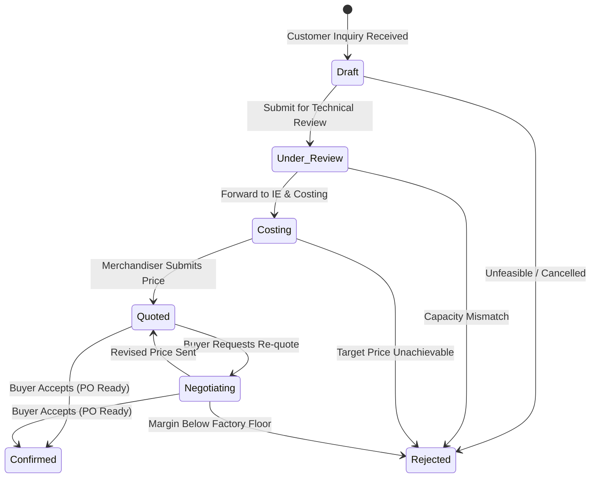

# Product Requirements Document (PRD)
**Module:** 03 - Buyer Inquiry & Pre-Order Management Pipeline
**Document Version:** 1.0 (Enterprise Specification)
**Author:** Lead RMG Enterprise Solution Architect
**Status:** Approved for Implementation

---

## 1. Executive Summary
Buyer Inquiry Management governs the pre-order lifecycle in woven garments manufacturing. Before an international buyer issues a formal Purchase Order (PO) / Sales Contract, extensive feasibility reviews, proto-sampling, CAD consumption estimation, IE costings, price quotations, and buyer negotiations take place. 

This module provides 100% visibility into the sales pipeline, tracks conversion hit-rates, and bridges Buyer Master enrollment with Order Execution.

---

## 2. Target Personas
1. **Merchandising Lead / Manager:** Registers buyer inquiries, tracks stage progressions, and generates price quotations.
2. **Industrial Engineering (IE) & Costing Engineer:** Analyzes garment operations, computes standard minute values (SMV), and establishes garment CM (Cost of Making).
3. **General Manager (Marketing / Commercial):** Reviews quoted prices, manages buyer negotiations, and approves order confirmation.
4. **Sample Room Manager:** Coordinates proto, fit, and PP sample submissions.

---

## 3. Sub-Module & Feature Details

### 3.1. Sub-module: Buyer Inquiry Pipeline
Captures new inquiries received from international brands, buying houses, or retail sourcing hubs.

#### 3.1.1. Field Level Validations
| Field Name | Type | Mandatory | Validation Rules | UI Component |
|---|---|---|---|---|
| `Inquiry No` | String | Auto (Yes) | Immutable, auto-generated sequentially per year (e.g. `INQ-2026-00001`). | Read-Only Badge |
| `Buyer ID` | UUID | Yes | Must exist in `buyers` table and be Active. | Searchable Dropdown |
| `Buyer Brand ID` | UUID | No | Associated brand label of the selected buyer. | Select Dropdown |
| `Buyer Department ID` | UUID | No | Specific buyer division (e.g. Men's Wear, Kids). | Select Dropdown |
| `Nominated LC Company` | UUID | Yes | Primary sister company in Group receiving contract. | Select Dropdown |
| `Product Category` | Enum | Yes | Options: Woven, Denim, Knit, Outerwear, Workwear. | Select Dropdown |
| `Item Name` | String | Yes | Specific garment name (e.g. Long Sleeve Poplin Shirt). | Text Input |
| `Item Description` | Text | No | Construction, fabric specs, artwork notes. Max: 1000 chars. | Textarea |
| `Target Quantity` | Integer | Yes | Min: 1 piece. | Number Input |
| `Target FOB Price` | Decimal | Yes | Price per piece (2 decimal places). Min: 0.00. | Number Input |
| `Currency` | String | Yes | Default inherited from Buyer Master (e.g. USD, EUR). | Select Dropdown |
| `Target Shipment Date`| Date | Yes | Ex-factory target shipment deadline. | Date Picker |
| `Sampling Requirement`| String | No | Proto & Fit, Size-Set, PP Sample Only, Direct Production. | Select Dropdown |
| `Tech Pack Path` | String | No | Private cloud URL to buyer tech pack document. | File / URL Input |
| `Status` | Enum | Yes | Stages: Draft, Under Review, Costing, Quoted, Negotiating, Confirmed, Rejected, Cancelled. | Status Badge & Stage Bar |
| `Rejection Reason` | Text | Conditional| Mandatory if status changes to `Rejected`. | Text Input |

#### 3.1.2. Pipeline State Transitions

---

## 4. Architectural Integrity & Strict Rules
1. **Pure Server-Side Validation:** Form submission handles error validation strictly from backend HTTP 422 JSON errors with `noValidate` enabled on forms.
2. **No Modals Standard:** All inquiry lists, creations, reviews, and status transitions occur exclusively in dedicated full-page views.
3. **Traceability Interlock:** Once an inquiry transitions to `Confirmed`, it unlocks downstream Style generation and PO booking in Module 03/04.
