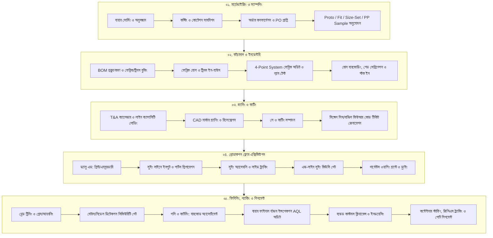

# Standard Operating Procedure (SOP): End-to-End RMG Woven Manufacturing & Traceability Lifecycle
## বায়ার সোর্সিং থেকে ফাইনাল কন্টেইনার শিপমেন্ট: পূর্ণাঙ্গ বিজনেস প্রসেস ব্লুপ্রিন্ট
**ডকুমেন্ট কোড:** `TFRMG-SOP-E2E-LIFECYCLE-V1.0`  
**প্রজেক্ট:** TraceFlow RMG — Precision Fabric-to-Freight Garment Intelligence  
**প্রযোজ্য শিল্প:** ওভেন গার্মেন্টস (শার্ট, ট্রাউজার, ডেনিম, জ্যাকেট ও কার্গো ম্যানুফ্যাকচারিং ও এক্সপোর্ট)  
**কমপ্লায়েন্স স্ট্যান্ডার্ড:** ISO 9001:2015, AQL 1.5/2.5 Sampling Inspection, GOTS, OEKO-TEX Standard 100, NBR Bonded Warehouse Regulations  
**ভাষা:** বাংলা (Bangla - Business Standard)

---

## সূচিপত্র (Table of Contents)
1. **সামগ্রিক এন্ড-টু-এন্ড প্রসেস ফ্লো ডায়াগ্রাম (High-Level Process Architecture)**
2. **পর্যায় ০১: বায়ার সোর্সিং, মার্চেন্ডাইজিং ও অর্ডার প্রকিউরমেন্ট (Buyer Sourcing to Confirmed PO)**
3. **পর্যায় ০২: স্যাম্পলিং ও টেকনিক্যাল ডেভেলপমেন্ট (Technical Specs & Sampling Approvals)**
4. **পর্যায় ০৩: কাঁচামাল সোর্সিং, প্রকিউরমেন্ট ও কোয়ালিটি ল্যাব অডিট (Raw Material Sourcing & QC)**
5. **পর্যায় ০৪: গুদামজাতকরণ, ইনভেন্টরি ও লট/রোল বারকোডিং (Fabric & Trims Warehouse Management)**
6. **পর্যায় ০৫: ইন্ডাস্ট্রিয়াল ইঞ্জিনিয়ারিং (IE) ও প্রোডাকশন প্ল্যানিং (Line Balancing & Loading)**
7. **পর্যায় ০৬: ফ্যাব্রিক স্প্রেডিং, প্যাটার্ন মার্কার ও কাটিং এক্সিকিউশন (Spreading, Cutting & Bundling)**
8. **পর্যায় ০৭: ভ্যালু অ্যাডিশন (প্রিন্ট, এমব্রয়ডারি ও ওয়াশ পার্টস - Optional Gate)**
9. **পর্যায় ০৮: সুইং লাইন লোডিং, এসেম্বলি ও কিউসি গেট (Sewing Line Tracking & Inline/Endline QC)**
10. **পর্যায় ০৯: ইন্ডাস্ট্রিয়াল গার্মেন্টস ওয়াশিং ও ট্রিটমেন্ট (Industrial Laundry & Garment Wash)**
11. **পর্যায় ১০: ফিনিশিং, আয়রনিং ও মেজারমেন্ট অডিট (Finishing & Metal Detection)**
12. **পর্যায় ১১: বায়ার প্যাকিং, কার্টনিং ও বারকোড অ্যাসোর্টমেন্ট (Packing & Carton Consolidation)**
13. **পর্যায় ১২: ফাইনাল কোয়ালিটি ইন্সপেকশন (Buyer Pre-Shipment Inspection - FRI/AQL)**
14. **পর্যায় ১৩: কমার্শিয়াল এক্সপোর্ট ডকুমেন্টেশন, বন্ড ও কাস্টমস ক্লিয়ারেন্স (Commercial & Customs)**
15. **পর্যায় ১৪: কন্টেইনার লোডিং, সীলিং ও পোর্ট শিপমেন্ট (CFS/Port Stuffing & Handover)**
16. **প্রসেস মেমরি ও ট্রেসেবিলিটি রুলস (Strict System Enforcement Rules)**

---

## ১. সামগ্রিক এন্ড-টু-এন্ড প্রসেস ফ্লো ডায়াগ্রাম

---

## পর্যায় ০১: বায়ার সোর্সিং, মার্চেন্ডাইজিং ও অর্ডার প্রকিউরমেন্ট

### ১.১ বায়ার এনকোয়ারি ও টেক-প্যাক (Tech-Pack) পর্যালোচনা
- **কার্যক্রম:** বায়ার বা বাইং হাউস থেকে গার্মেন্টস স্টাইলের স্কেচ, মেজারমেন্ট চার্ট, বিল অফ ম্যাটেরিয়ালস (BOM), প্রিন্ট/এমব্রয়ডারি আর্টওয়ার্ক এবং ফেব্রিক স্পেসিফিকেশন সম্বলিত টেক-প্যাক সংগ্রহ করা।
- **দায়িত্বপ্রাপ্ত:** মার্চেন্ডাইজিং টিম (Merchandising Lead)।
- **আউটপুট:** স্টাইল ফিজিবিলিটি রিপোর্ট ও রিক্যাপ শীট।

### ১.২ কনসাম্পশন ও কস্টিং শিট প্রণয়ন (Consumption & Pre-Costing)
- **কার্যক্রম:** 
  1. ক্যাড (CAD) টিম দ্বারা টেস্ট মার্কারের মাধ্যমে কাপড়ের প্রকৃত কনসাম্পশন (Yds/Dzn বা Mtr/Dzn) বের করা।
  2. সুতা, ফেব্রিক, বাটন, জিপার, ইন্টারলাইনিং, লেবেল, পলি, কার্টন ইত্যাদির দাম এবং সিএম (Cost of Making - CM), ওয়াশ খরচ ও ফ্রেইট যোগ করে প্রাক-কস্টিং তৈরি।
- **আউটপুট:** অনুমোদিত প্রি-কস্টিং শীট (Pre-Costing Sheet)।

### ১.৩ প্রাইস নেগোসিয়েশন ও পারচেজ অর্ডার (Purchase Order - PO) কনফার্মেশন
- **কার্যক্রম:** বায়ারের সাথে প্রাইস নেগোসিয়েশন শেষে বায়ার অফিসিয়াল পারচেজ অর্ডার (Sales Contract / PO) ইস্যু করে।
- **সিস্টেম এন্ট্রি:** TraceFlow সিস্টেমে PO নম্বর, বায়ার কোড, স্টাইল নম্বর, সাইজ-কালার কোয়ান্টিটি ব্রেকডাউন এবং এক্স-ফ্যাক্টরি শিপমেন্ট ডেট এন্ট্রি।
- **আউটপুট:** সিস্টেমে ভ্যালিড সেলস অর্ডার (Sales Order Confirmation)।

---

## পর্যায় ০২: স্যাম্পলিং ও টেকনিক্যাল ডেভেলপমেন্ট

একটি বায়ার অর্ডার চূড়ান্ত উৎপাদনের আগে নিচের ধাপগুলোতে স্যাম্পল অনুমোদিত হতে হয়:

1. **প্রোটো স্যাম্পল (Proto Sample):** প্রাথমিক ডিজাইন ও সিলুয়েট যাচাইয়ের জন্য বিকল্প ফ্যাব্রিকে তৈরি স্যাম্পল।
2. **ফিট স্যাম্পল (Fit Sample):** বায়ারের ড্রপ বা লাইভ ডামি মডেলে ফিটিংস ও ড্র্যাপ যাচাই।
3. **সাইজ-সেট স্যাম্পল (Size-Set Sample):** অর্ডারকৃত প্রতিটি সাইজের (XS থেকে XXL বা 28 থেকে 38) মেজারমেন্ট ও গ্র্যাডিং স্পেক যাচাই।
4. **সেলস-ম্যান স্যাম্পল (SMS - Salesman Sample):** বায়ারের বাৎসরিক রিটেইল বুকিং ও শোরুম ডিসপ্লের জন্য প্রকৃত ফেব্রিক ও ট্রিমসে তৈরি।
5. **প্রি-প্রোডাকশন স্যাম্পল (PP Sample):** মূল বাল্ক ফ্যাব্রিক, আসল লেবেল, থ্রেড ও ওয়াশে তৈরি ১০০% ফাইনাল স্যাম্পল।
- **গেটকিপার চেক:** বায়ার বা মার্চেন্ডাইজার কর্তৃক **PP Sample Approved** স্ট্যাটাস না পাওয়া পর্যন্ত কাটিং ফ্লোরে ফেব্রিক কাটার অনুমতি সম্পূর্ণ ব্লক থাকবে।

---

## পর্যায় ০৩: কাঁচামাল সোর্সিং, প্রকিউরমেন্ট ও কোয়ালিটি ল্যাব অডিট

### ৩.১ ম্যাটেরিয়াল রিকোয়ারমেন্ট প্ল্যানিং (MRP / BOM Generation)
- **কার্যক্রম:** চূড়ান্ত অর্ডার কোয়ান্টিটি ও এক্সট্রা কাটিং পার্সেন্টেজ হিসাব করে প্রকৃত ম্যাটেরিয়ালের ক্রয়াদেশ তৈরি।
- **দায়িত্বপ্রাপ্ত:** মার্চেন্ডাইজিং ও সেন্ট্রাল প্রকিউরমেন্ট টিম।

### ৩.২ ব্যাক-টু-ব্যাক এলসি (Back-to-Back LC) ও সাপ্লায়ার পারচেজ অর্ডার
- **কার্যক্রম:** ফেব্রিক মিল ও ট্রিমস ভেন্ডরদের অনুকূলে ব্যাক-টু-ব্যাক এলসি ওপেন করে মেটেরিয়াল বুকিং দেওয়া।

### ৩.৩ ল্যাব-ডিপ, স্ট্রাইক-অফ ও হ্যান্ডলুম অনুমোদন
- **কার্যক্রম:**
  - ফেব্রিকের সঠিক শেডের জন্য কালার ল্যাব-ডিপ (Lab-Dip A/B/C/D) বায়ার কর্তৃক অনুমোদন।
  - প্রিন্ট আইটেমের জন্য স্ট্রাইক-অফ (Strike-off) এবং ওভেন ইয়ার্ন ডাইডের জন্য হ্যান্ডলুম সোয়াচ অনুমোদন।

### ৩.৪ কাঁচামাল ইন-হাউস ও ফিজিক্যাল রিসিভিং
- **কার্যক্রম:** ফেব্রিক মিল ও ট্রিমস ফ্যাক্টরি থেকে মালামাল ফ্যাক্টরি মেইন গেট দিয়ে আনলোড হওয়া। কমার্শিয়াল চালান ও ইনভয়েসের সাথে ফিজিক্যাল ভেরিফিকেশন।

---

## পর্যায় ০৪: গুদামজাতকরণ, ইনভেন্টরি ও লট/রোল বারকোডিং

### ৪.১ ফেব্রিক ইন্সপেকশন (4-Point System Audit)
- **আন্তর্জাতিক স্ট্যান্ডার্ড:** ASTM D5430 (Standard 4-Point System)।
- **কার্যক্রম:**
  - মোট চালানের ন্যূনতম ১০% ফেব্রিক রোল ফ্যাব্রিক ইন্সপেকশন মেশিনে টেনে ত্রুটি (Hole, Slub, Yarn breakage, Weaving fault) পরীক্ষা করা।
  - ১০০ স্কয়ার ইয়ার্ডে ডিমেরিট পয়েন্ট হিসাব করে বায়ার টলারেন্স (সাধারণত ২০ থেকে ৪০ পয়েন্টের কম) অনুযায়ী রোল **Pass** অথবা **Reject** করা।

### ৪.২ ইন-হাউস ল্যাব টেস্ট (Fabric Physical & Chemical Testing)
- **পরীক্ষাসমূহ:**
  1. **জিএসএম টেস্ট (GSM):** ফ্যাব্রিক ওজন প্রতি বর্গমিটারে ঠিক আছে কি না (GSM Cutter ও Digital Balance)।
  2. **শ্রিনকেজ টেস্ট (Washing Shrinkage):** কাপড় ধোয়ার পর দৈর্ঘ্য ও প্রস্থে কতটুকু সংকুচিত হয় (Lengthwise & Widthwise %)।
  3. **কালার ফাস্টনেস টেস্ট (Color Fastness):** ঘষাঘষি (Crocking), রোদে (Light) বা ধোয়ায় রঙ উঠে কি না।
  4. **টুইস্টিং / স্পাইরালিটি টেস্ট (Torque/Spirality):** ওভেন স্ট্রাকচার বেঁকে যায় কি না।

### ৪.৩ ফ্যাব্রিক রোল বারকোডিং ও শেড সেগ্রিগেশন (Shade Grouping)
- **কার্যক্রম:** প্রতিটি রোলের গায়ে ইউনিক বারকোড/কিউআর কোড স্টিকার লাগানো (রোল আইডি, রোল লেন্থ, জিএসএম, শ্রিনকেজ গ্রুপ, শেড লট: A, B, C, D)।
- **সিস্টেম রুল:** শেড-লট আলাদা র্যাকে বিন্যস্ত রাখা হবে যাতে কাটিংয়ে কোনো অবস্থাতেই এক শেডের সাথে অন্য শেড মিশ্রিত না হয়।

### ৪.৪ ট্রিমস ও অ্যাক্সেসরিজ ইন্সপেকশন
- **কার্যক্রম:** বাটন, জিপার টেনসাইল টেস্ট, ড্রস্ট্রিং লেন্থ, ইন্টারলাইনিং বন্ডিং টেস্ট এবং রিভেট অডিট।

---

## পর্যায় ০৫: ইন্ডাস্ট্রিয়াল ইঞ্জিনিয়ারিং (IE) ও প্রোডাকশন প্ল্যানিং

### ৫.১ টাইম অ্যান্ড অ্যাকশন (T&A) ক্যালেন্ডার ট্র্যাকিং
- প্রতিটি অর্ডারের ফ্যাব্রিক ইন-হাউস, পিপি মিটিং, পাইলট রান, সুইং ইনপুট, ওয়াশ ডেট, ফাইনাল ইন্সপেকশন ও এক্স-ফ্যাক্টরি ডেট ক্যালেন্ডারে লক করা।

### ৫.২ অপারেশন ব্রেকডাউন (OB) ও এসভ্যালু (SMV Calculation)
- **কার্যক্রম:** আইই (IE) ইঞ্জিনিয়ার প্রতিটি স্টাইলের সেলাই অপারেশন চুলচেরা বিশ্লেষণ করেন (যেমন: ফ্রন্ট পার্ট মেকিং, ব্যাক পকেট হেম, কলার জয়েন্ট, স্লিভ এটাচ)।
- **মেশিন বরাদ্দ:** প্রতিটি অপারেশনের জন্য মেশিন স্পেসিফিকেশন (SNLS, Overlock, Feed-off-the-arm, Kansai, Bar-tack) নির্ধারণ এবং স্ট্যান্ডার্ড মিনিট ভ্যালু (SMV) গণনা।

### ৫.৩ লাইন ক্যাপাসিটি ও ব্যালেন্সিং চার্ট (Line Loading Plan)
- **কার্যক্রম:** নির্ধারিত আউটপুট টার্গেটের সাথে সামঞ্জস্য রেখে অপারেটরের স্কিল ম্যাট্রিক্স অনুযায়ী লাইনের প্রতিটি মেশিনে কাজের সুষম বণ্টন (Pitch Time & Bottleneck management)।

### ৫.৪ প্রি-প্রোডাকশন (PP) মিটিং ও পাইলট রান
- **উপস্থিতি:** ফ্যাক্টরি জিএম, প্রোডাকশন ম্যানেজার, কিউসি হেড, কাটিং মাস্টার, সুইং সুপারভাইজার, টেকনিশিয়ান ও মার্চেন্ডাইজার।
- **উদ্দেশ্য:** বায়ার কমেন্টস রিভিউ করা, সম্ভাব্য ত্রুটিগুলো চিহ্নিত করা এবং ৫০ থেকে ১০০ পিসের একটি পাইলট রান চালিয়ে লাইনের মেশিন সেটআপ চেক করা।

---

## পর্যায় ০৬: ফ্যাব্রিক স্প্রেডিং, প্যাটার্ন মার্কার ও কাটিং এক্সিকিউশন

### ৬.১ ফ্যাব্রিক রিলাক্সেশন (Fabric Relaxation)
- ওভেন ও ডেনিম কাপড়ের রোল কাটার পূর্বে আনরোল করে ন্যূনতম ১২ থেকে ২৪ ঘণ্টা খোলা বাতাসে রিলাক্সেশনে রাখা হয় যাতে ইন্টারনাল টেনশন দূর হয় এবং কাটার পর কাপড় সংকুচিত না হয়।

### ৬.২ সিএডি মার্কার মেকিং ও রেশিও প্ল্যানিং (CAD Marker Planning)
- বায়ারের সাইজ রেশিও (যেমন: S:M:L:XL = 1:2:2:1) অনুযায়ী সর্বোচ্চ ফ্যাব্রিক ইউটিলাইজেশন (Efficiency > ৮৭%) নিশ্চিত করে কম্পিউটারাইজড মার্কার প্লট প্রিন্ট করা।

### ৬.৩ ফ্যাব্রিক লেইং ও স্প্রেডিং (Spreading / Laying)
- কাটিং টেবিলে মার্কারের দৈর্ঘ্য অনুযায়ী কাপড় একের পর এক প্লাই (Ply) বিছানো (সাধারণত ৫০ থেকে ১০০ প্লাই পর্যন্ত)। প্লাইয়ের উচ্চতা ও টেনশন নিয়মিত চেক করা।

### ৬.৪ কাটিং এক্সিকিউশন (Straight Knife / Automatic CNC Cutting)
- কম্পিউটারাইজড সিএনসি কাটার বা সোজা ছুরির কাটিং মেশিন (Straight Knife) দিয়ে সুনির্দিষ্ট ব্লেড অ্যাকুরেসিতে প্লাই কাটা।

### ৬.৫ নম্বরিং ও সিঙ্গেল-পিস / বান্ডিল টিকিট কিউআর কোডিং (QR Bundling)
- **ট্রেসেবিলিটি কোয়ালিটি রুল:**
  - প্রতিটি কাটিং পার্টসের গায়ে প্লাই নম্বর স্টিকার লাগানো (যাতে এক প্লাইয়ের পার্টের সাথে অন্য প্লাইয়ের পার্ট মিক্স না হয়)।
  - সিস্টেম স্বয়ংক্রিয়ভাবে ২০ বা ১০ পিসের বান্ডিল তৈরি করবে এবং প্রতিটি বান্ডিলের জন্য **TraceFlow Unique Dynamic QR Code** প্রিন্ট করবে।
  - এই কিউআর কোডে যুক্ত থাকে: PO নম্বর, স্টাইল, কালার, সাইজ, কাট নম্বর, বান্ডিল নম্বর, রোল নম্বর এবং ফ্যাব্রিক শেড লট।

---

## পর্যায় ০৭: ভ্যালু অ্যাডিশন (প্রিন্ট, এমব্রয়ডারি ও ওয়াশ পার্টস - Optional Gate)

যদি কোনো স্টাইলে প্যানেল প্রিন্ট বা এমব্রয়ডারি থাকে:
1. **কাটিং গেটওয়ে আউট (Scan-OUT):** কাটিং ফ্লোর থেকে বান্ডিলগুলো প্রিন্ট বা এমব্রয়ডারি সেকশনে পাঠানোর সময় কিউআর স্ক্যান করে রিলিজ করা।
2. **প্রসেসিং ও কোয়ালিটি গেট:** প্রিন্টিং (স্ক্রিন, রোটারি বা ডিজিটাল) বা কম্পিউটারাইজড এমব্রয়ডারি সম্পাদন।
3. **গেটওয়ে ইন (Scan-IN):** কাজ শেষে সুইং লাইনে আসার পূর্বে প্রতিটি বান্ডিল স্ক্যান করে রিসিভ করা এবং কোনো পার্টস নষ্ট বা ডিফেক্টিভ হলে সিস্টেমে "Damaged Panel" রিপোর্ট করে কাটিং থেকে রি-কাট রিকোয়েস্ট পাঠানো।

---

## পর্যায় ০৮: সুইং লাইন লোডিং, এসেম্বলি ও কিউসি গেট

### ৮.১ সুইং লাইন ইনপুট (Line Input Scan)
- বান্ডিলগুলো নির্ধারিত সুইং লাইনের ফিডিং টেবিলে প্রবেশ করার সময় লাইভ ট্যাবলেট দিয়ে স্ক্যান করা হয় (`Line In`).
- **সিস্টেম লক:** যদি ভিন্ন শেড লট বা ভুল অর্ডারের বান্ডিল স্ক্যান করা হয়, সিস্টেম সাথে সাথে লাল স্ক্রিন অ্যালার্ট দিয়ে শব্দ করবে এবং ইনপুট ব্লক করবে।

### ৮.২ পার্টস প্রিপারেশন ও সেকশনাল এসেম্বলি
- ফ্রন্ট পার্ট মেকিং, ব্যাক পার্ট মেকিং, কলার ও কাফ প্রিপারেশন সমান্তরালভাবে বিভিন্ন মেশিনে তৈরি হয়।

### ৮.৩ ইন-লাইন কোয়ালিটি কন্ট্রোল (Roaming QC Inspection)
- কিউসি অডিটররা চলমান সুইং লাইনের ভেতরে মেশিন টু মেশিন পরিদর্শন করবেন (মেশিন টেনশন, স্টিচ পার ইঞ্চি - SPI, সিম অ্যালাইনমেন্ট চেক)।

### ৮.৪ এন্ড-লাইন কোয়ালিটি গেট (End-Line QC Inspection Station)
- লাইনের শেষে সম্পূর্ণ সেলাইকৃত গার্মেন্টসটি ১০০% ফিজিক্যাল পরীক্ষা করা হয়।
- প্রতিটি গার্মেন্টসের বান্ডিল কিউসি ট্যাবলেটে স্ক্যান করে ৩টি অপশনের যেকোনো একটি সিলেক্ট করা হয়:
  1. **Pass (Approved):** গার্মেন্টস শতভাগ ত্রুটিহীন $\rightarrow$ পরবর্তী ওয়াশ/ফিনিশিংয়ের জন্য অনুমোদিত।
  2. **Rework (Alteration):** সামান্য স্টিচ মিস বা খোলা সিম $\rightarrow$ সিস্টেমে নির্দিষ্ট ডিফেক্ট কোড (e.g. `DEF-SW-01 Broken Stitch`) সিলেক্ট করে সংশ্লিষ্ট অপারেটরের কাছে পাঠানো।
  3. **Reject (Garbage/Scrap):** অপূরণীয় ক্ষতি (ব্লেড কাট, বড় ধরনের ছিদ্র) $\rightarrow$ পার্মানেন্ট রিজেক্ট হিসেবে রেকর্ড।
- **ডিএইচইউ হিসাব (DHU):** ডিফেক্ট রেট স্বয়ংক্রিয়ভাবে হিসাব হয়ে ফ্লোর মনিটরে লাইভ প্রদর্শিত হয়।

---

## পর্যায় ০৯: ইন্ডাস্ট্রিয়াল গার্মেন্টস ওয়াশিং ও ট্রিটমেন্ট

(বিশেষ করে ডেনিম, ক্যাজুয়াল ট্রাউজার ও ওভেন শার্টের জন্য প্রযোজ্য)

### ৯.১ ওয়াশ ডেলিভারি চালান ও ব্যাচিং
- সুইং ফিনিশড গার্মেন্টস ওয়াশিং প্ল্যান্টে প্রেরণের পূর্বে ওয়াশ ব্যাচ তৈরি করা হয়।

### ৯.২ ওয়াশিং প্রক্রিয়া (Wet & Dry Process)
- **ড্রাই প্রসেস:** হুইসকারিং (Whiskering), স্যান্ডিং/স্ক্র্যাপিং (Hand Scraping), ডেস্ট্রয়/রিপিং (Destroying/Grinding)।
- **ওয়েট প্রসেস:** এনজাইম ওয়াশ (Enzyme Wash), স্টোন ওয়াশ (Stone Wash), ব্লিচ ওয়াশ (Bleach Wash), পিগমেন্ট ডাই বা সিলিকন সফটনার ট্রিটমেন্ট।

### ৯.৩ হাইড্রো ও ড্রাইং (Hydro-Extraction & Tumble Drying)
- পানি নিষ্কাশন এবং নিয়ন্ত্রিত তাপমাত্রার ড্রায়ারে সম্পূর্ণ শুকানো।

### ৯.৪ পোস্ট-ওয়াশ কোয়ালিটি ও ল্যাব শেড ব্যান্ড অডিট
- ওয়াশ শেষে বায়ারের মূল মাস্টার সোয়াচ বা শেড ব্যান্ডের সাথে ওয়াশ করা পোশাক মিলিয়ে দেখা হয় (Light, Medium, Dark Shade Sort)।

---

## পর্যায় ১০: ফিনিশিং, আয়রনিং ও মেজারমেন্ট অডিট

### ১০.১ থ্রেড ট্রিমিং ও সাকিং (Thread Trimming & Sucking)
- অতিরিক্ত বাড়তি সুতা নিখুঁতভাবে কাটা এবং থ্রেড সাকিং মেশিনের মাধ্যমে আলগা সুতা পরিষ্কার করা।

### ১০.২ বাটন এটাচ ও আইলেট বাটন-হোল (Button Attach & Hole)
- অটোমেটিক মেশিনের মাধ্যমে বোতাম ও আইলেট হোল তৈরি এবং বোতামের পুল-টেস্ট (ন্যূনতম ৯ কেজি বা ৯০ নিউটন শক্তি সহনশীলতা পরীক্ষা)।

### ১০.৩ ফাইনাল আয়রনিং ও প্রেসিং (Steam Pressing / Tunnel Finisher)
- ভ্যাকুয়াম স্টিম আয়রনিং টেবিল বা টানেল ফিনিশারে সম্পূর্ণ রিঙ্কেল-মুক্ত এবং শেপে আনা।

### ১০.৪ মেজারমেন্ট অডিট (100% Measurement Audit)
- অনুমোদিত স্পেক শীটের সাথে বুকের মাপ, কোমর, ইনসিম, হাতা ও কলারের প্রতিটি সাইজের টলারেন্স (+/- টলারেন্স সাধারণত ০.৫ সেমি) যাচাই।

### ১০.৫ মেটাল / নিডেল ডিটেকশন সিকিউরিটি গেট (Metal Detection Test)
- **বায়ার গ্লোবাল সিকিউরিটি ম্যান্ডেট:** বাচ্চাদের পোশাক এবং আন্তর্জাতিক বায়ারদের পোশাকের ভেতর যাতে কোনো ভাঙা সুইয়ের টুকরো বা ধাতব কণা না থাকে।
- **প্রক্রিয়া:** ক্যালিব্রেটেড মেটাল ডিটেক্টর মেশিনের কনভেয়র বেল্ট দিয়ে প্রতিটি পোশাক পাস করা হয়। কোনো ধাতুর কণা পেলে স্বয়ক্রিয় অ্যালার্ম বেজে বেল্ট উল্টো ঘুরে যাবে।
- **লগবুক:** প্রতি ১ ঘণ্টা অন্তর ৯-পয়েন্ট টেস্ট ক্যালিবার দিয়ে মেটাল ডিটেক্টর যাচাই ও লগবুকে সই করা।

---

## পর্যায় ১১: বায়ার প্যাকিং, কার্টনিং ও বারকোড অ্যাসোর্টমেন্ট

### ১১.১ প্রাইস টিকিট, বারকোড ও হ্যাংট্যাগ এটাচমেন্ট
- বায়ার কর্তৃক প্রদত্ত অফিশিয়াল বারকোড, আরএফআইডি (RFID Tag), প্রাইস টিকিট এবং কেয়ার লেবেল সঠিক পজিশনে লাগানো।

### ১১.২ সিঙ্গেল পলি / ব্লিস্টার পলি প্যাকিং
- ফোল্ডিং বোর্ড অনুযায়ী নির্দিষ্ট ভাজে ভাঁজ করে আর্দ্রতা শোষণের জন্য সিলিকা জেলসহ (Silica Gel) পলি ব্যাগে সিল করা।

### ১১.৩ কার্টনিং ও অ্যাসোর্টমেন্ট ট্র্যাকিং (Cartoning & Barcode Scanning)
- **সলিড কার্টন (Solid Color Solid Size):** এক কার্টনে শুধু একটি নির্দিষ্ট কালার ও সাইজ থাকবে।
- **অ্যাসোর্টেড কার্টন (Ratio Packing):** এক কার্টনে বিভিন্ন সাইজের পোশাক নির্দিষ্ট অনুপাতে থাকবে।
- **ট্রেসেবিলিটি রুল:** প্রতিটি কার্টনে ঢুকানোর সময় পোশাকগুলো স্ক্যান করা হয় (`TraceFlow Carton Inward`)। নির্ধারিত সংখ্যার এক পিস বেশি বা কম হলে কার্টন ক্লোজ করা যাবে না। কার্টন পূর্ণ হলে একটি **Unique Shipping Carton Barcode (SSCC-18 Code)** প্রিন্ট হয়ে কার্টনে পেস্ট হবে।

---

## পর্যায় ১২: ফাইনাল কোয়ালিটি ইন্সপেকশন (Buyer Pre-Shipment Inspection)

### ১২.১ ইন্টারনাল কিউএ অডিট (Internal QA Audit)
- ফ্যাক্টরির নিজস্ব হেড অফ কোয়ালিটি (Head of QA) বায়ারের অডিটের পূর্বে মিল র‍্যান্ডমলি স্যাম্পলিং করে সম্পূর্ণ অর্ডার অডিট করেন।

### ১২.২ বায়ার থার্ড পার্টি ফাইনাল র্যান্ডম ইন্সপেকশন (FRI / AQL Inspection)
- বায়ারের কোয়ালিটি অডিটর অথবা থার্ড পার্টি এজেন্সি (যেমন: SGS, Intertek, Bureau Veritas, TUV) ফ্যাক্টরিতে উপস্থিত হয়ে পরিদর্শন করে।
- **স্ট্যান্ডার্ড:** ANSI/ASQ Z1.4 (ISO 2859-1) AQL General Inspection Level II (Critical: 0, Major: 1.5/2.5, Minor: 4.0)।
- **ফলাফল:** অডিট সফল হলে অডিটর **Inspection Certificate (IC)** ইস্যু করেন। ফেল করলে পুনরায় রি-কার্টনিং বা ১০০% রি-চেক করতে হয়।

---

## পর্যায় ১৩: কমার্শিয়াল এক্সপোর্ট ডকুমেন্টেশন, বন্ড ও কাস্টমস ক্লিয়ারেন্স

ইন্সপেকশন সার্টিফিকেট (IC) প্রাপ্তির পর কমার্শিয়াল ও শিপিং টিম নিচের অফিসিয়াল এক্সপোর্ট পেপারস প্রস্তুত করে:
1. **কমার্শিয়াল ইনভয়েস (Commercial Invoice):** পণ্যের আন্তর্জাতিক মূল্য বিবরণ।
2. **প্যাকিং লিস্ট (Packing List):** কার্টন সংখ্যা, গ্রস ওয়েট, নেট ওয়েট এবং CBM (Cubic Meters) আয়তন।
3. **সার্টিফিকেট অফ অরিজিন (Country of Origin - COO):** ইপিবি (EPB) বা চেম্বার অফ কমার্স কর্তৃক প্রত্যয়ন।
4. **এক্সপোর্ট পারমিট (EXP):** বাংলাদেশ ব্যাংক কর্তৃক অনুমোদিত এক্সপোর্ট ফর্ম।
5. **বিল অফ এন্ট্রি ও বন্ডেড ওয়্যারহাউস ডিউটি রেজিস্টার ক্লিয়ারেন্স:** বন্ডেড সুবিধার আওতায় আনা কাপড়ের বিপরীতে রপ্তানির হিসাব সমন্বয়।

---

## পর্যায় ১৪: কন্টেইনার লোডিং, সীলিং ও পোর্ট শিপমেন্ট

### ১৪.১ কন্টেইনার স্টাফিং (Container Stuffing Inspection)
- ফ্যাক্টরির ড্রাইভওয়েতে ২০ ফুট বা ৪০ ফুট হাই-কিউব (40ft HQ) কন্টেইনার আনলোড থাকা অবস্থায় মেঝে শুকনো ও ফুটোমুক্ত কি না পরীক্ষা করা।
- কার্টনগুলো স্ক্যান করে কন্টেইনারে লোড করা (`Carton Dispatch Scan`).

### ১৪.২ বুলেট সিকিউরিটি সীল ও লক (High-Security Bolt Seal)
- বায়ারের মনোনীত শিপিং লাইনের ইউনিক নম্বর সম্বলিত হাই-সিকিউরিটি মেটাল বোল্ট সীল দিয়ে কন্টেইনার সিল করা।

### ১৪.৩ জিপিএস ট্র্যাকিং ও পোর্ট হ্যান্ডওভার (Port/Chittagong CFS Handover)
- কভার্ড ভ্যান বা কন্টেইনার ট্রেইলার জিপিএস ট্র্যাকারসহ চট্টগ্রাম সমুদ্র বন্দর (Chittagong Port) বা ঢাকা এয়ারপোর্টের উদ্দেশ্যে রওনা হয়।
- শিপিং লাইন কনটেইনার জাহাজে তুলে **Bill of Lading (B/L)** অথবা **Air Waybill (AWB)** ইস্যু করে।

---

## ১৫. কমপ্লিট ট্রেসেবিলিটি ও কোয়ালিটি সিকিউরিটি রুলস (Strict System Enforcement)

TraceFlow RMG সিস্টেমে পুরো লাইফসাইকেল জুড়ে নিচের এন্টারপ্রাইজ রুলগুলো স্বয়ংক্রিয়ভাবে হার্ডকোডেড থাকবে:

| স্তর | প্রসেস | ট্রেসেবিলিটি গার্ড ও অটোমেটেড রুল (System Lock) |
|---|---|---|
| **১** | কাটিং | `PP Sample` অনুমোদন না থাকলে কাটিং প্ল্যানার কোনো কাটিং অর্ডার লক করতে পারবে না। |
| **২** | বান্ডলিং | প্রতিটি বান্ডিলের কিউআর কোডে ফেব্রিক রোলের লট এবং শেড মার্কার এনকোডেড থাকবে। |
| **৩** | সুইং ইনপুট | পূর্ববর্তী কাটিং স্ক্যান না থাকলে বা প্রিন্টিং গেট ইনপুট না থাকলে সুইং লাইনে মাল ঢুকবে না (Anti-Skip Rule)। |
| **৪** | শেড গার্ড | একই লাইনে একসাথে একাধিক ভিন্ন শেড লটের বান্ডিল ফিড করলে লাইন স্ক্যানার এরর দিবে। |
| **৫** | কিউসি গেট | এন্ড-লাইন কিউসি থেকে `Pass` কিউআর ট্যাগ না পেলে ফিনিশিং বা ওয়াশিং প্রসেস মাল রিসিভ করতে পারবে না। |
| **৬** | মেটাল অডিট | মেটাল ডিটেকশন মেশিনের পাস টাইমস্ট্যাম্প ছাড়া কোনো গার্মেন্টস পলি বা প্যাকিং টেবিলে কাউন্ট হবে না। |
| **৭** | কার্টনিং | বায়ারের প্যাকিং রেশিওর এক পিস বেশি বা কম থাকলে কার্টনের বারকোড লেবেল জেনারেট হবে না। |
| **৮** | ডিলিশন গভর্নেন্স | কোনো অর্ডার, বান্ডিল বা চালানে প্রোডাকশন মুভমেন্ট থাকলে সাধারণ অ্যাডমিন ডাটা ডিলিট করতে পারবে না। |

---

**ডকুমেন্ট প্রস্তুতকারক:** Lead RMG Enterprise Solution Architect  
**অনুমোদন:** Executive Sponsor & System Owner  
**প্রজেক্ট স্ট্যাটাস:** Production-Ready Standard Specification (Baseline for Modules 02-12)
