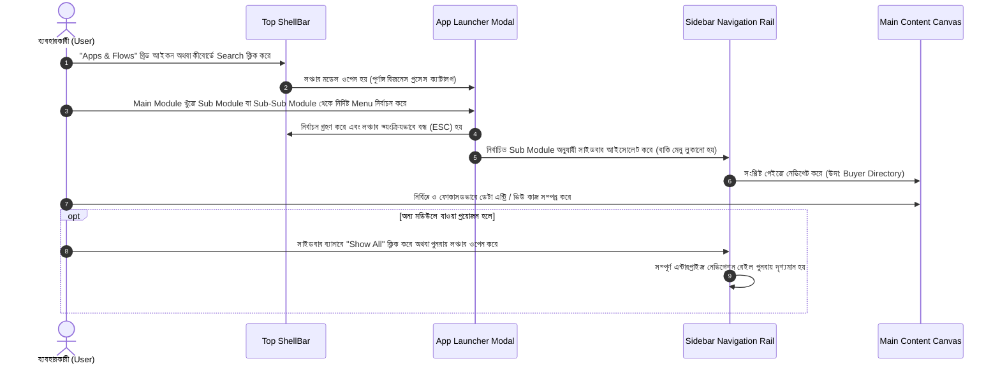

# Standard Operating Procedure (SOP)
## এন্টারপ্রাইজ অ্যাপ লঞ্চার ও আইসোলেটেড ওয়ার্কফ্লো নেভিগেশন প্রসিডিউর (Enterprise App Launcher & Isolated Workflow Navigation Procedure)

---

### ১. ডকুমেন্টের উদ্দেশ্য ও নীতিমালা (Objective & Governance)

#### ১.১ উদ্দেশ্য (Purpose)
এই এসওপি (SOP)-র উদ্দেশ্য হলো আরএমজি ট্রেসেবিলিটি সফটওয়্যারের ব্যবহারকারীদের (যেমন: এক্সিকিউটিভ ডিরেক্টর, মার্চেন্ডাইজার, প্ল্যানার, স্টোর ইনচার্জ, কিউসি অডিটর) অ্যাপ লঞ্চার ও ফোকাসড সাইডবার নেভিগেশন ব্যবহার করে দ্রুত ও বিভ্রান্তিহীনভাবে তাদের দৈনন্দিন কাজ পরিচালনার আদর্শ কার্যপ্রণালী সুনির্দিষ্ট করা।

#### ১.২ সুযোগ ও প্রয়োগযোগ্যতা (Scope & Applicability)
- সমস্ত ওয়েব ব্রাউজার ও কারখানার ট্যাবলেট ডিভাইস।
- সমস্ত ইউজার রোল (Super Admin থেকে শুরু করে ফ্লোর ডাটা এন্ট্রি অপারেটর পর্যন্ত)।

---

### ২. মেনু স্তরবিন্যাস ও গঠন কাঠামো (Menu Hierarchy Structure)

কারখানার কাজগুলোকে ৪টি স্তরে বিন্যস্ত করা হয়েছে:

```
[ Level 1: Main Module ]  ──>  উদা: 02. Master Data (Central Repository)
     │
     └── [ Level 2: Sub Module ]  ──>  উদা: Merchandising Master
              │
              └── [ Level 3: Sub-Sub Module ]  ──>  উদা: Commercial Accounts
                       │
                       └── [ Level 4: Menu / Action ]  ──>  উদা: Buyer Directory, Buying Agent Directory
```

---

### ৩. ধাপে ধাপে স্ট্যান্ডার্ড অপারেটিং প্রসিডিউর (Step-by-Step SOP)



---

### ৪. বিস্তারিত কার্যপ্রণালী (Detailed Operational Workflow)

#### ৪.১ ধাপ ১: অ্যাপ লঞ্চার চালু করা (Accessing App Launcher)
1. স্ক্রিনের একদম উপরে অবস্থিত ব্লু শেলবারে (ShellBar) থাকা **App Launcher (৯-ডট বা গ্রিড আইকন)**-এ ক্লিক করুন অথবা সার্চ বারে টাইপ করুন।
2. তাৎক্ষণিকভাবে **"All Modules & Workflows"** লঞ্চার মোডাল প্রদর্শিত হবে।

#### ৪.২ ধাপ ২: মেনু ব্রাউজিং ও নির্বাচন (Browsing & Selecting Actions)
1. **মেইন মডিউল (Main Module):** সিরিয়াল অনুযায়ী প্রধান বিভাগগুলো দেখুন (উদা: `01. System Admin`, `02. Master Data`, `03. Merchandising Operations`)।
2. **সাব-মডিউল কার্ড (Sub Module):** সংশ্লিষ্ট বিভাগের ভেতরে নির্দিষ্ট প্রসেস কার্ড লক্ষ্য করুন (উদা: `Merchandising Master`, `Organization Setup`)।
3. **সাব-সাব মডিউল গ্রুপ (Sub-Sub Module):** কার্ডের অভ্যন্তরে যদি একাধিক ধারা থাকে, তবে ক্যাটাগরি শিরোনামের নিচে সাজানো মেনুগুলো দেখতে পাবেন।
4. **মেনু অ্যাকশন (Menu Action Pill):** আপনার কাঙ্ক্ষিত মেনু পিলে (উদা: `Buyer Directory`, `Create Buyer`) ক্লিক করুন।

#### ৪.৩ ধাপ ৩: ফোকাসড সাইডবার ওয়ার্কস্পেস (Focused Sidebar Navigation)
1. মেনুতে ক্লিক করার সাথে সাথে লঞ্চার মোডাল বন্ধ হয়ে যাবে এবং কাঙ্ক্ষিত পেইজটি লোড হবে।
2. **আইসোলেশন প্রভাব (Zero Distraction):** বাম পাশের সাইডবারে অন্য সব অপ্রাসঙ্গিক ক্যাটাগরি সাময়িকভাবে লুকিয়ে যাবে এবং **শুধুমাত্র এই কাজের সাথে সম্পর্কিত মেনুগুলোই** প্রদর্শিত হবে।
3. সাইডবারের শীর্ষে একটি নীল পালস নির্দেশক সহ **"Filtered Submodule: [Submodule Name]"** ব্যানার দেখা যাবে।

#### ৪.৪ ধাপ ৪: পুনরায় সম্পূর্ণ সাইডবারে ফিরে যাওয়া (Resetting to Full Rail)
1. যদি আপনি একই সাথে অন্যান্য মডিউলে কাজ করতে চান, তবে সাইডবার ব্যানারের ডানপাশে থাকা **"Show All"** বাটনে ক্লিক করুন।
2. তাৎক্ষণিকভাবে পুরো সিস্টেমের সমস্ত ক্যাটাগরি ও মেনু পুনরায় দৃশ্যমান হবে।

---

### ৫. দায়িত্ব ও ভূমিকা বণ্টন (Role & Responsibility Matrix - RACI)

| রোল (Role) | দায়িত্ব (Responsibility) |
|---|---|
| **সুপার অ্যাডমিন (Super Admin)** | সম্পূর্ণ মডিউল ক্যাটালগ ও রোল পারমিশন ম্যাট্রিক্স কনফিগার করা। |
| **মার্চেন্ডাইজার (Merchandiser)** | Master Data ও Merchandising Operations সাব-মডিউলে কাজ করা। |
| **ফ্লোর ও স্টোর ইনচার্জ** | Supply Chain ও Shopfloor সাব-মডিউল আইসোলেটেড রেখে দ্রুত কাজ করা। |
| **সিস্টেম আর্কিটেক্ট / কিউএ** | লঞ্চারের ৩/৪-লেভেল ম্যাপিং ও পারমিশন ভ্যালিডেশন নিশ্চিত করা। |

---

### ৬. সংশোধন ও কন্ট্রোল রেকর্ড (Revision & Control History)

| সংস্করণ (Version) | তারিখ | পরিবর্তনকারী | পরিবর্তনের বিবরণ |
|---|---|---|---|
| v1.0.0 | ১১ সেপ্টেম্বর ২০২৬ | Khaled Amin (Project Owner) & Antigravity Agent | প্রাথমিক ৩/৪-লেভেল অ্যাপ লঞ্চার ও আইসোলেটেড সাইডবার এসওপি প্রণয়ন। |
