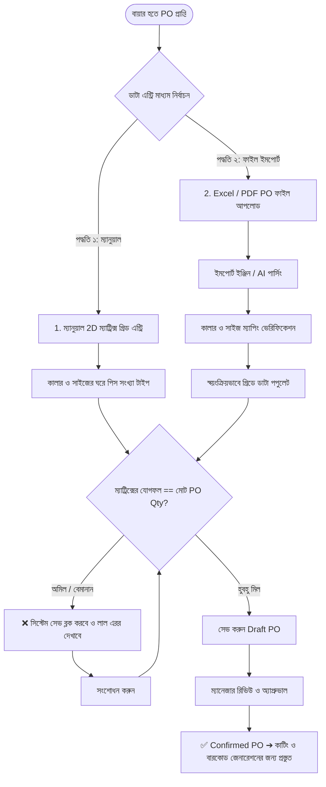

# Standard Operating Procedure (SOP)
## SOP-MOD03: Purchase Order (PO) Management & Dual-Mode Matrix Entry (Manual Grid vs. Excel/PDF Import)

**Document Reference:** SOP-TRACE-MOD03-PO-01  
**Target Roles:** Merchandiser, Commercial Manager, Planning Head, Cutting In-Charge  
**Effective Date:** 2026-09-10  
**Version:** 1.0 (Enterprise Comprehensive Edition)  
**Language:** Bengali (Bangla)  

---

## ১. উদ্দেশ্য (Purpose)
এই এসওপি-র মূল উদ্দেশ্য হলো তৈরি পোশাক (Woven Garments) কারখানায় বায়ারের প্রেরিত **Purchase Order (PO)** এবং তার অধীনস্থ **Color-Size Breakdown Matrix** নির্ভুলভাবে সিস্টেমে অন্তর্ভুক্ত করার নিয়মাবলী প্রতিষ্ঠা করা। এটি নিশ্চিত করে যে:
1. **উপায় ১ (Manual Grid Entry):** স্টাইলের নির্ধারিত কালার ও সাইজ স্কেল অনুসারে মার্চেন্ডাইজার সরাসরি স্ক্রিনে লাইভ ম্যাট্রিক্স গ্রিডে দ্রুত কিবোর্ড নেভিগেশন দিয়ে সংখ্যা ইনপুট দিতে পারবে।
2. **উপায় ২ (Excel / PDF Import Engine):** বায়ারের পাঠানো এক্সেল স্প্রেডশীট (`.xlsx`, `.csv`) অথবা অফিশিয়াল PDF পার্চেজ অর্ডার শিট থেকে স্বয়ংক্রিয়ভাবে হেডার তথ্য ও কালার-সাইজ রেশিও এক্সট্রাক্ট করে সাইড-বাই-সাইড ভেরিফিকেশনসহ সিস্টেমে ইমপোর্ট করা যাবে।
3. **গাণিতিক অখণ্ডতা (Mathematical Integrity):** কোনো অবস্থাতেই ম্যাট্রিক্সের যোগফল এবং মোট পিও কোয়ান্টিটির মধ্যে ১ পিসেরও অমিল থাকবে না।

---

## ২. প্রয়োগক্ষেত্র (Scope)
এই এসওপি TraceFlow RMG-র সমস্ত সিস্টার কোম্পানি, মার্চেন্ডাইজিং ডিপার্টমেন্ট, প্ল্যানিং এবং কাটিং সেকশনে প্রযোজ্য।

---

## ৩. দায়িত্ব ও ক্ষমতা (Roles & Responsibilities)
| ভূমিকা (Role) | দায়িত্ব (Responsibilities) |
|---|---|
| **Merchandiser** | বায়ার পিও ড্রাফট তৈরি, ম্যানুয়াল গ্রিড এন্ট্রি অথবা এক্সেল/পিডিএফ ফাইল ইমপোর্ট করা, ভেরিফিকেশন এবং পিও সাবমিট করা। |
| **Commercial Manager** | বায়ার পিও রেট (FOB Price), পেমেন্ট টার্মস (L/C, TT) এবং ডেলিভারি ডেট ভেরিফাই করে পিও কনফার্ম (`Confirm PO`) করা। |
| **Planning & Cutting Team** | কনফার্মড পিও-র কালার-সাইজ ম্যাট্রিক্সের ভিত্তিতে মার্কার ও কাটিং প্ল্যান নির্ধারণ করা। |

---

## ৪. পদ্ধতিগত ধাপসমূহ (Step-by-Step Procedure)

---

### ৪.১. প্রাথমিক প্রস্তুতি ও মাস্টার অর্ডার যাচাই
1. মার্চেন্ডাইজার প্রথমে মেন্যু থেকে **Order Directory ➔ Create Purchase Order**-এ প্রবেশ করবেন।
2. প্যারেন্ট তথ্য সিলেক্ট করতে হবে:
   - **Company**: উৎপাদনকারী কারখানা (যেমন: `Starling Design Ltd`)।
   - **Buyer**: বায়ারের নাম (যেমন: `Levi Strauss & Co`)।
   - **Style**: বায়ারের নিবন্ধিত স্টাইল (যেমন: `SDL-STY-26-0001 | Men's Denim Jacket`)। স্টাইল সিলেক্ট করামাত্র স্টাইলের বিদ্যমান কালারসমূহ (Colorways) এবং সাইজ স্কেল (Size Scale) ব্যাকগ্রাউন্ডে লোড হবে।
3. পিও সাধারণ তথ্য প্রদান:
   - **Buyer PO Number**: বায়ারের নিজস্ব পার্চেজ অর্ডার নম্বর (e.g. `PO-LEVI-9921`)।
   - **Season**: সিজন ড্রপডাউন (e.g. `Summer 2026`)।
   - **Total PO Quantity**: বায়ারের মোট অর্ডার পিস (e.g. `5000` Pcs)।
   - **Unit Price (FOB)**: প্রতি পিস দর (e.g. `$ 8.50`)।
   - **Shipment Dates**: Ex-Factory Date এবং Final Delivery Date।

---

### ৪.২. উপায় ১: ম্যানুয়াল ম্যাট্রিক্স গ্রিড এন্ট্রি ও মাল্টি-কান্ট্রি হ্যান্ডলিং (Manual 2D Matrix & Country Split)
*যখন বায়ার ইমেইলে বা পিও শিটে দেশভিত্তিক (Destination Split) অর্ডার পাঠায়:*
1. স্ক্রিনের এন্ট্রি মোড সিলেক্টরে **"Manual Matrix Grid"** রেডিও বাটনটি সক্রিয় থাকবে।
2. **গন্তব্য দেশ যোগ করা (`[ + Add Destination Country ]`)**:
   - মার্চেন্ডাইজার `+ Add Destination Country` বাটনে ক্লিক করে ডেলিভারি দেশ নির্বাচন করবেন (যেমন: `Germany`, `France`, `United States`)।
   - প্রতিটি দেশের জন্য নির্দিষ্ট **Port of Discharge** (e.g. `Hamburg`, `Le Havre`), **Country Ex-Factory Date**, এবং **Country Target Quantity** প্রদান করবেন।
3. **দেশভিত্তিক 2D ম্যাট্রিক্স টেবিল**:
   - নির্বাচিত প্রতিটি দেশের অধীনে স্বাধীনভাবে স্টাইলের কালার (Y-Axis) এবং সাইজ স্কেল (X-Axis) সমন্বিত একটি স্প্রেডশীট সদৃশ **2D Matrix Table** প্রদর্শিত হবে।
   - যদি বায়ার নির্দিষ্ট দেশের জন্য আলাদা EAN/UPC বারকোড দিয়ে থাকে, তবে তা কালার-সাইজ অনুযায়ী ইনপুট দেওয়া যাবে।
4. **কিবোর্ড ফ্রেন্ডলি এন্ট্রি ও লাইভ ক্যালকুলেশন**:
   - মার্চেন্ডাইজার প্রথম ঘরে কোয়ান্টিটি টাইপ করে `Tab` বা কিবোর্ডের `Right Arrow` প্রেস করে পরবর্তী সাইজে চলে যেতে পারবেন।
   - প্রতিটি সেলে সংখ্যা লেখার সাথে সাথে রিয়েল-টাইমে:
     - রো-ভিত্তিক মোট পিস (Total per Color)
     - কলাম-ভিত্তিক মোট পিস (Total per Size)
     - সংশ্লিষ্ট দেশের সাব-টোটাল (Country Total)
     - লাইভ ব্যালেন্স কাউন্টার (`Remaining to balance: 0 Pcs`) স্বয়ংক্রিয়ভাবে গণনা হবে।
5. **দ্বিমুখী গাণিতিক চেক (Dual Balance Check)**:
   - দেশের ভেতরের সেলগুলোর যোগফল উক্ত দেশের কোয়ান্টিটির সমান হতে হবে।
   - সমস্ত দেশের যোগফল মূল `Total PO Quantity`-র সমান হতে হবে। মিল না হওয়া পর্যন্ত সেভ বাটন সক্রিয় হবে না।

---

### ৪.৩. উপায় ২: Excel / PDF ফাইল ইমপোর্ট (Excel / PDF PO Import Engine)
*যখন বায়ার জটিল, বহুপৃষ্ঠার এক্সেল শিট বা পিডিএফ অর্ডার প্যাক পাঠায়:*
1. স্ক্রিনে **"Import from Excel / PDF"** অপশনটিতে ক্লিক করুন।
2. **ফাইল ড্রপজোন (Dropzone)**:
   - বায়ারের পাঠানো অফিশিয়াল ফাইলটি ড্র্যাগ অ্যান্ড ড্রপ করুন (সাপোর্টেড ফরম্যাট: `.xlsx`, `.xls`, `.csv`, `.pdf` — সর্বোচ্চ ২৫ মেগাবাইট)।
3. **টেমপ্লেট ডাউনলোড সুবিধা (For Excel)**:
   - যদি কারখানার নিজস্ব এক্সেল ফরম্যাটে বায়ার ডাটা দিতে চায়, তবে পাশে থাকা **"Download Excel Template"** বাটনে ক্লিক করে সংশ্লিষ্ট স্টাইলের প্রি-ফিল্ড কালার ও সাইজ হেডার যুক্ত এক্সেল শিট ডাউনলোড করে নেওয়া যাবে।
4. **ইন্টেলিজেন্ট পার্সিং ও এক্সট্রাকশন (Parsing Process)**:
   - **"Process & Extract PO Data"** বাটনে ক্লিক করলে ব্যাকএন্ড ইঞ্জিন ফাইলটির টেবিল ও ডাটা স্ক্যান করবে।
   - **Excel ক্ষেত্রে**: শিটের রো ও কলাম স্বয়ংক্রিয়ভাবে ফিল্টার করে কালার কোড ও সাইজ হেডার শনাক্ত করবে।
   - **PDF ক্ষেত্রে**: টেক্সট স্ট্রাকচার ও টেবিল গ্রিড শনাক্ত করে PO Number, Delivery Date এবং কালার-সাইজ কোয়ান্টিটিগুলো ম্যাপিং করবে।
5. **সাইড-বাই-সাইড ভেরিফিকেশন স্ক্রিন (Side-by-Side Verification)**:
   - স্ক্রিনের বামে বায়ারের আপলোডকৃত PDF/Excel প্রিভিউয়ার উন্মুক্ত থাকবে।
   - স্ক্রিনের ডানে এক্সট্রাক্ট করা ডেটা সহ ইন্টারেক্টিভ ম্যাট্রিক্স গ্রিড পূর্ণ হয়ে ভেসে উঠবে।
   - মার্চেন্ডাইজার উভয় পাশ চোখের সামনে মিলিয়ে দেখতে পারবেন। কোনো সংখ্যা বা কালার যদি সিস্টেমে বেমানান হয়, তবে ড্রপডাউন থেকে এক ক্লিকে মাস্টার কালার/সাইজের সাথে রি-ম্যাপ করা যাবে।

---

### ৪.৪. সংরক্ষণ, ভ্যালিডেশন ও স্ট্যাটাস ট্রানজিশন
1. **ভ্যালিডেশন চেক**:
   - সব ভ্যালিডেশন সার্ভার সাইডে (`HTTP 422`) যাচাই হবে।
   - কোনো ডুপ্লিকেট PO Number একই বায়ারের অধীনে গ্রহণযোগ্য হবে না।
   - ম্যাট্রিক্সের সর্বমোট যোগফল বায়ার পিও কোয়ান্টিটির সমান হতে হবে।
2. **সেভ ড্রাফট (`Save as Draft`)**:
   - মার্চেন্ডাইজার প্রাথমিক অবস্থায় ড্রাফট হিসেবে সংরক্ষণ করতে পারবেন।
3. **কনফার্ম পিও (`Confirm PO`)**:
   - বাণিজ্যিক কর্মকর্তা ও মার্চেন্ডাইজিং হেড সবকিছু যাচাই শেষে পিও স্ট্যাটাস `Confirmed` করবেন।
   - কনফার্ম হওয়া মাত্রই সিস্টেম এই পিও-র জন্য একটি ইউনিক সিকোয়েন্সিয়াল ইন্টারনাল কোড জেনারেট করবে:  
     $$\mathbf{[CompanyShortCode]}-\mathbf{ORD}-\mathbf{[YY]}-\mathbf{[SequentialNumber]}$$  
     *(উদাহরণ: `SDL-ORD-26-0001`)*।
   - কনফার্ম হওয়া পিও স্বয়ংক্রিয়ভাবে কাটিং ও প্ল্যানিং ডিপার্টমেন্টের শিডিউলে দৃশ্যমান হবে।

---

## ৫. ব্যতিক্রম ও ঝুঁকি ব্যবস্থাপনা (Exceptions & Edge Cases)
1. **বায়ারের ফাইলে সাইজের নাম ভিন্ন থাকলে (Alias Issue)**:
   - বায়ারের ফাইলে যদি লেখা থাকে `32/34` কিন্তু আমাদের সিস্টেমে সাইজ থাকে `32`, তবে ভেরিফিকেশন গ্রিডে সিস্টেম একটি ওয়ার্নিং দেবে এবং মার্চেন্ডাইজারকে ড্রপডাউন থেকে আমাদের মাস্টার সাইজের সাথে অ্যালাইন করতে বলবে।
2. **বায়ার পিও রিভিশন / সংশোধনী আসলে**:
   - কাটিং শুরু হওয়ার আগ পর্যন্ত পিও এডিট করা যাবে।
   - কিন্তু একবার ফেব্রিক কাটিং ও বান্ডেল কিউআর ইস্যু হয়ে গেলে পিও কোয়ান্টিটি পরিবর্তন লক হয়ে যাবে (রুল অব সেফটি)।
3. **ফাইল সাইজ ও আইডিএম সমস্যা**:
   - পিডিএফ ফাইল প্রিভিউ করার জন্য আমাদের ক্লায়েন্ট-সাইড PDF.js ক্যানভাস ব্যবহার করা হবে, যাতে কোনো ডাউনলোড ম্যানেজার ইন্টারসেপ্ট না করে।

---

*(End of SOP Document)*
