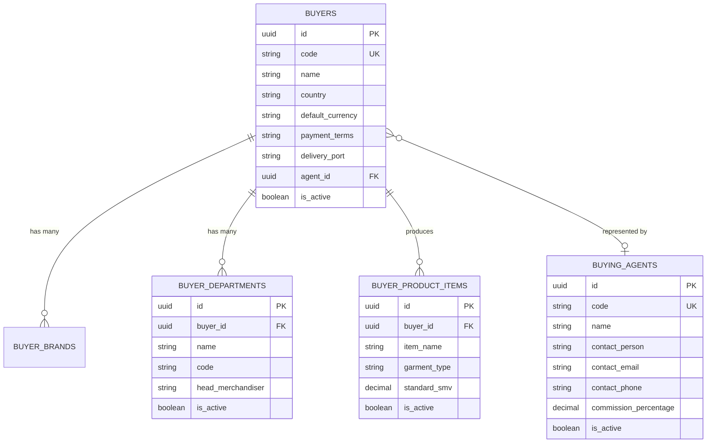

# Software Requirements Specification (SRS)
## বায়ার পার্টনার ডোমেন এক্সটেনশন: Buyer Items, Production Department & Buying Agents

**ডকুমেন্ট রেফারেন্স:** `SRS-RMG-M02-BUYER-EXT-01`  
**মডিউল:** Module 02 — Master Data Library & Business Partner Setup  
**সিস্টেম:** TraceFlow RMG Enterprise Woven Garments Traceability Software  
**স্ট্যাটাস:** Official Engineering Specification  

---

## ১. ভূমিকা ও বিজনেস রিকয়ারমেন্ট বিশ্লেষণ

তৈরি পোশাক (RMG - Ready Made Garments) এবং ওভেন ফ্যাক্টরি পরিচালনার ক্ষেত্রে বায়ার (Buyer) শুধুমাত্র একটি নাম বা পেমেন্ট কারেন্সি নয়। আন্তর্জাতিক পোশাক প্রস্তুতকারক প্রতিষ্ঠানে বায়ারের সাথে তিনটি অত্যন্ত গুরুত্বপূর্ণ বিজনেস এন্টিটি সরাসরি সংযুক্ত থাকে:

1. **বায়ার আইটেম / প্রডাক্ট ক্যাটাগরি (Buyer Product Categories / Items):** নির্দিষ্ট বায়ার কোন ধরনের পোশাক প্রস্তুত করায় (যেমন: Denim Long Pant, Cargo Pant, Flannel Shirt, Workwear, Puffer Jacket ইত্যাদি)।
2. **প্রডাকশন ডিপার্টমেন্ট / ডিভিশন (Production Division / Department):** বায়ার কোন ডিপার্টমেন্টের মাধ্যমে কাজ চালায় (যেমন: Menswear, Womenswear, Kids/Baby, Outerwear Division ইত্যাদি)।
3. **বায়িং এজেন্ট / লিয়াজোঁ অফিস (Buying Agent / Liaison Buying House):** আন্তর্জাতিক বায়ারদের (যেমন: Zara, Target, Next, Primark) সরাসরি অর্ডার ছাড়া প্রায়ই তৃতীয় পক্ষ বাইং হাউস, সোর্সিং এজেন্ট বা লোকাল লিয়াজোঁ অফিসের মাধ্যমে অর্ডার ও এলসি আসে (যেমন: Li & Fung, H&M Liaison Office, Mondial ইত্যাদি)।

নিচে এগুলোর প্রয়োজনীয়তা, বিজনেস রুলস এবং সিস্টেম আর্কিটেকচার বিস্তারিতভাবে তুলে ধরা হলো।

---

## ২. কেন এগুলো প্রয়োজন? (Business Justification & Impact)

| বিজনেস এন্টিটি | এটি কি বায়ার ক্রিয়েটে লাগবে? | বাস্তব ফ্যাক্টরি অপারেশনে এর ভূমিকা | সিস্টেম না থাকলে কি ক্ষতি হবে? |
|---|---|---|---|
| **১. প্রডাকশন ডিভিশন / ডিপার্টমেন্ট (Buyer Production Department)** | **হ্যাঁ (অত্যন্ত জরুরি)** | বায়ারের বিভিন্ন ডিপার্টমেন্টের রিকোয়ারমেন্ট, সাইজ চার্ট, টলারেন্স এবং মার্চেন্ডাইজার ভিন্ন ভিন্ন হয়। যেমন: H&M Men's ও H&M Kids এর সেলাই কোয়ালিটি ও কেয়ার লেবেল এক নয়। | অর্ডার ট্র্যাক করার সময় কোন স্টাইল কোন ডিপার্টমেন্টের তা এলোমেলো হয়ে যাবে এবং ফ্যাক্টরি লাইনের এফিসিয়েন্সি রিপোর্ট ভুল হবে। |
| **২. বায়ার আইটেম / স্পেশালাইজড ক্যাটাগরি (Garment Product Items)** | **হ্যাঁ (প্রয়োজনীয়)** | ওভেন ফ্যাক্টরি বিভিন্ন আইটেমের জন্য বিভিন্ন সুইং লাইন ডেডিকেট করে। বায়ার কোন কোন আইটেমের অর্ডার অনুমোদন করেছে (Approved Item Profiles) তা জানা থাকলে ক্যাপাসিটি প্ল্যানিং ও টেক-প্যাক ভ্যালিডেশন স্বয়ংক্রিয় হয়। | অযোগ্য লাইনে ভুল আইটেম প্ল্যানিং হবে, এসএমভি (SMV) ও ক্যাপাসিটি মিসম্যাচ হবে। |
| **৩. বাইং এজেন্ট / সোর্সিং হাউস (Buying Agent / Commission House)** | **হ্যাঁ (ঐচ্ছিক কিন্তু বড় বায়ারদের জন্য আবশ্যক)** | অনেক ক্ষেত্রে এলসি বায়ারের নামে হলেও লোকাল মার্চেন্ডাইজিং, ইন্সপেকশন বুকিং এবং কমিশন হ্যান্ডেল করে লোকাল বাইং এজেন্ট। এজেন্টের কনট্যাক্ট পারসন ও কমিশনের হার ট্র্যাক করতে হয়। | টেকনিক্যাল ইন্সপেকশন কল, থার্ড পার্টি অডিট ও ফাইনাল শিপমেন্ট হ্যান্ডওভারে জটিলতা তৈরি হবে। |

---

## ৩. ডোমেন স্পেসিফিকেশন ও ডেটাবেজ স্কিমা মডেল

---

## ৪. ফাংশনাল রিকয়ারমেন্টস (Functional Requirements)

### ৪.১ বায়ার ডিপার্টমেন্ট কনফিগারেশন (Buyer Production Departments)
- **FR-01:** প্রতিটি বায়ারের প্রোফাইলে একাধিক ডিপার্টমেন্ট (যেমন: `Men's Casual`, `Women's Denim`, `Kids Wear`, `Boys Outerwear`) ট্যাগ করা যাবে।
- **FR-02:** স্টাইল ও পারচেজ অর্ডার (PO) ক্রিয়েট করার সময় বায়ার সিলেক্ট করলে স্বয়ংক্রিয়ভাবে শুধুমাত্র সেই বায়ারের ডিপার্টমেন্টগুলো ড্রপডাউনে ফিল্টার হবে।
- **FR-03:** ডিপার্টমেন্টভিত্তিক লাইন ক্যাপাসিটি এবং এফিসিয়েন্সি রিপোর্ট জেনারেট হবে।

### ৪.২ বায়ার আইটেম কনফিগারেশন (Buyer Product Items)
- **FR-04:** বায়ার যে যে নির্দিষ্ট আইটেম প্রস্তুত করায় তা ডিফাইন করা থাকবে (যেমন: ৫ পকেট জিন্স প্যান্ট, ওভেন শার্ট, বারমুডা শর্টস, ওভারকোট)।
- **FR-05:** আইটেমটির স্ট্যান্ডার্ড এসএমভি (Standard SMV - Standard Minute Value) এবং ওয়াশ টাইপ (Rinse, Enzyme, Stone, Bleach) কনফিগার করার ব্যবস্থা থাকবে।
- **FR-06:** অর্ডার এন্ট্রি করার সময় সিস্টেম স্বয়ংক্রিয়ভাবে আইটেমের বেসলাইন এসএমভি ফিল্ডে বসিয়ে দেবে।

### ৪.৩ বাইং এজেন্ট / সোর্সিং কনফিগারেশন (Buying Agent / Third-Party Agent)
- **FR-07:** সিস্টেমে একটি স্বতন্ত্র `Buying Agents` লাইব্রেরি থাকবে যেখানে লোকাল বাইং হাউস বা লিয়াজোঁ অফিসের নাম, ঠিকানা ও রিপ্রেজেনটেটিভদের তথ্য সংরক্ষিত থাকবে।
- **FR-08:** বায়ার ক্রিয়েট বা এডিট করার সময় নির্দিষ্ট বাইং এজেন্ট ট্যাগ করা যাবে (`Direct Buyer` অথবা `Through Agent Li & Fung` ইত্যাদি)।
- **FR-09:** ইনভয়েসিং এবং শিপমেন্ট চালানের সময় এজেন্টের নাম ও কমিশন হিসাব স্বয়ংক্রিয়ভাবে ডকুমেন্টে প্রিন্ট করা যাবে।

---

## ৫. ইউজার ইন্টারফেস (UI/UX) ডিজাইন স্ট্যান্ডার্ড

প্রজেক্টের **`.agents/AGENTS.md`** এর সকল রুলস বজায় রেখে বায়ার পেজে এই নতুন বিষয়গুলো অন্তর্ভুক্ত করার প্রস্তাবিত লেআউট:

1. **নো-মোডাল রুল (No Modals Rule):** 
   - এজেন্ট ও ডিপার্টমেন্ট সংক্রান্ত কোনো কাজই পপআপ বা মোডালে হবে না।
   - বায়ার ক্রিয়েট পেজে একাধিক কার্ড হিসেবে সুন্দরভাবে বিন্যস্ত থাকবে।
2. **স্ট্যান্ডার্ড এন্টারপ্রাইজ কার্ড স্ট্রাকচার:**
   - **কার্ড ১:** বায়ার কোর প্রোফাইল ও কমার্শিয়াল শর্ত (Name, Code, Country, Currency, Payment Terms, Port)
   - **কার্ড ২:** বাইং এজেন্ট সিলেকশন (Direct / Agent Name, Commission %)
   - **কার্ড ৩:** প্রোডাকশন ডিপার্টমেন্টস রিপিটার (Department Name, Division Code)
   - **কার্ড ৪:** বায়ার অনুমোদিত আইটেমস রিপিটার (Item Name, Category, Base SMV)
   - **কার্ড ৫:** বায়ার সাব-ব্র্যান্ডস রিপিটার (Brand Name, Brand Code, Line)
3. **কনটেক্সট সাইডবার (Right 4 Cols):**
   - লাইভ বায়ার প্রিভিউ কার্ডে ডিপার্টমেন্টের সংখ্যা ও এজেন্টের নাম রিয়েলটাইমে প্রদর্শিত হবে।
4. **পিওর সার্ভার-সাইড ভ্যালিডেশন:**
   - ডিপার্টমেন্ট বা আইটেমের নাম খালি থাকলে সার্ভার থেকে ৪২২ এরর কোড এসে নির্দিষ্ট ইনপুটের নিচে লাল রঙে প্রদর্শিত হবে। ব্রাউজারের কোনো ডিফল্ট ভ্যালিডেশন ব্যবহার করা হবে না।

---

## ৬. আর্কিটেকচারাল ডিসিশন ও ইমপ্লিমেন্টেশন রিকমেন্ডেশন

1. **ফেজ ১ (Phase 1 - Master Core):**
   - বাইং এজেন্ট ফিল্ডটি একটি রিলেশনাল টেবিল হিসেবে যুক্ত করা হবে (`buying_agents`)। বায়ার ক্রিয়েট ফর্মে ড্রপডাউনে "Direct (No Agent)" অপশন ডিফল্ট থাকবে, অথবা প্রয়োজন হলে তালিকা থেকে এজেন্ট নির্বাচন করা যাবে।
2. **ফেজ ২ (Phase 2 - Repeater Sections):**
   - বায়ার ফর্মে ব্র্যান্ডসের পাশাপাশি **Buyer Departments** এবং **Product Items** রিপিটার আকারে যুক্ত হবে, যাতে বায়ার ক্রিয়েট করার সময়ই ফ্যাক্টরি তার সম্পূর্ণ প্রোফাইল সেটআপ করে নিতে পারে।
3. **ব্যাকওয়ার্ড কম্প্যাটিবিলিটি:**
   - এগুলো ঐচ্ছিক (nullable) রাখা হবে, যাতে যে বায়ারদের এজেন্ট নেই তাদের সরাসরি সেভ করা যায়।

---

**অনুমোদন:**  
এই SRS অনুযায়ী ব্যাকএন্ড মাইগ্রেশন ও ফ্রন্টএন্ড ফর্ম ফিল্ডগুলো কি সংযুক্ত করা হবে? আপনার নির্দেশ পেলেই আর্কিটেকচার টিম ডেটাবেজ ও UI এক্সটেনশনের কাজ শুরু করবে।
