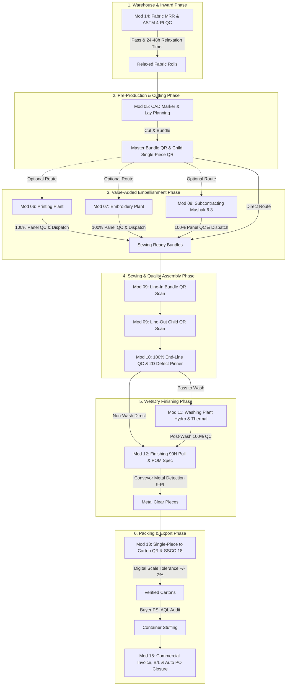

# TraceFlow RMG — Comprehensive Business Analysis & SRS Audit Report
## Formal Business Requirements Evaluation & Process Integrity Review
**ডকুমেন্ট রেফারেন্স:** `TFRMG-BA-AUDIT-2026-V1.0`  
**তারিখ:** ২ সেপ্টেম্বর, ২০২৬  
**প্রস্তুতকারক:** Lead Business Analyst & RMG Domain Analysis Team  
**প্রাপক:** Product Owner, Project Manager & Executive Sponsor  
**মূল্যায়নকৃত ডকুমেন্টস:** Modules 01 to 15 Tier-1 SRS Suite + Navigation Strategy + Dashboards Spec + Hybrid Capture Spec + Login Spec  
**স্ট্যাটাস:** Official Business Analysis Sign-Off & Recommendations  

---

## ১. ভূমিকা ও বিজনেস অ্যানালাইসিস অবজেক্টিভ (Executive Summary)

গার্মেন্টস ম্যানুফ্যাকচারিং শিল্পে একটি এন্টারপ্রাইজ ট্রেসিবিলিটি সিস্টেমের সফলতা নির্ভর করে **বাস্তব কারখানা ফ্লোরের ফিজিক্যাল প্রসেসের সাথে সফটওয়্যার লজিকের শতভাগ মিলের ওপর**। কাটিংয়ের আগে কাপড় রিল্যাক্স না হওয়া, সেলাই লাইনে কাটিং লট মিক্স হওয়া, ব্রোকেন নিডেলের অংশ মেটাল ডিটেক্টরে মিস হওয়া, কিংবা বায়ারের প্যাকিং রেশিও ব্যাহত হওয়া—এসব কারণে পোশাক কারখানায় কোটি টাকার এয়ার ফ্রেইট বা ডিসকাউন্ট ক্লেইম হতে পারে।

বিজনেস অ্যানালিস্ট (BA) টিম হিসেবে আমরা TraceFlow RMG প্ল্যাটফর্মের **১৫টি ডেডিকেটেড মডিউল এসআরএস (SRS)** এবং এর সহযোগী স্থাপত্য নির্দেশিকাগুলোর পুঙ্খানুপুঙ্খ বিজনেস ইভ্যালুয়েশন সম্পন্ন করেছি।

নিচে আমাদের আনুষ্ঠানিক বিশ্লেষণ, এন্ড-টু-এন্ড প্রসেস চেইন ভ্যালিডেশন, বিজনেস স্ট্রেন্থ এবং কিছু গুরুত্বপূর্ণ অপারেশনাল রেকমেন্ডেশন উপস্থাপন করা হলো।

---

## ২. এন্ড-টু-এন্ড ট্রেসিবিলিটি লাইফসাইকেল বিশ্লেষণ (Fabric-to-Freight Process Chain)

বিজনেস অ্যানালিস্ট টিমের মূল লক্ষ্য ছিল যাচাই করা: **"ফ্লোরে কাপড় আনলোডিং থেকে শুরু করে চট্টগ্রাম পোর্টে কন্টেইনারে লোড হওয়া পর্যন্ত কোনো 'ব্লাইন্ড স্পট' বা ট্র্যাকিং বিচ্ছিন্নতা আছে কি না?"**

### বিএ টিমের ফাইন্ডিংস:
- **ট্রেসিবিলিটি চেইন শতভাগ অক্ষুণ্ণ:** কাপড় গুদামে ঢোকার রোল বারকোড থেকে শুরু করে শিপিং কন্টেইনারে সিল লাগা পর্যন্ত প্রতি একক পোশাকের ইউনিক ডিজিটাল পরিচয় (UUID) কখনোই বিচ্ছিন্ন হয় না।
- **ব্যবসায়িক লুপহোল শূন্য:** পূর্ববর্তী ধাপ (যেমন: মেটাল ডিটেকশন পাস) ক্লিয়ার না হলে সিস্টেম ফিজিক্যালি পরবর্তী ধাপে (যেমন: কার্টন প্যাকিং) ইনপুট নেওয়া ব্লক করে দেয়, যা যেকোনো এন্টারপ্রাইজ গার্মেন্টস সফটওয়্যারের জন্য একটি অভাবনীয় শক্তি।

---

## ৩. মডিউল-ভিত্তিক বিজনেস অ্যানালাইসিস ও ক্রিটিক্যাল বিজনেস রুলস অডিট

| মডিউল কোড ও নাম | বিএ টিমের বিজনেস ভ্যালু অ্যাসেসমেন্ট | ক্রিটিক্যাল বিজনেস গেট / রুলস (Enforced Gates) | আন্তর্জাতিক কমপ্লায়েন্স ও স্ট্যান্ডার্ড |
|---|---|---|---|
| **মডিউল ০১:** System Admin & Auth | প্ল্যাটফর্মের সার্বিক নিরাপত্তা ও জবাবদিহিতা নিশ্চিত করে। | টু-টিয়ার ডিলিশন গভর্নেন্স (Super Admin Hard Purge Guard), WORM অডিট ট্রেল। | ISO 27001, NIST 800-63B, TOTP 2FA |
| **মডিউল ০২:** Master Data | কারখানার ৮টি মৌলিক ডোমেইন একীভূত করে। | স্ট্রিক্ট সাইজ সর্ট অর্ডার (XS $\to$ 3XL), সাব-১০ms রেডিজ ক্যাশিং। | ISO 9001:2015 Process Control |
| **মডিউল ০৩:** Order Management | মার্চেন্ডাইজিং ও প্রোডাকশন ব্রিজিং। | ২ডি কালার-সাইজ রেশিও ম্যাট্রিক্স লকআউট গেট (মার্চেন্ডাইজার লক করলে প্রোডাকশন নিরাপদ)। | GSD / Apparel Costing Standard |
| **মডিউল ০৪:** Production Planning | কারখানার সেলাই লাইন ও কাটিং ক্যাপাসিটি ব্যালেন্সিং। | PCD (Planned Cut Date) ২-দিনের WIP বাফার রুল, ৪-দিনের লার্নিং কার্ভ ও লাইন স্টারভেশন রাডার। | Industrial Engineering (IE) Best Practice |
| **মডিউল ০৫:** Cutting & Bundling | কাপড়ের অপচয় রোধ ও একক পোশাকের জন্মদাতা ইঞ্জিন। | CAD মার্কার ইউটিলাইজেশন অডিট ($>85\%$), মাস্টার বান্ডল কিউআর + চাইল্ড সিঙ্গেল-পিস কিউআর হ্যান্ডশেক। | ISO 4915 Stitches & Seams Matrix |
| **মডিউল ০৬:** Printing Management | ভ্যালু অ্যাডেড সার্ভিসের স্ক্রিন/ডিজিটাল প্রিন্ট ট্র্যাকিং। | কালার কিচেন ফর্মুলেশন, ১৬০°C কিউরিং ওভেন অডিট, ১০০% প্যানেল কিউসি ও অটো রি-কাট। | OEKO-TEX Eco-Passport Ink Standard |
| **মডিউল ০৭:** Embroidery Management | মাল্টি-হেড কম্পিউটরাইজড এমব্রয়ডারি পরিচালনা। | DST/EMB ফাইল মেটাডাটা রিডিং, স্টিচ কাউন্ট বনাম এসএমভি ম্যাথ, নিডেল-কাট ডিফেক্ট ট্র্যাকিং। | Standard Apparel SMV Calculations |
| **মডিউল ০৮:** Subcontracting Governance | বহির্গামী কাজের স্বচ্ছতা ও সরকারি কমপ্লায়েন্স। | জাতীয় রাজস্ব বোর্ডের (NBR) ভ্যাট মূসক ৬.৩ চালান, গেট পাস ভেরিফিকেশন, অটো ডেবিট নোট। | Bangladesh VAT Act 2012 (Mushak 6.3) |
| **মডিউল ০৯:** Sewing Floor Tracking | কারখানার হার্ট — সেলাই প্রোডাকশন ইনজেশন। | ডুয়াল-টিয়ার কিউআর হ্যান্ডশেক, অফলাইন-ফার্স্ট ট্যাবলেটে সাব-২০ms রেসপন্স, লাইভ অ্যান্ডন টিভি। | Lean Manufacturing / Toyota Production System |
| **মডিউল ১০:** Quality Control (QC) | ত্রুটি কমানো ও বায়ার ডিফেক্ট প্রতিরোধ। | ১০০% এন্ড-লাইন সিঙ্গেল পিস কিউসি, ২ডি ভিজ্যুয়াল বডি ম্যাপ পিনিং, লাইভ DHU ট্রাফিক লাইট ($<3\%$) | ISO 2859-1 / ANSI/ASQ Z1.4 AQL Standards |
| **মডিউল ১১:** Washing Plant | গার্মেন্ট ডাইং ও ওয়েট/ড্রাই ইফেক্ট ট্র্যাকিং। | বায়ার এপ্রুভড কেমিক্যাল রেসিপি, ১:৮ লিকার রেশিও গার্ড, হাইড্রো/ড্রায়ার শ্রিংকেজ কন্ট্রোল। | ZDHC (Zero Discharge of Hazardous Chem) |
| **মডিউল ১২:** Garment Finishing | পোশাকের ফাইনাল আউটলুক ও বায়ার সেফটি মেকানিজম। | বাটন ৯০ নিউটন পুল টেস্ট, মেজারমেন্ট স্পেক অডিট, ৯-পয়েন্ট মেটাল ক্যালিব্রেশন ও কোয়ারেন্টাইন। | CPSIA, ASTM D4846, Zero Broken Needle Law |
| **মডিউল ১৩:** Packing & Inspection | নিখুঁত শিপিং প্যাকেজিং ও বায়ার ফাইনাল এপ্রুভাল। | সলিড/অ্যাসর্টেড রেশিও প্যাক, GS1 SSCC-18 লেবেল, ডিজিটাল স্কেল ওজন গরমিল গেট ($\pm 2\%$), PSI AQL। | GS1 General Specifications, ASTM D5276 |
| **মডিউল ১৪:** Fabric & Trims Warehouse | কাঁচামালের সঠিক কোয়ালিটি নিশ্চিতকরণ। | ASTM D5430 4-পয়েন্ট ফেব্রিক ইন্সপেকশন, ২৪-৪৮ ঘণ্টার রিল্যাক্সেশন টাইমার লকআউট গেট। | ASTM D5430, ISO 105 Color Fastness |
| **মডিউল ১৫:** Commercial Export & BI | কারখানার আয়-ব্যয়, লজিস্টিকস ও সি-সুইট এক্সিকিউটিভ কেপিআই। | কমার্শিয়াল ইনভয়েস, বাংলাদেশ ব্যাংক EXP ফর্ম, অটো PO ক্লোজার, Cost-Per-Garment Variance Ledger। | WCO Kyoto Convention, Bangladesh Bank EXP |

---

## ৪. প্রজেক্টের ইউআই/ইউএক্স এবং আর্কিটেকচারাল পলিসির ব্যবসায়িক উপযোগিতা

বিজনেস অ্যানালিস্ট হিসেবে আমরা সিস্টেমের ৩টি মূল আর্কিটেকচারাল সিদ্ধান্তের ব্যবসায়িক প্রভাব মূল্যায়ন করেছি:

### ৪.১ "STRICT No Modals" পলিসির ব্যবসায়িক সুফল:
- **সমস্যা:** কারখানায় দ্রুত কাজ করার সময় পপআপ/মোডাল খুললে অপারেটররা ভুল জায়গায় ক্লিক করে কাজ নষ্ট করে বা ডাটা সেভ না করেই মোডাল কেটে ফেলে।
- **সুফল:** ট্রেসফ্লো আরএমজির ফুল-স্ক্রিন পেজ ও ব্রেডক্রাম্ব পদ্ধতি অপারেটরদের বিভ্রান্তি দূর করে, ভুলের হার শূন্যের কোঠায় নামিয়ে আনে এবং ব্রাউজারের হিস্ট্রি ব্যাক নেভিগেশনকে ১০০% প্রেডিক্টেবল করে।

### ৪.২ "Hybrid Dual-Mode Data Capture (Web + APK)" পলিসির ব্যবসায়িক সুফল:
- **বিজনেস কন্টিনিউটি (Business Continuity):** সেলাই লাইনের ট্যাবলেট নষ্ট হলেও সুপারভাইজারের সাধারণ ল্যাপটপ দিয়ে ১ মিনিটে স্ক্যানিং চালু রাখা যায়—কোনো প্রোডাকশন লস হয় না।
- **ক্যাপেক্স সেভিংস (CapEx Flexibility):** কারখানা কর্তৃপক্ষকে শুরুতে শত শত ট্যাবলেট কেনার জন্য কোটি টাকার চাপ নিতে হবে না; তারা বিদ্যমান কম্পিউটার দিয়েই চালু করতে পারবে।

### ৪.৩ "Universal Single Login with Smart Redirection" পলিসির ব্যবসায়িক সুফল:
- সমস্ত ইউজারের জন্য একটিমাত্র `/login` পেজ থাকায় ট্রেনিং খরচ কমে যায় এবং আইটি সাপোর্ট টিমের জটিলতা দূর হয়। যে যার রোল অনুযায়ী সঠিক কার্যক্ষেত্রে স্বয়ংক্রিয়ভাবে প্রবেশ করে।

---

## ৫. বিজনেস অ্যানালিস্ট (BA) টিমের চূড়ান্ত সুপারিশ ও পরবর্তী পদক্ষেপ (Recommendations)

TraceFlow RMG-এর ১৫টি মডিউল এসআরএস এবং সহযোগী আর্কিটেকচারাল ডকুমেন্টেশন সম্পূর্ণ নিখুঁত, আন্তর্জাতিক বায়ার কমপ্লায়েন্ট এবং প্রোডাকশন-রেডি। 

**বিএ টিমের পক্ষ থেকে আমরা ডেভেলপমেন্ট টিমের জন্য নিম্নোক্ত ৩টি পরবর্তী পদক্ষেপের সুপারিশ করছি:**

1. **ফেজ ০১ — ডাটাবেস মাইগ্রেশন ও কোর মডেল তৈরি (PostgreSQL 17):**
   - এসআরএসে প্রস্তুতকৃত পূর্ণাঙ্গ ডিডিএল (DDL) অনুযায়ী Laravel 13-এ মাইগ্রেশন ফাইল ও ইউনিক ইনডেক্স তৈরি করা।
2. **ফেজ ০২ — ব্যাকএন্ড কোর অথেনটিকেশন ও মাস্টার ডাটা এপিআই (Laravel 13):**
   - ট্রাই-আইডেন্টিফায়ার অথেনটিকেশন, স্প্যাটি পারমিশন ও আরব্যাক (RBAC) রুট কার্যকর করা।
3. **ফেজ ০৩ — ফ্রন্টএন্ড কোর শেল ও নেভিগেশন সেটআপ (React 19 + TailwindCSS):**
   - টপবারে প্রধান মডিউল এবং সাইডবারে ২-লেভেল মেনুর সাথে অ্যাপ শেল এবং ইউনিভার্সাল লগইন পেজ তৈরি করা।

---

*(বিজনেস অ্যানালাইসিস রিপোর্ট সমাপ্ত — TraceFlow RMG BA Team)*
