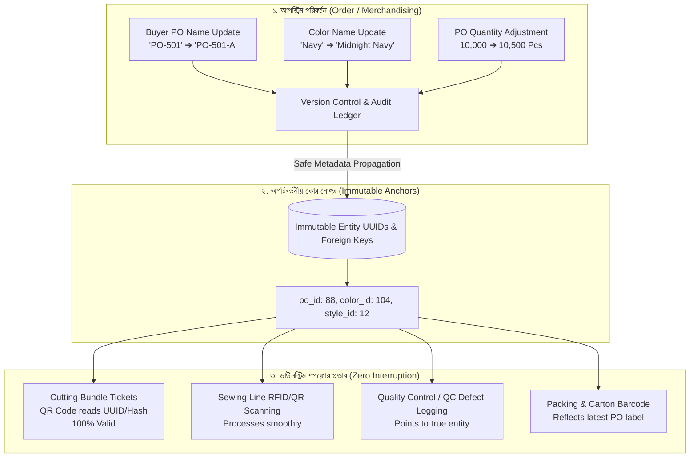
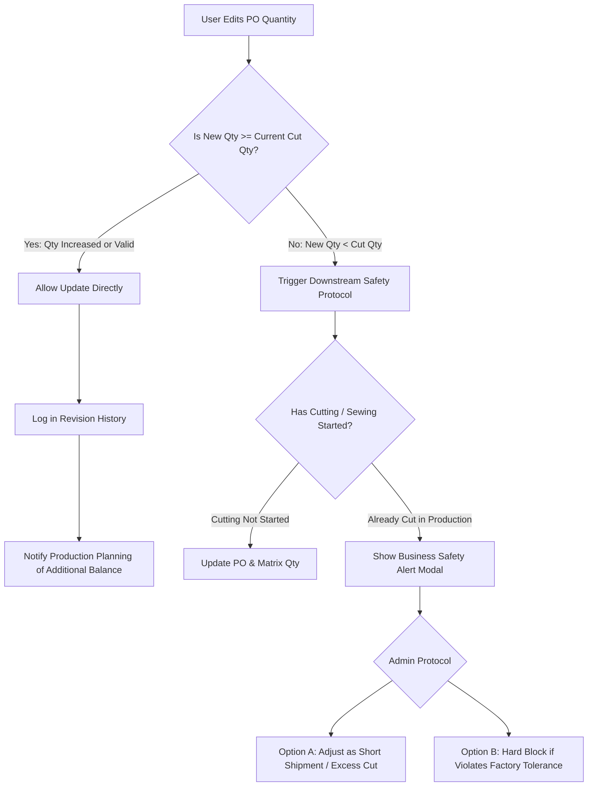

# Software Requirements Specification (SRS)
## Enterprise Change Management, Downstream Integrity & Version Resilience Architecture
**Document Reference:** `SRS_Enterprise_Change_Management_and_Downstream_Integrity.md`  
**Target Audience:** Product Owner, Solution Architect, Lead System Engineers, Merchandisers, Production Heads  
**Language Standard:** Bengali (Bangla) Requirements & Architectural Manifesto  
**System Scope:** TraceFlow RMG ERP Ecosystem  

---

## ১. ভূমিকা ও পটভূমি (Executive Introduction & Context)

গার্মেন্টস ম্যানুফ্যাকচারিং ও এক্সপোর্ট ট্রেসেবিলিটি একটি অত্যন্ত গতিশীল ও পরিবর্তনশীল শিল্প। অর্ডার কনফার্মেশন থেকে শুরু করে ফাইনাল শিপমেন্ট পর্যন্ত যেকোনো পর্যায়ে বায়ার বা মার্চেন্ডাইজিং টিম থেকে বিভিন্ন প্যারামিটারে পরিবর্তন আসতে পারে, যেমন:
- **Style Name / Style No** পরিবর্তন বা বানান সংশোধন।
- **Buyer PO Name / PO Number** পরিবর্তন (যেমন: `PO-9901` পরিবর্তন হয়ে `PO-9901-REV1` হওয়া)।
- **PO Quantity / Color-Size Breakdown Qty** হ্রাস বা বৃদ্ধি (যেমন: কাটিং শুরুর আগে বা পরে অতিরিক্ত ৫% ইনক্রিজ বা শর্ট শিপমেন্ট)।
- **Color Name / Color Code / Shade Reference** পরিবর্তন (যেমন: "Navy Blue" কে "Midnight Navy" করা)।
- **Delivery Date / Shipment Window** রিশিডিউলিং।

### প্রচলিত সাধারণ ইআরপির মারাত্মক সমস্যা (The Catastrophic Flaw in Traditional ERPs)
অধিকাংশ ইআরপিতে নিচের দুই ধরনের মারাত্মক সমস্যা দেখা যায়:
1. **নাদান ক্যাসকেড এডিট (Blind Overwrite)**: PO নাম বা কালার নাম আপডেট করলে ডাটাবেজে সরাসরি ওভাররাইট হয়ে যায়। ফলে পূর্বে যে ১০,০০০ বান্ডেল টিকিট প্রিন্ট হয়েছিল বা সুইং লাইনে চলমান ছিল, সেখানে কাগজের কিউআর কোড বা টিকিটের সাথে সিস্টেমের নাম অমিল হয়ে যায়, সুইং অপারেটরের স্ক্যানার এরর দেয়, এবং লাইন ট্র্যাকিং ও কিউসি অডিট পুরোপুরি নষ্ট হয়ে যায়।
2. **কঠিন রিজিডিটি (Stiff Lock)**: "একবার কাটিং বা সুইং শুরু হলে আর কোনো ডাটা চেঞ্জ করা যাবে না" — এই ধরণের ব্লক বাস্তব গার্মেন্টস অপারেশনের সাথে সাংঘর্ষিক। বায়ার যদি মার্চেন্ডাইজারকে বলে "PO Number পরিবর্তন হয়েছে, নতুন চালানে নতুন PO নাম্বার দেখাতে হবে", তখন ফ্যাক্টরি কাজ আটকে রাখতে পারে না।

### TraceFlow RMG-র সমাধান দর্শন (The TraceFlow Architecture)
**TraceFlow RMG** সিস্টেমে এমন একটি **রেজিলিয়েন্ট ও ট্রানজ্যাকশন-সেফ আর্কিটেকচার** তৈরি করতে হবে যেখানে:
> **"লেবেল বা কসমেটিক মেটাডাটা (Label/Display Metadata) যেকোনো সময় আপডেট হলেও সিস্টেমের ইন্টারনাল আইডেন্টিফায়ার (Immutable UUID / Internal ID) অক্ষুণ্ণ থাকবে, এবং ডাউনস্ট্রিম শপফ্লোর (কাটিং, সুইং, ওয়াশিং, ফিনিশিং) কোনো প্রকার এরর বা বাধা ছাড়াই নিরবচ্ছিন্নভাবে চলবে।"**

---

## ২. মৌলিক নীতি ও মূল আর্কিটেকচার (Core Architectural Principles)



### ২.১. অপরিবর্তনীয় কোর আইডেন্টিফায়ার নীতি (Immutable Entity Identity - UUID)
- **কখনোই টেক্সট বা লেবেলের উপর ভিত্তি করে ডাউনস্ট্রিম প্রসেস চালানো যাবে না**: কাটিং বান্ডেল টিকিট, রোল কিউআর কোড, সুইং ট্র্যাকিং টোকেন বা কিউসি রেজিস্ট্রি কখনোই `po_name`, `style_name` বা `color_name` এর টেক্সট ভ্যালুর সাথে সরাসরি বাঁধা থাকবে না।
- শপফ্লোরের সমস্ত ট্রানজ্যাকশন ডাটাবেজের অপরিবর্তনীয় **`UUID`** বা **`BigInt ID`** এর সাথে ফরেন-কি রিলেশনে থাকবে।
- উদাহরণস্বরূপ: বায়ার যদি PO নাম `PO-SUMMER-101` থেকে পরিবর্তন করে `PO-SUMMER-101-REV` করে, তাহলেও ডেটাবেজে সংশ্লিষ্ট `buyer_purchase_orders.id = 45` এবং `buyer_purchase_orders.uuid = 8f9b...` অপরিবর্তিত থাকবে। কাটিং ও সুইংয়ের প্রতিটি বান্ডেল ইন্টারনালি `order_po_id = 45` এর সাথে যুক্ত থাকায় স্ক্যানিং বা প্রসেসিংয়ে বিন্দুমাত্র বিঘ্ন ঘটবে না।

### ২.২. ফিল্ড পরিবর্তনের শ্রেণীবিভাগ (Change Classification Matrix)
সিস্টেম পরিবর্তনগুলোকে ৩টি সুস্পষ্ট শ্রেণীতে ভাগ করবে:

| শ্রেণী | পরিবর্তনের ধরন | উদাহরণ | শপফ্লোরে প্রভাব | সিস্টেম অ্যাকশন ও হ্যান্ডলিং |
|---|---|---|---|---|
| **Class A: Cosmetic / Label Change** | শুধুমাত্র নাম বা টেক্সট লেবেল সংশোধন | Style Name, PO Name, Color Description, Brand Label | **শূন্য (Zero Risk)** | সাথে সাথে আপডেট হবে। নতুন স্ক্রিন ও নতুন প্রিন্টে নতুন নাম দেখাবে। বিদ্যমান কিউআর কোড ভ্যালিড থাকবে। |
| **Class B: Incremental / Additive Change** | ভলিউম বৃদ্ধি বা অতিরিক্ত আইটেম যোগ | PO Qty বৃদ্ধি (১০,০০০ থেকে ১১,০০০), নতুন কালার যোগ | **সীমিত (Additive Risk)** | বিদ্যমান কাটিং/বান্ডেল অবিকৃত থাকবে। অতিরিক্ত ১,০০০ পিসের জন্য নতুন কাটিং প্ল্যান ও বান্ডেল টিকিট জেনারেট করা যাবে। |
| **Class C: Destructive / Decreasing Change** | ভলিউম হ্রাস বা কমানো, বা অর্ডার বাতিল | PO Qty কমানো (১০,০০০ থেকে ৮,০০০), কালার সাইজ বাতিল | **উচ্চ সতর্কতামূলক (High Operational Risk)** | যদি কমানো পরিমাণ ইতোমধ্যে কাটা হয়ে গিয়ে থাকে (`cut_qty > new_po_qty`), সিস্টেম সাথে সাথে ওয়ার্নিং দেবে এবং অনুমোদিত প্রটোকল অনুসরণ করবে। |

---

## ৩. বিস্তারিত ফাংশনাল রিকোয়ারমেন্টস (Detailed Functional Requirements)

---

### ৩.১. Style Information Update (স্টাইল তথ্য পরিবর্তন)

#### রিকোয়ারমেন্টস:
1. **Style Name & Style Code Decoupling**:
   - স্টাইলের ইন্টারনাল সিস্টেম কোড (যেমন `AWL-STY-001`) কখনো পরিবর্তনযোগ্য নয়।
   - বায়ারের দেওয়া স্টাইল নেম বা রেফারেন্স নেম (যেমন "Men's Slim Fit Chino") মার্চেন্ডাইজার প্রয়োজনবোধে আপডেট করতে পারবে।
2. **ডাউনস্ট্রিম ধারাবাহিকতা**:
   - স্টাইল নেম পরিবর্তিত হলে বিদ্যমান সমস্ত কাটিং প্ল্যান, মার্কার, সুইং প্রগ্রেস এবং কোয়ালিটি কন্ট্রোল রিপোর্টে ডিসপ্লে নেম হিসেবে নতুন নামটি প্রদর্শিত হবে।
   - কিন্তু পূর্ববর্তী টেকপ্যাকের হিস্টোরি ও অডিট ট্রেইলে পুরনো নামটি সেভ থাকবে ("Changed from Style A to Style B by User X on Date Y")।

---

### ৩.২. Buyer PO Name / PO Number Update (বায়ার পিও নাম পরিবর্তন)

#### রিকোয়ারমেন্টস:
1. **PO Label vs PO Entity**:
   - বায়ারের PO নম্বর (e.g. `PO-8801`) এডিট করার অনুমতি থাকবে।
   - বায়ার PO আপডেট হলে একটি কনফার্মেশন প্রম্পট আসবে: *"Changing PO Number from 'PO-8801' to 'PO-8801-REV1'. All downstream cutting bundles, sewing lines, and reports will instantly reflect this new PO Number without invalidating existing QR tickets. Do you want to proceed?"*
2. **বারকোড / কিউআর কোড স্ক্যানার রেজিলিয়েন্স**:
   - কাটিং বান্ডেল টিকিটের কিউআর কোডে সরাসরি PO নাম হার্ডকোড করা থাকবে না; কিউআর কোডের পেলোডে থাকবে ইউনিক বান্ডেল আইডেন্টিফায়ার (যেমন `bnd_9f8a7e6c...`)।
   - যখন সুইং লাইনের ট্যাবলেট বা কিউসি ইন্সপেক্টর কিউআর কোড স্ক্যান করবে, ব্যাকএন্ড রিয়েল-টাইমে রিলেশনশিপ চেক করে নতুন PO নামটি স্ক্রিনে দেখাবে। ফলে পুরানো প্রিন্ট করা কাগজের টিকিট ফেলেও দিতে হবে না, আবার সিস্টেমের সাথেও ১০০% মিল থাকবে।

---

### ৩.৩. Color Name & Shade Reference Update (কালার নাম পরিবর্তন)

#### রিকোয়ারমেন্টস:
1. **Color Master vs PO Color Mapping**:
   - বায়ার অনেক সময় টেকপ্যাকে কালার নাম পরিবর্তন করে (যেমন: "Khaki" পরিবর্তন করে "Desert Sand Khaki")।
   - এই নাম আপডেটের কারণে ফ্যাব্রিক রোল স্টোর (Warehouse GRN), রোল শেড লট (Shade Lots), এবং কাটিং লেয়ার প্ল্যানিংয়ে কোনো ডাটা ক্র্যাশ বা মিসম্যাচ হবে না।
2. **প্রোডাকশন ফ্লো অটুট রাখা**:
   - সিস্টেমে কালারের ইউনিক আইডি অপরিবর্তিত থাকবে। কালার নেম পরিবর্তনের সাথে সাথে শপফ্লোর ড্যাশবোর্ড, সুইং লাইন ট্র্যাকিং এবং কিউসি ডিফেক্ট ট্র্যাকিংয়ে নতুন কালার নাম রিফ্লেক্ট করবে।

---

### ৩.৪. PO Quantity Adjustment (পিও কোয়ান্টিটি বৃদ্ধি বা হ্রাস)

গার্মেন্টস ইন্ডাস্ট্রিতে কোয়ান্টিটি পরিবর্তন সবচেয়ে সংবেদনশীল বিষয়। নিচে এর স্পষ্ট লজিক্যাল হ্যান্ডলিং নির্ধারণ করা হলো:



#### সিনারিও ১: কোয়ান্টিটি বৃদ্ধি (Quantity Increase - যেমন: 10,000 ➔ 11,000 Pcs)
1. মার্চেন্ডাইজার কালার-সাইজ ম্যাট্রিক্সে যেকোনো সময় কোয়ান্টিটি বাড়াতে পারবে।
2. **শপফ্লোর প্রতিক্রিয়া**:
   - বিদ্যমান যে কাটিং বা বান্ডেল তৈরি ছিল তা অক্ষুণ্ণ থাকবে।
   - প্রোডাকশন প্ল্যানিং (PPC) এবং কাটিং সেকশনে "Uncut Balance" এর ঘরে স্বয়ংক্রিয়ভাবে অতিরিক্ত ১,০০০ পিস জমা হবে।
   - কাটিং ম্যানেজার অতিরিক্ত ১,০০০ পিসের জন্য নতুন লে-প্ল্যান ও মার্কার ইস্যু করে অতিরিক্ত বান্ডেল টিকিট প্রিন্ট করতে পারবে।

#### সিনারিও ২: কোয়ান্টিটি হ্রাস (Quantity Decrease - যেমন: 10,000 ➔ 8,000 Pcs)
1. **কাটিং শুরু না হয়ে থাকলে (Uncut Stage)**:
   - সাথে সাথে কোয়ান্টিটি ৮,০০০ পিসে নামিয়ে আনা যাবে এবং ফ্যাব্রিক বুকিং অটো-ক্যালকুলেট হয়ে ব্যালেন্স কমে যাবে।
2. **কাটিং ইতোমধ্যে সম্পন্ন হয়ে থাকলে (Partially or Fully Cut)**:
   - যদি ইতোমধ্যে ৯,০০০ পিস কাটা হয়ে গিয়ে থাকে এবং বায়ার বলে ৮,০০০ পিস নেবে:
     - সিস্টেম সরাসরি ম্যাট্রিক্স ডিলিট হতে দেবে না।
     - সিস্টেম একটি **Business Impact Alert** প্রদর্শন করবে:
       > *"Warning: Currently 9,000 Pcs have already been cut on the shopfloor for this PO. Reducing PO Quantity to 8,000 Pcs will leave 1,000 Pcs as 'Overcut / Factory Excess'. Please select how to handle the balance: [A] Mark as Extra Buffer Stock, [B] Cancel Excess Bundles."*
   - এটি ফ্যাক্টরির কাটিং ফ্লোর ও ইনভেন্টরির মধ্যে ১০০% সামঞ্জস্য রক্ষা করবে।

---

## ৪. শপফ্লোর ইন্টারগ্রিটি মেকানিজম (Shopfloor Integrity Engine)

সুইং, কাটিং এবং কিউসিতে যাতে কোনো সমস্যা না হয়, তার জন্য সিস্টেম নিচের ৪টি টেকনিক্যাল মেকানিজম বাধ্যতামূলকভাবে মেনে চলবে:

### ৪.১. লাইটওয়েট কিউআর কোড পেলোড (Decoupled QR Code Payload)
- কাটিং বান্ডেল টিকিটের কিউআর কোডে কখনোই সরাসরি টেক্সট স্ট্রিং (যেমন: `PO:123, Color:Red, Style:Polo`) ঢুকানো যাবে না।
- কিউআর কোডে থাকবে একটি ক্রিপ্টোগ্রাফিক ইউনিক কোড বা বান্ডেল কি:
  ```json
  {
    "bid": "bnd_01J7N8K4P9Q2R",
    "v": 1
  }
  ```
- **উপকারিতা**: বায়ার যতবারই PO নাম, কালার নাম বা স্টাইল নাম সংশোধন করুক না কেন, ফিজিক্যাল কাগজের টিকিট স্ক্যান করলেই ট্যাবলেট ব্যাকএন্ড থেকে লেটেস্ট ডাটা রিট্রিভ করবে। কোনো টিকিট বাতিল বা পুনরায় প্রিন্ট করার প্রয়োজন পড়বে না।

### ৪.২. ভার্সন কন্ট্রোল ও অডিট ট্রেইল (Historical Version Ledger)
- প্রতিটি PO ও কালার-সাইজ ম্যাট্রিক্সে একটি `version` কলাম থাকবে (শুরু হবে `v1` দিয়ে)।
- যেকোনো গুরুত্বপূর্ণ পরিবর্তন ঘটলে সিস্টেমে `order_change_logs` টেবিলে স্ন্যাপশট জমা হবে:
  - কে পরিবর্তন করেছে (`user_id`).
  - পরিবর্তনের সময় (`timestamp`).
  - পূর্ববর্তী মান (`old_values`: JSON).
  - নতুন মান (`new_values`: JSON).
  - পরিবর্তনের কারণ (`change_reason` বা বায়ারের রেফারেন্স মেইল)।

### ৪.৩. রিয়েল-টাইম স্টেট নোটিফিকেশন (WebSocket / SSE Broadcast)
- যখন কোনো PO বা কালার ইনফরমেশন আপডেট হবে, ব্যাকএন্ড থেকে সংশ্লিষ্ট ফ্লোরের ট্যাবলেটগুলোতে একটি হালকা ব্রডকাস্ট ইভেন্ট পাঠানো হবে।
- লাইন চিফ বা কিউসি সুপারভাইজারের ট্যাবলেটে কোনো পেজ রিলোড ছাড়াই নতুন নামটি আপডেট হয়ে যাবে।

---

## ৫. ডাটাবেজ আর্কিটেকচার ও স্কিমা স্পেসিফিকেশন (Database Architecture)

সিস্টেমের ব্যাকএন্ডে ডাউনস্ট্রিম অক্ষুণ্ণ রাখতে নিচের টেবিল ডিজাইন অনুসরণ করা হবে:

### ৫.১. `order_change_logs` (পরিবর্তন হিস্টোরি টেবিল)
```sql
CREATE TABLE order_change_logs (
    id BIGSERIAL PRIMARY KEY,
    uuid UUID NOT NULL UNIQUE DEFAULT gen_random_uuid(),
    company_id BIGINT NOT NULL REFERENCES companies(id),
    order_id BIGINT NOT NULL REFERENCES master_orders(id) ON DELETE RESTRICT,
    buyer_po_id BIGINT NULL REFERENCES buyer_purchase_orders(id) ON DELETE SET NULL,
    entity_type VARCHAR(50) NOT NULL, -- 'STYLE', 'PO', 'COLOR', 'QUANTITY'
    entity_id BIGINT NOT NULL,
    field_name VARCHAR(50) NOT NULL,
    old_value TEXT NULL,
    new_value TEXT NOT NULL,
    change_reason TEXT NULL,
    changed_by BIGINT NOT NULL REFERENCES users(id),
    created_at TIMESTAMP WITH TIME ZONE DEFAULT CURRENT_TIMESTAMP
);

CREATE INDEX idx_change_logs_entity ON order_change_logs(entity_type, entity_id);
```

### ৫.২. `buyer_purchase_orders` (পিও মাস্টার টেবিল)
- `id` (BigInt, PK) & `uuid` (UUID, Unique): অপরিবর্তনীয় ইন্টারনাল রেফারেন্স।
- `po_number` (Varchar): বায়ারের পরিবর্তনযোগ্য দৃশ্যমান পিও নাম।
- `version` (Integer): প্রতি এডিটে +১ করে বাড়বে।
- `is_locked_for_production` (Boolean): কাটিং বা সুইং শুরু হলে সতর্কতামূলক ফ্ল্যাগ।

### ৫.৩. `cutting_bundles` (কাটিং বান্ডেল টেবিল)
- `order_po_id` (BigInt FK) ➔ পয়েন্ট করবে `buyer_purchase_orders.id` কে।
- `color_id` (BigInt FK) ➔ পয়েন্ট করবে সংশ্লিষ্ট কালার আইডিকে।
- বান্ডেল টিকিটে কোনো ডুপ্লিকেট টেক্সট স্ট্যাটিকালি ফ্রোজেন থাকবে না; এটি সর্বদাই মূল ফরেন-কি থেকে লেটেস্ট ডাটা হাইড্রেট করবে।

---

## ৬. ফ্রন্টএন্ড ও ইউজার এক্সপেরিয়েন্স স্ট্যান্ডার্ড (Frontend & UX Standard)

1. **ইন্টেলিজেন্ট এডিট মোডাল / ডেডিকেটেড পেজ**:
   - মার্চেন্ডাইজার যখন চলমান কোনো অর্ডারের PO বা কালার এডিট করবে, তখন একটি পরিষ্কার সামারি কার্ড দেখানো হবে:
     - বর্তমান কাটিং স্ট্যাটাস (যেমন: *"Cutting: 4,500 pcs already cut"*).
     - সুইং স্ট্যাটাস (যেমন: *"Sewing: 1,200 pcs passed"*).
   - ইউজার যেন সচেতনভাবে সিদ্ধান্ত নিতে পারে যে এই পরিবর্তন শপফ্লোরে কোনো বিরূপ প্রভাব ফেলবে কিনা।
2. **Audit History Drawer**:
   - প্রতিটি PO ও স্টাইলের ভিউ পেজে একটি "Revision History" ট্যাব থাকবে। সেখানে ক্লিক করলেই দেখা যাবে কোন তারিখে কোন মার্চেন্ডাইজার PO নাম বা কোয়ান্টিটি পরিবর্তন করেছিল।
3. **Zero-Flicker Scanning**:
   - শপফ্লোর কিউসি অ্যাপ এবং সুইং ট্র্যাকিং অ্যাপে স্ক্যানিং করার সময় ব্যাকএন্ড থেকে লেটেস্ট নাম ফেচ হলেও কিউসি ইনপুট যেন কোনো ল্যাগ ছাড়া সাবমিট হতে পারে।

---

## ৭. অনুমোদন ও সাইন-অফ (Sign-Off & Approval Matrix)

| ভূমিকা | নাম | পদবি | স্বাক্ষর ও তারিখ |
|---|---|---|---|
| **Product Owner** | Executive Sponsor / PO | Lead Product Strategist | [Approved via Requirements Document] |
| **Solution Architect** | Antigravity Architect | Core Architecture Lead | [Approved via TraceFlow Design Engine] |
| **Lead Backend Engineer** | RMG Backend Team | API & Database Guardian | [Ready for Implementation] |
| **QA Lead** | RMG Quality Assurance | End-to-End Test Strategist | [Test Scenarios Ready] |
