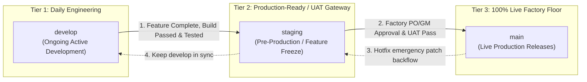
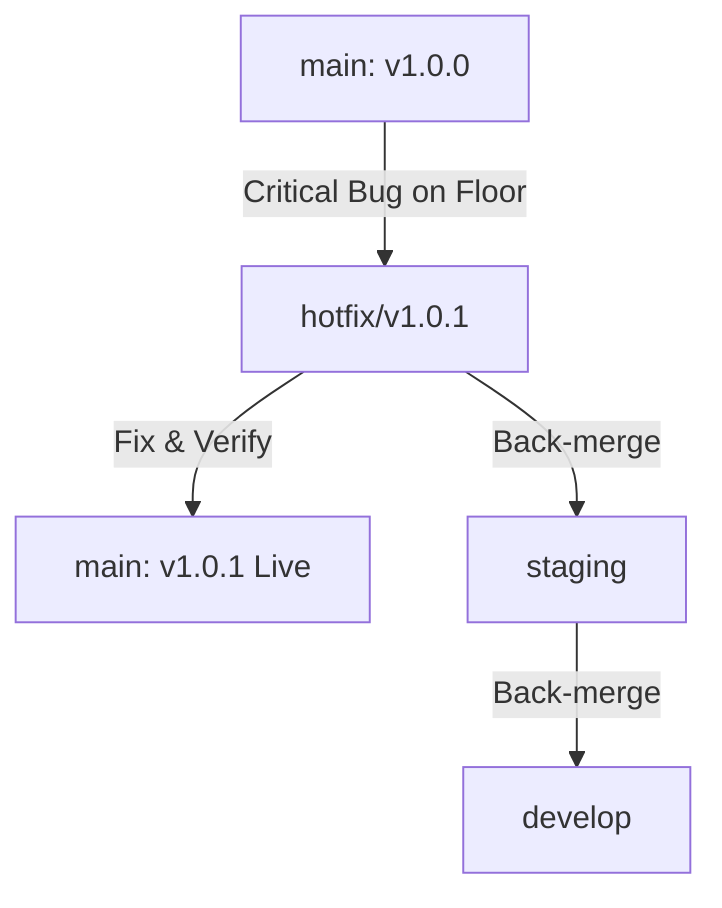

# Software Requirements Specification (SRS)
## Enterprise Git Branching, Staging Environment & Release Management Architecture
### (SDLC Governance, Pre-Production Gateways & Zero-Downtime Deployment Manifesto)

**ডকুমেন্ট রেফারেন্স:** `SRS-RMG-M00-GIT-BRANCHING-RELEASE-01`  
**মডিউল:** Cross-Cutting Infrastructure, SDLC Governance & Release Engineering  
**সিস্টেম:** TraceFlow RMG — Precision Fabric-to-Freight Garment Traceability Software  
**ভূমিকা/অথর:** RMG Lead DevOps & Solution Architect  
**স্ট্যাটাস:** Official Engineering Specification (Final Approved)  
**প্রযোজ্য শিল্প ও পরিবেশ:** এন্টারপ্রাইজ গার্মেন্টস ইআরপি ও শপফ্লোর ট্রেসেবিলিটি (Local Dev, Staging / UAT, Live Production)  
**ভাষা:** বাংলা (Bangla - Technical & Governance Specification Standard)  

---

## ১. নির্বাহী সারসংক্ষেপ ও প্রেক্ষাপট (Executive Summary)

তৈরি পোশাক (RMG) শিল্পের দৈনন্দিন উৎপাদন কার্যক্রমে শত শত ট্যাবলেট, কিউআর কোড স্ক্যানার, বায়োমেট্রিক পাঞ্চ মেশিন এবং সার্ভার নিরবচ্ছিন্নভাবে যুক্ত থাকে। কাটিং টেবিল থেকে শুরু করে সুইং লাইন ও ফিনিশিং কার্টনে রিয়েল-টাইম ট্র্যাকিং চলাকালীন যদি কোনো অপরীক্ষিত কোড সরাসরি প্রোডাকশনে ডেপ্লয় করা হয়, তবে কারখানার ফ্লোর বন্ধ হওয়া (Downtime) এবং কোটি টাকার শিপমেন্ট বিপর্যয় ঘটার ঝুঁকি থাকে।

একই সাথে, প্রোডাক্ট ওনার ও ফ্যাক্টরি কর্তৃপক্ষের প্রয়োজন হয়— **"ডেভেলপমেন্ট শেষ হয়েছে, ফিচারগুলো প্রোডাকশন-রেডি, কিন্তু এই মুহূর্তে সরাসরি লাইভ সার্ভারে যাবে না; প্রথমে ফ্যাক্টরি জিএম, মার্চেন্ডাইজার ও কিউএ টিম দ্বারা প্রি-লাইভ স্টেজিং পরিবেশে পরীক্ষিত হবে।"**

এই শূন্য-ঝুঁকি (Zero-Risk) ও নিরবচ্ছিন্ন অপারেশনাল ধারাবাহিকতা নিশ্চিত করতে **TraceFlow RMG** সিস্টেমে একটি কঠোর **৩-স্তর বিশিষ্ট এন্টারপ্রাইজ ব্রাঞ্চিং আর্কিটেকচার (3-Tier Branching & Staging Strategy)** প্রতিষ্ঠা করা হয়েছে।

---

## ২. কোর ব্রাঞ্চিং ট্রাইঅ্যাড (The Core 3-Tier Branching Triad)



### ২.১ ব্রাঞ্চসমূহের দায়িত্ব ও সুযোগ (Branch Roles & Access Controls)

| ব্রাঞ্চের নাম | পরিবেশ (Environment) | উদ্দেশ্য ও ভূমিকা | পুশ পারমিশন | অটোমেটেড গেটওয়ে / টেস্ট |
| :--- | :--- | :--- | :--- | :--- |
| **`develop`** | Local / Development Server | দৈনন্দিন সব ফিচার ডেভেলপমেন্ট, নতুন মডিউল, বাগফিক্স ও পরীক্ষামূলক কোড। | ইঞ্জিনিয়ারিং টিম | `tsc -b`, Unit Tests, Linting |
| **`staging`** | **Staging / Pre-Prod Server** | **প্রোডাকশন-রেডি কোড গেটওয়ে।** ফিচার কমপ্লিট কিন্তু লাইভ নয়। UAT, ক্লায়েন্ট ডেমো এবং পারফরম্যান্স অডিট। | শুধুমাত্র Lead Architect / DevOps | Integration Tests, E2E Regression Suite, Docker Build |
| **`main`** | **Live Production Server** | **১০০% রিয়েল-টাইম ফ্যাক্টরি ফ্লোর।** এই ব্রাঞ্চের কোড লাইভ সার্ভারে সরাসরি পরিচালিত হয়। | কঠোরভাবে লকড (Super Admin PR Only) | Semantic Tagging (e.g. `v1.0.0`), WORM Backup |

---

## ৩. স্টেজ ট্রানজিশন ও প্রোমোশন নীতি (Promotion Life-Cycle SOP)

### ৩.১ ফেজ ১: `develop` থেকে `staging`-এ প্রোমোশন (Release Candidate)
যখন কোনো নির্দিষ্ট মাইলস্টোন বা মডিউল (যেমন: Order Management, Woven Size Master, UOM Engine) সম্পন্ন হয়:
1. **বিল্ড ও টাইপ-সেফটি গেট:** `frontend` ডিরেক্টরিতে `npm run build` (`tsc -b && vite build`) সফলভাবে ০ এররে উত্তীর্ণ হতে হবে।
2. **ব্যাকএন্ড ইন্টিগ্রিটি:** `php artisan test` অথবা ফিচার টেস্ট পাস হতে হবে।
3. **মার্জ প্রসিডিউর:**
   ```bash
   git checkout staging
   git merge develop --no-ff -m "chore(staging): promote develop milestone (Woven Size Master & Order Engine)"
   git push origin staging
   ```
4. **স্টেজিং ডেপ্লয়মেন্ট:** স্টেজিং সার্ভারে ডেটাবেজ মাইগ্রেশন ও সীডার রান করে প্রি-লাইভ ডাটা দিয়ে টেস্টের জন্য উন্মুক্ত করা হবে।

### ৩.২ ফেজ ২: স্টেজিং ভ্যালিডেশন ও UAT গেট (Pre-Live Approval)
`staging` ব্রাঞ্চে কোড চলাকালীন:
1. কোনো ডেভেলপার সরাসরি `staging`-এ নতুন ফিচার পুশ করতে পারবে না (Feature Freeze)।
2. ফ্যাক্টরি কর্তৃপক্ষ (Product Owner, Merchandisers, Industrial Engineers) সিস্টেমের কার্যকারিতা যাচাই করবেন।
3. যদি স্টেজিং টেস্টে কোনো মাইনর বাগ ধরা পড়ে, তা `develop`-এ ফিক্স করে পুনরায় স্টেজিংয়ে প্রোমোট করতে হবে।

### ৩.৩ ফেজ ৩: `staging` থেকে `main`-এ লাইভ রিলিজ (Final Production Go-Live)
যখন ফ্যাক্টরি কর্তৃপক্ষ রিলিজ সাইন-অফ করবেন:
1. **প্রোডাকশন মার্জ:**
   ```bash
   git checkout main
   git merge staging --no-ff -m "release: v1.0.0 TraceFlow RMG Enterprise Production Launch"
   ```
2. **রিলিজ ট্যাগিং (Semantic Versioning):**
   ```bash
   git tag -a v1.0.0 -m "Release v1.0.0: Woven Garments Traceability Core System"
   git push origin main --tags
   ```
3. **লাইভ ডেপ্লয়মেন্ট:** জিরো-ডাউনটাইম ডকার কনটেইনার রোলআউট সম্পন্ন করা হবে।

---

## ৪. হটফিক্স ম্যানেজমেন্ট আর্কিটেকচার (Emergency Production Hotfix SOP)

যদি লাইভ প্রোডাকশনে কোনো জটিল ক্রিটিক্যাল বাগ দেখা দেয়:
1. `main` ব্রাঞ্চ থেকে সরাসরি একটি `hotfix/*` ব্রাঞ্চ তৈরি হবে (যেমন: `hotfix/login-port-refused`)।
2. সমস্যা সমাধান শেষে `hotfix` ব্রাঞ্চটি একই সাথে **`main`** এবং **`staging`** ও **`develop`**-এ মার্জ হবে যাতে কোনো ব্রাঞ্চেই কোড অমিল (Code Drift) তৈরি না হয়।



---

## ৫. গভর্ন্যান্স ও অটোমেশন রুলস (Governance & Policy Matrix)

1. **Direct Commit to `main` STRICTLY FORBIDDEN:** কোনো অবস্থাতেই `main` ব্রাঞ্চে সরাসরি কোনো পুশ করা যাবে না। প্রতিটি লাইভ রিলিজ অবশ্যই `staging` থেকে মার্জ হয়ে আসবে।
2. **Single Source of Truth Preservation:** `staging` ব্রাঞ্চ কখনই `develop`-এর চেয়ে পুরানো বা ডিসিঙ্ক হতে পারবে না। প্রতি স্প্রিন্ট বা মাইলস্টোন শেষে স্টেজিং আপডেট করা বাধ্যতামূলক।
3. **Docker Environment Alignment:** 
   - `develop`: লোকাল উইন্ডোজ ও ডকার ডেভ কন্টেইনার।
   - `staging`: স্টেজিং টেস্ট সার্ভার আইসোলেটেড ডকার নেটওয়ার্ক।
   - `main`: ক্লাউড/অন-প্রেমিসেস হাই-অ্যাভেইলেবিলিটি ডকার সোয়ার্ম/কুবারনেটিস প্রোডাকশন ক্লাস্টার।

---

## ৬. সাইন-অফ ও কমপ্লায়েন্স চেকলিস্ট (Sign-Off & Compliance Gate)

| নিয়ন্ত্রণ মানদণ্ড | বিবরণ | স্ট্যাটাস |
| :--- | :--- | :--- |
| **মধ্যবর্তী স্টেজিং স্তরের উপস্থিতি** | `develop` এবং `main`-এর মাঝে প্রি-লাইভ `staging` ব্রাঞ্চের স্পেসিফিকেশন সম্পন্ন | কমপ্লায়েন্ট |
| **টাইপসেফ বিল্ড ভেরিফিকেশন** | প্রোমোশনের পূর্বে ফ্রন্টএন্ড `npm run build` ও ব্যাকএন্ড টেস্ট বাধ্যতামূলক | সক্রিয় |
| **রিলিজ ট্যাগিং স্ট্যান্ডার্ড** | প্রোডাকশনে যাওয়ার আগে সেমান্টিক ট্যাগিং (`vX.Y.Z`) বাধ্যতামূলক | সক্রিয় |
| **জিরো রিগ্রেশন গ্যারান্টি** | [regression_prevention_srs.md](file:///g:/ERP/TraceFlow-RMG-main/docs/srs/regression_prevention_srs.md) এর সাথে ১০০% সামঞ্জস্যপূর্ণ | সক্রিয় |
