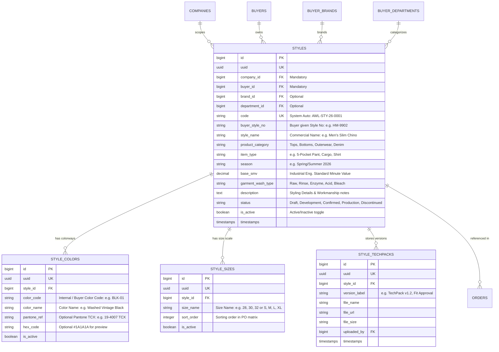

# Software Requirements Specification (SRS)
## Enterprise Style Library & Merchandising Master Architecture
**Document Reference:** `SRS_Enterprise_Style_Library_Specification.md`  
**Target Audience:** Product Owner, Solution Architect, Lead Backend Engineers, Frontend Engineers, Merchandisers, IE Team  
**Language Standard:** Bengali (Bangla) Requirements & Architectural Manifesto  
**System Scope:** TraceFlow RMG ERP Ecosystem (Exclusively 100% Woven Garments Manufacturing)  
**Document Version:** 3.1 (Woven Specialization Edition)  

---

## ১. ভূমিকা ও ব্যবসায়িক প্রেক্ষাপট (Executive Business Context)

> [!IMPORTANT]
> **সিস্টেম স্কোপ পলিসি (Strict 100% Woven Scope):**  
> এই ট্রেসেবিলিটি এবং ইআরপি প্ল্যাটফর্মটি **একচেটিয়াভাবে তৈরি পোশাকের "ওভেন গার্মেন্টস ম্যানুফ্যাকচারিং" (100% Woven Garments Only)** এর জন্য নিবেদিত। এতে কোনো প্রকার নিট (Knit) বা সোয়েটার প্রক্রিয়া অন্তর্ভুক্ত নয়। ওভেন পোশাকের সুনির্দিষ্ট অপারেশনাল প্রক্রিয়া—যেমন: রোল-টু-রোল ফেব্রিক ইনস্পেকশন (ASTM 4-Point), রিল্যাক্সেশন প্রক্রিয়া, প্যাটার্ন গ্রেইনিং, কাটিং স্প্রেডিং টেবিল, ফিউজিং মেশিনারি, ওভেন স্টিচিং লাইন (ডেনিম, ট্রাউজার, শার্ট, কার্গো, জ্যাকেট) এবং ইন্ডাস্ট্রিয়াল গার্মেন্টস ওয়াশিং এর উপর ভিত্তি করে সম্পূর্ণ আর্কিটেকচার তৈরি করা হয়েছে।

ওভেন তৈরি পোশাক শিল্পে **"স্টাইল (Style)"** হলো সম্পূর্ণ ম্যানুফ্যাকচারিং, কস্টিং ও ট্রেসেবিলিটি চেইনের প্রধান কেন্দ্রবিন্দু। একটি ওভেন পোশাক কারখানায় বায়ারের প্রাথমিক ইনকোয়ারি গ্রহণ, টেক-প্যাক (Tech Pack) অ্যানালাইসিস, ওভেন ফেব্রিক কনজাম্পশন (Yards/Meters), কাটিং মার্কার তৈরি, সুইং লাইন লোডিং, হেভি ওভেন ওয়াশিং রেসিপি নির্ধারণ এবং ফাইনাল কোয়ালিটি ইন্সপেকশনের প্রতিটি ট্রানজ্যাকশন সরাসরি একটি নিবন্ধিত ও অনুমোদিত ওভেন স্টাইলের (Woven Style Master Entity) সাথে আবদ্ধ থাকে।

### ১.১ বাস্তব ওভেন গার্মেন্টস অপারেশনে স্টাইলের ভূমিকা
1. **Buyer & Sub-Entity Inheritance:** আন্তর্জাতিক ওভেন বায়ার (যেমন: H&M, Inditex/Zara, Levi's, American Eagle, Tommy Hilfiger) তাদের প্রতিটি সিজনাল ওভেন অর্ডারের জন্য ইউনিক স্টাইল কোড (Style Number) এবং সম্পূর্ণ স্পেসিফিকেশন শিট প্রদান করে। স্টাইল অবশ্যই নির্দিষ্ট বায়ার, বায়ারের সাব-ব্র্যান্ড এবং ডিপার্টমেন্টের সাথে সম্পর্কিত হতে হবে।
2. **Standard Minute Value (SMV) ও IE ক্যাপাসিটি:** ইন্ডাস্ট্রিয়াল ইঞ্জিনিয়ারিং (IE) টিম প্রতিটি ওভেন স্টাইলের অপারেশনের জটিলতা (Operation Breakdown - যেমন: ফ্রন্ট পার্ট, ব্যাক পার্ট, পকেট মেকিং, জিপার এটাচ, কলার জয়েন্ট, ওয়েস্টব্যান্ড ফিউজিং ইত্যাদি) অনুযায়ী স্ট্যান্ডার্ড মিনিট ভ্যালু (Base SMV) নির্ধারণ করে। এই SMV সরাসরি ওভেন সুইং লাইনের দৈনিক টার্গেট এবং এফিশিয়েন্সি হিসাব করতে ব্যবহৃত হয়।
3. **Bill of Materials (BOM) ও ট্রিমস কনজাম্পশন:** ওভেন স্টাইলে কোন কোন ওভেন ফেব্রিক কনস্ট্রাকশন (Twill, Denim, Poplin, Canvas, Sheeting, Flannel, Oxford) এবং কোন কোন ওভেন ট্রিমস (বাটন, মেটাল জিপার, রিভেট, ফিউজিং ইন্টারলাইনিং, ড্র কর্ড, লেবেল, থ্রেড) ব্যবহৃত হবে তার ভিত্তি হলো এই স্টাইল মাস্টার।
4. **Colorways & Size Range Matrix:** প্রতিটি স্টাইলের অধীনে একাধিক বায়ার কালার (যেমন: Black, Vintage Indigo Wash) এবং নির্ধারিত সাইজ স্কেল (যেমন: ওভেন ট্রাউজার/ডেনিমের জন্য Waist 28 to 38, Inseam 30, 32, 34 অথবা ওভেন শার্টের জন্য S, M, L, XL, XXL) থাকে, যা ডাউনস্ট্রিম কাটিং বান্ডেল টিকিটের ম্যাট্রিক্স তৈরি করে।

---

## ২. সিস্টেম রুলস ও আর্কিটেকচারাল কমপ্লায়েন্স (Core Architectural Rules)

প্রজেক্টের গ্লোবাল রুলস (`AGENTS.md`) অনুযায়ী স্টাইল মডিউলে নিচের নিয়মগুলো অলঙ্ঘনীয়:

1. **System Auto-Generated Entity Code Standard (STRICT & FINAL):**
   - স্টাইলের ইন্টারনাল ট্র্যাকিং কোডটি ১০০% সিস্টেম দ্বারা স্বয়ংক্রিয়ভাবে জেনারেট হবে।
   - **ফরমূলা:** `[CompanyShortCode]-STY-[YY]-[SequentialNumber]`  
     *উদাহরণ:* `AWL-STY-26-0001`, `PLT-STY-26-0002`।
   - ফর্ম স্ক্রিনে এই কোড ইনপুটটি নিষ্ক্রিয় (`readOnly={true}`) থাকবে এবং সাথে "System Auto" ব্যাজ থাকবে।
   - বায়ারের দেওয়া নিজস্ব স্টাইল নম্বরটি সংরক্ষণের জন্য আলাদা `buyer_style_no` (যেমন: `HM-JEANS-9901`) ফিল্ড থাকবে।

2. **Immutable UUID Architecture (STRICT):**
   - প্রতিটি স্টাইলের জন্য ইউনিক `uuid` থাকবে।
   - ফ্রন্টএন্ডের সমস্ত রুট (`/master/styles/:uuid`, `/master/styles/:uuid/edit`) এবং এপিআই ইন্টারঅ্যাকশন UUID ব্যবহার করবে।
   - ডাটাবেজে ফরেন-কি হিসেবে অপ্টিমাইজড `id` (BigInt) সংরক্ষিত থাকবে যাতে হাই-পারফরম্যান্স কুয়েরি বজায় থাকে।

3. **Pure Server-Side Validation Only:**
   - কোনো নেটিভ ব্রাউজার এইচটিএমএল৫ পপআপ ভ্যালিডেশন থাকবে না (`noValidate` ব্যবহৃত হবে)।
   - সমস্ত ভ্যালিডেশন ব্যাকএন্ড এপিআই-এর HTTP 422 JSON ফরম্যাটে পরিচালিত হবে এবং নির্দিষ্ট ফিল্ডের নিচে প্রদর্শিত হবে।

4. **Dedicated Full Pages for CRUD (No Modals Rule - STRICT):**
   - স্টাইল তৈরি (`/master/styles/create`), ডিটেইলস দেখা (`/master/styles/:uuid`), এবং এডিট করার (`/master/styles/:uuid/edit`) জন্য ডেডিকেটেড ফুল-পেজ থাকবে।
   - কোনো মোডাল, ড্রয়ার বা পপআপে স্টাইল CRUD করা যাবে না।

5. **সেন্ট্রালাইজড ডিজাইন টোকেন (`UI_TOKENS`):**
   - কোনো অ্যাড-হক ইনলাইন টেলউইন্ড ক্লাস লেখা যাবে না। সমস্ত ইউআই এলিমেন্ট `designTokens.ts` এবং `frontend/src/components/common/` প্রিমিটিভ থেকে ব্যবহৃত হবে।

---

## ৩. ডোমেন মডেল ও ডেটাবেজ আর্কিটেকচার (Domain & Database Architecture)

---

## ৪. বিস্তারিত ফিল্ড লেভেল স্পেসিফিকেশন (Field Specifications)

| ফিল্ডের নাম | ডেটা টাইপ | বাধ্যতামূলক? | বিজনেস ও সিস্টেম ভ্যালিডেশন রুলস | ফ্রন্টএন্ড UI কন্ট্রোল |
|---|---|---|---|---|
| `Company` | BigInt / UUID | **হ্যাঁ** | সিস্টেমে অ্যাক্টিভ কোম্পানি (`companies`)। কোম্পানি কোড দিয়ে স্টাইল কোড নির্ধারিত হবে। | Select Dropdown (`UI_TOKENS.input.select`) |
| `Style Code` | String | **সিস্টেম অটো** | অপরিবর্তনীয়, সিস্টেম জেনারেটেড (`[CompanyCode]-STY-[YY]-[Seq]`)। ইউজার টাইপ করতে পারবে না। | Disabled Input (`readOnly={true}`) with "System Auto" Badge |
| `Buyer` | BigInt / UUID | **হ্যাঁ** | সিস্টেমে অ্যাক্টিভ বায়ার (`buyers`)। সিলেক্ট করলে সংশ্লিষ্ট বায়ারের ব্র্যান্ড ও ডিপার্টমেন্ট ফিল্টার হবে। | Searchable Dropdown |
| `Buyer Brand` | BigInt / UUID | না | নির্বাচিত বায়ারের নিবন্ধিত সাব-ব্র্যান্ড (`buyer_brands`)। | Cascading Select |
| `Buyer Department`| BigInt / UUID | না | নির্বাচিত বায়ারের প্রোডাকশন বিভাগ (`buyer_departments`)। | Cascading Select |
| `Buyer Style No` | String (50) | **হ্যাঁ** | বায়ারের অফিসিয়াল স্টাইল নম্বর (যেমন: `HM-JEANS-001`)। একই বায়ারের অধীনে ইউনিক হতে হবে। | TextInput |
| `Style Name` | String (150) | **হ্যাঁ** | বাণিজ্যিক বা ডেসক্রিপটিভ স্টাইল নেম (যেমন: "Men's 5-Pocket Slim Fit Denim Pant")। Min: 3, Max: 150 chars। | TextInput |
| `Product Category`| Enum | **হ্যাঁ** | **শুধুমাত্র ওভেন ক্যাটাগরি:** `Woven Tops (Shirts/Blouses)`, `Woven Bottoms (Trousers/Chinos)`, `Denim & Jeans`, `Cargo & Utility Shorts`, `Outerwear / Woven Jackets`। | Select Dropdown |
| `Garment Item` | String (100) | **হ্যাঁ** | সুনির্দিষ্ট ওভেন আইটেম (যেমন: `5-Pocket Denim Pant`, `Casual Chino Pant`, `Cargo Pant`, `Long Sleeve Dress Shirt`, `Flannel Shirt`, `Trucker Jacket`, `Blazer / Suit Jacket`)। | TextInput / Autocomplete |
| `Fabric Type` | String (100) | **হ্যাঁ** | ওভেন ফেব্রিক কনস্ট্রাকশন (যেমন: `100% Cotton Twill`, `Denim (12 oz Spandex)`, `Poplin`, `Canvas`, `Chambray`, `Oxford`, `Corduroy`)। | TextInput / Autocomplete |
| `Season` | String (50) | **হ্যাঁ** | বায়ার সিজন ও বছর (যেমন: `Spring/Summer 2026`, `Autumn/Winter 2026`, `Pre-Fall 2026`)। | TextInput / Season Select |
| `Base SMV` | Decimal (5,2) | **হ্যাঁ** | ওভেন গার্মেন্টস স্ট্যান্ডার্ড মিনিট ভ্যালু (যেমন: `18.50`). ০.০১ থেকে ৯৯৯.৯৯ এর মধ্যে হতে হবে। | Number Input (Step: 0.01) |
| `Wash Type` | Enum | **হ্যাঁ** | **ওভেন ওয়াশ প্রসেস:** `None / Raw / Rinse`, `Enzyme Wash`, `Stone Enzyme Wash`, `Bleach Wash`, `Acid Wash`, `Tint & Distress`, `Resin 3D Crinkle`। | Select Dropdown |
| `Colorways List` | Array (Object)| **হ্যাঁ** | কমপক্ষে ১টি কালার থাকতে হবে। প্রতিটি কালারের কোড ও নাম বাধ্যতামূলক। | Dynamic Row Repeater with Add/Remove |
| `Size Scale` | Array (Object)| **হ্যাঁ** | কমপক্ষে ১টি সাইজ থাকতে হবে। সাইজের নাম ও ম্যাট্রিক্স সাজানোর সর্ট অর্ডার থাকবে। | Dynamic Size Builder / Preset Chips |
| `Description` | Text | না | ফেব্রিক কনস্ট্রাকশন, স্টিচিং ডিটেইলস ও বিশেষ স্পেসিফিকেশন নোট। | Textarea |
| `Status` | Enum | **হ্যাঁ** | `Development`, `Sampling`, `Confirmed`, `Bulk_Approved`, `Discontinued` (ডিফল্ট: `Development`)। | Status Select / Badge |
| `Is Active` | Boolean | **হ্যাঁ** | বাইনারি অপারেশনাল স্ট্যাটাস। ইনঅ্যাক্টিভ হলে নতুন অর্ডারে সিলেক্ট করা যাবে না। | Standard `<Toggle>` Component |

---

## ৫. ব্যবসায়িক রুলস ও ডাউনস্ট্রিম প্রসেস সেফটি (Business Rules & Integrity)

1. **Rule 1 (Buyer-Scoped Uniqueness):**
   - বায়ারের নিজস্ব স্টাইল নম্বর (`buyer_style_no`) একই বায়ারের অধীনে ডুপ্লিকেট হতে পারবে না (`unique: buyer_id + buyer_style_no`)। 
   - ভিন্ন বায়ারের একই স্টাইল নম্বর থাকতে পারে, কিন্তু একই বায়ারের অধীনে দ্বিতীয়বার এন্ট্রি দিলে সার্ভার `HTTP 422 Unprocessable Entity` প্রদান করবে: *"This buyer already has an existing style with this Style Number."*

2. **Rule 2 (Downstream Matrix Lock in Production):**
   - স্টাইলের বিপরীতে যদি ইতিমধ্যে কনফার্মড Purchase Order (PO) তৈরি হয়ে যায় এবং কাটিং ফ্লোরে ফেব্রিক কাটা শুরু হয়ে যায়, তবে স্টাইল থেকে বিদ্যমান কালার বা সাইজ মুছে ফেলা (Delete) সম্পূর্ণ নিষিদ্ধ থাকবে।
   - তবে বায়ারের অতিরিক্ত রিকোয়ারমেন্ট অনুযায়ী স্টাইলে যেকোনো সময় **নতুন কালার** বা **নতুন সাইজ** সংযুক্ত (Add) করা যাবে।

3. **Rule 3 (Historical Traceability & Soft Delete):**
   - যেসব স্টাইলের বিপরীতে পূর্ববর্তী অর্ডার, কস্টিং বা কাটিং রেকর্ড রয়েছে, সেগুলোকে কখনোই ডাটাবেজ থেকে স্থায়ীভাবে মুছে ফেলা (Hard Delete) যাবে না। 
   - প্রয়োজনে স্টাইলটি `is_active = false` বা `Discontinued` করা যাবে।

---

## ৬. ব্যাকএন্ড রেস্টফুল এপিআই স্পেসিফিকেশন (RESTful API Standards)

| Method | Endpoint | অ্যাক্সেস পারমিশন | ফাংশনালিটি |
|---|---|---|---|
| `GET` | `/api/v1/styles/next-code?company_id={id}` | `master_data.styles.profile.view` | ফ্রন্টএন্ড ক্রিয়েট ফর্মের জন্য লাইটওয়েট নেক্সট স্টাইল কোড প্রিভিউ (`AWL-STY-26-0001`)। |
| `GET` | `/api/v1/styles` | `master_data.styles.profile.view` | সার্চ, বায়ার ফিল্টার, সিজন ফিল্টার, সর্টিং এবং পেজিনেশনসহ স্টাইল ডিরেক্টরি তালিকা। |
| `POST` | `/api/v1/styles` | `master_data.styles.profile.create` | নতুন স্টাইল মাস্টার, কালারওয়েজ এবং সাইজ স্কেল ডাটাবেজে পারসিস্ট করা। |
| `GET` | `/api/v1/styles/{id_or_uuid}` | `master_data.styles.profile.view` | একক স্টাইলের পূর্ণাঙ্গ প্রোফাইল, কালার লিস্ট, সাইজ স্কেল ও বায়ার মেটাডাটা। |
| `PUT` | `/api/v1/styles/{id_or_uuid}` | `master_data.styles.profile.update` | বিদ্যমান স্টাইলের স্পেসিফিকেশন ও কালার-সাইজ রেঞ্জ আপডেট। |
| `DELETE` | `/api/v1/styles/{id_or_uuid}` | `master_data.styles.profile.delete` | স্টাইল সফট ডিলিট (যদি কোনো সক্রিয় প্রোডাকশন বা অর্ডার না থাকে)। |
| `PATCH` | `/api/v1/styles/{id_or_uuid}/toggle-status` | `master_data.styles.profile.update` | স্টাইলের অপারেশনাল স্ট্যাটাস (Active/Inactive) তাৎক্ষণিক টগল করা। |
| `GET` | `/api/v1/styles/by-buyer/{buyer_id_or_uuid}` | `master_data.styles.profile.view` | অর্ডার এন্ট্রি পেজের জন্য বায়ার-স্পেসিফিক সক্রিয় স্টাইলগুলোর ড্রপডাউন ফেচ। |

---

## ৭. ফ্রন্টএন্ড UI/UX গোল্ডেন ৩-টিয়ার স্ট্যান্ডার্ড (Golden UI/UX Standards)

### ৭.১. Tier 1: Style Directory (`StyleListPage.tsx`)
- **Header Row (`PageHeader`):** বামে টাইটেল `Style Library` + কাউন্টার ব্যাজ `<Badge variant="neutral">{total} Styles</Badge>`, ডানে প্রাইমারি বাটন `<Button variant="primary" icon={<Plus />}>Create Style</Button>` এবং সেকেন্ডারি বাটন `<Button variant="secondary" icon={<Download />}>Export Directory</Button>`।
- **Filter Toolbar (`FilterToolbar`):** ফুল-উইডথ সার্চ ইনপুট (স্টাইল কোড, বায়ার স্টাইল নম্বর, বায়ার নাম), কোম্পানি ড্রপডাউন, বায়ার ড্রপডাউন, সিজন ড্রপডাউন, ওয়াশ টাইপ ড্রপডাউন, স্ট্যাটাস ফিল্টার, "Filter" বাটন ও "Reset" রোটেট বাটন। সাবলাইনে সর্টিং ইন্ডিকেটর এবং পার-পেইজ সিলেক্টর (10, 15, 25, 50)।
- **DataTable Shell (`DataTable<Style>`):** ফিক্সড এন্টারপ্রাইজ টেবিল শেল:
  - `Style Code`: মনোস্পেস ফন্ট, বোল্ড ব্যাজ (`AWL-STY-26-0001`)।
  - `Buyer Style No`: বায়ারের অফিসিয়াল স্টাইল নম্বর (`HM-9902`)।
  - `Style Name`: বোল্ড টাইটেল এবং নিচে বায়ার ও ব্র্যান্ডের নাম।
  - `Category & Item`: ক্যাটাগরি পিল (e.g. `Denim Bottoms • Chino`)।
  - `Season`: সিজন ব্যাজ (e.g. `SS-2026`)।
  - `Base SMV`: ক্যালকুলেটেড মিনিট ভ্যালু (e.g. `18.50 min`)।
  - `Colors & Sizes`: কাউন্টার চিপস (e.g. `4 Colors • 8 Sizes`)।
  - `Status`: `<Badge variant="success | warning | neutral">`।
  - `Actions`: ভিউ প্রোফাইল, এডিট স্টাইল এবং কুইক স্ট্যাটাস টগল।

### ৭.২. Tier 2: Style Form Page (`StyleFormPage.tsx` - Create & Edit)
- **২-কলাম গোল্ডেন লেআউট (`grid grid-cols-1 lg:grid-cols-3 gap-4`):**
  - **বামের ২/৩ কলাম (`lg:col-span-2 space-y-4`):**
    - **Card 1 (Entity Affiliation & Commercial Core):** Company Select, Buyer Searchable Select, Buyer Brand, Buyer Department, Season।
    - **Card 2 (Garment Specifications):** System Auto Code Preview, Buyer Style Number, Style Legal Name, Product Category, Garment Item, Base SMV, Garment Wash Type, Description।
    - **Card 3 (Colorways Builder):** ডায়নামিক কালার রিপিটার (Color Code, Color Name, Pantone Reference, Color Hex Picker, Add/Remove Button)।
    - **Card 4 (Size Scale Builder):** কুইক প্রিসেট চিপস (S-XXL, Waist 28-40) অথবা কাস্টম সাইজ অ্যাড বাটন।
  - **ডানের ১/৩ সাইডবার (`space-y-4`):**
    - **Card 1 (Operational Status & Governance):** স্টাইল লাইফসাইকেল স্ট্যাটাস সিলেক্ট (`Development`, `Sampling`, `Bulk_Approved`), অপারেশনাল স্ট্যাটাস স্ট্যান্ডার্ড `<Toggle>` (Active/Inactive), এবং সিস্টেম কোড প্রিভিউ প্যানেল।
    - **Card 2 (Production Guidelines):** মার্চেন্ডাইজিং গাইডলাইন ও টেকনিক্যাল চেকলিস্ট।

### ৭.৩. Tier 3: Style Details Page (`StyleDetailsPage.tsx`)
- বায়ার, ব্র্যান্ড, এসএমভি, কালার ম্যাট্রিক্স, সাইজ রেঞ্জ, এবং ডাউনস্ট্রিম অর্ডার স্ট্যাটাসের সুবিন্যস্ত ২-কলাম সামারি ভিউ।

---

## ৮. অনুমোদন ও সাইন-অফ (Sign-Off Matrix)

| ভূমিকা | নাম | পদবি | স্ট্যাটাস |
|---|---|---|---|
| **Product Owner** | Executive Sponsor / PO | Lead Product Strategist | [Approved via Specification] |
| **Solution Architect** | Antigravity Architect | Core Architecture Lead | [Approved for Implementation] |
| **Lead Backend Engineer** | RMG Backend Team | API & Database Guardian | [Ready to Code] |
| **Lead Frontend Engineer** | RMG Frontend Team | Enterprise UI/UX Lead | [Ready to Code] |
