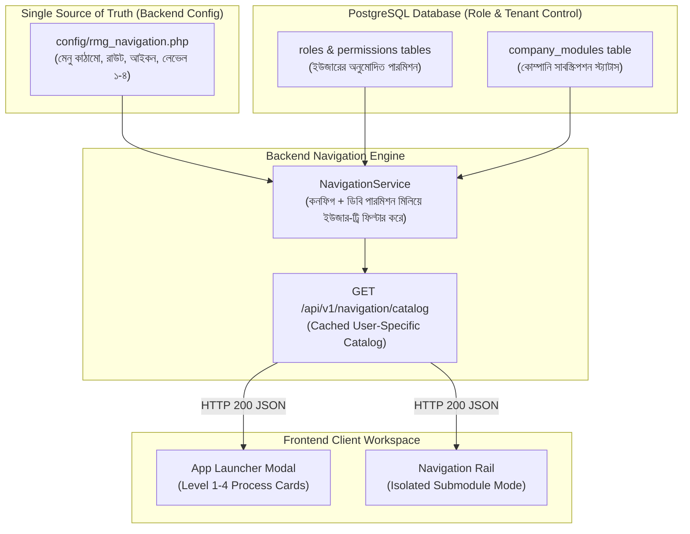

# Software Requirements Specification (SRS)
## হায়ারার্কিকাল মাল্টি-লেভেল অ্যাপ লঞ্চার ও আইসোলেটেড সাইডবার নেভিগেশন আর্কিটেকচার (Hierarchical Multi-Level App Launcher & Isolated Navigation Architecture)

---

### ১. ভূমিকা ও প্রেক্ষাপট (Introduction & Executive Summary)

#### ১.১ উদ্দেশ্য (Purpose)
TraceFlow RMG ওভেন গার্মেন্টস এন্টারপ্রাইজ ট্রেসেবিলিটি সিস্টেমে প্রায় ১২+ বিজনেস ডোমেইন (System Admin, Master Data, Merchandising, Supply Chain, Fabric Inspection, Cutting, Sewing, QC, Finishing & Export) এবং ৬০+ অপারেশনাল মেনু ও ফিচার বিদ্যমান।
কারখানার বিভিন্ন স্তরের ব্যবহারকারী (যেমন: সিইও, মার্চেন্ডাইজার, স্টোর কিপার, কাটিং ইনচার্জ, কিউসি অডিটর)-দের জন্য একটি জটিল ইআরপির মেনুগুলো সহজে অ্যাক্সেসযোগ্য ও বিশৃঙ্খলাহীন (Zero-Distraction) হওয়া অপরিহার্য। 

এই এসআরএস (SRS) ডকুমেন্টের উদ্দেশ্য হলো:
1. **App Launcher ("All Modules & Workflows")**-এর জন্য একটি সুনির্দিষ্ট ৩/৪-লেভেল ভিজ্যুয়াল হায়ারার্কি প্রতিষ্ঠা করা:
   $$\text{Level 1: Main Module (ক্যাটাগরি)} \longrightarrow \text{Level 2: Sub Module (প্রসেস কার্ড)} \longrightarrow \text{Level 3: Sub-Sub Module (ফিচার ক্লাস্টার)} \longrightarrow \text{Level 4: Menu / Action (অ্যাকশন পিল)}$$
2. **আইসোলেটেড সাইডবার ফিল্টারিং স্ট্যান্ডার্ড (Focused Workspace Standard):** অ্যাপ লঞ্চারে যেকোনো নির্দিষ্ট সাবমডিউল বা মেনু নির্বাচন করলে সাইডবার নেভিগেশন রেইল যেন স্বয়ংক্রিয়ভাবে শুধুমাত্র সেই প্রাসঙ্গিক সাবমডিউল ও তার ভেতরের চাইল্ড মেনুগুলোকে প্রদর্শন করে এবং বাকি অপ্রাসঙ্গিক মেনুগুলোকে লুকিয়ে রাখে।

#### ১.২ সুযোগ ও পরিধি (Scope)
- **ব্যাকএন্ড কনফিগারেশন (Single Source of Truth)**: `backend/config/rmg_navigation.php` (যেখানে Level 1 থেকে Level 4 পর্যন্ত সম্পূর্ণ মেনু ও রাউটের হায়ারার্কি সংজ্ঞায়িত থাকবে)।
- **ডাটাবেজ ওভারলে (RBAC & Tenant Control)**: ইউজারের ডাটাবেজ পারমিশন (`permissions`, `roles`) এবং কোম্পানির অ্যাক্টিভ মডিউল স্টেট ডায়নামিক্যালি চেক করে মেনু ফিল্টার করা হবে।
- **নেভিগেশন এন্ডপয়েন্ট**: `GET /api/v1/navigation/catalog` (ইউজার-স্পেসিফিক ফিল্টার্ড ও অপ্টিমাইজড মেনু ট্রি)।
- **App Launcher Modal** (`frontend/src/components/layout/AppLauncherModal.tsx`): সম্পূর্ণ ৩/৪-লেভেল ভিজ্যুয়াল কার্ড ডিজাইন।
- **Sidebar Navigation Rail** (`frontend/src/components/layout/NavigationRail.tsx`): আইসোলেটেড সাবমডিউল মোড ও ফোকাসড ব্যানার হ্যান্ডলিং।
- **অ্যাপ্লিকেশান স্টেট ম্যানেজমেন্ট** (`frontend/src/App.tsx`): `activeSubmoduleGroup` ও রাউটিং ইন্টিগ্রেশন।

---

### ২. হাইব্রিড সিস্টেম আর্কিটেকচার ও মেনু প্রবাহ (Hybrid Architecture & Data Flow)



---

### ৩. ফাংশনাল রিকোয়ারমেন্টস (Functional Requirements)

#### ৩.১ অ্যাপ লঞ্চার ডেটা স্ট্রাকচার (Data Schema Requirements)
অ্যাপ লঞ্চারের প্রতিটি নোডকে অবশ্যই টাইপ-সেফ ইন্টারফেসে সংজ্ঞায়িত হতে হবে:

```typescript
// Level 4: Menu Action Link
export interface NavMenuAction {
  id: string;                         // e.g. "master-companies"
  label: string;                      // e.g. "Company Directory"
  path: string;                       // e.g. "/companies"
  badge?: string;                     // e.g. "CRUD", "100%"
  requiredPermissions?: string[];
  requiredRoles?: string[];
}

// Level 3: Sub-Sub Module (Feature Cluster)
export interface SubSubModule {
  id: string;                         // e.g. "legal-units"
  title: string;                      // e.g. "Legal & Corporate Setup"
  description?: string;
  menus: NavMenuAction[];             // Child action links
}

// Level 2: Sub Module (Process Card)
export interface SubModuleCard {
  id: string;                         // e.g. "org-setup-group"
  name: string;                       // e.g. "Organization Setup"
  description: string;                // Short microcopy
  icon: React.ComponentType<{ className?: string }>;
  badge?: "Core" | "Master" | "Active" | "WIP";
  subSubModules?: SubSubModule[];     // If 4-level hierarchy exists
  directMenus?: NavMenuAction[];      // If flat 3-level hierarchy
  requiredRoles?: string[];
  requiredPermissions?: string[];
}

// Level 1: Main Business Module
export interface MainModuleCategory {
  id: string;                         // e.g. "master-data"
  step: string;                       // e.g. "02"
  title: string;                      // e.g. "2. Master Data (Central Repository)"
  subModules: SubModuleCard[];
}
```

#### ৩.২ ইউআই/ইউএক্স লেআউট স্ট্যান্ডার্ড (UI/UX Layout Specifications)
1. **Level 1 (Main Module Banner)**:
   - ফুল-উইডথ সেকশন হেডার।
   - রাউন্ডেড স্টেপ ব্যাজ (যেমন `01`, `02`, `03`) + ক্যাটাগরি নাম + মোট ফিচার সংখ্যা।
2. **Level 2 (Sub Module Card)**:
   - স্লিক এন্টারপ্রাইজ কার্ড (`UI_TOKENS.card.base`, `rounded-lg border border-slate-200`).
   - কার্ডের শীর্ষে আইকন বক্স, নাম এবং স্ট্যাটাস ব্যাজ (`Core`, `Master`)।
3. **Level 3 (Sub-Sub Module Grouping)**:
   - **রুল (No Nested Bulky Cards)**: সাব-সাব মডিউলের জন্য কার্ডের ভেতরে আবার বড় কার্ড দেওয়া কঠোরভাবে নিষিদ্ধ।
   - এর বদলে কার্ডের ভেতরে হালকা ডিভাইডার লাইন (`border-t border-slate-100 pt-2`) সহ **ক্যাটাগরি মাইক্রো-হেডার বা চিপ** (যেমন `📁 Corporate Setup`, `📁 Floor Capacity`) প্রদর্শিত হবে।
4. **Level 4 (Menu / Action Pills)**:
   - প্রতিটি মেনু একটি ফ্ল্যাট ইন্টারেক্টিভ পিল/টাইল (`rounded-md bg-slate-50 hover:bg-blue-50 border border-slate-200/80 text-xs font-medium text-slate-800 hover:text-blue-700`) হিসেবে থাকবে।
   - ক্লিকে সরাসরি ঐ পেইজে রিডাইরেক্ট হবে।

#### ৩.৩ আইসোলেটেড সাইডবার নেভিগেশন স্ট্যান্ডার্ড (Isolated Navigation Rail Standard)
1. যখন ব্যবহারকারী অ্যাপ লঞ্চার থেকে কোনো সাব-মডিউলে ক্লিক করবেন:
   - `sessionStorage` এবং `activeSubmoduleGroup` স্টেট আপডেট হবে।
   - সাইডবার নেভিগেশন রেইল সম্পূর্ণ রিফ্রেশ না হয়ে ফিল্টার মোডে যাবে।
   - **শুধুমাত্র সিলেক্টেড সাব-মডিউলটির মেনু আইটেমগুলো সাইডবারে প্রদর্শিত হবে।**
   - অন্য সব মডিউল (Main Modules 1 to 7) এবং কুইক লিংকগুলো সম্পূর্ণ হাইড থাকবে।
2. সাইডবারের শীর্ষে একটি **"Filtered Submodule: [Submodule Name]"** ব্যানার থাকবে যাতে একটি ফ্ল্যাট **"Show All"** বাটন থাকবে।
3. "Show All" বাটনে ক্লিক করলে ফিল্টার রিসেট হয়ে পুনরায় সম্পূর্ণ এন্টারপ্রাইজ সাইডবার প্রদর্শিত হবে।

---

### ৪. নন-ফাংশনাল রিকোয়ারমেন্টস (Non-Functional Requirements)

| বৈশিষ্ট্য | মানদণ্ড (Standard) |
|---|---|
| **পারফরম্যান্স** | অ্যাপ লঞ্চার ওপেন হতে < 100ms সময় নেবে; কোনো প্রকার নেটওয়ার্ক লেগ থাকবে না। |
| **সিকিউরিটি ও RBAC** | ব্যবহারকারীর যে মেনু বা মডিউলে অনুমতি নেই, তা লঞ্চার ও সাইডবার উভয় জায়গাতেই সম্পূর্ণ রেন্ডার হবে না। |
| **রেসপন্সিভ ডিজাইন** | ডেস্কটপে ৩-কলাম গ্রিড (`grid-cols-1 md:grid-cols-2 lg:grid-cols-3`), ট্যাবলেটে ২-কলাম গ্রিড। |
| **এক্সেসিবিলিটি (A11y)** | `ESC` বাটনে লঞ্চার ক্লোজ হবে এবং কীবোর্ড অ্যারো/ট্যাব নেভিগেশন সক্রিয় থাকবে। |

---

### ৫. অনুমোদন ও সাইন-অফ (Approval)
- **প্রোডাক্ট ওনার / সিস্টেম আর্কিটেক্ট**: Khaled Amin
- **স্ট্যাটাস**: Approved for Implementation
