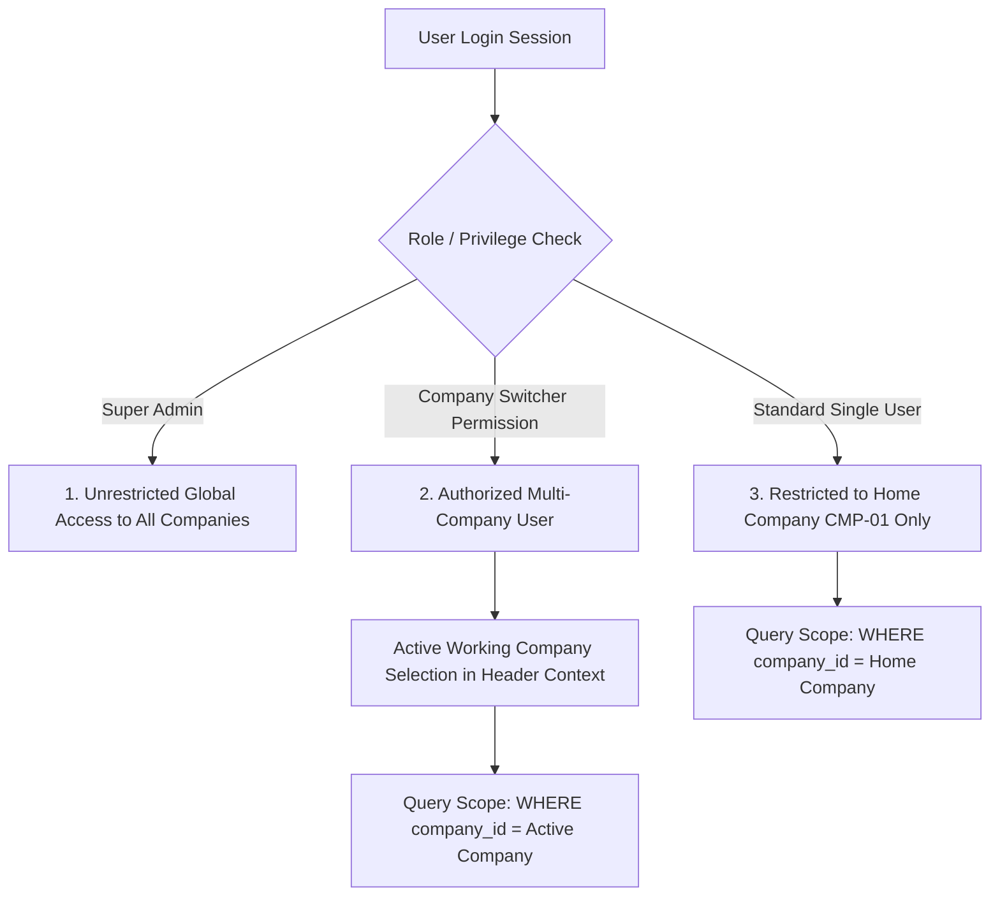

# Software Requirements Specification (SRS) & SOP
## Independent Company Entity, Enterprise Factory Setup & Company-Wise Data Isolation Architecture
**ডকুমেন্ট রেফারেন্স:** `SRS-SOP-RMG-M02-INDEPENDENT-COMPANY-01`  
**মডিউল:** Module 02 — Enterprise Master Library (Company & Physical Infrastructure)  
**ভার্সন:** 2.0 (Direct Independent Entity Model & Strict Cross-Company Data Isolation)  
**প্রোডাক্ট ওনার / এক্সিকিউটিভ স্পন্সর রিকোয়ারমেন্ট:**  
> 1. *"organization setup e sop change hoba company setup hoba like system run howar por superadmin company setup korba group or sisterconcern no need. protita company independent entity hoba eta srs aga thik koro"*  
> 2. *"company wise data separate hoba like akta company er data onno company access korte gela permission lagba eta srs e update koro"*  
> 3. *"user j kono registed compay er odhin hoba. but superadmin er company hoba platform owner. boot admin & standard user er company hoba platform test eta srs e update kore naw"*  

---

## ১. নির্বাহী সারসংক্ষেপ (Executive Summary)

TraceFlow-RMG এন্টারপ্রাইজ সিস্টেমে প্রতিটি কোম্পানি একটি স্বয়ংসম্পূর্ণ ও স্বাধীন সত্ত্বা (Autonomous Legal & Operational Entity)।
1. **কোনো Group বা Sister Concern হায়ারার্কি থাকবে না।**
2. প্রতিটি কোম্পানি হবে একটি সম্পূর্ণ স্বাধীন (Independent) লিগ্যাল ও অপারেশনাল এন্টিটি।
3. সিস্টেম বুট হওয়ার পর `Super Admin` লগইন করে সরাসরি **Company Setup** সম্পন্ন করবেন।
4. **ইউজার ও কোম্পানির অ্যাফিলিয়েশন পলিসি (User & Company Affiliation Rule):**
   - সাধারণ যেকোনো ইউজার (User) বাধ্যতামূলকভাবে যেকোনো একটি নিবন্ধিত কোম্পানির (Registered Company) অধীন হবে।
   - **`Super Admin`**-এর কোম্পানি হবে **`Platform Owner`** (সিস্টেমের মূল স্বত্বাধিকারী এন্টিটি)।
   - সিস্টেমের সাথে প্রি-কনফিগার করা বুট ইউজার **`admin`** এবং **`standarduser`**-এর কোম্পানি হবে **`Platform Test`** (সিস্টেম টেস্টিং ও ভ্যালিডেশন এন্টিটি)।
5. **কোম্পানিভিত্তিক ডেটা পৃথকীকরণ (Strict Multi-Company Data Isolation):**
   - একটি কোম্পানির ডেটা (অর্ডার, বায়ার কন্ট্রাক্ট, কাটিং, বান্ডেল ট্র্যাকিং, কিউসি ও প্রোডাকশন রিপোর্ট) ডিফল্টভাবে অপর কোনো কোম্পানির ইউজার দেখতে বা পরিবর্তন করতে পারবে না।
   - যদি কোনো ইউজারকে অন্য একটি কোম্পানির ডেটা অ্যাক্সেস করতে হয়, তবে তার জন্য নির্দিষ্ট **Cross-Company Access Permission / Assignment** থাকতে হবে।
   - শুধুমাত্র প্ল্যাটফর্ম `Super Admin` বাইপাস অধিকার নিয়ে সমস্ত কোম্পানির ডেটা কনসোলিডেটেডভাবে নিরীক্ষণ ও অডিট করতে পারবেন।

---

## ২. কোর বিজনেস রুলস ও পলিসি (Business Rules & Architectural Principles)

### ২.১ রুল ১: Independent Entity (কোনো প্যারেন্ট গ্রুপ নেই)
- সিস্টেমে কোনো `organizations` বা `Group Organization` টেবিল/কনসেপ্ট থাকবে না।
- কোম্পানি নিজেই টপ-লেভেল লিগ্যাল সত্ত্বা। 
- ডাটাবেসের সমস্ত অপারেশনাল টেবিল (ফ্যাক্টরি ইউনিট, ফ্লোর, লাইন, বায়ার অ্যাসাইনমেন্ট, অর্ডার, কাটিং প্ল্যান, প্রোডাকশন ট্র্যাকিং) সরাসরি `company_id` দ্বারা পার্টিশন ও আইসোলেট করা থাকবে।

### ২.২ রুল ২: ইউজার-কোম্পানি অ্যাফিলিয়েশন ও বুট সিডিং পলিসি (User Company Affiliation & Boot Seeding Policy)
1. **রেজিস্টার্ড ইউজারদের কোম্পানির অধীনতা (Mandatory Registered Company Assignment):**
   - সিস্টেমে তৈরি হওয়া যেকোনো সাধারণ ইউজার (General User / Operator / Manager) অবশ্যই সিস্টেমে নিবন্ধিত যেকোনো একটি অনুমোদিত কোম্পানির (`Registered Company`) অধীনে থাকতে হবে (`users.company_id NOT NULL`)।
2. **Super Admin — Platform Owner:**
   - সিস্টেমের রুট অ্যাডমিনিস্ট্রেটর `Super Admin`-এর কোম্পানি হবে **`Platform Owner`** (কোড: `PLT` / `CMP-00`)। এটি সম্পূর্ণ সিস্টেম অডিট, প্ল্যাটফর্ম মনিটরিং এবং যেকোনো কোম্পানির ডেটা গ্লোবালি অ্যাক্সেস করার বিশেষ অধিকার পাবে।
3. **Boot Admin & Standard User — Platform Test:**
   - ফ্রেশ ডাটাবেস ইন্সটলেশনে ডিফল্ট বুট ইউজার হিসেবে প্রোভিশন করা **`admin`** এবং **`standarduser`**-এর কোম্পানি হবে **`Platform Test`** (কোড: `TST` / `CMP-TEST`)।
   - এটি সিস্টেম টেস্টিং, ট্রায়াল রান এবং ফিচার ভ্যালিডেশনের জন্য আইসোলেটেড টেস্ট ডেটাসেট হিসেবে ব্যবহৃত হবে।
4. **First-Step Wizard / Company Setup:** `Super Admin` সিস্টেমে প্রবেশ করে ক্লায়েন্ট/ফ্যাক্টরির জন্য নতুন **Company Profile** তৈরি/কনফিগার করবেন:
   - **Company Code:** ১০০% সিস্টেম অটো-জেনারেটেড ইউনিক সিকোয়েন্সিয়াল কোড (যেমন: `CMP-01`, `CMP-02`)। ইউজার কোনো ম্যানুয়াল কোড টাইপ করতে পারবে না (`readOnly={true}` with "System Auto" badge)।
   - **Company Short Name (সংক্ষেপ নাম):** ইউজারের দ্বারা নির্ধারিত আলফানিউমেরিক সংক্ষেপ ট্রেড নাম (যেমন: `TFL`, `APEX`, `EGL`)। এটি ইউনিক হবে এবং মাস্টার জব/অর্ডার কোড জেনারেশনে প্রিফিক্স হিসেবে ব্যবহৃত হবে।
   - **Company Full Legal Name:** কোম্পানির পূর্ণ আইনি নাম (যেমন: `TraceFlow Apparels Limited`)।
   - **BIN:** Business Identification Number (NBR 9/13 digits)।
   - **TIN:** Taxpayer Identification Number।
   - **Trade License & Factory Registration No**
   - **Registered Address:** অফিস বা কারখানা ঠিকানা।
   - **Base Operating Currency:** (e.g. `USD`, `BDT`)।
   - **Corporate Logo, Email, Phone, Website**
3. কোম্পানির প্রোফাইল সেভ হওয়ার সাথে সাথে সিস্টেম তার অধীনে ফ্যাক্টরি প্ল্যান্ট, বিল্ডিং, ফ্লোর ও লাইন কনফিগারেশনের জন্য সম্পূর্ণ উন্মুক্ত হবে।

### ২.৩ রুল ৩: বায়ার ও অর্ডারের সাথে কোম্পানির সম্পর্ক (Direct Multi-Company Operations)
- বায়ার যখন কোনো কোম্পানির সাথে ব্যবসা শুরু করে, তখন চুক্তি সরাসরি সেই **Company**-র সাথে সম্পাদিত হয়।
- কোনো অর্ডার বা বায়ার ইনকোয়ারি তৈরি করার সময় সরাসরি যে কোম্পানিতে অর্ডার হচ্ছে সেই **Company** সিলেক্ট হবে।
- প্রতিটি অর্ডারের জব কোড ফর্মুলা:
  $$\mathbf{Master\ Order\ Code} = \mathbf{[CompanyShortName]}-\mathbf{[YY]}-\mathbf{[UniqueSequence]}$$
  উদাহরণ: `TFL-26-0001`, `APEX-26-0001` (এখানে `TFL` বা `APEX` সরাসরি সেই কোম্পানির ইউনিক `short_name` থেকে তৈরি হবে)।

---

## ৩. কোম্পানিভিত্তিক ডেটা আইসোলেশন ও অ্যাক্সেস পলিসি (Company Data Isolation & Cross-Company Permission Architecture)

### ৩.১ ডেটা আইসোলেশন প্রিন্সিপাল (Data Segregation Standard)
1. **Tenant/Company Data Boundary:**
   - প্রতিটি ইউজারের জন্য একটি **Primary Home Company (`company_id`)** নির্ধারিত থাকবে।
   - প্রতিটি ট্রানজেকশনাল রেকর্ড (অর্ডার, বায়ার, ইনকোয়ারি, কাটিং লেই, বান্ডেল বারকোড, কিউসি টিকিট, শিপমেন্ট) বাধ্যতামূলকভাবে একটি নির্দিষ্ট `company_id`-এর সাথে ট্যাগ থাকবে।
2. **ডিফল্ট আইসোলেশন (Zero Cross-Visibility by Default):**
   - কোম্পানি 'A' (যেমন: `CMP-01`) এর একজন সাধারণ ইউজার বা অ্যাডমিন সিস্টেমে লগইন করলে শুধুমাত্র কোম্পানি 'A'-এর বায়ার, স্টাইল, অর্ডার, প্রোডাকশন লাইন এবং রিপোর্ট দেখতে পাবে।
   - কোম্পানি 'B' (যেমন: `CMP-02`) এর কোনো ডেটা বা লিস্ট সার্চ রেজাল্টেও আসবে না (HTTP 403 Forbidden বা অটোমেটিক স্কোপিং দ্বারা ফিল্টারড)।

### ৩.২ ক্রস-কোম্পানি পারমিশন আর্কিটেকচার (Cross-Company Access Matrix)
যদি কোনো ম্যানেজিং ডিরেক্টর, সেন্ট্রাল মার্চেন্ডাইজার, গ্রুপ অডিটর বা কিউএ ম্যানেজারকে একাধিক কোম্পানির ডেটা অ্যাক্সেস করতে হয়, তবে তা নিম্নোক্ত ৩টি স্তরের অনুমোদনের মাধ্যমে নিয়ন্ত্রিত হবে:



### ৩.৩ পারমিশন ও রোল কনফিগারেশন:
1. **সিস্টেম পারমিশন কোড:**
   - `company.cross.access.view` — অনুমোদিত অন্যান্য কোম্পানির ডেটা দেখার অনুমতি (Read-Only Cross Access)।
   - `company.cross.access.manage` — অনুমোদিত অন্যান্য কোম্পানিতে এডিট বা ট্রানজেকশন পরিচালনা করার অনুমতি (Cross-Company Operation)।
   - `company.context.switch` — টপবার থেকে অ্যাক্টিভ কোম্পানি পরিবর্তন করার অধিকার।
2. **ডাটাবেস স্ট্রাকচার (User-Company Association):**
   - ইউজারের প্রাইমারি কোম্পানি: `users.primary_company_id` (বা `users.company_id`)
   - অতিরিক্ত অনুমোদিত কোম্পানি তালিকা: `user_company_access` পিভট টেবিল:
     - `user_id` (UUID)
     - `company_id` (UUID)
     - `can_view` (Boolean, ডিফল্ট: true)
     - `can_manage` (Boolean, ডিফল্ট: false)
     - `granted_by` (UUID)
     - `valid_until` (Timestamp, ঐচ্ছিক সাময়িক অ্যাক্সেসের জন্য)

### ৩.৪ ব্যাকএন্ড গ্লোবাল স্কোপ ও এনফোর্সমেন্ট (Backend Global Scope & Middleware)
1. **`BelongsToCompany` Trait & Global Scope:**
   - সমস্ত কোম্পানি-ভিত্তিক মডেলে (`Order`, `Buyer`, `ProductionLine`, `CuttingLay`, ইত্যাদি) `BelongsToCompany` Trait যুক্ত থাকবে।
   - ব্যাকএন্ড কোয়েরি এক্সিকিউট হওয়ার সময় বর্তমান ইউজারের `active_company_id` অনুসারে স্বয়ংক্রিয়ভাবে SQL কোয়েরিতে অ্যাপ্লাই হবে:
     ```sql
     SELECT * FROM orders WHERE company_id = :active_company_id;
     ```
2. **Cross-Company Access Guard:**
   - যদি কোনো ইউজার রিকোয়েস্ট হেডারে বা রুটে অন্য কোম্পানির `id` পাস করে যা তার পারমিশন তালিকায় নেই, তবে API তাৎক্ষণিকভাবে ফেরত দেবে:
     ```json
     {
       "status": "error",
       "code": 403,
       "message": "Access Denied: You do not possess cross-company authorization for Company [CMP-02]."
     }
     ```
3. **Super Admin Exemption:**
   - প্ল্যাটফর্ম `Super Admin` এর ক্ষেত্রে এই গ্লোবাল স্কোপ বাইপাস হবে এবং তিনি সব কোম্পানির কনসোলিডেটেড ডেটা বা আলাদা আলাদা কোম্পানির ডেটা যেকোনো সময় ফিল্টার করতে পারবেন।

---

## ৪. ফিজিক্যাল ম্যানুফ্যাকচারিং হায়ারার্কি (Physical Facility Hierarchy)

প্রতিটি স্বতন্ত্র কোম্পানির উৎপাদন অবকাঠামো নিম্নরূপ সরল ও সুনির্দিষ্টভাবে সাজানো থাকবে:

```mermaid
graph TD
    Company[1. Independent Company Entity<br/>Code: CMP-01 | Short: TFL<br/>e.g. TraceFlow Apparels Ltd.] --> FactoryUnit[2. Factory Plant / Unit<br/>e.g. Unit-01: Woven Complex]
    FactoryUnit --> Building[3. Building / Shed<br/>e.g. Building A]
    Building --> Floor[4. Floor / Layout<br/>e.g. 2nd Floor - Sewing]
    Floor --> Line[5. Production Lines & Gates<br/>e.g. Line 01, Line 02, QC Gate]
```

### স্তর বিন্যাস:
1. **Company (স্বাধীন প্রতিষ্ঠান):** সর্বোচ্চ আইনি ও কর প্রদানকারী সত্ত্বা (Legal & NBR Entity)। সিস্টেম কোড: `CMP-01`, শর্ট নেম: `TFL`।
2. **Factory Unit (কারখানা কমপ্লেক্স/ইউনিট):** ফিজিক্যাল ক্যাম্পাস বা প্ল্যান্ট (Woven, Washing, Denim ইত্যাদি)।
3. **Building (ভবন):** ক্যাম্পাসের ভেতরের পৃথক ভবন।
4. **Floor (তলা/ফ্লোর):** ভবনের নির্দিষ্ট ফ্লোর।
5. **Production Line (সেলাই/কাটিং লাইন):** যেখানে ফিজিক্যাল ট্যাবলেট থাকে এবং অপারেটররা বান্ডেল স্ক্যান করে।

---

## ৫. স্ক্রিন ও ইউজার ইন্টারফেস (UI/UX) স্পেসিফিকেশন

### ৫.১ ন্যাভিগেশন মেনু ও কোম্পানি সুইচার (Header Context Switcher):
- টপ নেভিগেশন বারে বর্তমান ব্যবহারকারীর **Active Company** ইন্ডিকেটর প্রদর্শিত হবে (যেমন: `TraceFlow Apparels [TFL]`)।
- যদি কোনো ইউজারের একাধিক কোম্পানিতে পারমিশন থাকে, তবে তিনি ড্রপডাউন থেকে এক ক্লিকে তার অ্যাক্টিভ ওয়ার্কিং কোম্পানি পরিবর্তন করতে পারবেন।
- মেনুতে সরাসরি রাখা হবে:
  1. **Company Profiles** (কোম্পানির বিস্তারিত লিগ্যাল ও জেনারেল প্রোফাইল)
  2. **Factory Plants** (প্ল্যান্ট বা ইউনিট ম্যানেজমেন্ট)
  3. **Buildings** (ভবন ব্যবস্থাপনা)
  4. **Floors** (ফ্লোর লেআউট)
  5. **Lines & Sections** (সেলাই লাইন ও কিউসি গেট)

### ৫.২ Company Setup Form ফিল্ডসমূহ:
| ফিল্ডের নাম | টাইপ | রিকোয়ার্ড | ভ্যালিডেশন রুলস ও আচরণ | ইউআই কম্পোনেন্ট |
|---|---|---|---|---|
| `Company Code` | String | সিস্টেম অটো (হ্যাঁ) | গ্লোবালি ইউনিক, সিকোয়েন্সিয়াল (যেমন: `CMP-01`, `CMP-02`)। সিস্টেম দ্বারা স্বয়ংক্রিয়ভাবে জেনারেটেড। | Read-Only Input with "System Auto" Badge |
| `Short Name` | String | হ্যাঁ | কোম্পানির ইউনিক সংক্ষেপ কোড (যেমন: `TFL`, `APEX`)। ক্যাপিটাল লেটার, ২-১০ অক্ষর। অর্ডার কোড তৈরিতে ব্যবহৃত। | Text Input (Uppercase) |
| `Company Name` | String | হ্যাঁ | কোম্পানির পূর্ণ আইনি নাম (e.g. `TraceFlow Apparels Limited`)। | Text Input |
| `BIN Number` | String | হ্যাঁ | এনবিআর ৯/১৩ ডিজিটের বিজনেস আইডেন্টিফিকেশন নম্বর। | Text Input |
| `TIN Number` | String | না | ট্যাক্স আইডেন্টিফিকেশন নম্বর। | Text Input |
| `Trade License` | String | না | মিউনিসিপ্যাল ট্রেড লাইসেন্স নম্বর। | Text Input |
| `Registration No` | String | না | আরজেএসসি (RJSC) কোম্পানি রেজিস্ট্রেশন নম্বর। | Text Input |
| `Registered Address`| Text | হ্যাঁ | রেজিস্টার্ড অফিস বা ফ্যাক্টরি ঠিকানা। | Textarea |
| `Contact Email` | Email | হ্যাঁ | প্রধান কর্পোরেট যোগাযোগের ইমেইল। | Email Input |
| `Contact Phone` | String | হ্যাঁ | অফিসিয়াল ফোন নম্বর। | Text Input |
| `Website` | URL | না | অফিশিয়াল ওয়েবসাইট। | URL Input |
| `Operating Currency`| Enum | হ্যাঁ | `USD`, `BDT`, `EUR` (ডিফল্ট: `USD`)। | Select Dropdown |
| `Status` | Boolean | হ্যাঁ | Active / Inactive | Toggle Switch |

---

## ৬. আর্কিটেকচারাল বাস্তবায়ন গাইডলাইন ও রোডম্যাপ

1. **ডাটাবেস মাইগ্রেশন:**
   - `users` টেবিলে `company_id` (Home Company) যোগ করা।
   - `user_company_access` পিভট টেবিল তৈরি করা (`user_id`, `company_id`, `can_view`, `can_manage`)।
2. **RBAC পারমিশন আপডেট (`backend/config/rbac.php`):**
   - `company.cross.access.view`
   - `company.cross.access.manage`
   - `company.context.switch`
3. **Laravel গ্লোবাল ট্রেইট ও মিডলওয়্যার:**
   - `BelongsToCompany` গ্লোবাল স্কোপ যা অটোমেটিক কুয়েরি সীমাবদ্ধ রাখবে।
   - `EnsureCompanyAccess` মিডলওয়্যার যা ইউজার অন্য কোম্পানির রিসোর্স আইডি রিকোয়েস্টে পাস করলে অ্যাক্সেস যাচাই করবে।
4. **ফ্রন্টএন্ড গ্লোবাল স্টেট:**
   - টপবারে Company Switcher যুক্ত করা।
   - ইউজারের অ্যাক্টিভ কোম্পানি সিলেক্ট করলে সমস্ত ডেটা টেবিল রিলোড হয়ে ওই নির্দিষ্ট কোম্পানির ডেটা প্রদর্শন করা।
