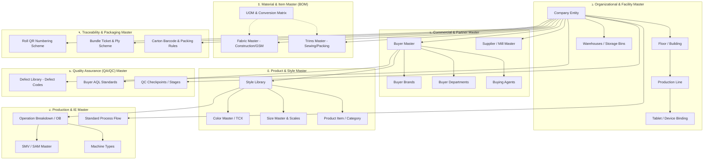

# Software Requirements Specification (SRS)
## Master Data Layer Specification (End-to-End Enterprise Master Architecture)

**ডকুমেন্ট রেফারেন্স:** `SRS-RMG-M02-MASTER-DATA-CORE-01`  
**মডিউল:** Module 02 — Master Data Management & Enterprise Foundations  
**সিস্টেম:** TraceFlow RMG — Precision Fabric-to-Freight Garment Traceability Software  
**ভূমিকা/অথর:** RMG Solution Architect & Business Analyst  
**স্ট্যাটাস:** Official Engineering Specification (Approved)  
**প্রযোজ্য শিল্প:** ওভেন ও নিট তৈরি পোশাক (Woven & Knit Garments Manufacturing)  
**ভাষা:** বাংলা (Bangla - Business & Technical Standard)  

---

## ১. ভূমিকা ও বিজনেস রিকয়ারমেন্ট বিশ্লেষণ (Executive Summary)

তৈরি পোশাক (RMG) শিল্পে একটি এন্টারপ্রাইজ ট্রেসেবিলিটি এবং ইআরপি প্ল্যাটফর্মের সবচেয়ে সংবেদনশীল ও ভিত্তিপ্রস্তর স্তর হলো **Master Data Layer**। মাস্টার ডেটা হলো এমন ডেটা যা ঘন ঘন পরিবর্তিত হয় না কিন্তু দৈনন্দিন প্রতিটি ট্রানজ্যাকশন (অর্ডার গ্রহণ, ফেব্রিক ইনস্পেকশন, কাটিং, বান্ডেল কিউআর স্ক্যান, সুইং, কিউসি এবং শিপমেন্ট)-এর রেফারেন্স হিসেবে কঠোরভাবে ব্যবহৃত হয়।

### ১.১ মূল স্থাপত্য নীতি (Core Architectural Principles)
1. **Create Once, Use Everywhere:** সিস্টেমে কোনো মাস্টার এন্টিটি (যেমন বায়ার, কালার, সাইজ, লাইন, ফেব্রিক) একাধিকবার এন্ট্রি হবে না। একবার সেন্ট্রালি ভ্যালিডেট হয়ে তৈরি হলে তা সকল অপারেশনে রিইউজ হবে।
2. **Company Short Code Prefixing (STRICT & MANDATORY):** প্রতিটি স্বতন্ত্র কোম্পানির ডেটা চেনার জন্য সিস্টেমে নিবন্ধিত কোম্পানির ২-৫ অক্ষরের ইউনিক `Company Short Code` (যেমন: `AWL`, `ADM`) থাকতে হবে। কোম্পানি-নির্দিষ্ট সমস্ত এন্টিটি কোড (Buyer, Floor, Line, Style, Warehouse, Inquiry, Order, Job, Bundle, Roll ইত্যাদিতে) **বাধ্যতামূলকভাবে Company Short Code প্রিফিক্স হিসেবে যুক্ত থাকতে হবে** (যেমন: `AWL-BYR-001`, `AWL-STY-001`, `AWL-LIN-01`, `AWL-WH-01`)। এর ফলে রিপোর্টিং, প্রিন্ট লেবেল, কিউআর কোড বা যেকোনো তালিকায় এক নজরেই নিশ্চিত হওয়া যাবে রেকর্ডটি কোন কোম্পানির।
3. **System Auto-Generated Entity Code Standard (STRICT):** সমস্ত প্রাইমারি এন্টিটি কোড (Company Code, Buyer Code, Style Code, Floor Code, Line Code, Operation Code, Defect Code ইত্যাদি) ১০০% ব্যাকএন্ড সিস্টেম দ্বারা স্বয়ংক্রিয়ভাবে সিকোয়েন্সিয়াল ও ইনটেলিজেন্ট ফরম্যাটে প্রিফিক্সসহ জেনারেট হবে (`readOnly={true}` with "System Auto" badge)। ব্যবহারকারী কর্তৃক ম্যানুয়াল কোড ইনপুট সম্পূর্ণ নিষিদ্ধ।
4. **Pure Server-Side Validation Only:** কোনো নেটিভ এইচটিএমএল৫ পপআপ ভ্যালিডেশন থাকবে না; ফ্রন্টএন্ড ফর্মগুলো `noValidate` এট্রিবিউট ব্যবহার করবে এবং ব্যাকএন্ড API-এর HTTP 422 JSON রেসপন্স থেকে এরর হ্যান্ডেল করবে।
5. **Strict Multi-Company Data Isolation & Tenant Scoping:** প্রতিটি কোম্পানি-স্পেসিফিক মাস্টার রেকর্ডে `company_id` ফরেন কি বাধ্যতামূলক থাকবে।
6. **No Modals Rule:** সমস্ত মাস্টার ডেটা তৈরি, এডিট, ভিউ বা কনফিগারেশন ফুল-পেজ ভিউতে পরিচালিত হবে। কোনো পপআপ বা মডাল ব্যবহার করা যাবে না।

---

## ২. মাস্টার ডেটার ৭টি কোর লেয়ার (7 Core Master Layers)

---

## ৩. বিস্তারিত লেয়ার স্পেসিফিকেশন ও ফিল্ড ভ্যালিডেশন

### লেয়ার ১: অর্গানাইজেশনাল ও ফ্যাসিলিটি মাস্টার (Organizational & Facility Master)
*ফ্যাক্টরির ভৌগোলিক অবস্থান, লজিক্যাল ডিভিশন এবং ফ্লোর মেশিনারিজের ভিত্তি।*

1. **Company Master (`companies`):**
   - স্বাধীন শীর্ষ সত্ত্বা (Legal Entity)।
   - অটো কোড ফরম্যাট: `CMP-01`, `CMP-02` (System Global)।
   - **Company Short Name / Code:** বাধ্যতামূলক ২-৫ অক্ষরের ইউনিক শর্ট কোড (যেমন: `AWL`, `ADM`)। এটি পরবর্তী সমস্ত কোম্পানি-নির্ভর কোডের প্রিফিক্স হিসেবে ব্যবহৃত হবে।
   - ফিল্ডস: `id (UUID)`, `company_code (UK)`, `company_name`, `short_name (UK, 2-5 Chars, e.g. AWL)`, `legal_address`, `currency`, `is_active`।
2. **Floor Master (`floors`):**
   - নির্দিষ্ট কারখানার ফিজিক্যাল ফ্লোর বা শেড (Ground Floor, 1st Floor, Cutting Shed)।
   - **অটো কোড ফরম্যাট (Company Short Code Prefix):** `[CompanyShort]-FLR-[Seq]` (যেমন: `AWL-FLR-01`, `ADM-FLR-01`)।
   - ফিল্ডস: `id`, `company_id (FK)`, `floor_code`, `floor_name`, `building_name`, `is_active`।
3. **Production Line Master (`production_lines`):**
   - সুইং ও ফিনিশিং কাজের ডেডিকেটেড লাইন।
   - **অটো কোড ফরম্যাট (Company Short Code Prefix):** `[CompanyShort]-LIN-[Seq]` (যেমন: `AWL-LIN-01`, `ADM-LIN-01`)।
   - ফিল্ডস: `id`, `company_id (FK)`, `floor_id (FK)`, `line_code`, `line_name`, `sewing_capacity_operators`, `target_efficiency_pct`, `is_active`।
4. **Warehouse / Storage Location Master (`warehouses`, `storage_bins`):**
   - কাঁচামাল (ফেব্রিক/ট্রিমস) ও ফিনিশড গুডসের জন্য আলাদা ওয়্যারহাউস ও র্যাক/বিন।
   - **অটো কোড ফরম্যাট (Company Short Code Prefix):** `[CompanyShort]-WH-[Seq]` (যেমন: `AWL-WH-01`, `AWL-WH-02`)।
   - ফিল্ডস: `id`, `company_id (FK)`, `warehouse_code`, `warehouse_name`, `warehouse_type (Fabric/Trims/FG)`, `is_active`।

---

### লেয়ার ২: কমার্শিয়াল ও বিজনেস পার্টনার মাস্টার (Commercial & Business Partner Master)
*বায়ার, সাপ্লায়ার ও এজেন্সির বাণিজ্যিক চুক্তি ও যোগাযোগ নিয়ন্ত্রণ।*

1. **Buyer Master (`buyers`):**
   - সম্পূর্ণ কোম্পানি-নির্ভর (Company Dependent)।
   - **অটো কোড ফরম্যাট (Company Short Code Prefix):** `[CompanyShort]-BYR-[Seq]` (যেমন: `AWL-BYR-001`, `ADM-BYR-001`)।
   - ফিল্ডস: `id`, `company_id (FK)`, `buyer_code`, `buyer_name`, `country`, `default_currency (USD/EUR/BDT)`, `payment_terms`, `incoterm (FOB/CIF)`, `default_aql`, `agent_id (FK)`, `is_active`।
2. **Buyer Brand & Department (`buyer_brands`, `buyer_departments`):**
   - বায়ারের বিভিন্ন সাব-ব্র্যান্ড (e.g., Divided, Trafaluc) ও ডিপার্টমেন্ট (e.g., Men's, Denim, Kids)।
   - কোড ফরম্যাট: বায়ারের সাথে লিঙ্কড এবং কোম্পানি স্কোপড।
3. **Buying Agent Master (`buying_agents`):**
   - লোকাল বাইং হাউস বা লিয়াজোঁ অফিস (e.g., Li & Fung, H&M Liaison Office), কমিশনের হার ও দায়িত্বপ্রাপ্ত ব্যক্তি।
   - **অটো কোড ফরম্যাট:** `[CompanyShort]-AGT-[Seq]` (e.g., `AWL-AGT-01`)।
4. **Supplier / Mill Master (`suppliers`):**
   - সুতা, ফেব্রিক টেক্সটাইল মিল ও এক্সেসরিজ ভেন্ডরদের তালিকা ও পেমেন্ট হিস্ট্রি প্রোফাইল।
   - **অটো কোড ফরম্যাট:** `[CompanyShort]-SUP-[Seq]` (e.g., `AWL-SUP-001`)।

---

### লেয়ার ৩: প্রডাক্ট ও স্টাইল মাস্টার (Product & Style Master)
*গার্মেন্টস ডিজাইন, কালারওয়ে এবং সাইজ স্পেসিফিকেশনের মূল ডোমেন।*

1. **Product Item / Garment Category (`product_items`):**
   - পোশাকের ধরণ (e.g., 5-Pocket Denim Pant, Cargo Pant, Long Sleeve Shirt, Puffer Jacket)।
   - অটো কোড: `ITM-001`, `ITM-002` (গ্লোবাল স্ট্যান্ডার্ড লাইব্রেরি)।
2. **Style Master (`styles`):**
   - বায়ার ভিত্তিক ইউনিক স্টাইল ইঞ্জিন।
   - **অটো কোড / ইন্টারনাল রেফারেন্স (Company Short Code Prefix):** `[CompanyShort]-STY-[AutoSeq]` (যেমন: `AWL-STY-0001`) এবং বায়ারের অফিসিয়াল `buyer_style_no` (e.g. `HM-8842`)।
   - ফিল্ডস: `id`, `company_id (FK)`, `buyer_id (FK)`, `department_id (FK)`, `product_item_id (FK)`, `style_code`, `buyer_style_no`, `season`, `base_smv`, `garment_wash_type`, `tech_pack_url`, `is_active`।
   - *ইউনিক কনস্ট্রেইন্ট:* একটি বায়ারের আন্ডারে একই স্টাইল নম্বর দুবার থাকতে পারবে না `(buyer_id, buyer_style_no)`।
3. **Color Master (`colors`):**
   - গ্লোবাল কালার নেম এবং শেড কোড (e.g. `CLR-001: Navy`, `CLR-002: Black`)।
4. **Size Master & Scales (`sizes`, `size_scales`):**
   - স্ট্যান্ডার্ড সাইজ লেবেল (S, M, L, XL, XXL অথবা Waist 28-40, Inseam 30-34)।
   - ফিল্ডস: `id`, `size_label`, `sort_order` (ড্রপডাউনে ক্রম ঠিক রাখার জন্য)।

---

### লেয়ার ৪: মেটেরিয়াল ও বিওএম মাস্টার (Material & Item Master - BOM)
*ফেব্রিক ও ট্রিমসের স্পেসিফিকেশন ও কনজাম্পশন রুলস।*

1. **Fabric Classification Master (`fabric_library`):**
   - কনস্ট্রাকশন (e.g., 40x40 / 133x72, 3/1 Right Hand Twill)।
   - কম্পোজিশন (e.g., 100% Cotton, 98% Cotton 2% Elastane)।
   - জিএসএম (GSM) এবং কাটেবল উইডথ (Cuttable Width in inches)।
2. **Trims & Accessories Master (`trims_library`):**
   - Sewing Trims: Sewing Thread (Ticket/Tex), Button, Zipper, Interlining, Elastic, Main Label, Care Label।
   - Packing Trims: Polybag (Self-adhesive, Blister), Carton (5-ply/7-ply), Hangtag, Price Sticker, Silica Gel।
3. **Unit of Measurement (UOM) & Conversion Matrix (`uoms`, `uom_conversions`):**
   - বেস UOM: Yard, Meter, KG, Piece, Dozen (DZN), Gross (144 pcs), Cone।
   - কনভার্সন ফ্যাক্টর যেমন: ১ DZN = ১২ Pcs, ১ Gross = ১৪৪ Pcs, ১ Cone = ৫০০০ Meters।

---

### লেয়ার ৫: প্রোডাকশন ও ইন্ডাস্ট্রিয়াল ইঞ্জিনিয়ারিং মাস্টার (Production & IE Master)
*অপারেশন ব্রেকডাউন (OB), এসএএম/এসএমভি এবং মেশিনারিজ কনফিগারেশন।*

1. **Operation Master (`operations`):**
   - প্রতিটি সুইং অপারেশন (e.g., Collar Make, Cuff Join, Front Placket, Back Pocket Attach, Side Seam, Bottom Hem)।
   - অটো কোড: `OPR-001`, `OPR-002`।
2. **Standard Allowed Minute (SAM / SMV) Master (`style_operation_breakdown`):**
   - নির্দিষ্ট স্টাইলের অপারেশন ভিত্তিক নির্ধারিত সময় (Target SMV), গ্রেড এবং রেটিং।
3. **Machine Type Master (`machine_types`):**
   - সিঙ্গেল নিডল লকস্টিচ (SNLS), ওভারলক ৪/৫ থ্রেড (OL), ফ্ল্যাটলক, ফিড অফ দ্য আর্ম (FOA), বারটেক, বাটনহোল মেশিন।
4. **Process Sequence Flow (`standard_processes`):**
   - Spreading ➔ Cutting ➔ Numbering/Bundling ➔ Embroidery/Print ➔ Sewing Line In ➔ Line QC ➔ Washing ➔ Finishing ➔ Packing ➔ Ready to Ship।

---

### লেয়ার ৬: কোয়ালিটি অ্যাসুরেন্স মাস্টার (Quality Assurance - QA/QC Master)
*ত্রুটি শনাক্তকরণ, বায়ার এআইকিউএল এবং ডিফেক্ট হিসেব।*

1. **Defect Library (`qc_defect_types`):**
   - ক্যাটাগরি ভিত্তিক সুনির্দিষ্ট ডিফেক্ট কোড:
     - *Fabric Defects:* Hole, Slub, Yarn Contamination, Dye Spot, Bowing/Skewing।
     - *Cutting Defects:* Pattern Shift, Notch Missing, Bad Cut, Size Mismatch।
     - *Sewing Defects:* Skip Stitch, Broken Stitch, Open Seam, Puckering, Uneven Stitch, Raw Edge।
     - *Finishing Defects:* Iron Shine, Spot/Oil Stain, Dirty Mark, Measurement Out of Spec।
   - অটো কোড: `DEF-001`, `DEF-002`।
2. **Buyer AQL Matrix (`buyer_aql_standards`):**
   - বায়ার কর্তৃক অনুমোদিত স্যাম্পলিং প্ল্যান (AQL 1.0, AQL 1.5, AQL 2.5, AQL 4.0 - Major & Minor Allowable limits)।
3. **QC Inspection Gates (`qc_inspection_stages`):**
   - 4-Point Fabric Inspection, Cutting Table Audit, Sewing Inline QC, End of Line (EOL) QC, Washing Audit, Pre-Final & Final Inspection।

---

### লেয়ার ৭: ট্রেসেবিলিটি ও প্যাকেজিং মাস্টার (Traceability & Packaging Master)
*ডিজিটাল আইডেন্টিফিকেশন, কিউআর কোড স্কিম এবং প্যাকিং রুলস।*

1. **Fabric Roll QR Scheme:**
   - মিল লট নম্বর, রোল নম্বর, শেড (Shade A, B, C) ও ইনস্পেকশন গ্রেড সংযুক্ত কিউআর কোড স্কিম।
2. **Bundle Ticket & Barcode/QR Scheme:**
   - কাটিং টেবিল ও প্লাই রেঞ্জের ভিত্তিতে জেনারেটেড কিউআর ফরম্যাট:
   - ফরম্যাট: `[Company]-[JobNo]-[CutNo]-[BundleNo]-[Size]` (e.g. `AWL-26-0001-C01-B001-32`)।
3. **Carton Barcode & Packing Scheme:**
   - Solid Color Solid Size (SCSS) অথবা Assorted Color Assorted Size (ACAS)।
   - শিপমেন্ট কার্টন লেবেল ফরম্যাট (UCC/EAN-128 standard)।

---

## ৪. ইউআই/ইউএক্স ইঞ্জিনিয়ারিং স্ট্যান্ডার্ড (UI/UX Compliance)

সকল মাস্টার ডেটা পেজকে সিস্টেমের নির্ধারিত **গ্লোবাল রুলস ও ডিজাইন টোকেন** কঠোরভাবে মেনে চলতে হবে:

1. **3-Tier Golden List Page Layout:**
   - **Tier 1 (Sleek Header Row):** `<PageHeader>` উইথ টাইটেল (e.g., "Buyer Directory", "Production Lines"), আইটেম কাউন্টার ব্যাজ (`<Badge variant="neutral">42 Buyers</Badge>`), এবং ডানপাশে অ্যাকশন বাটন (`<Button variant="primary">Add Buyer</Button>`)। কোনো বড় ডেকোরেটিভ আইকন বা ডুপ্লিকেট ব্রেডক্রাম্ব থাকবে না।
   - **Tier 2 (Unified Filter Toolbar):** `<FilterToolbar>` উইথ সার্চ ইনপুট (ম্যাগনিফায়ার আইকন), ফিল্টার ড্রপডাউন (স্ট্যাটাস, ক্যাটাগরি), এবং ফ্ল্যাট "Filter" + "Reset" বাটন। সাবলাইনে থাকবে "Sorted by: Field" এবং "Show per page (10, 15, 25, 50)" ড্রপডাউন।
   - **Tier 3 (Standard DataTable Shell):** অল্টারনেটিং রো হাইলাইট, ফিক্সড এন্টারপ্রাইজ টেবিল ফ্রেম এবং স্ট্যান্ডার্ড পেজিনেশন ফুটার ("Showing X to Y of Z records" + "< Previous" / "> Next")।
2. **CRUD Dedicated Page Standard vs Allowed Non-CRUD Modals:**
   - **All CRUD Operations (STRICT Dedicated Pages):** মাস্টার বা ট্রানজেকশনাল কোনো এন্টিটি তৈরি (Create), এডিট (Update/Edit), বিস্তারিত দেখা (View/Details) বা তালিকার (List) জন্য মডাল, পপআপ বা ড্রয়ার ব্যবহার সম্পূর্ণ নিষিদ্ধ। এগুলো সর্বদা ডেডিকেটেড ফুল-পেজ রুটে পরিচালিত হবে (যেমন: `/master/buyers/create`, `/master/buyers/:id/edit`)।
   - **Allowed Non-CRUD Popups/Modals:** CRUD অপারেশনের বাইরে অন্যান্য কনফার্মেশন ও কুইক প্রিভিউ কাজে মডাল/ডায়ালগ ব্যবহার বৈধ:
     1. ডিলিট বা ক্যানসেল কনফার্মেশন ডায়ালগ (e.g., "Are you sure you want to inactivate this Buyer?").
     2. সুপারভাইজার অনুমোদন ও পিন অথেনটিকেশন পপআপ (e.g., Supervisor 6-digit PIN).
     3. বারকোড/কিউআর কোড স্ক্যানার ক্যামেরা ওভারলে বা এলার্জমেন্ট ভিউ।
     4. টেক-প্যাক / পিডিএফ ফাইল প্রিভিউয়ার পপআপ।
     5. নেটওয়ার্ক বা সেশন টাইমআউট ওয়ার্নিং ডায়ালগ।
3. **Form Experience & Auto Code:**
   - কোড ফিল্ডটি সর্বদা disabled/readOnly থাকবে এবং তার পাশে "System Auto" ব্যাজ প্রদর্শিত হবে।
   - ফর্ম জমা দেওয়ার সময় `noValidate` থাকবে এবং ব্যাকএন্ড ৪২২ রেসপন্স অনুযায়ী ফিল্ডের নিচে সুনির্দিষ্ট এরর প্রদর্শন করবে।

---

## ৫. নন-ফাংশনাল রিকয়ারমেন্টস (NFR)

1. **Redis Caching Strategy:**
   - মাস্টার ডেটা সচরাচর রিড হয় এবং খুব কম পরিবর্তিত হয়। সমস্ত অ্যাক্টিভ ড্রপডাউন এপিআই (`/api/v1/master/buyers/active`, `/api/v1/master/lines/active`, `/api/v1/master/colors`, `/api/v1/master/sizes`) রেডিজে (Redis) ক্যাশ থাকবে।
   - কোনো রেকর্ড আপডেট বা নতুন ক্রিয়েট হলে সাথে সাথে সংশ্লিষ্ট ক্যাশ কি ইনভ্যালিডেট (Cache Eviction) হবে।
   - ড্রপডাউন রেসপন্স টাইম ৯৫তম পার্সেন্টাইলে **< 100ms** হতে হবে।
2. **Audit Trail & Immutability:**
   - প্রতিটি মাস্টার টেবিলের সাথে `created_by`, `updated_by`, `deleted_by` এবং `audit_logs` ইন্টিগ্রেশন থাকবে (Old JSON vs New JSON পরিবর্তন হিস্ট্রি সংরক্ষিত হবে)।
   - যেসব মাস্টার রেকর্ড একবার প্রোডাকশন বা অর্ডারে ব্যবহার হয়েছে (যেমন: সাইজ বা কালার দিয়ে কাটিং বা পিও হয়েছে), সেগুলো কখনোই হার্ড-ডিলিট (Hard Delete) করা যাবে না; শুধুমাত্র `is_active = false` (Soft Delete / Inactivate) করা যাবে।

---

## ৬. টেস্ট একসেপ্টেন্স ক্রাইটেরিয়া (QA Acceptance Criteria)

- [ ] **AC-M02-01:** নতুন বায়ার তৈরি করার সময় কোড ফিল্ড ব্যবহারকারী ইনপুট দিতে পারবে না; ব্যাকএন্ড থেকে স্বয়ংক্রিয়ভাবে কোড অ্যাসাইন হবে।
- [ ] **AC-M02-02:** অন্য কোম্পানির কোনো ইউজার অনুমোদিত পারমিশন বা সুইচিং ছাড়া অপর কোম্পানির বায়ার বা লাইন দেখতে পাবে না (HTTP 403 / Tenant Scope)।
- [ ] **AC-M02-03:** একটি স্টাইলে ব্যবহৃত কালার বা সাইজ ডিলিট করতে গেলে সিস্টেম ইন্টিগ্রিটি এরর দেবে ("Cannot delete entity because it is referenced in active orders/cuttings")।
- [ ] **AC-M02-04:** মাস্টার ডেটা তালিকার সকল পেজ স্ট্যান্ডার্ড ৩-টায়ার গোল্ডেন লেআউট (PageHeader -> FilterToolbar -> DataTable) মেনে চলবে এবং কোনো পপআপ মডাল ছাড়াই ফুল পেজ রুটে কাজ করবে।
- [ ] **AC-M02-05:** ড্রপডাউন এপিআই রেসপন্স রেডিজ ক্যাশ থেকে ১০০ মিলি-সেকেন্ডের মধ্যে আসবে।
