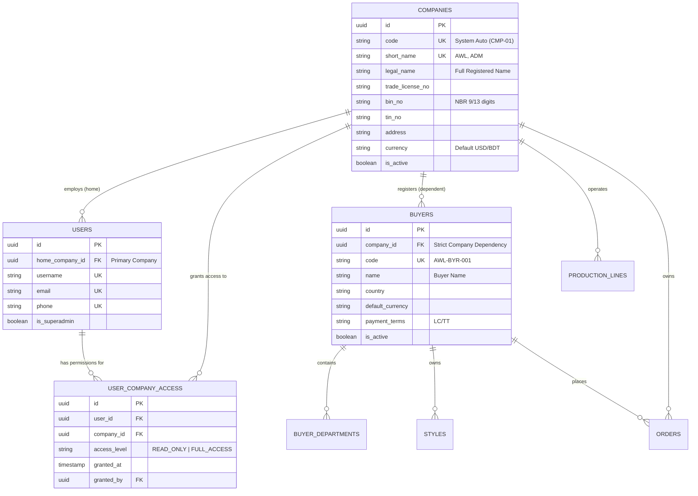

# Software Requirements Specification (SRS)
## Multi-Company Setup, Data Isolation, Cross-Company Access & Company-Dependent Buyer Registration

**ডকুমেন্ট রেফারেন্স:** `SRS-RMG-M02-MULTI-COMPANY-ISOLATION-01`  
**মডিউল:** Module 02 — Master Data Library (Company Architecture & Partner Ecosystem)  
**ভার্সন:** 3.0 (Enterprise Multi-Company Architecture)  
**স্ট্যাটাস:** Official Business Analysis & Engineering Specification  
**মূল নীতি:** Independent Entities + Strict Data Isolation + Granular Cross-Company Permissions + Company-Dependent Buyer Domain  

---

## ১. ভূমিকা ও বিজনেস রিকয়ারমেন্ট বিশ্লেষণ (Executive Summary)

তৈরি পোশাক শিল্পে (RMG Group/Holding conglomerate) একাধিক স্বতন্ত্র কারখানা বা ট্রেডিং প্রতিষ্ঠান একই সফটওয়্যার প্ল্যাটফর্মে পরিচালিত হতে পারে (যেমন: ওভেন ইউনিট, ডেনিম ইউনিট, ওয়াশিং প্ল্যান্ট ইত্যাদি)। 

ক্লায়েন্ট / প্রোডাক্ট ওনার কর্তৃক নির্ধারিত স্পেসিফিকেশন অনুযায়ী:
1. **Multiple Company Registration:** সিস্টেমে একাধিক কোম্পানি সরাসরি স্বাধীন সত্ত্বা (Autonomous Legal Entity) হিসেবে নিবন্ধিত হবে।
2. **Strict Single Company Data Isolation:** ডিফল্টভাবে প্রতিটি কোম্পানির সমস্ত ডেটা (অর্ডার, বায়ার, প্রোডাকশন প্ল্যান, কাটিং, সুইং, কিউসি, স্টোর ইনভেন্টরি, অডিট লগ) সম্পূর্ণ সুরক্ষিত এবং আলাদা (Isolated) থাকবে। কোম্পানির ইউজাররা কেবল তাদের নিজস্ব কোম্পানির ডেটা দেখতে ও অ্যাক্সেস করতে পারবে।
3. **Permission-Based Cross-Company Access:** কোনো অনুমোদিত ইউজারকে (যেমন: গ্রুপ মার্চেন্ডাইজিং হেড, সেন্ট্রাল কোয়ালিটি অডিটর, সি-সুইট এক্সিকিউটিভ) যদি অন্য কোম্পানির ডেটা দেখতে বা কাজ করতে হয়, তবে তা শুধুমাত্র **সুনির্দিষ্ট পারমিশন বা কোম্পানি সুইচিং প্রিভিলেজ (Explicit Permission-based Multi-Company Access)** সাপেক্ষে সম্ভব হবে।
4. **Company-Dependent Buyer Registration:** বায়ার (Buyer) কোনো গ্লোবাল উন্মুক্ত সত্ত্বা হবে না; বায়ার সর্বদা একটি নির্দিষ্ট কোম্পানির অধীনে নিবন্ধিত হবে এবং বায়ারের সমস্ত কার্যকলাপ (Style, PO, LC) কোম্পানি-নির্ভর (Company Dependent) হবে।

---

## ২. কোর বিজনেস রুলস ও পলিসি (Core Business Rules)

### ২.১ রুল ১: মাল্টিপল কোম্পানি রেজিস্ট্রেশন ও স্বাধীন এন্টিটি
1. সিস্টেমে টপ-লেভেল কোনো জটিল "Group" বা "Sister Concern" টেবিলের ওপর ডেটা নির্ভর করবে না। কোম্পানি নিজেই শীর্ষ আইনি ও পরিচালনা সত্ত্বা।
2. সিস্টেম বুট হওয়ার পর `Super Admin` একাধিক কোম্পানি তৈরি করতে পারবেন (যেমন: `CMP-01: Apex Woven Limited`, `CMP-02: Apex Denim Mills`)।
3. **কোম্পানি কোড অটো-জেনারেশন:** `CMP-01`, `CMP-02` কোড ১০০% সিস্টেম অটো-জেনারেটেড হবে (`readOnly={true}` with "System Auto" badge)। ইউজার কোনো ম্যানুয়াল কোড এন্ট্রি করতে পারবে না।
4. **Company Short Name (সংক্ষেপ নাম):** প্রতিটি কোম্পানির একটি ইউনিক ২-৫ অক্ষরের শর্ট নেম (যেমন: `AWL`, `ADM`) থাকবে, যা পরবর্তীতে সেই কোম্পানির অর্ডার/জব কোড তৈরিতে ব্যবহৃত হবে (যেমন: `AWL-26-0001`)।

### ২.২ রুল ২: কোম্পানি-ওয়াইজ ডেটা আইসোলেশন ও প্রোটেকশন (Data Privacy)
1. ডাটাবেসের প্রতিটি ট্রানজেকশনাল ও মাস্টার টেবিলে (`buyers`, `styles`, `orders`, `cutting_plans`, `bundles`, `qc_inspections`, `stock_ledgers`) বাধ্যতামূলকভাবে `company_id` ফরেন কি থাকবে।
2. **Tenant Scoping (Backend Global Scope):** 
   - সাধারণ ইউজার যখনই কোনো এপিআই রিকোয়েস্ট পাঠাবে, ব্যাকএন্ড স্বয়ংক্রিয়ভাবে তার বর্তমান সেশনের `company_id` দিয়ে কুয়েরি ফিল্টার করবে (`WHERE company_id = ?`)।
   - এক কোম্পানির ইউজার ইউআরএল (URL) ম্যানিপুলেট বা আইডি দিয়েও অন্য কোম্পানির কোনো রেকর্ড রিড/রাইট করতে পারবে না (HTTP 403 Forbidden)।

### ২.৩ রুল ৩: পারমিশন-বেজড ক্রস-কোম্পানি অ্যাক্সেস (Cross-Company Switching)
1. **Default Assignment:** সাধারণ প্রতিটি ইউজারকে তৈরি করার সময় একটি প্রাইমারি `home_company_id` নির্ধারণ করে দেওয়া হবে।
2. **Secondary Company Permissions:** যদি কোনো ইউজারকে অন্য এক বা একাধিক কোম্পানির ডেটা দেখার অনুমতি দিতে হয়:
   - অ্যাডমিন প্যানেল থেকে উক্ত ইউজারের প্রোফাইলে নির্দিষ্ট কোম্পানির জন্য **Cross-Company Access** অ্যাসাইন করা যাবে (টেবিল: `user_company_access`)।
   - পারমিশনের ধরন নির্ধারণ করা যাবে: `READ_ONLY` (শুধুমাত্র রিপোর্ট/ভিউ দেখতে পারবে) অথবা `FULL_ACCESS` (অর্ডার ক্রিয়েট বা এডিট করতে পারবে)।
3. **Active Company Switcher (UI Global Switcher):**
   - যেসব ইউজারের একাধিক কোম্পানিতে অনুমতি আছে, তাদের টপ নেভিগেশন বারে একটি **Company Selector / Switcher** ড্রপডাউন থাকবে।
   - কোম্পানি সুইচ করলে সাথে সাথে ইউজারের অ্যাক্টিভ সেশন টোকেন ও ফ্রন্টএন্ড স্টেট নতুন কোম্পানির ডেটায় রিলোড হবে।
   - যাদের শুধুমাত্র একটি কোম্পানিতে পারমিশন আছে, তারা ফিক্সডভাবে শুধু সেই কোম্পানির নাম দেখতে পাবে (সুইচার অপশন নিষ্ক্রিয় থাকবে)।
4. **Super Admin Access:** প্ল্যাটফর্মের মূল `Super Admin` বাইপাস অধিকার পাবেন এবং তিনি "All Companies Consolidated View" দেখতে পারবেন।

### ২.৪ রুল ৪: Company-Dependent Buyer Registration (কোম্পানি-নির্ভর বায়ার)
1. বায়ার সরাসরি নির্দিষ্ট কোম্পানির অধীনে তৈরি হবে। বায়ার রেজিস্ট্রেশন ফর্মে `Company` ফিল্ড বাধ্যতামূলক।
2. **Buyer Scope:**
   - কোম্পানি A-তে নিবন্ধিত বায়ার "H&M Europe" কোম্পানি B-এর বায়ার লিস্টে দেখা যাবে না (যদি না কোম্পানি B একই বায়ারকে তাদের আন্ডারে আলাদাভাবে রেজিস্টার করে)।
   - বায়ারের কোড ফর্মুলা: `[CompanyShortName]-BYR-[Sequence]` (যেমন: `AWL-BYR-001`) যা সিস্টেম অটো-জেনারেট করবে।
3. **Buyer Cascading:** বায়ারের সাথে সংযুক্ত সমস্ত আইটেম, ডিভিশন, স্টাইল লাইব্রেরি এবং পারচেজ অর্ডার (PO) স্বয়ংক্রিয়ভাবে সেই প্যারেন্ট কোম্পানির ডেটা সীমানার (Boundary) ভেতরে সীমাবদ্ধ থাকবে।

---

## ৩. আর্কিটেকচার ও ডেটাবেজ স্কিমা মডেল

---

## ৪. ইউজার ইন্টারফেস ও নেভিগেশন স্পেসিফিকেশন (UI/UX Guidelines)

আমাদের প্রজেক্টের **No Modals Rule** এবং **Centralized UI Tokens** মেনে ইন্টারফেস পরিচালিত হবে:

### ৪.১ Company Management Screen (`/master/companies`)
* **Layout:** Mandatory Golden List Page Standard (Tier 1: Sleek Header + Item Counter, Tier 2: Filter Toolbar, Tier 3: DataTable Shell)।
* **Actions:** "Register Company" বাটন (যা সম্পূর্ণ ডেডিকেটেড পেজ `/master/companies/create`-এ নেভিগেট করবে, কোনো পপআপ/মোডাল নয়)।
* **Form Rules:** `Company Code` ফিল্ড `readOnly={true}` থাকবে ("System Auto" ব্যাজ সহ)।

### ৪.২ Company-Wise User Permission Screen (`/admin/users/{id}/company-access`)
* সম্পূর্ণ ডেডিকেটেড পেজে ইউজারের জন্য কোন কোন কোম্পানিতে প্রবেশাধিকার থাকবে তা চেকবক্স বা টগল আকারে সিলেক্ট করা যাবে।
* সাথে পারমিশন লেভেল (`View Only` বনাম `Full Operational Control`) সেট করার ড্রপডাউন থাকবে।

### ৪.৩ Topbar Company Context Switcher
* অ্যাপ্লিকেশনের গ্লোবাল টপবারে ইউজারের নামের পাশে কারেন্ট কোম্পানির নাম (উদাঃ `🏢 Apex Woven Ltd`) প্রদর্শিত হবে।
* মাল্টিপল পারমিশন থাকলে ক্লিক করলে ড্রপডাউন থেকে কোম্পানি সুইচ করা যাবে। সুইচ করার সাথে সাথে সিস্টেম নতুন কোম্পানির সমস্ত স্টেট লোড করবে।

### ৪.৪ Buyer Registration Screen (`/master/buyers/create`)
* **Company Dropdown:** ইউজার যে কোম্পানিতে বর্তমানে লগইন/সুইচ করা আছে, সেটি ডিফল্টভাবে সিলেক্ট থাকবে।
* **Auto Buyer Code:** নির্বাচিত কোম্পানির শর্ট নেম অনুযায়ী কোড প্রিভিউ হবে (যেমন: `AWL-BYR-001`)।

---

## ৫. সিকিউরিটি, ট্রানজেকশন ও এপিআই ভ্যালিডেশন পলিসি

1. **Pure Server-Side Validation:** কোনো ক্লায়েন্ট-সাইড HTML5 ব্রাউজার ভ্যালিডেশন ব্যবহার হবে না (`noValidate` পলিসি)।
2. **Data Leak Prevention Middleware:**
   - লারাভেলে `EnforceCompanyScope` মিডলওয়্যার থাকবে।
   - রিকোয়েস্ট হেডারে `X-Active-Company-ID` পাঠানো হবে, যা ব্যাকএন্ড ইউজারের `user_company_access` টেবিল যাচাই করে অনুমোদন দেবে।
   - অনুমোদনহীন কোনো কোম্পানি আইডি পাস করলে তাৎক্ষণিক `403 Forbidden: Cross-Company Access Denied` জেনারেট হবে।
3. **Audit Trail:** এক কোম্পানির ইউজার পারমিশন নিয়ে অন্য কোম্পানিতে কোনো ডেটা মডিফাই করলে WORM অডিট ট্রেইলে পরিষ্কারভাবে সংরক্ষিত থাকবে (যেমন: `User X (Home: CMP-01) created PO in Company CMP-02`).

---

## ৬. সাইন-অফ ও বাস্তবায়ন ট্র্যাকিং

| রোল / বিভাগ | স্ট্যাটাস | মন্তব্য |
|---|---|---|
| **Product Owner (User)** | রিকোয়ারমেন্ট প্রদানকৃত | মাল্টিপল কোম্পানি, ডেটা আইসোলেশন, পারমিশন অ্যাক্সেস ও বায়ার ডিপেন্ডেন্সি চূড়ান্ত। |
| **Lead Business Analyst** | অনুমোদিত (Signed Off) | এসআরএস ডকুমেন্টেশন সম্পূর্ণ প্রস্তুত। |
| **Backend Engineer** | বাস্তবায়নের জন্য প্রস্তুত | স্কিমা মাইগ্রেশন ও গ্লোবাল স্কোপ মিডলওয়্যার কনফিগার করতে হবে। |
| **Frontend Engineer** | বাস্তবায়নের জন্য প্রস্তুত | টপবার কোম্পানি সুইচার ও বায়ার কোম্পানি ডিপেন্ডেন্সি কম্পোনেন্ট সাজাতে হবে। |
