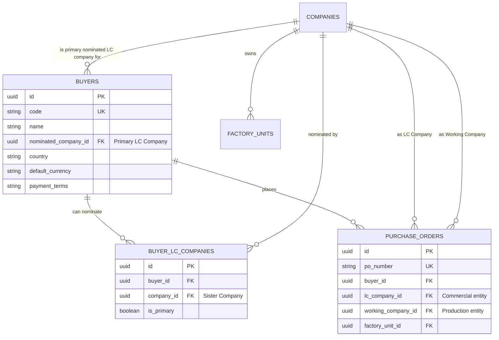

# Software Requirements Specification (SRS) & SOP
## বায়ার এলসি কোম্পানি নমিনেশন ও সিস্টার কোম্পানি ওয়ার্কিং ম্যাপিং আর্কিটেকচার (LC Company vs Working Company)

**ডকুমেন্ট রেফারেন্স:** `SRS-SOP-RMG-M02-BUYER-LC-MAPPING-01`  
**মডিউল:** Module 02 — Master Library (Business Partners & Group Organization) & Module 03 — Orders  
**সিস্টেম:** TraceFlow RMG Enterprise Woven Garments Traceability Software  
**প্রোডাক্ট ওনার / প্রজেক্ট স্পন্সর ক্ল্যারিফিকেশন:**
> *"buyer j kono akta Sister concern company k LC Deba like akta buyer j kono akta sister concern company er nominated hoba. then buyer order dela oi order group er j kono sister company te work korte parba. ekhna buyer nominated company holo lc company & sister company holo working compnay. eta follow kore aga srs or sop make koro then implement koro"*

---

## ১. ভূমিকা ও ডোমেন বিজনেস রুলস (Business Rules & Domain Philosophy)

তৈরি পোশাক শিল্পে (RMG Conglomerates & Multi-Entity Groups) এটি একটি অত্যন্ত প্রতিষ্ঠিত ও নিয়মিত বিজনেস মডেল:
1. **কমার্শিয়াল ও ব্যাংকিং আইন (NBR/Customs/Banking Compliance):**
   - আন্তর্জাতিক বায়ার সরাসরি গ্রুপকে চেনে না; সে গ্রুপের যেকোনো একটি নির্দিষ্ট রেজিস্টার্ড সিস্টার কনসার্ন (আইনি সত্ত্বা / Company Entity) বরাবর **Export Master LC (Letter of Credit)** অথবা **Sales Contract (SC)** ইস্যু করে।
   - সুতরাং, সিস্টেমে প্রতিটি বায়ারের জন্য একটি নির্ধারিত **Nominated LC Company** (যা একটি সিস্টার কনসার্ন) থাকবে। কমার্শিয়াল ইনভয়েস, এনবিআর বিন (BIN), ব্যাংক ইউটিলাইজেশন ডিক্লারেশন (UD), এবং কাস্টমস এক্সপোর্ট ডকুমেন্টস এই নমিনেটেড কোম্পানির নামেই সম্পন্ন হবে।
2. **অপারেশনাল ও প্রোডাকশন ফ্লেক্সিবিলিটি (Cross-Company Production Execution):**
   - বায়ার যখন একটি পারচেজ অর্ডার (Buyer PO) প্রদান করে, তখন সেই অর্ডারের ফিজিক্যাল কাজ (কাটিং, সুইং, ওয়াশিং, ফিনিশিং) গ্রুপের ক্যাপাসিটি, কমপ্লায়েন্স এবং স্পেশালাইজেশনের ওপর নির্ভর করে **গ্রুপের যে কোনো সিস্টার কোম্পানির যেকোনো ফ্যাক্টরি ইউনিটে (`Working Company` / `Factory Unit`)** সম্পাদিত হতে পারে।
   - যেমন: বায়ার *H&M* এর Master LC এসেছে *TexFlow Apparels Ltd.* (LC Company)-এর নামে। কিন্তু প্রোডাকশন ক্যাপাসিটি খালি থাকায় বায়ারের অনুমোদিত ডেনিম আইটেমের কাটিং ও সেলাই সম্পন্ন হচ্ছে *TexFlow Denim Mills Ltd.* (Working Company)-এর ফ্যাক্টরিতে।
3. **ইন্টার-কোম্পানি ট্রানজ্যাকশন ও সাব-কন্ট্রাক্ট/শেয়ারিং অখণ্ডতা:**
   - সিস্টেম স্বয়ংক্রিয়ভাবে ট্র্যাক রাখবে:
     - **Commercial / LC Company:** কার নামে অর্ডার বুক হয়েছে এবং পেমেন্ট রিসিভ হবে।
     - **Working Company / Production Plant:** বাস্তবে কোন সিস্টার কোম্পানি ও কোন ফ্যাক্টরি ইউনিটে ফিজিক্যাল গার্মেন্টস তৈরি হয়েছে (Traceability Lineage)।

---

## ২. স্ট্যান্ডার্ড অপারেটিং প্রসিডিউর (SOP): বায়ার-কোম্পানি ম্যাপিং ও অর্ডার এক্সিকিউশন

### SOP ধাপ ১: বায়ার প্রোফাইলে নমিনেটেড এলসি কোম্পানি নির্ধারণ (Buyer Master Entry)
1. বায়ার তৈরির সময় কমার্শিয়াল সেকশনে **"Nominated LC Sister Company" (বাধ্যতামূলক)** সিলেক্ট করতে হবে।
2. এটি হবে সেই সিস্টার কনসার্ন যার নামে বায়ারের Master LC / Sales Contract খোলা হয় এবং যার ব্যাংক অ্যাকাউন্টে এক্সপোর্ট প্রসিড জমা হয়।
3. প্রয়োজনে একাধিক সিস্টার কোম্পানির সাথে বায়ারের পূর্ব-অনুমোদিত ব্যবসায়িক সম্পর্ক থাকলে একটিকে "Primary LC Company" এবং অন্যগুলোকে "Permitted LC Entities" হিসেবে রেকর্ড রাখা যাবে।

### SOP ধাপ ২: পারচেজ অর্ডার (Buyer PO) এন্ট্রি ও ভ্যালিডেশন (Order Intake)
1. যখন কোনো মার্চেন্ডাইজার বায়ারের Purchase Order সিস্টেমে ইনপুট দেয়:
   - **LC Company:** বায়ার প্রোফাইল থেকে স্বয়ংক্রিয়ভাবে ডিফল্ট নমিনেটেড কোম্পানি হিসেবে সেট হবে (প্রয়োজনে অনুমোদিত কোম্পানিগুলোর মধ্যে পরিবর্তন করা যাবে)।
   - **Working Company (বাধ্যতামূলক):** অর্ডারের প্রোডাকশন কোন সিস্টার কোম্পানির প্ল্যান্টে হবে তা নির্ধারণ করা হবে।
   - ডিফল্ট অবস্থায় Working Company = LC Company হতে পারে, অথবা গ্রুপের যেকোনো সিস্টার কোম্পানিকে Working Company হিসেবে এসাইন করা যাবে।

### SOP ধাপ ৩: ফ্লোর প্ল্যানিং ও লাইনে জব অ্যালোকেশন (Production Allocation)
1. PPC ও প্ল্যানিং টিম জব অর্ডার শিডিউল করার সময় Working Company-এর অধীনে থাকা যে কোনো ফ্যাক্টরি ইউনিট, বিল্ডিং, ফ্লোর এবং সুইং লাইন লোড করতে পারবে।
2. কিউসি (QC), বান্ডেল বারকোড ও ডোর ট্র্যাকিং এ "LC Company" এবং "Working Company" উভয়ের রেফারেন্স সংরক্ষিত থাকবে।

---

## ৩. ডেটাবেজ ও স্কিমা মডেলিং (Database Schema)

### ফিল্ড স্পেসিফিকেশন:
1. **`buyers` টেবিলে পরিবর্তন:**
   - `nominated_company_id` (foreignUuid -> `companies`, nullable on legacy / mandatory on create): বায়ারের মূল আইনি এলসি কোম্পানি।
2. **`buyer_lc_companies` (Pivot Table):**
   - বায়ার যদি গ্রুপের একাধিক সিস্টার কোম্পানির নামে ভিন্ন ভিন্ন ডিভিশনের এলসি খুলতে পারে, তবে এই পিভট টেবিল সেই অনুমোদন ট্র্যাক করবে।
3. **`orders` টেবিলে প্রস্তুতি (Module 03):**
   - `lc_company_id`: যে সিস্টার কোম্পানির নামে এলসি এসেছে।
   - `working_company_id`: যে সিস্টার কোম্পানির কারখানায় গার্মেন্টস সেলাই/প্রোডাকশন হচ্ছে।

---

## ৪. স্ক্রিন ও ইউজার ইন্টারফেস (UI/UX) ডিজাইন স্পেসিফিকেশন

1. **Buyer Create & Edit Page:**
   - **Card 1: Commercial Terms & Invoicing Company**:
     - **Nominated LC Sister Company (Dropdown - Required):** গ্রুপের সকল অ্যাক্টিভ সিস্টার কোম্পানির তালিকা থেকে ড্রপডাউন।
     - স্পষ্ট সাবটেক্সট: *"Primary corporate entity of the group that receives export LCs and issues commercial invoices for this buyer."*
     - **Permitted Working Plants / Inter-Company Production Note:** একটি স্পষ্ট বিজনেস ইনফো ব্যাজ থাকবে: *"Production of orders from this buyer can be dispatched to any sister concern's factory plants across the group."*
2. **Buyer Directory List Page (`BuyerListPage.tsx`):**
   - টেবিলে একটি নতুন কলাম যুক্ত হবে: **"Nominated LC Company"** যেখানে সংশ্লিষ্ট কোম্পানির নাম ও কোড ব্যাজ (e.g. `<Badge variant="primary">{buyer.nominated_company?.code}</Badge>`) প্রদর্শিত হবে।

---

## ৫. বাস্তবায়ন ও ভেরিফিকেশন প্রস্তুতি
- ব্যাকএন্ড মাইগ্রেশন ও মডেল রিলেশনশিপ তৈরি।
- বায়ার স্টোর ও আপডেট রিকোয়েস্ট ভ্যালিডেশন আপডেট।
- ফ্রন্টএন্ড ফর্ম ও টেবিলে নমিনেটেড এলসি কোম্পানি সিলেক্টর ইন্টিগ্রেশন।
- সিডারে ডামি বায়ারদের নির্দিষ্ট সিস্টার কোম্পানির সাথে নমিনেশন যুক্ত করা।
