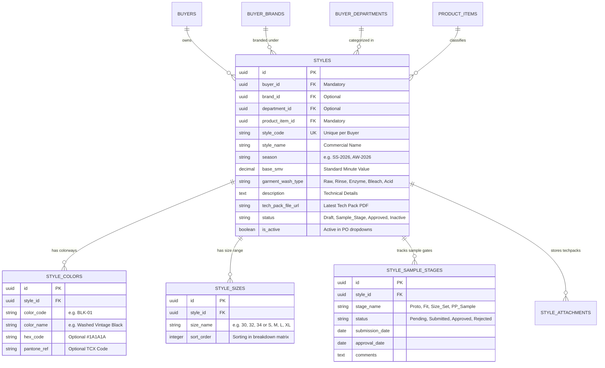

# Software Requirements Specification (SRS)
## স্টাইল মাস্টার ও মার্চেন্ডাইজিং স্পেসিফিকেশন (Style Library & Merchandising Engine)

**ডকুমেন্ট রেফারেন্স:** `SRS-RMG-M02-STYLE-01`  
**মডিউল:** Module 02 — Master Data Library & Business Partner Setup (Sub-module: Style Master)  
**সিস্টেম:** TraceFlow RMG — Precision Fabric-to-Freight Garment Traceability Software  
**ভূমিকা/অথর:** RMG Solution Architect & Business Analyst  
**স্ট্যাটাস:** Engineering Approved for Implementation  
**প্রযোজ্য শিল্প:** ওভেন গার্মেন্টস (শার্ট, ট্রাউজার, ডেনিম, কার্গো, জ্যাকেট ও ওভেন ক্যাজুয়ালস)  
**ভাষা:** বাংলা (Bangla - Business & Technical Standard)

---

## ১. ভূমিকা ও বিজনেস রিকয়ারমেন্ট বিশ্লেষণ (Business Context)

তৈরি পোশাক (RMG Woven Garments) শিল্পে **"স্টাইল (Style)"** হলো সম্পূর্ণ প্রোডাকশন এবং সাপ্লাই চেইনের মূল চালিকাশক্তি। একটি পোশাক কারখানায় কাটিং, সুইং লাইন লোডিং, ফেব্রিক ইস্যু, ওয়াশিং ও কিউআর কোড ট্র্যাকিংয়ের প্রতিটি ধাপ সরাসরি একটি অনুমোদিত স্টাইলের (Approved Style) সাথে সম্পর্কিত।

### ১.১ বাস্তব ফ্যাক্টরিতে স্টাইলের গুরুত্ব ও লাইফসাইকেল
1. **Buyer Dependency:** আন্তর্জাতিক বায়ার (যেমন: H&M, Zara, Levi's, Primark) তাদের প্রতিটি নতুন সিজনের জন্য ইউনিক স্টাইল কোড (Style Number) এবং টেক-প্যাক (Tech Pack) প্রদান করে।
2. **Buyer Department & Brand Mapping:** একটি বায়ারের একাধিক সাব-ব্র্যান্ড (যেমন: H&M Divided) এবং ডিপার্টমেন্ট (যেমন: Men's Casual Wear, Boys Denim) থাকতে পারে। স্টাইল অবশ্যই নির্দিষ্ট ব্র্যান্ড এবং ডিপার্টমেন্টের সাথে ট্যাগ হতে হবে।
3. **Product Category & Item Binding:** প্রতিটি স্টাইল একটি নির্দিষ্ট প্রডাক্ট আইটেমের অন্তর্ভুক্ত (যেমন: Men's Denim 5-Pocket Pant, Flannel Long Sleeve Shirt)। এর মাধ্যমে অনুমোদিত ক্যাটাগরি ও স্ট্যান্ডার্ড রেঞ্জ যাচাই হয়।
4. **Standard Minute Value (SMV):** ইন্ডাস্ট্রিয়াল ইঞ্জিনিয়ারিং (IE) টিম প্রতিটি স্টাইলের জন্য অপারেশনের জটিলতা অনুযায়ী স্ট্যান্ডার্ড মিনিট ভ্যালু (SMV) নির্ধারণ করে, যা লাইনের ক্যাপাসিটি প্ল্যানিং ও ব্যালেন্সিংয়ে ব্যবহৃত হয়।
5. **Bill of Materials (BOM) & Trims Consumption:** স্টাইলে কোন কোন ফেব্রিক (Shirting, Denim, Twill) এবং ট্রিমস (Button, Zipper, Rivet, Care Label, Main Label, Thread) লাগবে তার ভিত্তিপ্রস্তর এই স্টাইল লাইব্রেরি।
6. **Color-Size Range Matrix:** প্রতিটি স্টাইলের নির্দিষ্ট অনুমোদিত কালার কম্বিনেশন এবং সাইজ স্পেসিফিকেশন (যেমন: Waist 28 to 38, Inseam 30, 32, 34) থাকে।

---

## ২. ডোমেন এন্টিটি ও রিলেশনশিপ মডেল (Entity Relationship Architecture)

---

## ৩. ফিল্ড লেভেল স্পেসিফিকেশন ও ভ্যালিডেশন রুলস (Field Validations)

| ফিল্ডের নাম | ডেটা টাইপ | বাধ্যতামূলক? | বিজনেস ও সিস্টেম ভ্যালিডেশন রুলস | ফ্রন্টএন্ড UI কনট্রোল |
|---|---|---|---|---|
| `buyer_id` | UUID | **হ্যাঁ** | `buyers` টেবিলে ভ্যালিড এবং `is_active = true` হতে হবে। | সার্চেবল সিলেক্ট ড্রপডাউন |
| `brand_id` | UUID | না | নির্বাচিত বায়ারের সাব-ব্র্যান্ড তালিকা থেকে সিলেক্ট হবে। | ক্যাস্কেডিং ড্রপডাউন |
| `department_id` | UUID | না | নির্বাচিত বায়ারের রেজিস্টার্ড ডিপার্টমেন্ট তালিকা থেকে সিলেক্ট হবে। | ক্যাস্কেডিং ড্রপডাউন |
| `product_item_id` | UUID | **হ্যাঁ** | `product_items` টেবিলে থাকতে হবে (গার্মেন্টস ক্যাটাগরি ও বেস আইটেম)। | ক্যাস্কেডিং সিলেক্ট ড্রপডাউন |
| `style_code` | String (50) | **হ্যাঁ** | মিনিমাম ৩, ম্যাক্স ৫০ ক্যারেক্টার। **একই বায়ারের অধীনে স্টাইল কোড ইউনিক হতে হবে** (Composite Unique: `buyer_id + style_code`)। | টেক্সট ইনপুট (Uppercase Auto-format) |
| `style_name` | String (150) | **হ্যাঁ** | মিনিমাম ৩, ম্যাক্স ১৫০ ক্যারেক্টার। যেমন: "Men's 5-Pocket Slim Denim"。 | টেক্সট ইনপুট |
| `season` | String (50) | **হ্যাঁ** | বায়ার সিজন কোড (যেমন: "Spring/Summer 2026", "Autumn/Winter 2026")। | টেক্সট / প্রিসেট সিলেক্ট |
| `base_smv` | Decimal (5,2) | **হ্যাঁ** | ০.০১ থেকে ৯৯৯.৯৯ এর মধ্যে হতে হবে। ইন্ডাস্ট্রিয়াল সুইং স্ট্যান্ডার্ড মিনিট ভ্যালু। | নিউমেরিক ইনপুট (২ দশমিক স্থান) |
| `garment_wash_type` | Enum / String | **হ্যাঁ** | অপশনস: `None / Raw`, `Rinse Wash`, `Enzyme Stone Wash`, `Bleach Wash`, `Vintage Tint`, `Acid Wash`। | সিলেক্ট বক্স |
| `tech_pack_file` | File / URL | না | অনুমোদিত এক্সটেনশন: PDF, ZIP (সর্বোচ্চ ২০ মেগাবাইট)। | ড্র্যাগ অ্যান্ড ড্রপ ফাইল আপলোডার |
| `colors` | Array (Object) | **হ্যাঁ** | কমপক্ষে ১টি কালার থাকতে হবে। কালার কোড ও কালার নেম ফিল্ড থাকা আবশ্যক। | ডায়নামিক রো রিপিটার (Add Color) |
| `sizes` | Array (Object) | **হ্যাঁ** | কমপক্ষে ১টি সাইজ থাকতে হবে। সাইজের নাম ও ক্রমানুসারে সাজানোর জন্য `sort_order` থাকবে। | ডায়নামিক চিপস / সাইজ গ্রিড বিল্ডার |
| `status` | Enum | **হ্যাঁ** | `Draft`, `Sampling`, `Bulk_Approved`, `Discontinued` (ডিফল্ট: `Sampling`)। | স্ট্যাটাস ব্যাজ / সিলেক্ট |
| `is_active` | Boolean | **হ্যাঁ** | ডিফল্ট: `true`। `false` হলে নতুন PO তৈরিতে আসবে না। | টগল সুইচ |

---

## ৪. কঠোর বিজনেস রুলস ও এজ কেস (Strict Business Logic & Edge Cases)

1. **Rule 1 (Buyer-Level Style Uniqueness):**
   - স্টাইল কোড গ্লোবালি ইউনিক হওয়া বাধ্যতামূলক নয়, কিন্তু **একই বায়ারের অধীনে স্টাইল কোড ডুপ্লিকেট হতে পারবে না**।
   - *উদাহরণ:* H&M এর স্টাইল কোড হতে পারে `HM-JEANS-01` এবং Zara-র স্টাইল কোডও হতে পারে `HM-JEANS-01` (সম্ভব)। কিন্তু H&M এর অধীনে দুটি `HM-JEANS-01` সেভ করতে গেলে সিস্টেম `422 Unprocessable Entity` ("Style code already exists for this buyer") ছুড়ে দেবে।

2. **Rule 2 (Color-Size Matrix Immutability in Production):**
   - কোনো স্টাইলের বিপরীতে যদি ইতিমধ্যে কনফার্মড Purchase Order (PO) তৈরি হয়ে যায় এবং কাটিং ফ্লোরে ফেব্রিক কাটিং শুরু হয়ে যায় (Cut Register Generated), তবে সেই স্টাইল থেকে বিদ্যমান কালার বা সাইজ মুছে ফেলা (Delete) সম্পূর্ণ লক থাকবে। শুধুমাত্র নতুন কালার বা সাইজ যোগ করা যাবে।

3. **Rule 3 (PP Sample Gatekeeper for Cutting):**
   - সিস্টেমের প্রোডাকশন ফ্লোরে কাটিং মার্কার ছাড়ার পূর্বে স্টাইলের **PP Sample (Pre-Production Sample) Approved** স্ট্যাটাস ভেরিফাই করতে হবে। PP Sample অনুমোদন ছাড়া কাটিং ম্যানেজার লাইনে বান্ডিল টিকিট প্রিন্ট করতে পারবে না।

4. **Rule 4 (No HTML5 Native Validation - Server Driven):**
   - সকল ফ্রন্টএন্ড ফর্ম সাবমিশন পিওর সার্ভার-সাইড ভ্যালিডেশন নির্ভর হবে (`noValidate` অ্যাট্রিবিউটসহ)। সার্ভার থেকে আসা HTTP 422 JSON ফিল্ড এরর মেসেজ নির্দিষ্ট ইনপুটের নিচে ডিসপ্লে হবে।

---

## ৫. রেস্টফুল এপিআই স্পেসিফিকেশন (API Architecture)

### ৫.১ এন্ডপয়েন্ট তালিকা

| Method | Endpoint | অ্যাক্সেস পারমিশন | বর্ণনা |
|---|---|---|---|
| `GET` | `/api/v1/styles` | `style.view` | ফিল্টার, সার্চ ও পেজিনেশনসহ স্টাইলের তালিকা। |
| `POST` | `/api/v1/styles` | `style.create` | নতুন স্টাইল, কালার ও সাইজ রেঞ্জ তৈরি। |
| `GET` | `/api/v1/styles/{id}` | `style.view` | একক স্টাইলের বিস্তারিত (বায়ার, কালার, সাইজ, টেকপ্যাকসহ)। |
| `PUT` | `/api/v1/styles/{id}` | `style.edit` | বিদ্যমান স্টাইলের তথ্য ও স্পেসিফিকেশন আপডেট। |
| `DELETE` | `/api/v1/styles/{id}` | `style.delete` | স্টাইল সফট ডিলিট (যদি কোনো PO যুক্ত না থাকে)। |
| `GET` | `/api/v1/styles/by-buyer/{buyerId}` | `style.view` | নির্দিষ্ট বায়ারের সক্রিয় স্টাইলগুলোর ড্রপডাউন লিস্ট। |
| `POST` | `/api/v1/styles/{id}/tech-pack` | `style.edit` | নতুন টেক-প্যাক ফাইল আপলোড ও ভার্সন কন্ট্রোল। |

---

## ৬. UI/UX গোল্ডেন স্ট্যান্ডার্ড ও স্ক্রিন স্পেসিফিকেশন (Frontend Standards)

প্রজেক্টের গ্লোবাল আর্কিটেকচার রুলস (`AGENTS.md`) অনুযায়ী স্টাইল ম্যানেজমেন্টে নিচের বিষয়গুলো কঠোরভাবে মানা হবে:

1. **No Modals Rule (STRICT):**
   - কোনো পপআপ বা মোডাল ডায়ালগ থাকবে না।
   - স্টাইল তৈরি ও এডিটের জন্য ডেডিকেটেড ফুল পেইজ ভিউ থাকবে (`/master-data/styles/create` এবং `/master-data/styles/:id/edit`)।
2. **Mandatory 3-Tier Layout (Style Directory):**
   - **Tier 1 (PageHeader):** বামে Title `Style Library` + কাউন্টার `<Badge variant="neutral">` (e.g. `128 Styles`), ডানে অ্যাকশন বাটন `<Button variant="primary">Add New Style</Button>`।
   - **Tier 2 (FilterToolbar):** সার্চ ইনপুট (Search by Style No, Name), বায়ার ফিল্টার ড্রপডাউন, সিজন ড্রপডাউন, ওয়াশ টাইপ ড্রপডাউন, স্ট্যাটাস ফিল্টার, "Filter" বাটন ও "Reset" বাটন। সাবলাইনে সর্টিং পিল ও পার-পেইজ সিলেক্টর।
   - **Tier 3 (DataTable):** স্ট্যান্ডার্ড `<DataTable<Style>>` প্রিমিটিভ। কলামসমূহ:
     - `Style Code`: মনোস্পেস ফন্ট, বোল্ড।
     - `Style Name`: নাম ও সাথে বায়ারের নাম সাব-টেক্সট হিসেবে।
     - `Category & Wash`: প্রডাক্ট আইটেম ও ওয়াশ টাইপের ব্যাজ।
     - `Base SMV`: সংখ্যা ও মিনিট ভ্যালু (যেমন: `18.50 min`)।
     - `Colors & Sizes`: কাউন্টার পিল (e.g. `4 Colors`, `6 Sizes`)।
     - `Status`: `<Badge variant="success | warning | neutral">`।
     - `Actions`: ভিউ, এডিট এবং ডিলিট অ্যাকশন বাটনসমূহ।
3. **2-Column Form Layout (Style Create / Edit Page):**
   - **Left Column (8 Cols):**
     - Card 1: বায়ার, ব্র্যান্ড, ডিপার্টমেন্ট ও প্রডাক্ট আইটেম সিলেকশন।
     - Card 2: স্টাইল কোড, স্টাইল নেম, সিজন, বেস এসএমভি ও ওয়াশ টাইপ।
     - Card 3: কালারওয়েজ রিপিটার (Dynamic Add/Remove Color Rows)।
     - Card 4: সাইজ রেঞ্জ বিল্ডার (Quick Add Sizes - S, M, L, XL, XXL অথবা 28, 30, 32...)।
     - Card 5: টেক-প্যাক ডকুমেন্ট আপলোড ও ডেসক্রিপশন।
   - **Right Sidebar (4 Cols):**
     - লাইভ স্টাইল কার্ড প্রিভিউ (Style Code, Buyer Logo/Name, Category, Base SMV)।
     - রেকর্ড স্ট্যাটাস ও অ্যাক্টিভেশন টগল সুইচ।
4. **সেন্ট্রালাইজড ডিজাইন টোকেন (`UI_TOKENS`):**
   - কোনো কাস্টম বা ইনলাইন টেলউইন্ড ক্লাস নয়; সম্পূর্ণ ফর্ম, কার্ড এবং বাটন শুধুমাত্র `frontend/src/config/designTokens.ts` এবং `frontend/src/components/common/` প্রিমিটিভ থেকে ব্যবহৃত হবে।

---

## ৭. অনুমোদন ও পরবর্তী পদক্ষেপ (Engineering Approval)

- **অনুমোদনকারী:** RMG Solution Architect & Product Owner  
- **পরবর্তী ধাপ:**
  1. ব্যাকএন্ডে ডেটাবেজ মাইগ্রেশন তৈরি (`create_styles_and_attributes_tables.php`)
  2. ইলোকুয়েন্ট মডেলস ও রিলেশনশিপ (`Style`, `StyleColor`, `StyleSize`)
  3. ফর্ম রিকোয়েস্ট ভ্যালিডেশন ও রেস্টফুল কন্ট্রোলার (`StyleController`)
  4. ফ্রন্টএন্ড এপিআই সার্ভিস ও টাইপ ডেফিনিশন (`styleService.ts`, `style.ts`)
  5. ৩-টিয়ার গোল্ডেন লেআউটে ফ্রন্টএন্ড পেজসমূহ (`StyleListPage`, `StyleCreatePage`, `StyleEditPage`)
  6. সাইডবার নেভিগেশন লিঙ্কিং ও অ্যান্ড-টু-অ্যান্ড ভেরিফিকেশন।
