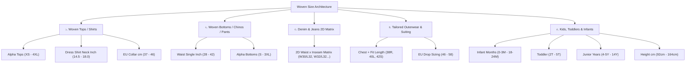

# Software Requirements Specification (SRS)
## Woven Garments Size Group & Size Master Architecture
### (Enterprise Multi-Category Woven Apparel Sizing & Matrix Breakdown Standard)

**ডকুমেন্ট রেফারেন্স:** `SRS-RMG-M02-SIZE-MASTER-CORE-02`  
**মডিউল:** Module 02 — Master Data Management / Style & Product Technical Architecture  
**সিস্টেম:** TraceFlow RMG — Precision Fabric-to-Freight Garment Traceability Software  
**ভূমিকা/অথর:** RMG Solution Architect & Business Analyst  
**স্ট্যাটাস:** Official Engineering Specification (Final Approved)  
**প্রযোজ্য শিল্প:** ওভেন গার্মেন্টস ম্যানুফ্যাকচারিং (Woven Garments Export Industry: Tops, Bottoms, Denim, Suits, Kids)  
**ভাষা:** বাংলা (Bangla - Business & Technical Specification Standard)  

---

## ১. ভূমিকা ও বিজনেস রিকয়ারমেন্ট বিশ্লেষণ (Executive Summary)

তৈরি পোশাক শিল্পে, বিশেষ করে **ওভেন গার্মেন্টস (Woven Garments)** উৎপাদনে নিটওয়্যার (Knitwear)-এর তুলনায় সাইজ আর্কিটেকচার অত্যন্ত জটিল, বৈচিত্র্যময় এবং কঠোর ডাইমেনশনাল নির্ভুলতার উপর নির্ভরশীল। নিট কাপড়ের স্বাভাবিক স্থিতিস্থাপকতা (stretchability) থাকায় সাধারণত আলফা সাইজ (`S`, `M`, `L`, `XL`) দিয়েই অধিকাংশ কাটিং ও সুইং সম্পন্ন করা যায়। কিন্তু ওভেন পোশাকে কোনো রিজিড ফেব্রিক ইলংগেশন না থাকায় বায়াররা সুনির্দিষ্ট পরিমাপ যেমন— কলার সাইজ (ইঞ্চি/সেমি), ট্রাউজার কোমর (Waist), ইনার সীম (Inseam), স্যুট ব্লেজারের চেস্ট এবং ফিট ড্রপ (`38R`, `40L`), কিংবা শিশুদের বয়স ও উচ্চতা অনুযায়ী অর্ডার প্লেস করে।

যদি সাইজ গ্রুপ এবং সাইজ মাস্টার ডেটাবেজে এলোমেলোভাবে সংরক্ষিত থাকে, তবে:
1. **কাটিং ও মার্কার তৈরিতে বিপর্যয়:** কাটিং রেশিও এবং মার্কার প্ল্যানিংয়ে সাইজ সিকোয়েন্স এলোমেলো হয়ে ফ্যাব্রিক অপচয় (Wastage) বাড়ে।
2. **কালার-সাইজ ম্যাট্রিক্স বিশৃঙ্খলা:** অর্ডার এন্ট্রি, কাট পিস ইস্যু, বান্ডেল কিউআর ট্যাগ জেনারেশন এবং কার্টন প্যাকিং লিস্টে কলাম বা সারির ধারাবাহিকতা নষ্ট হয় (`34x32`-এর আগে `38x30` চলে আসার ঝুঁকি থাকে)।
3. **বায়ার ও কনভার্সন বিভ্রান্তি:** ইউএস (US), ইউকে/ইউরোপিয়ান (UK/EU) কিংবা ইঞ্চি বনাম সেন্টিমিটারের মধ্যে ম্যাপিং ত্রুটি দেখা দেয়।

এই স্পেসিফিকেশনের মূল উদ্দেশ্য হলো ওভেন গার্মেন্টসের প্রতিটি ক্যাটাগরির জন্য একটি নির্ভরযোগ্য, সিকোয়েন্সিয়াল, সেন্ট্রালাইজড **"Size Group & Size Master Architecture"** প্রতিষ্ঠা করা যা Style Library, Tech-Pack, Order Breakdown Matrix এবং Floor Cutting/Sewing ট্র্যাকিংয়ে ইউনিফাইড ডেটা সোর্স হিসেবে কাজ করবে।

---

## ২. ওভেন গার্মেন্টসের সাইজ গ্রুপ ক্লাসিফিকেশন (Woven Sizing Taxonomy)

ওভেন পোশাকের জন্য মূলত **৫টি প্রধান সাইজিং পরিবার (Sizing Families)** ব্যবহৃত হয়:



---

### ২.১ গ্রুপ ১: ওভেন টপস (Woven Tops / Shirts / Blouses)

ওভেন শার্ট ও ব্লাউজের ক্ষেত্রে ৩ ধরনের সাইজ গ্রুপ ব্যবহৃত হয়:

| সাইজ গ্রুপ কোড | সাইজ গ্রুপের নাম | মেজারমেন্টের ধরন | অন্তর্ভুক্ত সাইজসমূহ (স্ট্যান্ডার্ড সিকোয়েন্সে সাজানো) | টার্গেট বায়ার ও আইটেম |
| :--- | :--- | :--- | :--- | :--- |
| `SZG-TOP-ALPHA-M` | Men's Tops Alpha Scale | Alpha (টেক্সট) | `XS`, `S`, `M`, `L`, `XL`, `XXL`, `3XL`, `4XL`, `5XL` | মেনস ক্যাজুয়াল শার্ট, ওভারশার্ট, ফ্লানেল |
| `SZG-TOP-NECK-IN` | Formal Dress Shirt (Neck Inch) | Numeric Collar (Inch) | `14.5`, `15.0`, `15.5`, `16.0`, `16.5`, `17.0`, `17.5`, `18.0`, `18.5` | ইউএস ও ইউকে এক্সপোর্ট ফরমাল বিজনেস শার্ট |
| `SZG-TOP-NECK-CM` | Men's Collar EU (cm) | Metric Collar (cm) | `37`, `38`, `39`, `40`, `41`, `42`, `43`, `44`, `45`, `46` | ইউরোপিয়ান ফরমাল ড্রেস শার্ট |
| `SZG-TOP-ALPHA-W` | Women's Woven Tops Alpha | Alpha (টেক্সট) | `XXS`, `XS`, `S`, `M`, `L`, `XL`, `XXL` | ওভেন টিউনিক, লেডিস ব্লাউজ |
| `SZG-TOP-NUM-USW` | Women's Numeric US | Numeric | `0`, `2`, `4`, `6`, `8`, `10`, `12`, `14`, `16`, `18` | ইউএস ওভেন ব্লাউজ ও ওভেন ফ্রক |
| `SZG-TOP-NUM-EUW` | Women's Numeric EU/UK | Numeric | `32`, `34`, `36`, `38`, `40`, `42`, `44`, `46`, `48` | ইউরোপীয় লেডিস ওভেন শার্ট |

---

### ২.২ গ্রুপ ২: ওভেন বটমস ও চিনোজ (Woven Bottoms / Chinos / Trousers)

চিনো ট্রাউজার, কার্গো ও ড্রেস প্যান্টের ক্ষেত্রে সাধারণত কোমর (Waist) ভিত্তিক সাইজিং ব্যবহৃত হয়:

| সাইজ গ্রুপ কোড | সাইজ গ্রুপের নাম | মেজারমেন্টের ধরন | অন্তর্ভুক্ত সাইজসমূহ | টার্গেট বায়ার ও আইটেম |
| :--- | :--- | :--- | :--- | :--- |
| `SZG-BTM-WST-IN` | Men's Waist (Inches) | 1D Waist (Inch) | `28`, `29`, `30`, `31`, `32`, `33`, `34`, `35`, `36`, `38`, `40`, `42` | ক্যাজুয়াল চিনো প্যান্ট, কার্গো ট্রাউজার |
| `SZG-BTM-ALPHA` | Casual Bottoms Alpha | Alpha | `XS`, `S`, `M`, `L`, `XL`, `XXL`, `3XL` | ইলাস্টিক কোমর জগার প্যান্ট, বারমুডা শর্টস |
| `SZG-BTM-WST-W` | Women's Waist (Inches) | 1D Waist (Inch) | `24`, `25`, `26`, `27`, `28`, `29`, `30`, `31`, `32`, `34` | ওভেন লেডিস ট্রাউজার ও ক্যাপ্রি |

---

### ২.৩ গ্রুপ ৩: ডেনিম ও জিন্স ২ডি ম্যাট্রিক্স (Denim 2D Waist x Inseam)

ডেনিম উৎপাদনে একক সাইজ ব্যবহৃত হয় না। প্রতিটি প্যান্টের সাইজ দুটি স্বতন্ত্র মাত্রার সমন্বয়ে গঠিত: **কোমর (Waist)** এবং **পায়ের ঝুল / ইনার সীম (Inseam/Length)**:

| সাইজ গ্রুপ কোড | সাইজ গ্রুপের নাম | ২ডি ডাইমেনশন | সাইজ ভ্যালু ম্যাট্রিক্স ফরম্যাট |
| :--- | :--- | :--- | :--- |
| `SZG-DNM-2D-STD` | Standard Denim Waist x Inseam | কোমর: `28, 30, 32, 34, 36, 38` <br/> লেন্থ: `30, 32, 34` | `30x30`, `30x32`, `32x30`, `32x32`, `32x34`, `34x30`, `34x32`, `34x34`, `36x32`, `36x34` |
| `SZG-DNM-2D-EXT` | Extended Denim Scale (Big & Tall) | কোমর: `36, 38, 40, 42, 44` <br/> লেন্থ: `32, 34, 36` | `38x32`, `38x34`, `40x32`, `40x34`, `42x32`, `42x34` |

> [!IMPORTANT]
> **2D ম্যাট্রিক্সের ডেটাবেজ নীতি:** সিস্টেমে `32x34`-কে স্ট্রিং আকারে একটি সিঙ্গেল সাইজ হিসেবে রাখা হলেও ব্যাকএন্ডে এর দুটি প্রোপার্টি সংরক্ষিত থাকবে: `primary_dimension = 32` (Waist) এবং `secondary_dimension = 34` (Inseam)। এতে করে কাটিং টেবিলে মার্কার তৈরির সময় কোমর অনুযায়ী গ্রুপ বা লেন্থ অনুযায়ী গ্রুপ সহজেই ফিল্টার করা যায়।

---

### ২.৪ গ্রুপ ৪: স্যুট, ব্লেজার ও আউটারওয়্যার (Tailored Suiting & Outerwear)

ফরমাল স্যুট এবং জ্যাকেটে বডি চেস্ট ও বডি ফ্রেমের দৈর্ঘ্যের কম্বিনেশন থাকে:

| সাইজ গ্রুপ কোড | সাইজ গ্রুপের নাম | মেজারমেন্টের ধরন | অন্তর্ভুক্ত সাইজসমূহ | ব্যাখ্যা |
| :--- | :--- | :--- | :--- | :--- |
| `SZG-OUT-SUIT-US` | Men's Suiting (Chest + Fit) | Chest + Fit Suffix | `36S`, `38S`, `38R`, `40S`, `40R`, `40L`, `42R`, `42L`, `44R`, `44L` | `S` = Short, `R` = Regular, `L` = Long |
| `SZG-OUT-SUIT-EU` | Men's European Tailored Drop | Drop Sizing | `44`, `46`, `48`, `50`, `52`, `54`, `56`, `58` | ইউরোপীয় স্ট্যান্ডার্ড মেনস ব্লেজার স্কেল |

---

### ২.৫ গ্রুপ ৫: কিডস, টডলার ও ইনফ্যান্ট ওভেন (Kids & Baby Woven Wear)

শিশুদের পোশাকের জন্য বয়স (Age Months/Years) অথবা শিশুর শারীরিক উচ্চতা (Height cm) অনুযায়ী সাইজিং করা হয়:

| সাইজ গ্রুপ কোড | সাইজ গ্রুপের নাম | মেজারমেন্টের ধরন | অন্তর্ভুক্ত সাইজসমূহ | টার্গেট আইটেম |
| :--- | :--- | :--- | :--- | :--- |
| `SZG-KID-INFANT` | Baby Infant Months | Months | `0-3M`, `3-6M`, `6-9M`, `9-12M`, `12-18M`, `18-24M` | ওভেন বেবি রম্পার, শার্ট |
| `SZG-KID-TODDLER` | Toddler (T-Scale) | US Toddler | `2T`, `3T`, `4T`, `5T` | টডলার ওভেন শর্টস ও শার্ট |
| `SZG-KID-YEARS` | Junior Boys/Girls | Years | `4-5Y`, `6-7Y`, `8-9Y`, `10-11Y`, `12-13Y`, `14Y` | স্কুল ইউনিফর্ম, জুনিয়র চিনো |
| `SZG-KID-HT-CM` | Kids Height EU (cm) | Body Height | `92`, `98`, `104`, `110`, `116`, `122`, `128`, `134`, `140`, `146`, `152` | ইউরোপিয়ান কিডস ওভেন ওয়্যার |

---

## ৩. ডেটাবেজ আর্কিটেকচার ও স্কিমা ডিজাইন (Database Schema)

সিস্টেমে সাইজ মাস্টার ম্যানেজমেন্টের জন্য ৩টি কোর রিলেশনাল টেবিল থাকবে:

```mermaid
erDiagram
    SIZE_GROUPS ||--o{ SIZES : contains
    STYLE ||--o{ STYLE_SIZE_GROUPS : assigns
    SIZE_GROUPS ||--o{ STYLE_SIZE_GROUPS : provides
    STYLE_SIZE_GROUPS ||--o{ ORDER_BREAKDOWNS : "quantities per color"

    SIZE_GROUPS {
        bigint id PK
        uuid uuid
        string code "SZG-DNM-2D-STD"
        string name "Men's Denim 2D Waist x Inseam"
        enum category "tops, bottoms, denim, outerwear, kids"
        enum measurement_type "alpha, waist_inch, waist_inseam, collar_inch, collar_cm, chest_fit, age_month, age_year, height_cm"
        enum gender "men, women, unisex, boys, girls, infants"
        boolean is_system "true for default library"
        boolean is_active
        timestamp created_at
    }

    SIZES {
        bigint id PK
        uuid uuid
        bigint size_group_id FK
        string code "e.g. 32X32"
        string name "32x32"
        integer sort_order "1, 2, 3 (Mandatory for matrix display)"
        string primary_dimension "32"
        string secondary_dimension "32"
        boolean is_active
    }

    ORDER_BREAKDOWNS {
        bigint id PK
        bigint order_id FK
        bigint color_id FK
        bigint size_id FK
        integer order_qty "Committed Pcs"
        integer cutting_qty
        integer sewing_qc_pass_qty
    }
```

### ৩.১ টেবিল ডেফিনিশন: `size_groups`
```sql
CREATE TABLE size_groups (
    id BIGINT UNSIGNED AUTO_INCREMENT PRIMARY KEY,
    uuid CHAR(36) NOT NULL UNIQUE,
    code VARCHAR(50) NOT NULL UNIQUE COMMENT 'System code e.g. SZG-TOP-ALPHA-M',
    name VARCHAR(100) NOT NULL COMMENT 'Display Name e.g. Men Tops Alpha Standard',
    category ENUM('tops', 'bottoms', 'denim', 'outerwear', 'kids') NOT NULL,
    gender ENUM('men', 'women', 'unisex', 'boys', 'girls', 'infants') NOT NULL DEFAULT 'men',
    measurement_type ENUM(
        'alpha', 
        'waist_inch', 
        'waist_inseam', 
        'collar_inch', 
        'collar_cm', 
        'chest_fit', 
        'age_month', 
        'age_year', 
        'height_cm'
    ) NOT NULL DEFAULT 'alpha',
    is_system BOOLEAN NOT NULL DEFAULT TRUE COMMENT 'System default sizes cannot be hard deleted',
    is_active BOOLEAN NOT NULL DEFAULT TRUE,
    created_at TIMESTAMP NULL,
    updated_at TIMESTAMP NULL,
    INDEX idx_size_group_cat (category, is_active)
);
```

### ৩.২ টেবিল ডেফিনিশন: `sizes`
```sql
CREATE TABLE sizes (
    id BIGINT UNSIGNED AUTO_INCREMENT PRIMARY KEY,
    uuid CHAR(36) NOT NULL UNIQUE,
    size_group_id BIGINT UNSIGNED NOT NULL,
    code VARCHAR(30) NOT NULL COMMENT 'Clean identifier e.g. 32X32, M, 15.5',
    name VARCHAR(50) NOT NULL COMMENT 'Label shown to operator e.g. 32x32, Medium',
    sort_order INT NOT NULL DEFAULT 100 COMMENT 'STRICT: Determines column order in matrix (1, 2, 3...)',
    primary_dimension VARCHAR(20) NULL COMMENT 'e.g. 32 (Waist / Chest)',
    secondary_dimension VARCHAR(20) NULL COMMENT 'e.g. 32 (Inseam) or R (Fit)',
    is_active BOOLEAN NOT NULL DEFAULT TRUE,
    created_at TIMESTAMP NULL,
    updated_at TIMESTAMP NULL,
    FOREIGN KEY (size_group_id) REFERENCES size_groups(id) ON DELETE CASCADE,
    UNIQUE KEY uk_size_in_group (size_group_id, code),
    INDEX idx_size_sorting (size_group_id, sort_order)
);
```

---

## ৪. সর্ট অর্ডার ও সিকোয়েন্সিয়ালিটি নীতি (Strict Matrix Sorting Rules)

সিস্টেমে সবচেয়ে বড় ভুল ঘটে যখন কালার-সাইজ ম্যাট্রিক্সে সাইজ কলামগুলো অ্যালফাবেটিকাল অর্ডারে সাজানো হয় (যেমন: অ্যালফাবেটিকাল সর্ট করলে `L` আসে `M`-এর আগে, বা `10` আসে `2`-এর আগে)। 

### ৪.১ বাধ্যতামূলক সর্ট রুলস (Immutable Sorting Rules)
1. **Never Sort by String/Alphabetical Name:** কালার-সাইজ ম্যাট্রিক্স বা কাটিং টেবিলে কলাম রেন্ডারিং করার সময় কখনই `ORDER BY sizes.name ASC` করা যাবে না।
2. **Always Sort by `sizes.sort_order ASC`:** প্রতিটি সাইজের একটি ইন্টিজার `sort_order` থাকবে (যেমন: `XS = 10`, `S = 20`, `M = 30`, `L = 40`, `XL = 50`, `XXL = 60`)।
3. **2D ডেনিম ম্যাট্রিক্স সিকোয়েন্সিং:**
   - ডেনিমের ক্ষেত্রে প্রথমে `primary_dimension` (Waist) অনুযায়ী এসেন্ডিং হবে।
   - একই কোমরের মধ্যে `secondary_dimension` (Inseam) অনুযায়ী এসেন্ডিং হবে।
   - উদাহরণ: `30x30 (10)` -> `30x32 (11)` -> `32x30 (20)` -> `32x32 (21)` -> `32x34 (22)` -> `34x32 (30)`.

---

## ৫. ইউআই/ইউএক্স এবং ম্যাট্রিক্স ডিসপ্লে স্ট্যান্ডার্ড (UI/UX Matrix Standard)

অর্ডার এন্ট্রি ফর্ম, টেকপ্যাক বা কাটিং বান্ডলিং পেজে সাইজ কিভাবে প্রদর্শিত হবে:

### ৫.১ ২ডি কালার-সাইজ কোয়ান্টিটি গ্রিড (2D Color-Size Quantity Breakdown Matrix)
```
+-------------------+---------+---------+---------+---------+---------+---------+-------------+
| Color Name        | 30x30   | 30x32   | 32x30   | 32x32   | 32x34   | 34x32   | Total (Pcs) |
| (Sort Order)      | (10)    | (11)    | (20)    | (21)    | (22)    | (30)    |             |
+-------------------+---------+---------+---------+---------+---------+---------+-------------+
| Dark Indigo 01    |   500   |  1,000  |   800   |  2,500  |   600   |  1,200  |    6,600    |
| Medium Blue Wash  |   300   |    700  |   500   |  1,800  |   400   |    900  |    4,600    |
+-------------------+---------+---------+---------+---------+---------+---------+-------------+
| Size Sub-Totals   |   800   |  1,700  | 1,300   |  4,300  | 1,000   |  2,100  |   11,200    |
+-------------------+---------+---------+---------+---------+---------+---------+-------------+
```

### ৫.২ দ্রুত সাইজ যোগ করার নিয়ম (Quick-Add Size Modal Policy)
- যদি কোনো স্টাইলের জন্য নির্দিষ্ট কোনো রেয়ার সাইজ প্রয়োজন হয় (যেমন বায়ার চাইল `35x32` যা রেগুলার গ্রুপে নেই), তবে স্টাইল এডিট পেজে একটি ফ্ল্যাট "Quick Add Size" অ্যাকশন বাটন থাকবে।
- নতুন সাইজ যুক্ত হওয়ার সাথে সাথে তার মেজারমেন্ট অনুযায়ী সঠিক `sort_order` ক্যালকুলেট করে ম্যাট্রিক্সে তার সঠিক কলাম পজিশনে বসানো হবে।

---

## ৬. ব্যাকএন্ড কনফিগারেশন ইন্টিগ্রেশন (Backend Metadata Integration)

সিস্টেমের `backend/config/rmg_master.php`-এ ওভেন সাইজ গ্রুপ লাইব্রেরি বিস্তারিতভাবে ডিফাইন করা থাকবে যাতে ফ্রন্টএন্ড এবং ব্যাকএন্ড উভয়েই সিঙ্গেল সোর্স অফ ট্রুথ ব্যবহার করতে পারে।

```php
'size_groups' => [
    'tops_alpha' => [
        'code' => 'SZG-TOP-ALPHA-M',
        'name' => "Men's Tops Alpha Scale",
        'category' => 'tops',
        'sizes' => [
            ['code' => 'XS', 'name' => 'XS', 'sort_order' => 10],
            ['code' => 'S', 'name' => 'S', 'sort_order' => 20],
            ['code' => 'M', 'name' => 'M', 'sort_order' => 30],
            ['code' => 'L', 'name' => 'L', 'sort_order' => 40],
            ['code' => 'XL', 'name' => 'XL', 'sort_order' => 50],
            ['code' => 'XXL', 'name' => 'XXL', 'sort_order' => 60],
            ['code' => '3XL', 'name' => '3XL', 'sort_order' => 70],
            ['code' => '4XL', 'name' => '4XL', 'sort_order' => 80],
        ],
    ],
    'formal_neck_inch' => [
        'code' => 'SZG-TOP-NECK-IN',
        'name' => 'Formal Dress Shirt (Neck Inch)',
        'category' => 'tops',
        'sizes' => [
            ['code' => '14.5', 'name' => '14.5"', 'sort_order' => 10],
            ['code' => '15.0', 'name' => '15.0"', 'sort_order' => 20],
            ['code' => '15.5', 'name' => '15.5"', 'sort_order' => 30],
            ['code' => '16.0', 'name' => '16.0"', 'sort_order' => 40],
            ['code' => '16.5', 'name' => '16.5"', 'sort_order' => 50],
            ['code' => '17.0', 'name' => '17.0"', 'sort_order' => 60],
            ['code' => '17.5', 'name' => '17.5"', 'sort_order' => 70],
            ['code' => '18.0', 'name' => '18.0"', 'sort_order' => 80],
        ],
    ],
    'waist_inch' => [
        'code' => 'SZG-BTM-WST-IN',
        'name' => "Men's Waist Single Dimension (Inch)",
        'category' => 'bottoms',
        'sizes' => [
            ['code' => '28', 'name' => '28"', 'sort_order' => 10],
            ['code' => '29', 'name' => '29"', 'sort_order' => 15],
            ['code' => '30', 'name' => '30"', 'sort_order' => 20],
            ['code' => '31', 'name' => '31"', 'sort_order' => 25],
            ['code' => '32', 'name' => '32"', 'sort_order' => 30],
            ['code' => '33', 'name' => '33"', 'sort_order' => 35],
            ['code' => '34', 'name' => '34"', 'sort_order' => 40],
            ['code' => '36', 'name' => '36"', 'sort_order' => 50],
            ['code' => '38', 'name' => '38"', 'sort_order' => 60],
            ['code' => '40', 'name' => '40"', 'sort_order' => 70],
            ['code' => '42', 'name' => '42"', 'sort_order' => 80],
        ],
    ],
    'denim_2d' => [
        'code' => 'SZG-DNM-2D-STD',
        'name' => 'Standard Denim 2D Waist x Inseam',
        'category' => 'denim',
        'sizes' => [
            ['code' => '30x30', 'name' => '30x30', 'sort_order' => 10, 'waist' => '30', 'inseam' => '30'],
            ['code' => '30x32', 'name' => '30x32', 'sort_order' => 11, 'waist' => '30', 'inseam' => '32'],
            ['code' => '32x30', 'name' => '32x30', 'sort_order' => 20, 'waist' => '32', 'inseam' => '30'],
            ['code' => '32x32', 'name' => '32x32', 'sort_order' => 21, 'waist' => '32', 'inseam' => '32'],
            ['code' => '32x34', 'name' => '32x34', 'sort_order' => 22, 'waist' => '32', 'inseam' => '34'],
            ['code' => '34x30', 'name' => '34x30', 'sort_order' => 30, 'waist' => '34', 'inseam' => '30'],
            ['code' => '34x32', 'name' => '34x32', 'sort_order' => 31, 'waist' => '34', 'inseam' => '32'],
            ['code' => '34x34', 'name' => '34x34', 'sort_order' => 32, 'waist' => '34', 'inseam' => '34'],
            ['code' => '36x32', 'name' => '36x32', 'sort_order' => 40, 'waist' => '36', 'inseam' => '32'],
            ['code' => '36x34', 'name' => '36x34', 'sort_order' => 41, 'waist' => '36', 'inseam' => '34'],
            ['code' => '38x32', 'name' => '38x32', 'sort_order' => 50, 'waist' => '38', 'inseam' => '32'],
        ],
    ],
    'kids_years' => [
        'code' => 'SZG-KID-YEARS',
        'name' => 'Kids Junior Scale (Years)',
        'category' => 'kids',
        'sizes' => [
            ['code' => '4-5Y', 'name' => '4-5 Years', 'sort_order' => 10],
            ['code' => '6-7Y', 'name' => '6-7 Years', 'sort_order' => 20],
            ['code' => '8-9Y', 'name' => '8-9 Years', 'sort_order' => 30],
            ['code' => '10-11Y', 'name' => '10-11 Years', 'sort_order' => 40],
            ['code' => '12-13Y', 'name' => '12-13 Years', 'sort_order' => 50],
            ['code' => '14Y', 'name' => '14 Years', 'sort_order' => 60],
        ],
    ],
];
```

---

## ৭. ভেরিফিকেশন ও সাইন-অফ মানদণ্ড (Verification & Sign-off Criteria)

| চেকলিস্ট আইটেম | মানদণ্ড | স্ট্যাটাস |
| :--- | :--- | :--- |
| **ওভেন ক্যাটাগরি কভারেজ** | Tops, Bottoms/Chinos, Denim 2D, Suiting, Kids সমস্ত গ্রুপের স্পেসিফিকেশন সম্পন্ন | উত্তীর্ণ |
| **ম্যাট্রিক্স সর্টিং গ্যারান্টি** | স্ট্রিং অ্যালফাবেটিকাল অর্ডারের পরিবর্তে `sort_order` ইন্টিজার ফিল্ড বাধ্যতামূলক | নিশ্চিত |
| **২ডি ডেনিম ম্যাট্রিক্স সাপোর্ট** | কোমর (Waist) ও ইনসিম (Inseam) দুটি পৃথক মাত্রা ডেটাবেজে সংরক্ষণের নিয়মাবলি উপস্থিত | নিশ্চিত |
| **নো-মডাল স্ট্যান্ডার্ড** | সাইজ গ্রুপ ও মাস্টার ম্যানেজমেন্ট সম্পূর্ণ ডেডিকেটেড পেজের মাধ্যমে পরিচালিত হবে | কমপ্লায়েন্ট |
