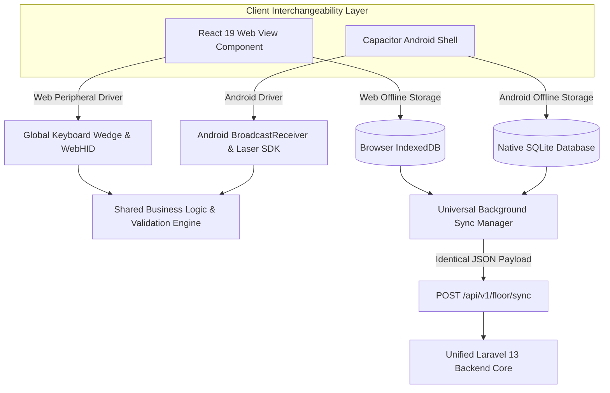

# Hybrid Dual-Mode Data Capture Architecture (Web + APK Interoperability)
## Architectural Blueprint for Zero-Downtime Factory Floor Data Ingestion
**ডকুমেন্ট রেফারেন্স:** `TFRMG-ARCH-HYBRID-V2.0`  
**ডকুমেন্ট ভার্সন:** 2.0 (Tier-1 Enterprise Operational Resilience Specification)  
**স্ট্যান্ডার্ড কমপ্লায়েন্স:** ISO 22301 Business Continuity, Offline-First Edge Ingestion, Client-Agnostic REST Contracts  
**স্ট্যাটাস:** Approved & Production-Ready  
**টার্গেট প্ল্যাটফর্ম:** React 19 Web SPA (Desktop/Browser) + Capacitor/Android Kiosk APK (10.1" Tablet/PDA) + Laravel 13 Unified Backend  

---

## ১. নির্বাহী সারসংক্ষেপ ও ফিলোসফি (Executive Summary & Philosophy)

একটি বৃহৎ গার্মেন্টস ম্যানুফ্যাকচারিং প্ল্যান্টে প্রতিদিন ৫০,০০০ থেকে ২,০০,০০০ পিস পোশাকের ফিজিক্যাল মুভমেন্ট ট্র্যাক করা হয়। এই ধরনের হাই-ভলিউম ম্যানুফ্যাকচারিং অপারেশনে যদি ডেটা ক্যাপচার শুধুমাত্র একটি একক মাধ্যমের (যেমন: কেবল অ্যান্ড্রয়েড ট্যাবলেট অ্যাপ) ওপর নির্ভরশীল থাকে, তবে:
1. ট্যাবলেটের ব্যাটারি শেষ হলে বা ডিসপ্লে নষ্ট হলে পুরো সেলাই লাইনের কাজ বন্ধ হয়ে যাওয়ার ঝুঁকি থাকে।
2. কোনো কারখানার শুরুতে শত শত ট্যাবলেট কেনার পর্যাপ্ত মূলধনী বাজেট (CapEx) না থাকতে পারে।
3. প্যাকিং ডক বা কাটিং স্টেশনের মতো জায়গায় যেখানে অলরেডি বড় স্ক্রিনের ডেস্কটপ পিসি এবং থার্মাল প্রিন্টার রয়েছে, সেখানে জোর করে ট্যাবলেট চাপিয়ে দেওয়া অপ্রয়োজনীয় জটিলতা সৃষ্টি করে।

এই ঝুঁকিগুলো সম্পূর্ণ দূর করতে TraceFlow RMG সিস্টেমে **"Hybrid Dual-Mode Data Capture Architecture"** বাধ্যতামূলক করা হয়েছে:
> **"Every floor operation that can be executed via the dedicated Android Tablet APK MUST also be 100% executable natively via the Web Browser interface (and vice-versa), using an identical unified backend contract."**

ম্যানেজমেন্ট যেকোনো সময় কারখানার বাজেট, স্টেশনের ধরন এবং পরিস্থিতির ওপর ভিত্তি করে **Web Mode**, **APK Mode**, অথবা **উভয়ের যৌথ সহাবস্থান (Coexistence Mode)** বেছে নিতে পারবে।

```
┌────────────────────────────────────────────────────────────────────────────────────────────────────────┐
│                        HYBRID DUAL-MODE DATA CAPTURE ARCHITECTURE                                      │
├────────────────────────────────────────────────────────────────────────────────────────────────────────┤
│                                  UNIFIED LARAVEL 13 BACKEND CORE                                       │
│                                  (Single Source of Business Truth)                                     │
│  - Pure Server Validation (HTTP 422 JSON)        - High-Concurrency Redis Scan Queue (HTTP 202)       │
│  - Strict ACID Transaction Integrity             - WORM Audit Ledger & Hardware Device Tokens          │
├──────────────────────────────────────────────────┬─────────────────────────────────────────────────────┤
│                                                  │                                                     │
│                MODE A: WEB BROWSER               │                 MODE B: ANDROID APK                 │
│              (React 19 Desktop/Tablet)           │            (Capacitor / Android Kiosk APK)          │
├──────────────────────────────────────────────────┼─────────────────────────────────────────────────────┤
│ 🖥️ ডিভাইস: PC, Laptop, POS Terminal, Mac        │ 📱 ডিভাইস: 10.1" Android Tablet, Industrial Gun PDA │
│ 🌐 ব্রাউজার: Google Chrome, Microsoft Edge       │ 📦 রানটাইম: Standalone Android APK (.apk)           │
│ 🔌 স্ক্যানার: USB / Wireless HID Barcode Gun     │ 🔌 স্ক্যানার: Bluetooth Scanner / Laser Intent SDK  │
│ 💾 লোকাল ক্যাশ: Browser IndexedDB + ServiceWorker│ 💾 লোকাল ক্যাশ: Native Android SQLite Database      │
│ 🔄 সিঙ্ক মেকানিজম: Background Fetch API          │ 🔄 সিঙ্ক মেকানিজম: Android WorkManager Sync Service │
└──────────────────────────────────────────────────┴─────────────────────────────────────────────────────┘
```

---

## ২. তিন ধরণের ডিপ্লয়মেন্ট মডেল (3 Deployment Models for Factory Management)

কারখানা কর্তৃপক্ষ তাদের সুবিধা অনুযায়ী নিচের ৩টি মডেলের যেকোনো একটি পরিচালনা করতে পারবে:

### মডেল ১: Pure Web Mode (লো-ক্যাপেক্স স্টার্টআপ মডেল)
* **বর্ণনা:** ফ্লোরের কোনো স্টেশনে নতুন কোনো অ্যান্ড্রয়েড ট্যাবলেট কেনা হবে না।
* **সেটআপ:** কাটিং, সেলাই সুপারভাইজার টেবিল, কিউসি ডেস্ক এবং প্যাকিং ডকে থাকা সাধারণ ডেস্কটপ পিসি বা ল্যাপটপে ব্রাউজারে ফুল-স্ক্রিন স্টেশন পেজ (`/sewing/station/line-out`, `/qc/station/end-line`) ওপেন করা থাকবে এবং সাধারণ ইউএসবি বারকোড গান লাগানো থাকবে।
* **সুবিধা:** শূন্য অতিরিক্ত হার্ডওয়্যার খরচ। বিদ্যমান কম্পিউটার দিয়েই তাত্ক্ষণিক লাইভ গো-লাইভ সম্ভব।

### মডেল ২: Pure APK Mode (হাই-স্পিড মোবাইল কিওস্ক মডেল)
* **বর্ণনা:** কারখানার প্রতিটি উৎপাদন পয়েন্টে ওয়্যারলেস ১০.১" অ্যান্ড্রয়েড ট্যাবলেট মাউন্ট করা থাকবে।
* **সেটআপ:** ডেডিকেটেড TraceFlow Kiosk APK ইনস্টল থাকবে। ডিভাইস সম্পূর্ণ লকড (COSU - Corporate Owned Single Use), যাতে অপারেটর কোনোভাবেই অ্যাপ থেকে বের হতে না পারে।
* **সুবিধা:** সর্বোচ্চ পোর্টেবিলিটি, লেজার গান ব্লুটুথ সংযোগ, এবং ড্রপ-রেজিস্ট্যান্ট আর্মর প্রটেকশন।

### মডেল ৩: Dual / Coexistence Mode (শিল্পের গোল্ডেন স্ট্যান্ডার্ড — রিকমেন্ডেড)
* **বর্ণনা:** যে স্টেশনে যা মানানসই, সেখানে সেই মাধ্যম ব্যবহার করা:
  - **সেলাই লাইনের ইনপুট/আউটপুট:** অ্যান্ড্রয়েড ট্যাবলেট APK (যেহেতু মেশিনের পাশে জায়গা কম)।
  - **কাটিং মাস্টার ও স্প্রেডিং টেবিল:** বড় ডিসপ্লেযুক্ত ডেস্কটপ পিসি Web ভিউ (মার্কার লেআউট দেখার সুবিধার্থে)।
  - **প্যাকিং ও কন্টেইনার ডক:** ডেস্কটপ পিসি Web ভিউ (যেহেতু ভারী স্কেল ও ৪×৬ থার্মাল প্রিন্টার সংযুক্ত থাকে)।
  - **ইমার্জেন্সি ফেইলওভার:** সেলাই লাইনের ট্যাবলেট নষ্ট হলে তাৎক্ষণিকভাবে সুপারভাইজারের ল্যাপটপে Web ভিউ চালু করে ১ মিনিটের মধ্যে কাজ শুরু করা।

---

## ৩. প্রযুক্তিগত অভিন্নতা ও ক্লায়েন্ট-ইন্টারচেঞ্জেবিলিটি (Technical Interoperability)

সিস্টেমটি ওয়েব ব্রাউজার এবং অ্যান্ড্রয়েড অ্যাপের মধ্যে ১০০% সমতা (Functional Parity) নিশ্চিত করতে ৩টি লেয়ারে কাজ করবে:



### ৩.১ লেয়ার ১: ইউনিভার্সাল বারকোড স্ক্যানার ড্রাইভার (Universal Barcode Driver)
ফ্লোর অপারেটর যখন বারকোড গান দিয়ে স্ক্যান করবেন, সিস্টেম স্ক্রিনে কোনো ইনপুট কার্সর না থাকলেও স্বয়ংক্রিয়ভাবে স্ক্যান গ্রহণ করবে:

1. **Web Mode Implementation:**
   - ব্রাউজারের উইন্ডো লেভেলে গ্লোবাল কীবোর্ড লিসেনার যুক্ত থাকবে:
     ```typescript
     // hooks/useUniversalBarcodeScanner.ts
     useEffect(() => {
       let buffer = '';
       let lastKeyTime = Date.now();
       
       const handleKeyDown = (e: KeyboardEvent) => {
         const currentTime = Date.now();
         // Scanner sends rapid keystrokes (< 30ms apart)
         if (currentTime - lastKeyTime > 50) buffer = '';
         lastKeyTime = currentTime;

         if (e.key === 'Enter') {
           if (buffer.length >= 6) {
             processScannedCode(buffer.trim()); // Dispatches scan
           }
           buffer = '';
         } else if (e.key.length === 1) {
           buffer += e.key;
         }
       };

       window.addEventListener('keydown', handleKeyDown);
       return () => window.removeEventListener('keydown', handleKeyDown);
     }, []);
     ```
2. **APK Mode Implementation:**
   - অ্যান্ড্রয়েডের নেটিভ ব্রডকাস্ট ইনটেন্ট লিসেনার স্ক্যানার ট্রিগার থেকে ডাটা সরাসরি গ্রহণ করবে (Honeywell / Zebra SDK বা ব্লুটুথ SPP)।

---

### ৩.২ লেয়ার ২: ইউনিভার্সাল অফলাইন ডাটা স্টোরেজ ও ব্যাকগ্রাউন্ড সিঙ্ক (Offline Storage Adapter)

ফ্যাক্টরি ফ্লোরে ওয়াইফাই বিচ্ছিন্ন হলে ডাটা কখনোই লস্ট হবে না:

| ফিচার | Web Mode (Browser) | APK Mode (Android App) |
|---|---|---|
| **লোকাল স্টোরেজ ইঞ্জিন** | **IndexedDB** (via Dexie.js / LocalForage) | **Native SQLite** (via Room / Capacitor SQLite) |
| **অফলাইন বাফারিং ক্ষমতা** | ৫০,০০০+ স্ক্যান রেকর্ড লোকাল ব্রাউজারে সংরক্ষিত | ১,০০,০০০+ স্ক্যান রেকর্ড সুরক্ষিত |
| **সিঙ্ক মেকানিজম** | Service Worker Background Sync API | Android WorkManager Background Service |
| **কানেক্টিভিটি লিসেনার** | `window.addEventListener('online')` | Android `ConnectivityManager` Broadcast |

---

### ৩.৩ লেয়ার ৩: ক্লায়েন্ট-অ্যাগনস্টিক একীভূত ব্যাকএন্ড এপিআই (Client-Agnostic Backend Contract)

আমাদের Laravel 13 ব্যাকএন্ডের এপিআই রিকোয়েস্টের সোর্স নিয়ে সম্পূর্ণ নিরপেক্ষ থাকবে। 
- **হেডার:** `Authorization: Bearer <station_edge_token>`
- **রিকোয়েস্ট বডি:** ওয়েব এবং অ্যাপ উভয়ের জন্য হুবহু একই JSON স্ট্রাকচার:
  ```json
  {
    "client_type": "WEB_BROWSER", // or "ANDROID_APK"
    "client_version": "v2.0.4",
    "station_code": "STN-SEW-LINE04-OUT",
    "scans": [
      {
        "single_piece_qr": "a98df23e-6b12-4211-9a7c-87d46c0e5a99",
        "scanned_at_physical_device": "2026-09-02T18:42:10.124Z",
        "offline_queued": true
      }
    ]
  }
  ```

---

## ৪. ফ্লোর স্টেশনসমূহের ডুয়াল-মোড সাপোর্ট ম্যাট্রিক্স (Full Functional Parity)

নিচের সমস্ত ফ্লোর স্টেশন ওয়েব ব্রাউজার এবং অ্যান্ড্রয়েড অ্যাপ—উভয় মাধ্যমেই ১০০% কার্যকর থাকবে:

| ফ্লোর অপারেশন (Floor Operation) | Web Mode রুট (PC / Laptop) | APK Mode স্ক্রিন (Tablet Kiosk) | ইনপুট পেরিফেরাল সাপোর্ট |
|---|---|---|---|
| **কাটিং বান্ডল টিকিট প্রিন্ট ও অডিট** | `/cutting/station/bundles` | `CuttingStationBundleView` | USB/Network Zebra ZPL থার্মাল প্রিন্টার |
| **সেলাই লাইন-ইন বান্ডল ফিডিং** | `/sewing/station/line-in` | `SewingLineInKioskView` | USB HID / Bluetooth 2D লেজার স্ক্যানার |
| **সেলাই লাইন-আউট সিঙ্গেল-পিস** | `/sewing/station/line-out` | `SewingLineOutKioskView` | USB HID / Bluetooth 2D লেজার স্ক্যানার |
| **১০০% এন্ড-লাইন কিউসি ও সিলুয়েট পিন**| `/qc/station/end-line` | `QCEndLineTabletView` | মাউস ক্লিক / টাচ স্ক্রিন পিনিং + স্ক্যানার |
| **ওয়াশিং প্ল্যান্ট ব্যাচ ট্র্যাকিং** | `/washing/station/batches` | `WashingKioskView` | টাচস্ক্রিন টার্মিনাল / লেজার স্ক্যানার |
| **ফিনিশিং মেটাল ডিটেক্টর লগ** | `/finishing/station/metal` | `FinishingMetalKioskView`| সিরিয়াল পোর্ট / ইউএসবি স্ক্যানার |
| **কার্টন প্যাকিং ও ডিজিটাল স্কেল** | `/packing/station/carton-pack` | `PackingStationKioskView` | RS232/USB ডিজিটাল স্কেল + বারকোড গান |

---

## ৫. ইমার্জেন্সি ফেইলওভার প্রোটোকল (Instant Disaster Recovery SOP)

কারখানায় উৎপাদন চলার সময় কোনো জরুরি বিঘ্ন ঘটলে ফেইলওভার প্রোটোকল নিম্নরূপ:

```
[ঘটনা: সেলাই লাইন-০৪ এর অ্যান্ড্রয়েড ট্যাবলেট ক্ষতিগ্রস্ত বা ব্যাটারি শূন্য হলো]
                              │
                              ▼
[ধাপ ১: লাইন সুপারভাইজার লাইনের শেষ মাথায় থাকা সাধারণ ল্যাপটপ/পিসি চালু করবেন]
                              │
                              ▼
[ধাপ ২: ক্রোম ব্রাউজারে বুকমার্ক করা URL ওপেন করবেন: https://erp.factory.local/sewing/station/line-out]
                              │
                              ▼
[ধাপ ৩: ল্যাপটপের ইউএসবি পোর্টে সাধারণ বারকোড গানটি প্লাগ ইন করবেন]
                              │
                              ▼
[ধাপ ৪: স্টেশন পিন কোড ইনপুট দিয়ে ৫ সেকেন্ডে সেশন অথেনটিকেট করবেন]
                              │
                              ▼
[ফলাফল: ১ মিনিটেরও কম সময়ে স্ক্যানিং পুনরায় শুরু! কারখানার প্রোডাকশন শূন্য সেকেন্ড ব্যাহত!]
```

---

## ৬. কিউএ ভেরিফিকেশন ও টেস্ট কেস (QA Acceptance Criteria)

1. **`TC-HYB-001` (Web Browser HID Scanner Verification):**
   - সাধারণ ডেল বা এইচপি পিসিতে ক্রোম ব্রাউজারে `/sewing/station/line-out` খুলে স্ক্রিনের বাইরে মাউস ক্লিক করে রাখা। এরপর ইউএসবি লেজার গান দিয়ে ১০০টি চাইল্ড কিউআর দ্রুত স্ক্যান করা।
   - **প্রত্যাশিত ফলাফল:** ১০০টি স্ক্যানই নির্ভুলভাবে সিস্টেমে রেকর্ড হবে এবং প্রতি স্ক্যানে স্ক্রিনে গ্রিন ফ্ল্যাশ ও সাউন্ড বাজবে।
2. **`TC-HYB-002` (Web IndexedDB Offline Resiliency Test):**
   - পিসির ল্যান কেবল খুলে বা ওয়াইফাই বন্ধ করে ব্রাউজারে ৫০টি পোশাক স্ক্যান করা।
   - **প্রত্যাশিত ফলাফল:** ব্রাউজার এরর দেবে না; `IndexedDB`-তে ৫০টি স্ক্যান জমা রাখবে। ইন্টারনেট সংযুক্ত হওয়ার সাথে সাথে স্বয়ংক্রিয়ভাবে ব্যাকএন্ডে সিঙ্ক হবে।
3. **`TC-HYB-003` (Simultaneous Coexistence Concurrency Test):**
   - একই সেলাই লাইনের শুরুতে ল্যাপটপ (Web Mode) দিয়ে লাইন-ইন করা এবং লাইনের শেষে অ্যান্ড্রয়েড ট্যাবলেট (APK Mode) দিয়ে লাইন-আউট করা।
   - **প্রত্যাশিত ফলাফল:** ব্যাকএন্ড কোনো অসঙ্গতি ছাড়াই ডাটা সিঙ্ক করবে এবং ম্যানেজমেন্ট ড্যাশবোর্ডে লাইভ লাইন ব্যালেন্স নির্ভুলভাবে আপডেট হবে।

---

*(ডকুমেন্ট সমাপ্ত — Hybrid Dual-Mode Data Capture Architecture Specification)*
