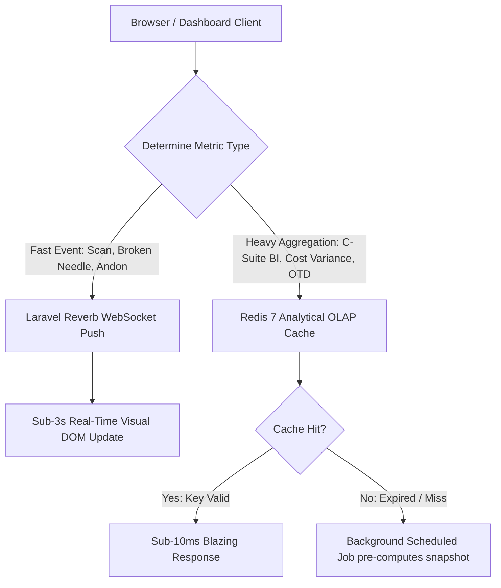

# Enterprise Dashboards Master Architecture & Widget Specification
## TraceFlow RMG — 7 Core Dashboards + Live Floor Andon TV Engine
**ডকুমেন্ট রেফারেন্স:** `TFRMG-DASH-SPEC-V2.0`  
**ডকুমেন্ট ভার্সন:** 2.0 (Global Tier-1 Enterprise Edition — Multi-Persona Operational Intelligence)  
**টার্গেট আর্কিটেকচার:** React 19 + TypeScript + TailwindCSS (Midnight & Crisp Flat Theme) + Laravel 13 Reverb (WebSockets) + Redis 7 OLAP  
**স্ট্যান্ডার্ড কমপ্লায়েন্স:** ISO 9001:2015 Quality Metrics, WCO Customs Tracking, Zero Modals Strict Directive  
**স্ট্যাটাস:** Approved & Production-Ready  

---

## ১. ভূমিকা ও ড্যাশবোর্ড ফিলোসফি (Executive Overview & Philosophy)

একটি আধুনিক টিয়ার-১ আরএমজি (RMG) এন্টারপ্রাইজ সফটওয়্যারে ড্যাশবোর্ড কেবল কিছু রং-বেরঙের চার্টের সমষ্টি নয়; এটি হলো **একটি রিয়েল-টাইম ডিসিশন মেকিং ইঞ্জিন (Real-Time Decision Engine)**।

একটি একক ড্যাশবোর্ড তৈরি করলে সিইও-র কাছে ফ্লোর ট্যাবলেটের ব্যাটারি ডাটা অপ্রয়োজনীয় হবে, আবার ফ্লোর সুপারের কাছে এলসি নেগোসিয়েশন ডাটা বিভ্রান্তি তৈরি করবে। অন্যদিকে ১৫টি মডিউলের জন্য ১৫টি আলাদা ড্যাশবোর্ড তৈরি করলে ব্যবহারকারীরা ওভারওয়েল্মড হয়ে পড়বেন।

অতএব, TraceFlow RMG প্ল্যাটফর্মে কারখানার পারসোনা ও কাজের ক্ষেত্র অনুযায়ী **সর্বমোট ৭টি কোর রোল-ভিত্তিক ড্যাশবোর্ড + ১টি ডেডিকেটেড ফ্লোর টিভি অ্যান্ডন ডিসপ্লে** চূড়ান্ত রূপ দেওয়া হয়েছে:

```
┌────────────────────────────────────────────────────────────────────────────────────────────────────────┐
│                        TRACEFLOW RMG - 7 CORE DASHBOARDS + 1 ANDON TV DISPLAY                          │
├────────────────────────────────┬────────────────────────────────────────┬──────────────────────────────┤
│ ড্যাশবোর্ড                       │ প্রধান ব্যবহারকারী (Persona)           │ ডেডিকেটেড ইউআরএল রুট          │
├────────────────────────────────┼────────────────────────────────────────┼──────────────────────────────┤
│ 👑 1. Platform Owner Command   │ Platform Owner, Super Admin, Group CTO │ /admin/platform-overview     │
│ 📊 2. Executive C-Suite        │ Managing Director, CEO, Chairman       │ /commercial/bi/dashboard     │
│ ⚙️ 3. Plant Operations & PPC   │ Factory GM, Planning & IE Managers     │ /planning/dashboard          │
│ 🔍 4. Quality & Defect Intel   │ Head of QA, Buyer Quality Auditors     │ /qc/dhu-board                │
│ 📦 5. Supply Chain & Warehouse │ Fabric Store Head, Trims In-Charge     │ /warehouse/dashboard         │
│ 🚢 6. Commercial & Logistics   │ CFO, Commercial & Shipping Head        │ /commercial/dashboard        │
│ 💻 7. IT Health & Tablet Fleet │ IT Systems Admin, Network Engineers    │ /admin/devices               │
│ ────────────────────────────── │ ────────────────────────────────────── │ ──────────────────────────── │
│ 📺 +1. Live Floor Andon TV     │ Factory Floor Workers, Supervisors     │ /sewing/andon-display        │
└────────────────────────────────┴────────────────────────────────────────┴──────────────────────────────┘
```

---

## ২. অলঙ্ঘনীয় স্থাপত্য ও ইউআই নিয়মাবলি (Non-Negotiable Dashboard Rules)

1. **নো মোডালস ড্রিলডাউন (STRICT No Modals on Card Click):**
   - ড্যাশবোর্ডের কোনো কার্ড, গ্রাফের বার বা অ্যালার্ট আইটেমে ক্লিক করলে কোনো পপআপ বা মোডাল ওপেন হবে না।
   - ক্লিক করার সাথে সাথে ব্রাউজার পূর্ণাঙ্গ ফুল-স্ক্রিন ইনভেস্টিগেশন পেজে রিডাইরেক্ট হবে এবং স্ট্যান্ডার্ড ব্রেডক্রাম্ব (`Dashboard > Line-04 Starvation Analysis`) দিয়ে ব্যাক নেভিগেশন নিশ্চিত করবে।
2. **ফ্ল্যাট সলিড কালার টোকেনস (Zero Gradients):**
   - কোনো উইজেট, কার্ড, ব্যাজ বা বাটনে কোনো গ্রেডিয়েন্ট ব্যবহার করা যাবে না।
   - সমস্ত স্ট্যাটাস ক্রিস্প সলিড কালারে রেন্ডার হবে:
     - **Success / On-Track:** সলিড গ্রিন (`#16A34A` / `bg-emerald-600`)
     - **Warning / At-Risk:** সলিড অ্যাম্বার (`#D97706` / `bg-amber-600`)
     - **Critical / Danger:** সলিড রেড (`#DC2626` / `bg-rose-600`)
     - **Neutral / Informational:** সলিড ব্লু (`#2563EB` / `bg-blue-600`)
3. **টপবার ও সাইডবার সিঙ্ক্রোনাইজেশন:**
   - ড্যাশবোর্ড ভিউতে টপবারে সংশ্লিষ্ট প্রধান মডিউল এক্টিভ থাকবে এবং সাইডবার স্বয়ংক্রিয়ভাবে তার ২-লেভেল মেনু প্রদর্শন করবে (ফ্লোর অ্যান্ডন টিভি ব্যতীত, যা ১০০% মেনুমুক্ত ফুল-স্ক্রিন কিওস্ক)।

---

## ৩. ৭টি কোর ড্যাশবোর্ডের পুঙ্খানুপুঙ্খ উইজেট অ্যানাটমি (Detailed Dashboard Specifications)

---

### ৩.১ ড্যাশবোর্ড ১: Platform Owner & Super Admin Command Center
* **টার্গেট ইউজার:** Platform Owner, Super Admin, Group CTO.
* **রুট:** `/admin/platform-overview`
* **উদ্দেশ্য:** সম্পূর্ণ ইকোসিস্টেমের নিরাপত্তা, ইনফ্রাস্ট্রাকচার, লাইসেন্সিং, ডাটাবেস অখণ্ডতা এবং টু-টিয়ার ডিলিশন রিভিউ।
* **রিফ্রেশ রেট:** প্রতি ৩০ সেকেন্ডে ক্যাশ আপডেট; সিকিউরিটি অ্যালার্টে লাইভ পুশ।

```
┌────────────────────────────────────────────────────────────────────────────────────────────────────────┐
│ 🛡️ SUPER ADMIN COMMAND CENTER                                                        [Tenant: Global] │
├────────────────────────────┬────────────────────────────┬────────────────────────────┬─────────────────┤
│ Active Plant Units: 3/3    │ Live Users Online: 482     │ Redis Queue TPS: 840/sec   │ DB Lag: 12ms    │
├────────────────────────────┴────────────────────────────┴────────────────────────────┴─────────────────┤
│ [WIDGET 1: Multi-Plant Live Telemetry Matrix]                                                          │
│ Unit-01 (Woven Plant): Operational | 24 Lines Running | 340 Tablets Active                             │
│ Unit-02 (Denim Plant): Operational | 18 Lines Running | 210 Tablets Active                             │
│ Unit-03 (Washing Plant): Operational | 8 Machines Active | 45 Handhelds                                │
├─────────────────────────────────────────────────────────┬──────────────────────────────────────────────┤
│ [WIDGET 2: Global Module Feature Toggles (15 Engines)]  │ [WIDGET 3: Two-Tier Purge Gateway 🗑️]        │
│ [X] Mod 06 Printing Engine: ENABLED                     │ 14 Items Soft-Deleted in last 24h            │
│ [X] Mod 07 Embroidery Engine: ENABLED                   │ - 2 Draft Invoices (Eligible for Purge)      │
│ [X] Mod 08 Subcontract Engine: ENABLED                  │ - 12 Finished Cartons (Blocked: 409 Conflict)│
│ [X] Mod 11 Industrial Washing: ENABLED                  │ [Review & Force-Delete Console Button]       │
├─────────────────────────────────────────────────────────┼──────────────────────────────────────────────┤
│ [WIDGET 4: Threat Defense & WORM Vault Health]          │ [WIDGET 5: Cloud S3 Storage Breakdown]       │
│ - Brute-force Lockouts: 0 IP Blocked                    │ Total Storage: 2.84 TB                       │
│ - WORM Immutability Vault: 100% Cryptographically Sealed│ - Tech Pack CAD & PDFs: 1.1 TB               │
│ - Failed Admin Logins: 1 attempt (IP: 192.168.1.104)   │ - QC Defect Images: 1.4 TB                   │
└─────────────────────────────────────────────────────────┴──────────────────────────────────────────────┘
```

---

### ৩.২ ড্যাশবোর্ড ২: Executive C-Suite Strategy Dashboard
* **টার্গেট ইউজার:** Managing Director (MD), CEO, Chairman, Board of Directors.
* **রুট:** `/commercial/bi/dashboard`
* **উদ্দেশ্য:** লাভ-লোকসানের পোস্ট-মর্টেম, অন-টাইম ডেলিভারি (OTD) এবং কারখানার আন্তর্জাতিক সক্ষমতা বিশ্লেষণ।
* **রিফ্রেশ রেট:** সাব-১০ms Redis OLAP ক্যাশ (প্রতি ৫ মিনিটে প্রি-কম্পিউটেড স্ন্যাপশট)।

```
┌────────────────────────────────────────────────────────────────────────────────────────────────────────┐
│ 📊 C-SUITE STRATEGY COMMAND CENTER                                                      [Plant: All]  │
├────────────────────────────┬────────────────────────────┬────────────────────────────┬─────────────────┤
│ On-Time Delivery: 98.4% 🟢 │ Factory Efficiency: 64.8%  │ Global DHU: 2.15% 🟢       │ Cut-to-Ship: 1.4%│
├────────────────────────────┴────────────────────────────┴────────────────────────────┴─────────────────┤
│ [WIDGET 1: Cost-Per-Garment BOM Variance Ledger (USD)]                                                 │
│ Style No     | Budgeted FOB | Actual Unit Cost | Margin Variance | Profit Delta %                      │
│ DNM-SLIM-01  | $11.20       | $10.85           | +$0.35          | +25.17% (High Profit) 🟢            │
│ TEE-CREW-04  | $4.50        | $4.62            | -$0.12          | -2.66%  (Fabric Loss) 🔴            │
├─────────────────────────────────────────────────────────┬──────────────────────────────────────────────┤
│ [WIDGET 2: Monthly Export Revenue Trend (Bar Chart)]    │ [WIDGET 3: Buyer Fulfillment Ratio (Donut)]  │
│ Jan: $2.4M | Feb: $2.8M | Mar: $3.1M (Current Run Rate) │ H&M: 42% | Zara: 31% | Levi's: 27%           │
└─────────────────────────────────────────────────────────┴──────────────────────────────────────────────┘
```

---

### ৩.৩ ড্যাশবোর্ড ৩: Plant Operations & PPC Master Dashboard
* **টার্গেট ইউজার:** Factory General Manager (GM), Production Head, Planning & IE Managers.
* **রুট:** `/planning/dashboard`
* **উদ্দেশ্য:** কাটিং ও সেলাইয়ের দৈনিক ভারসাম্য রক্ষা এবং লাইন বন্ধ হওয়া (Line Starvation) রোধ করা।
* **রিফ্রেশ রেট:** প্রতি ৬০ সেকেন্ডে অটো-পোলিং।

```
┌────────────────────────────────────────────────────────────────────────────────────────────────────────┐
│ ⚙️ PLANT OPERATIONS & PPC MASTER DASHBOARD                                             [Shift: Morning]│
├────────────────────────────┬────────────────────────────┬────────────────────────────┬─────────────────┤
│ Today Cut Target: 18,500   │ Today Cut Actual: 19,100 🟢│ Today Sew Target: 16,000   │ Today Sew: 15,400│
├────────────────────────────┴────────────────────────────┴────────────────────────────┴─────────────────┤
│ [WIDGET 1: Active Lines Status & Starvation Radar]                                                    │
│ Line 01 (Polo Shirt): 104% Target | WIP: 1,200 pcs (Balanced) 🟢                                      │
│ Line 02 (Cargo Pants): 98% Target | WIP: 950 pcs   (Balanced) 🟢                                      │
│ Line 04 (Denim Jacket): 82% Target| WIP: 120 pcs   🔴 CRITICAL WARNING: Line Starvation in 3 Hours!    │
├─────────────────────────────────────────────────────────┬──────────────────────────────────────────────┤
│ [WIDGET 2: Cutting Table Lay Schedule Matrix]           │ [WIDGET 3: Floor WIP Flow Stage Gauge]       │
│ Table 01: Style DNM-01 (Lay 42 of 60) - 70% Progress    │ Cut WIP: 8,400 | Embellish: 3,200            │
│ Table 02: Style TEE-04 (Spreading Complete) - Ready     │ Sew WIP: 14,500| Wash: 2,100 | Pack: 4,500   │
└─────────────────────────────────────────────────────────┴──────────────────────────────────────────────┘
```

---

### ৩.৪ ড্যাশবোর্ড ৪: Quality & Defect Intelligence Dashboard
* **টার্গেট ইউজার:** Head of QA, Quality Managers, Buyer Compliance Auditors.
* **রুট:** `/qc/dhu-board`
* **উদ্দেশ্য:** কাপড়ে সেলাইয়ের ত্রুটি শনাক্তকরণ, রিওয়ার্ক লুপ এবং ভোক্তা নিরাপত্তা অডিট।
* **রিফ্রেশ রেট:** প্রতি ৩ সেকেন্ডে WebSocket লাইভ আপডেট।

```
┌────────────────────────────────────────────────────────────────────────────────────────────────────────┐
│ 🔍 QUALITY & DEFECT INTELLIGENCE DASHBOARD                                              [Live WebSocket]│
├────────────────────────────┬────────────────────────────┬────────────────────────────┬─────────────────┤
│ Factory DHU: 2.3% 🟢       │ Inspected Pcs: 8,450       │ Alter Pcs: 194 (2.2%)      │ Rejects: 12 (0.1%)│
├────────────────────────────┴────────────────────────────┴────────────────────────────┴─────────────────┤
│ [WIDGET 1: Live Traffic Light DHU Tracker by Sewing Line]                                             │
│ Line 01: DHU 1.8% 🟢 | Line 02: DHU 2.1% 🟢 | Line 03: DHU 3.4% 🟡 (Warning) | Line 05: DHU 5.8% 🔴    │
├─────────────────────────────────────────────────────────┬──────────────────────────────────────────────┤
│ [WIDGET 2: Top 5 Chronic Defects (Pareto Chart)]        │ [WIDGET 3: Broken Needle Quarantine Counter] │
│ 1. Broken Stitch (42%) | 2. Skip Stitch (24%)           │ 🧲 Active Quarantined Garments: [ 1 ] 🔴     │
│ 3. Open Seam (18%)    | 4. Oil Stain (11%)              │ Ticket: NDL-2026-0082 (Conveyor 01)          │
│ 5. Uneven Hem (5%)                                      │ Status: Handheld Probe Search in Progress    │
└─────────────────────────────────────────────────────────┴──────────────────────────────────────────────┘
```

---

### ৩.৫ ড্যাশবোর্ড ৫: Supply Chain & Warehouse Dashboard
* **টার্গেট ইউজার:** Fabric Store Manager, Trims In-Charge, Sourcing Team.
* **রুট:** `/warehouse/dashboard`
* **উদ্দেশ্য:** কাঁচামাল আনলোডিং, ৪-পয়েন্ট কিউসি এবং ২৪-৪৮ ঘণ্টার রিল্যাক্সেশন টাইমার পর্যবেক্ষণ।
* **রিফ্রেশ রেট:** প্রতি ৩০ সেকেন্ডে রিফ্রেশ।

```
┌────────────────────────────────────────────────────────────────────────────────────────────────────────┐
│ 📦 SUPPLY CHAIN & RAW MATERIAL WAREHOUSE                                                 [Store: Main] │
├────────────────────────────┬────────────────────────────┬────────────────────────────┬─────────────────┤
│ Uninspected Rolls: 42 🟡   │ QC Passed Rolls: 318 🟢    │ In Relaxation: 18 Rolls ⏳ │ Trims Low Stock: 2│
├────────────────────────────┴────────────────────────────┴────────────────────────────┴─────────────────┤
│ [WIDGET 1: Relaxation Chamber Live Countdown Matrix]                                                   │
│ Roll Barcode | Fabric Type | Chamber Rack | Time Remaining | Status                                    │
│ ROL-00421    | Spandex Den | RACK-04      | 04h : 18m : 22s| Relaxing (Locked for Cutting) ⏳          │
│ ROL-00422    | Spandex Den | RACK-05      | 00h : 00m : 00s| CLEARED (Ready for Cutting) 🟢           │
├─────────────────────────────────────────────────────────┬──────────────────────────────────────────────┤
│ [WIDGET 2: ASTM D5430 4-Point Roll Pass/Reject Ratio]   │ [WIDGET 3: Critical Trims Shortage Alert]    │
│ Passed: 94.2% (Points <= 28) | Debit Notes Issued: 4    │ 🔘 Button BTN-04: Balance 120 pcs (Req: 800) 🔴│
└─────────────────────────────────────────────────────────┴──────────────────────────────────────────────┘
```

---

### ৩.৬ ড্যাশবোর্ড ৬: Commercial Export & Logistics Dashboard
* **টার্গেট ইউজার:** Chief Financial Officer (CFO), Commercial Manager, Shipping Forwarding Head.
* **রুট:** `/commercial/dashboard`
* **উদ্দেশ্য:** কন্টেইনার স্টাফিং, এক্স-ফ্যাক্টরি ডেডলাইন এবং বাংলাদেশ ব্যাংক EXP ট্র্যাকিং।
* **রিফ্রেশ রেট:** প্রতি ২ মিনিটে রিফ্রেশ।

```
┌────────────────────────────────────────────────────────────────────────────────────────────────────────┐
│ 🚢 COMMERCIAL EXPORT & FREIGHT COMMAND                                                  [Port: CTG]   │
├────────────────────────────┬────────────────────────────┬────────────────────────────┬─────────────────┤
│ Upcoming Shipments: 6      │ Cartons Stuffed: 4,820     │ Total CBM: 142.50          │ EXP Issued: 100%│
├────────────────────────────┴────────────────────────────┴────────────────────────────┴─────────────────┤
│ [WIDGET 1: Ex-Factory Critical Milestones (Forward 15-Day Calendar)]                                   │
│ PO Number    | Buyer | Ex-Factory Date | Target Cartons | Sealed Cartons | Shipment Risk Status        │
│ PO-HNM-9901  | H&M   | 2026-09-08      | 1,200          | 1,180 (98%)    | On Schedule 🟢              │
│ PO-ZARA-4410 | Zara  | 2026-09-05      | 850            | 420 (49%)      | Delayed Risk! 🔴            │
├─────────────────────────────────────────────────────────┬──────────────────────────────────────────────┤
│ [WIDGET 2: IoT Scale Weight Anomaly Alerts]             │ [WIDGET 3: L/C Banking Realization Pipeline] │
│ Carton CTN-042: Weight -5.2% below spec (Missing Piece) │ Total Negotiated: $1.85M | In Transit: $2.4M│
└─────────────────────────────────────────────────────────┴──────────────────────────────────────────────┘
```

---

### ৩.৭ ড্যাশবোর্ড ৭: IT System Health & Tablet Fleet Dashboard
* **টার্গেট ইউজার:** IT Infrastructure Engineers, Network Administrators.
* **রুট:** `/admin/devices`
* **উদ্দেশ্য:** ফ্লোরের ২০০+ ট্যাবলেট ডিভাইসের অনলাইন স্টেটাস, স্ক্যান লেটেন্সি এবং রেডিজ কিউ ব্যালেন্সিং।
* **রিফ্রেশ রেট:** প্রতি ১০ সেকেন্ডে রিফ্রেশ।

```
┌────────────────────────────────────────────────────────────────────────────────────────────────────────┐
│ 💻 IT INFRASTRUCTURE & FLOOR FLEET MONITOR                                              [Network: OK]  │
├────────────────────────────┬────────────────────────────┬────────────────────────────┬─────────────────┤
│ Total Devices: 240         │ Online Tablets: 236 🟢     │ Offline Tablets: 4 🔴      │ Avg Latency: 14ms│
├────────────────────────────┴────────────────────────────┴────────────────────────────┴─────────────────┤
│ [WIDGET 1: Factory Floor Tablet Fleet Health Grid]                                                     │
│ Device Name     | Line Location   | Battery % | WiFi RSSI | Last Scan Received | Status               │
│ TAB-CUT-01      | Cutting Table 1 | 94% 🟢    | -52 dBm   | 2 seconds ago      | Active Online 🟢     │
│ TAB-SEW-08      | Sewing Line 04  | 18% 🔴    | -78 dBm   | 4 minutes ago      | LOW BATTERY ALERT ⚠️ │
├─────────────────────────────────────────────────────────┬──────────────────────────────────────────────┤
│ [WIDGET 2: Redis Horizon Scan Worker Queue]             │ [WIDGET 3: API Response Latency Histogram]   │
│ Scans Processed: 42,800/hr | Pending Queue: 0           │ 98.4% scans responded in < 20ms 🟢           │
└─────────────────────────────────────────────────────────┴──────────────────────────────────────────────┘
```

---

### ৩.৮ স্পেশালাইজড ডিসপ্লে: Live Sewing Floor Andon TV Display (TV Mode)
* **টার্গেট ডিসপ্লে:** ফ্যাক্টরি ফ্লোরের দেওয়ালে টাঙানো ৬৫ ইঞ্চি স্মার্ট টিভি (১০ ফুট দূর থেকে স্পষ্ট দৃশ্যমান)।
* **রুট:** `/sewing/andon-display`
* **উদ্দেশ্য:** সেলাই কর্মীদের ও লাইন সুপারভাইজারদের লক্ষ্যমাত্রা অর্জনের লাইভ উৎসাহ ও জরুরি লাল সংকেত প্রদান।
* **বিশেষত্ব:** এতে কোনো মেনু, সাইডবার বা ব্রাউজার স্ক্রলবার থাকবে না। এটি ১০০% হাই-কন্ট্রাস্ট ব্ল্যাক ব্যাকগ্রাউন্ডে বড় ফন্টে রেন্ডার হবে।

```
┌────────────────────────────────────────────────────────────────────────────────────────────────────────┐
│ 📺 SEWING FLOOR LIVE ANDON MONITOR   LINE: 04 (POLO SHIRT)                   TIME: 14:32:10 (HOUR 05)  │
├────────────────────────────────────────────────────────────────────────────────────────────────────────┤
│             TODAY TARGET: 800 PCS                   CURRENT ACTUAL: 724 PCS (90.5%)                   │
├────────────────────────────────────────────────────────────────────────────────────────────────────────┤
│   HOURLY TARGET: 100 PCS   │    CURRENT HOUR OUTPUT: 96 PCS    │    STATUS: ON-TRACK (GREEN 🟢)       │
├────────────────────────────────────────────────────────────────────────────────────────────────────────┤
│                                LINE STATUS: BALANCED & NORMAL                                          │
└────────────────────────────────────────────────────────────────────────────────────────────────────────┘
```

---

## ৪. রিয়েল-টাইম ডাটা স্ট্রিমিং বনাম রেডিজ ক্যাশিং স্ট্র্যাটেজি (Data Delivery Architecture)



| ডাটা টাইপ | রিফ্রেশ মেকানিজম | লেটেন্সি বাজেট | উদাহরণ |
|---|---|---|---|
| **ফ্লোর স্ক্যান ইভেন্ট** | WebSocket Push (Laravel Reverb) | $< 50\text{ms}$ | অ্যান্ডন টিভি কাউন্টার, এন্ড-লাইন পিস চেক |
| **সেফটি ও সিকিউরিটি অ্যালার্ট** | WebSocket Broadcast | $< 100\text{ms}$ | ব্রোকেন নিডেল কোয়ারেন্টাইন, মেটাল অ্যালার্ম |
| **প্ল্যান্ট অপারেশনস মেট্রিক্স** | Client Polling (SWR / TanStack Query) | $30\text{s} - 60\text{s}$ | লাইন ডব্লিউআইপি, কাটিং টেবিল শিডিউল |
| **সি-সুইট ও ফাইন্যান্সিয়াল বিআই** | Redis 7 OLAP Snapshot (`300s TTL`) | $< 10\text{ms}$ | Cost-Per-Garment Variance, OTD % |

---

## ৫. স্মার্ট রোল-বেসড অটো-রিডাইরেক্ট ইঞ্জিন (Role-Based Landing Engine)

ইউজার সফলভাবে অথেনটিকেট হওয়ার পর সিস্টেম স্বয়ংক্রিয়ভাবে তার সর্বোচ্চ রোল যাচাই করে কাঙ্ক্ষিত ড্যাশবোর্ডে রিডাইরেক্ট করবে:

```typescript
// services/dashboardRouter.ts
export const getRedirectDashboardPath = (roles: string[]): string => {
  if (roles.includes('Super Admin') || roles.includes('Platform Owner')) {
    return '/admin/platform-overview';
  }
  if (roles.includes('Executive') || roles.includes('Managing Director') || roles.includes('CEO')) {
    return '/commercial/bi/dashboard';
  }
  if (roles.includes('General Manager') || roles.includes('Planning Manager') || roles.includes('IE Manager')) {
    return '/planning/dashboard';
  }
  if (roles.includes('QA Head') || roles.includes('Quality Manager') || roles.includes('Buyer Auditor')) {
    return '/qc/dhu-board';
  }
  if (roles.includes('Fabric Store Manager') || roles.includes('Trims Incharge')) {
    return '/warehouse/dashboard';
  }
  if (roles.includes('CFO') || roles.includes('Commercial Manager')) {
    return '/commercial/dashboard';
  }
  if (roles.includes('IT Admin') || roles.includes('Network Engineer')) {
    return '/admin/devices';
  }
  if (roles.includes('Floor TV Device')) {
    return '/sewing/andon-display';
  }
  return '/orders'; // Fallback default route
};
```

---

## ৬. কিউএ ভেরিফিকেশন ও গ্রহণযোগ্যতার মানদণ্ড (Acceptance Criteria)

1. **`AC-DASH-01` (Super Admin Command Center Access):**
   - নন-সুপার এডমিন রোলধারী কোনো ইউজার `/admin/platform-overview` রুটে যাওয়ার চেষ্টা করলে সিস্টেম সাথে সাথে `403 Forbidden` রিটার্ন করবে।
2. **`AC-DASH-02` (Sub-10ms C-Suite Response):**
   - `/commercial/bi/dashboard` রেন্ডার হওয়ার সময় নেটওয়ার্ক ট্যাবে এনালাইটিক্যাল ডাটা ফেচ রেসপন্স সর্বোচ্চ **১০ মিলিসেকেন্ডের** মধ্যে সম্পূর্ণ হতে হবে (রেডিজ ক্যাশ নিশ্চিতকরণ)।
3. **`AC-DASH-03` (Broken Needle Instant Push):**
   - ফিনিশিং সেকশনে মেটাল ডিটেক্টরে কোনো পোশাক কোয়ারেন্টাইন হওয়া মাত্রই কোয়ালিটি ড্যাশবোর্ডের (`/qc/dhu-board`) নিডেল উইজেট স্বয়ংক্রিয়ভাবে পেজ রিফ্রেশ ছাড়াই লাল রঙে ফ্ল্যাশ করবে।
4. **`AC-DASH-04` (Zero Modals Compliance):**
   - ৭টি ড্যাশবোর্ডের যেকোনো উইজেটে ক্লিক করলে সংশ্লিষ্ট ফুল পেজ ওপেন হবে; পুরো সিস্টেমে কোনো মোডাল ডায়ালগ থাকবে না।

---

*(ডকুমেন্ট সমাপ্ত — Enterprise Dashboards Master Architecture & Widget Specification)*
