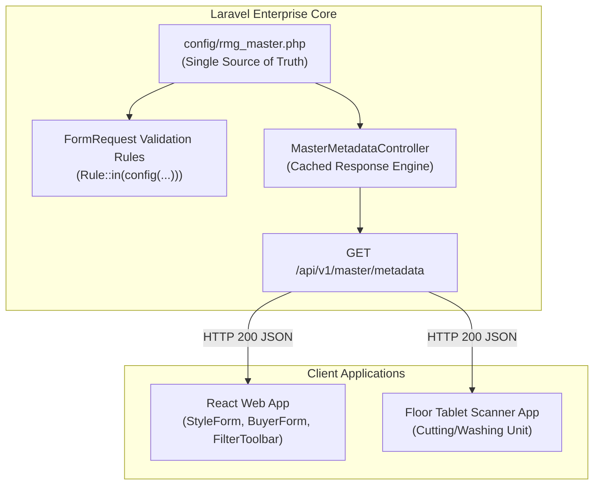

# Software Requirements Specification (SRS)
## সেন্ট্রালাইজড আরএমজি মাস্টার মেটাডাটা ও কনফিগারেশন ইঞ্জিন (Backend-Driven Master Metadata Architecture)

---

### ১. ভূমিকা ও প্রেক্ষাপট (Introduction & Background)

#### ১.১ উদ্দেশ্য (Purpose)
একটি বৃহৎ ওভেন গার্মেন্টস আরএমজি (RMG Woven Garments) এন্টারপ্রাইজ ট্রেসেবিলিটি সিস্টেমে পণ্যের ক্যাটাগরি, আইটেম, ওয়াশ টাইপ, ফেব্রিক কনস্ট্রাকশন, ফ্যাশন সিজন ও সাইজ স্কেলের মতো গুরুত্বপূর্ণ ডোমেইন প্যারামিটারগুলো বিচ্ছিন্নভাবে ফ্রন্টএন্ড ফাইলে হার্ডকোড করে রাখলে ডাটা অসামঞ্জস্যতা (Data Inconsistency) ও ভ্যালিডেশন মিসম্যাচ দেখা দেয়। 
এই এসআরএস (SRS) ডকুমেন্টের উদ্দেশ্য হলো এমন একটি **সেন্ট্রালাইজড ব্যাকএন্ড-ড্রাইভেন মেটাডাটা আর্কিটেকচার (Single Source of Truth)** প্রতিষ্ঠা করা, যা ফ্রন্টএন্ড ড্রপডাউন, পিওর সার্ভার-সাইড ভ্যালিডেশন এবং ফ্লোর-লেভেল ট্যাবলেট/মোবাইল অ্যাপের জন্য একক ও নির্ভরযোগ্য কনফিগারেশন সরবরাহ করবে।

#### ১.২ সুযোগ ও পরিধি (Scope)
- ব্যাকএন্ড কনফিগারেশন ফাইল: `backend/config/rmg_master.php`
- মেটাডাটা কন্ট্রোলার ও এন্ডপয়েন্ট: `GET /api/v1/master/metadata`
- পিওর সার্ভার-সাইড ভ্যালিডেশন রুলসের সাথে কনফিগারেশন ইন্টিগ্রেশন (`Rule::in(...)`)
- ফ্রন্টএন্ড সার্ভিস লেয়ারে ক্যাশড মেটাডাটা কনজিউমার (`frontend/src/services/masterMetadataService.ts`)
- জিরো-ক্লায়েন্ট রিবিল্ডে ড্রপডাউন ও সিলেকশন কন্ট্রোল আপডেট।

---

### ২. সিস্টেম আর্কিটেকচার ও প্রবাহ চিত্র (System Architecture & Data Flow)



---

### ৩. কনফিগারেশন ডাটা ডিকশনারি ও স্কিমা (Configuration Data Schema)

ব্যাকএন্ডের `config/rmg_master.php`-এ নিচের ডোমেইন প্যারামিটারগুলো কেন্দ্রীয়ভাবে সংরক্ষিত হবে:

| ডোমেইন ডিকশনারি কী | বিবরণ ও গ্রহণযোগ্য ভ্যালু (Acceptable Values) | ব্যবহারকারী মডিউল |
|---|---|---|
| `woven_categories` | `Woven Tops (Shirts/Blouses)`, `Woven Bottoms (Trousers/Chinos)`, `Denim & Jeans`, `Cargo & Utility Shorts`, `Outerwear / Woven Jackets` | Style Master, Tech Pack, Production |
| `garment_items` | `Casual Chino Pant`, `5-Pocket Denim Jeans`, `Cargo Utility Pant`, `Bermuda Shorts`, `Formal Dress Shirt`, `Casual Button-Down Shirt`, `Flannel Overshirt`, `Woven Blazer / Jacket` | Style Master, Marker Plan, Cutting |
| `fabric_constructions` | `100% Cotton Twill (240 GSM)`, `98% Cotton 2% Spandex Stretch Twill`, `100% Cotton Poplin (120 GSM)`, `100% Cotton Oxford Weave`, `100% Cotton Indigo Denim (12 oz)`, `99% Cotton 1% Elastane Denim`, `65% Polyester 35% Cotton (TC) Twill`, `100% Linen Plain Weave` | Style Master, Fabric Inspection, Cutting |
| `wash_types` | `None / Raw / Rinse`, `Enzyme Wash`, `Stone Enzyme Wash`, `Bleach Wash`, `Acid Wash`, `Tint & Distress`, `Resin 3D Crinkle` | Style Master, Washing Floor Tracking |
| `seasons.eu` | `Spring/Summer`, `Autumn/Winter`, `Pre-Fall`, `Holiday`, `All Seasons / Carry Over` | European Buyer Styles (H&M, Zara) |
| `seasons.us` | `Spring`, `Summer`, `Fall`, `Holiday`, `Resort / Cruise`, `Back to School`, `All Seasons / Carry Over` | American Buyer Styles (Target, Gap, Walmart) |
| `seasons.years` | `2025`, `2026`, `2027`, `2028`, `2029`, `2030` | Commercial Calendar |
| `size_scales` | - Men's Tops: `XS, S, M, L, XL, XXL, 3XL`<br>- Waist: `28, 30, 32, 34, 36, 38, 40`<br>- Waist x Inseam: `30x32, 32x32, 34x32, 36x32, 38x32` | Size Breakdown, Ratio Matrix, Cutting |
| `payment_terms` | `LC at Sight`, `Usance LC 30 Days`, `Usance LC 60 Days`, `Usance LC 90 Days`, `TT / Advance`, `Open Account (CAD)` | Buyer Commercial Profile, Order LC |

---

### ৪. ফাংশনাল রিকোয়ারমেন্টস (Functional Requirements)

#### FR-01: ব্যাকএন্ড সেন্ট্রাল মেটাডাটা এন্ডপয়েন্ট (Backend Metadata Endpoint)
- **এন্ডপয়েন্ট**: `GET /api/v1/master/metadata`
- **প্রটেকশন**: Sanctum Authenticated Session।
- **রেসপন্স ক্যাশিং**: মেটাডাটার আকার হালকা (সাধারণত < ৫ KB)। ব্যাকএন্ড মেমোরি/ট্যাগ ক্যাশে (Redis/File Cache) এটি ২৪ ঘণ্টার জন্য ক্যাশ রাখবে এবং কনফিগারেশন চেঞ্জে স্বয়ংক্রিয় ইনভ্যালিডেট হবে।

#### FR-02: পিওর সার্ভার-সাইড ভ্যালিডেশন ইন্টিগ্রেশন (Server-Side Validation Enforcement)
- স্টাইল স্টোর/আপডেট রিকোয়েস্টে (`StoreStyleRequest`, `UpdateStyleRequest`):
  ```php
  'wash_type' => ['required', 'string', Rule::in(config('rmg_master.wash_types'))],
  'product_category' => ['required', 'string'],
  'garment_item' => ['required', 'string'],
  'base_smv' => ['required', 'numeric', 'min:0.1', 'max:999.99'],
  ```
- ক্লায়েন্ট সাইড থেকে কোনো ইনভ্যালিড ওয়াশ টাইপ বা ড্রপডাউন ম্যানিপুলেশন পাঠানো হলে সরাসরি `422 Unprocessable Entity` JSON রিটার্ন করবে।

#### FR-03: ফ্রন্টএন্ড ক্যাশড মেটাডাটা কনজিউমার (Frontend Metadata Consumer)
- ফ্রন্টএন্ডে `masterMetadataService.ts` তৈরি করা হবে।
- প্রথমবার পেজ লোড হওয়ার সময় মেটাডাটা ব্যাকএন্ড থেকে ফেচ হবে এবং ব্রাউজারের ইন-মেমোরিতে সংরক্ষণ থাকবে।
- নেটওয়ার্ক বিচ্ছিন্ন বা অফলাইন মোডে সিস্টেম যাতে ক্র্যাশ না করে, সেজন্য একটি ডিফল্ট ফলব্যাক অবজেক্ট কোডে বজায় থাকবে।

---

### ৫. নন-ফাংশনাল ও পারফরম্যান্স রিকোয়ারমেন্টস (Non-Functional Requirements)

1. **পারফরম্যান্স ও লেটেন্সি (Performance)**:
   - মেটাডাটা এন্ডপয়েন্টের রেসপন্স টাইম ২০ মিলিসেকেন্ডের নিচে হতে হবে।
2. **জিরো ফ্রন্টএন্ড রি-ডিপ্লয়মেন্ট (Zero Frontend Re-deployment)**:
   - কোনো নতুন ওয়াশ টাইপ বা ফেব্রিক টাইপ ব্যাকএন্ড কনফিগে যুক্ত হলে ফ্রন্টএন্ড কোনো নতুন বিল্ড বা ডেপ্লয়মেন্ট ছাড়াই রিয়েল-টাইমে রিফ্রেশে সেই অপশনটি ড্রপডাউনে পেয়ে যাবে।
3. **অফলাইন-ফার্স্ট রেজিলিয়েন্স (Offline Resilience)**:
   - ফ্লোর-লেভেল ট্যাবলেট অ্যাপ যদি সাময়িক নেটওয়ার্ক সংযোগ হারায়, তবে পূর্বে ক্যাশ করা মেটাডাটা দিয়ে নির্বিঘ্নে ফর্ম ইনপুট চালু রাখবে।

---

### ৬. বাস্তবায়নের পর্যায় ও রোডম্যাপ (Implementation Phases)

| পর্যায় | টাস্ক ও ডেলিভারেবলস | সংশ্লিষ্ট উপাদান |
|---|---|---|
| **ধাপ ১: ব্যাকএন্ড কনফিগ** | `backend/config/rmg_master.php` তৈরি | Laravel Config Layer |
| **ধাপ ২: কন্ট্রোলার ও রাউট** | `MasterMetadataController.php` তৈরি ও `api/v1/master.php`-এ রাউট যুক্ত করা | Laravel Controller & Routes |
| **ধাপ ৩: ভ্যালিডেশন রিফ্যাক্টর** | `StoreStyleRequest.php` এবং সংশ্লিষ্ট Request ক্লাসে `Rule::in(...)` যুক্ত করা | Laravel FormRequest |
| **ধাপ ৪: ফ্রন্টএন্ড সার্ভিস** | `frontend/src/services/masterMetadataService.ts` তৈরি ও টাইপ ইন্টারফেস যুক্ত করা | React Services |
| **ধাপ ৫: পেজ ইন্টিগ্রেশন** | `StyleFormPage.tsx` এবং অন্যান্য ফর্মে হার্ডকোডেড অ্যারে সরিয়ে API মেটাডাটা বাইন্ড করা | React Features |

---

### ৭. অনুমোদন ও সাইন-অফ (Approval & Sign-Off)
- **প্রজেক্টের নাম**: RMG Woven Garments Traceability Software (TraceFlow RMG)
- **প্রস্তুতকারী**: Antigravity Solution Architect & Lead Engineer
- **পর্যালোচক ও প্রোডাক্ট ওনার**: Project Owner (User)
