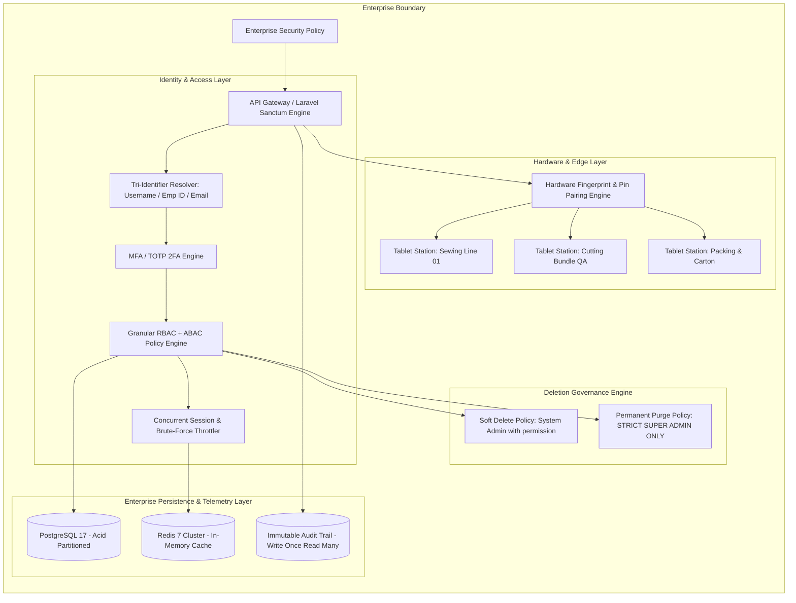
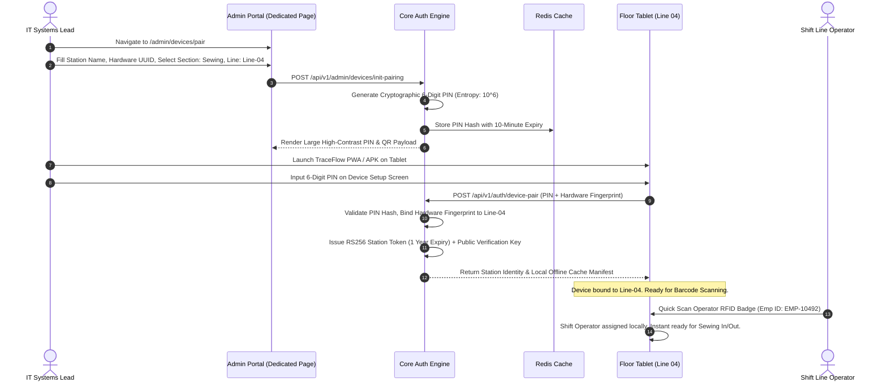
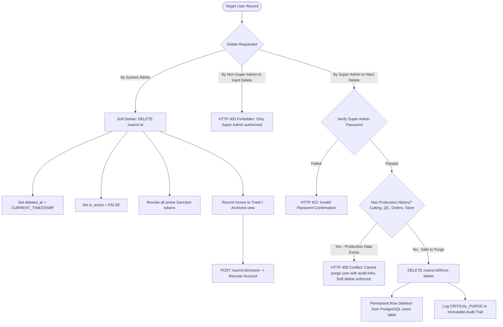
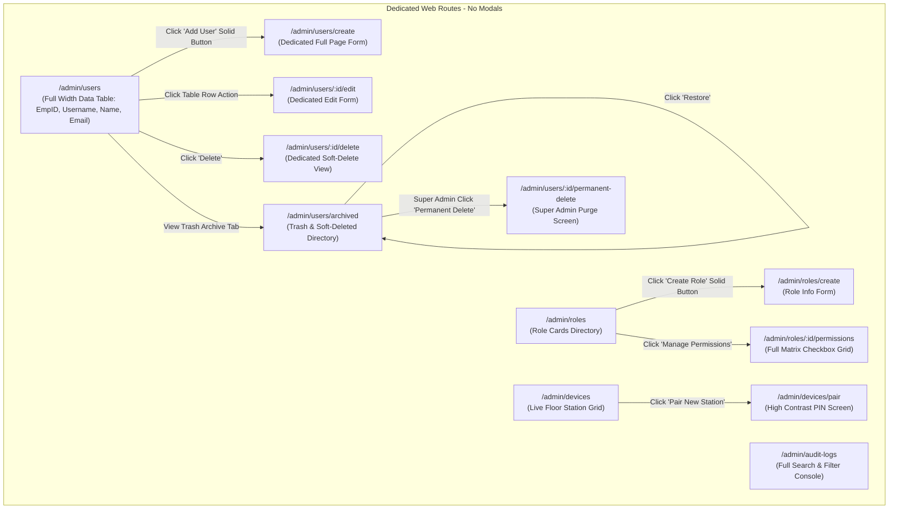
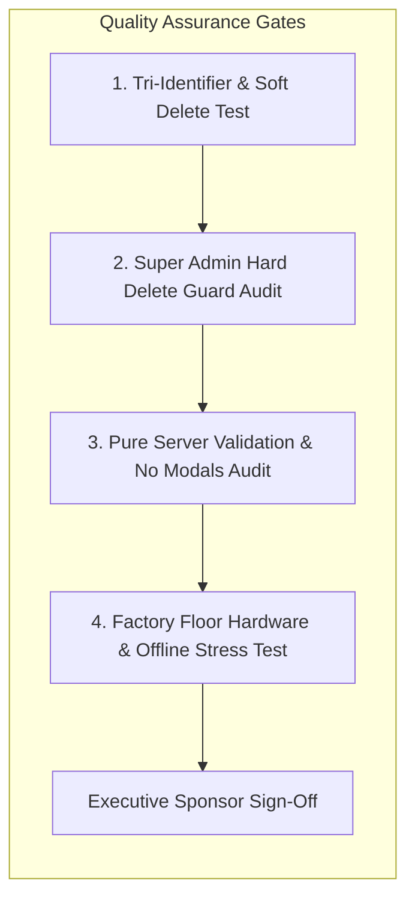

# Software Requirements Specification (SRS)
## Module 01: Enterprise System Administration, Authentication & RBAC Engine
### প্রজেক্ট: TraceFlow RMG — Precision Fabric-to-Freight Garment Intelligence
**ডকুমেন্ট রেফারেন্স:** `TFRMG-SRS-MOD01-V2.2`  
**ডকুমেন্ট ভার্সন:** 2.2 (Global Tier-1 Enterprise Production Edition)  
**স্ট্যান্ডার্ড কমপ্লায়েন্স:** ISO/IEC/IEEE 29148:2018, SOC 2 Type II, ISO 27001, OWASP API Security Top 10 (2023)  
**স্ট্যাটাস:** Approved & Production-Ready  
**টার্গেট আর্কিটেকচার:** Laravel 13 (API-First Engine) + React 19 / Vite (Clean Architecture SPA) + PostgreSQL 17 (Partitioned) + Redis 7 (Cluster)  

---

## ১. ডকুমেন্ট গভর্নেন্স ও সংস্করণ নিয়ন্ত্রণ (Document Governance & Control)

### ১.১ সংস্করণ ইতিহাস (Revision History)
| ভার্সন | তারিখ | পর্যালোচনাকারী | পরিবর্তনের বিবরণ ও পরিধি |
|---|---|---|---|
| `v1.0` | 2026-09-02 | Lead Systems Architect | প্রাথমিক ফাংশনাল স্পেসিফিকেশন ও কোর রিকোয়ারমেন্টস ড্রাফট। |
| `v2.0` | 2026-09-02 | Principal Enterprise Architect | 100% এন্টারপ্রাইজ রূপান্তর: SOC 2/ISO কমপ্লায়েন্স, TOTP 2FA, অফলাইন এজ টোকেন ভ্যালিডেশন, হার্ডওয়্যার টেলিমেট্রি, পার্টিশনড ইমিউটেবল অডিট ট্রেইল, কমপ্লিট PostgreSQL DDL এবং রিকোয়ারমেন্টস ট্রেসেবিলিটি ম্যাট্রিক্স (RTM) সংযোজন। |
| `v2.1` | 2026-09-02 | RMG Operations & CISO | আরএমজি ফ্যাক্টরি বাস্তবতার সাথে সামঞ্জস্য রেখে ইউজার আইডেন্টিটিতে `emp_id` (Employee ID) ও `username` বাধ্যতামূলক এবং `email` কে সম্পূর্ণ ঐচ্ছিক (Optional / Nullable) ঘোষণা। ট্রিপল আইডেন্টিফায়ার সাপোর্ট। |
| `v2.2` | 2026-09-02 | Enterprise Governance Lead | টু-টিয়ার ডিলিশন আর্কিটেকচার (Two-Tier Deletion Architecture): সফট ডিলিট (`deleted_at`), ট্র্যাশ/রিস্টোর লাইফসাইকেল এবং **পার্মানেন্ট হার্ড ডিলিট সম্পূর্ণভাবে Super Admin এর একক ক্ষমতায় সীমাবদ্ধকরণ** (`force-delete` policy, production referential integrity check, password re-auth)। |

### ১.২ অনুমোদনকারী ব্যক্তিবর্গ (Sign-Off & Approvals)
- **Product Owner / Project Sponsor:** Executive Sponsor, RMG Systems
- **Lead Solution Architect:** AI Solution Architect
- **Principal Security Officer (CISO):** Enterprise Security Specialist
- **Head of Factory Operations:** Garment Production & Industrial Engineering Division

---

## ২. নির্বাহী সারসংক্ষেপ ও কৌশলগত উদ্দেশ্য (Executive Summary & Strategic Scope)

### ২.১ কৌশলগত প্রেক্ষাপট (Strategic Context)
একটি বৃহৎ ওভেন গার্মেন্টস ম্যানুফ্যাকচারিং প্ল্যান্টে প্রতিদিন হাজার হাজার একক পিস (Single Garment Units) কাটিং টেবিল থেকে শুরু করে ফিউজিং, সুইং লাইন, এন্ড-লাইন QC, ওয়াশিং, ফিনিশিং এবং কার্টনিং পার হয়ে শিপমেন্ট ডকে যায়। এই সম্পূর্ণ লাইফসাইকেলে প্রতি সেকেন্ডে শত শত বারকোড স্ক্যান ইভেন্ট তৈরি হয়।
গার্মেন্টস ফ্যাক্টরির বাস্তবতায় ফ্লোর সুপারভাইজার, কাটিং মাস্টার বা লাইন চিফদের প্রাতিষ্ঠানিক ইমেইল অ্যাড্রেস থাকে না। তাদের মূল পরিচয় নির্ধারিত হয় ফ্যাক্টরির **Employee ID (`emp_id`)** এবং সিস্টেমে নির্ধারিত **Username** দিয়ে। অন্যদিকে হেড অফিস বা টপ ম্যানেজমেন্টের জন্য ইমেইল ব্যবহৃত হয়।
একই সাথে গার্মেন্টস কমপ্লায়েন্স ও ক্রেতা অডিটের (Buyer Audit / Accord / Alliance) জন্য কোনো প্রোডাকশন রেকর্ড হঠাৎ মুছে ফেলা যায় না। তাই সিস্টেমে **দ্বি-স্তরবিশিষ্ট ডিলিশন নীতি (Two-Tier Deletion Policy)** নিশ্চিত করা হয়েছে: সাধারণ অ্যাডমিনরা শুধুমাত্র **Soft Delete** করতে পারবেন, কিন্তু ডাটাবেস থেকে কোনো অ্যাকাউন্ট স্থায়ীভাবে মুছে ফেলার (Permanent / Hard Delete) অলঙ্ঘনীয় কর্তৃত্ব **কেবলমাত্র Super Admin এর থাকবে**।



---

## ৩. অলঙ্ঘনীয় এন্টারপ্রাইজ আর্কিটেকচারাল নিয়মাবলি (Non-Negotiable Architecture Directives)

প্রজেক্টের গ্লোবাল রুলস এবং এন্টারপ্রাইজ কোয়ালিটি নিশ্চিত করতে নিচের নিয়মগুলো ১০০% অলঙ্ঘনীয়:

### ৩.১ নো মোডালস নীতিমালা (STRICT No Modals / No Popups Rule)
- **জিরো মোডাল পলিসি:** পুরো অ্যাপ্লিকেশনে কোনো ফর্ম, কনফার্মেশন, এডিট প্যানেল বা সাব-স্ক্রিনের জন্য `Modal`, `Dialog`, `Popup`, `Lightbox`, বা `Drawer-over-backdrop` কঠোরভাবে নিষিদ্ধ।
- **ডেডিকেটেড রুট আর্কিটেকচার:** প্রতিটি ইন্টারঅ্যাকশন (ইউজার তৈরি, এডিট, পাসওয়ার্ড রিসেট, রোল তৈরি, পারমিশন ম্যাট্রিক্স, ট্যাবলেট পেয়ারিং, ডিভাইস স্ট্যাটাস, ডিলিট কনফার্মেশন) একটি সুনির্দিষ্ট ব্রাউজার ইউআরএল এবং ডেডিকেটেড ফুল-স্ক্রিন ভিউতে (Full-Screen Dedicated View) ওপেন হবে।
- **নেভিগেশন স্ট্যাক:** প্রতিটি পেজে স্ট্যান্ডার্ড ব্যাক বাটন এবং স্ট্রাকচার্ড ব্রেডক্রাম্ব (`Dashboard > Administration > Users > Create New User`) থাকতে হবে যাতে ব্রাউজারের নেটিভ Forward/Back বাটন স্বাভাবিকভাবে কাজ করে এবং ডিপ-লিংক শেয়ারিং সম্ভব হয়।

### ৩.২ পিউর সার্ভার-সাইড ভ্যালিডেশন স্ট্যান্ডার্ড (Pure Server-Side Validation)
- **জিরো ক্লায়েন্ট-সাইড HTML5 ভ্যালিডেশন:** ফ্রন্টএন্ডের কোনো `<form>` বা `<input>` ফিল্ডে ব্রাউজারের ডিফল্ট HTML5 ভ্যালিডেশন অ্যাট্রিবিউট (`required`, `minlength`, `maxlength`, `pattern`, ইত্যাদি) দেওয়া যাবে না। ব্রাউজারের বিল্ট-ইন টুলটিপ পপআপ সম্পূর্ণ নিষিদ্ধ।
- **বাধ্যতামূলক `noValidate`:** সমস্ত ফ্রন্টএন্ড ফর্মে `<form noValidate>` স্পষ্টভাবে যুক্ত থাকতে হবে।
- **একীভূত এরর কন্ট্রাক্ট:** সমস্ত ডাটা ভ্যালিডেশন ব্যাকএন্ড Laravel `FormRequest` ক্লাসের মাধ্যমে পিউর সার্ভার সাইডে ঘটবে। ইনপুট ভুল হলে সার্ভার থেকে `422 Unprocessable Content` স্ট্যান্ডার্ড RFC 7807 কমপ্লায়েন্ট JSON এরর পাঠানো হবে।
- **ইনলাইন এরর রেন্ডারিং:** ফ্রন্টএন্ড স্বয়ংক্রিয়ভাবে রেসপন্সের ফিল্ড নেম ম্যাপ করে সংশ্লিষ্ট ইনপুট বক্সের ঠিক নিচে ক্রিস্প লাল রঙে এরর বার্তা রেন্ডার করবে।

### ৩.৩ ফ্ল্যাট এবং ক্রিস্প ডিজাইন স্ট্যান্ডার্ড (Flat Solid UI Standard)
- **নো গ্রেডিয়েন্ট পলিসি:** কোনো বাটন, কার্ড, হেডার বা সাইডবারে কোনো ধরণের গ্রেডিয়েন্ট কালার ব্যবহার করা যাবে না।
- **সলিড ডিজাইন টোকেনস:** সকল অ্যাকশন বাটন ক্রিস্প ও ফ্ল্যাট সলিড রঙে গঠিত হবে (যেমন: Primary `#2563EB`, Danger `#DC2626`, Success `#16A34A`, Neutral `#475569`, Warning `#D97706`)।
- **১০০% ইংরেজি ইউআই:** ইউজার ইন্টারফেসের সমস্ত লেবেল, ফিল্ড নেম, কলাম হেডার, অ্যাকশন বাটন এবং সিস্টেম নোটিফিকেশন ১০০% প্রফেশনাল আন্তর্জাতিক ইংরেজি ভাষায় (English) হবে।

---

## ৪. ইউজার পারসোনা ও এক্সেস হায়ারার্কি (User Personas & Scoping)

| পারসোনা (Persona) | ইন্টারফেস ও ডিভাইস | প্রমাণীকরণ মাধ্যম (Auth Method) | প্রিভিলেজ বাউন্ডারি (Privilege Scope) |
|---|---|---|---|
| **Super Admin** | Web Browser (Desktop) | Username / Emp ID / Email + Password + TOTP 2FA | **সর্বোচ্চ সিস্টেম প্রিভিলেজ। একমাত্র পার্সোনা যিনি পার্মানেন্ট হার্ড ডিলিট (`force-delete`) করতে পারেন।** ওয়াইল্ডকার্ড বাইপাস ক্ষমতা। |
| **System / IT Admin** | Web Browser (Desktop) | Username / Emp ID / Email + Password + TOTP 2FA | ইউজার অনবোর্ডিং, রোল কনফিগারেশন, **সফট ডিলিট ও রিস্টোর** ক্ষমতা, ট্যাবলেট পেয়ারিং ও রিমোট ওয়াইপ। (পার্মানেন্ট ডিলিট সম্পূর্ণ নিষিদ্ধ)। |
| **Factory Department Head** | Web Browser (Desktop/Laptop) | Username / Emp ID / Email + Strong Password | নিজ ডিপার্টমেন্টাল মডিউলের অনুমোদন ও রিপোর্ট দেখার ক্ষমতা (e.g. Cutting Manager, IE Head)। |
| **Floor Supervisor / Chief**| Web / Floor Tablet | Username / Emp ID + Password | ফ্লোর লেভেল অপারেশন মনিটরিং, লাইন ব্যালেন্সিং ইনপুট ও শিফট সাইনঅফ। |
| **Production Floor Operator** | Android Tablet (Floor Station) | Hardware Bound + Station Token | কিবোর্ড ছাড়া ওয়ান-ক্লিক বারকোড/কিউআর স্ক্যান। কোনো সাধারণ পাসওয়ার্ড নেই। নির্দিষ্ট লাইনে লকড। |
| **Reliever / Shift Operator** | Android Tablet (Floor Station) | RFID / Barcode Badge Quick Scan (`emp_id`) | স্টেশনের লাইন আন-বাইন্ড না করে দ্রুত অপারেটর শিফট পরিবর্তনের জন্য সেকেন্ডারি ব্যাজ ট্যাগ। |
| **Automated System Daemon** | CLI / Background Job | Mutual TLS + Service API Secret | রেডিজ কিউ হ্যান্ডলার, ডেটা সিনক্রোনাইজেশন ক্রন জব এবং টেলিকম অ্যালার্ট ডিসপ্যাচার। |

---

## ৫. বিস্তারিত ফাংশনাল রিকোয়ারমেন্টস (Detailed Functional Specifications)

### ৫.১ সাব-মডিউল: এন্টারপ্রাইজ ক্রেডেনশিয়াল ও মাল্টি-ফ্যাক্টর অথেনটিকেশন (Identity & MFA)

#### ৫.১.১ স্পেসিফিকেশন ও বিজনেস লজিক
- **REQ-AUTH-001: ট্রিপল-আইডেন্টিফায়ার প্রমাণীকরণ ইঞ্জিন (Tri-Identifier Auth Engine):**
  - লগইন স্ক্রিনে একক ইনপুট ফিল্ড থাকবে: `Username / Employee ID / Email` (`login_identifier`)।
  - সিস্টেম স্বয়ংক্রিয়ভাবে ইনপুট রেজলভ করবে:
    1. যদি ইনপুটে `@` চিহ্ন থাকে, তবে এটি `users.email` ফিল্ডে লুকআপ করবে।
    2. অন্যথায় এটি সমান্তরালভাবে `users.emp_id` এবং `users.username` ফিল্ডে কেস-ইনসেনসিটিভ লুকআপ করবে।
  - যেসকল ফ্যাক্টরি কর্মীর ইমেইল নেই, তারা অনায়াসে তাদের অফিসিয়াল `emp_id` (e.g. `EMP-10492`) অথবা `username` (e.g. `cutting_master_01`) দিয়ে সিস্টেমে প্রবেশ করতে পারবেন।
- **REQ-AUTH-002: পাসওয়ার্ড পলিসি ইঞ্জিন (Enterprise Password Policy Engine):**
  - পাসওয়ার্ডের দৈর্ঘ্য সর্বনিম্ন ১২ ক্যারেক্টার হতে হবে।
  - অন্তত একটি বড় হাতের অক্ষর (A-Z), একটি ছোট হাতের অক্ষর (a-z), একটি সংখ্যা (0-9) এবং একটি স্পেশাল ক্যারেক্টার (`!@#$%^&*()_+-=`) বাধ্যতামূলক।
  - পাসওয়ার্ড হিস্ট্রি এনফোর্সমেন্ট: একজন ইউজার তার পূর্ববর্তী ৫টি পাসওয়ার্ড পুনরায় ব্যবহার করতে পারবেন না (`password_histories` টেবিল দ্বারা ট্র্যাকড)।
  - পাসওয়ার্ডের মেয়াদ: প্রতি ৯০ দিন পর পর পাসওয়ার্ড এক্সপায়ার হবে এবং ইউজারকে পাসওয়ার্ড পরিবর্তন ছাড়া অন্য কোনো কাজ করতে দেওয়া হবে না।
  - প্রাথমিক লগইন পলিসি: অ্যাডমিন কর্তৃক তৈরিকৃত নতুন ইউজারের ক্ষেত্রে প্রথম লগইনে বাধ্যতামূলক পাসওয়ার্ড পরিবর্তন করতে হবে (`must_change_password = true`)।
- **REQ-AUTH-003: Bcrypt হ্যাশিং মানদণ্ড:**
  - ডাটাবেসে কোনো অবস্থাতেই পাসওয়ার্ড সরাসরি বা টু-ওয়ে এনক্রিপশনে রাখা যাবে না। Bcrypt (Work factor: 12) অ্যালগরিদম বাধ্যতামূলক।
- **REQ-AUTH-004: টাইম-বেসড ওয়ান-টাইম পাসওয়ার্ড (TOTP MFA - RFC 6238):**
  - `Super Admin`, `System Admin`, এবং `Finance/Commercial Head` রোলের ক্ষেত্রে 2FA বাধ্যতামূলক।
  - Google Authenticator, Microsoft Authenticator বা যেকোনো স্ট্যান্ডার্ড RFC 6238 অ্যাপের সাথে সামঞ্জস্যপূর্ণ QR কোড এবং ৩২-ক্যারেক্টার বেস-৩২ সিক্রেট কি জেনারেট হবে।
  - অ্যাকাউন্ট রিকভারির জন্য ৮টি ক্রিপ্টোগ্রাফিকালি সুরক্ষিত ওয়ান-টাইম ইমার্জেন্সি ব্যাকআপ কোড প্রদান করা হবে।

---

### ৫.২ সাব-মডিউল: সেশন কনকারেন্সি ও ব্রুট-ফোর্স প্রতিরক্ষা (Session Concurrency & Security)

#### ৫.২.১ স্পেসিফিকেশন ও বিজনেস লজিক
- **REQ-SESS-001: অ্যাডাপটিভ ব্রুট-ফোর্স থ্রটলিং (Sliding Window Throttler):**
  - Redis স্লাইডিং উইন্ডো কাউন্টারের মাধ্যমে প্রতি আইপি এবং `login_identifier` এর বিপরীতে ব্যর্থ লগইন প্রচেষ্টা পর্যবেক্ষণ করা হবে।
  - পরপর ৫ বার ভুল পাসওয়ার্ড দিলে সংশ্লিষ্ট আইডেন্টিফায়ার ও আইপি ১৫ মিনিটের জন্য লক হয়ে যাবে এবং সিস্টেমে HTTP 429 রেসপন্স প্রদান করবে।
  - কোনো একক আইপি থেকে বিভিন্ন একাউন্টে ডিস্ট্রিবিউটেড অ্যাটাক হলে ওই আইপিকে গ্লোবাল ফায়ারওয়ালে ২৪ ঘণ্টার জন্য ব্ল্যাকলিস্ট করা হবে।
- **REQ-SESS-002: কনকারেন্ট সেশন নিয়ন্ত্রণ (Concurrent Session Control):**
  - এন্টারপ্রাইজ কনফিগারেশন অনুযায়ী একজন ইউজারের একই সময়ে সর্বোচ্চ ১টি অ্যাক্টিভ ওয়েব সেশন অনুমোদিত (`max_concurrent_sessions = 1`)।
  - নতুন কোনো ব্রাউজার বা ডিভাইসে লগইন করলে পূর্ববর্তী সেশনকে স্বয়ংক্রিয়ভাবে টার্মিনেট করা হবে ("Kick Previous Session" পলিসি) এবং অডিট লগে ইভেন্টটি রেকর্ড করা হবে।
- **REQ-SESS-003: আইডল সেশন টাইমআউট:**
  - ওয়েব ড্যাশবোর্ড সেশন একটানা ৩০ মিনিট নিষ্ক্রিয় থাকলে টোকেন নিষ্ক্রিয় হবে এবং ইউজারকে পুনরায় লগইন করতে হবে।

---

### ৫.৩ সাব-মডিউল: হাইব্রিড গ্র্যানুলার RBAC ও ABAC ইঞ্জিন (Authorization Engine)

#### ৫.৩.১ স্পেসিফিকেশন ও বিজনেস লজিক
- **REQ-RBAC-001: হাইব্রিড পারমিশন মডেল:**
  - সিস্টেমটি স্ট্যান্ডার্ড RBAC (Role-Based Access Control) এবং ABAC (Attribute-Based Access Control) এর সমন্বয়ে কাজ করবে।
  - **RBAC লেয়ার:** প্রতিটি রোলে অ্যাকশন পারমিশন থাকবে (যেমন: `cutting.bundle.split`, `order.po.approve`)।
  - **ABAC লেয়ার:** ইউজারের ফ্যাক্টরি ইউনিট (Unit 01, Unit 02) এবং ফ্লোর অ্যাসাইনমেন্ট অনুযায়ী ডাটা ফিল্টার হবে (যেমন: Unit 01 এর মার্চেন্ডাইজার Unit 02 এর অর্ডার মডিফাই করতে পারবে না)।
- **REQ-RBAC-002: ওয়াইল্ডকার্ড পারমিশন ও সুপার অ্যাডমিন ইমিউনিটি:**
  - `Super Admin` রোল সিস্টেমে `*` (All privileges) ওয়াইল্ডকার্ড পাবে। এটি হার্ডকোডেড কার্নেল গেট দিয়ে পরিচালিত হবে যাতে ডাটাবেস এরর হলেও সুপার অ্যাডমিন লকআউট না হয়।
  - `Super Admin` রোল মুছে ফেলা বা এর স্লাগ পরিবর্তন করা ডাটাবেস লেভেলে নিষিদ্ধ।
- **REQ-RBAC-003: রিয়েল-টাইম পারমিশন ক্যাশ ইনভ্যালিডেশন (Zero-Delay Permission Sync):**
  - ইউজারের পারমিশন ম্যাট্রিক্স দ্রুত কোয়েরির জন্য Redis হ্যাশ সেটে ক্যাশ থাকবে।
  - অ্যাডমিন যখনই কোনো রোলের পারমিশন পরিবর্তন করবেন, সিস্টেম সাথে সাথে পাব/সাব (Pub/Sub) ইভেন্ট ট্রিগার করে ওই রোলের সকল ইউজারের রেডিজ পারমিশন ক্যাশ ফ্লাশ করে দেবে। ফলে পেজ রিলোড ছাড়াই তাৎক্ষণিকভাবে নতুন প্রিভিলেজ কার্যকর হবে।
- **REQ-RBAC-004: ফ্রন্টএন্ড ডায়নামিক রেন্ডারিং ও ব্যাকএন্ড গেট এনফোর্সমেন্ট:**
  - ফ্রন্টএন্ড সাইডবার ও অ্যাকশন বাটনসমূহ ইউজারের পারমিশন অ্যারে (`user.permissions`) অনুযায়ী ডায়নামিকালি দৃশ্যমান বা অদৃশ্য হবে।
  - ব্যাকএন্ড কন্ট্রোলারের প্রতিটি মেথডে `$this->authorize('permission.slug')` নিশ্চিত করা হবে যাতে ক্লায়েন্ট-সাইড বাইপাস কোনোভাবেই সম্ভব না হয়।

---

### ৫.৪ সাব-মডিউল: ফ্লোর স্টেশন হার্ডওয়্যার পেয়ারিং ও অফলাইন রেজিলিয়েন্স (Hardware Station Pairing)



#### ৫.৪.১ স্পেসিফিকেশন ও বিজনেস লজিক
- **REQ-DEV-001: ওয়ান-টাইম পেয়ারিং পিন লাইফসাইকেল:**
  - অ্যাডমিন পোর্টালে ডেডিকেটেড পেয়ারিং পেজে (`/admin/devices/pair`) গিয়ে নতুন স্টেশনের তথ্য সাবমিট করলে ব্যাকএন্ড একটি নন-প্রেডিক্টেবল ৬-ডিজিট ক্রিপ্টোগ্রাফিক পিন জেনারেট করবে।
  - পিনের মেয়াদ থাকবে সর্বোচ্চ ১০ মিনিট। একবার সফল পেয়ারিং সম্পন্ন হলে অথবা ১০ মিনিট অতিক্রান্ত হলে পিনটি তাৎক্ষণিকভাবে ডিলিট হয়ে যাবে।
- **REQ-DEV-002: হার্ডওয়্যার ফিঙ্গারপ্রিন্ট বাইন্ডিং:**
  - পেয়ারিংয়ের সময় ট্যাবলেটের প্রসেসর আইডি, মাদারবোর্ড সিরিয়াল (নেটিভ অ্যাপ হলে) অথবা ক্রিপ্টোগ্রাফিক ব্রাউজার ইনস্টলেশন ইউইউআইডি (PWA হলে) সার্ভারে জমা হবে।
  - পরবর্তীতে প্রতিটি রিকোয়েস্টে ওই ফিঙ্গারপ্রিন্ট ভ্যালিডেট করা হবে যাতে টোকেন চুরি করে অন্য কোনো মোবাইল বা কম্পিউটারে ব্যবহার করা অসম্ভব হয়।
- **REQ-DEV-003: অফলাইন ফল্ট টলারেন্স (Offline Edge Token Verification):**
  - ফ্যাক্টরি ফ্লোরে সাময়িক ওয়াইফাই সংযোগ বিচ্ছিন্ন হলেও প্রোডাকশন স্ক্যানিং বন্ধ রাখা যাবে না।
  - ব্যাকএন্ড অসিমেট্রিক কি-পেয়ার (Asymmetric Key Pair: RS256 / Ed25519) ব্যবহার করে স্টেশন টোকেন সাইন করবে। ট্যাবলেটের লোকাল স্টোরেজে পাবলিক কি ক্যাশ থাকবে।
  - অফলাইন অবস্থায় ট্যাবলেট লোকাল পাবলিক কি দ্বারা টোকেনের সত্যতা যাচাই করতে পারবে এবং স্ক্যান ডেটা লোকাল IndexedDB-তে কিউ (Queue) আকারে জমা রাখবে। ইন্টারনেট পুনঃসংযুক্ত হলে স্বয়ংক্রিয়ভাবে সার্ভারের সাথে সিঙ্ক হবে।
- **REQ-DEV-004: ফাস্ট শিফট অপারেটর সুইচ (Fast Badge Scan via Emp ID):**
  - ট্যাবলেট নির্দিষ্ট প্রোডাকশন লাইনে স্থায়ীভাবে লকড থাকবে। কিন্তু ৮ ঘণ্টার শিফট শেষে যখন নতুন অপারেটর আসবেন, তখন ট্যাবলেট আন-পেয়ার করার প্রয়োজন হবে না।
  - নতুন অপারেটর তার গলার আইডি কার্ডের বারকোড স্ক্যান করলেই ট্যাবলেট বর্তমান স্টেশনের সাথে ওই অপারেটরের `emp_id` ম্যাপ করে নেবে।
- **REQ-DEV-005: হার্ডওয়্যার টেলিমেট্রি ও হেলথ মনিটরিং (Heartbeat Telemetry):**
  - প্রতিটি ফ্লোর ট্যাবলেট প্রতি ২ মিনিট পর পর ব্যাকগ্রাউন্ডে একটি লাইটওয়েট হার্টবিট পিং (`POST /api/v1/devices/heartbeat`) পাঠাবে।
  - পিং-এর সাথে ট্যাবলেটের ব্যাটারি পার্সেন্টেজ, চার্জিং স্ট্যাটাস, ওয়াইফাই সিগন্যাল স্ট্রেংথ (RSSI dBm) এবং ব্লুটুথ স্ক্যানারের কানেকশন স্ট্যাটাস সার্ভারে জমা হবে।
  - কোনো ট্যাবলেট ১৫ মিনিট কোনো পিং না পাঠালে অ্যাডমিন ড্যাশবোর্ডে "Station Offline" অ্যালার্ট ফ্ল্যাগ উঠবে।
- **REQ-DEV-006: রিমোট জিরো-টাচ ওয়াইপ ও রিভোক (Remote Instant Revocation):**
  - কোনো ট্যাবলেট চুরি হলে বা ফ্লোর থেকে সরানো হলে অ্যাডমিন এক ক্লিকে উক্ত ডিভাইসের টোকেন রিভোক করতে পারবেন। সাথে সাথে ব্যাকএন্ড পুশ নোটিফিকেশন বা পরবর্তী রিকোয়েস্টে ট্যাবলেটের লোকাল স্টোরেজ ও অফলাইন ক্যাশ সম্পূর্ণরূপে মুছে দিয়ে ডিভাইসটিকে লক স্ক্রিনে পাঠিয়ে দেবে।

---

### ৫.৫ সাব-মডিউল: লাইফসাইকেল ডিলিশন গভর্নেন্স (Soft Delete vs Permanent Hard Delete Policy)



#### ৫.৫.১ স্পেসিফিকেশন ও বিজনেস লজিক
- **REQ-DEL-001: সফট ডিলিট লাইফসাইকেল (Soft Delete Architecture):**
  - সাধারণ ডিলিট অপারেশনে কোনো ডাটা ডাটাবেস থেকে মুছে যাবে না। `users.deleted_at = CURRENT_TIMESTAMP` এবং `is_active = false` হবে।
  - সংশ্লিষ্ট ইউজারের সমস্ত স্যানকটাম সেশন ও বিয়ারার টোকেন সাথে সাথে ফ্লাশ (`$user->tokens()->delete()`) হয়ে যাবে।
  - সফট ডিলিট করার অধিকার `admin.users.delete` পারমিশনপ্রাপ্ত যেকোনো আইটি/সিস্টেম অ্যাডমিনের থাকবে।
  - সফট ডিলিটকৃত ইউজারদের রেগুলার ইউজার ডিরেক্টরি থেকে স্বয়ংক্রিয়ভাবে ফিল্টার আউট (`WHERE deleted_at IS NULL`) করা হবে, তবে তাদের অতীত কাজের হিস্টোরিক্যাল রেকর্ড (কাটিং বান্ডল জেনারেশন, কিউসি অল্টারেশন লগ, পিও সাইনঅফ) ডাটাবেসে সম্পূর্ণ অক্ষুণ্ণ থাকবে।
  - সফট ডিলিটকৃত একাউন্ট পুনরুদ্ধার করার জন্য **Restore Endpoint** (`POST /api/v1/admin/users/{id}/restore`) থাকবে, যার মাধ্যমে `deleted_at = NULL` করে একাউন্ট পুনরায় সক্রিয় করা যাবে।
- **REQ-DEL-002: পার্মানেন্ট হার্ড ডিলিট (STRICT Super Admin Only Purge Policy):**
  - ডাটাবেস থেকে কোনো ইউজার একাউন্ট বা রোল স্থায়ীভাবে মুছে ফেলা (`force-delete` / purge) **শুধুমাত্র এবং শুধুমাত্র `Super Admin` রোলের ব্যবহারকারী করতে পারবেন**।
  - সিস্টেম অ্যাডমিন বা অন্য যেকোনো রোল এই এন্ডপয়েন্টে রিকোয়েস্ট পাঠালে কার্নেল পলিসি সাথে সাথে `403 Forbidden` ("Only Super Admin has authority to permanently purge records from the system.") রিটার্ন করবে।
  - **পাসওয়ার্ড পুনঃযাচাই (Password Re-Authentication):** সুপার অ্যাডমিন যখন পার্মানেন্ট ডিলিট করতে যাবেন, তখন তাকে তার নিজস্ব সুপার অ্যাডমিন পাসওয়ার্ড ইনপুট দিতে হবে (`super_admin_password`)। ভুল পাসওয়ার্ড দিলে রিকোয়েস্ট বাতিল হবে।
  - **রেফারেনশিয়াল ইন্টিগ্রিটি ও প্রোডাকশন গার্ড (Referential Check):**
    - যদি উক্ত ইউজারের আইডির সাথে কোনো ফ্যাক্টরি প্রোডাকশন ডাটা (যেমন: কাটিং বান্ডল কিউআর, কিউসি ডিফেক্ট ইনপুট, ফেব্রিক রোল রিসিভ, বা মার্চেন্ডাইজিং পিও) ফরেন-কি দ্বারা যুক্ত থাকে, তবে সিস্টেম পার্মানেন্ট ডিলিট সম্পূর্ণ **ব্লক** করবে এবং `409 Conflict` এরর প্রদান করবে:
      *"Cannot permanently purge user because critical factory production and compliance history is linked to this account. Soft-delete is required."*
    - এর ফলে বায়ার অডিট (Accord/Alliance/ISO) বা ট্রানজ্যাকশন ডাটাবেসে কখনোই কোনো অরফান রেকর্ড (Orphan Records) বা অডিট গ্যাপ তৈরি হবে না।
  - **ক্রিটিক্যাল অডিট লগিং:** পার্মানেন্ট ডিলিট সফল হলে তা সর্বোচ্চ সিকিউরিটি ইভেন্ট (`CRITICAL_PURGE`) হিসেবে ইমিউটেবল অডিট ট্রেইলে পার্মানেন্টলি রেকর্ড থাকবে।

---

### ৫.৬ সাব-মডিউল: ইমিউটেবল অডিট ট্রেইল ও ফরেনসিক লগিং (Audit & Compliance)

#### ৫.৬.১ স্পেসিফিকেশন ও বিজনেস লজিক
- **REQ-AUD-001: রাইট-ওয়ান্স-রিড-মেনি (WORM) ইমিউটেবিলিটি:**
  - `activity_audit_logs` টেবিলে কোনো রো আপডেট (`UPDATE`) বা মুছে ফেলা (`DELETE`) সম্পূর্ণভাবে নিষিদ্ধ।
  - ডাটাবেস লেভেলে স্পেসিফিক ট্রিগার যুক্ত থাকবে যা যেকোনো আপডেট বা ডিলিট কমান্ড আসলে সরাসরি এক্সেপশন থ্রো করবে।
- **REQ-AUD-002: চেঞ্জ ডাটা ক্যাপচার (Old vs New State JSON Diffing):**
  - যেকোনো অ্যাডমিন ইভেন্টে (যেমন: ইউজার রোল পরিবর্তন, স্ট্যাটাস পরিবর্তন, পারমিশন এডিট, সফট ডিলিট, পার্মানেন্ট পার্জ) পরিবর্তনের পূর্বের ডাটা (`payload_before`) এবং পরিবর্তনের পরের ডাটা (`payload_after`) স্ট্রাকচার্ড JSONB আকারে সংরক্ষিত হবে।
- **REQ-AUD-003: সেনসিটিভ ডাটা মাস্কিং:**
  - অডিট লগে কখনোই পাসওয়ার্ড, ওয়ান-টাইম পিন, সেশন টোকেন সম্পর্কিত কোনো তথ্য প্লেইনটেক্সট বা রিভার্সিবল অবস্থায় রাখা যাবে না। এগুলো স্বয়ংক্রিয়ভাবে `[REDACTED]` দিয়ে প্রতিস্থাপিত হবে।
- **REQ-AUD-004: ফরেনসিক মেটাডাটা ট্র্যাকিং:**
  - প্রতিটি লগের সাথে এক্সাক্ট IPv4/IPv6 অ্যাড্রেস, জিও-হেডার্স (যদি ক্লাউড ক্লাউডফ্লেয়ার থাকে), পূর্ণাঙ্গ ইউজার-এজেন্ট স্ট্রিং এবং মাইক্রোসেকেন্ড-প্রেসিশন টাইমস্ট্যাম্প সংরক্ষিত হবে।

---

## ৬. প্রোডাকশন-গ্রেড ডাটাবেস আর্কিটেকচার ও DDL (Database Engineering)

নিচে PostgreSQL 17 এর জন্য সম্পূর্ণ প্রোডাকশন-রেডি DDL স্ক্রিপ্ট দেওয়া হলো। এতে `emp_id`, `username`, ঐচ্ছিক `email` (Nullable), সফট ডিলিট কলামসমূহ (`deleted_at`), ইনডেক্সিং এবং ইমিউটেবিলিটি ট্রিগার অন্তর্ভুক্ত রয়েছে।

### ৬.১ PostgreSQL 17 Production Schema (Complete DDL)

```sql
-- Enable Cryptographic Extension for UUID v4
CREATE EXTENSION IF NOT EXISTS "pgcrypto";

-- ----------------------------------------------------------------------
-- 1. Table: roles
-- ----------------------------------------------------------------------
CREATE TABLE roles (
    id UUID PRIMARY KEY DEFAULT gen_random_uuid(),
    name VARCHAR(60) NOT NULL UNIQUE,
    slug VARCHAR(80) NOT NULL UNIQUE,
    description VARCHAR(255),
    permissions JSONB NOT NULL DEFAULT '[]'::jsonb,
    is_system BOOLEAN NOT NULL DEFAULT FALSE,
    created_at TIMESTAMPTZ NOT NULL DEFAULT CURRENT_TIMESTAMP,
    updated_at TIMESTAMPTZ NOT NULL DEFAULT CURRENT_TIMESTAMP,
    deleted_at TIMESTAMPTZ
);

-- GIN Index for Sub-Millisecond JSONB Permission Searches
CREATE INDEX idx_roles_permissions_gin ON roles USING GIN (permissions);
CREATE INDEX idx_roles_slug ON roles (slug);
CREATE INDEX idx_roles_deleted_at ON roles (deleted_at);

-- ----------------------------------------------------------------------
-- 2. Table: users (Enterprise Identity with emp_id, username & soft-delete)
-- ----------------------------------------------------------------------
CREATE TABLE users (
    id UUID PRIMARY KEY DEFAULT gen_random_uuid(),
    emp_id VARCHAR(50) NOT NULL,                  -- Official Factory Employee ID (Mandatory)
    username VARCHAR(60) NOT NULL,                -- Unique Login Username (Mandatory)
    name VARCHAR(120) NOT NULL,                  -- Full Legal Name
    email VARCHAR(150),                          -- Corporate Email (Optional / Nullable)
    password VARCHAR(255) NOT NULL,              -- Bcrypt Hashed Password
    role_id UUID NOT NULL,                       -- Assigned Role Reference
    department VARCHAR(80),                      -- Department (Cutting, Sewing, QA, Merchandising)
    phone VARCHAR(20),                           -- Contact Mobile Number
    is_active BOOLEAN NOT NULL DEFAULT TRUE,     -- Account State Flag
    must_change_password BOOLEAN NOT NULL DEFAULT FALSE,
    password_changed_at TIMESTAMPTZ,
    two_factor_secret VARCHAR(255),
    two_factor_recovery_codes JSONB,
    two_factor_confirmed_at TIMESTAMPTZ,
    last_login_at TIMESTAMPTZ,
    last_login_ip VARCHAR(45),
    created_at TIMESTAMPTZ NOT NULL DEFAULT CURRENT_TIMESTAMP,
    updated_at TIMESTAMPTZ NOT NULL DEFAULT CURRENT_TIMESTAMP,
    deleted_at TIMESTAMPTZ,
    CONSTRAINT fk_users_role FOREIGN KEY (role_id) REFERENCES roles(id) ON DELETE RESTRICT
);

-- Partial Unique Indexes for Soft-Delete Support (Ensures uniqueness among active records)
CREATE UNIQUE INDEX uq_users_emp_id_active ON users (emp_id) WHERE deleted_at IS NULL;
CREATE UNIQUE INDEX uq_users_username_active ON users (username) WHERE deleted_at IS NULL;
CREATE UNIQUE INDEX uq_users_email_active ON users (email) WHERE deleted_at IS NULL AND email IS NOT NULL;

-- Query Optimization Indexes
CREATE INDEX idx_users_role_id ON users (role_id);
CREATE INDEX idx_users_is_active ON users (is_active);
CREATE INDEX idx_users_deleted_at ON users (deleted_at);

-- ----------------------------------------------------------------------
-- 3. Table: password_histories (Prevent password reuse)
-- ----------------------------------------------------------------------
CREATE TABLE password_histories (
    id UUID PRIMARY KEY DEFAULT gen_random_uuid(),
    user_id UUID NOT NULL,
    password_hash VARCHAR(255) NOT NULL,
    created_at TIMESTAMPTZ NOT NULL DEFAULT CURRENT_TIMESTAMP,
    CONSTRAINT fk_pw_history_user FOREIGN KEY (user_id) REFERENCES users(id) ON DELETE CASCADE
);

CREATE INDEX idx_pw_histories_user_id ON password_histories (user_id);

-- ----------------------------------------------------------------------
-- 4. Table: devices (Floor Tablets / Fixed Stations)
-- ----------------------------------------------------------------------
CREATE TABLE devices (
    id UUID PRIMARY KEY DEFAULT gen_random_uuid(),
    device_name VARCHAR(100) NOT NULL UNIQUE,
    hardware_uuid VARCHAR(150) UNIQUE,
    pin_hash VARCHAR(255),
    pin_expires_at TIMESTAMPTZ,
    section VARCHAR(60) NOT NULL,
    line_id UUID,
    is_active BOOLEAN NOT NULL DEFAULT TRUE,
    last_operator_badge VARCHAR(80),             -- Last scanned emp_id of floor operator
    battery_level SMALLINT,
    wifi_rssi_dbm SMALLINT,
    scanner_connected BOOLEAN DEFAULT FALSE,
    app_version VARCHAR(30),
    last_heartbeat_at TIMESTAMPTZ,
    created_at TIMESTAMPTZ NOT NULL DEFAULT CURRENT_TIMESTAMP,
    updated_at TIMESTAMPTZ NOT NULL DEFAULT CURRENT_TIMESTAMP,
    deleted_at TIMESTAMPTZ
);

CREATE INDEX idx_devices_section ON devices (section);
CREATE INDEX idx_devices_line_id ON devices (line_id);
CREATE INDEX idx_devices_is_active ON devices (is_active);
CREATE INDEX idx_devices_deleted_at ON devices (deleted_at);

-- ----------------------------------------------------------------------
-- 5. Table: activity_audit_logs (Partitioned by Month)
-- ----------------------------------------------------------------------
CREATE TABLE activity_audit_logs (
    id UUID DEFAULT gen_random_uuid(),
    user_id UUID,
    device_id UUID,
    action_type VARCHAR(60) NOT NULL,
    entity_type VARCHAR(80),
    entity_id UUID,
    description VARCHAR(255) NOT NULL,
    ip_address VARCHAR(45) NOT NULL,
    user_agent TEXT,
    payload_before JSONB,
    payload_after JSONB,
    created_at TIMESTAMPTZ NOT NULL DEFAULT CURRENT_TIMESTAMP,
    PRIMARY KEY (id, created_at)
) PARTITION BY RANGE (created_at);

-- Monthly Partitions (Example for Year 2026)
CREATE TABLE activity_audit_logs_y2026m09 PARTITION OF activity_audit_logs
    FOR VALUES FROM ('2026-09-01 00:00:00+00') TO ('2026-10-01 00:00:00+00');
CREATE TABLE activity_audit_logs_y2026m10 PARTITION OF activity_audit_logs
    FOR VALUES FROM ('2026-10-01 00:00:00+00') TO ('2026-11-01 00:00:00+00');

-- Indexes on Audit Logs
CREATE INDEX idx_audit_created_at ON activity_audit_logs (created_at DESC);
CREATE INDEX idx_audit_user_id ON activity_audit_logs (user_id);
CREATE INDEX idx_audit_action_type ON activity_audit_logs (action_type);
CREATE INDEX idx_audit_payload_after_gin ON activity_audit_logs USING GIN (payload_after);

-- ----------------------------------------------------------------------
-- 6. Trigger: Strict Immutability on Audit Logs (WORM Guarantee)
-- ----------------------------------------------------------------------
CREATE OR REPLACE FUNCTION enforce_audit_log_immutability()
RETURNS TRIGGER AS $$
BEGIN
    RAISE EXCEPTION 'SECURITY VIOLATION: activity_audit_logs table is immutable. UPDATE and DELETE operations are strictly prohibited by enterprise policy.';
    RETURN NULL;
END;
$$ LANGUAGE plpgsql;

CREATE TRIGGER trg_audit_log_prevent_mutation
BEFORE UPDATE OR DELETE ON activity_audit_logs
FOR EACH ROW EXECUTE FUNCTION enforce_audit_log_immutability();
```

---

## ৭. সম্পূর্ণ এপিআই কন্ট্রাক্ট স্পেসিফিকেশন (Exhaustive API Contracts)

### ৭.১ সাধারণ রিকোয়েস্ট ও রেসপন্স আর্কিটেকচার
- **কমন রিকোয়েস্ট হেডার্স:**
  ```http
  Accept: application/json
  Content-Type: application/json
  Authorization: Bearer <sanctum_or_jwt_token>
  X-Request-ID: <uuid_v4_for_distributed_tracing>
  ```
- **কমন এরর ফরম্যাট (RFC 7807 Standard):**
  ```json
  {
    "success": false,
    "status_code": 422,
    "error_code": "VALIDATION_FAILED",
    "message": "The given data was invalid.",
    "errors": {
      "emp_id": [
        "The employee ID has already been taken."
      ],
      "username": [
        "The username may only contain letters, numbers, dashes and underscores."
      ]
    },
    "timestamp": "2026-09-02T14:15:00Z"
  }
  ```

---

### ৭.২ ইউজার অথেনটিকেশন ও টু-ফ্যাক্টর এন্ডপয়েন্টস

#### ৭.২.১ ওয়েব লগইন (Web Login Step 1 — Tri-Identifier Support)
- **মেথড ও ইউআরএল:** `POST /api/v1/auth/login`
- **রিকোয়েস্ট বডি:**
  ```json
  {
    "login_identifier": "EMP-10492", // Accepts Username (e.g. 'ciso_admin'), Emp ID (e.g. 'EMP-10492'), or Email
    "password": "SuperSecretPass!2026"
  }
  ```
- **সাকসেস রেসপন্স (200 OK — যদি 2FA এনাবল থাকে):**
  ```json
  {
    "success": true,
    "status_code": 200,
    "message": "Credentials verified. Two-Factor Authentication required.",
    "data": {
      "two_factor_required": true,
      "challenge_token": "cf_ch_98dfa710bc8921eaf7610...",
      "expires_in_seconds": 300
    }
  }
  ```
- **সাকসেস রেসপন্স (200 OK — সাধারণ সেশন):**
  ```json
  {
    "success": true,
    "status_code": 200,
    "message": "Authentication successful.",
    "data": {
      "user": {
        "id": "7b09d9b6-89ec-460d-a3df-6126f59c0011",
        "emp_id": "EMP-10492",
        "username": "kamrul_it",
        "name": "Kamrul Islam",
        "email": "kamrul.it@traceflow.com",
        "role": {
          "id": "3d5f992a-b08e-4a81-9f93-57f6170d1100",
          "name": "System Administrator",
          "slug": "system-admin"
        },
        "permissions": [
          "admin.users.view",
          "admin.users.create",
          "admin.users.edit",
          "admin.users.delete",
          "admin.devices.pair"
        ]
      },
      "token": "12|laravel_sanctum_secure_token_hash_here...",
      "expires_at": "2026-09-02T16:15:00Z"
    }
  }
  ```

#### ৭.২.২ টু-ফ্যাক্টর ভেরিফিকেশন (2FA Challenge Verification)
- **মেথড ও ইউআরএল:** `POST /api/v1/auth/two-factor/verify`
- **রিকোয়েস্ট বডি:**
  ```json
  {
    "challenge_token": "cf_ch_98dfa710bc8921eaf7610...",
    "totp_code": "489201"
  }
  ```
- **সাকসেস রেসপন্স (200 OK):** ইউজার প্রোফাইল ও ফুল বিয়ারার টোকেন রিটার্ন করবে।

#### ৭.২.৩ প্রোফাইল ও পারমিশন রিহাইড্রেশন (Get Current Profile)
- **মেথড ও ইউআরএল:** `GET /api/v1/auth/me`
- **বিবরণ:** ফ্রন্টএন্ড প্রতিটি পেজ রিলোডে Zustand/Redux স্টেট রিহাইড্রেট করার জন্য কল করবে।

#### ৭.২.৪ সিকিউর লগআউট (Revoke Current Token)
- **মেথড ও ইউআরএল:** `POST /api/v1/auth/logout`
- **বিবরণ:** বর্তমান স্যানকটাম টোকেন ডাটাবেস থেকে তাৎক্ষণিকভাবে ফ্লাশ করবে।

---

### ৭.৩ ইউজার ম্যানেজমেন্ট ও ডিলিশন এন্ডপয়েন্টস (Enterprise User CRUD & Deletion)

- **`GET /api/v1/admin/users`**
  - **কুয়েরি প্যারামিটার্স:** `?page=1&per_page=25&sort=-created_at&filter[department]=Cutting&filter[is_active]=true&filter[trashed]=without&search=EMP-104`
  - **বিবরণ:** ডিফল্টভাবে শুধু সক্রিয় (Non-deleted) ইউজার তালিকা আসবে। `filter[trashed]=only` দিলে সফট ডিলিট হওয়া রেকর্ড তালিকা আসবে।
- **`POST /api/v1/admin/users`** — নতুন ইউজার সৃষ্টি (ইমেইল ঐচ্ছিক, `emp_id` ও `username` বাধ্যতামূলক)।
- **`GET /api/v1/admin/users/{id}`** — নির্দিষ্ট ইউজারের সম্পূর্ণ প্রোফাইল।
- **`PUT /api/v1/admin/users/{id}`** — ইউজারের তথ্য আপডেট।
- **`PATCH /api/v1/admin/users/{id}/toggle-status`** — একাউন্ট সাময়িক সাসপেন্ড বা আন-সাসপেন্ড।
- **`POST /api/v1/admin/users/{id}/force-logout`** — নির্দিষ্ট ইউজারের সমস্ত অ্যাক্টিভ ডিভাইস থেকে ফোর্সড লগআউট।

#### ৭.৩.১ সফট ডিলিট এন্ডপয়েন্ট (Soft Delete — System Admin with Permission)
- **মেথড ও ইউআরএল:** `DELETE /api/v1/admin/users/{id}`
- **পারমিশন রিকোয়ার্ড:** `admin.users.delete`
- **বিবরণ:** `users.deleted_at = NOW()` সেট হবে, `is_active = false` হবে এবং ইউজারের সমস্ত অ্যাক্টিভ টোকেন ডিলিট হবে।
- **সাকসেস রেসপন্স (`200 OK`):**
  ```json
  {
    "success": true,
    "status_code": 200,
    "message": "User account soft-deleted successfully and moved to trash archive."
  }
  ```

#### ৭.৩.২ সফট ডিলিট রিস্টোর এন্ডপয়েন্ট (Restore User)
- **মেথড ও ইউআরএল:** `POST /api/v1/admin/users/{id}/restore`
- **পারমিশন রিকোয়ার্ড:** `admin.users.restore`
- **বিবরণ:** ট্র্যাশ থেকে ইউজারকে পুনরায় রেগুলার ডিরেক্টরিতে রিস্টোর করা (`deleted_at = NULL`)।
- **সাকসেস রেসপন্স (`200 OK`):**
  ```json
  {
    "success": true,
    "status_code": 200,
    "message": "User account restored successfully."
  }
  ```

#### ৭.৩.৩ পার্মানেন্ট হার্ড ডিলিট এন্ডপয়েন্ট (STRICT Super Admin Only Purge)
- **মেথড ও ইউআরএল:** `DELETE /api/v1/admin/users/{id}/force-delete`
- **অথরাইজেশন:** **STRICTLY `Super Admin` ROLE ONLY** (অন্য কোনো রোলের এক্সেস নেই)।
- **রিকোয়েস্ট বডি:**
  ```json
  {
    "super_admin_password": "MySuperAdminSecretPassword#2026"
  }
  ```
- **সাকসেস রেসপন্স (`200 OK` — যদি প্রোডাকশন রেফারেন্স না থাকে):**
  ```json
  {
    "success": true,
    "status_code": 200,
    "message": "User account has been permanently purged from the database by Super Admin."
  }
  ```
- **প্রোডাকশন হিস্টোরি থাকলে ব্লকিং রেসপন্স (`409 Conflict`):**
  ```json
  {
    "success": false,
    "status_code": 409,
    "error_code": "CANNOT_PURGE_PRODUCTION_USER",
    "message": "Cannot permanently purge this user because critical factory production records (Cutting/QC/Orders/Store) are linked to this account. Soft-delete is required for compliance and audit preservation."
  }
  ```
- **নন-সুপার অ্যাডমিন রিকোয়েস্ট পাঠালে (`403 Forbidden`):**
  ```json
  {
    "success": false,
    "status_code": 403,
    "error_code": "FORBIDDEN_ACTION",
    "message": "Access Denied: Permanent deletion authority is strictly reserved for the Super Admin."
  }
  ```

---

### ৭.৪ ডায়নামিক রোল ও পারমিশন এন্ডপয়েন্টস (RBAC Endpoints)

- **`GET /api/v1/admin/roles`** — সমস্ত রোল, ডিসক্রিপশন এবং ইউজারের সংখ্যা।
- **`GET /api/v1/admin/permissions/system-manifest`** — সিস্টেমের সমস্ত পারমিশনের নেস্টেড ট্রি (মডিউল ও ক্যাটাগরি ভিত্তিক গ্রুপড)।
- **`POST /api/v1/admin/roles`** — নতুন রোল তৈরি ও পারমিশন অ্যারে বাইন্ডিং।
- **`PUT /api/v1/admin/roles/{id}`** — রোলের পারমিশন পরিবর্তন (একই সাথে রেডিজ ক্যাশ ফ্লাশ ট্রিগার হবে)।
- **`DELETE /api/v1/admin/roles/{id}`** — রোল সফট ডিলিট (যদি কোনো সক্রিয় ইউজারের সাথে বাইন্ড না থাকে)।
- **`DELETE /api/v1/admin/roles/{id}/force-delete`** — রোল পার্মানেন্ট ডিলিট (**Super Admin Only**)।

---

### ৭.৫ ফ্লোর ডিভাইস ও পেয়ারিং এন্ডপয়েন্টস (Tablet Station Endpoints)

- **`POST /api/v1/admin/devices/init-pairing`** — ৬-ডিজিট ওয়ান-টাইম পিন তৈরি।
- **`POST /api/v1/auth/device-pair`** — ট্যাবলেটের হার্ডওয়্যার আইডি ও পিন দিয়ে লং-লিভড স্টেশন টোকেন ও অফলাইন পাবলিক কি গ্রহণ।
- **`POST /api/v1/devices/heartbeat`** — ব্যাটারি, ওয়াইফাই RSSI ও স্ক্যানার কানেকশন স্ট্যাটাস পিং।
- **`POST /api/v1/admin/devices/{id}/revoke`** — ফ্লোর স্টেশনকে অবিলম্বে আন-পেয়ার ও টোকেন বাতিল করা।

---

## ৮. ইউজার ইন্টারফেস ও স্ক্রিন-বাই-স্ক্রিন স্পেসিফিকেশন (STRICT NO MODALS)

নিচের সমস্ত স্ক্রিন ফুল-স্ক্রিন ডেডিকেটেড রুট হিসেবে বাস্তবায়িত হবে। কোনো ডায়ালগ বা ড্রয়ার উইথ ব্যাকড্রপ থাকবে না।



### ৮.১ স্ক্রিন স্পেসিফিকেশন টেবিল

| রুট (Route Path) | স্ক্রিনের নাম | মূল উপাদান ও কনফিগারেশন | নো-মোডাল ডিজাইন নিশ্চিতকরণ |
|---|---|---|---|
| `/login` | Enterprise Login Portal | - ফ্যাক্টরি ব্র্যান্ড লোগো<br/>- `Username / Employee ID / Email` ইনপুট ফিল্ড<br/>- পাসওয়ার্ড ইনপুট (Show/Hide আইকন)<br/>- সলিড ব্লু "Sign In" বোতাম (`bg-blue-600`)<br/>- ইনলাইন লাল সার্ভার এরর রেন্ডারিং | একক ফুল-স্ক্রিন ভিউ। কোনো পপআপ নেই। |
| `/login/two-factor` | 2FA Challenge View | - ৬-ডিজিট নিউমেরিক কোড ইনপুট<br/>- রিকভারি কোড অপশন লিংক<br/>- সলিড ব্লু "Verify Token" বোতাম | টু-ফ্যাক্টর নিশ্চিতকরণের জন্য আলাদা ডেডিকেটেড স্ক্রিন। |
| `/admin/users` | User Directory Console | - ফুল-উইডথ ডাটা গ্রিড<br/>- কলাম: **Emp ID, Username, Name, Email (Optional), Role Badge, Dept, Status, Actions**<br/>- সলিড গ্রিন "Add New User" বোতাম (`bg-emerald-600`)<br/>- "Archived Users" বাটন যা ট্র্যাশ ভিউতে নিয়ে যাবে | পেজিনেশন ও অ্যাকশন সবকিছু ফুল পেজে পরিচালিত হবে। |
| `/admin/users/archived` | Archived / Trash Directory | - সফট ডিলিট হওয়া ইউজারদের আলাদা ফুল-স্ক্রিন গ্রিড<br/>- "Restore" বোতাম (`bg-amber-600`)<br/>- Super Admin এর জন্য "Purge Permanently" বোতাম (`bg-rose-700`) | সম্পূর্ণ আলাদা ডিরেক্টরি পেজ। |
| `/admin/users/create` | New User Creation Page | - `<form noValidate>` আর্কিটেকচার<br/>- ফিল্ডস: **Employee ID (`emp_id`), Username, Full Name, Email (Optional), Phone, Department, Role**<br/>- সলিড ব্লু "Create User" বোতাম<br/>- সলিড গ্রে "Cancel / Back" বোতাম | সম্পূর্ণ আলাদা পেজ। ব্রেডক্রাম্ব নেভিগেশন সহ। |
| `/admin/users/:id/edit` | User Profile & Role Edit | - বিদ্যমান তথ্যাদি প্রি-পপুলেটেড (Emp ID, Username ফিক্সড বা অডিটেড)<br/>- রোল পরিবর্তন সেকশন (সতর্কবার্তা ব্যানার সহ)<br/>- "Suspend Account" ও "Force Logout" অ্যাকশন বোতাম | ফুল পেজ এডিট মোড। কোনো সাইড ড্রয়ার বা মোডাল নেই। |
| `/admin/users/:id/delete` | Soft-Delete Confirmation Page | - ফুল-পেজ সতর্কবার্তা ব্যানার (Amber Warning)<br/>- বিবরণ: ইউজার সফট ডিলিট হলে সিস্টেমে লগইন করতে পারবে না কিন্তু ডাটা সুরক্ষিত থাকবে<br/>- সলিড অ্যাম্বার "Confirm Soft Delete" বোতাম<br/>- সলিড গ্রে "Keep Account / Back" বোতাম | ডেডিকেটেড ফুল-স্ক্রিন কনফার্মেশন। নো পপআপ। |
| `/admin/users/:id/permanent-delete` | Permanent Purge Console | - **Super Admin অনলি স্ক্রিন** (অন্যদের জন্য 403 Access Denied)<br/>- গাঢ় লাল অ্যালার্ট ব্যানার (Red Alert Banner)<br/>- সুপার অ্যাডমিন পাসওয়ার্ড ইনপুট ফিল্ড (`super_admin_password`)<br/>- প্রোডাকশন হিস্টোরি চেকিং স্টেটাস ব্যাজ<br/>- সলিড ডার্ক-রেড "Purge Permanently & Irreversibly" বোতাম | ফুল-স্ক্রিন হাইপার-সিকিউরড পার্জ ভিউ। |
| `/admin/roles` | Role Directory Console | - কার্ড ও টেবিল ভিউ<br/>- প্রতি রোলে অ্যাসাইন্ড ইউজার কাউন্ট<br/>- সলিড ব্লু "Create New Role" বোতাম | সম্পূর্ণ ডেডিকেটেড ডিরেক্টরি পেজ। |
| `/admin/roles/:id/permissions` | Granular Permission Matrix | - ফুল-স্ক্রিন পারমিশন ম্যাট্রিক্স গ্রিড<br/>- মডিউল ভিত্তিক অ্যাকর্ডিয়ন গ্রুপ (Cutting, Sewing, QC, etc.)<br/>- "Select All Module Actions" কুইক টগল বোতাম | ফুল স্ক্রিন ওয়ার্কস্পেস। প্রতিটি পারমিশন স্পষ্ট চেকবক্স। |
| `/admin/devices` | Floor Station Fleet Console | - লাইভ ট্যাবলেট গ্রিড<br/>- রিয়েলটাইম স্ট্যাটাস ব্যাজ (Online/Offline)<br/>- ব্যাটারি, ওয়াইফাই RSSI ও স্ক্যানার কানেকশন ইন্ডিকেটর<br/>- সলিড ব্লু "Pair New Tablet" বোতাম | ফ্লোরের শত শত ট্যাবলেটের কেন্দ্রীয় মনিটরিং পেজ। |
| `/admin/devices/pair` | Station Pairing Console | - লাইন ও সেকশন সিলেকশন ফর্ম<br/>- সাবমিটের পর স্ক্রিনে বড় বোল্ড ফন্টে ১০০% কন্ট্রাস্ট ৬-ডিজিট পেয়ারিং পিন<br/>- পিন কাউন্টডাউন টাইমার (১০ মিনিট) | ফ্লোর টেকনিশিয়ানের সুবিধার জন্য হাই-কনট্রাস্ট ফুল স্ক্রিন। |
| `/admin/audit-logs` | Enterprise Audit Console | - ডেট রেঞ্জ, ইউজার, অ্যাকশন টাইপ ড্রপডাউন ফিল্টার<br/>- ওল্ড স্টেট বনাম নিউ স্টেট JSON ভিউয়ার<br/>- ইমিউটেবল অডিট ব্যাজ | পূর্ণাঙ্গ অডিট ইনভেস্টিগেশন স্ক্রিন। |

---

## ৯. নন-ফাংশনাল রিকোয়ারমেন্টস (Enterprise NFRs & SLAs)

### ৯.১ পারফরম্যান্স ও লেটেন্সি বাজেট (Performance Budgets)
- **টোকেন অথেনটিকেশন ও পারমিশন চেক:** রেডিজ ক্যাশিংয়ের মাধ্যমে প্রতি রিকোয়েস্টে সর্বোচ্চ **১৫ মিলিসেকেন্ড (15ms)**।
- **ডাটাবেস রাইট লেটেন্সি:** ইউজার ক্রিয়েট বা রোল আপডেটে সর্বোচ্চ **৮০ মিলিসেকেন্ড (80ms)**।
- **কনকারেন্ট স্ক্যানিং ক্যাপাসিটি:** ফ্যাক্টরি ফ্লোরের ২০০+ ট্যাবলেট থেকে প্রতি সেকেন্ডে ৫০০টি কনকারেন্ট বারকোড স্ক্যান রিকোয়েস্ট হ্যান্ডেল করতে সক্ষম হবে।

### ৯.২ সিকিউরিটি ও কমপ্লায়েন্স ফ্রেমওয়ার্ক (Security & Compliance)
- **OWASP API Security Top 10 (2023) এনফোর্সমেন্ট:**
  - **API1: BOLA (Broken Object Level Auth):** ইউজার আইডি প্যারামিটার সরাসরি অ্যাক্সেস ব্লক করা; প্রতিটি অবজেক্ট অ্যাক্সেসে Tenant/Unit স্কোপ যাচাই।
  - **API2: Broken Authentication:** ব্রুট-ফোর্স প্রটেকশন, টোকেন রোটেশন এবং লং-লিভড কি সিকিউরিটি।
  - **API3: Broken Object Property Level Auth:** মাস-অ্যাসাইনমেন্ট প্রতিরোধে Laravel FormRequest `$request->validated()` কঠোরভাবে প্রয়োগ।
- **ডাটা ট্রান্সফার এনক্রিপশন:** সমস্ত ট্রাফিক TLS 1.3 (HTTPS) এনক্রিপ্টেড হতে হবে। প্লেইন HTTP রিকোয়েস্ট সার্ভার লেভেলে ডিসকার্ড হবে।

### ৯.৩ হাই অ্যাভেইল্যাবিলিটি ও বিজনেস কনটিনিউটি (Disaster Recovery & BCP)
- **RPO (Recovery Point Objective):** < ৫ মিনিট (PostgreSQL Streaming Replication ও WAL Archiving এর মাধ্যমে)।
- **RTO (Recovery Time Objective):** < ১৫ মিনিট (অটোমেটিক ক্লাউড ফেইলওভার)।
- **ডাটাবেস রেপ্লিকা:** রিড কোয়েরির জন্য একটি সক্রিয় Read-Replica থাকবে যাতে অডিট লগ বা অ্যানালিটিক্স কোয়েরি প্রোডাকশন অথেনটিকেশনকে স্লো না করে।

---

## ১০. ফেইলিওর মোড ও রেসপন্স অ্যানালাইসিস (FMEA Matrix)

| ফেইলিওর সিনারিও (Failure Mode) | সম্ভাব্য প্রভাব (Impact) | তীব্রতা (Severity) | সিস্টেমের স্বয়ংক্রিয় প্রতিরক্ষা মেকানিজম (Mitigation Mechanism) |
|---|---|---|---|
| ফ্যাক্টরি লোকাল ওয়াইফাই সংযোগ বিচ্ছিন্ন হওয়া | ট্যাবলেট সার্ভারের সাথে যোগাযোগ করতে পারবে না | High | ট্যাবলেট অফলাইন মোডে যাবে। লোকাল পাবলিক কি দিয়ে টোকেন ভ্যালিডেট করে স্ক্যান ডেটা IndexedDB-তে ক্যাশ রাখবে। |
| ডিস্ট্রিবিউটেড ব্রুট-ফোর্স পাসওয়ার্ড অ্যাটাক | অথেনটিকেশন সার্ভার ওভারলোড ও অ্যাকাউন্ট হ্যাকের ঝুঁকি | Critical | Redis স্লাইডিং উইন্ডো রেট লিমিটিং ট্রিগার হবে। ৫টি ব্যর্থ চেষ্টার পর অ্যাকাউন্ট ১৫ মিনিট লক হবে এবং আইপি ব্ল্যাকলিস্টে যাবে। |
| কোনো ক্ষতিকর অ্যাডমিন প্রোডাকশন হিস্টোরি ডিলিটের চেষ্টা | ফ্যাক্টরির অডিট ট্রেইল ও বায়ার কমপ্লায়েন্স ধ্বংস | Critical | রেফারেনশিয়াল চেক কার্যকর হবে। কোনো প্রোডাকশন লিংক থাকলে সিস্টেম `409 Conflict` দিয়ে ডিলিট ব্লক করবে। কোনো অবস্থাতেই নন-সুপার অ্যাডমিন পার্মানেন্ট ডিলিট করতে পারবে না। |
| ফ্যাক্টরি ফ্লোর থেকে একটি কনফিগার করা ট্যাবলেট চুরি হওয়া | সিস্টেমের ডাটা ও প্রোডাকশনে অননুমোদিত হস্তক্ষেপ | High | অ্যাডমিন ড্যাশবোর্ড থেকে তাৎক্ষণিক "Revoke Device" করা হবে। পরবর্তী রিকোয়েস্টে ট্যাবলেটের লোকাল স্টোরেজ জিরো-টাচ ওয়াইপ হয়ে লক হয়ে যাবে। |
| রেডিজ ক্লাস্টার সাময়িক ক্র্যাশ করা | পারমিশন ক্যাশ পাওয়া যাবে না | Medium | সিস্টেম স্বয়ংক্রিয়ভাবে ফলব্যাক (Fallback) করে সরাসরি PostgreSQL ডাটাবেস থেকে পারমিশন রিড করবে যাতে সার্ভিস ডাউন না হয়। |

---

## ১১. রিকোয়ারমেন্টস ট্রেসেবিলিটি ম্যাট্রিক্স (Requirements Traceability Matrix - RTM)

| রিকোয়ারমেন্ট আইডি | ডাটাবেস টেবিল | ব্যাকএন্ড এপিআই এন্ডপয়েন্ট | ফ্রন্টএন্ড ডেডিকেটেড রুট | QA টেস্ট কেস আইডি |
|---|---|---|---|---|
| `REQ-AUTH-001` (Tri-Identifier Auth) | `users` (`emp_id`, `username`, `email`) | `POST /api/v1/auth/login` | `/login` | `TC-AUTH-001` |
| `REQ-AUTH-002` (Password Policy) | `users`, `password_histories` | `POST /api/v1/admin/users` | `/admin/users/create` | `TC-SEC-001` |
| `REQ-DEL-001` (Soft Delete & Restore) | `users.deleted_at` | `DELETE /api/v1/admin/users/{id}` | `/admin/users/:id/delete` | `TC-DEL-001` |
| `REQ-DEL-002` (Permanent Delete Guard) | `users` | `DELETE /api/v1/admin/users/{id}/force-delete` | `/admin/users/:id/permanent-delete` | `TC-DEL-002` |
| `REQ-AUTH-004` (TOTP 2FA) | `users` | `POST /api/v1/auth/two-factor/verify` | `/login/two-factor` | `TC-SEC-002` |
| `REQ-SESS-001` (Brute Force Lock) | Redis Cache Keys | `POST /api/v1/auth/login` | `/login` | `TC-SEC-003` |
| `REQ-RBAC-001` (Granular RBAC) | `roles`, `users` | `PUT /api/v1/admin/roles/{id}` | `/admin/roles/:id/permissions` | `TC-RBAC-001` |
| `REQ-DEV-001` (PIN Station Pairing) | `devices` | `POST /api/v1/admin/devices/init-pairing` | `/admin/devices/pair` | `TC-DEV-001` |
| `REQ-DEV-003` (Offline Resilience) | IndexedDB (Client), `devices` | `POST /api/v1/auth/device-pair` | N/A (Floor Tablet PWA) | `TC-DEV-002` |
| `REQ-AUD-001` (WORM Immutability) | `activity_audit_logs` | `GET /api/v1/admin/audit-logs` | `/admin/audit-logs` | `TC-AUD-001` |

---

## ১২. কিউএ গ্রহণযোগ্যতার মানদণ্ড (Acceptance Criteria & Verification Plan)



### ১২.১ কোর টেস্ট কেসসমূহ (Core Test Execution Steps)

1. **`TC-DEL-001` (Soft Delete by System Admin & Instant Token Flush):**
   - **ধাপ ১:** সিস্টেম অ্যাডমিন হিসেবে `/admin/users` থেকে ইউজার A কে সফট ডিলিট সাবমিট করা।
   - **প্রত্যাশিত ফলাফল ১:** ডাটাবেসে `users.deleted_at` ফিল্ডে টাইমস্ট্যাম্প বসবে।
   - **প্রত্যাশিত ফলাফল ২:** ইউজার A-এর সমস্ত স্যানকটাম টোকেন সাথে সাথে ফ্লাশ হবে এবং সে ব্রাউজারে রিফ্রেশ দিলে সাথে সাথে `401 Unauthorized` হয়ে লগইন পেজে চলে যাবে।
   - **প্রত্যাশিত ফলাফল ৩:** রেগুলার ইউজার লিস্টে তাকে দেখা যাবে না, কিন্তু `/admin/users/archived` পেজে প্রদর্শিত হবে।
2. **`TC-DEL-002` (Restore Soft-Deleted User):**
   - **ধাপ:** `/admin/users/archived` থেকে ইউজার A কে "Restore" করা।
   - **প্রত্যাশিত ফলাফল:** ডাটাবেসে `deleted_at = NULL` হবে এবং ইউজার রেগুলার লিস্টে পুনরায় সক্রিয় হিসেবে ফিরে আসবে।
3. **`TC-DEL-003` (Unauthorized Permanent Hard Delete Attempt by System Admin):**
   - **ধাপ:** সিস্টেম অ্যাডমিন টোকেন দিয়ে Postman/API থেকে `DELETE /api/v1/admin/users/{id}/force-delete` এ কল পাঠানো।
   - **প্রত্যাশিত ফলাফল:** সার্ভার সরাসরি `403 Forbidden` ফেরত দেবে এবং জানাবে যে শুধুমাত্র Super Admin এর এই অধিকার আছে।
4. **`TC-DEL-004` (Super Admin Permanent Purge on User with Production History):**
   - **ধাপ:** সুপার অ্যাডমিন এমন একজন ইউজারের বিরুদ্ধে `force-delete` চালালেন যার নামে অতীতে কাটিং বান্ডল বা কিউসি ডিফেক্ট ইনপুট করা হয়েছে।
   - **প্রত্যাশিত ফলাফল:** সার্ভার `409 Conflict` থ্রো করবে এবং বলবে প্রোডাকশন হিস্টোরি থাকার কারণে পার্মানেন্ট ডিলিট করা সম্ভব নয়।
5. **`TC-DEL-005` (Super Admin Permanent Purge on Clean User with Password Confirmation):**
   - **ধাপ:** প্রোডাকশন হিস্টোরিমুক্ত একটি ডামি ইউজারের বিরুদ্ধে সঠিক `super_admin_password` প্রদান করে `force-delete` চালানো।
   - **প্রত্যাশিত ফলাফল:** ডাটাবেসের `users` টেবিল থেকে রো সম্পূর্ণ ডিলিট হবে এবং `activity_audit_logs` এ `CRITICAL_PURGE` রেকর্ড তৈরি হবে।
6. **`TC-AUTH-001` (Tri-Identifier Login Verification):**
   - `emp_id` (যেমন: `EMP-10492`), `username` (যেমন: `kamrul_it`), অথবা `email` (যদি থাকে) যেকোনোটি দিয়ে পাসওয়ার্ড প্রদান করে সফল লগইন যাচাই।
7. **`TC-USER-001` (User Creation with Null Email):**
   - ইমেইল ফাঁকা রেখে সফল ইউজার তৈরি করা।
8. **`TC-UI-001` (Zero Modals Compliance Audit):**
   - ইউজার ডিলিট, রিস্টোর, পার্মানেন্ট পার্জসহ কোনো অ্যাকশনে কোনো মোডাল পপআপ আসবে না। প্রতিটি ইন্টারঅ্যাকশন ডেডিকেটেড ফুল-স্ক্রিন পেজে সম্পন্ন হবে।

---

*(ডকুমেন্ট সমাপ্ত — Module 01: Enterprise System Administration, Authentication & RBAC Engine)*
