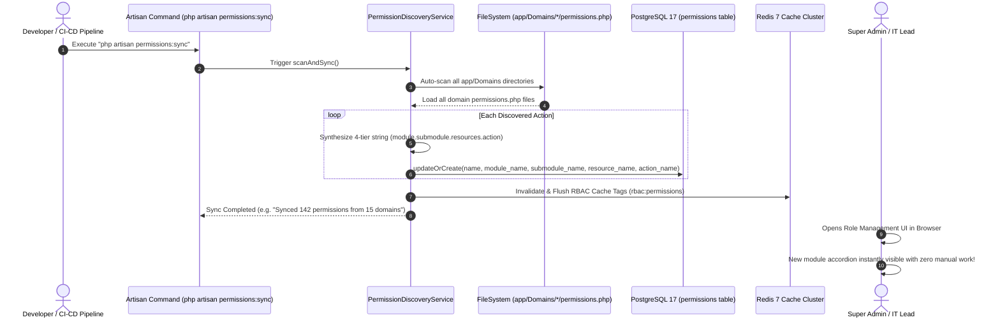

# Software Requirements Specification (SRS)
## Sub-Specification: Zero-Touch Domain Permission Auto-Discovery & Policy Lifecycle Architecture
### প্রজেক্ট: TraceFlow RMG — Precision Fabric-to-Freight Garment Intelligence
**ডকুমেন্ট রেফারেন্স:** `TFRMG-SRS-AUTO-DISCOVERY-V1.0`  
**ডকুমেন্ট ভার্সন:** 1.0 (Tier-1 Enterprise Production Edition)  
**স্ট্যান্ডার্ড কমপ্লায়েন্স:** ISO/IEC/IEEE 29148:2018, Clean Architecture, DDD Domain Isolation Standard  
**মডিউল ম্যাপ:** All 15 Modules (Cross-Cutting Authorization Subsystem)  
**স্ট্যাটাস:** Approved & Ready for Implementation  

---

## ১. ভূমিকা ও সমস্যা বিবৃতি (Problem Statement & Strategic Intent)

একটি বর্ধনশীল এন্টারপ্রাইজ গার্মেন্টস ইআরপি সিস্টেমে প্রতিনিয়ত নতুন বিজনেস ডোমেইন (মডিউল), নতুন মেশিনারি ইন্টিগ্রেশন বা নতুন অপারেশনাল ওয়ার্কফ্লো যুক্ত হয়। 

### ম্যানুয়াল পারমিশন ব্যবস্থাপনার ত্রুটিসমূহ:
1. **হিউম্যান এরর:** অ্যাডমিন প্যানেল বা সিডারে ম্যানুয়ালি টাইপ করতে গেলে স্পেলিং মিসটেক (Typo) হয়।
2. **ডট-নোটেশন স্ট্যান্ডার্ড লঙ্ঘন:** ম্যানুয়াল এন্ট্রির কারণে ৪-টিয়ার ফরম্যাট (`module.submodule.resources.action`) ভেঙে যাওয়ার মারাত্মক ঝুঁকি থাকে।
3. **সিআই/সিডি ডেপ্লয়মেন্ট ব্লকার:** নতুন ফিচারের কোড গিটহাবে পুশ হলেও প্রোডাকশন ডাটাবেসে পারমিশন না থাকায় এন্ড-ইউজাররা `403 Forbidden` এরর পায়।
4. **টেকনিক্যাল ডেট:** সেন্ট্রাল একটি ফাইলে সব মডিউলের পারমিশন রাখলে গিট মার্জ কনফ্লিক্ট তৈরি হয়।

### সমাধান:
TraceFlow RMG প্ল্যাটফর্মে **Zero-Touch Domain Auto-Discovery Engine** প্রবর্তন করা হলো। প্রতিটি ডোমেইন মডিউল তার নিজস্ব বাউন্ডারির মধ্যে পারমিশন ধারণ করবে এবং সিস্টেম স্টার্টআপ বা সিআই/সিডি ডেপ্লয়মেন্টের সময় স্বয়ংক্রিয়ভাবে ডাটাবেস, ইউআই এবং কার্নেল গেটের সাথে সিঙ্ক হয়ে যাবে।

---

## ২. ডোমেইন সেলফ-রেজিস্ট্রেশন ডিরেক্টরি স্ট্যান্ডার্ড (DDD Self-Registration)

প্রতিটি ডোমেইন ফোল্ডারের রুটে একটি স্ট্যান্ডার্ড `permissions.php` ফাইল থাকা বাধ্যতামূলক:

```text
app/Domains/
├── MasterData/
│   ├── Models/
│   ├── Controllers/
│   ├── Policies/
│   └── permissions.php      <-- ডোমেইনের নিজস্ব স্বাবলম্বী পারমিশন ম্যানিফেস্ট
├── Sewing/
│   ├── Models/
│   ├── Policies/
│   └── permissions.php      <-- সুইং লাইনের নিজস্ব পারমিশন ম্যানিফেস্ট
└── WashingPlant/            <-- ভবিষ্যতে তৈরিকৃত যেকোনো নতুন মডিউল
    ├── Models/
    ├── Policies/
    └── permissions.php      <-- কোনো সেন্ট্রাল ফাইলে হাত না দিয়ে এখানে ডিক্লেয়ারেশন
```

---

## ৩. ডোমেইন পারমিশন ফাইল স্পেসিফিকেশন (Domain Schema Spec)

`app/Domains/{DomainName}/permissions.php` ফাইলের রিটার্ন স্ট্রাকচার строго নির্দিষ্ট:

```php
<?php

return [
    'label' => 'Washing Plant Engine', // মডিউলের ডিসপ্লে নাম
    'submodules' => [
        'hydro_dryer' => [
            'label' => 'Hydro & Dryer Stage',
            'resources' => [
                'batch' => [
                    'label' => 'Washing Batch',
                    'actions' => [
                        'view' => 'View Batch Details & Logs',
                        'create' => 'Create New Washing Batch',
                        'update' => 'Update Chemical Recipe',
                        'delete' => 'Soft Delete Washing Batch',
                        'approve' => 'Approve Quality Wash Sign-off',
                        'lock' => 'Lock Batch from Alteration',
                    ],
                ],
            ],
        ],
    ],
];
```

---

## ৪. সিস্টেম অটো-ডিসকভারি কার্নেল আর্কিটেকচার (Kernel Engine)



---

## ৫. অটোমেটেড পলিসি বাইন্ডিং স্ট্যান্ডার্ড (Automated Policy Lifecycle)

Laravel-এ কন্ট্রোলার এবং এপিআই সুরক্ষার জন্য প্রতিটি ডোমেইনের পলিসি স্বয়ংক্রিয়ভাবে মডেলের সাথে লিঙ্ক হবে।

### ৫.১ নেমস্পেস অটো-রেজোলিউশন (`AppServiceProvider.php`)
```php
Gate::guessPolicyNamesUsing(function (string $modelClass) {
    // app/Domains/Washing/Models/WashingBatch -> app/Domains/Washing/Policies/WashingBatchPolicy
    return str_replace('\\Models\\', '\\Policies\\', $modelClass) . 'Policy';
});
```

### ৫.২ পলিসির অভ্যন্তরীণ এনফোর্সমেন্ট রুল:
```php
namespace App\Domains\Washing\Policies;

use App\Models\User;
use App\Domains\Washing\Models\WashingBatch;

class WashingBatchPolicy
{
    public function view(User $user, WashingBatch $batch): bool
    {
        return $user->can('washing.hydro_dryer.batch.view');
    }

    public function create(User $user): bool
    {
        return $user->can('washing.hydro_dryer.batch.create');
    }

    public function approve(User $user, WashingBatch $batch): bool
    {
        return $user->can('washing.hydro_dryer.batch.approve');
    }
}
```

---

## ৬. সিআই/সিডি অটোমেশন ও আর্টিসান কমান্ড (Artisan Command Spec)

নতুন মডিউল বা পারমিশন পরিবর্তনের সাথে সাথে ডাটাবেস সিঙ্ক করার জন্য নিচের কমান্ডটি সিস্টেমে যুক্ত থাকবে:

```bash
php artisan permissions:sync
```

### ৬.১ কমান্ডের সুরক্ষামূলক মেকানিজম:
1. **Non-Destructive Guarantee (ডাটা ধ্বংসরোধী নিশ্চয়তা):**
   - কমান্ডটি কোনো অবস্থাতেই এক্সিস্টিং পারমিশন ড্রপ বা ডিলিট করবে না। এটি কেবল নতুন পারমিশন যুক্ত করবে অথবা ডিসপ্লে লেবেল আপডেট করবে।
2. **Orphan Permission Detection:**
   - কোনো পারমিশন যদি কোড থেকে মুছে ফেলা হয় কিন্তু ডাটাবেসে বা কোনো রোলের সাথে যুক্ত থাকে, সিস্টেম একটি সতর্কবার্তা (Warning) দেবে কিন্তু জোরপূর্বক ডিলিট করে প্রোডাকশন লকআউট করবে না।
3. **Atomic Transaction:**
   - পুরো সিঙ্ক প্রক্রিয়াটি `DB::transaction()` ব্লকের মধ্যে চলবে। কোনো ফাইলে সিনট্যাক্স এরর থাকলে কোনো ডাটাবেস স্টেট ক্ষতিগ্রস্ত হবে না।
4. **Cache Invalidation:**
   - সিঙ্ক সফল হলে সাথে সাথে Redis ক্যাশ বাফার ফ্লাশ করবে।

---

## ৭. ফ্রন্টএন্ড অ্যাডমিন প্যানেল ট্রি অটো-রিফ্রেশ (Zero-Touch UI Experience)

অ্যাডমিন প্যানেলে ফ্রন্টএন্ড কোনো স্ট্যাটিক বা হার্ডকোডেড মেনু রাখবে না:
1. ফ্রন্টএন্ডের রোল ম্যানেজমেন্ট পেজ এপিআই কল করবে: `GET /api/v1/system-admin/permissions/tree`।
2. ব্যাকএন্ড অটো-ডিসকভারি সার্ভিস থেকে ডাইনামিকালি সংগৃহীত ট্রি রিটার্ন করবে।
3. ফ্রন্টএন্ড স্বয়ংক্রিয়ভাবে নতুন মডিউলের জন্য নতুন **Accordion Folder** তৈরি করে রেন্ডার করবে।
4. সিস্টেম সুপার অ্যাডমিন তাৎক্ষণিকভাবে নতুন মডিউলের ড্রপডাউন দেখতে পাবেন এবং অন্যান্য রোলের জন্য টিকচিহ্ন (Checkbox) দিয়ে অনুমতি প্রদান করতে পারবেন।

---
*(জিরো-টাচ ডোমেইন পারমিশন অটো-ডিসকভারি এসআরএস সমাপ্ত)*
