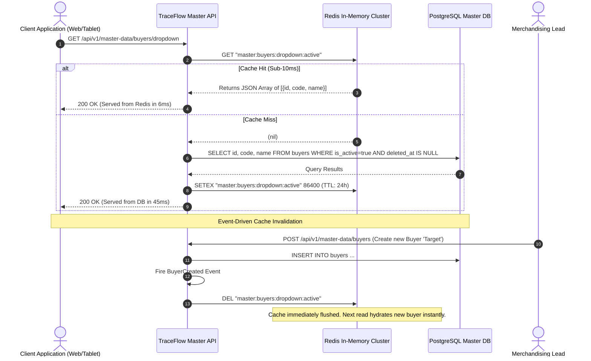
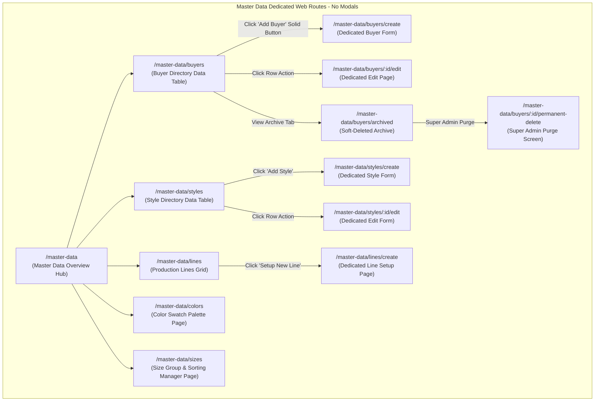
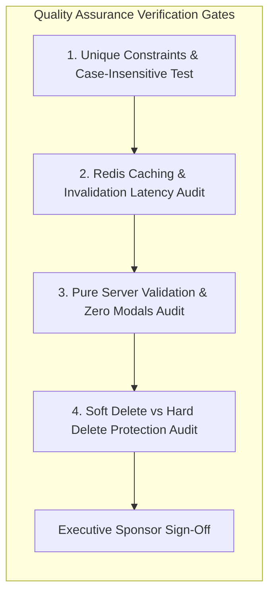

# Software Requirements Specification (SRS)
## Module 02: Enterprise Master Data Management (Global Manufacturing Library)
### প্রজেক্ট: TraceFlow RMG — Precision Fabric-to-Freight Garment Intelligence
**ডকুমেন্ট রেফারেন্স:** `TFRMG-SRS-MOD02-V2.0`  
**ডকুমেন্ট ভার্সন:** 2.0 (Global Tier-1 Enterprise Production Edition)  
**স্ট্যান্ডার্ড কমপ্লায়েন্স:** ISO/IEC/IEEE 29148:2018, SOC 2 Type II, ISO 9001 (Quality Management), Single-Source-of-Truth (SSOT) Architecture  
**স্ট্যাটাস:** Approved & Production-Ready  
**টার্গেট আর্কিটেকচার:** Laravel 13 (Repository Pattern + Redis Caching) + React 19 / Vite (Clean Architecture SPA) + PostgreSQL 17  

---

## ১. ডকুমেন্ট গভর্নেন্স ও সংস্করণ নিয়ন্ত্রণ (Document Governance & Control)

### ১.১ সংস্করণ ইতিহাস (Revision History)
| ভার্সন | তারিখ | পর্যালোচনাকারী | পরিবর্তনের বিবরণ ও পরিধি |
|---|---|---|---|
| `v1.0` | 2026-09-02 | Lead Business Analyst | প্রাথমিক মাস্টার ডাটা রিকোয়ারমেন্টস ও ফিল্ড ভ্যালিডেশন ড্রাফট। |
| `v2.0` | 2026-09-02 | Principal Enterprise Architect | 100% এন্টারপ্রাইজ রূপান্তর: ৮টি মাস্টার ডোমেইন (Buyer, Style, Color, Size, Line, IE Operation, QC Defect, UOM), টু-টিয়ার ডিলিশন গভর্নেন্স (Super Admin Hard Delete Guard), নো-মোডাল ডেডিকেটেড রুট আর্কিটেকচার, পিউর সার্ভার-সাইড ভ্যালিডেশন, রেডিজ ইভেন্ট-ড্রাইভেন ক্যাশ ইনভ্যালিডেশন, কমপ্লিট PostgreSQL 17 DDL এবং RTM সংযোজন। |

### ১.২ অনুমোদনকারী ব্যক্তিবর্গ (Sign-Off & Approvals)
- **Executive Sponsor / Project Owner:** Executive Sponsor, RMG Systems
- **Lead Solution Architect:** AI Solution Architect
- **Head of Merchandising & Marketing:** Global Apparel Sourcing Division
- **Head of Industrial Engineering (IE):** Factory Production & Capacity Planning
- **Head of Quality Assurance (QA):** Garment Standards & Compliance Division

---

## ২. নির্বাহী সারসংক্ষেপ ও কৌশলগত উদ্দেশ্য (Executive Summary & Strategic Scope)

### ২.১ কৌশলগত প্রেক্ষাপট (Strategic Context)
একটি বৃহৎ ওভেন গার্মেন্টস ম্যানুফ্যাকচারিং প্ল্যান্টে প্রতিদিন লক্ষাধিক ডলার মূল্যের অর্ডার প্রসেসিং, কাটিং, সুইং এবং শিপমেন্ট পরিচালিত হয়। এই সমগ্র কার্যক্রমের ভিত্তি হলো **Master Data (গ্লোবাল ম্যানুফ্যাকচারিং লাইব্রেরি)**।
মাস্টার ডাটা হলো পুরো TraceFlow RMG ইকোসিস্টেমের **"Single Source of Truth (SSOT)"**। যদি মাস্টার ডাটায় কোনো বায়ারের নাম, স্টাইল নাম্বার, কালার শেড, সাইজ স্পেক বা সুইং লাইনের তথ্যে সামান্যতম ভুল বা টাইপো থাকে, তবে পুরো প্রোডাকশন ফ্লোরে হাজার হাজার পিস কাপড়ে ভুল বান্ডল টিকিট জেনারেট হতে পারে এবং ভুল শিপমেন্টের কারণে কোটি কোটি টাকার বায়ার ডিসকাউন্ট/ক্লেইম তৈরি হতে পারে।

**Module 02: Master Data Management** সিস্টেমের দর্শন হলো:
> **"Create Once, Standardize Centrally, Enforce Everywhere."**

```mermaid
graph TB
    subgraph Master Data Backbone (Module 02)
        direction TB
        BM[Buyer & Brand Master] --> SM[Style & Article Master]
        SM --> CLR[Color & Shade Library]
        SM --> SIZ[Size & Inseam Matrix]
        
        FL[Factory Floor & Line Master]
        IE[IE Operation Breakdown Library]
        QCD[QC Defect Code Matrix]
        UOM[Unit of Measure Library]
    end

    subgraph Downstream Dependent Modules
        direction TB
        SM --> MOD3[Module 03: Order Management & PO]
        IE --> MOD4[Module 04: Production Planning & Line Balancing]
        SIZ --> MOD5[Module 05: Cutting & Single-Piece QR Bundling]
        FL --> MOD7[Module 07: Sewing Line Real-time Tracking]
        QCD --> MOD8[Module 08: Quality Control & Defect Mapping]
        UOM --> MOD11[Module 11: Fabric & Trims Inventory Store]
    end
```

---

## ৩. অলঙ্ঘনীয় এন্টারপ্রাইজ আর্কিটেকচারাল নিয়মাবলি (Non-Negotiable Architecture Directives)

প্রজেক্টের গ্লোবাল রুলস এবং এন্টারপ্রাইজ কোয়ালিটি নিশ্চিত করতে নিচের নিয়মগুলো ১০০% অলঙ্ঘনীয়:

### ৩.১ নো মোডালস নীতিমালা (STRICT No Modals / No Popups Rule)
- **জিরো মোডাল পলিসি:** পুরো মাস্টার ডাটা মডিউলে কোনো ফর্ম, কনফার্মেশন, এডিট প্যানেল বা সাব-স্ক্রিনের জন্য `Modal`, `Dialog`, `Popup`, `Lightbox`, বা `Drawer-over-backdrop` কঠোরভাবে নিষিদ্ধ।
- **ডেডিকেটেড রুট আর্কিটেকচার:** বায়ার তৈরি, স্টাইল এডিট, সাইজ কনফিগারেশন, প্রোডাকশন লাইন তৈরি, ডিলিট কনফার্মেশন—প্রতিটি ইন্টারঅ্যাকশন একটি সুনির্দিষ্ট ব্রাউজার ইউআরএল এবং ডেডিকেটেড ফুল-স্ক্রিন ভিউতে (Full-Screen Dedicated View) লোড হবে।
- **নেভিগেশন স্ট্যাক:** প্রতিটি পেজে স্ট্যান্ডার্ড ব্যাক বাটন এবং স্ট্রাকচার্ড ব্রেডক্রাম্ব (`Dashboard > Master Data > Buyers > Create Buyer`) থাকতে হবে যাতে ব্রাউজারের নেটিভ Forward/Back বাটন স্বাভাবিকভাবে কাজ করে এবং ডিপ-লিংক শেয়ারিং সম্ভব হয়।

### ৩.২ পিউর সার্ভার-সাইড ভ্যালিডেশন স্ট্যান্ডার্ড (Pure Server-Side Validation)
- **জিরো ক্লায়েন্ট-সাইড HTML5 ভ্যালিডেশন:** ফ্রন্টএন্ডের কোনো `<form>` বা `<input>` ফিল্ডে ব্রাউজারের ডিফল্ট HTML5 ভ্যালিডেশন অ্যাট্রিবিউট (`required`, `minlength`, `maxlength`, `pattern`, ইত্যাদি) দেওয়া যাবে না। ব্রাউজারের বিল্ট-ইন টুলটিপ পপআপ সম্পূর্ণ নিষিদ্ধ।
- **বাধ্যতামূলক `noValidate`:** সমস্ত ফ্রন্টএন্ড ফর্মে `<form noValidate>` স্পষ্টভাবে যুক্ত থাকতে হবে।
- **একীভূত এরর কন্ট্রাক্ট:** সমস্ত ডাটা ভ্যালিডেশন ব্যাকএন্ড Laravel `FormRequest` ক্লাসের মাধ্যমে পিউর সার্ভার সাইডে ঘটবে। ইনপুট ভুল হলে সার্ভার থেকে `422 Unprocessable Content` স্ট্যান্ডার্ড RFC 7807 কমপ্লায়েন্ট JSON এরর পাঠানো হবে।
- **ইনলাইন এরর রেন্ডারিং:** ফ্রন্টএন্ড স্বয়ংক্রিয়ভাবে রেসপন্সের ফিল্ড নেম ম্যাপ করে সংশ্লিষ্ট ইনপুট বক্সের ঠিক নিচে ক্রিস্প লাল রঙে এরর বার্তা রেন্ডার করবে।

### ৩.৩ ফ্ল্যাট এবং ক্রিস্প ডিজাইন স্ট্যান্ডার্ড (Flat Solid UI Standard)
- **নো গ্রেডিয়েন্ট পলিসি:** কোনো বাটন, কার্ড, হেডার বা সাইডবারে কোনো ধরণের গ্রেডিয়েন্ট কালার ব্যবহার করা যাবে না।
- **সলিড ডিজাইন টোকেনস:** সকল অ্যাকশন বাটন ক্রিস্প ও ফ্ল্যাট সলিড রঙে গঠিত হবে (যেমন: Primary `#2563EB`, Danger `#DC2626`, Success `#16A34A`, Neutral `#475569`, Warning `#D97706`)।
- **১০০% ইংরেজি ইউআই:** ইউজার ইন্টারফেসের সমস্ত লেবেল, ফিল্ড নেম, কলাম হেডার, অ্যাকশন বাটন এবং সিস্টেম নোটিফিকেশন ১০০% প্রফেশনাল আন্তর্জাতিক ইংরেজি ভাষায় (English) হবে।

### ৩.৪ দ্বি-স্তরবিশিষ্ট ডিলিশন গভর্নেন্স (Two-Tier Deletion Architecture)
- **সফট ডিলিট (Soft Delete):** সাধারণ অ্যাডমিনরা অনুমতি সাপেক্ষে মাস্টার ডাটা এন্ট্রি সফট ডিলিট করতে পারবেন (`deleted_at = NOW()`)। এতে রেকর্ডটি ড্রপডাউনে আর আসবে না, কিন্তু অতীতের সকল প্রোডাকশন বা অর্ডার রিপোর্টে অক্ষত থাকবে।
- **পার্মানেন্ট হার্ড ডিলিট (STRICT Super Admin Only):** ডাটাবেস থেকে স্থায়ীভাবে রো মুছে ফেলার ক্ষমতা **কেবলমাত্র `Super Admin` এর থাকবে**।
- **প্রোডাকশন রেফারেনশিয়াল প্রোটেকশন গার্ড (Referential Check):** যদি কোনো বায়ার, স্টাইল, কালার বা সাইজের অধীনে কোনো সক্রিয় Purchase Order (PO), কাটিং বান্ডল, বা কিউসি রিপোর্ট থাকে, তবে সিস্টেম পার্মানেন্ট ডিলিট **সম্পূর্ণ ব্লক** করবে এবং `409 Conflict` রিটার্ন করবে।

---

## ৪. মাস্টার ডাটা ডোমেইন ও ইউজার পারসোনা (Master Domains & Stakeholder Scoping)

| মাস্টার ডোমেইন (Domain) | প্রাইমারি ওনার (Primary Owner) | অনুমোদিত অ্যাকশন (Allowed Actions) | ডাউনস্ট্রিম নির্ভরতা (Downstream Impact) |
|---|---|---|---|
| **Buyer & Brand Library** | Merchandising Lead / Admin | Create, Edit, Soft-Delete, Restore | Module 03 (PO), Module 12 (Export Commercial Invoice) |
| **Style & Article Master** | Merchandising Specialist | Create, Edit, Soft-Delete, Spec Upload | Module 03 (Order), Module 04 (Routing), Module 05 (Cutting) |
| **Color & Shade Library** | Fabric Technologist / Merchandiser | Create, Edit, Soft-Delete | Module 05 (Cutting Lay), Module 06 (Print/Embroidery) |
| **Size & Inseam Matrix** | Pattern Master / Merchandiser | Create, Edit, Re-order, Soft-Delete | Module 05 (Bundle Ticket), Module 10 (Packing List) |
| **Factory Floor & Lines** | Factory GM / Operations Head | Create, Capacity Edit, Line Status | Module 01 (Tablet Pairing), Module 07 (Sewing In/Out) |
| **IE Operation Breakdown**| IE Manager / Work-Study Officer | Create, SMV Update, Machine Assign | Module 04 (Line Balancing), Module 07 (Piece Rate/SMV) |
| **QC Defect Code Matrix** | QA Manager / Quality Auditor | Create, Severity Grade, Zone Map | Module 08 (End-line QC, DHU Calculation) |
| **Unit of Measure (UOM)** | Central Inventory / IT Admin | Create, Conversion Multipliers | Module 11 (Fabric Rolls, Thread Cones, Trims) |

---

## ৫. বিস্তারিত ফাংশনাল রিকোয়ারমেন্টস (Detailed Functional Specifications)

### ৫.১ সাব-মডিউল: বায়ার ও ব্র্যান্ড লাইব্রেরি (Buyer & Brand Master)

#### ৫.১.১ স্পেসিফিকেশন ও বিজনেস লজিক
- **REQ-MST-BYR-001 (Global Unique Buyer Code & Name):**
  - প্রতিটি বায়ারের একটি ইউনিক কোড (যেমন: `BYR-ZARA-01`) এবং নাম থাকবে।
  - কেস-ইনসেনসিটিভ ইউনিকনেস: সিস্টেমে যদি "H&M" থাকে, তবে "h&m" বা " H&M " নামে কোনো নতুন বায়ার তৈরি করা যাবে না (Trim ও Upper-case হ্যান্ডলিং সার্ভার-সাইডে নিশ্চিত হবে)।
- **REQ-MST-BYR-002 (Buyer Profile Attributes):**
  - কান্ট্রি অফ অরিজিন (ISO 3166-1 Standard Country List)।
  - ডিফল্ট কারেন্সি (USD, EUR, GBP, CAD, ইত্যাদি)।
  - পেমেন্ট টার্মস (যেমন: LC at Sight, TT 30 Days, DP 60 Days)।
  - অফিসিয়াল মার্চেন্ডাইজিং ও মার্চেন্ট ফাইন্যান্স কন্টাক্ট ইমেইল ও ফোন।
- **REQ-MST-BYR-003 (Brand Hierarchy):**
  - একটি বায়ারের অধীনে একাধিক সাব-ব্র্যান্ড বা ডিভিশন থাকতে পারে (যেমন: Buyer: Inditex -> Brands: Zara, Massimo Dutti, Pull&Bear, Bershka)।
  - প্রতিটি ব্র্যান্ড বায়ারের সাথে ফরেন-কি রিলেশনশিপে যুক্ত থাকবে।
- **REQ-MST-BYR-004 (Active/Inactive Toggle & Cache Sync):**
  - কোনো বায়ারকে `Inactive` করা হলে নতুন কোনো Purchase Order (PO) তৈরির সময় ওই বায়ার ড্রপডাউনে আসবে না। কিন্তু পূর্ববর্তী সকল অর্ডারে বায়ারের হিস্টোরিক্যাল নাম অক্ষুণ্ণ থাকবে।

---

### ৫.২ সাব-মডিউল: স্টাইল ও আর্টিকল মাস্টার (Style & Article Library)

#### ৫.২.১ স্পেসিফিকেশন ও বিজনেস লজিক
- **REQ-MST-STY-001 (Composite Unique Style Number):**
  - স্টাইল নাম্বার কোনো একক গ্লোবাল ইউনিক নয়; এটি বায়ার-ভিত্তিক ইউনিক (`UNIQUE(buyer_id, style_no)` হোয়ার `deleted_at IS NULL`)।
  - উদাহরণ: বায়ার Zara এর জন্য স্টাইল "DNM-101" থাকতে পারে, আবার বায়ার H&M এর জন্যও স্টাইল "DNM-101" থাকতে পারে। কিন্তু Zara এর অধীনে দুটি "DNM-101" তৈরি করা যাবে না।
- **REQ-MST-STY-002 (Garment Product Category & Silhouette):**
  - প্রোডাক্ট ক্যাটাগরি: Woven Bottoms (Trousers/Chinos/Cargo), Woven Tops (Formal Shirts/Casual Shirts), Denim (5-Pocket/Jackets), Outerwear/Coats।
  - ফিট/সিলুয়েট: Slim Fit, Regular Fit, Relaxed, Skinny, Oversized।
- **REQ-MST-STY-003 (Base Standard Minute Value - SMV):**
  - স্টাইলের একটি স্ট্যান্ডার্ড বেস SMV (Standard Minute Value) থাকবে (যেমন: ১৮.৫০ মিনিট)।
  - এটি পরবর্তীতে Module 04 (Production Planning & Line Layout) এ প্ল্যানিং ও টার্গেট নির্ধারণের মূল প্যারামিটার হিসেবে কাজ করবে।
- **REQ-MST-STY-004 (Tech Pack Attachment Storage):**
  - প্রতিটি স্টাইলের সাথে বায়ার কর্তৃক অনুমোদিত মূল টেক প্যাক (PDF/ZIP ফাইল, সর্বোচ্চ ৫০ মেগাবাইট) আপলোড করা যাবে।
  - ফাইল নিরাপদে ক্লাউড/প্রাইভেট স্টোরেজে সংরক্ষিত হবে এবং ভার্সনিং সাপোর্ট করবে।

---

### ৫.৩ সাব-মডিউল: কালার ও শেড লাইব্রেরি (Color & Shade Library)

#### ৫.৩.১ স্পেসিফিকেশন ও বিজনেস লজিক
- **REQ-MST-CLR-001 (Centralized Color Palette):**
  - কালার কোড (e.g. `CLR-BLK-01`) এবং কালার নাম (e.g. "Jet Black", "Navy Blazer", "Vintage Washed Indigo")।
  - গ্লোবালি কেস-ইনসেনসিটিভ ইউনিক নাম।
- **REQ-MST-CLR-002 (Hex Code & Visual Representation):**
  - প্রতিটি কালারের জন্য একটি বৈধ ৬-ডিজিট হেক্স কোড (যেমন: `#000080` for Navy) থাকবে।
  - এই হেক্স কোডটি পরবর্তীতে ফ্রন্টএন্ড কাটিং চার্ট, ফেব্রিক রোল লেবেল এবং বায়ার ড্যাশবোর্ডে ভিজ্যুয়াল সোয়াচ (Color Swatch Box) হিসেবে প্রদর্শিত হবে।
- **REQ-MST-CLR-003 (Pantone / Lab Dip Reference):**
  - বায়ার নির্দিষ্ট প্যানটোন রেফারেন্স কোড (e.g. `TCX 19-4010`) অথবা ফ্যাক্টরি ল্যাব ডিপ এপ্রুভাল রেফারেন্স স্ট্রিং সংরক্ষণের ব্যবস্থা থাকবে।

---

### ৫.৪ সাব-মডিউল: সাইজ, সাইজ গ্রুপ ও ইনসিম মেট্রিক্স (Size Matrix Library)

#### ৫.৪.১ স্পেসিফিকেশন ও বিজনেস লজিক
- **REQ-MST-SIZ-001 (Size Label & Code):**
  - স্ট্যান্ডার্ড সাইজ লেবেল (e.g., `XS`, `S`, `M`, `L`, `XL`, `XXL` অথবা বটমসের ক্ষেত্রে `28`, `30`, `32`, `34`, `36`, `38`)।
- **REQ-MST-SIZ-002 (Size Grouping Architecture):**
  - সাইজগুলোকে সুনির্দিষ্ট সাইজ গ্রুপে ভাগ করা হবে (e.g. "Men's Tops Alpha", "Men's Trousers Waist", "Kids Age Range")।
  - একটি সাইজ গ্রুপে একাধিক সাইজ ক্রমানুসারে সাজানো থাকবে।
- **REQ-MST-SIZ-003 (Sort Order Enforcement):**
  - প্রতিটি সাইজের জন্য বাধ্যতামূলক নিউমেরিক `sort_order` থাকবে (যেমন: S=1, M=2, L=3, XL=4)।
  - কাটিং বান্ডলিং, প্যাকিং লিস্ট ও ইনভয়েসে সাইজগুলো বর্ণানুক্রমিক (Alphabetical: L, M, S, XL) নয়, বরং লজিক্যাল সর্ট অর্ডারে (S, M, L, XL) প্রদর্শিত ও প্রিন্ট হবে।
- **REQ-MST-SIZ-004 (Inseam / Length Matrix Support for Woven Bottoms):**
  - ওভেন বটমস ও ডেনিম গার্মেন্টস ম্যানুফ্যাকচারিংয়ের জন্য সাইজের সাথে ইনসিম/লেংথ (Length) কম্বিনেশন সাপোর্ট থাকবে (যেমন: Waist `32` x Length `30L`, `32L`, `34L`)।

---

### ৫.৫ সাব-মডিউল: ফ্যাক্টরি স্ট্রাকচার ও প্রোডাকশন লাইন লাইব্রেরি (Factory Floor & Lines)

#### ৫.৫.১ স্পেসিফিকেশন ও বিজনেস লজিক
- **REQ-MST-LIN-001 (Hierarchy of Factory Real Estate):**
  - ফ্যাক্টরি ইউনিট/বিল্ডিং -> ফ্লোর নম্বর -> প্রোডাকশন সেকশন (Cutting, Sewing, Finishing) -> লাইন/স্টেশন।
- **REQ-MST-LIN-002 (Production Line Profile):**
  - লাইন কোড (e.g. `LINE-SW-04`) ও লাইন নাম (e.g. "Sewing Line 04 - Denim Specialist")।
  - মোট মেশিন ও অপারেটর ধারণক্ষমতা (Operator Capacity: e.g. 60 Machines)।
  - ডিফল্ট টার্গেট এফিসিয়েন্সি পার্সেন্টেজ (Target Efficiency: e.g. 65.0%)।
- **REQ-MST-LIN-003 (Line Chief / Supervisor Binding):**
  - প্রতিটি প্রোডাকশন লাইনের সাথে বর্তমান লাইন চিফ বা ইনচার্জের `emp_id` যুক্ত থাকবে (Module 01 Users থেকে রেফারেন্সড)।
- **REQ-MST-LIN-004 (Hardware Tablet Binding Integrity):**
  - Module 01 এ ফ্লোর ট্যাবলেটসমূহ যখন পেয়ার করা হবে, তখন এই লাইব্রেরির সক্রিয় `line_id` আবশ্যক হবে।
  - যদি কোনো লাইনকে `Inactive` বা `Maintenance` করা হয়, তবে ওই লাইনে পেয়ার করা সকল ট্যাবলেট স্বয়ংক্রিয়ভাবে একটি "Line Temporarily Suspended" নোটিফিকেশন প্রদর্শন করবে।

---

### ৫.৬ সাব-মডিউল: ইন্ডাস্ট্রিয়াল ইঞ্জিনিয়ারিং অপারেশন ব্রেকডাউন লাইব্রেরি (IE Operations Master)

#### ৫.৬.১ স্পেসিফিকেশন ও বিজনেস লজিক
- **REQ-MST-OPS-001 (Standard Garment Operations):**
  - অপারেশন কোড (e.g. `OP-SW-012`) এবং অপারেশন নাম (e.g. "Collar Runstitch", "Front Placket Attach", "Back Pocket Hemming")।
  - সেকশন অ্যাসাইনমেন্ট: কাটিং, সুইং পার্টস প্রিপারেশন, সুইং অ্যাসেম্বলি, ওয়াশিং প্রিপারেশন, ফিনিশিং আয়রনিং।
- **REQ-MST-OPS-002 (Machine Type Classification):**
  - অপারেশনে প্রয়োজনীয় সুনির্দিষ্ট মেশিনের ধরণ: SNLS (Single Needle Lockstitch), DNLS (Double Needle), Overlock 4-Thread, Overlock 5-Thread, Feed-off-the-Arm, Kansai Special, Button Attach, Eyelet Buttonhole, Bar-tack, Heat Seal Press।
- **REQ-MST-OPS-003 (Target SMV & Skill Matrix):**
  - প্রতিটি অপারেশনের স্ট্যান্ডার্ড মিনিট ভ্যালু (Base SMV in decimal minutes, e.g. 0.450 min)।
  - প্রয়োজনীয় অপারেটর স্কিল গ্রেড (Grade A+, Grade A, Grade B, Grade C)।

---

### ৫.৭ সাব-মডিউল: কোয়ালিটি কন্ট্রোল ডিফেক্ট কোড লাইব্রেরি (QC Defect Master)

#### ৫.৭.১ স্পেসিফিকেশন ও বিজনেস লজিক
- **REQ-MST-DEF-001 (Standardized Defect Classification):**
  - ডিফেক্ট কোড (e.g. `DEF-SW-01`) এবং ডিফেক্ট নাম (e.g. "Broken Stitch", "Puckering", "Skip Stitch", "Shade Variation", "Oil Spot", "Open Seam", "Measurement Out of Tolerance")।
- **REQ-MST-DEF-002 (Severity Grade):**
  - আন্তর্জাতিক AQL স্ট্যান্ডার্ড অনুযায়ী ডিফেক্টের তীব্রতা:
    - `CRITICAL`: সম্পূর্ণ রিজেক্টেবল (e.g. Needle Broken Inside Garment, Severe Holes, Toxic Spots)।
    - `MAJOR`: অলটারেশন আবশ্যক, বায়ার অনুমোদনযোগ্য নয় (e.g. Broken Seam, Noticeable Skip Stitch)।
    - `MINOR`: গ্রহণযোগ্য টলারেন্সের ভেতর থাকা সামান্য ত্রুটি (e.g. Loose Thread End, Minor Crease)।
- **REQ-MST-DEF-003 (Garment Anatomical Zone):**
  - ডিফেক্টের ভৌগোলিক জোন (Front Body, Back Body, Collar/Neck, Left Sleeve, Right Sleeve, Bottom Hem, Inseam)। এটি Module 08 এর SVG বডি ম্যাপে পিন পয়েন্ট হিসেবে ব্যবহৃত হবে।

---

### ৫.৮ সাব-মডিউল: ইউনিট অফ মেজার লাইব্রেরি (UOM Master)

#### ৫.৮.১ স্পেসিফিকেশন ও বিজনেস লজিক
- **REQ-MST-UOM-001 (Standard Industrial Units):**
  - UOM কোড ও নাম: `PCS` (Pieces), `DZN` (Dozen), `YDS` (Yards), `MTR` (Meters), `CONE` (Thread Cones), `ROLL` (Fabric Rolls), `GROSS` (144 pcs for buttons), `KGS` (Kilograms)।
- **REQ-MST-UOM-002 (Base Conversion Multipliers):**
  - যেমন: ১ Dozen = ১২ Pieces; ১ Gross = ১৪৪ Pieces; ১ Meter = ১.০৯৩৬১ Yards।
  - এটি মার্চেন্ডাইজিং কনসাম্পশন ক্যালকুলেশন এবং ফেব্রিক স্টোর ইনভেন্টরি লেজারে ডাবল-এন্ট্রি ব্যালেন্সিংয়ে ব্যবহৃত হবে।

---

## ৬. প্রোডাকশন-গ্রেড ডাটাবেস আর্কিটেকচার ও DDL (Database Engineering)

নিচে PostgreSQL 17 এর জন্য সম্পূর্ণ প্রোডাকশন-রেডি DDL স্ক্রিপ্ট দেওয়া হলো। এতে ফরেন কি, ইউনিকনেস কনস্ট্রেইন্টস, ইনডেক্সিং এবং সফট-ডিলিট সাপোর্ট রয়েছে।

### ৬.১ PostgreSQL 17 Production Schema (Complete DDL)

```sql
-- Enable Cryptographic Extension for UUID v4
CREATE EXTENSION IF NOT EXISTS "pgcrypto";

-- ----------------------------------------------------------------------
-- 1. Table: buyers (Buyer Master)
-- ----------------------------------------------------------------------
CREATE TABLE buyers (
    id UUID PRIMARY KEY DEFAULT gen_random_uuid(),
    code VARCHAR(30) NOT NULL,
    name VARCHAR(120) NOT NULL,
    country VARCHAR(100) NOT NULL,
    currency VARCHAR(10) NOT NULL DEFAULT 'USD',
    payment_terms VARCHAR(100),
    contact_person VARCHAR(100),
    contact_email VARCHAR(150),
    contact_phone VARCHAR(30),
    is_active BOOLEAN NOT NULL DEFAULT TRUE,
    created_by UUID REFERENCES users(id) ON DELETE SET NULL,
    created_at TIMESTAMPTZ NOT NULL DEFAULT CURRENT_TIMESTAMP,
    updated_at TIMESTAMPTZ NOT NULL DEFAULT CURRENT_TIMESTAMP,
    deleted_at TIMESTAMPTZ
);

CREATE UNIQUE INDEX uq_buyers_code_active ON buyers (UPPER(code)) WHERE deleted_at IS NULL;
CREATE UNIQUE INDEX uq_buyers_name_active ON buyers (UPPER(name)) WHERE deleted_at IS NULL;
CREATE INDEX idx_buyers_is_active ON buyers (is_active);
CREATE INDEX idx_buyers_deleted_at ON buyers (deleted_at);

-- ----------------------------------------------------------------------
-- 2. Table: brands (Sub-brands under Buyers)
-- ----------------------------------------------------------------------
CREATE TABLE brands (
    id UUID PRIMARY KEY DEFAULT gen_random_uuid(),
    buyer_id UUID NOT NULL REFERENCES buyers(id) ON DELETE RESTRICT,
    name VARCHAR(100) NOT NULL,
    code VARCHAR(30),
    is_active BOOLEAN NOT NULL DEFAULT TRUE,
    created_at TIMESTAMPTZ NOT NULL DEFAULT CURRENT_TIMESTAMP,
    updated_at TIMESTAMPTZ NOT NULL DEFAULT CURRENT_TIMESTAMP,
    deleted_at TIMESTAMPTZ
);

CREATE UNIQUE INDEX uq_brands_buyer_name ON brands (buyer_id, UPPER(name)) WHERE deleted_at IS NULL;
CREATE INDEX idx_brands_buyer_id ON brands (buyer_id);

-- ----------------------------------------------------------------------
-- 3. Table: seasons (Production Seasons)
-- ----------------------------------------------------------------------
CREATE TABLE seasons (
    id UUID PRIMARY KEY DEFAULT gen_random_uuid(),
    code VARCHAR(30) NOT NULL,
    name VARCHAR(80) NOT NULL,
    year SMALLINT NOT NULL,
    is_active BOOLEAN NOT NULL DEFAULT TRUE,
    created_at TIMESTAMPTZ NOT NULL DEFAULT CURRENT_TIMESTAMP,
    updated_at TIMESTAMPTZ NOT NULL DEFAULT CURRENT_TIMESTAMP,
    deleted_at TIMESTAMPTZ
);

CREATE UNIQUE INDEX uq_seasons_code ON seasons (UPPER(code)) WHERE deleted_at IS NULL;

-- ----------------------------------------------------------------------
-- 4. Table: styles (Garment Style Master)
-- ----------------------------------------------------------------------
CREATE TABLE styles (
    id UUID PRIMARY KEY DEFAULT gen_random_uuid(),
    buyer_id UUID NOT NULL REFERENCES buyers(id) ON DELETE RESTRICT,
    brand_id UUID REFERENCES brands(id) ON DELETE RESTRICT,
    season_id UUID REFERENCES seasons(id) ON DELETE RESTRICT,
    style_no VARCHAR(80) NOT NULL,
    style_name VARCHAR(150),
    category VARCHAR(50) NOT NULL, -- Woven Bottom, Woven Top, Denim, Outerwear
    fit VARCHAR(50),               -- Slim, Regular, Relaxed
    base_smv NUMERIC(6, 2) NOT NULL DEFAULT 0.00,
    tech_pack_url TEXT,
    description TEXT,
    is_active BOOLEAN NOT NULL DEFAULT TRUE,
    created_by UUID REFERENCES users(id) ON DELETE SET NULL,
    created_at TIMESTAMPTZ NOT NULL DEFAULT CURRENT_TIMESTAMP,
    updated_at TIMESTAMPTZ NOT NULL DEFAULT CURRENT_TIMESTAMP,
    deleted_at TIMESTAMPTZ
);

CREATE UNIQUE INDEX uq_styles_buyer_style_no ON styles (buyer_id, UPPER(style_no)) WHERE deleted_at IS NULL;
CREATE INDEX idx_styles_buyer_id ON styles (buyer_id);
CREATE INDEX idx_styles_category ON styles (category);
CREATE INDEX idx_styles_deleted_at ON styles (deleted_at);

-- ----------------------------------------------------------------------
-- 5. Table: colors (Global Color Library)
-- ----------------------------------------------------------------------
CREATE TABLE colors (
    id UUID PRIMARY KEY DEFAULT gen_random_uuid(),
    code VARCHAR(30) NOT NULL,
    name VARCHAR(80) NOT NULL,
    hex_code VARCHAR(10),
    pantone_ref VARCHAR(50),
    is_active BOOLEAN NOT NULL DEFAULT TRUE,
    created_at TIMESTAMPTZ NOT NULL DEFAULT CURRENT_TIMESTAMP,
    updated_at TIMESTAMPTZ NOT NULL DEFAULT CURRENT_TIMESTAMP,
    deleted_at TIMESTAMPTZ
);

CREATE UNIQUE INDEX uq_colors_code ON colors (UPPER(code)) WHERE deleted_at IS NULL;
CREATE UNIQUE INDEX uq_colors_name ON colors (UPPER(name)) WHERE deleted_at IS NULL;

-- ----------------------------------------------------------------------
-- 6. Table: size_groups & sizes (Size Matrix Library)
-- ----------------------------------------------------------------------
CREATE TABLE size_groups (
    id UUID PRIMARY KEY DEFAULT gen_random_uuid(),
    name VARCHAR(80) NOT NULL,
    description VARCHAR(255),
    is_active BOOLEAN NOT NULL DEFAULT TRUE,
    created_at TIMESTAMPTZ NOT NULL DEFAULT CURRENT_TIMESTAMP,
    updated_at TIMESTAMPTZ NOT NULL DEFAULT CURRENT_TIMESTAMP,
    deleted_at TIMESTAMPTZ
);

CREATE UNIQUE INDEX uq_size_groups_name ON size_groups (UPPER(name)) WHERE deleted_at IS NULL;

CREATE TABLE sizes (
    id UUID PRIMARY KEY DEFAULT gen_random_uuid(),
    size_group_id UUID NOT NULL REFERENCES size_groups(id) ON DELETE RESTRICT,
    code VARCHAR(30) NOT NULL,
    label VARCHAR(30) NOT NULL,
    sort_order SMALLINT NOT NULL DEFAULT 1,
    inseam_length VARCHAR(20),
    is_active BOOLEAN NOT NULL DEFAULT TRUE,
    created_at TIMESTAMPTZ NOT NULL DEFAULT CURRENT_TIMESTAMP,
    updated_at TIMESTAMPTZ NOT NULL DEFAULT CURRENT_TIMESTAMP,
    deleted_at TIMESTAMPTZ
);

CREATE UNIQUE INDEX uq_sizes_group_label ON sizes (size_group_id, UPPER(label)) WHERE deleted_at IS NULL;
CREATE INDEX idx_sizes_group_sort ON sizes (size_group_id, sort_order ASC);

-- ----------------------------------------------------------------------
-- 7. Table: production_lines (Factory Floor Layout Master)
-- ----------------------------------------------------------------------
CREATE TABLE production_lines (
    id UUID PRIMARY KEY DEFAULT gen_random_uuid(),
    code VARCHAR(30) NOT NULL,
    name VARCHAR(100) NOT NULL,
    building VARCHAR(80) NOT NULL,
    floor_no VARCHAR(40) NOT NULL,
    section VARCHAR(50) NOT NULL, -- Cutting, Sewing, QC, Finishing
    line_chief_emp_id VARCHAR(50), -- Reference to users.emp_id
    operator_capacity SMALLINT NOT NULL DEFAULT 50,
    target_efficiency NUMERIC(5, 2) NOT NULL DEFAULT 65.00,
    is_active BOOLEAN NOT NULL DEFAULT TRUE,
    created_at TIMESTAMPTZ NOT NULL DEFAULT CURRENT_TIMESTAMP,
    updated_at TIMESTAMPTZ NOT NULL DEFAULT CURRENT_TIMESTAMP,
    deleted_at TIMESTAMPTZ
);

CREATE UNIQUE INDEX uq_lines_code ON production_lines (UPPER(code)) WHERE deleted_at IS NULL;
CREATE INDEX idx_lines_section ON production_lines (section);
CREATE INDEX idx_lines_is_active ON production_lines (is_active);

-- ----------------------------------------------------------------------
-- 8. Table: ie_operations (Work Study & Operations Master)
-- ----------------------------------------------------------------------
CREATE TABLE ie_operations (
    id UUID PRIMARY KEY DEFAULT gen_random_uuid(),
    code VARCHAR(40) NOT NULL,
    name VARCHAR(150) NOT NULL,
    section VARCHAR(50) NOT NULL, -- Cutting, Sewing, Finishing
    machine_type VARCHAR(80) NOT NULL, -- SNLS, Overlock 5-Th, Feed-off-Arm
    default_smv NUMERIC(6, 3) NOT NULL DEFAULT 0.500,
    skill_grade VARCHAR(10) NOT NULL DEFAULT 'A', -- A+, A, B, C
    is_active BOOLEAN NOT NULL DEFAULT TRUE,
    created_at TIMESTAMPTZ NOT NULL DEFAULT CURRENT_TIMESTAMP,
    updated_at TIMESTAMPTZ NOT NULL DEFAULT CURRENT_TIMESTAMP,
    deleted_at TIMESTAMPTZ
);

CREATE UNIQUE INDEX uq_operations_code ON ie_operations (UPPER(code)) WHERE deleted_at IS NULL;
CREATE INDEX idx_operations_section ON ie_operations (section);

-- ----------------------------------------------------------------------
-- 9. Table: qc_defect_codes (Garment Defect Master)
-- ----------------------------------------------------------------------
CREATE TABLE qc_defect_codes (
    id UUID PRIMARY KEY DEFAULT gen_random_uuid(),
    code VARCHAR(30) NOT NULL,
    name VARCHAR(100) NOT NULL,
    severity VARCHAR(20) NOT NULL DEFAULT 'MAJOR', -- CRITICAL, MAJOR, MINOR
    default_zone VARCHAR(60), -- Front, Back, Collar, Sleeve, Hem
    is_active BOOLEAN NOT NULL DEFAULT TRUE,
    created_at TIMESTAMPTZ NOT NULL DEFAULT CURRENT_TIMESTAMP,
    updated_at TIMESTAMPTZ NOT NULL DEFAULT CURRENT_TIMESTAMP,
    deleted_at TIMESTAMPTZ
);

CREATE UNIQUE INDEX uq_defects_code ON qc_defect_codes (UPPER(code)) WHERE deleted_at IS NULL;
CREATE INDEX idx_defects_severity ON qc_defect_codes (severity);

-- ----------------------------------------------------------------------
-- 10. Table: units_of_measure (UOM Master)
-- ----------------------------------------------------------------------
CREATE TABLE units_of_measure (
    id UUID PRIMARY KEY DEFAULT gen_random_uuid(),
    code VARCHAR(20) NOT NULL,
    name VARCHAR(60) NOT NULL,
    base_multiplier NUMERIC(10, 4) NOT NULL DEFAULT 1.0000,
    is_active BOOLEAN NOT NULL DEFAULT TRUE,
    created_at TIMESTAMPTZ NOT NULL DEFAULT CURRENT_TIMESTAMP,
    updated_at TIMESTAMPTZ NOT NULL DEFAULT CURRENT_TIMESTAMP,
    deleted_at TIMESTAMPTZ
);

CREATE UNIQUE INDEX uq_uom_code ON units_of_measure (UPPER(code)) WHERE deleted_at IS NULL;
```

---

## ৭. হাই-পারফরম্যান্স ক্যাশিং আর্কিটেকচার (Redis Cache Strategy)

মাস্টার ডাটা ঘন ঘন পরিবর্তিত হয় না, কিন্তু প্রতিটি স্ক্রিন ও ফ্লোর ট্যাবলেটের ড্রপডাউনে প্রতি মিনিটে হাজার বার রিকোয়েস্ট আসে। তাই এন্টারপ্রাইজ রেডিজ ক্যাশিং ফ্রেমওয়ার্ক বাধ্যতামূলক।



---

## ৮. সম্পূর্ণ এপিআই কন্ট্রাক্ট স্পেসিফিকেশন (Exhaustive API Contracts)

### ৮.১ সাধারণ আর্কিটেকচার ও স্ট্যান্ডার্ডস
- **অথেনটিকেশন:** `Authorization: Bearer <sanctum_token>`
- **হেডার্স:** `Accept: application/json`, `Content-Type: application/json`
- **স্ট্যান্ডার্ড পেজিনেশন ও কুয়েরি:**
  `?page=1&per_page=25&sort=-created_at&filter[is_active]=true&search=zara`

---

### ৮.২ বায়ার লাইব্রেরি এন্ডপয়েন্টস (Buyer Endpoints)

#### ৮.২.১ ড্রপডাউন তালিকা (High-Speed Cached Endpoint)
- **মেথড ও ইউআরএল:** `GET /api/v1/master-data/buyers/dropdown`
- **সাকসেস রেসপন্স (`200 OK` — Served from Redis):**
  ```json
  {
    "success": true,
    "status_code": 200,
    "data": [
      { "id": "9b1d3f6a-4b11-4890-a210-98dfa710bc89", "code": "ZARA", "name": "Zara (Inditex)" },
      { "id": "8a2c1e4b-3c22-4901-b119-87cfa601ab78", "code": "HM", "name": "H&M Hennes & Mauritz" }
    ]
  }
  ```

#### ৮.২.২ বায়ার ক্রিয়েশন (Create Buyer)
- **মেথড ও ইউআরএল:** `POST /api/v1/master-data/buyers`
- **রিকোয়েস্ট বডি:**
  ```json
  {
    "code": "TARGET-US",
    "name": "Target Corporation",
    "country": "United States",
    "currency": "USD",
    "payment_terms": "LC at Sight 60 Days",
    "contact_person": "John Doe",
    "contact_email": "sourcing@target.com",
    "contact_phone": "+1-612-304-6073",
    "is_active": true
  }
  ```
- **সার্ভার-সাইড ভ্যালিডেশন রুলস (Laravel FormRequest):**
  ```php
  public function rules(): array
  {
      return [
          'code'           => ['bail', 'required', 'string', 'max:30', 'unique:buyers,code'],
          'name'           => ['bail', 'required', 'string', 'min:3', 'max:120', 'unique:buyers,name'],
          'country'        => ['bail', 'required', 'string', 'max:100'],
          'currency'       => ['bail', 'required', 'string', 'in:USD,EUR,GBP,CAD,AUD'],
          'payment_terms'  => ['bail', 'nullable', 'string', 'max:100'],
          'contact_person' => ['bail', 'nullable', 'string', 'max:100'],
          'contact_email'  => ['bail', 'nullable', 'email:rfc,dns', 'max:150'],
          'contact_phone'  => ['bail', 'nullable', 'string', 'max:30'],
          'is_active'      => ['bail', 'boolean'],
      ];
  }
  ```
- **সাকসেস রেসপন্স (`201 Created`):** তৈরিকৃত অবজেক্ট রিটার্ন।
- **ভ্যালিডেশন ফেইলিওর (`422 Unprocessable Content`):**
  ```json
  {
    "success": false,
    "status_code": 422,
    "error_code": "VALIDATION_FAILED",
    "message": "The given data was invalid.",
    "errors": {
      "name": ["The buyer name has already been taken."]
    }
  }
  ```

#### ৮.২.৩ বায়ার সফট ডিলিট (Soft Delete Buyer)
- **মেথড ও ইউআরএল:** `DELETE /api/v1/master-data/buyers/{id}`
- **পারমিশন:** `master_data.buyers.delete`
- **সাকসেস রেসপন্স (`200 OK`):**
  ```json
  {
    "success": true,
    "status_code": 200,
    "message": "Buyer soft-deleted successfully and archived."
  }
  ```

#### ৮.২.৪ বায়ার পার্মানেন্ট ডিলিট (STRICT Super Admin Only Purge)
- **মেথড ও ইউআরএল:** `DELETE /api/v1/master-data/buyers/{id}/force-delete`
- **অথরাইজেশন:** **STRICTLY `Super Admin` ROLE ONLY**
- **রিকোয়েস্ট বডি:**
  ```json
  {
    "super_admin_password": "MySuperAdminSecretPassword#2026"
  }
  ```
- **প্রোডাকশন হিস্টোরি থাকলে ব্লকিং রেসপন্স (`409 Conflict`):**
  ```json
  {
    "success": false,
    "status_code": 409,
    "error_code": "CANNOT_PURGE_LINKED_BUYER",
    "message": "Cannot permanently purge this buyer because 14 active Purchase Orders and styles are linked in the database. Soft-delete is enforced for audit protection."
  }
  ```

---

### ৮.৩ স্টাইল ও আর্টিকল এন্ডপয়েন্টস (Style Endpoints)

- **`GET /api/v1/master-data/styles`**
  - **কুয়েরি প্যারামিটার্স:** `?buyer_id={uuid}&category=Denim&is_active=true`
- **`POST /api/v1/master-data/styles`**
  - **রিকোয়েস্ট বডি:**
    ```json
    {
      "buyer_id": "9b1d3f6a-4b11-4890-a210-98dfa710bc89",
      "style_no": "Z-DNM-SLIM-01",
      "style_name": "Men's 5-Pocket Slim Fit Washed Denim",
      "category": "Denim",
      "fit": "Slim Fit",
      "base_smv": 18.50,
      "description": "Medium stone enzyme wash, contrast amber stitching",
      "is_active": true
    }
    ```
- **`GET /api/v1/master-data/styles/{id}`** — নির্দিষ্ট স্টাইলের বিস্তারিত ও টেকপ্যাক লিংক।
- **`PUT /api/v1/master-data/styles/{id}`** — স্টাইল আপডেট।
- **`DELETE /api/v1/master-data/styles/{id}`** — স্টাইল সফট ডিলিট।
- **`DELETE /api/v1/master-data/styles/{id}/force-delete`** — স্টাইল পার্মানেন্ট ডিলিট (**Super Admin Only**)।

---

### ৮.৪ সাইজ ও কালার লাইব্রেরি এন্ডপয়েন্টস (Sizes & Colors)

- **`GET /api/v1/master-data/colors/dropdown`** — ড্রপডাউনের জন্য অ্যাক্টিভ কালারসমূহ (`id`, `code`, `name`, `hex_code`)।
- **`POST /api/v1/master-data/colors`** — নতুন কালার সোয়াচ তৈরি।
- **`GET /api/v1/master-data/size-groups`** — সাইজ গ্রুপ ও নেস্টেড সাইজ লিস্ট (সর্ট অর্ডার সহ)।
- **`POST /api/v1/master-data/sizes`** — নির্দিষ্ট সাইজ গ্রুপে নতুন সাইজ যুক্ত করা।

---

### ৮.৫ প্রোডাকশন লাইন ও ফ্লোর এন্ডপয়েন্টস (Production Lines)

- **`GET /api/v1/master-data/lines/dropdown?section=Sewing`** — ফ্লোর ট্যাবলেট পেয়ারিং ও প্ল্যানিংয়ের জন্য অ্যাক্টিভ লাইন তালিকা।
- **`POST /api/v1/master-data/lines`** — নতুন প্রোডাকশন লাইন ও ক্যাপাসিটি প্যারামিটার যুক্ত করা।
- **`PATCH /api/v1/master-data/lines/{id}/toggle-status`** — লাইন সক্রিয়/নিষ্ক্রিয় টগল (একই সাথে সংশ্লিষ্ট ফ্লোর ট্যাবলেটসমূহে ইভেন্ট পুশ হবে)।

---

## ৯. ইউজার ইন্টারফেস ও স্ক্রিন-বাই-স্ক্রিন স্পেসিফিকেশন (STRICT NO MODALS)

মাস্টার ডাটার সমস্ত ভিউ সম্পূর্ণ ডেডিকেটেড রুটে ওপেন হবে। কোনো মোডাল বা স্লাইড-আউট প্যানেল উইথ ব্যাকড্রপ থাকবে না।



### ৯.১ স্ক্রিন স্পেসিফিকেশন টেবিল

| রুট (Route Path) | স্ক্রিনের নাম | মূল উপাদান ও কনফিগারেশন | নো-মোডাল ডিজাইন নিশ্চিতকরণ |
|---|---|---|---|
| `/master-data` | Master Data Control Hub | - ৮টি মাস্টার ডোমেইনের কার্ড গ্রিড<br/>- বায়ার, স্টাইল, কালার, সাইজ কাউন্ট<br/>- দ্রুত নেভিগেশন লিংকস | ফুল-স্ক্রিন ড্যাশবোর্ড ভিউ। |
| `/master-data/buyers` | Buyer Directory Console | - ফুল-উইডথ রেসপন্সিভ ডাটা গ্রিড<br/>- কলাম: **Code, Name, Country, Currency, Terms, Status, Actions**<br/>- সলিড গ্রিন "Add Buyer" বোতাম (`bg-emerald-600`)<br/>- "Archived Buyers" ট্যাব বাটন | পেজিনেশন ও অ্যাকশন সবকিছু ফুল পেজে পরিচালিত হবে। |
| `/master-data/buyers/create` | Dedicated Buyer Creation Page | - `<form noValidate>` আর্কিটেকচার<br/>- বায়ার কোড, নাম, কান্ট্রি ড্রপডাউন, কারেন্সি, কন্টাক্ট ইনফো<br/>- সলিড ব্লু "Create Buyer" বোতাম (`bg-blue-600`)<br/>- সলিড গ্রে "Cancel / Back" বোতাম | সম্পূর্ণ আলাদা পেজ। ব্রেডক্রাম্ব নেভিগেশন সহ। |
| `/master-data/buyers/:id/edit` | Dedicated Buyer Edit Page | - বিদ্যমান তথ্যাদি প্রি-পপুলেটেড<br/>- বায়ার স্ট্যাটাস টগল (Active/Inactive)<br/>- "Save Changes" ও "Soft Delete" অ্যাকশন বোতাম | ফুল পেজ এডিট মোড। কোনো সাইড ড্রয়ার বা মোডাল নেই। |
| `/master-data/buyers/archived` | Soft-Deleted Buyer Archive | - সফট ডিলিট হওয়া বায়ারদের আলাদা ফুল-স্ক্রিন তালিকা<br/>- "Restore" বোতাম (`bg-amber-600`)<br/>- Super Admin এর জন্য "Purge Permanently" বোতাম (`bg-rose-700`) | সম্পূর্ণ আলাদা আর্কাইভ পেজ। |
| `/master-data/buyers/:id/permanent-delete` | Buyer Permanent Purge Console | - **Super Admin অনলি স্ক্রিন** (অন্যদের জন্য 403 Access Denied)<br/>- লাল সতর্কবার্তা ব্যানার<br/>- সুপার অ্যাডমিন পাসওয়ার্ড ইনপুট ফিল্ড<br/>- লিঙ্কড অর্ডার চেকার ব্যানার<br/>- সলিড ডার্ক-রেড "Purge Permanently" বোতাম | ফুল-স্ক্রিন হাইপার-সিকিউরড পার্জ ভিউ। |
| `/master-data/styles` | Style Directory Console | - স্টাইল টেবিল (ফিল্টার বাই বায়ার ও ক্যাটাগরি)<br/>- কলাম: Buyer, Style No, Category, Fit, Base SMV, Actions<br/>- সলিড গ্রিন "Add New Style" বোতাম | সম্পূর্ণ ডেডিকেটেড ডিরেক্টরি পেজ। |
| `/master-data/styles/create` | Dedicated Style Creation Page | - `<form noValidate>` আর্কিটেকচার<br/>- বায়ার সিলেক্ট, স্টাইল কোড, ক্যাটাগরি, বেস এসএমভি, টেক প্যাক ফাইল ড্রপজোন<br/>- সলিড ব্লু "Save Style" বোতাম | ডেডিকেটেড ফুল-স্ক্রিন ক্রিয়েশন পেজ। |
| `/master-data/colors` | Color & Swatch Palette Page | - কালার গ্রিড ও সোয়াচ বক্স প্রিভিউ<br/>- হেক্স কোড পিকার ও প্যানটোন কোড ইনপুট<br/>- সলিড ব্লু "Add Color" বোতাম | ফুল-স্ক্রিন কালার ম্যানেজমেন্ট পেজ। |
| `/master-data/sizes` | Size Matrix & Sort Order Console | - সাইজ গ্রুপ সিলেক্টর ও ড্র্যাগ-এন্ড-ড্রপ/নিউমেরিক সর্ট অর্ডার কনফিগারেশন<br/>- ইনসিম/লেংথ ম্যাট্রিক্স সুইচ<br/>- সলিড ব্লু "Save Sort Order" বোতাম | ফুল-স্ক্রিন সাইজ সাজানোর ওয়ার্কস্পেস। |
| `/master-data/lines` | Production Line Fleet Console | - ফ্যাক্টরি ফ্লোর ও লাইনের লাইভ ক্যাপাসিটি গ্রিড<br/>- লাইন চিফ অ্যাসাইনমেন্ট ও টার্গেট এফিসিয়েন্সি<br/>- সলিড ব্লু "Setup Line" বোতাম | ফুল-স্ক্রিন ফ্যাক্টরি লাইন কনসোল। |

---

## ১০. নন-ফাংশনাল রিকোয়ারমেন্টস (Enterprise NFRs & SLAs)

### ১০.১ পারফরম্যান্স ও লেটেন্সি বাজেট (Performance Budgets)
- **ড্রপডাউন এপিআই রেসপন্স টাইম:** রেডিজ ক্যাশিংয়ের মাধ্যমে যেকোনো ড্রপডাউন ডাটা (Buyers, Styles, Colors, Sizes, Lines) সর্বোচ্চ **১০ মিলিসেকেন্ড (10ms)** এর ভেতর সরবরাহ করতে হবে।
- **ডাটাবেস রাইট লেটেন্সি:** নতুন স্টাইল বা বায়ার ক্রিয়েট ও ক্যাশ ফ্লাশে সর্বোচ্চ **৫০ মিলিসেকেন্ড (50ms)**।
- **কনকারেন্ট রিড ক্যাপাসিটি:** শিফট শুরুর সময় যখন ২০০+ ট্যাবলেট একই সাথে মাস্টার ড্রপডাউন লোড করবে, তখন সিস্টেম প্রতি সেকেন্ডে ১,০০০+ রিকোয়েস্ট সফলভাবে সার্ভ করতে সক্ষম হবে।

### ১০.২ ডাটা ইন্টিগ্রিটি ও ট্রানজ্যাকশন আইসোলেশন (ACID Guarantee)
- স্টাইল তৈরির সময় একই ট্রানজ্যাকশনের মধ্যে বায়ার আইডি ভ্যালিডেশন এবং কম্পোজিট ইউনিকনেস চেক ঘটবে (`DB::transaction`)।
- কোনো পরিস্থিতিতে যেন আংশিক ডাটা সেভ না হয়।

---

## ১১. ফেইলিওর মোড ও রেসপন্স অ্যানালাইসিস (FMEA Matrix)

| ফেইলিওর সিনারিও (Failure Mode) | সম্ভাব্য প্রভাব (Impact) | তীব্রতা (Severity) | সিস্টেমের স্বয়ংক্রিয় প্রতিরক্ষা মেকানিজম (Mitigation Mechanism) |
|---|---|---|---|
| রেডিজ ক্যাশ ক্লাস্টার সাময়িক আন-অ্যাভেইল্যাবল হওয়া | ড্রপডাউন এপিআই কল ব্যাহত হতে পারে | Medium | অটোমেটিক ফলব্যাক: রেডিজে ফেইল করলে সরাসরি PostgreSQL রিড-রেপ্লিকা ডাটাবেস থেকে কুয়েরি এক্সিকিউট হবে। |
| অসাবধানতাবশত রানিং স্টাইল ডিলিটের চেষ্টা | কাটিং ফ্লোর ও প্ল্যানিং ডাটা অনাথ (Orphan) হয়ে যাওয়া | High | ফরেন কি রেস্ট্রিক্ট গার্ড (`ON DELETE RESTRICT`) কার্যকর হবে। সিস্টেমে `409 Conflict` এসে ডিলিট ব্লক করবে। |
| ডুপ্লিকেট স্টাইল নাম্বার এন্ট্রির চেষ্টা | বায়ারের একই অর্ডারে একাধিক ট্র্যাকিং অসঙ্গতি তৈরি | High | ডাটাবেসের কেস-ইনসেনসিটিভ কম্পোজিট ইউনিক ইনডেক্স (`uq_styles_buyer_style_no`) সার্ভার লেভেলেই ডুপ্লিকেট রিকোয়েস্ট আটকে `422` পাঠাবে। |
| ভুলবশত বায়ারের নাম পরিবর্তন করা | পূর্ববর্তী ডকুমেন্টস ও ইনভয়েসে মিস-ম্যাচ | Medium | অডিট ট্রেইল কার্যকর হবে। `payload_before` ও `payload_after` স্বয়ংক্রিয়ভাবে অডিট লগে রেকর্ড হবে। |

---

## ১২. রিকোয়ারমেন্টস ট্রেসেবিলিটি ম্যাট্রিক্স (Requirements Traceability Matrix - RTM)

| রিকোয়ারমেন্ট আইডি | ডাটাবেস টেবিল | ব্যাকএন্ড এপিআই এন্ডপয়েন্ট | ফ্রন্টএন্ড ডেডিকেটেড রুট | QA টেস্ট কেস আইডি |
|---|---|---|---|---|
| `REQ-MST-BYR-001` (Unique Buyer) | `buyers` | `POST /api/v1/master-data/buyers` | `/master-data/buyers/create` | `TC-MST-001` |
| `REQ-MST-BYR-004` (Cached Dropdown) | Redis / `buyers` | `GET /api/v1/master-data/buyers/dropdown` | Common Dropdowns | `TC-MST-002` |
| `REQ-MST-STY-001` (Composite Style) | `styles` | `POST /api/v1/master-data/styles` | `/master-data/styles/create` | `TC-MST-003` |
| `REQ-MST-SIZ-003` (Size Sort Order) | `sizes` | `GET /api/v1/master-data/size-groups` | `/master-data/sizes` | `TC-MST-004` |
| `REQ-MST-LIN-001` (Production Line) | `production_lines`| `POST /api/v1/master-data/lines` | `/master-data/lines/create` | `TC-MST-005` |
| `REQ-DEL-001` (Buyer Soft Delete) | `buyers.deleted_at`| `DELETE /api/v1/master-data/buyers/{id}`| `/master-data/buyers/:id/edit`| `TC-MST-006` |
| `REQ-DEL-002` (Buyer Hard Purge Guard)| `buyers` | `DELETE /api/v1/master-data/buyers/{id}/force-delete` | `/master-data/buyers/:id/permanent-delete` | `TC-MST-007` |

---

## ১৩. কিউএ গ্রহণযোগ্যতার মানদণ্ড (Acceptance Criteria & Verification Plan)



### ১৩.১ কোর টেস্ট কেসসমূহ (Core Test Execution Steps)

1. **`TC-MST-001` (Buyer Case-Insensitive Duplicate Check):**
   - **ধাপ:** সিস্টেমে "ZARA" বায়ার থাকা অবস্থায় "zara" বা " Zara " নামে নতুন বায়ার সাবমিট করা।
   - **প্রত্যাশিত ফলাফল:** কোনো ক্লায়েন্ট পপআপ আসবে না। ব্যাকএন্ড থেকে `422 Unprocessable Content` আসবে এবং ইনপুটের নিচে লাল রঙে "The buyer name has already been taken" প্রদর্শিত হবে।
2. **`TC-MST-002` (Redis Dropdown Caching & Automatic Invalidation):**
   - **ধাপ ১:** `GET /api/v1/master-data/buyers/dropdown` কল করে রেসপন্স টাইম পর্যবেক্ষণ করা (< 10ms)।
   - **ধাপ ২:** নতুন একজন বায়ার "Uniqlo" তৈরি করা।
   - **ধাপ ৩:** পুনরায় ড্রপডাউন এপিআই কল করা।
   - **প্রত্যাশিত ফলাফল:** ড্রপডাউনে তাৎক্ষণিকভাবে "Uniqlo" প্রদর্শিত হবে (ইভেন্ট ড্রাইভেন ক্যাশ ইনভ্যালিডেশন সফল)।
3. **`TC-MST-003` (Composite Unique Style Number Check):**
   - **ধাপ ১:** বায়ার Zara এর জন্য স্টাইল "DNM-101" তৈরি করা। -> সফল হবে।
   - **ধাপ ২:** বায়ার H&M এর জন্য স্টাইল "DNM-101" তৈরি করা। -> সফল হবে (Buyer আলাদা)।
   - **ধাপ ৩:** পুনরায় বায়ার Zara এর জন্য স্টাইল "DNM-101" তৈরির চেষ্টা করা। -> ব্যাকএন্ড `422` থ্রো করবে এবং আটকে দেবে।
4. **`TC-MST-004` (Size Sorting Sequence Verification):**
   - **ধাপ:** কাটিং বান্ডল বা সাইজ ম্যাট্রিক্সে সাইজ তালিকা পর্যবেক্ষণ করা।
   - **প্রত্যাশিত ফলাফল:** সাইজগুলো বর্ণানুক্রমিক (L, M, S, XL) নয়, বরং `sort_order` অনুযায়ী (S=1, M=2, L=3, XL=4) নিখুঁত ক্রমানুসারে প্রদর্শিত হবে।
5. **`TC-MST-006` (Buyer Soft Delete & Historical Report Protection):**
   - **ধাপ:** একজন বায়ারকে সফট ডিলিট করা।
   - **প্রত্যাশিত ফলাফল:** নতুন অর্ডারের ড্রপডাউন থেকে বায়ার অদৃশ্য হবে, কিন্তু অতীত অর্ডারের ডাটাতে কোনো প্রভাব পড়বে না এবং `/master-data/buyers/archived` থেকে বায়ারকে রিস্টোর করা যাবে।
6. **`TC-MST-007` (Super Admin Only Permanent Purge with Linked Order Guard):**
   - **ধাপ ১:** নন-সুপার অ্যাডমিন দ্বারা `force-delete` চেষ্টা -> `403 Forbidden`।
   - **ধাপ ২:** সুপার অ্যাডমিন দ্বারা সক্রিয় অর্ডারযুক্ত বায়ারকে `force-delete` চেষ্টা -> `409 Conflict` সহ ডিলিট ব্লক হবে।
   - **ধাপ ৩:** লিঙ্কহীন ডামি বায়ারকে সঠিক পাসওয়ার্ড দিয়ে `force-delete` করা -> ডাটাবেস থেকে রো মুছে যাবে এবং অডিট লগ তৈরি হবে।
7. **`TC-UI-001` (Zero Modals Compliance Audit):**
   - **ধাপ:** বায়ার তৈরি, এডিট, সাইজ কনফিগারেশন ও ডিলিট কনফার্মেশন ফ্লো পরীক্ষা করা।
   - **প্রত্যাশিত ফলাফল:** DOM-এ কোনো মোডাল পপআপ বা ওভারলে থাকবে না। প্রতিটি ফিচার ডেডিকেটেড রুটে ফুল-স্ক্রিন হিসেবে লোড হবে।

---

*(ডকুমেন্ট সমাপ্ত — Module 02: Enterprise Master Data Management)*
