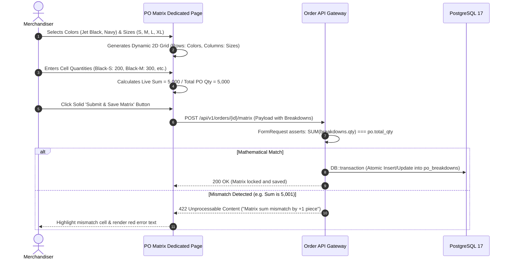
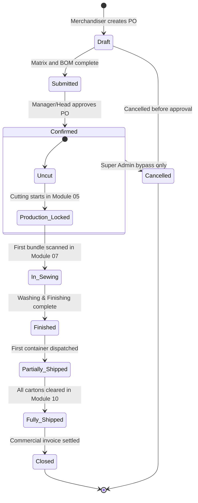
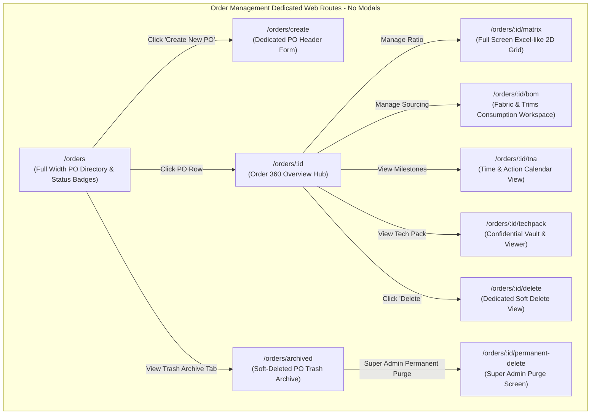
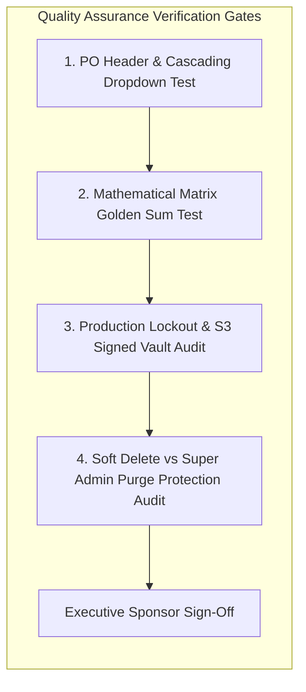

# Software Requirements Specification (SRS)
## Module 03: Enterprise Order Management & Merchandising Engine
### প্রজেক্ট: TraceFlow RMG — Precision Fabric-to-Freight Garment Intelligence
**ডকুমেন্ট রেফারেন্স:** `TFRMG-SRS-MOD03-V2.0`  
**ডকুমেন্ট ভার্সন:** 2.0 (Global Tier-1 Enterprise Production Edition)  
**স্ট্যান্ডার্ড কমপ্লায়েন্স:** ISO/IEC/IEEE 29148:2018, SOC 2 Type II, Apparel Merchandising Commercial Standards, Time-and-Action (T&A) Governance  
**স্ট্যাটাস:** Approved & Production-Ready  
**টার্গেট আর্কিটেকচার:** Laravel 13 (Transaction & Event-Driven Engine) + React 19 / Vite (Excel-like Matrix SPA) + PostgreSQL 17 + Redis 7 + Private S3 Storage  

---

## ১. ডকুমেন্ট গভর্নেন্স ও সংস্করণ নিয়ন্ত্রণ (Document Governance & Control)

### ১.১ সংস্করণ ইতিহাস (Revision History)
| ভার্সন | তারিখ | পর্যালোচনাকারী | পরিবর্তনের বিবরণ ও পরিধি |
|---|---|---|---|
| `v1.0` | 2026-09-02 | Lead Business Analyst | প্রাথমিক PO ক্রিয়েশন ও কালার-সাইজ ম্যাট্রিক্স ড্রাফট। |
| `v2.0` | 2026-09-02 | Principal Enterprise Architect | 100% এন্টারপ্রাইজ রূপান্তর: ডায়নামিক কালার-সাইজ ম্যাট্রিক্স (Golden Sum Rule), বিল অফ মেটেরিয়ালস (BOM), টাইম অ্যান্ড অ্যাকশন (T&A) মাইলস্টোন, প্রডাকশন লকআউট স্টেট মেশিন, টু-টিয়ার ডিলিশন গভর্নেন্স (Super Admin Hard Delete Guard), নো-মোডাল ডেডিকেটেড রুট আর্কিটেকচার, পিউর সার্ভার-সাইড ভ্যালিডেশন, কমপ্লিট PostgreSQL 17 DDL এবং RTM সংযোজন। |

### ১.২ অনুমোদনকারী ব্যক্তিবর্গ (Sign-Off & Approvals)
- **Executive Sponsor / Project Owner:** Executive Sponsor, RMG Systems
- **Lead Solution Architect:** AI Solution Architect
- **Head of Merchandising & Marketing:** Global Apparel Sourcing Division
- **Head of Production Planning & Control (PPC):** Central Factory Planning
- **Chief Financial Officer (CFO):** Commercial Export & Finance Division

---

## ২. নির্বাহী সারসংক্ষেপ ও কৌশলগত উদ্দেশ্য (Executive Summary & Strategic Scope)

### ২.১ কৌশলগত প্রেক্ষাপট (Strategic Context)
গার্মেন্টস ম্যানুফ্যাকচারিং শিল্পে বাণিজ্যিক অর্ডার ম্যানেজমেন্ট হলো কমার্শিয়াল মার্চেন্ডাইজিং এবং ফ্যাক্টরি ফ্লোর এক্সিকিউশনের মধ্যকার সংযোগকারী সেতু (Bridge)। বায়ার কর্তৃক প্রেরিত Purchase Order (PO) যখন সিস্টেমে এন্ট্রি হয়, তখন তা কেবল একটি সাধারণ বিক্রয় আদেশ থাকে না; এটি স্বয়ংক্রিয়ভাবে রূপান্তর হয়:
1. **সুনির্দিষ্ট কালার-সাইজ রেশিও ব্রেকডাউন (Color-Size Matrix):** যা কাটিং ফ্লোরে ফেব্রিক লেইং ও প্রতিটি একক পিসের জন্য অনন্য বারকোড/কিউআর টিকিট তৈরির ভিত্তি তৈরি করে।
2. **বিল অফ মেটেরিয়ালস (BOM):** ফেব্রিক ও ট্রিমস (বোতাম, জিপার, সুতা, লেবেল) রিকুইজিশন নির্ধারণ করে।
3. **টাইম অ্যান্ড অ্যাকশন (T&A) ক্যালেন্ডার:** ফেব্রিক ইন-হাউস, পিপি স্যাম্পল এপ্রুভাল, প্ল্যান্ড কাট ডেট (PCD), সুইং লাইন লোডিং এবং এক্স-ফ্যাক্টরি শিপমেন্টের ডেডলাইন লক করে।

**Module 03: Order Management & Merchandising** সিস্টেমের দর্শন হলো:
> **"Precision Commercial Ingestion: Flawless Ratios, Zero Production Waste, Absolute On-Time Delivery."**

```mermaid
graph TB
    subgraph Commercial Ingestion (Module 03)
        direction TB
        BPO[Buyer Purchase Order - Header] --> CSM[Dynamic Color-Size Matrix Engine]
        CSM -->|Golden Rule Validation| VAL{Sum Equality Checked}
        VAL -->|Valid| BOM[Bill of Materials - Fabric & Trims]
        VAL -->|Valid| TNA[Time & Action - Critical Path Engine]
        VAL -->|Valid| PO_CONF[PO Confirmed & Production Locked]
    end

    subgraph Factory Floor Execution
        direction TB
        PO_CONF --> MOD4[Module 04: Production Planning & Line Layout]
        CSM --> MOD5[Module 05: Cutting Lay & Bundle Ticket Generation]
        BOM --> MOD11[Module 11: Fabric & Trims Store Requisition]
        PO_CONF --> MOD10[Module 10: Packing Carton Ratio & Shipping Mark]
    end
```

---

## ৩. অলঙ্ঘনীয় এন্টারপ্রাইজ আর্কিটেকচারাল নিয়মাবলি (Non-Negotiable Architecture Directives)

প্রজেক্টের গ্লোবাল রুলস এবং এন্টারপ্রাইজ কোয়ালিটি নিশ্চিত করতে নিচের নিয়মগুলো ১০০% অলঙ্ঘনীয়:

### ৩.১ নো মোডালস নীতিমালা (STRICT No Modals / No Popups Rule)
- **জিরো মোডাল পলিসি:** পুরো অর্ডার ম্যানেজমেন্ট মডিউলে কোনো ফর্ম, কনফার্মেশন, কালার-সাইজ ম্যাট্রিক্স গ্রিড, BOM ক্রিয়েশন, বা সাব-স্ক্রিনের জন্য `Modal`, `Dialog`, `Popup`, `Lightbox`, বা `Drawer-over-backdrop` কঠোরভাবে নিষিদ্ধ।
- **ডেডিকেটেড রুট আর্কিটেকচার:** PO তৈরি, কালার-সাইজ ম্যাট্রিক্স ইনপুট, টেক প্যাক ম্যানেজমেন্ট, BOM স্পেসিফিকেশন, T&A টাইমলাইন এডিট, ডিলিট কনফার্মেশন—প্রতিটি ইন্টারঅ্যাকশন একটি সুনির্দিষ্ট ব্রাউজার ইউআরএল এবং ডেডিকেটেড ফুল-স্ক্রিন ভিউতে (Full-Screen Dedicated View) লোড হবে।
- **নেভিগেশন স্ট্যাক:** প্রতিটি পেজে স্ট্যান্ডার্ড ব্যাক বাটন এবং স্ট্রাকচার্ড ব্রেডক্রাম্ব (`Dashboard > Orders > PO-10892 > Color-Size Matrix`) থাকতে হবে যাতে ব্রাউজারের নেটিভ Forward/Back বাটন স্বাভাবিকভাবে কাজ করে এবং ডিপ-লিংক শেয়ারিং সম্ভব হয়।

### ৩.২ পিউর সার্ভার-সাইড ভ্যালিডেশন স্ট্যান্ডার্ড (Pure Server-Side Validation)
- **জিরো ক্লায়েন্ট-সাইড HTML5 ভ্যালিডেশন:** ফ্রন্টএন্ডের কোনো `<form>` বা `<input>` ফিল্ডে ব্রাউজারের ডিফল্ট HTML5 ভ্যালিডেশন অ্যাট্রিবিউট (`required`, `minlength`, `maxlength`, `pattern`, ইত্যাদি) দেওয়া যাবে না। ব্রাউজারের বিল্ট-ইন টুলটিপ পপআপ সম্পূর্ণ নিষিদ্ধ।
- **বাধ্যতামূলক `noValidate`:** সমস্ত ফ্রন্টএন্ড ফর্মে `<form noValidate>` স্পষ্টভাবে যুক্ত থাকতে হবে।
- **একীভূত এরর কন্ট্রাক্ট:** সমস্ত ডাটা ভ্যালিডেশন ব্যাকএন্ড Laravel `FormRequest` ক্লাসের মাধ্যমে পিউর সার্ভার সাইডে ঘটবে। ইনপুট ভুল হলে বা ম্যাট্রিক্স সাম মিস-ম্যাচ হলে সার্ভার থেকে `422 Unprocessable Content` স্ট্যান্ডার্ড RFC 7807 কমপ্লায়েন্ট JSON এরর পাঠানো হবে।
- **ইনলাইন এরর রেন্ডারিং:** ফ্রন্টএন্ড স্বয়ংক্রিয়ভাবে রেসপন্সের ফিল্ড নেম ম্যাপ করে সংশ্লিষ্ট ইনপুট বক্স বা ম্যাট্রিক্স সেলের ঠিক নিচে ক্রিস্প লাল রঙে এরর বার্তা রেন্ডার করবে।

### ৩.৩ ফ্ল্যাট এবং ক্রিস্প ডিজাইন স্ট্যান্ডার্ড (Flat Solid UI Standard)
- **নো গ্রেডিয়েন্ট পলিসি:** কোনো বাটন, কার্ড, হেডার বা সাইডবারে কোনো ধরণের গ্রেডিয়েন্ট কালার ব্যবহার করা যাবে না।
- **সলিড ডিজাইন টোকেনস:** সকল অ্যাকশন বাটন ক্রিস্প ও ফ্ল্যাট সলিড রঙে গঠিত হবে (যেমন: Primary `#2563EB`, Danger `#DC2626`, Success `#16A34A`, Neutral `#475569`, Warning `#D97706`)।
- **১০০% ইংরেজি ইউআই:** ইউজার ইন্টারফেসের সমস্ত লেবেল, ফিল্ড নেম, কলাম হেডার, অ্যাকশন বাটন এবং সিস্টেম নোটিফিকেশন ১০০% প্রফেশনাল আন্তর্জাতিক ইংরেজি ভাষায় (English) হবে।

### ৩.৪ দ্বি-স্তরবিশিষ্ট ডিলিশন গভর্নেন্স (Two-Tier Deletion Architecture)
- **সফট ডিলিট (Soft Delete):** মার্চেন্ডাইজার বা অ্যাডমিনরা অনুমতি সাপেক্ষে কোনো ড্রাফট বা বাতিল হওয়া PO সফট ডিলিট করতে পারবেন (`deleted_at = NOW()`), যা ট্র্যাশ আর্কাইভে জমা হবে।
- **পার্মানেন্ট হার্ড ডিলিট (STRICT Super Admin Only):** ডাটাবেস থেকে স্থায়ীভাবে রো মুছে ফেলার ক্ষমতা **কেবলমাত্র `Super Admin` এর থাকবে**।
- **প্রোডাকশন রেফারেনশিয়াল প্রোটেকশন গার্ড (Referential Check):** যদি কোনো PO-এর বিপরীতে ফ্যাক্টরি ফ্লোরে কাটিং শুরু হয়ে থাকে (`cut_registers` বা `bundle_tickets` এ এন্ট্রি থাকে), তবে সিস্টেম পার্মানেন্ট ডিলিট **সম্পূর্ণ ব্লক** করবে এবং `409 Conflict` রিটার্ন করবে।

---

## ৪. ইউজার পারসোনা ও এক্সেস হায়ারার্কি (User Personas & Scoping)

| পারসোনা (Persona) | ইন্টারফেস ও ডিভাইস | প্রমাণীকরণ মাধ্যম (Auth Method) | প্রিভিলেজ বাউন্ডারি (Privilege Scope) |
|---|---|---|---|
| **Merchandising Manager** | Web Browser (Desktop) | Emp ID / Username + Password | PO ক্রিয়েশন, ফুল এডিট, কস্টিং অনুমোদন, BOM ফাইনাল সাইনঅফ। |
| **Merchandiser / Executive** | Web Browser (Desktop) | Emp ID / Username + Password | PO ডাটা এন্ট্রি, কালার-সাইজ ম্যাট্রিক্স ইনপুট, টেক প্যাক ও আর্টওয়ার্ক আপলোড। |
| **Planning / PPC Lead** | Web Browser (Desktop) | Emp ID / Username + Password | কনফার্মড PO এবং কালার-সাইজ রেশিও ভিউ (Read-Only), T&A প্ল্যান্ড কাট ডেট সিঙ্ক। |
| **Cutting Floor In-Charge** | Web Browser / Tablet | Emp ID / Username + Password | কালার-সাইজ ব্রেকডাউন স্পেক ও কাটিং টার্গেট ভিউ (Read-Only)। |
| **Super Admin** | Web Browser (Desktop) | Username + Password + TOTP 2FA | গ্লোবাল বাইপাস, কনফার্মড PO স্ট্যাটাস ফোর্স আনলক, পার্মানেন্ট পার্জ। |

---

## ৫. বিস্তারিত ফাংশনাল রিকোয়ারমেন্টস (Detailed Functional Specifications)

### ৫.১ সাব-মডিউল: পারচেজ অর্ডার হেডার ও কমার্শিয়াল প্রফাইল (PO Header Master)

#### ৫.১.১ স্পেসিফিকেশন ও বিজনেস লজিক
- **REQ-ORD-HDR-001 (Unique PO & Internal Job Tracking):**
  - **Buyer PO Number:** বায়ার কর্তৃক প্রদত্ত কমার্শিয়াল নম্বর (যেমন: `PO-HNM-2026-9901`)। বায়ার ভিত্তিক ইউনিক।
  - **Internal Job Tracking Number:** সিস্টেম স্বয়ংক্রিয়ভাবে একটি নন-ডুপ্লিকেট ফ্যাক্টরি জব নম্বর জেনারেট করবে (যেমন: `TF-JOB-2026-00421`) যা কাটিং ও সুইং লাইনে অভ্যন্তরীণ ট্র্যাকিং কোড হিসেবে ব্যবহৃত হবে।
- **REQ-ORD-HDR-002 (Cascading Master Data Bindings):**
  - বায়ার সিলেক্ট করার পূর্বে স্টাইল ড্রপডাউন নিষ্ক্রিয় থাকবে।
  - বায়ার নির্বাচন করলে সিস্টেম স্বয়ংক্রিয়ভাবে শুধুমাত্র ওই বায়ারের অনুমোদিত সক্রিয় স্টাইলসমূহ লোড করবে (Module 02 ইন্টিগ্রেশন)।
  - স্টাইল সিলেক্ট করার সাথে সাথে স্টাইলের ক্যাটাগরি, বেস এসএমভি (Base SMV) এবং সংশ্লিষ্ট বায়ারের কারেন্সি স্বয়ংক্রিয়ভাবে স্ক্রিনে পপুলেটেড হবে।
- **REQ-ORD-HDR-003 (Commercial & Shipment Attributes):**
  - মোট অর্ডার পরিমাণ (Total Quantity: Integer, Mandatory, > 0)।
  - একক FOB প্রাইস (Unit FOB Price: Numeric, 2 decimal places, USD/EUR)।
  - মোট অর্ডার ভ্যালু (Total Order Value = Total Quantity × Unit FOB Price)।
  - এক্স-ফ্যাক্টরি ডেট (Ex-Factory Date / Target Shipment Date): বাধ্যতামূলক, অবশ্যই বর্তমান বা ভবিষ্যৎ তারিখ হতে হবে।
  - শিপমেন্ট মোড: `SEA`, `AIR`, `SEA-AIR`, `COURIER`।
  - পোর্ট অফ লোডিং (POL: e.g. Chittagong Port, Dhaka Airport) এবং পোর্ট অফ ডিসচার্জ (POD: e.g. Hamburg, New York, Felixstowe)।

---

### ৫.২ সাব-মডিউল: ডায়নামিক কালার-সাইজ রেশিও ম্যাট্রিক্স ইঞ্জিন (Color-Size Matrix Engine)

এটি পুরো গার্মেন্ট ট্রেসিবিলিটি সিস্টেমের সবচেয়ে গাণিতিকভাবে সংবেদনশীল সাব-মডিউল।



#### ৫.২.১ স্পেসিফিকেশন ও বিজনেস লজিক
- **REQ-ORD-MTX-001 (Dynamic 2D Grid Generation):**
  - ব্যবহারকারী বায়ারের অনুমোদিত কালারসমূহ (মডিউল ০২ কালার লাইব্রেরি) থেকে মাল্টি-সিলেক্ট করবেন।
  - সাইজ গ্রুপ থেকে সংশ্লিষ্ট সাইজসমূহ (মডিউল ০২ সাইজ লাইব্রেরি) সিলেক্ট করবেন। ওভেন বটমসের ক্ষেত্রে ইনসিম/লেংথ কম্বিনেশন অন্তর্ভুক্ত হবে (e.g. 32x30L, 32x32L)।
  - সিস্টেম স্বয়ংক্রিয়ভাবে একটি টু-ডাইমেনশনাল এক্সেল-স্টাইল গ্রিড তৈরি করবে যেখানে Y-অক্ষে থাকবে কালার এবং X-অক্ষে থাকবে সাইজ।
- **REQ-ORD-MTX-002 (The Golden Mathematical Sum Rule):**
  - `SUM(All Matrix Cell Quantities) MUST EXACTLY EQUAL purchase_orders.total_qty`।
  - যদি ১ পিসও কম বা বেশি হয়, তবে ব্যাকএন্ড ডাটাবেসে সেভ করা সম্পূর্ণ প্রত্যাখ্যান করবে এবং `422 Unprocessable Content` থ্রো করবে।
- **REQ-ORD-MTX-003 (Live Real-Time Math Calculator):**
  - ফ্রন্টএন্ডে প্রতিটি সেলে ইনপুট দেওয়ার সাথে সাথে কলাম-ভিত্তিক মোট, রো-ভিত্তিক মোট এবং গ্র্যান্ড টোটাল রিয়েল-টাইমে আপডেট হবে।
  - যতক্ষণ পর্যন্ত গ্র্যান্ড টোটাল ও হেডার টোটাল সমান না হবে, ততক্ষণ ফ্রন্টএন্ডে "Mismatch: X pcs remaining" সতর্কবার্তা লাল রঙে প্রদর্শিত থাকবে।
- **REQ-ORD-MTX-004 (Cutting Allowance / Overage Percentage):**
  - বায়ার ও ফ্যাক্টরি পলিসি অনুযায়ী ঐচ্ছিক কাটিং এলাউন্স বা ওভার-কাট পার্সেন্টেজ নির্ধারণ করা যাবে (যেমন: +৩% এলাউন্স)।
  - সিস্টেম মূল অর্ডারের পাশাপাশি প্ল্যান্ড কাট কোয়ান্টিটি (`planned_cut_qty = total_qty * 1.03`) স্বয়ংক্রিয়ভাবে হিসাব করে রাখবে যা কাটিং ফ্লোরে ফেব্রিক ইস্যুর সময়ে ব্যবহৃত হবে।

---

### ৫.৩ সাব-মডিউল: বিল অফ মেটেরিয়ালস ও কনসাম্পশন স্পেসিফিকেশন (BOM Engine)

#### ৫.৩.১ স্পেসিফিকেশন ও বিজনেস লজিক
- **REQ-ORD-BOM-001 (Multi-Tier Material Classification):**
  - **ফেব্রিক BOM:** Shell Fabric, Lining Fabric, Pocketing Fabric, Interlining/Fusible।
  - **ট্রিমস ও এক্সেসরিজ BOM:** Sewing Thread (Spun Polyester/Core Spun), Buttons, Metal Zippers, Rivets, Main Woven Label, Care Label, Hangtag, Price Ticket, Polybag, Master Carton।
- **REQ-ORD-BOM-002 (Unit Consumption & Wastage Formula):**
  - প্রতি পিস কাপড়ের জন্য ইউনিট কনসাম্পশন (যেমন: ১.৪৫ গজ প্রতি পিস) এবং অনুমোদিত ওয়েস্টেজ পার্সেন্টেজ (Wastage %: e.g. 4.5%)।
  - মোট রিকোয়ার্ড ফেব্রিক ফর্মুলা:
    $$\text{Total Required Fabric} = \text{Total PO Qty} \times \text{Unit Consumption} \times \left(1 + \frac{\text{Wastage \%}}{100}\right)$$
  - এটি সেভ হওয়ার সাথে সাথে Module 11 (Fabric Store) এ স্বয়ংক্রিয়ভাবে ম্যাটেরিয়াল রিকুইজিশন হিসেবে রেজিস্টার্ড হবে।

---

### ৫.৪ সাব-মডিউল: টাইম অ্যান্ড অ্যাকশন ক্যালেন্ডার (T&A Critical Path Engine)

#### ৫.৪.১ স্পেসিফিকেশন ও বিজনেস লজিক
- **REQ-ORD-TNA-001 (Automated Milestone Backward Scheduling):**
  - এক্স-ফ্যাক্টরি ডেট (Ex-Factory Date) ইনপুট দেওয়ার সাথে সাথে সিস্টেম স্বয়ংক্রিয়ভাবে ব্যাকওয়ার্ড শিডিউলিংয়ের মাধ্যমে ৭টি মূল মাইলস্টোন টার্গেট ডেট গণনা করবে:
    1. *Fabric & Trims In-House Deadline:* এক্স-ফ্যাক্টরির ৪৫ দিন পূর্বে।
    2. *Lab Dip & Strike-Off Approval:* এক্স-ফ্যাক্টরির ৪০ দিন পূর্বে।
    3. *Pre-Production (PP) Sample Approval:* এক্স-ফ্যাক্টরির ৩০ দিন পূর্বে।
    4. *Planned Cut Date (PCD):* এক্স-ফ্যাক্টরির ২৫ দিন পূর্বে।
    5. *Sewing Line Feeding Date:* এক্স-ফ্যাক্টরির ২১ দিন পূর্বে।
    6. *Washing & Finishing Handover Date:* এক্স-ফ্যাক্টরির ৭ দিন পূর্বে।
    7. *Final Quality Audit (AQL Final Inspection):* এক্স-ফ্যাক্টরির ৩ দিন পূর্বে।
- **REQ-ORD-TNA-002 (Milestone Status & Delayed Warning Alerts):**
  - প্রতিটি মাইলস্টোনের স্ট্যাটাস: `Pending`, `On-Track`, `Completed`, `Delayed`।
  - যদি কোনো মাইলস্টোন তার টার্গেট ডেট অতিক্রম করে এবং স্ট্যাটাস `Completed` না হয়, তবে সিস্টেম সংশ্লিষ্ট মার্চেন্ডাইজার ও প্রোডাকশন হেডকে ড্যাশবোর্ডে হাই-প্রায়োরিটি অ্যাম্বার/রেড অ্যালার্ট ফ্ল্যাগ দেখাবে।

---

### ৫.৫ সাব-মডিউল: অর্ডার লাইফসাইকেল ও প্রোডাকশন লকআউট স্টেট মেশিন (Order State Machine)



#### ৫.৫.১ স্পেসিফিকেশন ও বিজনেস লজিক
- **REQ-ORD-LC-001 (Strict Production Lockout Policy):**
  - যখন একটি PO `Confirmed` স্ট্যাটাসে থাকে এবং কাটিং ফ্লোরে (Module 05) এর বিপরীতে ফেব্রিক লেইং বা প্রথম বান্ডল টিকিট প্রিন্ট হয়ে যায়, তখন সিস্টেম স্বয়ংক্রিয়ভাবে PO-এর `total_qty` এবং `po_breakdowns` ম্যাট্রিক্স **সম্পূর্ণরূপে ফ্রিজ (Locked)** করে দেবে।
  - লক হওয়া অবস্থায় কোনো মার্চেন্ডাইজার বা সাধারণ অ্যাডমিন কোয়ান্টিটি পরিবর্তন করতে পারবেন না। এপিআই সরাসরি `403 Forbidden` ("Cannot modify order. Production has already commenced.") রিটার্ন করবে।
- **REQ-ORD-LC-002 (Official PO Revision / Amendment Control):**
  - যদি বায়ার জরুরি ভিত্তিতে কোয়ান্টিটি বৃদ্ধি করে বা ডেলিভারি ডেট পরিবর্তন করে, তবে তা সরাসরি এডিট করা যাবে না; একটি অফিসিয়াল **PO Amendment (`po_revisions`)** তৈরি করতে হবে।
  - সিস্টেম বর্তমান অর্ডার স্টেট স্ন্যাপশট নিয়ে নতুন রিভিশন নম্বর (e.g. `Rev-01`, `Rev-02`) ইস্যু করবে এবং কমার্শিয়াল হেডের অনুমোদনের পর তা কার্যকর হবে।

---

### ৫.৬ সাব-মডিউল: কনফিডেন্সিয়াল টেক প্যাক ও আর্টওয়ার্ক ভল্ট (Tech Pack Vault)

#### ৫.৬.১ স্পেসিফিকেশন ও বিজনেস লজিক
- **REQ-ORD-TP-001 (Secure Cloud Storage Integration):**
  - টেক প্যাক ও বায়ার আর্টওয়ার্ক ফাইলসমূহ কখনো লোকাল সার্ভার ড্রাইভে জমা হবে না; এগুলো সরাসরি Amazon S3 বা Google Cloud Storage-এর প্রাইভেট বাকেটে সংরক্ষিত হবে।
- **REQ-ORD-TP-002 (Short-Lived Temporary Signed URLs):**
  - টেক প্যাকের মূল বাকেট ১০০% প্রাইভেট থাকবে। কোনো অনুমোদিত ব্যবহারকারী ফাইল ডাউনলোড বা ভিউ করতে চাইলে ব্যাকএন্ড একটি ৩০-মিনিট মেয়াদি ক্রিপ্টোগ্রাফিক টাইমড-সাইনড ইউআরএল (`Storage::temporaryUrl(..., now()->addMinutes(30))`) জেনারেট করে দেবে।
  - ৩০ মিনিট পর ইউআরএলটি স্বয়ংক্রিয়ভাবে বাতিল হয়ে যাবে, যার ফলে আন-অথোরাইজড লিংক শেয়ারিং অসম্ভব হবে।
- **REQ-ORD-TP-003 (Tech Pack Version Control):**
  - বায়ার যখন টেক প্যাকের নতুন স্পেক পাঠাবে, তখন পূর্ববর্তী টেক প্যাক ফাইল ওভাররাইট না হয়ে ভার্সনিং হবে (e.g. `TP-ZARA-DNM-V1.pdf`, `TP-ZARA-DNM-V2.pdf`) এবং আপলোডার ব্যবহারকারীর `emp_id` ও টাইমস্ট্যাম্প সংরক্ষিত থাকবে।

---

## ৬. প্রোডাকশন-গ্রেড ডাটাবেস আর্কিটেকচার ও DDL (Database Engineering)

নিচে PostgreSQL 17 এর জন্য সম্পূর্ণ প্রোডাকশন-রেডি DDL স্ক্রিপ্ট দেওয়া হলো। এতে ফরেন কি, ইউনিকনেস কনস্ট্রেইন্টস, ইনডেক্সিং এবং সফট-ডিলিট সাপোর্ট রয়েছে।

### ৬.১ PostgreSQL 17 Production Schema (Complete DDL)

```sql
-- Enable Cryptographic Extension for UUID v4
CREATE EXTENSION IF NOT EXISTS "pgcrypto";

-- ----------------------------------------------------------------------
-- 1. Table: purchase_orders (PO Header Master)
-- ----------------------------------------------------------------------
CREATE TABLE purchase_orders (
    id UUID PRIMARY KEY DEFAULT gen_random_uuid(),
    job_no VARCHAR(50) NOT NULL,                 -- Auto internal factory job no (e.g. TF-JOB-2026-0042)
    po_number VARCHAR(100) NOT NULL,             -- Buyer Commercial PO Number
    buyer_id UUID NOT NULL REFERENCES buyers(id) ON DELETE RESTRICT,
    style_id UUID NOT NULL REFERENCES styles(id) ON DELETE RESTRICT,
    season_id UUID REFERENCES seasons(id) ON DELETE RESTRICT,
    total_qty INTEGER NOT NULL CHECK (total_qty > 0),
    planned_cut_qty INTEGER NOT NULL CHECK (planned_cut_qty >= total_qty),
    unit_price NUMERIC(10, 2) NOT NULL CHECK (unit_price >= 0),
    total_value NUMERIC(14, 2) NOT NULL CHECK (total_value >= 0),
    currency VARCHAR(10) NOT NULL DEFAULT 'USD',
    order_date DATE NOT NULL,
    ex_factory_date DATE NOT NULL,
    shipment_mode VARCHAR(20) NOT NULL DEFAULT 'SEA', -- SEA, AIR, SEA-AIR, COURIER
    port_of_loading VARCHAR(100),
    port_of_discharge VARCHAR(100),
    status VARCHAR(30) NOT NULL DEFAULT 'Draft',     -- Draft, Submitted, Confirmed, In_Production, Shipped, Cancelled
    is_production_locked BOOLEAN NOT NULL DEFAULT FALSE,
    active_revision SMALLINT NOT NULL DEFAULT 0,
    created_by UUID REFERENCES users(id) ON DELETE RESTRICT,
    created_at TIMESTAMPTZ NOT NULL DEFAULT CURRENT_TIMESTAMP,
    updated_at TIMESTAMPTZ NOT NULL DEFAULT CURRENT_TIMESTAMP,
    deleted_at TIMESTAMPTZ
);

CREATE UNIQUE INDEX uq_po_job_no_active ON purchase_orders (job_no) WHERE deleted_at IS NULL;
CREATE UNIQUE INDEX uq_po_buyer_number_active ON purchase_orders (buyer_id, UPPER(po_number)) WHERE deleted_at IS NULL;
CREATE INDEX idx_po_status ON purchase_orders (status);
CREATE INDEX idx_po_buyer_id ON purchase_orders (buyer_id);
CREATE INDEX idx_po_style_id ON purchase_orders (style_id);
CREATE INDEX idx_po_ex_factory_date ON purchase_orders (ex_factory_date);
CREATE INDEX idx_po_deleted_at ON purchase_orders (deleted_at);

-- ----------------------------------------------------------------------
-- 2. Table: po_breakdowns (Color-Size Ratio Matrix)
-- ----------------------------------------------------------------------
CREATE TABLE po_breakdowns (
    id UUID PRIMARY KEY DEFAULT gen_random_uuid(),
    po_id UUID NOT NULL REFERENCES purchase_orders(id) ON DELETE CASCADE,
    color_id UUID NOT NULL REFERENCES colors(id) ON DELETE RESTRICT,
    size_id UUID NOT NULL REFERENCES sizes(id) ON DELETE RESTRICT,
    order_qty INTEGER NOT NULL CHECK (order_qty >= 0),
    planned_cut_qty INTEGER NOT NULL CHECK (planned_cut_qty >= order_qty),
    created_at TIMESTAMPTZ NOT NULL DEFAULT CURRENT_TIMESTAMP,
    updated_at TIMESTAMPTZ NOT NULL DEFAULT CURRENT_TIMESTAMP
);

CREATE UNIQUE INDEX uq_po_color_size ON po_breakdowns (po_id, color_id, size_id);
CREATE INDEX idx_po_breakdowns_po_id ON po_breakdowns (po_id);
CREATE INDEX idx_po_breakdowns_color_id ON po_breakdowns (color_id);
CREATE INDEX idx_po_breakdowns_size_id ON po_breakdowns (size_id);

-- ----------------------------------------------------------------------
-- 3. Table: po_boms (Bill of Materials Specification)
-- ----------------------------------------------------------------------
CREATE TABLE po_boms (
    id UUID PRIMARY KEY DEFAULT gen_random_uuid(),
    po_id UUID NOT NULL REFERENCES purchase_orders(id) ON DELETE CASCADE,
    material_type VARCHAR(40) NOT NULL, -- Shell Fabric, Pocketing, Button, Zipper, Label, Polybag
    item_description VARCHAR(200) NOT NULL,
    supplier_name VARCHAR(120),
    unit_consumption NUMERIC(10, 4) NOT NULL CHECK (unit_consumption > 0),
    uom_id UUID NOT NULL REFERENCES units_of_measure(id) ON DELETE RESTRICT,
    wastage_percent NUMERIC(5, 2) NOT NULL DEFAULT 3.00,
    total_required_qty NUMERIC(14, 4) NOT NULL CHECK (total_required_qty > 0),
    status VARCHAR(30) NOT NULL DEFAULT 'Pending_Sourcing', -- Pending_Sourcing, Ordered, In_House
    created_at TIMESTAMPTZ NOT NULL DEFAULT CURRENT_TIMESTAMP,
    updated_at TIMESTAMPTZ NOT NULL DEFAULT CURRENT_TIMESTAMP
);

CREATE INDEX idx_po_boms_po_id ON po_boms (po_id);
CREATE INDEX idx_po_boms_material_type ON po_boms (material_type);

-- ----------------------------------------------------------------------
-- 4. Table: po_milestones_tna (Time & Action Milestones)
-- ----------------------------------------------------------------------
CREATE TABLE po_milestones_tna (
    id UUID PRIMARY KEY DEFAULT gen_random_uuid(),
    po_id UUID NOT NULL REFERENCES purchase_orders(id) ON DELETE CASCADE,
    milestone_name VARCHAR(100) NOT NULL, -- Fabric In-house, PP Sample Approval, Planned Cut Date, etc.
    target_date DATE NOT NULL,
    actual_date DATE,
    status VARCHAR(30) NOT NULL DEFAULT 'Pending', -- Pending, Completed, Delayed
    remarks TEXT,
    updated_by UUID REFERENCES users(id) ON DELETE SET NULL,
    created_at TIMESTAMPTZ NOT NULL DEFAULT CURRENT_TIMESTAMP,
    updated_at TIMESTAMPTZ NOT NULL DEFAULT CURRENT_TIMESTAMP
);

CREATE UNIQUE INDEX uq_po_milestone ON po_milestones_tna (po_id, milestone_name);
CREATE INDEX idx_po_milestones_po_id ON po_milestones_tna (po_id);
CREATE INDEX idx_po_milestones_target_date ON po_milestones_tna (target_date);

-- ----------------------------------------------------------------------
-- 5. Table: po_tech_packs (Confidential Tech Pack Documents)
-- ----------------------------------------------------------------------
CREATE TABLE po_tech_packs (
    id UUID PRIMARY KEY DEFAULT gen_random_uuid(),
    po_id UUID NOT NULL REFERENCES purchase_orders(id) ON DELETE CASCADE,
    version_label VARCHAR(30) NOT NULL DEFAULT 'v1.0',
    file_name VARCHAR(255) NOT NULL,
    storage_s3_key VARCHAR(500) NOT NULL,
    file_size_bytes BIGINT NOT NULL,
    file_mime_type VARCHAR(100) NOT NULL,
    uploaded_by UUID REFERENCES users(id) ON DELETE RESTRICT,
    created_at TIMESTAMPTZ NOT NULL DEFAULT CURRENT_TIMESTAMP
);

CREATE INDEX idx_po_tech_packs_po_id ON po_tech_packs (po_id);

-- ----------------------------------------------------------------------
-- 6. Table: po_revisions (Official Amendment Audit Trail)
-- ----------------------------------------------------------------------
CREATE TABLE po_revisions (
    id UUID PRIMARY KEY DEFAULT gen_random_uuid(),
    po_id UUID NOT NULL REFERENCES purchase_orders(id) ON DELETE CASCADE,
    revision_no SMALLINT NOT NULL,
    reason_for_change TEXT NOT NULL,
    snapshot_data JSONB NOT NULL, -- Complete historical snapshot before amendment
    approved_by UUID REFERENCES users(id) ON DELETE RESTRICT,
    created_at TIMESTAMPTZ NOT NULL DEFAULT CURRENT_TIMESTAMP
);

CREATE UNIQUE INDEX uq_po_revision ON po_revisions (po_id, revision_no);
CREATE INDEX idx_po_revisions_po_id ON po_revisions (po_id);
```

---

## ৭. সম্পূর্ণ এপিআই কন্ট্রাক্ট স্পেসিফিকেশন (Exhaustive API Contracts)

### ৭.১ সাধারণ রিকোয়েস্ট ও রেসপন্স আর্কিটেকচার
- **অথেনটিকেশন:** `Authorization: Bearer <sanctum_token>`
- **কমন হেডার্স:** `Accept: application/json`, `Content-Type: application/json`
- **স্ট্যান্ডার্ড পেজিনেশন ও কুয়েরি ফিল্টারিং:**
  `GET /api/v1/orders?page=1&per_page=20&sort=-created_at&filter[buyer_id]={uuid}&filter[status]=Confirmed&search=PO-HNM`

---

### ৭.২ অর্ডার হেডার ও ক্রিয়েশন এন্ডপয়েন্টস

#### ৭.২.১ নতুন পারচেজ অর্ডার তৈরি (Create PO Header)
- **মেথড ও ইউআরএল:** `POST /api/v1/orders`
- **রিকোয়েস্ট বডি:**
  ```json
  {
    "po_number": "PO-HNM-2026-9901",
    "buyer_id": "9b1d3f6a-4b11-4890-a210-98dfa710bc89",
    "style_id": "4c2a1e8f-1290-4810-b991-8812a4009911",
    "season_id": "1d2f3a4b-5c6d-7e8f-9a0b-1c2d3e4f5a6b",
    "total_qty": 5000,
    "unit_price": 7.50,
    "currency": "USD",
    "order_date": "2026-09-02",
    "ex_factory_date": "2026-11-15",
    "shipment_mode": "SEA",
    "port_of_loading": "Chittagong Port",
    "port_of_discharge": "Hamburg Port"
  }
  ```
- **সার্ভার-সাইড ভ্যালিডেশন রুলস (Laravel FormRequest):**
  ```php
  public function rules(): array
  {
      return [
          'po_number'         => ['bail', 'required', 'string', 'min:3', 'max:100', 'unique:purchase_orders,po_number'],
          'buyer_id'          => ['bail', 'required', 'uuid', 'exists:buyers,id'],
          'style_id'          => ['bail', 'required', 'uuid', 'exists:styles,id'],
          'season_id'         => ['bail', 'nullable', 'uuid', 'exists:seasons,id'],
          'total_qty'         => ['bail', 'required', 'integer', 'min:1'],
          'unit_price'        => ['bail', 'required', 'numeric', 'min:0'],
          'currency'          => ['bail', 'required', 'string', 'in:USD,EUR,GBP,CAD'],
          'order_date'        => ['bail', 'required', 'date'],
          'ex_factory_date'   => ['bail', 'required', 'date', 'after_or_equal:order_date'],
          'shipment_mode'     => ['bail', 'required', 'string', 'in:SEA,AIR,SEA-AIR,COURIER'],
          'port_of_loading'   => ['bail', 'nullable', 'string', 'max:100'],
          'port_of_discharge' => ['bail', 'nullable', 'string', 'max:100'],
      ];
  }
  ```
- **সাকসেস রেসপন্স (`201 Created`):**
  ```json
  {
    "success": true,
    "status_code": 201,
    "message": "Purchase order header created successfully. Please input color-size ratio matrix.",
    "data": {
      "id": "e81d7f12-9b22-4a90-8811-37b92a4f0099",
      "job_no": "TF-JOB-2026-00421",
      "po_number": "PO-HNM-2026-9901",
      "total_qty": 5000,
      "total_value": 37500.00,
      "status": "Draft"
    }
  }
  ```

---

### ৭.৩ কালার-সাইজ ম্যাট্রিক্স এন্ডপয়েন্টস (The Mathematical Engine)

#### ৭.৩.১ কালার-সাইজ ম্যাট্রিক্স সাবমিট ও ভ্যালিডেশন
- **মেথড ও ইউআরএল:** `POST /api/v1/orders/{id}/matrix`
- **রিকোয়েস্ট বডি:**
  ```json
  {
    "allowance_percent": 3.0,
    "breakdowns": [
      { "color_id": "c100a982-192a-4f90-8800-291740011283", "size_id": "s100a982-192a-4f90-8800-291740011283", "order_qty": 1500 },
      { "color_id": "c100a982-192a-4f90-8800-291740011283", "size_id": "s200a982-192a-4f90-8800-291740011283", "order_qty": 1500 },
      { "color_id": "c200a982-192a-4f90-8800-291740011283", "size_id": "s100a982-192a-4f90-8800-291740011283", "order_qty": 1000 },
      { "color_id": "c200a982-192a-4f90-8800-291740011283", "size_id": "s200a982-192a-4f90-8800-291740011283", "order_qty": 1000 }
    ]
  }
  ```
- **কঠোর গাণিতিক ভ্যালিডেশন লজিক (Custom Validation Rule):**
  ```php
  // Total of breakdowns must EXACTLY equal po.total_qty
  $sumBreakdown = collect($request->breakdowns)->sum('order_qty');
  if ($sumBreakdown !== $purchaseOrder->total_qty) {
      throw ValidationException::withMessages([
          'matrix' => ["The sum of all color-size quantities ($sumBreakdown) does not match total PO quantity ({$purchaseOrder->total_qty}). Difference: " . ($sumBreakdown - $purchaseOrder->total_qty) . " pcs."]
      ]);
  }
  ```
- **সাকসেস রেসপন্স (`200 OK`):**
  ```json
  {
    "success": true,
    "status_code": 200,
    "message": "Color-size matrix successfully verified and saved under ACID transaction.",
    "data": {
      "po_id": "e81d7f12-9b22-4a90-8811-37b92a4f0099",
      "total_verified_qty": 5000,
      "total_planned_cut_qty": 5150,
      "breakdowns_count": 4
    }
  }
  ```
- **গাণিতিক অসঙ্গতিতে এরর রেসপন্স (`422 Unprocessable Content`):**
  ```json
  {
    "success": false,
    "status_code": 422,
    "error_code": "MATRIX_SUM_MISMATCH",
    "message": "Validation Failed.",
    "errors": {
      "matrix": [
        "The sum of all color-size quantities (5001) does not match total PO quantity (5000). Difference: +1 pcs."
      ]
    }
  }
  ```

---

### ৭.৪ বিল অফ মেটেরিয়ালস ও টেক প্যাক এন্ডপয়েন্টস

- **`POST /api/v1/orders/{id}/boms`** — ফেব্রিক ও ট্রিমস কনসাম্পশন রিকুইজিশন সংরক্ষণ।
- **`GET /api/v1/orders/{id}/boms`** — সম্পূর্ণ BOM টেবিল ও ম্যাটেরিয়াল প্রকিউরমেন্ট স্ট্যাটাস।
- **`POST /api/v1/orders/{id}/techpack`** (মুল্টিপার্ট ফর্ম আপলোড)
  - প্রাইভেট S3 বাকেটে আপলোড এবং ডাটাবেসে `po_tech_packs` এন্ট্রিকরণ।
- **`GET /api/v1/orders/{id}/techpack/download`**
  - **সাকসেস রেসপন্স (`200 OK`):**
    ```json
    {
      "success": true,
      "data": {
        "file_name": "TechPack_HNM_Denim_v1.pdf",
        "download_url": "https://traceflow-private-vault.s3.amazonaws.com/techpacks/2026/09/...?X-Amz-Signature=...",
        "expires_in_seconds": 1800
      }
    }
    ```

---

### ৭.৫ অর্ডার লাইফসাইকেল ও ডিলিশন এন্ডপয়েন্টস (Two-Tier Deletion Architecture)

#### ৭.৫.১ অর্ডার সফট ডিলিট (Soft Delete PO)
- **মেথড ও ইউআরএল:** `DELETE /api/v1/orders/{id}`
- **পারমিশন:** `orders.delete`
- **শর্ত:** শুধুমাত্র `Draft` বা `Cancelled` স্ট্যাটাসের PO সফট ডিলিট করা যাবে।
- **সাকসেস রেসপন্স (`200 OK`):**
  ```json
  {
    "success": true,
    "status_code": 200,
    "message": "Purchase order soft-deleted successfully and moved to trash archive."
  }
  ```

#### ৭.৫.২ অর্ডার পার্মানেন্ট ডিলিট (STRICT Super Admin Only Purge)
- **মেথড ও ইউআরএল:** `DELETE /api/v1/orders/{id}/force-delete`
- **অথরাইজেশন:** **STRICTLY `Super Admin` ROLE ONLY**
- **রিকোয়েস্ট বডি:**
  ```json
  {
    "super_admin_password": "MySuperAdminSecretPassword#2026"
  }
  ```
- **প্রোডাকশন হিস্টোরি থাকলে ব্লকিং রেসপন্স (`409 Conflict`):**
  ```json
  {
    "success": false,
    "status_code": 409,
    "error_code": "CANNOT_PURGE_RUNNING_ORDER",
    "message": "Cannot permanently purge this Purchase Order because cutting, bundle generation, or sewing line operations have already started. Soft-delete or archiving is enforced."
  }
  ```

---

## ৮. ইউজার ইন্টারফেস ও স্ক্রিন-বাই-স্ক্রিন স্পেসিফিকেশন (STRICT NO MODALS)

অর্ডার ম্যানেজমেন্টের প্রতিটি স্ক্রিন সম্পূর্ণ ডেডিকেটেড রুটে ওপেন হবে। কোনো মোডাল বা স্লাইড-আউট পপআপ উইথ ব্যাকড্রপ থাকবে না।



### ৮.১ স্ক্রিন স্পেসিফিকেশন টেবিল

| রুট (Route Path) | স্ক্রিনের নাম | মূল উপাদান ও কনফিগারেশন | নো-মোডাল ডিজাইন নিশ্চিতকরণ |
|---|---|---|---|
| `/orders` | Purchase Order Directory | - ফুল-উইডথ ডাটা গ্রিড<br/>- কলাম: **Job No, Buyer PO, Buyer, Style, Total Qty, Value ($), Ex-Factory, Status, Actions**<br/>- সলিড গ্রিন "Create New PO" বোতাম (`bg-emerald-600`)<br/>- ফিল্টার: বায়ার, স্টাইল, ডেট রেঞ্জ, স্ট্যাটাস ব্যাজ | পেজিনেশন ও অ্যাকশন সবকিছু ফুল পেজে পরিচালিত হবে। |
| `/orders/create` | Dedicated PO Header Creation | - `<form noValidate>` আর্কিটেকচার<br/>- বায়ার সিলেক্ট করলে স্টাইল লোড হবে<br/>- টোটাল কোয়ান্টিটি, FOB ইউনিট প্রাইস, এক্স-ফ্যাক্টরি ডেট পিকার, শিপমেন্ট পোর্টস<br/>- সলিড ব্লু "Save & Proceed to Matrix" বোতাম (`bg-blue-600`)<br/>- সলিড গ্রে "Cancel / Back" বোতাম | সম্পূর্ণ আলাদা পেজ। ব্রেডক্রাম্ব নেভিগেশন সহ। |
| `/orders/:id` | Order 360 Master Hub | - অর্ডারের যাবতীয় কমার্শিয়াল ও প্রোডাকশন প্রগ্রেস কার্ডস<br/>- টপ স্ট্যাটাস ট্র্যাকার (Draft -> Confirmed -> Cutting -> Sewing -> Shipped)<br/>- সাব-ট্যাব নেভিগেশন বাটনস: Matrix, BOM, T&A, Tech Pack | ফুল-স্ক্রিন এন্টারপ্রাইজ ড্যাশবোর্ড ভিউ। |
| `/orders/:id/matrix` | Full-Screen 2D Ratio Grid | - ডায়নামিক টু-ডাইমেনশনাল এক্সেল-স্টাইল গ্রিড (কালার × সাইজ)<br/>- রিয়েল-টাইম কলাম ও রো অটো-সামিং<br/>- নিচে বড় বোল্ড হেডারে লাইভ স্ট্যাটাস: `Allocated: 5000 / Total: 5000 Pcs` (গ্রিন হলে ম্যাচ, রেড হলে মিসম্যাচ)<br/>- সলিড ব্লু "Verify & Save Matrix" বোতাম | সম্পূর্ণ ডেডিকেটেড ফুল-স্ক্রিন ম্যাট্রিক্স ওয়ার্কস্পেস। |
| `/orders/:id/bom` | Bill of Materials Workspace | - ফেব্রিক ও ট্রিমস কনসাম্পশন ইনপুট টেবিল<br/>- UOM সিলেক্টর ও অটো-ক্যালকুলেটেড টোটাল রিকোয়ার্ড কোয়ান্টিটি<br/>- সলিড ব্লু "Save BOM Specifications" বোতাম | আলাদা ফুল-স্ক্রিন BOM পেজ। |
| `/orders/:id/tna` | Time & Action Calendar View | - ৭টি ক্রিটিক্যাল মাইলস্টোনের টাইমলাইন চার্ট<br/>- টার্গেট ডেট বনাম একচুয়াল ডেট ট্র্যাকার<br/>- ডিলেড অ্যালার্ট স্ট্যাটাস ব্যাজ | ফুল-স্ক্রিন T&A ভিজ্যুয়ালাইজেশন পেজ। |
| `/orders/:id/techpack` | Tech Pack & Document Vault | - ড্র্যাগ-অ্যান্ড-ড্রপ ফাইল ড্রপজোন (PDF/JPG, Max 50MB)<br/>- ভার্সন হিস্ট্রি টেবিল (v1.0, v2.0, ইত্যাদি)<br/>- "Generate Signed Download Link" সিকিউর বাটন | ফুল-স্ক্রিন ফাইল ভল্ট পেজ। |
| `/orders/:id/delete` | PO Soft-Delete Confirmation | - অ্যাম্বার সতর্কবার্তা ব্যানার<br/>- অর্ডার সফট ডিলিট সংক্রান্ত নিয়মাবলি<br/>- সলিড অ্যাম্বার "Confirm Soft Delete" বোতাম | ডেডিকেটেড ফুল-স্ক্রিন কনফার্মেশন। নো পপআপ। |
| `/orders/:id/permanent-delete` | PO Permanent Purge Console | - **Super Admin অনলি স্ক্রিন** (অন্যদের জন্য 403 Forbidden)<br/>- গাঢ় লাল অ্যালার্ট ব্যানার<br/>- সুপার অ্যাডমিন পাসওয়ার্ড ইনপুট ফিল্ড<br/>- প্রোডাকশন হিস্টোরি চেকার স্ট্যাটাস ব্যাজ<br/>- সলিড ডার্ক-রেড "Purge Order Permanently" বোতাম | ফুল-স্ক্রিন হাইপার-সিকিউরড পার্জ ভিউ। |
| `/orders/archived` | Soft-Deleted Orders Archive | - সফট ডিলিট হওয়া অর্ডারের আলাদা তালিকা<br/>- "Restore Order" বোতাম (`bg-amber-600`)<br/>- Super Admin এর জন্য "Purge Permanently" বোতাম | সম্পূর্ণ আলাদা আর্কাইভ পেজ। |

---

## ৯. নন-ফাংশনাল রিকোয়ারমেন্টস (Enterprise NFRs & SLAs)

### ৯.১ পারফরম্যান্স ও কনকারেন্সি বাজেট (Performance Budgets)
- **ম্যাট্রিক্স গাণিতিক ভ্যালিডেশন লেটেন্সি:** ১০০+ কালার-সাইজ সেলের অ্যারে ভ্যালিডেশন এবং ডাটাবেস কমিট সর্বোচ্চ **৫০ মিলিসেকেন্ড (50ms)**।
- **ড্রপডাউন ও পেজিনেশন লেটেন্সি:** ১০,০০০+ অর্ডারের ডাটাবেসে পেজ লোড টাইম সর্বোচ্চ **১০০ মিলিসেকেন্ড (100ms)**।
- **টেক প্যাক সাইনড ইউআরএল জেনারেশন:** সর্বোচ্চ **২০ মিলিসেকেন্ড (20ms)**।

### ৯.২ ডাটা ইন্টিগ্রিটি ও ট্রানজ্যাকশন আইসোলেশন (ACID Guarantee)
- PO হেডার এবং `po_breakdowns` এর ৫০+ রো ইনসার্ট অবশ্যই একটি একক ডাটাবেস ট্রানজ্যাকশনের (`DB::transaction`) মধ্যে সম্পন্ন হতে হবে। কোনো কারণে ১টি সেলে এরর হলে সম্পূর্ণ ট্রানজ্যাকশন রোলব্যাক হবে।
- কনকারেন্ট এডিট প্রতিরোধে প্যাসিভ অপ্টিমিস্টিক লকিং (`updated_at` ভার্সন চেক) সক্রিয় থাকবে।

---

## ১০. ফেইলিওর মোড ও রেসপন্স অ্যানালাইসিস (FMEA Matrix)

| ফেইলিওর সিনারিও (Failure Mode) | সম্ভাব্য প্রভাব (Impact) | তীব্রতা (Severity) | সিস্টেমের স্বয়ংক্রিয় প্রতিরক্ষা মেকানিজম (Mitigation Mechanism) |
|---|---|---|---|
| মার্চেন্ডাইজার ভুলবশত ম্যাট্রিক্সে ১ পিস কম বা বেশি এন্ট্রি দেওয়া | কাটিং ফ্লোরে ফেব্রিক অপচয় বা শর্ট-শিপমেন্ট | High | গোল্ডেন সাম ভ্যালিডেশন রুল কার্যকর হবে। ব্যাকএন্ড `422 Unprocessable Content` দিয়ে সেভ আটকে দেবে। |
| কাটিং চলাকালীন কেউ PO-এর টোটাল কোয়ান্টিটি পরিবর্তন করা | হাজার হাজার একক পিস কিউআর টিকিটের হিসাব ভেঙে যাওয়া | Critical | প্রোডাকশন লকআউট গার্ড কার্যকর হবে। `cut_registers` এ এন্ট্রি থাকা অবস্থায় যেকোনো আপডেট কল `403 Forbidden` পাবে। |
| টেক প্যাক ডাউনলোড লিংক পাবলিকলি লিক হওয়া | বায়ারের গোপনীয় ডিজাইন ও কপিরাইট লঙ্ঘন | Critical | S3 প্রাইভেট বাকেট এবং ৩০-মিনিট টাইমড-সাইনড ইউআরএল এনফোর্স করা হয়েছে। মেয়াদ শেষ হলে লিংক নিষ্ক্রিয় হয়ে যাবে। |
| রানিং অর্ডারের ডাটাবেস রো ডিলিট করার চেষ্টা | ফ্যাক্টরির সমস্ত কাটিং ও সুইং ডাটা অনাথ হয়ে যাওয়া | Critical | ডাটাবেস ফরেন-কি রেস্ট্রিক্ট গার্ড কার্যকর হবে। সিস্টেমে `409 Conflict` এসে ডিলিট অপারেশন স্থায়ীভাবে ব্লক করবে। |

---

## ১১. রিকোয়ারমেন্টস ট্রেসেবিলিটি ম্যাট্রিক্স (Requirements Traceability Matrix - RTM)

| রিকোয়ারমেন্ট আইডি | ডাটাবেস টেবিল | ব্যাকএন্ড এপিআই এন্ডপয়েন্ট | ফ্রন্টএন্ড ডেডিকেটেড রুট | QA টেস্ট কেস আইডি |
|---|---|---|---|---|
| `REQ-ORD-HDR-001` (Unique PO & Job) | `purchase_orders` | `POST /api/v1/orders` | `/orders/create` | `TC-ORD-001` |
| `REQ-ORD-MTX-002` (Golden Sum Rule) | `po_breakdowns` | `POST /api/v1/orders/{id}/matrix` | `/orders/:id/matrix` | `TC-ORD-002` |
| `REQ-ORD-BOM-001` (BOM Specifications) | `po_boms` | `POST /api/v1/orders/{id}/boms` | `/orders/:id/bom` | `TC-ORD-003` |
| `REQ-ORD-TNA-001` (T&A Milestones) | `po_milestones_tna`| `GET /api/v1/orders/{id}/tna` | `/orders/:id/tna` | `TC-ORD-004` |
| `REQ-ORD-LC-001` (Production Lockout) | `purchase_orders` | `PUT /api/v1/orders/{id}` | `/orders/:id` | `TC-ORD-005` |
| `REQ-ORD-TP-002` (S3 Signed URL) | `po_tech_packs` | `GET /api/v1/orders/{id}/techpack/download` | `/orders/:id/techpack` | `TC-ORD-006` |
| `REQ-DEL-002` (Super Admin Hard Purge)| `purchase_orders` | `DELETE /api/v1/orders/{id}/force-delete` | `/orders/:id/permanent-delete` | `TC-ORD-007` |

---

## ১২. কিউএ গ্রহণযোগ্যতার মানদণ্ড (Acceptance Criteria & Verification Plan)



### ১২.১ কোর টেস্ট কেসসমূহ (Core Test Execution Steps)

1. **`TC-ORD-001` (Cascading Style Dropdown & Unique PO Validation):**
   - **ধাপ ১:** বায়ার হিসেবে "H&M" নির্বাচন করা। -> **ফলাফল:** স্টাইল ড্রপডাউন আনলক হবে এবং শুধুমাত্র H&M এর স্টাইলগুলো দেখাবে।
   - **ধাপ ২:** একই বায়ারের অধীনে ইতোমধ্যে বিদ্যমান কোনো PO নম্বর ইনপুট দেওয়া। -> **ফলাফল:** ব্যাকএন্ড থেকে `422 Unprocessable Content` আসবে এবং "The PO number has already been taken" প্রদর্শিত হবে।
2. **`TC-ORD-002` (Golden Sum Rule Mathematical Strictness Test):**
   - **ধাপ ১:** হেডার টোটাল কোয়ান্টিটি ৫,০০০ পিস।
   - **ধাপ ২:** কালার-সাইজ ম্যাট্রিক্সে এমন সেল ভ্যালু দেওয়া যার যোগফল ৪,৯৯৯ পিস।
   - **ধাপ ৩:** "Save Matrix" বাটনে ক্লিক করা।
   - **প্রত্যাশিত ফলাফল:** কোনো ব্রাউজার পপআপ আসবে না। ব্যাকএন্ড থেকে `422 Unprocessable Content` আসবে এবং "The sum of all color-size quantities (4999) does not match total PO quantity (5000). Difference: -1 pcs" ইনলাইন লাল রঙে রেন্ডার হবে।
   - **ধাপ ৪:** যোগফল নিখুঁত ৫,০০০ পিস করে পুনরায় সেভ করা। -> সফলভাবে সেভ হবে।
3. **`TC-ORD-003` (BOM Consumption Calculation Verification):**
   - **ধাপ:** ১ পিসের জন্য Shell Fabric কনসাম্পশন ১.৫০ গজ এবং ৩% ওয়েস্টেজ দিয়ে সেভ করা (Total Qty = 5,000)।
   - **প্রত্যাশিত ফলাফল:** সিস্টেমে `total_required_qty` স্বয়ংক্রিয়ভাবে ৭,৭২৫ গজ গণনা করে সেভ করবে।
4. **`TC-ORD-005` (Production Lockout Guard Enforcement):**
   - **ধাপ ১:** একটি PO `Confirmed` স্ট্যাটাসে নিয়ে কাটিং ফ্লোরে এর বিপরীতে একটি ডামি বান্ডল টিকিট তৈরি করা।
   - **ধাপ ২:** মার্চেন্ডাইজার হিসেবে লগইন করে ওই PO-এর কোয়ান্টিটি পরিবর্তনের জন্য API রিকোয়েস্ট পাঠানো।
   - **প্রত্যাশিত ফলাফল:** API সরাসরি `403 Forbidden` রিটার্ন করবে এবং বলবে "Cannot modify order. Production has already commenced."
5. **`TC-ORD-006` (Tech Pack S3 Signed URL Expiry Test):**
   - **ধাপ ১:** টেক প্যাক ডাউনলোড লিংক জেনারেট করা এবং ফাইল ডাউনলোড পরীক্ষা করা। -> সফল হবে।
   - **ধাপ ২:** ৩১ মিনিট পর ওই একই ডাউনলোড লিংকে প্রবেশ করার চেষ্টা করা।
   - **প্রত্যাশিত ফলাফল:** Amazon S3 থেকে `403 Access Denied / Request has expired` আসবে (সিকিউরিটি লিক প্রতিরোধ)।
6. **`TC-ORD-007` (Super Admin Only Permanent Purge with Production Guard):**
   - **ধাপ ১:** নন-সুপার অ্যাডমিন দ্বারা রানিং PO-এর উপর `force-delete` চালানো -> `403 Forbidden`।
   - **ধাপ ২:** সুপার অ্যাডমিন দ্বারা কাটিং শুরু হওয়া PO-এর উপর `force-delete` চালানো -> `409 Conflict` সহ ব্লক হবে।
   - **ধাপ ৩:** ড্রাফট থাকা ডামি PO-এর উপর সঠিক পাসওয়ার্ড দিয়ে `force-delete` চালানো -> ডাটাবেস থেকে রো সম্পূর্ণ মুছে যাবে এবং অডিট লগ তৈরি হবে।
7. **`TC-UI-001` (Zero Modals Compliance Audit):**
   - **ধাপ:** PO ক্রিয়েট, ম্যাট্রিক্স এডিট, BOM ইনপুট, টেক প্যাক ডাউনলোড ও ডিলিট কনফার্মেশন ফ্লো পরীক্ষা করা।
   - **প্রত্যাশিত ফলাফল:** পুরো মডিউলের কোথাও কোনো `Modal`, `Dialog` বা `Popup` থাকবে না। প্রতিটি ফিচার ডেডিকেটেড রুটে ফুল-স্ক্রিন হিসেবে কাজ করবে।

---

*(ডকুমেন্ট সমাপ্ত — Module 03: Enterprise Order Management & Merchandising Engine)*
