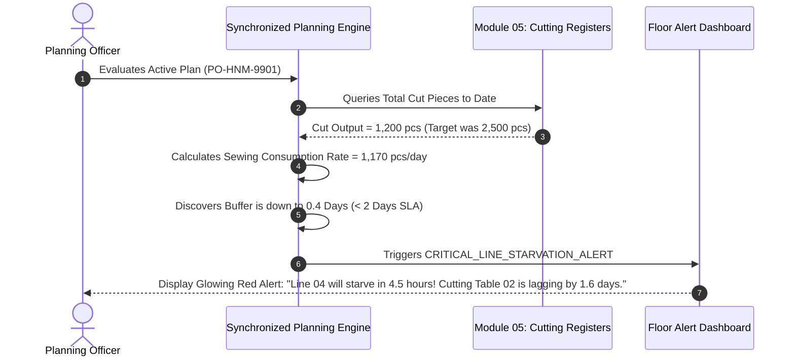
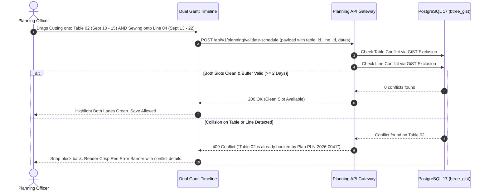
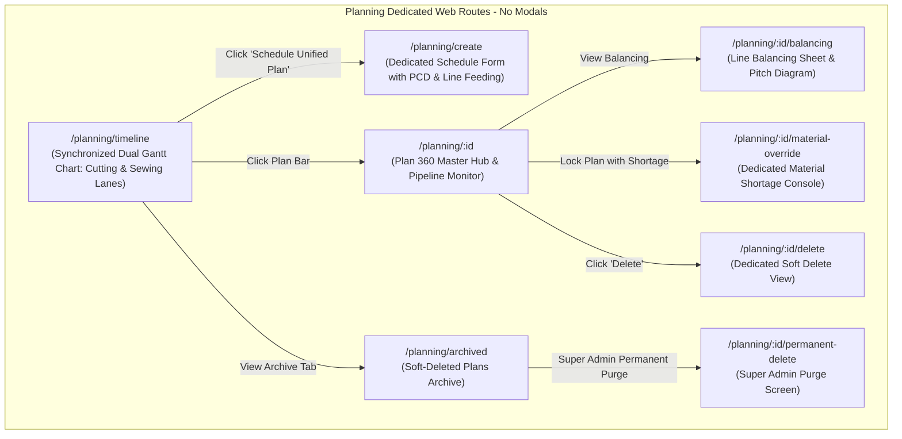
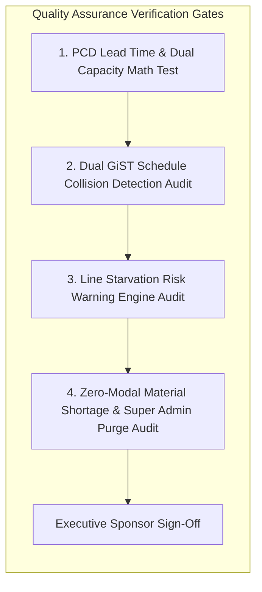

# Software Requirements Specification (SRS)
## Module 04: Production Planning & Industrial Engineering (IE) Engine
### প্রজেক্ট: TraceFlow RMG — Precision Fabric-to-Freight Garment Intelligence
**ডকুমেন্ট রেফারেন্স:** `TFRMG-SRS-MOD04-V2.1`  
**ডকুমেন্ট ভার্সন:** 2.1 (Global Tier-1 Enterprise Production Edition — Unified Cutting & Sewing Master Scheduling)  
**স্ট্যান্ডার্ড কমপ্লায়েন্স:** ISO/IEC/IEEE 29148:2018, FastReact/GSDCost Apparel Planning Standards, Line Balancing & Pitch Time Engineering, WIP Buffer & Starvation Governance  
**স্ট্যাটাস:** Approved & Production-Ready  
**টার্গেট আর্কিটেকচার:** Laravel 13 (Dual Pipeline Scheduling Engine + Domain Services) + React 19 / Vite (Synchronized Dual Gantt Timeline SPA) + PostgreSQL 17 + Redis 7  

---

## ১. ডকুমেন্ট গভর্নেন্স ও সংস্করণ নিয়ন্ত্রণ (Document Governance & Control)

### ১.১ সংস্করণ ইতিহাস (Revision History)
| ভার্সন | তারিখ | পর্যালোচনাকারী | পরিবর্তনের বিবরণ ও পরিধি |
|---|---|---|---|
| `v1.0` | 2026-09-02 | Lead Business Analyst | প্রাথমিক লাইন অ্যালোকেশন ও SMV ক্যালকুলেশন ড্রাফট। |
| `v2.0` | 2026-09-02 | Principal Enterprise Architect | 100% এন্টারপ্রাইজ রূপান্তর: র‍্যাম্প-আপ লার্নিং কার্ভ (Learning Curve Ramp-up), পিচ টাইম ও লাইন ব্যালেন্সিং এফিসিয়েন্সি এনালাইজার, পোস্টগ্রিস GiST রেঞ্জ এক্সক্লুশন শিডিউল কনফ্লিক্ট ডিটেকশন, ম্যাটেরিয়াল রেডিনেস গেটকিপিং উইথ ডেডিকেটেড ওভাররাইড কনসোল (নো মোডাল), টু-টিয়ার ডিলিশন গভর্নেন্স (Super Admin Hard Delete Guard), কমপ্লিট PostgreSQL 17 DDL এবং RTM সংযোজন। |
| `v2.1` | 2026-09-02 | Principal Enterprise Architect | **কাটিং ও সুইং সিঙ্কড মাস্টার প্ল্যান (Unified Cutting & Sewing Pipeline):** Planned Cut Date (PCD) লিড-টাইম বাফার রুল (২-দিনের ন্যূনতম WIP বাফার), কাটিং টেবিল ক্যাপাসিটি শিডিউলিং, সুইং লাইন স্টারভেশন প্রোঅ্যাক্টিভ অ্যালার্ট ইঞ্জিন (Line Starvation Alert), এবং ডুয়াল GiST এক্সক্লুশন কনস্ট্রেইন্ট সংযোজন। |

### ১.২ অনুমোদনকারী ব্যক্তিবর্গ (Sign-Off & Approvals)
- **Executive Sponsor / Project Owner:** Executive Sponsor, RMG Systems
- **Lead Solution Architect:** AI Solution Architect
- **Head of Industrial Engineering (IE):** Work-Study & Line Engineering Division
- **Head of Production Planning & Control (PPC):** Central Scheduling Operations
- **Head of Cutting & CAD Division:** Pattern, Spreading & Cutting Floor Operations
- **General Manager (Factory Operations):** Manufacturing Plant Operations

---

## ২. নির্বাহী সারসংক্ষেপ ও কৌশলগত উদ্দেশ্য (Executive Summary & Strategic Scope)

### ২.১ কৌশলগত প্রেক্ষাপট (Strategic Context)
গার্মেন্টস ম্যানুফ্যাকচারিং প্ল্যান্টে লাভজনকতা ও সময়মতো শিপমেন্ট (On-Time In-Full - OTIF) নিশ্চিত করার মূল চালিকাশক্তি হলো **Production Planning & Industrial Engineering (IE)**। বাণিজ্যিক মার্চেন্ডাইজিং (Module 03) যখন একটি অর্ডার কনফার্ম করে, তখন ফ্লোর ম্যানেজমেন্টের কাছে কাটিং এবং সুইং কখনোই দুটি বিচ্ছিন্ন প্রক্রিয়া নয়—এরা একটি অত্যন্ত সূক্ষ্ম **সিঙ্ক্রোনাইজড পাইপলাইন (Synchronized Pipeline)**।

যদি কাটিং প্ল্যান সুইং প্ল্যানের সাথে নিখুঁতভাবে সমন্বিত না থাকে, তবে দুটি বড় বিপর্যয় ঘটে:
1. **Line Starvation (সুইং লাইন অলস হয়ে পড়া):** সুইং লাইনে কাপড় সেলাইয়ের কাজ প্রস্তুত কিন্তু কাটিং ফ্লোর থেকে নির্ধারিত সাইজ ও কালারের কাটা পার্টস সময়মতো ইনপুট দিতে পারছে না। ফলে শত শত অপারেটর অলস বসে থাকে এবং ফ্যাক্টরির বিশাল আর্থিক ক্ষতি হয়।
2. **Excess WIP Stagnation (অতিরিক্ত কাজের জটলা):** সুইং লাইনের গতির চেয়ে অতিরিক্ত কাপড় কেটে ফ্লোরে ফেলে রাখলে ধুলোবালি, দাগ পড়া এবং কাপড়ের থান শেড মিসিং হওয়ার ঝুঁকি তৈরি হয়।

**Module 04: Production Planning & IE** সিস্টেমের দর্শন হলো:
> **"Synchronized Cutting-to-Sewing Flow, Zero Idle Line Hours, Flawless WIP Buffer Governance."**

```mermaid
graph TB
    subgraph Unified Planning & IE Master Pipeline (Module 04)
        direction TB
        PO_CONF[Confirmed PO from Module 03] --> CAP_ENG[Capacity & Ramp-Up Math Engine]
        
        subgraph Pipeline Stage 1: Cutting Table Scheduling
            CAP_ENG --> PCD[Planned Cut Date - PCD Calculation]
            PCD --> TBL_SCHED[Cutting Table Allocation & Daily Cut Target]
        end
        
        subgraph Pipeline Buffer: WIP Supermarket
            TBL_SCHED --> BUFFER[The 2-Day Cut Panel WIP Buffer Rule]
        end
        
        subgraph Pipeline Stage 2: Sewing Line Loading
            BUFFER --> SEW_SCHED[Sewing Line Allocation & Feeding Date]
            SEW_SCHED --> RAMP_UP[4-Day Efficiency Ramp-Up Curve]
            RAMP_UP --> PITCH[Line Balancing & Bottleneck Analysis]
        end
        
        subgraph Proactive Pipeline Monitoring
            BUFFER -.->|Lag Detected| STARVE_ALERT[Line Starvation Warning Engine]
            STARVE_ALERT --> PPC_DASH[PPC & Floor Alert Dashboard]
        end
        
        PITCH --> MAT_GATE{Material Readiness Gatekeeper}
        MAT_GATE -->|100% In-House| LOCK[Locked Production Plan]
        MAT_GATE -->|Shortage| OVR_PAGE[Dedicated Risk Override View]
    end

    subgraph Factory Execution Trigger
        LOCK --> MOD5[Module 05: Cutting Lay Release & Cad Marker Plan]
        LOCK --> MOD7[Module 07: Sewing Line Real-time Hourly Target Feeding]
        LOCK --> MOD11[Module 11: Store Issue Order Trigger]
    end
```

---

## ৩. অলঙ্ঘনীয় এন্টারপ্রাইজ আর্কিটেকচারাল নিয়মাবলি (Non-Negotiable Architecture Directives)

প্রজেক্টের গ্লোবাল রুলস এবং এন্টারপ্রাইজ কোয়ালিটি নিশ্চিত করতে নিচের নিয়মগুলো ১০০% অলঙ্ঘনীয়:

### ৩.১ নো মোডালস নীতিমালা (STRICT No Modals / No Popups Rule)
- **জিরো মোডাল পলিসি:** পুরো প্ল্যানিং ও আইই মডিউলে কোনো ফর্ম, কনফার্মেশন, শিডিউল কনফ্লিক্ট অ্যালার্ট, ম্যাটেরিয়াল শর্টেজ ওয়ার্নিং, বা সাব-স্ক্রিনের জন্য `Modal`, `Dialog`, `Popup`, `Lightbox`, বা `Drawer-over-backdrop` কঠোরভাবে নিষিদ্ধ।
- **ডেডিকেটেড রুট আর্কিটেকচার:** প্ল্যান তৈরি, কাটিং ও সুইং সিঙ্কড গ্যান্ট টাইমলাইন, লাইন ব্যালেন্সিং পিচ ডায়াগ্রাম, ম্যাটেরিয়াল রেডিনেস অডিট, শর্টেজ ওভাররাইড কনসোল, এবং ডিলিট কনফার্মেশন—প্রতিটি ইন্টারঅ্যাকশন একটি সুনির্দিষ্ট ব্রাউজার ইউআরএল এবং ডেডিকেটেড ফুল-স্ক্রিন ভিউতে (Full-Screen Dedicated View) লোড হবে।
- **নেভিগেশন স্ট্যাক:** প্রতিটি পেজে স্ট্যান্ডার্ড ব্যাক বাটন এবং স্ট্রাকচার্ড ব্রেডক্রাম্ব (`Dashboard > Planning > Line-04 > Line Balancing Sheet`) থাকতে হবে যাতে ব্রাউজারের নেটিভ Forward/Back বাটন স্বাভাবিকভাবে কাজ করে এবং ডিপ-লিংক শেয়ারিং সম্ভব হয়।

### ৩.২ পিউর সার্ভার-সাইড ভ্যালিডেশন স্ট্যান্ডার্ড (Pure Server-Side Validation)
- **জিরো ক্লায়েন্ট-সাইড HTML5 ভ্যালিডেশন:** ফ্রন্টএন্ডের কোনো `<form>` বা `<input>` ফিল্ডে ব্রাউজারের ডিফল্ট HTML5 ভ্যালিডেশন অ্যাট্রিবিউট (`required`, `minlength`, `maxlength`, `pattern`, ইত্যাদি) দেওয়া যাবে না। ব্রাউজারের বিল্ট-ইন টুলটিপ পপআপ সম্পূর্ণ নিষিদ্ধ।
- **বাধ্যতামূলক `noValidate`:** সমস্ত ফ্রন্টএন্ড ফর্মে `<form noValidate>` স্পষ্টভাবে যুক্ত থাকতে হবে।
- **একীভূত এরর কন্ট্রাক্ট:** সমস্ত গাণিতিক হিসাব ও ডেট ওভারল্যাপ ভ্যালিডেশন ব্যাকএন্ড Laravel `FormRequest` ক্লাসের মাধ্যমে পিউর সার্ভার সাইডে ঘটবে। ইনপুট ভুল হলে বা শিডিউল কনফ্লিক্ট হলে সার্ভার থেকে `422 Unprocessable Content` অথবা `409 Conflict` স্ট্যান্ডার্ড RFC 7807 কমপ্লায়েন্ট JSON এরর পাঠানো হবে।
- **ইনলাইন এরর রেন্ডারিং:** ফ্রন্টএন্ড স্বয়ংক্রিয়ভাবে রেসপন্সের ফিল্ড নেম ম্যাপ করে সংশ্লিষ্ট ইনপুট বক্স বা টাইমলাইন ব্লকের ঠিক নিচে ক্রিস্প লাল রঙে এরর বার্তা রেন্ডার করবে।

### ৩.৩ ফ্ল্যাট এবং ক্রিস্প ডিজাইন স্ট্যান্ডার্ড (Flat Solid UI Standard)
- **নো গ্রেডিয়েন্ট পলিসি:** কোনো বাটন, কার্ড, হেডার বা সাইডবারে কোনো ধরণের গ্রেডিয়েন্ট কালার ব্যবহার করা যাবে না।
- **সলিড ডিজাইন টোকেনস:** সকল অ্যাকশন বাটন ক্রিস্প ও ফ্ল্যাট সলিড রঙে গঠিত হবে (যেমন: Primary `#2563EB`, Danger `#DC2626`, Success `#16A34A`, Neutral `#475569`, Warning `#D97706`)।
- **১০০% ইংরেজি ইউআই:** ইউজার ইন্টারফেসের সমস্ত লেবেল, ফিল্ড নেম, কলাম হেডার, অ্যাকশন বাটন এবং সিস্টেম নোটিফিকেশন ১০০% প্রফেশনাল আন্তর্জাতিক ইংরেজি ভাষায় (English) হবে।

### ৩.৪ দ্বি-স্তরবিশিষ্ট ডিলিশন গভর্নেন্স (Two-Tier Deletion Architecture)
- **সফট ডিলিট (Soft Delete):** আইই বা প্ল্যানিং অ্যাডমিনরা অনুমতি সাপেক্ষে কোনো আন-লকড ড্রাফট প্ল্যান সফট ডিলিট করতে পারবেন (`deleted_at = NOW()`), যা ট্র্যাশ আর্কাইভে জমা হবে।
- **পার্মানেন্ট হার্ড ডিলিট (STRICT Super Admin Only):** ডাটাবেস থেকে স্থায়ীভাবে প্ল্যান রো মুছে ফেলার ক্ষমতা **কেবলমাত্র `Super Admin` এর থাকবে**।
- **প্রোডাকশন রেফারেনশিয়াল প্রোটেকশন গার্ড (Referential Check):** যদি কোনো প্ল্যানের বিপরীতে কাটিং ফ্লোরে ফেব্রিক লেইং শুরু হয়ে যায় (Module 05) অথবা সুইং ফ্লোরে (Module 07) অলরেডি বান্ডল স্ক্যান হয়ে থাকে, তবে সিস্টেম পার্মানেন্ট ডিলিট **সম্পূর্ণ ব্লক** করবে এবং `409 Conflict` রিটার্ন করবে।

---

## ৪. ইউজার পারসোনা ও এক্সেস হায়ারার্কি (User Personas & Scoping)

| পারসোনা (Persona) | ইন্টারফেস ও ডিভাইস | প্রমাণীকরণ মাধ্যম (Auth Method) | প্রিভিলেজ বাউন্ডারি (Privilege Scope) |
|---|---|---|---|
| **Head of IE / Work-Study**| Web Browser (Desktop) | Emp ID / Username + Password | ফুল প্ল্যান ক্রিয়েশন, SMV ফাইনাল সাইনঅফ, লাইন ব্যালেন্সিং ও র‍্যাম্প-আপ অনুমোদন। |
| **Planning Officer / PPC** | Web Browser (Desktop) | Emp ID / Username + Password | কাটিং টেবিল ও সুইং লাইন সিঙ্কড শিডিউলিং, PCD ক্যালকুলেশন, স্টারভেশন মনিটরিং। |
| **Cutting Floor In-Charge** | Floor Tablet / Web | Emp ID / Username + Password | কাটিং টেবিল শিডিউল ভিউ, PCD ও দৈনিক কাটিং টার্গেট ভিউ (Read-Only)। |
| **Factory Operations GM** | Web Browser (Desktop) | Emp ID / Username + Password + PIN | ম্যাটেরিয়াল শর্টেজ থাকা সত্ত্বেও রিস্ক ওভাররাইড অনুমোদন (`override_pin`)। |
| **Sewing Floor Line Chief** | Floor Tablet / Web | Emp ID / Username + Password | লাইনের প্ল্যান, ফিডিং ডেট, আওয়ারলি টার্গেট ও ব্যালেন্সিং পিচ ভিউ (Read-Only)। |
| **Super Admin** | Web Browser (Desktop) | Username + Password + TOTP 2FA | গ্লোবাল বাইপাস, শিডিউল ফোর্স আনলক, পার্মানেন্ট পার্জ। |

---

## ৫. বিস্তারিত ফাংশনাল রিকোয়ারমেন্টস (Detailed Functional Specifications)

### ৫.১ সাব-মডিউল: কাটিং প্ল্যানিং ও টেবিল ক্যাপাসিটি শিডিউলিং (Cutting Capacity & PCD Engine)

কাটিং ফ্লোরে কাপড় কাটার কাজ কখন শুরু হবে এবং কোন টেবিলে কাটা হবে তা নির্ধারণের স্বয়ংক্রিয় ইঞ্জিন।

#### ৫.১.১ স্পেসিফিকেশন ও গাণিতিক ফর্মুলা
- **REQ-PLN-CUT-001 (Planned Cut Date - PCD Lead Time):**
  - সুইং লাইনে কাপড় ফিডিং শুরু হওয়ার পূর্বেই কাটিং সমাপ্তির প্রস্তুতি নিতে হবে।
  - সিস্টেম স্বয়ংক্রিয়ভাবে PCD নির্ধারণ করবে:
    $$\text{PCD (Planned Cut Date)} \le \text{Sewing Start Date} - \text{WIP Buffer Days (Default: 2 Days)}$$
  - যদি কোনো প্ল্যানার সুইং শুরুর তারিখে বা তার পরে কাটিংয়ের তারিখ নির্ধারণ করার চেষ্টা করেন, তবে সিস্টেম ডাটাবেসে সেভ ব্লক করবে এবং HTTP 422 JSON এরর দেবে:
    *"PCD Violation: Planned Cut Date (2026-09-12) must be at least 2 days prior to Sewing Start Date (2026-09-13) to maintain minimum WIP buffer."*
- **REQ-PLN-CUT-002 (Cutting Table Capacity Allocation):**
  - কাটিং টেবিলের দৈর্ঘ্য, মার্কার ক্যাপাসিটি এবং দৈনিক স্প্রেডিং প্লাই সংখ্যার ভিত্তিতে দৈনিক কাটিং টার্গেট হিসাব:
    $$\text{Daily Cutting Target (Pcs/Day)} = \text{Table Shifts} \times \text{Average Plies per Lay} \times \text{Pieces per Marker}$$
  - প্রতিটি কাট অর্ডারের জন্য সুনির্দিষ্ট কাটিং টেবিল (`Table-01`, `Table-02`, ইত্যাদি) বরাদ্দ করা হবে।
- **REQ-PLN-CUT-003 (Size-Color Cutting Sequence Priority):**
  - কাটিং প্ল্যান সুইং লাইনের প্রাথমিক লোডিং সিকোয়েন্স অনুসরণ করবে। যে সাইজ ও কালার সুইং লাইনে প্রথমে ফিড করা হবে (e.g. Navy-Size 32), কাটিং টেবিলে সেই মার্কারটি সবার আগে কাটার জন্য প্রায়োরিটি ১ হিসেবে মার্ক করা হবে।

---

### ৫.২ সাব-মডিউল: কাটিং-টু-সুইং সিঙ্ক্রোনাইজেশন ও স্টারভেশন অ্যালার্ট ইঞ্জিন (WIP & Starvation Engine)

কাটিং ও সুইংয়ের মধ্যকার ইন্টার-ডিপেনডেন্ট পাইপলাইন তদারকি করার রিয়েল-টাইম সিস্টেম।



#### ৫.২.১ স্পেসিফিকেশন ও বিজনেস লজিক
- **REQ-PLN-SYN-001 (The 2-Day Minimum WIP Buffer Rule):**
  - কাটিং ফ্লোর থেকে সুইং ফ্লোরের ফিডিং পয়েন্টে (Matching Store / Supermarket) সর্বদা **কমপক্ষে ২ দিনের কাটিং আউটপুট বাফার হিসেবে সংরক্ষিত থাকতে হবে**।
  - এই বাফার সুইং লাইনের যেকোনো সাময়িক কাটিং মেশিন ব্রেকডাউন বা ফেব্রিক শর্টেজ থেকে লাইনকে সুরক্ষিত রাখে।
- **REQ-PLN-SYN-002 (Proactive Line Starvation Alert Engine):**
  - সিস্টেম প্রতি ঘণ্টায় কাটিং ফ্লোরের প্রকৃত আউটপুট (Module 05 `cut_registers`) বনাম সুইং লাইনের আওয়ারলি কনসাম্পশন রেট ট্র্যাক করবে।
  - যদি কাটিংয়ের ঘাটতির কারণে বাফার স্টক ১ দিনের নিচে নেমে আসে:
    - বাফার ১ থেকে ১.৫ দিন: **Amber Alert (`WARNING_STARVATION_RISK`)**
    - বাফার ১ দিনের নিচে: **Flashing Red Alert (`CRITICAL_LINE_STARVATION`)**
  - ড্যাশবোর্ডে সাথে সাথে প্ল্যানার ও কাটিং ইন-চার্জকে সতর্ক করা হবে যাতে কাটিং টেবিলে অতিরিক্ত শিফট বা ওভারটাইম দিয়ে ঘাটতি পূরণ করা যায়।

---

### ৫.৩ সাব-মডিউল: সুইং ক্যাপাসিটি প্ল্যানিং ও সায়েন্টিফিক আওয়ারলি টার্গেট ক্যালকুলেটর (Sewing Capacity)

#### ৫.৩.১ স্পেসিফিকেশন ও গাণিতিক ফর্মুলা
- **REQ-PLN-SEW-001 (Scientific Target Calculation Formula):**
  - সিস্টেমকে নিচের আন্তর্জাতিক আইই ফর্মুলার ভিত্তিতে স্বয়ংক্রিয়ভাবে ঘণ্টাপ্রতি এবং দৈনিক উৎপাদনের টার্গেট হিসাব করতে হবে:
    $$\text{Hourly Target (Pieces/Hour)} = \left(\frac{\text{Manpower (Operators)} \times 60}{\text{Garment SMV (Minutes)}}\right) \times \left(\frac{\text{Target Efficiency \%}}{100}\right)$$
    $$\text{Daily Target} = \text{Hourly Target} \times \text{Working Hours per Day (e.g. 8 or 10 hrs)}$$
  - *বাস্তব উদাহরণ:*
    - Manpower = ৬০ জন অপারেটর
    - Garment SMV = ২০.০ মিনিট
    - Target Efficiency = ৬৫.০%
    - $\text{Hourly Target} = \left(\frac{60 \times 60}{20}\right) \times 0.65 = 180 \times 0.65 = 117 \text{ pcs/hour}$।
    - ১০ ঘণ্টার শিফটে $\text{Daily Target} = 117 \times 10 = 1,170 \text{ pcs/day}$।
- **REQ-PLN-SEW-002 (Learning Curve / Ramp-Up Efficiency Curve):**
  - ওভেন গার্মেন্টসে নতুন স্টাইল লাইনে লোড করার পর প্রথম দিনেই ৬৫% বা ৭০% দক্ষতা অর্জন করা অসম্ভব।
  - সিস্টেম স্বয়ংক্রিয়ভাবে ৪ থেকে ৭ দিনের স্ট্যান্ডার্ড র‍্যাম্প-আপ প্রোফাইল অ্যাপ্লাই করবে:
    - *Day 1 (Style Setup & Feeding):* ৩০% এফিসিয়েন্সি
    - *Day 2 (Rhythm Stabilization):* ৪৫% এফিসিয়েন্সি
    - *Day 3 (Line Speed Acceleration):* ৫৫% এফিসিয়েন্সি
    - *Day 4 onwards (Peak Steady State):* ৬৫% এফিসিয়েন্সি (Target Efficiency)
  - এই র‍্যাম্প-আপ এফিসিয়েন্সির ভিত্তিতে সিস্টেম স্বয়ংক্রিয়ভাবে অর্ডারের প্রকৃত সমাপ্তি তারিখ (Accurate Projected End Date) নির্ধারণ করবে।

---

### ৫.৪ সাব-মডিউল: ডুয়াল গ্যান্ট টাইমলাইন ও GiST ডাবল-বুকিং প্রতিরোধ (Dual Timeline & GiST)



#### ৫.৪.১ স্পেসিফিকেশন ও বিজনেস লজিক
- **REQ-PLN-SCH-001 (Synchronized Dual Gantt Timeline):**
  - ইউজার ইন্টারফেসে দুটি সমন্বিত লেন থাকবে:
    - **উপরের লেন (Top Lane):** কাটিং টেবিলসমূহ (`Table-01`, `Table-02`...)।
    - **নিচের লেন (Bottom Lane):** সুইং লাইনসমূহ (`Line-01`, `Line-02`...)।
  - কাটিং বার এবং সুইং বারের মধ্যে একটি সংযোগকারী ভিজ্যুয়াল বাফার লাইন (Visual Buffer Connector) প্রদর্শিত হবে যা কাটিং ও সুইংয়ের ব্যবধান নির্দেশ করে।
- **REQ-PLN-SCH-002 (PostgreSQL GiST Dual Exclusion Constraint):**
  - একই কাটিং টেবিলে অথবা একই সুইং লাইনে একই তারিখে দুটি অর্ডারের শিডিউল ওভারল্যাপ করা ডাটাবেস লেভেলেই সম্পূর্ণ অসম্ভব করা হয়েছে।
  - দুটি পৃথক GiST এক্সক্লুশন কনস্ট্রেইন্ট কার্যকর থাকবে:
    1. কাটিং টেবিল এক্সক্লুশন: `EXCLUDE USING gist (cutting_table_id WITH =, daterange(pcd_date, cutting_end_date, '[]') WITH &&)`
    2. সুইং লাইন এক্সক্লুশন: `EXCLUDE USING gist (line_id WITH =, daterange(sewing_start_date, sewing_end_date, '[]') WITH &&)`
  - ওভারল্যাপ ঘটলে সিস্টেম তাৎক্ষণিকভাবে `409 Conflict` রেসপন্স পাঠাবে।

---

### ৫.৫ সাব-মডিউল: ম্যাটেরিয়াল রেডিনেস গেটকিপিং ও ওভাররাইড কনসোল (Material Readiness Engine)

উৎপাদন লাইনে কাপড় উঠানোর পূর্বে ফেব্রিক ও এক্সেসরিজ স্টোরে রয়েছে কি না তা নিশ্চিত করার জন্য গেটকিপিং পলিসি।

#### ৫.৫.১ স্পেসিফিকেশন ও বিজনেস লজিক
- **REQ-PLN-MAT-001 (Domain Service Material Audit):**
  - প্ল্যান লক করার পূর্বে প্ল্যানিং কন্ট্রোলার সরাসরি `StoreService` এর মাধ্যমে Module 11-এ কুয়েরি পাঠাবে (`checkMaterialAvailability(po_id)`):
    - Shell Fabric ব্যালেন্স বনাম অর্ডারের রিকোয়ার্ড ফেব্রিক।
    - ক্রিটিক্যাল ট্রিমস (Zippers, Buttons, Main Labels) ব্যালেন্স।
- **REQ-PLN-MAT-002 (Zero-Modal Shortage Redirection Policy):**
  - যদি ম্যাটেরিয়াল ঘাটতি থাকে (যেমন: ফেব্রিক ৮০% ইন-হাউস হয়েছে, ২০% এখনো রাস্তায়), তবে কোনো পপআপ মোডাল আসবে না।
  - সিস্টেম সরাসরি ইউজারকে একটি **ডেডিকেটেড ফুল-স্ক্রিন পেইজে (`/planning/:id/material-override`)** নেভিগেট করাবে।
- **REQ-PLN-MAT-003 (Item-by-Item Shortage Ledger & GM PIN Override):**
  - ডেডিকেটেড পেজে আইটেম-ভিত্তিক ঘাটতির বিবরণ প্রদর্শিত হবে (Required Qty, Available In Store, Shortage Qty, Supplier Expected ETA)।
  - ফ্যাক্টরি জেনারেল ম্যানেজার (GM) বা অপারেশন্স ডিরেক্টরের সিকিউরড পিন (`override_pin`) এবং কারণ (`override_reason`) ইনপুট দিলে সিস্টেম প্ল্যানটি ফোর্স লক করবে।
  - এই ফোর্স লকিং ইভেন্টটি অডিট ট্রেইলে `HIGH_RISK_OVERRIDE` অ্যাকশন হিসেবে পার্মানেন্টলি সংরক্ষিত হবে।

---

### ৫.৬ সাব-মডিউল: লাইন ব্যালেন্সিং ও পিচ টাইম এনালাইজার (Line Balancing & Pitch Diagram)

একটি সুইং লাইনে বিভিন্ন অপারেশনের সাইকেল টাইম অসমান হলে বোতলনেক (Bottleneck) তৈরি হয়। এই সাব-মডিউলটি লাইন ব্যালেন্সিং অপ্টিমাইজ করবে।

#### ৫.৬.১ স্পেসিফিকেশন ও গাণিতিক ফর্মুলা
- **REQ-PLN-BAL-001 (Takt Time / Pitch Time Formula):**
  - লাইনের পিচ টাইম (Pitch Time / Cycle Target) হিসাব:
    $$\text{Pitch Time (Minutes)} = \frac{\text{Total Garment SMV}}{\text{Number of Assigned Operators (Workstations)}}$$
- **REQ-PLN-BAL-002 (Line Balancing Efficiency Formula):**
  - প্রতিটি অপারেশনের সাইকেল টাইম পরিমাপের পর লাইনের ব্যালেন্সিং এফিসিয়েন্সি গণনা:
    $$\text{Line Balancing Efficiency \%} = \left(\frac{\text{Total Garment SMV}}{\text{Number of Operators} \times \text{Bottleneck (Longest) Operation Cycle Time}}\right) \times 100$$
- **REQ-PLN-BAL-003 (Automated Bottleneck Detection):**
  - যেসকল অপারেশনের সাইকেল টাইম নির্ধারিত পিচ টাইমের চেয়ে বেশি ($\text{Cycle Time} > \text{Pitch Time}$), সিস্টেম সেগুলোকে স্বয়ংক্রিয়ভাবে **"Bottleneck Operation"** হিসেবে লাল রঙে ফ্ল্যাগ করবে এবং সহকারী অপারেটর (Helper/Floater) যোগ করার সুপারিশ প্রদর্শন করবে।

---

## ৬. প্রোডাকশন-গ্রেড ডাটাবেস আর্কিটেকচার ও DDL (Database Engineering)

নিচে PostgreSQL 17 এর জন্য সম্পূর্ণ প্রোডাকশন-রেডি DDL স্ক্রিপ্ট দেওয়া হলো। এতে কাটিং টেবিল ও সুইং লাইনের উভয় শিডিউল ওভারল্যাপ রোধে **দ্বৈত GiST রেঞ্জ ইনডেক্সিং**, ফরেন কি এবং সফট-ডিলিট কনস্ট্রেইন্ট অন্তর্ভুক্ত রয়েছে।

### ৬.১ PostgreSQL 17 Production Schema (Complete DDL)

```sql
-- Enable Extensions for UUID v4 and GiST Range Exclusion
CREATE EXTENSION IF NOT EXISTS "pgcrypto";
CREATE EXTENSION IF NOT EXISTS "btree_gist";

-- ----------------------------------------------------------------------
-- 1. Table: cutting_tables (Master Factory Cutting Tables)
-- ----------------------------------------------------------------------
CREATE TABLE cutting_tables (
    id UUID PRIMARY KEY DEFAULT gen_random_uuid(),
    table_no VARCHAR(40) NOT NULL,                -- e.g. Table-01, Table-02
    length_meters NUMERIC(6, 2) NOT NULL CHECK (length_meters > 0),
    daily_capacity_pieces INTEGER NOT NULL CHECK (daily_capacity_pieces > 0),
    is_active BOOLEAN NOT NULL DEFAULT TRUE,
    created_at TIMESTAMPTZ NOT NULL DEFAULT CURRENT_TIMESTAMP,
    updated_at TIMESTAMPTZ NOT NULL DEFAULT CURRENT_TIMESTAMP,
    deleted_at TIMESTAMPTZ
);

CREATE UNIQUE INDEX uq_cutting_table_no_active ON cutting_tables (UPPER(table_no)) WHERE deleted_at IS NULL;

-- ----------------------------------------------------------------------
-- 2. Table: production_plans (Unified Master Plan Header)
-- ----------------------------------------------------------------------
CREATE TABLE production_plans (
    id UUID PRIMARY KEY DEFAULT gen_random_uuid(),
    plan_no VARCHAR(50) NOT NULL,                -- System Plan Number (e.g. PLN-2026-0089)
    po_id UUID NOT NULL REFERENCES purchase_orders(id) ON DELETE RESTRICT,
    
    -- Cutting Pipeline Allocation
    cutting_table_id UUID NOT NULL REFERENCES cutting_tables(id) ON DELETE RESTRICT,
    pcd_date DATE NOT NULL,                      -- Planned Cut Date
    cutting_end_date DATE NOT NULL,
    cutting_date_range DATERANGE GENERATED ALWAYS AS (daterange(pcd_date, cutting_end_date, '[]')) STORED,
    cutting_daily_target INTEGER NOT NULL CHECK (cutting_daily_target > 0),
    
    -- WIP Pipeline Buffer
    wip_buffer_days SMALLINT NOT NULL DEFAULT 2 CHECK (wip_buffer_days >= 1),
    starvation_risk_status VARCHAR(30) NOT NULL DEFAULT 'Normal', -- Normal, Warning_Lag, Critical_Starvation
    
    -- Sewing Pipeline Allocation
    line_id UUID NOT NULL REFERENCES production_lines(id) ON DELETE RESTRICT,
    sewing_start_date DATE NOT NULL,
    sewing_end_date DATE NOT NULL,
    sewing_date_range DATERANGE GENERATED ALWAYS AS (daterange(sewing_start_date, sewing_end_date, '[]')) STORED,
    
    -- Plan Metrics
    allocated_qty INTEGER NOT NULL CHECK (allocated_qty > 0),
    garment_smv NUMERIC(6, 2) NOT NULL CHECK (garment_smv > 0),
    manpower SMALLINT NOT NULL CHECK (manpower > 0 AND manpower <= 150),
    working_hours_per_day NUMERIC(4, 2) NOT NULL DEFAULT 10.00,
    target_efficiency NUMERIC(5, 2) NOT NULL CHECK (target_efficiency > 0 AND target_efficiency <= 100.00),
    hourly_target INTEGER NOT NULL CHECK (hourly_target > 0),
    daily_target INTEGER NOT NULL CHECK (daily_target > 0),
    
    -- Governance & Lockout
    is_locked BOOLEAN NOT NULL DEFAULT FALSE,
    is_material_cleared BOOLEAN NOT NULL DEFAULT FALSE,
    has_risk_override BOOLEAN NOT NULL DEFAULT FALSE,
    override_reason TEXT,
    override_authorized_by UUID REFERENCES users(id) ON DELETE SET NULL,
    status VARCHAR(30) NOT NULL DEFAULT 'Draft', -- Draft, Confirmed, Cutting_Active, In_Sewing, Completed, Cancelled
    created_by UUID REFERENCES users(id) ON DELETE RESTRICT,
    created_at TIMESTAMPTZ NOT NULL DEFAULT CURRENT_TIMESTAMP,
    updated_at TIMESTAMPTZ NOT NULL DEFAULT CURRENT_TIMESTAMP,
    deleted_at TIMESTAMPTZ,
    
    -- Pipeline Logical Constraints
    CONSTRAINT chk_cutting_dates CHECK (cutting_end_date >= pcd_date),
    CONSTRAINT chk_sewing_dates CHECK (sewing_end_date >= sewing_start_date),
    CONSTRAINT chk_cutting_before_sewing CHECK (sewing_start_date >= pcd_date)
);

-- STRICT Exclusion 1: Prevents double-booking on Cutting Tables
ALTER TABLE production_plans
ADD CONSTRAINT ex_no_overlapping_cutting_tables
EXCLUDE USING gist (
    cutting_table_id WITH =,
    cutting_date_range WITH &&
) WHERE (deleted_at IS NULL AND status != 'Cancelled');

-- STRICT Exclusion 2: Prevents double-booking on Sewing Lines
ALTER TABLE production_plans
ADD CONSTRAINT ex_no_overlapping_sewing_lines
EXCLUDE USING gist (
    line_id WITH =,
    sewing_date_range WITH &&
) WHERE (deleted_at IS NULL AND status != 'Cancelled');

CREATE UNIQUE INDEX uq_plan_no_active ON production_plans (plan_no) WHERE deleted_at IS NULL;
CREATE INDEX idx_plans_po_id ON production_plans (po_id);
CREATE INDEX idx_plans_cutting_table_id ON production_plans (cutting_table_id);
CREATE INDEX idx_plans_line_id ON production_plans (line_id);
CREATE INDEX idx_plans_status ON production_plans (status);
CREATE INDEX idx_plans_pcd ON production_plans (pcd_date);
CREATE INDEX idx_plans_sewing_dates ON production_plans (sewing_start_date, sewing_end_date);
CREATE INDEX idx_plans_deleted_at ON production_plans (deleted_at);

-- ----------------------------------------------------------------------
-- 3. Table: plan_ramp_ups (Day-by-Day Learning Curve Profile)
-- ----------------------------------------------------------------------
CREATE TABLE plan_ramp_ups (
    id UUID PRIMARY KEY DEFAULT gen_random_uuid(),
    plan_id UUID NOT NULL REFERENCES production_plans(id) ON DELETE CASCADE,
    production_day SMALLINT NOT NULL CHECK (production_day > 0),
    target_date DATE NOT NULL,
    planned_efficiency NUMERIC(5, 2) NOT NULL CHECK (planned_efficiency > 0 AND planned_efficiency <= 100.00),
    day_target_qty INTEGER NOT NULL CHECK (day_target_qty > 0),
    cumulative_target_qty INTEGER NOT NULL CHECK (cumulative_target_qty > 0),
    created_at TIMESTAMPTZ NOT NULL DEFAULT CURRENT_TIMESTAMP
);

CREATE UNIQUE INDEX uq_plan_ramp_up_day ON plan_ramp_ups (plan_id, production_day);
CREATE INDEX idx_ramp_ups_plan_id ON plan_ramp_ups (plan_id);

-- ----------------------------------------------------------------------
-- 4. Table: line_balancing_sheets (IE Operation Pitch Allocation)
-- ----------------------------------------------------------------------
CREATE TABLE line_balancing_sheets (
    id UUID PRIMARY KEY DEFAULT gen_random_uuid(),
    plan_id UUID NOT NULL REFERENCES production_plans(id) ON DELETE CASCADE,
    operation_id UUID NOT NULL REFERENCES ie_operations(id) ON DELETE RESTRICT,
    workstation_no SMALLINT NOT NULL CHECK (workstation_no > 0),
    operation_name VARCHAR(150) NOT NULL,
    machine_type VARCHAR(80) NOT NULL,
    cycle_time_sec NUMERIC(6, 2) NOT NULL CHECK (cycle_time_sec > 0),
    operator_count SMALLINT NOT NULL DEFAULT 1,
    is_bottleneck BOOLEAN NOT NULL DEFAULT FALSE,
    created_at TIMESTAMPTZ NOT NULL DEFAULT CURRENT_TIMESTAMP,
    updated_at TIMESTAMPTZ NOT NULL DEFAULT CURRENT_TIMESTAMP
);

CREATE INDEX idx_line_balancing_plan_id ON line_balancing_sheets (plan_id);
CREATE INDEX idx_line_balancing_bottleneck ON line_balancing_sheets (is_bottleneck);

-- ----------------------------------------------------------------------
-- 5. Table: material_readiness_audits (Pre-Loading Inventory Audits)
-- ----------------------------------------------------------------------
CREATE TABLE material_readiness_audits (
    id UUID PRIMARY KEY DEFAULT gen_random_uuid(),
    plan_id UUID NOT NULL REFERENCES production_plans(id) ON DELETE CASCADE,
    material_type VARCHAR(40) NOT NULL,
    item_description VARCHAR(200) NOT NULL,
    required_qty NUMERIC(14, 4) NOT NULL,
    available_qty NUMERIC(14, 4) NOT NULL,
    shortage_qty NUMERIC(14, 4) NOT NULL DEFAULT 0.0000,
    readiness_percentage NUMERIC(5, 2) NOT NULL,
    is_cleared BOOLEAN NOT NULL DEFAULT FALSE,
    created_at TIMESTAMPTZ NOT NULL DEFAULT CURRENT_TIMESTAMP
);

CREATE INDEX idx_material_audits_plan_id ON material_readiness_audits (plan_id);
```

---

## ৭. সম্পূর্ণ এপিআই কন্ট্রাক্ট স্পেসিফিকেশন (Exhaustive API Contracts)

### ৭.১ সাধারণ আর্কিটেকচার ও স্ট্যান্ডার্ডস
- **অথেনটিকেশন:** `Authorization: Bearer <sanctum_token>`
- **কমন হেডার্স:** `Accept: application/json`, `Content-Type: application/json`
- **স্ট্যান্ডার্ড ফিল্টারিং:**
  `GET /api/v1/planning?page=1&per_page=20&filter[line_id]={uuid}&filter[cutting_table_id]={uuid}&status=Confirmed`

---

### ৭.২ সিঙ্কড প্ল্যান সিমুলেশন ও ক্রিয়েশন এন্ডপয়েন্টস

#### ৭.২.১ ইন্টিগ্রেটেড সিমুলেশন ও কনফ্লিক্ট ভ্যালিডেশন (Dry-Run API)
- **মেথড ও ইউআরএল:** `POST /api/v1/planning/simulate`
- **রিকোয়েস্ট বডি:**
  ```json
  {
    "po_id": "e81d7f12-9b22-4a90-8811-37b92a4f0099",
    "cutting_table_id": "c100a982-192a-4f90-8800-291740011283",
    "pcd_date": "2026-09-10",
    "wip_buffer_days": 2,
    "line_id": "f2a0b12e-1288-4100-ba88-881274001920",
    "sewing_start_date": "2026-09-13",
    "manpower": 60,
    "working_hours_per_day": 10.0,
    "target_efficiency": 65.0
  }
  ```
- **সাকসেস রেসপন্স (`200 OK` — No Conflict):**
  ```json
  {
    "success": true,
    "status_code": 200,
    "data": {
      "hourly_target": 117,
      "daily_target": 1170,
      "cutting_daily_target": 2500,
      "projected_cutting_end": "2026-09-12",
      "projected_sewing_end": "2026-09-18",
      "wip_buffer_days": 2,
      "has_table_conflict": false,
      "has_line_conflict": false,
      "is_valid_lead_time": true
    }
  }
  ```
- **লিড-টাইম বাফার ভায়োলেশন এরর (`422 Unprocessable Content`):**
  ```json
  {
    "success": false,
    "status_code": 422,
    "error_code": "PCD_LEAD_TIME_VIOLATION",
    "message": "Validation Failed.",
    "errors": {
      "pcd_date": [
        "Planned Cut Date (2026-09-12) must be at least 2 days prior to Sewing Start Date (2026-09-13). Insufficient WIP buffer."
      ]
    }
  }
  ```
- **কাটিং টেবিল শিডিউল কনফ্লিক্ট রেসপন্স (`409 Conflict`):**
  ```json
  {
    "success": false,
    "status_code": 409,
    "error_code": "TABLE_SCHEDULE_CONFLICT",
    "message": "Schedule Conflict: Cutting Table-02 is already booked by Plan 'PLN-2026-0041' from 2026-09-08 to 2026-09-12. Cannot book overlapping dates."
  }
  ```

---

#### ৭.২.২ ইন্টিগ্রেটেড প্রোডাকশন প্ল্যান সংরক্ষণ (Create Master Plan)
- **মেথড ও ইউআরএল:** `POST /api/v1/planning`
- **রিকোয়েস্ট বডি:**
  ```json
  {
    "po_id": "e81d7f12-9b22-4a90-8811-37b92a4f0099",
    "cutting_table_id": "c100a982-192a-4f90-8800-291740011283",
    "pcd_date": "2026-09-10",
    "cutting_end_date": "2026-09-12",
    "cutting_daily_target": 2500,
    "wip_buffer_days": 2,
    "line_id": "f2a0b12e-1288-4100-ba88-881274001920",
    "sewing_start_date": "2026-09-13",
    "sewing_end_date": "2026-09-18",
    "allocated_qty": 5000,
    "garment_smv": 18.50,
    "manpower": 60,
    "working_hours_per_day": 10.0,
    "target_efficiency": 65.0
  }
  ```
- **সাকসেস রেসপন্স (`201 Created`):**
  ```json
  {
    "success": true,
    "status_code": 201,
    "message": "Unified cutting and sewing plan scheduled successfully.",
    "data": {
      "plan_id": "a98df23e-6b12-4211-9a7c-87d46c0e5a99",
      "plan_no": "PLN-2026-0092",
      "pcd_date": "2026-09-10",
      "sewing_start_date": "2026-09-13",
      "wip_buffer_days": 2,
      "hourly_target": 126,
      "daily_target": 1260,
      "status": "Draft",
      "is_locked": false
    }
  }
  ```

---

### ৭.৩ সুইং স্টারভেশন রিয়েল-টাইম ট্র্যাকিং এন্ডপয়েন্ট

- **মেথড ও ইউআরএল:** `GET /api/v1/planning/{id}/starvation-status`
- **সাকসেস রেসপন্স (`200 OK` — Starvation Risk Detected):**
  ```json
  {
    "success": true,
    "data": {
      "plan_id": "a98df23e-6b12-4211-9a7c-87d46c0e5a99",
      "sewing_line": "Line-04",
      "cutting_table": "Table-02",
      "total_cut_pieces_to_date": 1200,
      "sewing_consumption_rate_hourly": 126,
      "available_wip_hours_remaining": 4.5,
      "starvation_risk_status": "Critical_Starvation",
      "alert_message": "Line 04 will starve in 4.5 hours! Cutting Table 02 is lagging behind schedule by 1.6 days."
    }
  }
  ```

---

### ৭.৪ ম্যাটেরিয়াল রেডিনেস অডিট ও ওভাররাইড এন্ডপয়েন্টস

#### ৭.৪.১ ম্যাটেরিয়াল রেডিনেস চেক (Audit Material Availability)
- **মেথড ও ইউআরএল:** `GET /api/v1/planning/{id}/material-audit`
- **সাকসেস রেসপন্স (`200 OK` — Shortage Detected):**
  ```json
  {
    "success": true,
    "is_fully_ready": false,
    "overall_readiness_percent": 82.5,
    "materials": [
      {
        "material_type": "Shell Fabric",
        "item_description": "100% Cotton 12oz Indigo Denim",
        "required_qty": 7725.0,
        "available_qty": 6180.0,
        "shortage_qty": 1545.0,
        "readiness_percentage": 80.0,
        "is_cleared": false
      }
    ]
  }
  ```

#### ৭.৪.২ ম্যাটেরিয়াল শর্টেজ বিজনেস ওভাররাইড (Authorize Shortage Loading)
- **মেথড ও ইউআরএল:** `POST /api/v1/planning/{id}/material-override`
- **রিকোয়েস্ট বডি:**
  ```json
  {
    "override_pin": "849201",
    "override_reason": "Remaining 20% fabric is in port customs clearance, expected in-house in 24 hours. Approved to load line 04 on risk."
  }
  ```
- **সাকসেস রেসপন্স (`200 OK`):**
  ```json
  {
    "success": true,
    "status_code": 200,
    "message": "High-risk material override approved by Operations GM. Plan is now locked and line loading authorized.",
    "data": {
      "plan_id": "a98df23e-6b12-4211-9a7c-87d46c0e5a99",
      "is_locked": true,
      "has_risk_override": true,
      "override_authorized_by": "gm_emp_1002"
    }
  }
  ```

---

### ৭.৫ লাইন ব্যালেন্সিং ও ডিলিশন এন্ডপয়েন্টস

- **`GET /api/v1/planning/{id}/balancing`** — পিচ টাইম, প্রতি অপারেশনের সাইকেল টাইম ও বোতলনেক লিস্ট।
- **`DELETE /api/v1/planning/{id}`** — সফট ডিলিট (ড্রাফট বা আন-লকড প্ল্যানের জন্য)।
- **`DELETE /api/v1/planning/{id}/force-delete`** — পার্মানেন্ট ডিলিট (**Super Admin Only**)।
  - যদি উক্ত প্ল্যানের বিপরীতে কাটিং শুরু হয়ে যায় বা সুইং ফ্লোরে (Module 07) অলরেডি বান্ডল স্ক্যান হয়ে থাকে, তবে সিস্টেম `409 Conflict` রিটার্ন করবে।

---

## ৮. ইউজার ইন্টারফেস ও স্ক্রিন-বাই-স্ক্রিন স্পেসিফিকেশন (STRICT NO MODALS)

প্ল্যানিংয়ের প্রতিটি স্ক্রিন সম্পূর্ণ ডেডিকেটেড রুটে ওপেন হবে। কোনো মোডাল বা পপআপ ডায়ালগ উইথ ব্যাকড্রপ থাকবে না।



### ৮.১ স্ক্রিন স্পেসিফিকেশন টেবিল

| রুট (Route Path) | স্ক্রিনের নাম | মূল উপাদান ও কনফিগারেশন | নো-মোডাল ডিজাইন নিশ্চিতকরণ |
|---|---|---|---|
| `/planning/timeline` | Synchronized Dual Gantt Timeline | - ফুল-উইডথ রেসপন্সিভ দ্বৈত গ্যান্ট চার্ট<br/>- **Top Section:** কাটিং টেবিল লেনসমূহ (Table 01-10)<br/>- **Bottom Section:** সুইং লাইন লেনসমূহ (Line 01-40)<br/>- কাটিং ও সুইং বারের মধ্যে সংযোগকারী বাফার লাইন<br/>- স্টারভেশন অ্যালার্ট হাইলাইটার (যদি কাটিং ডিলে থাকে)<br/>- সলিড গ্রিন "Schedule Unified Plan" বোতাম (`bg-emerald-600`) | সম্পূর্ণ ডেডিকেটেড সিঙ্কড টাইমলাইন পেজ। |
| `/planning/create` | Dedicated Unified Plan Creation | - `<form noValidate>` আর্কিটেকচার<br/>- বায়ার PO সিলেক্ট, কাটিং টেবিল সিলেক্ট, PCD ডেট পিকার<br/>- সুইং লাইন ড্রপডাউন, সুইং স্টার্ট ডেট, ম্যানপাওয়ার, টার্গেট এফিসিয়েন্সি<br/>- লাইভ ক্যালকুলেটর: PCD Lead Time, Hourly Target ও Projected Dates<br/>- সলিড ব্লু "Simulate & Save Plan" বোতাম | সম্পূর্ণ আলাদা পেজ। ব্রেডক্রাম্ব নেভিগেশন সহ। |
| `/planning/:id` | Plan 360 Master Hub | - প্ল্যানের সার্বিক বিবরণ ও ক্যাপাসিটি কার্ডস<br/>- কাটিং বনাম সুইং লাইভ পাইপলাইন ট্র্যাকার কার্ড<br/>- লাইভ স্টারভেশন স্ট্যাটাস মিটার (Normal / Amber / Red Alert)<br/>- সাব-ট্যাবস: Line Balancing, Material Readiness, Live Output<br/>- সলিড ব্লু "Lock Plan for Production" বোতাম | ফুল-স্ক্রিন ড্যাশবোর্ড ভিউ। |
| `/planning/:id/balancing` | Line Balancing & Pitch Console | - পিচ টাইম বার ডায়াগ্রাম<br/>- প্রতিটি অপারেশনের সাইকেল টাইম ইনপুট টেবিল<br/>- বোতলনেক অপারেশন হাইলাইটার (গাঢ় লাল ব্যাজ)<br/>- লাইন ব্যালেন্সিং এফিসিয়েন্সি পার্সেন্টেজ ডিসপ্লে | ফুল-স্ক্রিন আইই ব্যালেন্সিং ওয়ার্কস্পেস। |
| `/planning/:id/material-override` | Material Shortage Override Console | - **কোনো পপআপ নয়; সম্পূর্ণ ডেডিকেটেড পেজ**<br/>- আইটেম-ভিত্তিক শর্টেজ টেবিল (Available vs Required)<br/>- ফ্যাক্টরি GM সিকিউরড পিন ইনপুট ফিল্ড (`override_pin`)<br/>- ওভাররাইড কারণ টেক্সটএরিয়া<br/>- সলিড ডার্ক-রেড "Force Lock Plan on Business Risk" বোতাম | সম্পূর্ণ আলাদা ডেডিকেটেড রিস্ক কনসোল। |
| `/planning/:id/delete` | Plan Soft-Delete Confirmation | - অ্যাম্বার সতর্কবার্তা ব্যানার<br/>- আন-লকড প্ল্যান সফট ডিলিটের নিয়মাবলি<br/>- সলিড অ্যাম্বার "Confirm Soft Delete" বোতাম | ডেডিকেটেড ফুল-স্ক্রিন কনফার্মেশন। নো পপআপ। |
| `/planning/:id/permanent-delete` | Plan Permanent Purge Console | - **Super Admin অনলি স্ক্রিন** (অন্যদের জন্য 403 Forbidden)<br/>- গাঢ় লাল অ্যালার্ট ব্যানার<br/>- সুপার অ্যাডমিন পাসওয়ার্ড ইনপুট ফিল্ড<br/>- ফ্লোর কাটিং ও সুইং স্ক্যান হিস্টোরি চেকার স্ট্যাটাস ব্যাজ<br/>- সলিড ডার্ক-রেড "Purge Plan Permanently" বোতাম | ফুল-স্ক্রিন হাইপার-সিকিউরড পার্জ ভিউ। |
| `/planning/archived` | Soft-Deleted Plans Archive | - সফট ডিলিট হওয়া প্ল্যানসমূহের তালিকা<br/>- "Restore Plan" বোতাম (`bg-amber-600`)<br/>- Super Admin এর জন্য "Purge Permanently" বোতাম | সম্পূর্ণ আলাদা আর্কাইভ পেজ। |

---

## ৯. নন-ফাংশনাল রিকোয়ারমেন্টস (Enterprise NFRs & SLAs)

### ৯.১ পারফরম্যান্স ও কনকারেন্সি বাজেট (Performance Budgets)
- **ডুয়াল গ্যান্ট চার্ট রেন্ডারিং লেটেন্সি:** ১০টি কাটিং টেবিল ও ৪০টি সুইং লাইনের সম্পূর্ণ এক বছরের ডাটার জন্য প্রাথমিক লোড টাইম সর্বোচ্চ **২০০ মিলিসেকেন্ড (200ms)**।
- **GiST দ্বৈত শিডিউল কনফ্লিক্ট ভ্যালিডেশন:** কাটিং টেবিল এবং সুইং লাইন উভয়ের কনফ্লিক্ট চেকিং সর্বোচ্চ **৩০ মিলিসেকেন্ড (30ms)**।
- **ম্যাটেরিয়াল রেডিনেস কুয়েরি লেটেন্সি:** `StoreService` অডিটে সর্বোচ্চ **৫০ মিলিসেকেন্ড (50ms)**।

### ৯.২ ডাটা ইন্টিগ্রিটি ও ট্রানজ্যাকশন আইসোলেশন (ACID Guarantee)
- প্ল্যান সেভ হওয়ার সময় একই ট্রানজ্যাকশনে (`DB::transaction`) মূল প্ল্যান রো এবং `plan_ramp_ups` এর ৪-৭ দিনের রো ইনসার্ট হবে।
- শিডিউল ওভারল্যাপ প্রতিরোধে ডাটাবেস লেভেলের এক্সক্লুশন কনস্ট্রেইন্ট (`ex_no_overlapping_cutting_tables` ও `ex_no_overlapping_sewing_lines`) কঠোরভাবে নিশ্চিত থাকবে।

---

## ১০. ফেইলিওর মোড ও রেসপন্স অ্যানালাইসিস (FMEA Matrix)

| ফেইলিওর সিনারিও (Failure Mode) | সম্ভাব্য প্রভাব (Impact) | তীব্রতা (Severity) | সিস্টেমের স্বয়ংক্রিয় প্রতিরক্ষা মেকানিজম (Mitigation Mechanism) |
|---|---|---|---|
| কাটিং শুরুর তারিখ সুইং শুরুর তারিখের পরে নির্ধারণ করা | সুইং লাইনে কাপড় না থাকায় অপারেটরদের অলস বসে থাকা | Critical | PCD লিড-টাইম ভ্যালিডেশন কার্যকর হবে। সার্ভার `422 Unprocessable Content` দিয়ে সেভ আটকে দেবে। |
| একই কাটিং টেবিলে একই তারিখে দুটি ভিন্ন অর্ডার বরাদ্দ করা | কাটিং ফ্লোরে টেবিল জ্যাম ও ফেব্রিক অপচয় | Critical | PostgreSQL GiST টেবিল এক্সক্লুশন কনস্ট্রেইন্ট তাৎক্ষণিকভাবে `409 Conflict` রিটার্ন করবে। |
| কাটিং দেরিতে চলায় সুইং লাইনে কাপড় শেষ হয়ে যাওয়া | শত শত সুইং অপারেটরের কাজ বন্ধ হয়ে বিশাল আর্থিক ক্ষতি | Critical | প্রোঅ্যাক্টিভ স্টারভেশন অ্যালার্ট ইঞ্জিন কাটিংয়ের বাফার ১ দিনের নিচে নামলেই ড্যাশবোর্ডে লাল সতর্কতা দিয়ে ওভারটাইম কাটিংয়ের ব্যবস্থা নেবে। |
| ফেব্রিক স্টোরে না থাকা সত্ত্বেও প্ল্যানিং পাস হয়ে যাওয়া | সুইং লাইনে কাপড় ছাড়াই লাইন সেটআপ করা | Critical | ম্যাটেরিয়াল রেডিনেস গেটকিপার কার্যকর হবে। সিস্টেম ইউজারকে ডেডিকেটেড শর্টেজ পেজে পাঠাবে এবং GM-এর পিন ছাড়া লক সম্পূর্ণ ব্লক রাখবে। |

---

## ১১. রিকোয়ারমেন্টস ট্রেসেবিলিটি ম্যাট্রিক্স (Requirements Traceability Matrix - RTM)

| রিকোয়ারমেন্ট আইডি | ডাটাবেস টেবিল | ব্যাকএন্ড এপিআই এন্ডপয়েন্ট | ফ্রন্টএন্ড ডেডিকেটেড রুট | QA টেস্ট কেস আইডি |
|---|---|---|---|---|
| `REQ-PLN-CUT-001` (PCD Lead Time) | `production_plans` | `POST /api/v1/planning/simulate` | `/planning/create` | `TC-PLN-007` |
| `REQ-PLN-SYN-002` (Starvation Alert) | `production_plans` | `GET /api/v1/planning/{id}/starvation-status`| `/planning/:id` | `TC-PLN-008` |
| `REQ-PLN-SEW-001` (Capacity Math) | `production_plans` | `POST /api/v1/planning/simulate` | `/planning/create` | `TC-PLN-001` |
| `REQ-PLN-SCH-002` (Dual GiST Block) | `production_plans` (GiST) | `POST /api/v1/planning` | `/planning/timeline` | `TC-PLN-002` |
| `REQ-PLN-MAT-002` (Zero Modal Shortage) | `material_readiness_audits` | `GET /api/v1/planning/{id}/material-audit` | `/planning/:id/material-override` | `TC-PLN-003` |
| `REQ-PLN-MAT-003` (GM PIN Override) | `production_plans` | `POST /api/v1/planning/{id}/material-override` | `/planning/:id/material-override` | `TC-PLN-004` |
| `REQ-PLN-BAL-003` (Bottleneck Detection) | `line_balancing_sheets` | `GET /api/v1/planning/{id}/balancing` | `/planning/:id/balancing` | `TC-PLN-005` |
| `REQ-DEL-002` (Super Admin Hard Purge) | `production_plans` | `DELETE /api/v1/planning/{id}/force-delete` | `/planning/:id/permanent-delete` | `TC-PLN-006` |

---

## ১২. কিউএ গ্রহণযোগ্যতার মানদণ্ড (Acceptance Criteria & Verification Plan)



### ১২.১ কোর টেস্ট কেসসমূহ (Core Test Execution Steps)

1. **`TC-PLN-007` (PCD Lead Time & Minimum WIP Buffer Enforcement):**
   - **ধাপ ১:** Sewing Start Date নির্ধারণ করা 2026-09-15।
   - **ধাপ ২:** Planned Cut Date (PCD) ইনপুট দেওয়া 2026-09-14 (ব্যবধান মাত্র ১ দিন, যেখানে বাফার রুল ২ দিন)।
   - **প্রত্যাশিত ফলাফল:** কোনো ব্রাউজার পপআপ আসবে না। ব্যাকএন্ড থেকে `422 Unprocessable Content` আসবে এবং "PCD Violation: Planned Cut Date must be at least 2 days prior to Sewing Start Date" লাল রঙে রেন্ডার হবে।
   - **ধাপ ৩:** PCD পরিবর্তন করে 2026-09-12 করা। -> সফলভাবে সেভ হবে।
2. **`TC-PLN-008` (Proactive Line Starvation Risk Warning Test):**
   - **ধাপ ১:** একটি লাইভের অর্ডারে সুইংয়ের দৈনিক কনসাম্পশন ১,১৭০ পিস।
   - **ধাপ ২:** কাটিং ফ্লোরে ২ দিন অতিবাহিত হওয়ার পরও মাত্র ৫০০ পিস কাটা সম্পন্ন হয়েছে (ঘাটতি তৈরি)।
   - **ধাপ ৩:** `GET /api/v1/planning/{id}/starvation-status` কল করা বা ড্যাশবোর্ড রিফ্রেশ করা।
   - **প্রত্যাশিত ফলাফল:** সিস্টেমের `starvation_risk_status` স্বয়ংক্রিয়ভাবে `Critical_Starvation` হিসেবে ফ্ল্যাগ হবে এবং স্ক্রিনে লাল সতর্কবার্তা জ্বলবে।
3. **`TC-PLN-001` (Scientific Target Calculation Formula Verification):**
   - **ধাপ:** Manpower = 60, Garment SMV = 20.0, Target Efficiency = 65.0% ইনপুট দেওয়া।
   - **প্রত্যাশিত ফলাফল:** সিস্টেম স্বয়ংক্রিয়ভাবে $\text{Hourly Target} = 117 \text{ pcs/hr}$ এবং ১০ ঘণ্টার শিফটে $\text{Daily Target} = 1,170 \text{ pcs/day}$ হিসাব করে দেখাবে। কোনো গাণিতিক বিচ্যুতি গ্রহণযোগ্য নয়।
4. **`TC-PLN-002` (Dual GiST Schedule Overlap Conflict Enforcement):**
   - **ধাপ ১:** Table 02-এ Sept 10 থেকে Sept 15 পর্যন্ত একটি কাটিং বুকিং কনফার্ম করা।
   - **ধাপ ২:** একই Table 02-এ Sept 12 থেকে Sept 18 পর্যন্ত আরেকটি নতুন কাটিং প্ল্যান সেভ করার চেষ্টা করা।
   - **প্রত্যাশিত ফলাফল:** ডাটাবেস লেভেলে সেভ ব্লক হবে এবং API সরাসরি `409 Conflict` রিটার্ন করবে: "Cutting Table-02 is already booked on overlapping dates."
5. **`TC-PLN-003` (Zero-Modal Shortage Redirection Compliance):**
   - **ধাপ:** স্টোরে ০% ফেব্রিক থাকা অবস্থায় প্ল্যান লক বাটনে ক্লিক করা।
   - **প্রত্যাশিত ফলাফল:** কোনো পপআপ বা মোডাল ওপেন হবে না। ব্রাউজার সরাসরি ডেডিকেটেড রুট `/planning/:id/material-override` এ নেভিগেট করবে।
6. **`TC-PLN-004` (Factory GM PIN Shortage Override Test):**
   - **ধাপ ১:** ম্যাটেরিয়াল ওভাররাইড স্ক্রিনে ভুল পিন "0000" দেওয়া। -> **ফলাফল:** `422 Unprocessable Content` (Invalid Authorization Credentials)।
   - **ধাপ ২:** সঠিক GM পিন "849201" এবং কারণ ইনপুট দিয়ে সাবমিট করা। -> **ফলাফল:** প্ল্যানটি `is_locked = true` হবে এবং অডিট ট্রেইলে `HIGH_RISK_OVERRIDE` রেকর্ড যুক্ত হবে।
7. **`TC-PLN-005` (Line Balancing Bottleneck Highlighter Test):**
   - **ধাপ:** পিচ টাইম = ০.৫০ মিনিট। এমন একটি অপারেশন ইনপুট দেওয়া যার সাইকেল টাইম = ০.৭৫ মিনিট।
   - **প্রত্যাশিত ফলাফল:** ব্যালেন্সিং শীটে সংশ্লিষ্ট অপারেশনটি স্বয়ংক্রিয়ভাবে গাঢ় লাল ব্যাজে "Bottleneck Operation" হিসেবে হাইলাইট হবে।
8. **`TC-PLN-006` (Super Admin Only Permanent Purge with Floor Guard):**
   - **ধাপ ১:** নন-সুপার অ্যাডমিন দ্বারা `force-delete` চেষ্টা -> `403 Forbidden`।
   - **ধাপ ২:** কাটিং শুরু হওয়া বা সুইং ফ্লোরে কাজ শুরু হওয়া প্ল্যানের উপর সুপার অ্যাডমিন কর্তৃক `force-delete` চেষ্টা -> `409 Conflict` সহ ব্লক হবে।
   - **ধাপ ৩:** আন-লকড ড্রাফট প্ল্যানের উপর সঠিক পাসওয়ার্ড দিয়ে `force-delete` চালানো -> ডাটাবেস থেকে রো সম্পূর্ণ মুছে যাবে।
9. **`TC-UI-001` (Zero Modals Compliance Audit):**
   - **ধাপ:** প্ল্যান তৈরি, ডুয়াল গ্যান্ট টাইমলাইন, লাইন ব্যালেন্সিং, ম্যাটেরিয়াল শর্টেজ ওভাররাইড ও ডিলিট কনফার্মেশন ফ্লো পরীক্ষা করা।
   - **প্রত্যাশিত ফলাফল:** পুরো মডিউলে কোথাও কোনো `Modal` বা `Popup` থাকবে না। প্রতিটি ফিচার ডেডিকেটেড ফুল-স্ক্রিন পেজে কাজ করবে।

---

*(ডকুমেন্ট সমাপ্ত — Module 04: Production Planning & Industrial Engineering Engine)*
