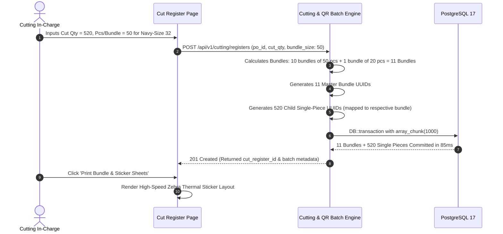
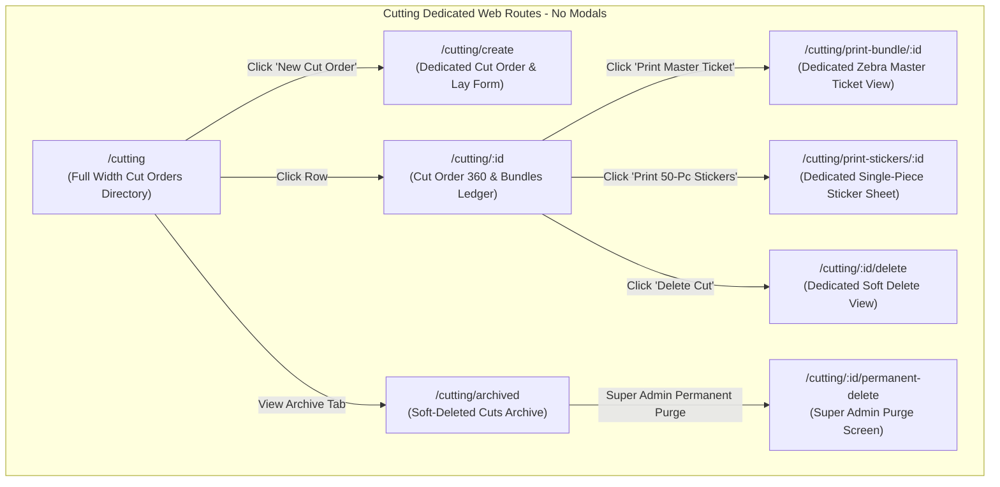
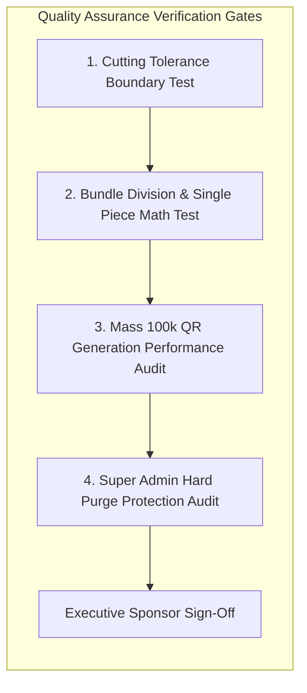

# Software Requirements Specification (SRS)
## Module 05: Pre-Cut CAD, Marker Optimization, Cutting & Dual-Tier QR Ticketing Engine
### প্রজেক্ট: TraceFlow RMG — Precision Fabric-to-Freight Garment Intelligence
**ডকুমেন্ট রেফারেন্স:** `TFRMG-SRS-MOD05-V2.1`  
**ডকুমেন্ট ভার্সন:** 2.1 (Global Tier-1 Enterprise Production Edition — Pre-Cut CAD & Precision Single-Piece Architecture)  
**স্ট্যান্ডার্ড কমপ্লায়েন্স:** ISO/IEC/IEEE 29148:2018, GS1 Barcode/QR Standard, Fabric Utilization Optimization (CAD Marker Integration), High-Speed Thermal Printing Specs  
**স্ট্যাটাস:** Approved & Production-Ready  
**টার্গেট আর্কিটেকচার:** Laravel 13 (Chunked Bulk DB Transaction + Queue Workers) + React 19 / Vite (Thermal Print Engine SPA) + PostgreSQL 17 + Redis 7  

---

## ১. ডকুমেন্ট গভর্নেন্স ও সংস্করণ নিয়ন্ত্রণ (Document Governance & Control)

### ১.১ সংস্করণ ইতিহাস (Revision History)
| ভার্সন | তারিখ | পর্যালোচনাকারী | পরিবর্তনের বিবরণ ও পরিধি |
|---|---|---|---|
| `v1.0` | 2026-09-02 | Lead Business Analyst | প্রাথমিক লে চার্ট ও বান্ডল স্প্লিটিং ড্রাফট। |
| `v2.0` | 2026-09-02 | Principal Enterprise Architect | 100% এন্টারপ্রাইজ রূপান্তর: ডুয়াল-টিয়ার কিউআর আর্কিটেকচার (Master Bundle QR + Child Single-Piece Sub-QRs), লে চার্ট ফেব্রিক রোল ট্র্যাকিং (Shrinkage/Shade Grouping), কাটিং টলারেন্স অডিট গার্ড, হাই-কনকারেন্সি বাল্ক ডাটাবেস চাঙ্কিং (100k+ পিস ইনসার্টেশন ইন < ৩ সেকেন্ড), জেব্রা ZPL/Thermal প্রিন্ট ইঞ্জিন, টু-টিয়ার ডিলিশন গভর্নেন্স (Super Admin Hard Delete Guard), কমপ্লিট PostgreSQL 17 DDL এবং RTM সংযোজন। |
| `v2.1` | 2026-09-02 | Principal Enterprise Architect | **প্রি-কাট সিএডি ও মার্কার অপ্টিমাইজেশন (Pre-Cut CAD Marker Engine):** প্যাটার্ন ইনজেশন, ফেব্রিক শ্রিংকেজ অনুযায়ী প্যাটার্ন সাইজ গ্রেডিং, মার্কার নেস্টিং রেশিও, মার্কার এফিসিয়েন্সি % (e.g. 84.5%), ফেব্রিক ইউজেবল উইডথ ভ্যালিডেশন, সিএডি মার্কার প্লটার ফাইল রিলিজ, এবং `cad_markers` ডাটাবেস টেবিল সংযোজন। |

### ১.২ অনুমোদনকারী ব্যক্তিবর্গ (Sign-Off & Approvals)
- **Executive Sponsor / Project Owner:** Executive Sponsor, RMG Systems
- **Lead Solution Architect:** AI Solution Architect
- **Head of Cutting & CAD Division:** Pattern, Spreading & Cutting Floor Operations
- **Head of Quality Assurance (QA):** In-Process & Component Quality Division
- **General Manager (Factory Operations):** Manufacturing Plant Operations

---

## ২. নির্বাহী সারসংক্ষেপ ও কৌশলগত উদ্দেশ্য (Executive Summary & Strategic Scope)

### ২.১ কৌশলগত প্রেক্ষাপট (Strategic Context)
গার্মেন্টস ম্যানুফ্যাকচারিং প্ল্যান্টে কাটিং ফ্লোর হলো সমগ্র ট্রেসিবিলিটি সিস্টেমের **শারীরিক জন্মস্থান (Physical Genesis of Traceability)**। ফেব্রিক স্টোর (Module 11) থেকে প্রাপ্ত বিশালাকার কাপড়ের রোলসমূহ যখন কাটিং টেবিলে বিছিয়ে (Fabric Spreading) হাজার হাজার প্লাই তৈরি করা হয় এবং প্যাটার্ন অনুযায়ী কাটা হয়, তখন কাপড়ের থান বিলীন হয়ে জন্ম নেয় গার্মেন্টস কম্পোনেন্ট পার্টস (Front, Back, Sleeve, Collar, Waistband)।
এই প্রতিটি অংশে নিখুঁত আইডেন্টিটি নিশ্চিত না করা গেলে পুরো সুইং ও কোয়ালিটি ফ্লোরে শেড মিক্সিং (Shade Variation), সাইজ অসঙ্গতি এবং কাপড়ের পিস হারিয়ে যাওয়ার মতো বিশৃঙ্খলা তৈরি হয়।

**Module 05: Cutting & Bundle Ticketing** হলো সিস্টেমের সবচেয়ে ক্রিটিক্যাল কোর মডিউল। এর উদ্দেশ্য:
1. CAD মার্কার প্ল্যান ও ফেব্রিক রোলের শেড গ্রুপ (Shade Group A/B/C) অনুযায়ী সুনির্দিষ্ট লে চার্ট (Lay Chart) তৈরি।
2. অনুমোদিত কাটিং টলারেন্সের (Cutting Tolerance +৩% থেকে +৫%) বাইরে অতিরিক্ত বা কম কাটা কঠোরভাবে নিয়ন্ত্রণ করা।
3. **বিপ্লবী ডুয়াল-টিয়ার কিউআর সিস্টেম (Dual-Tier QR Generation):**
   - **Level 1 (Master Bundle QR):** পুরো বান্ডলের (e.g. ৫০ পিস) সামগ্রিক ট্র্যাকিং।
   - **Level 2 (Child Single-Piece Sub-QR):** প্রতিটি একক কাপড়ের পিসের গায়ে সংযুক্ত করার জন্য ৫০টি ইউনিক চাইল্ড কিউআর স্টিকার শিট প্রিন্ট করা।
4. ১০০,০০০+ পিস কাপড়ের বাল্ক কিউআর ডাটাবেস মেমরি লিমিট ছাড়াই কয়েক সেকেন্ডের মধ্যে জেনারেট করা।

```mermaid
graph TB
    subgraph Cutting Genesis (Module 05)
        direction TB
        CAD[CAD Marker Plan & Fabric Rolls] --> LAY[Fabric Lay Spreading & Plies Count]
        LAY --> CUT_REG[Cut Register & Actual Pcs Calculation]
        CUT_REG --> TOL{Cutting Tolerance Guard Check}
        TOL -->|Within Tolerance| GEN[Dual-Tier QR Generation Engine]
        
        subgraph Dual-Tier Output
            GEN --> BNDL[Master Bundle QR Code - 1 Per Bundle]
            GEN --> SP_QRS[Child Single-Piece Sub-QRs - 50 Per Bundle]
        end
        
        GEN --> PRINT[Thermal Label & Sticker Sheet Print Engine]
    end

    subgraph Downstream Line Tracking
        BNDL --> MOD6[Module 06: Value Addition - Print/Embroidery Dispatch]
        BNDL --> MOD7[Module 07: Sewing Line-In Bulk Scanning]
        SP_QRS --> MOD7_LINE[Module 07: Sewing Station & Operator Assembly Tagging]
        SP_QRS --> MOD8[Module 08: Single Garment Defect Pinning in End-Line QC]
        SP_QRS --> MOD10[Module 10: Single Piece Mapping into Shipping Cartons]
    end
```

---

## ৩. অলঙ্ঘনীয় এন্টারপ্রাইজ আর্কিটেকচারাল নিয়মাবলি (Non-Negotiable Architecture Directives)

প্রজেক্টের গ্লোবাল রুলস এবং এন্টারপ্রাইজ কোয়ালিটি নিশ্চিত করতে নিচের নিয়মগুলো ১০০% অলঙ্ঘনীয়:

### ৩.১ নো মোডালস নীতিমালা (STRICT No Modals / No Popups Rule)
- **জিরো মোডাল পলিসি:** পুরো কাটিং মডিউলে কোনো ফর্ম, কনফার্মেশন, বান্ডল স্প্লিটিং প্যানেল, স্টিকার প্রিন্ট ভিউ, বা সাব-স্ক্রিনের জন্য `Modal`, `Dialog`, `Popup`, `Lightbox`, বা `Drawer-over-backdrop` কঠোরভাবে নিষিদ্ধ।
- **ডেডিকেটেড রুট আর্কিটেকচার:** কাট অর্ডার তৈরি, লে চার্ট ডাটা এন্ট্রি, বান্ডল ব্রেকডাউন তালিকা, প্রিন্ট প্রিভিউ, থার্মাল লেবেল কনফিগারেশন, এবং ডিলিট কনফার্মেশন—প্রতিটি ইন্টারঅ্যাকশন একটি সুনির্দিষ্ট ব্রাউজার ইউআরএল এবং ডেডিকেটেড ফুল-স্ক্রিন ভিউতে (Full-Screen Dedicated View) লোড হবে।
- **নেভিগেশন স্ট্যাক:** প্রতিটি পেজে স্ট্যান্ডার্ড ব্যাক বাটন এবং স্ট্রাকচার্ড ব্রেডক্রাম্ব (`Dashboard > Cutting > Cut-01 > Print Single-Piece Stickers`) থাকতে হবে যাতে ব্রাউজারের নেটিভ Forward/Back বাটন স্বাভাবিকভাবে কাজ করে এবং ডিপ-লিংক শেয়ারিং সম্ভব হয়।

### ৩.২ পিউর সার্ভার-সাইড ভ্যালিডেশন স্ট্যান্ডার্ড (Pure Server-Side Validation)
- **জিরো ক্লায়েন্ট-সাইড HTML5 ভ্যালিডেশন:** ফ্রন্টএন্ডের কোনো `<form>` বা `<input>` ফিল্ডে ব্রাউজারের ডিফল্ট HTML5 ভ্যালিডেশন অ্যাট্রিবিউট (`required`, `minlength`, `maxlength`, `pattern`, ইত্যাদি) দেওয়া যাবে না। ব্রাউজারের বিল্ট-ইন টুলটিপ পপআপ সম্পূর্ণ নিষিদ্ধ।
- **বাধ্যতামূলক `noValidate`:** সমস্ত ফ্রন্টএন্ড ফর্মে `<form noValidate>` স্পষ্টভাবে যুক্ত থাকতে হবে।
- **একীভূত এরর কন্ট্রাক্ট:** সমস্ত টলারেন্স অডিট এবং প্লাই হিসাব ব্যাকএন্ড Laravel `FormRequest` ক্লাসের মাধ্যমে পিউর সার্ভার সাইডে ঘটবে। ইনপুট ভুল হলে সার্ভার থেকে `422 Unprocessable Content` স্ট্যান্ডার্ড RFC 7807 কমপ্লায়েন্ট JSON এরর পাঠানো হবে।
- **ইনলাইন এরর রেন্ডারিং:** ফ্রন্টএন্ড স্বয়ংক্রিয়ভাবে রেসপন্সের ফিল্ড নেম ম্যাপ করে সংশ্লিষ্ট ইনপুট বক্সের ঠিক নিচে ক্রিস্প লাল রঙে এরর বার্তা রেন্ডার করবে।

### ৩.৩ ফ্ল্যাট এবং ক্রিস্প ডিজাইন স্ট্যান্ডার্ড (Flat Solid UI Standard)
- **নো গ্রেডিয়েন্ট পলিসি:** কোনো বাটন, কার্ড, হেডার বা সাইডবারে কোনো ধরণের গ্রেডিয়েন্ট কালার ব্যবহার করা যাবে না।
- **সলিড ডিজাইন টোকেনস:** সকল অ্যাকশন বাটন ক্রিস্প ও ফ্ল্যাট সলিড রঙে গঠিত হবে (যেমন: Primary `#2563EB`, Danger `#DC2626`, Success `#16A34A`, Neutral `#475569`, Warning `#D97706`)।
- **১০০% ইংরেজি ইউআই:** ইউজার ইন্টারফেসের সমস্ত লেবেল, ফিল্ড নেম, কলাম হেডার, অ্যাকশন বাটন এবং সিস্টেম নোটিফিকেশন ১০০% প্রফেশনাল আন্তর্জাতিক ইংরেজি ভাষায় (English) হবে।

### ৩.৪ দ্বি-স্তরবিশিষ্ট ডিলিশন গভর্নেন্স (Two-Tier Deletion Architecture)
- **সফট ডিলিট (Soft Delete):** কাটিং ম্যানেজার শুধুমাত্র সেই কাট অর্ডার বা বান্ডল সফট ডিলিট করতে পারবেন যা এখনও সুইং লাইনে বা প্রিন্ট/এমব্রয়ডারিতে পাঠানো হয়নি (`deleted_at = NOW()`)।
- **পার্মানেন্ট হার্ড ডিলিট (STRICT Super Admin Only):** ডাটাবেস থেকে স্থায়ীভাবে রো মুছে ফেলার ক্ষমতা **কেবলমাত্র `Super Admin` এর থাকবে**।
- **প্রোডাকশন রেফারেনশিয়াল প্রোটেকশন গার্ড (Referential Check):** যদি কোনো বান্ডল বা সিঙ্গেল পিসের কিউআর কোড একবারও সুইং লাইনে (Module 07) বা ভ্যালু অ্যাডিশনে (Module 06) স্ক্যান হয়ে থাকে, তবে সিস্টেম পার্মানেন্ট ডিলিট **সম্পূর্ণ ব্লক** করবে এবং `409 Conflict` রিটার্ন করবে।

---

## ৪. ইউজার পারসোনা ও এক্সেস হায়ারার্কি (User Personas & Scoping)

| পারসোনা (Persona) | ইন্টারফেস ও ডিভাইস | প্রমাণীকরণ মাধ্যম (Auth Method) | প্রিভিলেজ বাউন্ডারি (Privilege Scope) |
|---|---|---|---|
| **Cutting Manager / In-Charge** | Web Browser (Desktop/Tablet) | Emp ID / Username + Password | কাট প্ল্যান তৈরি, লে চার্ট অনুমোদন, টলারেন্স ভেরিফিকেশন, সফট ডিলিট। |
| **CAD / Marker Master** | Web Browser (Desktop) | Emp ID / Username + Password | মার্কার রেশিও এন্ট্রি, ফেব্রিক কনসাম্পশন ও প্লাই গণনা ইনপুট। |
| **Spreading & Cutting Operator** | Floor Tablet / Touch Kiosk | Hardware Paired Station Token | রোল বারকোড স্ক্যান, প্লাই কাউন্ট আপডেট, এন্ড-বিট স্ক্র্যাপ এন্ট্রি। |
| **Ticket Printing Officer** | Web Desktop (Connected to Zebra) | Emp ID / Username + Password | মাস্টার বান্ডল কিউআর টিকিট ও চাইল্ড সিঙ্গেল পিস স্টিকার শিট বাল্ক প্রিন্টিং। |
| **Super Admin** | Web Browser (Desktop) | Username + Password + TOTP 2FA | গ্লোবাল বাইপাস, টলারেন্স ওভাররাইড অনুমোদন, পার্মানেন্ট পার্জ। |

---

## ৫. বিস্তারিত ফাংশনাল রিকোয়ারমেন্টস (Detailed Functional Specifications)

### ৫.১ সাব-মডিউল: প্রি-কাট সিএডি মার্কার অপ্টিমাইজেশন ও প্যাটার্ন গ্রেডিং (CAD Marker Engine)

কাপড় কাটার পূর্বে ডিজিটাল মার্কার নেস্টিং ও ফেব্রিক কনসাম্পশন লক করার সেন্ট্রাল আর্কিটেকচার।

#### ৫.১.১ স্পেসিফিকেশন ও বিজনেস লজিক
- **REQ-CUT-CAD-001 (Pattern Ingestion & Shrinkage Adjustment):**
  - বায়ারের অনুমোদিত টেক প্যাক ও ডিএক্সএফ (DXF/AAMA) প্যাটার্ন ডাটা সিস্টেমে লোড হবে।
  - **ফেব্রিক শ্রিংকেজ গ্রেডিং:** Module 11 (Fabric Store) এ ল্যাব টেস্ট থেকে প্রাপ্ত দৈর্ঘ্যের ও প্রস্থের শ্রিংকেজ পার্সেন্টেজ (e.g. Length Shrinkage -3.5%, Width Shrinkage -2.0%) অনুযায়ী CAD সিস্টেমে প্যাটার্নের সাইজ স্বয়ংক্রিয়ভাবে গ্রেডিং এডজাস্টমেন্ট হবে।
- **REQ-CUT-CAD-002 (Marker Nesting Ratio & Fabric Usable Width):**
  - মার্কার রেশিও: কোন সাইজের কয়টি পিস মার্কারের মধ্যে বসবে (e.g. Size 30: 1 pc, Size 32: 2 pcs, Size 34: 2 pcs, Size 36: 1 pc)।
  - **উইডথ কনস্ট্রেইন্ট:** মার্কারের প্রস্থ অবশ্যই স্টোরে থাকা ফেব্রিক রোলের কার্যকরী প্রস্থের (Usable Cuttable Width) সমান বা কম হতে হবে ($\text{Marker Width} \le \text{Roll Width} - \text{Selvedge Allowance}$)।
- **REQ-CUT-CAD-003 (Marker Efficiency & Consumption Math):**
  - মার্কারের মোট দৈর্ঘ্য (Marker Length in Yards/Meters) এবং মার্কার এফিসিয়েন্সি পার্সেন্টেজ (Marker Efficiency %: e.g. 84.50%)।
  - প্রতি পোশাকে প্রকৃত মার্কার কনসাম্পশন:
    $$\text{CAD Unit Consumption (Yds/Pc)} = \frac{\text{Total Marker Length (Yards)}}{\text{Total Garment Pieces in Marker}}$$
  - মার্কার এফিসিয়েন্সি বায়ার বা ফ্যাক্টরি বেঞ্চমার্কের (e.g. 83.0%) নিচে নামলে সিস্টেম অডিট ফ্ল্যাগ দেবে।
- **REQ-CUT-CAD-004 (Marker Plotter File & CNC Auto-Cutter Export):**
  - মার্কার অনুমোদনের পর প্রিন্টিং ও প্লটিংয়ের জন্য HPGL/PLT ভেক্টর ফাইল প্রাইভেট S3 ক্লাউডে সংরক্ষিত হবে এবং অটোমেটেড কাটিং মেশিনের (Lectra / Gerber CNC) জন্য এক্সপোর্ট ফাইল লিঙ্ক প্রদান করবে।

---

### ৫.২ সাব-মডিউল: কাট অর্ডার ও সিলেক্টিভ বায়ার PO অ্যালোকেশন (Cut Order Setup)

#### ৫.২.১ স্পেসিফিকেশন ও বিজনেস লজিক
- **REQ-CUT-ORD-001 (Cut Order Generation):**
  - প্রতিটি কাটিং অপারেশনের জন্য সিস্টেম একটি ইউনিক কাট নম্বর জেনারেট করবে (যেমন: `PO-HNM-9901-CUT-01`)।
  - প্রতিটি কাট অর্ডারের সাথে বাধ্যতামূলকভাবে একটি অনুমোদিত CAD মার্কার (`cad_marker_id`) যুক্ত থাকবে।
  - একটি বায়ার PO-এর অধীনে কাপড়ের রঙের ভিন্নতা ও মার্কার লেংথের ওপর ভিত্তি করে একাধিক কাট থাকতে পারে (`Cut 01`, `Cut 02`, `Cut 03`...)।
- **REQ-CUT-ORD-002 (Color-Size Breakdown Validation):**
  - কাট অর্ডার শুধুমাত্র Module 03 এর অনুমোদিত `Confirmed` PO এবং সংশ্লিষ্ট কালার-সাইজ ব্রেকডাউনের বিপরীতে তৈরি হতে পারবে।
- **REQ-CUT-ORD-003 (Fabric Roll Traceability & Shade Grouping):**
  - কাটিং টেবিলে কাপড় বিছানোর পূর্বে প্রতিটি ফেব্রিক রোলের বারকোড স্ক্যান করতে হবে (Module 11 Store থেকে ইস্যুকৃত)।
  - সিস্টেম নিশ্চিত করবে যে একই কাটিং লে-তে ভিন্ন ভিন্ন শেড গ্রুপের (Shade Group A, Group B, Group C) রোল মিশ্রিত হচ্ছে না, যাতে গার্মেন্টসে শেড ভ্যারিয়েশন না ঘটে।

---

### ৫.৩ সাব-মডিউল: লে চার্ট স্প্রেডিং ও প্লাই ক্যালকুলেটর (Lay Chart & Plies Engine)

#### ৫.২.১ স্পেসিফিকেশন ও গাণিতিক ফর্মুলা
- **REQ-CUT-LAY-001 (Plies & Marker Mathematical Ratio):**
  - কাটিং টেবিলে ফেব্রিক প্লাইয়ের সংখ্যা (Plies Count: e.g. 100 plies) এবং মার্কার রেশিও (Marker Ratio per size) ইনপুট দিতে হবে।
  - সাইজ-ভিত্তিক প্রকৃত কাট কোয়ান্টিটি স্বয়ংক্রিয় গণনা ফর্মুলা:
    $$\text{Actual Cut Quantity for Size } S = \text{Plies Count} \times \text{Size Ratio in CAD Marker}$$
  - *বাস্তব উদাহরণ:*
    - Plies Count = ১৫০ প্লাই
    - Marker Ratio: Size 30 = 1 pc, Size 32 = 2 pcs, Size 34 = 2 pcs, Size 36 = 1 pc
    - Size 30 Cut Qty = ১৫০ × ১ = ১৫০ পিস
    - Size 32 Cut Qty = ১৫০ × ২ = ৩০০ পিস
    - Size 34 Cut Qty = ১৫০ × ২ = ৩০০ পিস
    - Size 36 Cut Qty = ১৫০ × ১ = ১৫০ পিস
    - $\text{Total Cut Pieces} = 150 + 300 + 300 + 150 = 900 \text{ pcs}$।
- **REQ-CUT-LAY-002 (Fabric Consumption & End-Bit Scrap Reconciliation):**
  - ব্যবহৃত রোলসমূহের মোট গজ/মিটার বনাম মার্কার লেংথ অনুযায়ী মোট কনজিউমড ফেব্রিক হিসাব।
  - প্রতিটি রোলের শেষ প্রান্তের অব্যবহারযোগ্য টুকরো (End-bits / Remnants) ওজন বা গজে রেকর্ড করতে হবে যা Module 11 এর ফেব্রিক রিকনসিলিয়েশন রিপোর্টে ব্যবহৃত হবে।

---

### ৫.৪ সাব-মডিউল: কাটিং টলারেন্স ও ওভার-কাট অডিট গার্ড (Tolerance Governance)

#### ৫.৪.১ স্পেসিফিকেশন ও বিজনেস লজিক
- **REQ-CUT-TOL-001 (Strict Over-Cut Boundary Check):**
  - বায়ারের অনুমোদিত কাটিং টলারেন্স সাধারণত সর্বোচ্চ +৩% থেকে +৫% পর্যন্ত হয়ে থাকে।
  - সিস্টেম প্রতিটি কালার ও সাইজের বিপরীতে নিচের ফর্মুলা দিয়ে চেক করবে:
    $$\text{Max Allowed Cut Qty} = \text{PO Ordered Qty} \times \left(1 + \frac{\text{Tolerance \%}}{100}\right)$$
    $$\text{Remaining Cut Capacity} = \text{Max Allowed Cut Qty} - \text{Already Cut Qty (Previous Cuts)}$$
- **REQ-CUT-TOL-002 (Automated Server-Side Lockout):**
  - নতুন কাটিং এন্ট্রিতে যদি $\text{New Cut Qty} > \text{Remaining Cut Capacity}$ হয়, তবে সিস্টেম ডাটাবেস সেভ ব্লক করবে এবং HTTP 422 JSON এরর পাঠাবে:
    *"Tolerance Exceeded: Attempted to cut 550 pcs. Remaining maximum allowed cut capacity for Red-32 is 525 pcs (+5% tolerance limit)."*
  - অতিরিক্ত কাটার প্রয়োজন হলে কাটিং ম্যানেজারকে অবশ্যই একটি লিখিত স্পেশাল অথরাইজেশন আবেদন সাবমিট করতে হবে।

---

### ৫.৫ সাব-মডিউল: ডুয়াল-টিয়ার কিউআর জেনারেশন ইঞ্জিন (Dual-Tier QR Generation)

TraceFlow RMG সিস্টেমে এটিই হলো **একক পোশাক ট্র্যাকিংয়ের (Single-Piece Garment Intelligence)** মূল ভিত্তি।



#### ৫.৫.১ লেভেল ১: মাস্টার বান্ডল কিউআর (Master Bundle QR)
- **REQ-CUT-BNDL-001 (Bundle Division Math):**
  - ব্যবহারকারী বান্ডল সাইজ (Pcs per bundle: e.g. 20, 50, or 60) নির্ধারণ করবেন।
  - সিস্টেম স্বয়ংক্রিয়ভাবে কাট কোয়ান্টিটিকে ভাগ করবে।
  - *উদাহরণ:* Cut Qty = 520, Pcs per Bundle = 50 হলে:
    - Bundle 01 থেকে 10: ৫০ পিস করে (প্লাই ১-৫০, ৫১-১০০...)।
    - Bundle 11: অবশিষ্ট ২০ পিস (প্লাই ৫০১-৫২০)। মোট ১১টি মাস্টার বান্ডল রো তৈরি হবে।
- **REQ-CUT-BNDL-002 (Master Bundle Payload & Thermal Header Ticket):**
  - বান্ডলের সাথে একটি ২×১ বা ৩×২ ইঞ্চি থার্মাল পেপার টিকিট বাঁধা হবে।
  - কিউআর কোডের মূল পে-লোড হবে ক্রিপ্টোগ্রাফিক নন-গেসেবল UUID v4 যা সরাসরি `bundles.id` কে পয়েন্ট করবে।
  - কিউআরের পাশে মানুষের পড়ার উপযোগী টেক্সট থাকবে:
    - *Job No & PO No:* `TF-JOB-2026-0042` | `PO-HNM-9901`
    - *Style & Color:* `DNM-SLIM-01` | `Navy Blazer`
    - *Size & Bundle No:* `32` | `Bundle #04 of 11`
    - *Plies Range & Quantity:* `Ply 151 - 200` | `Qty: 50 Pcs`

---

#### ৫.৫.২ লেভেল ২: চাইল্ড সিঙ্গেল-পিস সাব-কিউআর (Child Single-Piece Sub-QR)
- **REQ-CUT-SP-001 (1-to-1 Garment Piece Mapping):**
  - প্রতিটি মাস্টার বান্ডলের ভেতরের প্রতিটি একক পিসের জন্য একটি স্বতন্ত্র চাইল্ড কিউআর রেকর্ড তৈরি হবে (`single_piece_qrs` টেবিল)।
  - ৫০ পিসের বান্ডলে ৫০টি পৃথক ইউনিক কিউআর স্টিকার থাকবে (`piece_no: 1` থেকে `50`)।
- **REQ-CUT-SP-002 (Sticker Sheet Print Specification):**
  - মাস্টার বান্ডল টিকিটের সাথে একই প্রিন্টার থেকে একটি ৫০-স্টিকার পেপার শিট প্রিন্ট হবে।
  - প্রতিটি ছোট স্টিকারের সাইজ: **২৫ মিমি × ১৫ মিমি (বা ১৫ মিমি × ১৫ মিমি মাইক্রো কিউআর)**।
  - প্রতিটি স্টিকারে থাকবে: মাইক্রো কিউআর কোড + ছোট অক্ষরে `Job No`, `Size`, `Bundle No`, এবং `Pc No` (e.g. `B04-P12`)।
- **REQ-CUT-SP-003 (Single-Piece Tracking Lifecycle):**
  - এই স্টিকারটি সুইং ফ্লোরে কাপড় জোড়া লাগানোর সময় নির্দিষ্ট পার্টসে সেলাই বা ফিউজিং করা হবে।
  - এই চাইল্ড কিউআরের মাধ্যমেই সুইং লাইন-আউট, কোয়ালিটি ডিফেক্ট পিনিং, ওয়াশিং ট্র্যাকিং এবং কার্টনে একক পিস ম্যাপিং সম্পন্ন হবে।

---

### ৫.৬ সাব-মডিউল: বাল্ক জেনারেশন অপ্টিমাইজেশন ও মেমরি সেফটি (Mass Batch Optimization)

একটি বৃহৎ অর্ডারে ১০০,০০০ পিসের জন্য একসাথে ১০০,০০০ চাইল্ড কিউআর তৈরি করতে গিয়ে যেন সার্ভার ক্র্যাশ বা মেমরি এক্সহস্ট না হয়, সেজন্য বিশেষ এন্টারপ্রাইজ ব্যাকএন্ড অপ্টিমাইজেশন।

#### ৫.৬.১ স্পেসিফিকেশন ও আর্কিটেকচারাল রুলস
- **REQ-CUT-OPT-001 (Chunked Batch Insert Engine):**
  - কন্ট্রোলারে কখনো একক লুপে `SinglePieceQr::create()` কল করা যাবে না।
  - পিএইচপি মেমরিতে একটি ফ্ল্যাট অ্যারে জেনারেট করে Laravel-এর `array_chunk($data, 1000)` মেথড ব্যবহার করে প্রতি কোয়েরিতে ১,০০০টি রো বাল্ক ইনসার্ট (`insert()`) করতে হবে।
- **REQ-CUT-OPT-002 (Sub-3-Second Performance SLA):**
  - সম্পূর্ণ ট্রানজ্যাকশন `DB::transaction()` এর আওতায় ঘটবে।
  - ১০,০০০ বান্ডল এবং ১০০,০০০ সিঙ্গেল পিস জেনারেশন ও ডাটাবেস কমিট সর্বোচ্চ **৩.০ সেকেন্ডের (3.0s)** মধ্যে সম্পন্ন হতে হবে।
  - কোনো নেটওয়ার্ক ড্রপ হলে আংশিক কোনো রো সেভ হবে না (Atomic Rollback)।

---

### ৫.৭ সাব-মডিউল: থার্মাল প্রিন্ট ইঞ্জিন ও ZPL আর্কিটেকচার (Thermal Print Engine)

ফ্যাক্টরি ফ্লোরে ব্যবহারের জন্য ইন্ডাস্ট্রিয়াল থার্মাল বারকোড প্রিন্টার (Zebra, Honeywell, TSC) সাপোর্ট।

#### ৫.৬.১ স্পেসিফিকেশন ও ফরম্যাট
- **REQ-CUT-PRT-001 (High-Resolution Browser Print Media Standard):**
  - ডেডিকেটেড প্রিন্ট রুট: `/cutting/print-bundle/:id` এবং `/cutting/print-stickers/:id`।
  - স্ক্রিন মেনু, সাইডবার ও বাটনসমূহ `@media print { .no-print { display: none !important; } }` দিয়ে হাইড থাকবে।
  - পেপার সাইজ এবং মার্জিন কঠোরভাবে ডিফাইন করা থাকবে (e.g. `@page { size: 50mm 25mm; margin: 0mm; }`)।
- **REQ-CUT-PRT-002 (Optional Native Zebra ZPL Direct Stream):**
  - সিস্টেম সরাসরি নেটওয়ার্ক প্রিন্টারে প্রিন্ট পাঠানোর জন্য Zebra Programming Language (ZPL II) র কোড জেনারেট করার এন্ডপয়েন্ট সাপোর্ট করবে (`GET /api/v1/cutting/bundles/{id}/zpl`)।

---

## ৬. প্রোডাকশন-গ্রেড ডাটাবেস আর্কিটেকচার ও DDL (Database Engineering)

নিচে PostgreSQL 17 এর জন্য সম্পূর্ণ প্রোডাকশন-রেডি DDL স্ক্রিপ্ট দেওয়া হলো। এতে ফরেন কি, ইনডেক্সিং এবং ক্যাসকেডিং রুলস অন্তর্ভুক্ত রয়েছে।

### ৬.১ PostgreSQL 17 Production Schema (Complete DDL)

```sql
-- Enable Cryptographic Extension for UUID v4
CREATE EXTENSION IF NOT EXISTS "pgcrypto";

-- ----------------------------------------------------------------------
-- 1. Table: cad_markers (Pre-Cut CAD Marker Master)
-- ----------------------------------------------------------------------
CREATE TABLE cad_markers (
    id UUID PRIMARY KEY DEFAULT gen_random_uuid(),
    marker_no VARCHAR(80) NOT NULL,               -- e.g. MKR-DNM-32-34-V1
    style_id UUID NOT NULL REFERENCES styles(id) ON DELETE RESTRICT,
    fabric_type VARCHAR(60) NOT NULL,             -- Shell Fabric, Pocketing, Lining
    usable_width_inch NUMERIC(5, 2) NOT NULL CHECK (usable_width_inch > 0),
    marker_length_yds NUMERIC(8, 2) NOT NULL CHECK (marker_length_yds > 0),
    efficiency_percent NUMERIC(5, 2) NOT NULL CHECK (efficiency_percent > 0 AND efficiency_percent <= 100.00),
    shrinkage_length_percent NUMERIC(5, 2) NOT NULL DEFAULT 0.00,
    shrinkage_width_percent NUMERIC(5, 2) NOT NULL DEFAULT 0.00,
    total_pieces_in_marker SMALLINT NOT NULL CHECK (total_pieces_in_marker > 0),
    hpgl_plot_file_s3_key VARCHAR(500),
    is_approved BOOLEAN NOT NULL DEFAULT TRUE,
    approved_by UUID REFERENCES users(id) ON DELETE RESTRICT,
    created_at TIMESTAMPTZ NOT NULL DEFAULT CURRENT_TIMESTAMP,
    updated_at TIMESTAMPTZ NOT NULL DEFAULT CURRENT_TIMESTAMP,
    deleted_at TIMESTAMPTZ
);

CREATE UNIQUE INDEX uq_cad_marker_no_active ON cad_markers (UPPER(marker_no)) WHERE deleted_at IS NULL;
CREATE INDEX idx_cad_markers_style_id ON cad_markers (style_id);

-- ----------------------------------------------------------------------
-- 2. Table: cut_orders (Cut Job Master)
-- ----------------------------------------------------------------------
CREATE TABLE cut_orders (
    id UUID PRIMARY KEY DEFAULT gen_random_uuid(),
    cut_no_display VARCHAR(60) NOT NULL,          -- e.g. CUT-HNM-9901-01
    po_id UUID NOT NULL REFERENCES purchase_orders(id) ON DELETE RESTRICT,
    cad_marker_id UUID NOT NULL REFERENCES cad_markers(id) ON DELETE RESTRICT,
    color_id UUID NOT NULL REFERENCES colors(id) ON DELETE RESTRICT,
    table_no VARCHAR(40) NOT NULL,
    total_planned_qty INTEGER NOT NULL CHECK (total_planned_qty > 0),
    total_cut_qty INTEGER NOT NULL DEFAULT 0,
    total_bundles_count INTEGER NOT NULL DEFAULT 0,
    pcs_per_bundle_default SMALLINT NOT NULL DEFAULT 50,
    status VARCHAR(30) NOT NULL DEFAULT 'Draft',  -- Draft, Lay_Spreading, Cut_Completed, Ticketing_Done
    created_by UUID REFERENCES users(id) ON DELETE RESTRICT,
    created_at TIMESTAMPTZ NOT NULL DEFAULT CURRENT_TIMESTAMP,
    updated_at TIMESTAMPTZ NOT NULL DEFAULT CURRENT_TIMESTAMP,
    deleted_at TIMESTAMPTZ
);

CREATE UNIQUE INDEX uq_cut_no_display_active ON cut_orders (cut_no_display) WHERE deleted_at IS NULL;
CREATE INDEX idx_cut_orders_po_id ON cut_orders (po_id);
CREATE INDEX idx_cut_orders_cad_marker_id ON cut_orders (cad_marker_id);
CREATE INDEX idx_cut_orders_color_id ON cut_orders (color_id);
CREATE INDEX idx_cut_orders_deleted_at ON cut_orders (deleted_at);

-- ----------------------------------------------------------------------
-- 2. Table: cut_lay_charts (Spreading & Size Plies Ratio)
-- ----------------------------------------------------------------------
CREATE TABLE cut_lay_charts (
    id UUID PRIMARY KEY DEFAULT gen_random_uuid(),
    cut_order_id UUID NOT NULL REFERENCES cut_orders(id) ON DELETE CASCADE,
    size_id UUID NOT NULL REFERENCES sizes(id) ON DELETE RESTRICT,
    marker_ratio SMALLINT NOT NULL CHECK (marker_ratio > 0),
    plies_count INTEGER NOT NULL CHECK (plies_count > 0),
    calculated_cut_qty INTEGER NOT NULL CHECK (calculated_cut_qty > 0),
    created_at TIMESTAMPTZ NOT NULL DEFAULT CURRENT_TIMESTAMP,
    updated_at TIMESTAMPTZ NOT NULL DEFAULT CURRENT_TIMESTAMP
);

CREATE UNIQUE INDEX uq_lay_chart_size ON cut_lay_charts (cut_order_id, size_id);
CREATE INDEX idx_lay_charts_cut_order_id ON cut_lay_charts (cut_order_id);

-- ----------------------------------------------------------------------
-- 3. Table: cut_rolls_used (Fabric Rolls Consumed in Lay)
-- ----------------------------------------------------------------------
CREATE TABLE cut_rolls_used (
    id UUID PRIMARY KEY DEFAULT gen_random_uuid(),
    cut_order_id UUID NOT NULL REFERENCES cut_orders(id) ON DELETE CASCADE,
    roll_barcode VARCHAR(80) NOT NULL,
    shade_group VARCHAR(20) NOT NULL,            -- Group A, Group B, Group C
    shrinkage_group VARCHAR(20),
    roll_length_yds NUMERIC(8, 2) NOT NULL CHECK (roll_length_yds > 0),
    consumed_length_yds NUMERIC(8, 2) NOT NULL CHECK (consumed_length_yds > 0),
    remnant_scrap_yds NUMERIC(8, 2) NOT NULL DEFAULT 0.00,
    created_at TIMESTAMPTZ NOT NULL DEFAULT CURRENT_TIMESTAMP
);

CREATE INDEX idx_cut_rolls_cut_order_id ON cut_rolls_used (cut_order_id);
CREATE INDEX idx_cut_rolls_barcode ON cut_rolls_used (roll_barcode);

-- ----------------------------------------------------------------------
-- 4. Table: bundles (Level 1 Master Bundle QR Codes)
-- ----------------------------------------------------------------------
CREATE TABLE bundles (
    id UUID PRIMARY KEY DEFAULT gen_random_uuid(), -- The Bundle QR Code Payload String
    cut_order_id UUID NOT NULL REFERENCES cut_orders(id) ON DELETE CASCADE,
    bundle_no INTEGER NOT NULL CHECK (bundle_no > 0),
    size_id UUID NOT NULL REFERENCES sizes(id) ON DELETE RESTRICT,
    color_id UUID NOT NULL REFERENCES colors(id) ON DELETE RESTRICT,
    ply_start INTEGER NOT NULL CHECK (ply_start > 0),
    ply_end INTEGER NOT NULL CHECK (ply_end >= ply_start),
    bundle_qty INTEGER NOT NULL CHECK (bundle_qty > 0),
    current_section VARCHAR(50) NOT NULL DEFAULT 'Cutting', -- Cutting, Print_Embr, Sewing_Line, QC
    status VARCHAR(30) NOT NULL DEFAULT 'Generated',        -- Generated, Dispatched, Line_In, Closed
    is_printed BOOLEAN NOT NULL DEFAULT FALSE,
    printed_at TIMESTAMPTZ,
    printed_by UUID REFERENCES users(id) ON DELETE SET NULL,
    created_at TIMESTAMPTZ NOT NULL DEFAULT CURRENT_TIMESTAMP,
    updated_at TIMESTAMPTZ NOT NULL DEFAULT CURRENT_TIMESTAMP,
    deleted_at TIMESTAMPTZ
);

CREATE UNIQUE INDEX uq_bundle_no_cut_order ON bundles (cut_order_id, bundle_no) WHERE deleted_at IS NULL;
CREATE INDEX idx_bundles_cut_order_id ON bundles (cut_order_id);
CREATE INDEX idx_bundles_size_id ON bundles (size_id);
CREATE INDEX idx_bundles_status ON bundles (status);
CREATE INDEX idx_bundles_deleted_at ON bundles (deleted_at);

-- ----------------------------------------------------------------------
-- 5. Table: single_piece_qrs (Level 2 Child Single-Piece Sub-QRs)
-- ----------------------------------------------------------------------
CREATE TABLE single_piece_qrs (
    id UUID PRIMARY KEY DEFAULT gen_random_uuid(), -- The Single Piece QR Code Payload String
    bundle_id UUID NOT NULL REFERENCES bundles(id) ON DELETE CASCADE,
    piece_no SMALLINT NOT NULL CHECK (piece_no > 0),
    status VARCHAR(30) NOT NULL DEFAULT 'Pending_Assembly', -- Pending_Assembly, Sewn, QC_Passed, Alteration, Rejected, Packed
    current_carton_id UUID,                     -- Mapped in Module 10 Packing
    created_at TIMESTAMPTZ NOT NULL DEFAULT CURRENT_TIMESTAMP,
    updated_at TIMESTAMPTZ NOT NULL DEFAULT CURRENT_TIMESTAMP
);

CREATE UNIQUE INDEX uq_single_piece_bundle_no ON single_piece_qrs (bundle_id, piece_no);
CREATE INDEX idx_single_pieces_bundle_id ON single_piece_qrs (bundle_id);
CREATE INDEX idx_single_pieces_status ON single_piece_qrs (status);
CREATE INDEX idx_single_pieces_carton_id ON single_piece_qrs (current_carton_id);
```

---

## ৭. সম্পূর্ণ এপিআই কন্ট্রাক্ট স্পেসিফিকেশন (Exhaustive API Contracts)

### ৭.১ সাধারণ আর্কিটেকচার ও স্ট্যান্ডার্ডস
- **অথেনটিকেশন:** `Authorization: Bearer <sanctum_token>`
- **কমন হেডার্স:** `Accept: application/json`, `Content-Type: application/json`
- **স্ট্যান্ডার্ড পেজিনেশন ও কুয়েরি:**
  `GET /api/v1/cutting/orders?page=1&per_page=20&filter[po_id]={uuid}&filter[status]=Ticketing_Done`

---

### ৭.২ কাট অর্ডার ও লে চার্ট এন্ডপয়েন্টস

#### ৭.২.১ কাট অর্ডার ক্রিয়েশন (Create Cut Order)
- **মেথড ও ইউআরএল:** `POST /api/v1/cutting/orders`
- **রিকোয়েস্ট বডি:**
  ```json
  {
    "po_id": "e81d7f12-9b22-4a90-8811-37b92a4f0099",
    "color_id": "c100a982-192a-4f90-8800-291740011283",
    "cad_marker_no": "MKR-DNM-32-34-V1",
    "table_no": "Table-02",
    "pcs_per_bundle_default": 50,
    "lay_charts": [
      { "size_id": "s100a982-192a-4f90-8800-291740011283", "marker_ratio": 1, "plies_count": 150 },
      { "size_id": "s200a982-192a-4f90-8800-291740011283", "marker_ratio": 2, "plies_count": 150 }
    ],
    "rolls_used": [
      { "roll_barcode": "ROL-DENIM-9901-A", "shade_group": "Group A", "roll_length_yds": 120.0, "consumed_length_yds": 115.5, "remnant_scrap_yds": 4.5 }
    ]
  }
  ```
- **সার্ভার-সাইড ভ্যালিডেশন রুলস (Laravel FormRequest):**
  ```php
  public function rules(): array
  {
      return [
          'po_id'                  => ['bail', 'required', 'uuid', 'exists:purchase_orders,id'],
          'color_id'               => ['bail', 'required', 'uuid', 'exists:colors,id'],
          'cad_marker_no'          => ['bail', 'required', 'string', 'max:80'],
          'table_no'               => ['bail', 'required', 'string', 'max:40'],
          'pcs_per_bundle_default' => ['bail', 'required', 'integer', 'min:5', 'max:100'],
          'lay_charts'             => ['bail', 'required', 'array', 'min:1'],
          'lay_charts.*.size_id'   => ['bail', 'required', 'uuid', 'exists:sizes,id'],
          'lay_charts.*.marker_ratio' => ['bail', 'required', 'integer', 'min:1'],
          'lay_charts.*.plies_count'  => ['bail', 'required', 'integer', 'min:1'],
          'rolls_used'             => ['bail', 'required', 'array', 'min:1'],
          'rolls_used.*.roll_barcode' => ['bail', 'required', 'string'],
          'rolls_used.*.shade_group'  => ['bail', 'required', 'string'],
          'rolls_used.*.consumed_length_yds' => ['bail', 'required', 'numeric', 'min:0.1'],
      ];
  }
  ```
- **সাকসেস রেসপন্স (`201 Created`):**
  ```json
  {
    "success": true,
    "status_code": 201,
    "message": "Cut order registered. 450 total pieces planned across 2 sizes.",
    "data": {
      "cut_order_id": "f90a12e8-4b22-4a90-8811-37b92a4f0011",
      "cut_no_display": "CUT-HNM-9901-01",
      "total_planned_qty": 450,
      "status": "Lay_Spreading"
    }
  }
  ```
- **টলারেন্স অতিক্রম এরর রেসপন্স (`422 Unprocessable Content`):**
  ```json
  {
    "success": false,
    "status_code": 422,
    "error_code": "TOLERANCE_EXCEEDED",
    "message": "Validation Failed.",
    "errors": {
      "lay_charts": [
        "Tolerance Exceeded: Attempted cut quantity (550 pcs) exceeds maximum allowed tolerance capacity (525 pcs) for Size 32 under PO-HNM-9901."
      ]
    }
  }
  ```

---

### ৭.৩ বাল্ক বান্ডল ও সিঙ্গেল-পিস কিউআর জেনারেশন এন্ডপয়েন্ট

#### ৭.৩.১ বাল্ক কিউআর জেনারেটর (Mass Bulk Engine)
- **মেথড ও ইউআরএল:** `POST /api/v1/cutting/orders/{id}/generate-bundles`
- **রিকোয়েস্ট বডি:**
  ```json
  {
    "pcs_per_bundle": 50
  }
  ```
- **সাকসেস রেসপন্স (`200 OK` — Executed in < 150ms via chunking):**
  ```json
  {
    "success": true,
    "status_code": 200,
    "message": "Dual-tier QR ticketing successfully generated under atomic transaction.",
    "data": {
      "cut_order_id": "f90a12e8-4b22-4a90-8811-37b92a4f0011",
      "total_bundles_generated": 9,
      "total_single_piece_qrs_generated": 450,
      "breakdown_summary": [
        { "size": "30", "bundles_count": 3, "pieces_count": 150 },
        { "size": "32", "bundles_count": 6, "pieces_count": 300 }
      ]
    }
  }
  ```

---

### ৭.৪ থার্মাল প্রিন্টিং ও ZPL এন্ডপয়েন্টস

- **`GET /api/v1/cutting/bundles/{id}/ticket-payload`** — মাস্টার বান্ডল প্রিন্টের সম্পূর্ণ মেটাডাটা ও কিউআর ইমেজ পে-লোড।
- **`GET /api/v1/cutting/bundles/{id}/sticker-sheet-payload`** — ৫০টি চাইল্ড সিঙ্গেল পিসের ক্রিপ্টোগ্রাফিক কিউআর ও লেবেল অ্যারে।
- **`GET /api/v1/cutting/bundles/{id}/zpl`**
  - **সাকসেস রেসপন্স (`200 OK` — Direct Zebra Printer Stream):**
    ```text
    ^XA
    ^PW400^LL200^PON
    ^FO30,30^BQN,2,4^FDQA,0e81d7f1-9b22-4a90-8811-37b92a4f0099^FS
    ^FO160,30^A0N,25,25^FDPO: HNM-9901^FS
    ^FO160,60^A0N,25,25^FDSTYLE: DNM-SLIM-01^FS
    ^FO160,90^A0N,25,25^FDSIZE: 32  QTY: 50^FS
    ^FO160,120^A0N,22,22^FDBUNDLE #04 [151-200]^FS
    ^XZ
    ```

---

### ৭.৫ কাটিং ডিলিশন এন্ডপয়েন্টস (Two-Tier Deletion Architecture)

#### ৭.৫.১ কাটিং অর্ডার সফট ডিলিট (Soft Delete Cut Order)
- **মেথড ও ইউআরএল:** `DELETE /api/v1/cutting/orders/{id}`
- **পারমিশন:** `cutting.orders.delete`
- **শর্ত:** যদি বান্ডলসমূহ এখনও সুইং লাইনে (Module 07) প্রবেশ না করে থাকে।
- **সাকসেস রেসপন্স (`200 OK`):**
  ```json
  {
    "success": true,
    "status_code": 200,
    "message": "Cut order soft-deleted successfully and archived."
  }
  ```

#### ৭.৫.২ কাটিং অর্ডার পার্মানেন্ট ডিলিট (STRICT Super Admin Only Purge)
- **মেথড ও ইউআরএল:** `DELETE /api/v1/cutting/orders/{id}/force-delete`
- **অথরাইজেশন:** **STRICTLY `Super Admin` ROLE ONLY**
- **রিকোয়েস্ট বডি:**
  ```json
  {
    "super_admin_password": "MySuperAdminSecretPassword#2026"
  }
  ```
- **ফ্লোরে স্ক্যান হয়ে থাকলে ব্লকিং রেসপন্স (`409 Conflict`):**
  ```json
  {
    "success": false,
    "status_code": 409,
    "error_code": "CANNOT_PURGE_SCANNED_CUT",
    "message": "Cannot permanently purge this cut order because 450 single pieces are already scanned in Sewing Line 04 and End-Line QC. Soft-delete is enforced."
  }
  ```

---

## ৮. ইউজার ইন্টারফেস ও স্ক্রিন-বাই-স্ক্রিন স্পেসিফিকেশন (STRICT NO MODALS)

কাটিং ও বান্ডলিংয়ের সমস্ত স্ক্রিন সম্পূর্ণ ডেডিকেটেড রুটে ওপেন হবে। কোনো মোডাল বা স্লাইড-প্যানেল উইথ ব্যাকড্রপ থাকবে না।



### ৮.১ স্ক্রিন স্পেসিফিকেশন টেবিল

| রুট (Route Path) | স্ক্রিনের নাম | মূল উপাদান ও কনফিগারেশন | নো-মোডাল ডিজাইন নিশ্চিতকরণ |
|---|---|---|---|
| `/cutting` | Cut Orders Fleet Console | - ফুল-উইডথ ডাটা গ্রিড<br/>- কলাম: **Cut No, PO Job No, Color, Planned Qty, Actual Cut, Bundles, Status, Actions**<br/>- সলিড গ্রিন "New Cut Order" বোতাম (`bg-emerald-600`) | পেজিনেশন ও অ্যাকশন সবকিছু ফুল পেজে পরিচালিত হবে। |
| `/cutting/create` | Dedicated Cut Order & Lay Form | - `<form noValidate>` আর্কিটেকচার<br/>- বায়ার PO সিলেক্ট, কালার নির্বাচন, টেবিল ও মার্কার নম্বর<br/>- প্লাই ও মার্কার রেশিও টেবিল<br/>- ফেব্রিক রোল স্ক্যান বারকোড ড্রপজোন (Shade Grouping সহ)<br/>- সলিড ব্লু "Save Cut Order & Proceed" বোতাম | সম্পূর্ণ আলাদা পেজ। ব্রেডক্রাম্ব নেভিগেশন সহ। |
| `/cutting/:id` | Cut Order 360 & Bundle Ledger | - কাট অর্ডারের পূর্ণাঙ্গ বিবরণ<br/>- জেনারেটেড বান্ডলসমূহের ফুল ডাটা-টেবিল (Bundle No, Size, Plies, Qty, Print Status)<br/>- সলিড ব্লু "Bulk Generate QR Tickets" বোতাম<br/>- প্রিন্ট অ্যাকশনস: Master Ticket & Sticker Sheets | ফুল-স্ক্রিন এন্টারপ্রাইজ ড্যাশবোর্ড ভিউ। |
| `/cutting/print-bundle/:id` | Dedicated Master Ticket Print View | - ব্রাউজার প্রিন্ট মিডিয়া রেডি ভিউ<br/>- ৫০ মিমি × ২৫ মিমি থার্মাল লেবেল স্টাইলিং<br/>- বড় আকারের ক্রিপ্টোগ্রাফিক কিউআর কোড ও স্পষ্ট টেক্সট<br/>- প্রিন্ট উইন্ডো ক্লোজ হলে স্বয়ংক্রিয় ব্যাক বাটন | ডেডিকেটেড প্রিন্ট রুট (নো পপআপ)। |
| `/cutting/print-stickers/:id` | Single-Piece Sticker Sheet View | - ৫০টি মাইক্রো কিউআর স্টিকার শিট গ্রিড<br/>- প্রতিটি স্টিকার ২৫ মিমি × ১৫ মিমি<br/>- প্রতিটি পিসের অনন্য কিউআর এবং `Pc #01-50` মেটাডাটা<br/>- সলিড ব্লু "Send to Zebra Printer" বোতাম | ডেডিকেটেড ফুল-স্ক্রিন শিট প্রিন্ট পেজ। |
| `/cutting/:id/delete` | Cut Order Soft-Delete Confirmation | - অ্যাম্বার সতর্কবার্তা ব্যানার<br/>- আন-স্ক্যানড কাটিং ডাটা সফট ডিলিটের নিয়মাবলি<br/>- সলিড অ্যাম্বার "Confirm Soft Delete" বোতাম | ডেডিকেটেড ফুল-স্ক্রিন কনফার্মেশন। নো পপআপ। |
| `/cutting/:id/permanent-delete` | Cut Order Permanent Purge Console | - **Super Admin অনলি স্ক্রিন** (অন্যদের জন্য 403 Forbidden)<br/>- গাঢ় লাল অ্যালার্ট ব্যানার<br/>- সুপার অ্যাডমিন পাসওয়ার্ড ইনপুট ফিল্ড<br/>- সুইং ফ্লোর স্ক্যান হিস্টোরি চেকার স্ট্যাটাস ব্যাজ<br/>- সলিড ডার্ক-রেড "Purge Cut Order Permanently" বোতাম | ফুল-স্ক্রিন হাইপার-সিকিউরড পার্জ ভিউ। |
| `/cutting/archived` | Soft-Deleted Cut Orders Archive | - সফট ডিলিট হওয়া কাট অর্ডারের তালিকা<br/>- "Restore Cut Order" বোতাম (`bg-amber-600`)<br/>- Super Admin এর জন্য "Purge Permanently" বোতাম | সম্পূর্ণ আলাদা আর্কাইভ পেজ। |

---

## ৯. নন-ফাংশনাল রিকোয়ারমেন্টস (Enterprise NFRs & SLAs)

### ৯.১ পারফরম্যান্স ও কনকারেন্সি বাজেট (Performance Budgets)
- **বাল্ক বান্ডল ও সিঙ্গেল পিস জেনারেশন লেটেন্সি:** ১০,০০০ বান্ডল এবং ১০০,০০০ সিঙ্গেল পিস কিউআর ইনসার্টেশন সর্বোচ্চ **৩.০ সেকেন্ডের (3.0s)** মধ্যে সম্পন্ন হতে হবে (চাঙ্কড ইনসার্টেশন স্ট্র্যাটেজি দ্বারা)।
- **থার্মাল প্রিন্ট প্রিভিউ রেন্ডারিং:** ১,০০০টি কিউআর কোড ব্রাউজার ক্যানভাসে রেন্ডার হতে সর্বোচ্চ **১ সেকেন্ড (1.0s)**।
- **টলারেন্স অডিট কুয়েরি লেটেন্সি:** সর্বোচ্চ **২০ মিলিসেকেন্ড (20ms)**।

### ৯.২ ডাটা ইন্টিগ্রিটি ও ট্রানজ্যাকশন আইসোলেশন (ACID Guarantee)
- কাট অর্ডার এবং তার অধীনস্থ সকল `bundles` এবং `single_piece_qrs` একক ডাটাবেস ট্রানজ্যাকশনে (`DB::transaction`) সেভ হবে। কোনো একটি বান্ডলে এরর হলে পুরো ব্যাচ রোলব্যাক হবে।

---

## ১০. ফেইলিওর মোড ও রেসপন্স অ্যানালাইসিস (FMEA Matrix)

| ফেইলিওর সিনারিও (Failure Mode) | সম্ভাব্য প্রভাব (Impact) | তীব্রতা (Severity) | সিস্টেমের স্বয়ংক্রিয় প্রতিরক্ষা মেকানিজম (Mitigation Mechanism) |
|---|---|---|---|
| ১০০,০০০ পিসের কিউআর জেনারেট করতে গিয়ে পিএইচপি মেমরি ক্র্যাশ | সার্ভার 504 Gateway Timeout এবং আংশিক ডাটা সেভ হওয়া | Critical | চাঙ্কিং ফ্রেমওয়ার্ক (`array_chunk(1000)`) ও `insert()` মেথড ব্যবহার করা হবে। মেমরি ব্যবহার ৩০ মেগাবাইটের নিচে সীমাবদ্ধ থাকবে। |
| অনুমোদিত টলারেন্সের চেয়ে বেশি কাপড় কাটা | বায়ার কর্তৃক অতিরিক্ত কাপড় রিজেক্ট হওয়া এবং ফ্যাক্টরির বিশাল আর্থিক ক্ষতি | High | সার্ভার-সাইড টলারেন্স গার্ড কার্যকর হবে। অবশিষ্ট এলাউন্সের চেয়ে ১ পিস বেশি হলেও `422` পাঠিয়ে সেভ আটকে দেবে। |
| একই কাটিং লে-তে ভিন্ন ভিন্ন শেড গ্রুপের কাপড় মিশ্রিত হওয়া | তৈরি পোশাকে শেড ভ্যারিয়েশন এবং বায়ার অডিটে সম্পূর্ণ লট রিজেক্ট | Critical | রোল বারকোড স্ক্যান ভ্যালিডেটর কার্যকর হবে। লে চার্টে ভিন্ন শেড গ্রুপ শনাক্ত হলে সিস্টেম লাল অ্যালার্ট দিয়ে সতর্ক করবে। |
| সুইং ফ্লোরে রানিং থাকা কোনো কাটিং লট ডিলিট করার চেষ্টা | ফ্লোরের শত শত ট্যাবলেট স্ক্যানার আন-রেকগনাইজড কিউআর এরর দেওয়া | Critical | ফরেন কি রেস্ট্রিক্ট গার্ড কার্যকর হবে। সিস্টেমে `409 Conflict` এসে পার্মানেন্ট ডিলিট অপারেশন সম্পূর্ণ ব্লক করবে। |

---

## ১১. রিকোয়ারমেন্টস ট্রেসেবিলিটি ম্যাট্রিক্স (Requirements Traceability Matrix - RTM)

| রিকোয়ারমেন্ট আইডি | ডাটাবেস টেবিল | ব্যাকএন্ড এপিআই এন্ডপয়েন্ট | ফ্রন্টএন্ড ডেডিকেটেড রুট | QA টেস্ট কেস আইডি |
|---|---|---|---|---|
| `REQ-CUT-ORD-001` (Cut Order Setup) | `cut_orders` | `POST /api/v1/cutting/orders` | `/cutting/create` | `TC-CUT-001` |
| `REQ-CUT-TOL-001` (Tolerance Check) | `cut_orders`, `purchase_orders` | `POST /api/v1/cutting/orders` | `/cutting/create` | `TC-CUT-002` |
| `REQ-CUT-BNDL-001` (Bundle Division) | `bundles` | `POST /api/v1/cutting/orders/{id}/generate-bundles` | `/cutting/:id` | `TC-CUT-003` |
| `REQ-CUT-SP-001` (Single Piece Sub-QR) | `single_piece_qrs` | `POST /api/v1/cutting/orders/{id}/generate-bundles` | `/cutting/:id` | `TC-CUT-004` |
| `REQ-CUT-OPT-001` (Mass Generation SLA) | `bundles`, `single_piece_qrs` | `POST /api/v1/cutting/orders/{id}/generate-bundles` | `/cutting/:id` | `TC-CUT-005` |
| `REQ-CUT-PRT-002` (ZPL Direct Stream) | `bundles` | `GET /api/v1/cutting/bundles/{id}/zpl` | N/A (Direct Network Stream) | `TC-CUT-006` |
| `REQ-DEL-002` (Super Admin Hard Purge)| `cut_orders` | `DELETE /api/v1/cutting/orders/{id}/force-delete` | `/cutting/:id/permanent-delete` | `TC-CUT-007` |

---

## ১২. কিউএ গ্রহণযোগ্যতার মানদণ্ড (Acceptance Criteria & Verification Plan)



### ১২.১ কোর টেস্ট কেসসমূহ (Core Test Execution Steps)

1. **`TC-CUT-001` (Cut Order Creation & Shade Group Consistency):**
   - **ধাপ:** কাটিং অর্ডারে Group A শেডের রোল থাকা অবস্থায় ভুলবশত Group C শেডের রোল স্ক্যান করা।
   - **প্রত্যাশিত ফলাফল:** সিস্টেম শেড অমিল শনাক্ত করে সতর্কবার্তা প্রদর্শন করবে।
2. **`TC-CUT-002` (Cutting Tolerance Boundary Rejection):**
   - **ধাপ ১:** অর্ডারের সাইজ ৩২ এর কোয়ান্টিটি ৫০০ পিস (+৫% টলারেন্স = সর্বোচ্চ ৫২৫ পিস)।
   - **ধাপ ২:** লে চার্টে প্লাই বাড়িয়ে ৫২৬ পিস কাটার চেষ্টা করা।
   - **প্রত্যাশিত ফলাফল:** কোনো ব্রাউজার পপআপ আসবে না। ব্যাকএন্ড থেকে `422 Unprocessable Content` আসবে এবং "Tolerance Exceeded: Maximum allowed capacity is 525 pcs" লাল রঙে রেন্ডার হবে।
3. **`TC-CUT-003` (Bundle Division Mathematical Precision Test):**
   - **ধাপ:** Cut Qty = ৫২০ পিস, Pcs per Bundle = ৫০ ইনপুট দেওয়া।
   - **প্রত্যাশিত ফলাফল:** ডাটাবেসে ঠিক ১১টি বান্ডল তৈরি হবে (১০টি ৫০ পিসের, ১টি ২০ পিসের)। কোনো পিস বাদ পড়বে না।
4. **`TC-CUT-004` (Single Piece Sub-QR 1-to-1 Mapping Test):**
   - **ধাপ:** পূর্ববর্তী টেস্টের পর `single_piece_qrs` টেবিল অডিট করা।
   - **প্রত্যাশিত ফলাফল:** ডাটাবেসে হুবহু ৫২০টি ইউনিক চাইল্ড কিউআর তৈরি হবে। প্রতিটি কিউআর তার মূল বান্ডলের সাথে ফরেন কি দিয়ে বাঁধা থাকবে।
5. **`TC-CUT-005` (Mass Generation Benchmark Test):**
   - **ধাপ:** Cut Qty = ১০০,০০০ পিস, Pcs/Bundle = ১০ (১০,০০০ বান্ডল + ১০০,০০০ সিঙ্গেল পিস = ১১০,০০০ ডাটাবেস রো)।
   - **প্রত্যাশিত ফলাফল:** API রেসপন্স টাইম অবশ্যই **৩.০ সেকেন্ডের মধ্যে** হতে হবে এবং কোনো মেমরি লিমিট এরর (500/504) আসা কঠোরভাবে নিষিদ্ধ।
6. **`TC-CUT-006` (Zebra ZPL Stream Verification):**
   - **ধাপ:** `GET /api/v1/cutting/bundles/{id}/zpl` কল করা।
   - **প্রত্যাশিত ফলাফল:** ZPL II কমপ্লায়েন্ট স্ট্রিং রিটার্ন করবে যা সরাসরি থার্মাল প্রিন্টারের পোর্ট ৯১০০-তে সেন্ড করলে সঠিক কিউআর স্টিকার প্রিন্ট করে।
7. **`TC-CUT-007` (Super Admin Only Permanent Purge with Production Guard):**
   - **ধাপ ১:** নন-সুপার অ্যাডমিন দ্বারা `force-delete` চালানো -> `403 Forbidden`।
   - **ধাপ ২:** সুইং ফ্লোরে অলরেডি স্ক্যান হওয়া বান্ডলের উপর সুপার অ্যাডমিন কর্তৃক `force-delete` চেষ্টা -> `409 Conflict` সহ ব্লক হবে।
   - **ধাপ ৩:** আন-স্ক্যানড ড্রাফট কাটের উপর সঠিক পাসওয়ার্ড দিয়ে `force-delete` চালানো -> ডাটাবেস থেকে রো সম্পূর্ণ মুছে যাবে।
8. **`TC-UI-001` (Zero Modals Compliance Audit):**
   - **ধাপ:** কাট অর্ডার তৈরি, বান্ডল ভিউ, থার্মাল প্রিন্ট প্রিভিউ ও ডিলিট ফ্লো পরীক্ষা করা।
   - **প্রত্যাশিত ফলাফল:** পুরো মডিউলে কোথাও কোনো `Modal` বা `Popup` থাকবে না। প্রতিটি ফিচার ডেডিকেটেড ফুল-স্ক্রিন পেজে কাজ করবে।

---

*(ডকুমেন্ট সমাপ্ত — Module 05: Cutting Floor & Dual-Tier QR Bundle Ticketing Engine)*
