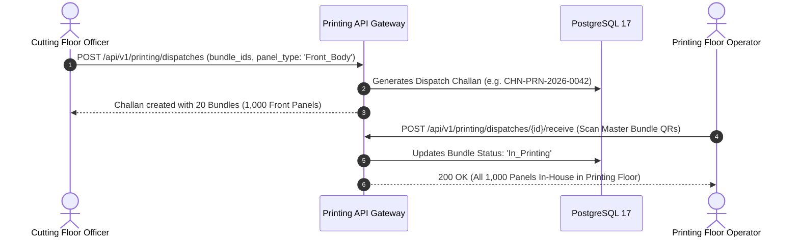
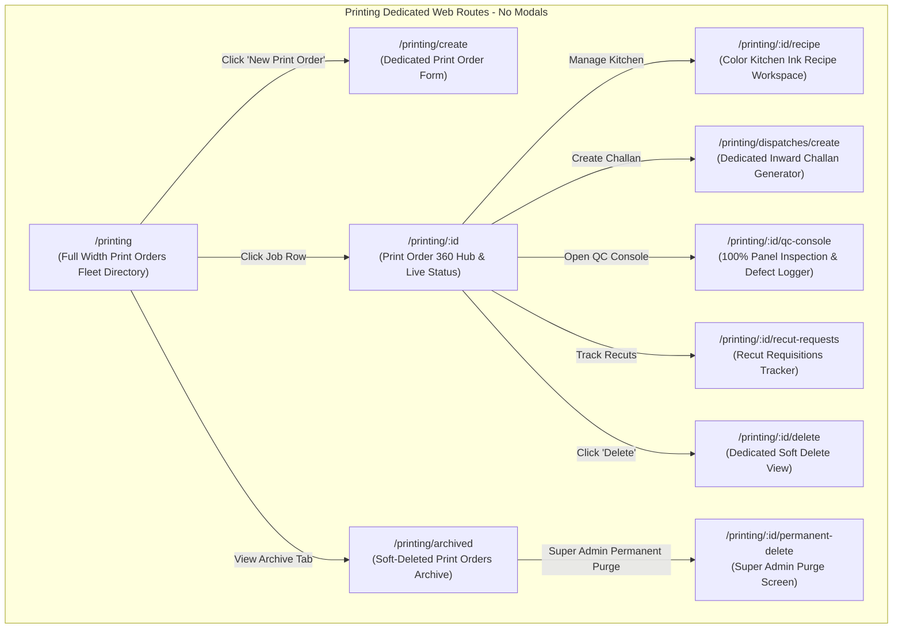
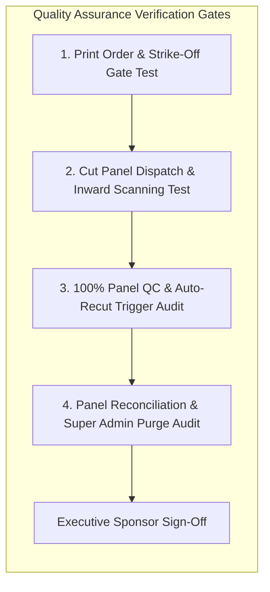

# Software Requirements Specification (SRS)
## Module 06: Screen & Digital Printing Management Engine
### প্রজেক্ট: TraceFlow RMG — Precision Fabric-to-Freight Garment Intelligence
**ডকুমেন্ট রেফারেন্স:** `TFRMG-SRS-MOD06-V2.0`  
**ডকুমেন্ট ভার্সন:** 2.0 (Global Tier-1 Enterprise Production Edition — Dedicated Embellishment Engine)  
**স্ট্যান্ডার্ড কমপ্লায়েন্স:** ISO/IEC/IEEE 29148:2018, Oeko-Tex Standard 100 / ZDHC Ink Compliance, AATCC Wash Fastness Standards  
**স্ট্যাটাস:** Approved & Production-Ready  
**টার্গেট আর্কিটেকচার:** Laravel 13 (Batch Processing & Reconciliation Engine) + React 19 / Vite (Dedicated Floor SPA) + PostgreSQL 17 + Redis 7  

---

## ১. ডকুমেন্ট গভর্নেন্স ও সংস্করণ নিয়ন্ত্রণ (Document Governance & Control)

### ১.১ সংস্করণ ইতিহাস (Revision History)
| ভার্সন | তারিখ | পর্যালোচনাকারী | পরিবর্তনের বিবরণ ও পরিধি |
|---|---|---|---|
| `v1.0` | 2026-09-02 | Lead Business Analyst | ভ্যালু অ্যাডেড সার্ভিসের প্রাথমিক ড্রাফট। |
| `v2.0` | 2026-09-02 | Principal Enterprise Architect | **স্বতন্ত্র প্রিন্টিং মডিউল হিসেবে রূপান্তর (Dedicated Printing Engine):** স্ক্রিন ও ডিজিটাল প্রিন্ট অর্ডার, কাট প্যানেল ডিসপ্যাচ ও রিসিভিং চালান, কালার কিচেন কেমিক্যাল রেসিপি, স্ট্রাইক-অফ অ্যাপ্রুভাল, কিউরিং তাপমাত্রা মনিটরিং, ১০০% প্যানেল প্রিন্ট QC ডিফেক্ট লগিং, রি-কাট রিকুইজিশন ওয়ার্কফ্লো, টু-টিয়ার ডিলিশন গভর্নেন্স (Super Admin Hard Delete Guard), কমপ্লিট PostgreSQL 17 DDL এবং RTM সংযোজন। |

### ১.২ অনুমোদনকারী ব্যক্তিবর্গ (Sign-Off & Approvals)
- **Executive Sponsor / Project Owner:** Executive Sponsor, RMG Systems
- **Lead Solution Architect:** AI Solution Architect
- **Head of Printing Division:** Screen, Sublimation & Digital Printing Operations
- **Head of Quality Assurance (QA):** Print Quality & Wash Fastness Division
- **General Manager (Factory Operations):** Manufacturing Plant Operations

---

## ২. নির্বাহী সারসংক্ষেপ ও কৌশলগত উদ্দেশ্য (Executive Summary & Strategic Scope)

### ২.১ কৌশলগত প্রেক্ষাপট (Strategic Context)
গার্মেন্টস শিল্পে বিশেষ করে টি-শার্ট, পোলো, হুডি এবং ওভেন ফ্যাশন জ্যাকেটে প্রিন্টিং একটি অত্যন্ত সংবেদনশীল এবং উচ্চ মূল্যের প্রক্রিয়া। কাপড় কাটার পর (Module 05) নির্দিষ্ট পার্টস (যেমন: Front Body, Back Body, বা Sleeves) সেলাইয়ের পূর্বে প্রিন্টিং ফ্লোরে পাঠানো হয়। 

যদি প্রিন্টিং প্রক্রিয়া কঠোর ট্রেসিবিলিটি সিস্টেমের আওতায় না থাকে, তবে ফ্যাক্টরিতে মারাত্মক সমস্যা সৃষ্টি হয়:
1. **Panel Loss & Misplacement (প্যানেল হারিয়ে যাওয়া):** কাটিং থেকে পাঠানো বান্ডলের ভেতরের ১-২টি প্যানেল প্রিন্টিং ফ্লোরে নষ্ট হলে বা হারিয়ে গেলে পুরো ৫০ পিসের বান্ডল সেলাই লাইনে অচল হয়ে যায়।
2. **Defect Rejection & Shade Mismatch (শেড অমিল):** প্রিন্টিংয়ে কোনো প্যানেল নষ্ট হলে তা একই কাপড়ের রোলের লট ও শেড থেকে রি-কাট (Recut) না করলে তৈরি পোশাকে শেড ভ্যারিয়েশন দেখা দেয়।
3. **Wash Fastness & Bleeding Disaster (রং উঠে যাওয়া):** কালার কিচেনে সঠিক কেমিক্যাল রেশিও ও কিউরিং (Curing) তাপমাত্রা ঠিক না থাকলে বায়ারের ওয়াশ টেস্টে কোটি টাকার শিপমেন্ট বাতিল হয়ে যায়।

**Module 06: Screen & Digital Printing Management** সিস্টেমের দর্শন হলো:
> **"Flawless Print Aesthetics, 100% Panel Reconciliation, Zero Transit Loss."**

```mermaid
graph TB
    subgraph Printing Lifecycle Engine (Module 06)
        direction TB
        CUT_PANELS[Cut Panels from Module 05 Bundles] --> DISPATCH[Print Dispatch Challan & QR Scan]
        DISPATCH --> STRIKE[Strike-Off Sample Approval]
        STRIKE --> RECIPE[Color Kitchen: Chemical Ink Recipe Setup]
        RECIPE --> PRINT_RUN[Screen/Digital Print Table Execution]
        PRINT_RUN --> CURING[Curing Oven & Heat Press Temperature Audit]
        CURING --> QC_INSPECT{100% Print QC Panel Inspection}
        
        QC_INSPECT -->|Pass Panels| RECON[Piece Reconciliation & Return Challan]
        QC_INSPECT -->|Damaged/Defective| RECUT[Auto Recut Requisition to Module 05]
        
        RECON --> SEW_FEED[Re-assembled Bundles to Module 09 Sewing]
    end
```

---

## ৩. অলঙ্ঘনীয় এন্টারপ্রাইজ আর্কিটেকচারাল নিয়মাবলি (Non-Negotiable Architecture Directives)

প্রজেক্টের গ্লোবাল রুলস এবং এন্টারপ্রাইজ কোয়ালিটি নিশ্চিত করতে নিচের নিয়মগুলো ১০০% অলঙ্ঘনীয়:

### ৩.১ নো মোডালস নীতিমালা (STRICT No Modals / No Popups Rule)
- **জিরো মোডাল পলিসি:** পুরো প্রিন্টিং মডিউলে কোনো ফর্ম, কনফার্মেশন, ডিসপ্যাচ চালান, ইনক রেসিপি কনফিগারেশন, ডিফেক্ট লগিং, বা সাব-স্ক্রিনের জন্য `Modal`, `Dialog`, `Popup`, `Lightbox`, বা `Drawer-over-backdrop` কঠোরভাবে নিষিদ্ধ।
- **ডেডিকেটেড রুট আর্কিটেকচার:** প্রিন্ট জব অর্ডার তৈরি, চালান ক্রিয়েশন, রিসিভিং ভেরিফিকেশন, কালার কিচেন রেসিপি, ১০০% কিউসি ইন্সপেকশন কনসোল, রি-কাট রিকুইজিশন, এবং ডিলিট কনফার্মেশন—প্রতিটি ইন্টারঅ্যাকশন একটি সুনির্দিষ্ট ব্রাউজার ইউআরএল এবং ডেডিকেটেড ফুল-স্ক্রিন ভিউতে (Full-Screen Dedicated View) লোড হবে।
- **নেভিগেশন স্ট্যাক:** প্রতিটি পেজে স্ট্যান্ডার্ড ব্যাক বাটন এবং স্ট্রাকচার্ড ব্রেডক্রাম্ব (`Dashboard > Printing > Batch-04 > 100% Panel QC Console`) থাকতে হবে যাতে ব্রাউজারের নেটিভ Forward/Back বাটন স্বাভাবিকভাবে কাজ করে এবং ডিপ-লিংক শেয়ারিং সম্ভব হয়।

### ৩.২ পিউর সার্ভার-সাইড ভ্যালিডেশন স্ট্যান্ডার্ড (Pure Server-Side Validation)
- **জিরো ক্লায়েন্ট-সাইড HTML5 ভ্যালিডেশন:** ফ্রন্টএন্ডের কোনো `<form>` বা `<input>` ফিল্ডে ব্রাউজারের ডিফল্ট HTML5 ভ্যালিডেশন অ্যাট্রিবিউট (`required`, `minlength`, `maxlength`, `pattern`, ইত্যাদি) দেওয়া যাবে না। ব্রাউজারের বিল্ট-ইন টুলটিপ পপআপ সম্পূর্ণ নিষিদ্ধ।
- **বাধ্যতামূলক `noValidate`:** সমস্ত ফ্রন্টএন্ড ফর্মে `<form noValidate>` স্পষ্টভাবে যুক্ত থাকতে হবে।
- **একীভূত এরর কন্ট্রাক্ট:** সমস্ত প্যানেল কাউন্ট ও চালান ভ্যালিডেশন ব্যাকএন্ড Laravel `FormRequest` ক্লাসের মাধ্যমে পিউর সার্ভার সাইডে ঘটবে। ইনপুট ভুল হলে বা চালান মিসম্যাচ হলে সার্ভার থেকে `422 Unprocessable Content` স্ট্যান্ডার্ড RFC 7807 কমপ্লায়েন্ট JSON এরর পাঠানো হবে।
- **ইনলাইন এরর রেন্ডারিং:** ফ্রন্টএন্ড স্বয়ংক্রিয়ভাবে রেসপন্সের ফিল্ড নেম ম্যাপ করে সংশ্লিষ্ট ইনপুট বক্সের ঠিক নিচে ক্রিস্প লাল রঙে এরর বার্তা রেন্ডার করবে।

### ৩.৩ ফ্ল্যাট এবং ক্রিস্প ডিজাইন স্ট্যান্ডার্ড (Flat Solid UI Standard)
- **নো গ্রেডিয়েন্ট পলিসি:** কোনো বাটন, কার্ড, হেডার বা সাইডবারে কোনো ধরণের গ্রেডিয়েন্ট কালার ব্যবহার করা যাবে না।
- **সলিড ডিজাইন টোকেনস:** সকল অ্যাকশন বাটন ক্রিস্প ও ফ্ল্যাট সলিড রঙে গঠিত হবে (যেমন: Primary `#2563EB`, Danger `#DC2626`, Success `#16A34A`, Neutral `#475569`, Warning `#D97706`)।
- **১০০% ইংরেজি ইউআই:** ইউজার ইন্টারফেসের সমস্ত লেবেল, ফিল্ড নেম, কলাম হেডার, অ্যাকশন বাটন এবং সিস্টেম নোটিফিকেশন ১০০% প্রফেশনাল আন্তর্জাতিক ইংরেজি ভাষায় (English) হবে।

### ৩.৪ দ্বি-স্তরবিশিষ্ট ডিলিশন গভর্নেন্স (Two-Tier Deletion Architecture)
- **সফট ডিলিট (Soft Delete):** প্রিন্ট ম্যানেজার শুধুমাত্র সেই প্রিন্ট অর্ডার বা চালান সফট ডিলিট করতে পারবেন যা এখনও ফ্লোরে প্রিন্ট শুরু হয়নি বা সেলাই লাইনে ফেরত যায়নি (`deleted_at = NOW()`)।
- **পার্মানেন্ট হার্ড ডিলিট (STRICT Super Admin Only):** ডাটাবেস থেকে স্থায়ীভাবে রো মুছে ফেলার ক্ষমতা **কেবলমাত্র `Super Admin` এর থাকবে**।
- **প্রোডাকশন রেফারেনশিয়াল প্রোটেকশন গার্ড (Referential Check):** যদি কোনো প্রিন্ট হওয়া প্যানেল অলরেডি সুইং ফ্লোরে (Module 09) সেলাই হয়ে থাকে, তবে সিস্টেম পার্মানেন্ট ডিলিট **সম্পূর্ণ ব্লক** করবে এবং `409 Conflict` রিটার্ন করবে।

---

## ৪. ইউজার পারসোনা ও এক্সেস হায়ারার্কি (User Personas & Scoping)

| পারসোনা (Persona) | ইন্টারফেস ও ডিভাইস | প্রমাণীকরণ মাধ্যম (Auth Method) | প্রিভিলেজ বাউন্ডারি (Privilege Scope) |
|---|---|---|---|
| **Printing Manager / Master** | Web Browser (Desktop) | Emp ID / Username + Password | প্রিন্ট অর্ডার তৈরি, কালার রেসিপি অনুমোদন, স্ট্রাইক-অফ সাইনঅফ, সফট ডিলিট। |
| **Color Kitchen In-Charge** | Web Browser / Tablet | Emp ID / Username + Password | কেমিক্যাল ডাইং/ইনক ফর্মুলেশন ইনপুট, সান্দ্রতা (Viscosity) ও লিকার অনুপাত। |
| **Floor Dispatch & Receive Operator** | Floor Tablet / Barcode Kiosk | Hardware Paired Station Token | কাটিং প্যানেল রিসিভিং বারকোড স্ক্যান, প্রিন্ট চালান তৈরি ও রিটার্ন কনফার্মেশন। |
| **Print Quality Inspector (QC)** | Floor Tablet / Touch Screen | Emp ID / Username + Password | ১০০% প্যানেল ভিজ্যুয়াল ইন্সপেকশন, ডিফেক্ট লগিং, রি-কাট রিকুইজিশন ট্রিগার। |
| **Super Admin** | Web Browser (Desktop) | Username + Password + TOTP 2FA | গ্লোবাল বাইপাস, লকড চালান ফোর্স আনলক, পার্মানেন্ট পার্জ। |

---

## ৫. বিস্তারিত ফাংশনাল রিকোয়ারমেন্টস (Detailed Functional Specifications)

### ৫.১ সাব-মডিউল: প্রিন্টিং অর্ডার ও স্ট্রাইক-অফ অনুমোদন (Print Order & Strike-Off)

#### ৫.১.১ স্পেসিফিকেশন ও বিজনেস লজিক
- **REQ-PRN-ORD-001 (Print Order Master Setup):**
  - বায়ার PO (Module 03) ও স্টাইলের বিপরীতে প্রিন্ট জব তৈরি হবে (যেমন: `PRN-HNM-9901-01`)।
  - প্রিন্টের ধরণ নির্বাচন: `Plastisol`, `Rubber`, `Pigment`, `Discharge`, `High_Density`, `Foil`, `Glitter`, `Sublimation`, `Direct_To_Garment_DTG`।
  - পোশাকের কোন অংশে প্রিন্ট হবে (Garment Panel Placement): `Front_Chest`, `Back_Yoke`, `Left_Sleeve`, `Right_Leg`, `All_Over_Print`।
- **REQ-PRN-ORD-002 (Strike-Off / Pre-Production Sample Approval):**
  - বাল্ক প্রোডাকশন শুরু করার পূর্বে ১টি টেস্ট সোয়াচ বা স্যাম্পল পিস প্রিন্ট করে বায়ার মার্চেন্ডাইজার কর্তৃক সাইন-অফ নিতে হবে।
  - স্ট্রাইক-অফ ফটো এবং অনুমোদন স্ট্যাটাস (`Approved`, `Rejected`, `Conditional_Pass`) সিস্টেমে সেভ না হওয়া পর্যন্ত বাল্ক কাটিং প্যানেল রিসিভ করা ব্লক থাকবে।

---

### ৫.২ সাব-মডিউল: কাট প্যানেল ডিসপ্যাচ ও রিসিভিং চালান (Panel Dispatch & Tracking)



#### ৫.২.১ স্পেসিফিকেশন ও বিজনেস লজিক
- **REQ-PRN-DSP-001 (Cut Panel Dispatch Challan):**
  - কাটিং ফ্লোর থেকে যখন নির্দিষ্ট প্যানেলগুলো আলাদা করা হয়, তখন প্রতিটি মাস্টার বান্ডলের কিউআর কোড স্ক্যান করে একটি সরকারি ও ফ্যাক্টরি কমপ্লায়েন্ট চালান তৈরি হবে (`CHN-PRN-2026-XXXX`)।
  - চালানে উল্লেখ থাকবে: বায়ার, স্টাইল, কালার, সাইজ ব্রেকডাউন, বান্ডল নম্বরসমূহ, এবং প্রেরিত প্যানেলের সংখ্যা।
- **REQ-PRN-DSP-002 (Inward Receiving & Barcode Verification):**
  - প্রিন্টিং ফ্লোরে পৌঁছানোর পর অপারেটর ট্যাবলেট দিয়ে প্রতিটি বান্ডল স্ক্যান করে রিসিভ নিশ্চিত করবে।
  - কোনো বান্ডল বা পিস কম থাকলে সিস্টেমে তাৎক্ষণিকভাবে **Transit Shortage Flag** তৈরি হবে।

---

### ৫.৩ সাব-মডিউল: কালার কিচেন ও কেমিক্যাল রেসিপি ইঞ্জিন (Color Kitchen Recipe)

#### ৫.৩.১ স্পেসিফিকেশন ও কেমিক্যাল ট্র্যাকিং
- **REQ-PRN-RCP-001 (Ink Formulation Recipe Ledger):**
  - প্রতিটি প্রিন্ট কালারের প্যানটোন কোড বা শেডের জন্য সুনির্দিষ্ট কেমিক্যাল ফর্মুলেশন:
    - Base Binder (e.g. 85%)
    - Pigment Color Concentrate (e.g. 10%)
    - Fixer / Cross-linker (e.g. 3%)
    - Retarder / Softener (e.g. 2%)
  - ZDHC (Zero Discharge of Hazardous Chemicals) এবং Oeko-Tex সার্টিফাইড কেমিক্যাল ব্যাচ নম্বর বাধ্যতামূলক।
- **REQ-PRN-RCP-002 (Curing Temperature & Dwell Time Guard):**
  - প্রিন্ট টেবিল থেকে বের হওয়ার পর কিউরিং ওভেনের তাপমাত্রা (যেমন: ১৬০°C ± ৫°C) এবং কিউরিং সময় (যেমন: ২.৫ মিনিট) লগ করতে হবে।
  - তাপমাত্রা স্ট্যান্ডার্ডের নিচে নামলে ওয়াশ টেস্টে রং ওঠার ঝুঁকি থাকায় সিস্টেম কোয়ালিটি অ্যালার্ট পাঠাবে।

---

### ৫.৪ সাব-মডিউল: ১০০% প্যানেল কিউসি ও ডিফেক্ট লগিং (100% Panel QC Console)

প্রিন্ট হওয়া প্রতিটি একক প্যানেল সেলাই লাইনে পাঠানোর আগে ১০০% ভিজ্যুয়াল কোয়ালিটি অডিট করা বাধ্যতামূলক।

#### ৫.৪.১ স্পেসিফিকেশন ও ডিফেক্ট ক্লাসিফিকেশন
- **REQ-PRN-QC-001 (100% Individual Panel Inspection):**
  - প্রিন্ট হওয়া প্রতিটি বান্ডলের সিঙ্গেল পিস কিউআর স্টিকার (Module 05) বা বান্ডল পিস কাউন্ট ধরে ইন্সপেক্টর প্রতিটি প্যানেল চেক করবেন।
- **REQ-PRN-QC-002 (Defect Categorization):**
  - সিস্টেম নিচের আন্তর্জাতিক প্রিন্ট ডিফেক্টস লগ করার সুবিধা দেবে:
    - *Color Bleeding / Spreading* (রং ছড়িয়ে যাওয়া)
    - *Off-Registration / Misalignment* (রং বা প্যাটার্ন সঠিক জায়গায় না বসা)
    - *Ink Smudge / Ghosting* (অবাঞ্ছিত কালির দাগ)
    - *Pin Holes / Mesh Blockage* (ছিদ্র বা অসম্পূর্ণ প্রিন্ট)
    - *Curing Cracking / Peel-off* (টান দিলে প্রিন্ট ফেটে যাওয়া)
    - *Shade Variation across plies*
- **REQ-PRN-QC-003 (Automatic Recut Requisition to Cutting Floor):**
  - যদি কোনো প্যানেল রিজেক্ট (`Rejected`) হয়, তবে সিস্টেম স্বয়ংক্রিয়ভাবে একটি **Recut Requisition (`print_recut_requests`)** তৈরি করবে।
  - এই রিকুইজিশনটি সরাসরি Module 05 (Cutting Floor) এর ড্যাশবোর্ডে অ্যালার্ট দেবে যাতে মূল কাটিং লটের হুবহু একই ফেব্রিক রোলের শেড গ্রুপ (Shade Group A/B) থেকে রিজেক্ট হওয়া পিসটি নতুন করে কেটে এনে বান্ডলে যুক্ত করা যায়।

---

### ৫.৫ সাব-মডিউল: পিস রিকনসিলিয়েশন ও সেলাই ফ্লোরে রিটার্ন (Return to Sewing)

#### ৫.৫.১ স্পেসিফিকেশন ও ম্যাথমেটিক্যাল ব্যালেন্স
- **REQ-PRN-REC-001 (The Golden Panel Reconciliation Equation):**
  - প্রতিটি প্রিন্ট চালানের বিপরীতে সিস্টেমকে নিচের সমীকরণটি শতভাগ মেলাতে হবে:
    $$\text{Dispatched Qty} = \text{Passed Qty} + \text{Rejected (Recut) Qty} + \text{Transit Missing Qty}$$
  - যতক্ষণ পর্যন্ত প্রতিটি একক প্যানেলের হিসাব না মিলবে, ততক্ষণ পর্যন্ত সিস্টেম চালান ক্লোজ করতে দেবে না।
- **REQ-PRN-REC-002 (Bundle Re-Assembly & Return Gate Pass):**
  - কোয়ালিটি পাস হওয়া প্যানেলগুলো এবং রি-কাট হওয়া নতুন প্যানেলগুলো পুনরায় তাদের মূল কাটিং বান্ডলে একত্রিত করা হবে।
  - এরপর সিস্টেমে একটি **Return Challan to Sewing (`CHN-RET-2026-XXXX`)** জেনারেট করে বান্ডলগুলো Module 09 (Sewing Floor) এ লাইন-ইন করার জন্য ছাড়পত্র দেওয়া হবে।

---

## ৬. প্রোডাকশন-গ্রেড ডাটাবেস আর্কিটেকচার ও DDL (Database Engineering)

নিচে PostgreSQL 17 এর জন্য সম্পূর্ণ প্রোডাকশন-রেডি DDL স্ক্রিপ্ট দেওয়া হলো। এতে প্রিন্ট অর্ডার, ডিসপ্যাচ চালান, কেমিক্যাল রেসিপি, ১০০% কিউসি অডিট এবং রি-কাট রিকুইজিশনের টেবিলসমূহ অন্তর্ভুক্ত রয়েছে।

### ৬.১ PostgreSQL 17 Production Schema (Complete DDL)

```sql
-- Enable Cryptographic Extension for UUID v4
CREATE EXTENSION IF NOT EXISTS "pgcrypto";

-- ----------------------------------------------------------------------
-- 1. Table: print_orders (Master Print Job Header)
-- ----------------------------------------------------------------------
CREATE TABLE print_orders (
    id UUID PRIMARY KEY DEFAULT gen_random_uuid(),
    print_job_no VARCHAR(60) NOT NULL,            -- e.g. PRN-HNM-9901-01
    po_id UUID NOT NULL REFERENCES purchase_orders(id) ON DELETE RESTRICT,
    print_type VARCHAR(50) NOT NULL,              -- Plastisol, Rubber, Pigment, Discharge, Sublimation, DTG
    panel_placement VARCHAR(60) NOT NULL,         -- Front_Chest, Back_Yoke, Left_Sleeve, All_Over
    total_panels_required INTEGER NOT NULL CHECK (total_panels_required > 0),
    total_panels_passed INTEGER NOT NULL DEFAULT 0,
    total_panels_rejected INTEGER NOT NULL DEFAULT 0,
    strike_off_status VARCHAR(30) NOT NULL DEFAULT 'Pending', -- Pending, Approved, Rejected
    strike_off_photo_s3_key VARCHAR(500),
    strike_off_approved_by UUID REFERENCES users(id) ON DELETE SET NULL,
    status VARCHAR(30) NOT NULL DEFAULT 'Draft',  -- Draft, In_Progress, Completed, Cancelled
    created_by UUID REFERENCES users(id) ON DELETE RESTRICT,
    created_at TIMESTAMPTZ NOT NULL DEFAULT CURRENT_TIMESTAMP,
    updated_at TIMESTAMPTZ NOT NULL DEFAULT CURRENT_TIMESTAMP,
    deleted_at TIMESTAMPTZ
);

CREATE UNIQUE INDEX uq_print_job_no_active ON print_orders (UPPER(print_job_no)) WHERE deleted_at IS NULL;
CREATE INDEX idx_print_orders_po_id ON print_orders (po_id);
CREATE INDEX idx_print_orders_status ON print_orders (status);
CREATE INDEX idx_print_orders_deleted_at ON print_orders (deleted_at);

-- ----------------------------------------------------------------------
-- 2. Table: print_recipes (Color Kitchen Chemical Formulation)
-- ----------------------------------------------------------------------
CREATE TABLE print_recipes (
    id UUID PRIMARY KEY DEFAULT gen_random_uuid(),
    print_order_id UUID NOT NULL REFERENCES print_orders(id) ON DELETE CASCADE,
    color_name VARCHAR(80) NOT NULL,              -- e.g. Navy Blue Base
    pantone_code VARCHAR(40),
    base_binder_ratio NUMERIC(5, 2) NOT NULL,     -- e.g. 85.00%
    pigment_ratio NUMERIC(5, 2) NOT NULL,         -- e.g. 10.00%
    fixer_ratio NUMERIC(5, 2) NOT NULL,           -- e.g. 3.00%
    curing_temp_celsius NUMERIC(5, 2) NOT NULL,   -- e.g. 160.00 C
    curing_time_seconds SMALLINT NOT NULL,        -- e.g. 150 seconds
    zdhc_compliance_batch VARCHAR(100),
    prepared_by UUID REFERENCES users(id) ON DELETE RESTRICT,
    created_at TIMESTAMPTZ NOT NULL DEFAULT CURRENT_TIMESTAMP
);

CREATE INDEX idx_print_recipes_order_id ON print_recipes (print_order_id);

-- ----------------------------------------------------------------------
-- 3. Table: print_dispatches (Cutting to Print Inward Challans)
-- ----------------------------------------------------------------------
CREATE TABLE print_dispatches (
    id UUID PRIMARY KEY DEFAULT gen_random_uuid(),
    challan_no VARCHAR(60) NOT NULL,              -- e.g. CHN-PRN-2026-0042
    print_order_id UUID NOT NULL REFERENCES print_orders(id) ON DELETE RESTRICT,
    source_section VARCHAR(40) NOT NULL DEFAULT 'Cutting',
    destination_section VARCHAR(40) NOT NULL DEFAULT 'Printing_Floor',
    total_bundles_sent INTEGER NOT NULL CHECK (total_bundles_sent > 0),
    total_panels_sent INTEGER NOT NULL CHECK (total_panels_sent > 0),
    total_panels_received INTEGER NOT NULL DEFAULT 0,
    dispatched_by UUID REFERENCES users(id) ON DELETE RESTRICT,
    received_by UUID REFERENCES users(id) ON DELETE SET NULL,
    dispatched_at TIMESTAMPTZ NOT NULL DEFAULT CURRENT_TIMESTAMP,
    received_at TIMESTAMPTZ,
    status VARCHAR(30) NOT NULL DEFAULT 'In_Transit', -- In_Transit, Received, Closed
    deleted_at TIMESTAMPTZ
);

CREATE UNIQUE INDEX uq_print_challan_no ON print_dispatches (UPPER(challan_no));
CREATE INDEX idx_print_dispatches_order ON print_dispatches (print_order_id);

-- ----------------------------------------------------------------------
-- 4. Table: print_dispatch_items (Individual Bundle Mapping)
-- ----------------------------------------------------------------------
CREATE TABLE print_dispatch_items (
    id UUID PRIMARY KEY DEFAULT gen_random_uuid(),
    dispatch_id UUID NOT NULL REFERENCES print_dispatches(id) ON DELETE CASCADE,
    bundle_id UUID NOT NULL REFERENCES bundles(id) ON DELETE RESTRICT,
    panel_qty INTEGER NOT NULL CHECK (panel_qty > 0),
    is_received BOOLEAN NOT NULL DEFAULT FALSE,
    created_at TIMESTAMPTZ NOT NULL DEFAULT CURRENT_TIMESTAMP
);

CREATE UNIQUE INDEX uq_dispatch_bundle ON print_dispatch_items (dispatch_id, bundle_id);
CREATE INDEX idx_dispatch_items_bundle_id ON print_dispatch_items (bundle_id);

-- ----------------------------------------------------------------------
-- 5. Table: print_qc_inspections (100% Panel QC Defect Records)
-- ----------------------------------------------------------------------
CREATE TABLE print_qc_inspections (
    id UUID PRIMARY KEY DEFAULT gen_random_uuid(),
    print_order_id UUID NOT NULL REFERENCES print_orders(id) ON DELETE CASCADE,
    bundle_id UUID NOT NULL REFERENCES bundles(id) ON DELETE RESTRICT,
    single_piece_qr_id UUID REFERENCES single_piece_qrs(id) ON DELETE SET NULL,
    inspection_status VARCHAR(30) NOT NULL,       -- Pass, Defect_Rework, Reject_Recut
    defect_type VARCHAR(60),                      -- Bleeding, Misalignment, Smudge, Pin_Hole, Curing_Crack
    inspector_id UUID REFERENCES users(id) ON DELETE RESTRICT,
    created_at TIMESTAMPTZ NOT NULL DEFAULT CURRENT_TIMESTAMP
);

CREATE INDEX idx_print_qc_order_id ON print_qc_inspections (print_order_id);
CREATE INDEX idx_print_qc_bundle_id ON print_qc_inspections (bundle_id);
CREATE INDEX idx_print_qc_status ON print_qc_inspections (inspection_status);

-- ----------------------------------------------------------------------
-- 6. Table: print_recut_requests (Auto Recut Orders to Cutting)
-- ----------------------------------------------------------------------
CREATE TABLE print_recut_requests (
    id UUID PRIMARY KEY DEFAULT gen_random_uuid(),
    recut_request_no VARCHAR(60) NOT NULL,        -- e.g. RCT-PRN-2026-0012
    print_order_id UUID NOT NULL REFERENCES print_orders(id) ON DELETE RESTRICT,
    bundle_id UUID NOT NULL REFERENCES bundles(id) ON DELETE RESTRICT,
    panel_placement VARCHAR(60) NOT NULL,
    size_id UUID NOT NULL REFERENCES sizes(id) ON DELETE RESTRICT,
    color_id UUID NOT NULL REFERENCES colors(id) ON DELETE RESTRICT,
    required_pieces SMALLINT NOT NULL CHECK (required_pieces > 0),
    reason_description TEXT NOT NULL,
    status VARCHAR(30) NOT NULL DEFAULT 'Pending_Cut', -- Pending_Cut, Cut_Done, Replaced
    fulfilled_by UUID REFERENCES users(id) ON DELETE SET NULL,
    created_at TIMESTAMPTZ NOT NULL DEFAULT CURRENT_TIMESTAMP,
    updated_at TIMESTAMPTZ NOT NULL DEFAULT CURRENT_TIMESTAMP
);

CREATE UNIQUE INDEX uq_print_recut_no ON print_recut_requests (UPPER(recut_request_no));
CREATE INDEX idx_print_recut_order_id ON print_recut_requests (print_order_id);
CREATE INDEX idx_print_recut_status ON print_recut_requests (status);
```

---

## ৭. সম্পূর্ণ এপিআই কন্ট্রাক্ট স্পেসিফিকেশন (Exhaustive API Contracts)

### ৭.১ সাধারণ আর্কিটেকচার ও স্ট্যান্ডার্ডস
- **অথেনটিকেশন:** `Authorization: Bearer <sanctum_token>`
- **কমন হেডার্স:** `Accept: application/json`, `Content-Type: application/json`
- **স্ট্যান্ডার্ড ফিল্টারিং:**
  `GET /api/v1/printing/orders?page=1&per_page=20&filter[po_id]={uuid}&filter[status]=In_Progress`

---

### ৭.২ প্রিন্ট অর্ডার ও চালান এন্ডপয়েন্টস

#### ৭.২.১ প্রিন্ট অর্ডার ক্রিয়েশন (Create Print Order)
- **মেথড ও ইউআরএল:** `POST /api/v1/printing/orders`
- **রিকোয়েস্ট বডি:**
  ```json
  {
    "po_id": "e81d7f12-9b22-4a90-8811-37b92a4f0099",
    "print_type": "Rubber",
    "panel_placement": "Front_Chest",
    "total_panels_required": 5000
  }
  ```
- **সাকসেস রেসপন্স (`201 Created`):**
  ```json
  {
    "success": true,
    "status_code": 201,
    "message": "Print order job created successfully. Please submit strike-off approval.",
    "data": {
      "print_order_id": "b100a982-192a-4f90-8800-291740011283",
      "print_job_no": "PRN-HNM-9901-01",
      "strike_off_status": "Pending",
      "status": "Draft"
    }
  }
  ```

---

#### ৭.২.২ কাটিং থেকে প্রিন্টিং ডিসপ্যাচ চালান তৈরি (Dispatch Panels to Printing)
- **মেথড ও ইউআরএল:** `POST /api/v1/printing/dispatches`
- **রিকোয়েস্ট বডি:**
  ```json
  {
    "print_order_id": "b100a982-192a-4f90-8800-291740011283",
    "bundle_ids": [
      "0e81d7f1-9b22-4a90-8811-37b92a4f0099",
      "1e81d7f1-9b22-4a90-8811-37b92a4f0099"
    ]
  }
  ```
- **সাকসেস রেসপন্স (`201 Created`):**
  ```json
  {
    "success": true,
    "status_code": 201,
    "message": "Dispatch challan generated for 2 bundles (100 panels).",
    "data": {
      "dispatch_id": "d900a982-192a-4f90-8800-291740011283",
      "challan_no": "CHN-PRN-2026-0042",
      "total_bundles_sent": 2,
      "total_panels_sent": 100,
      "status": "In_Transit"
    }
  }
  ```

---

### ৭.৩ ১০০% প্রিন্ট কিউসি ও রি-কাট রিকুইজিশন এন্ডপয়েন্ট

#### ৭.৩.১ প্যানেল কিউসি ডিফেক্ট লগিং (Log QC Inspection & Trigger Recut)
- **মেথড ও ইউআরএল:** `POST /api/v1/printing/qc/inspect`
- **রিকোয়েস্ট বডি:**
  ```json
  {
    "print_order_id": "b100a982-192a-4f90-8800-291740011283",
    "bundle_id": "0e81d7f1-9b22-4a90-8811-37b92a4f0099",
    "single_piece_qr_id": "a98df23e-6b12-4211-9a7c-87d46c0e5a99",
    "inspection_status": "Reject_Recut",
    "defect_type": "Color_Bleeding",
    "reason_description": "Binder wash-out bleeding occurred along front pocket placement area."
  }
  ```
- **সাকসেস রেসপন্স (`200 OK` — Automatic Recut Triggered):**
  ```json
  {
    "success": true,
    "status_code": 200,
    "message": "Defect logged as Reject_Recut. Automatic recut requisition dispatched to Cutting Floor (Module 05).",
    "data": {
      "recut_request_no": "RCT-PRN-2026-0012",
      "bundle_id": "0e81d7f1-9b22-4a90-8811-37b92a4f0099",
      "panel_placement": "Front_Chest",
      "required_pieces": 1,
      "status": "Pending_Cut"
    }
  }
  ```

---

### ৭.৪ প্রিন্টিং ডিলিশন এন্ডপয়েন্টস (Two-Tier Deletion Architecture)

#### ৭.৪.১ প্রিন্ট অর্ডার সফট ডিলিট (Soft Delete Print Order)
- **মেথড ও ইউআরএল:** `DELETE /api/v1/printing/orders/{id}`
- **পারমিশন:** `printing.orders.delete`
- **শর্ত:** যদি প্যানেলসমূহ এখনও সেলাই লাইনে প্রবেশ না করে থাকে।
- **সাকসেস রেসপন্স (`200 OK`):**
  ```json
  {
    "success": true,
    "status_code": 200,
    "message": "Print order soft-deleted successfully and moved to archive."
  }
  ```

#### ৭.৪.২ প্রিন্ট অর্ডার পার্মানেন্ট ডিলিট (STRICT Super Admin Only Purge)
- **মেথড ও ইউআরএল:** `DELETE /api/v1/printing/orders/{id}/force-delete`
- **অথরাইজেশন:** **STRICTLY `Super Admin` ROLE ONLY**
- **রিকোয়েস্ট বডি:**
  ```json
  {
    "super_admin_password": "MySuperAdminSecretPassword#2026"
  }
  ```
- **সেলাই শুরু হয়ে থাকলে ব্লকিং রেসপন্স (`409 Conflict`):**
  ```json
  {
    "success": false,
    "status_code": 409,
    "error_code": "CANNOT_PURGE_SEWN_PRINTS",
    "message": "Cannot permanently purge this print order because 4,850 panels are already assembled in Sewing Floor (Module 09). Soft-delete is enforced."
  }
  ```

---

## ৮. ইউজার ইন্টারফেস ও স্ক্রিন-বাই-স্ক্রিন স্পেসিফিケーション (STRICT NO MODALS)

প্রিন্টিংয়ের প্রতিটি স্ক্রিন সম্পূর্ণ ডেডিকেটেড রুটে ওপেন হবে। কোনো মোডাল বা পপআপ ডায়ালগ উইথ ব্যাকড্রপ থাকবে না।



### ৮.১ স্ক্রিন স্পেসিফিকেশন টেবিল

| রুট (Route Path) | স্ক্রিনের নাম | মূল উপাদান ও কনফিগারেশন | নো-মোডাল ডিজাইন নিশ্চিতকরণ |
|---|---|---|---|
| `/printing` | Print Orders Fleet Console | - ফুল-উইডথ ডাটা গ্রিড<br/>- কলাম: **Job No, Buyer PO, Style, Type, Placement, Required, Passed, Defective, Status, Actions**<br/>- সলিড গ্রিন "New Print Order" বোতাম (`bg-emerald-600`) | পেজিনেশন ও অ্যাকশন সবকিছু ফুল পেজে পরিচালিত হবে। |
| `/printing/create` | Dedicated Print Order Form | - `<form noValidate>` আর্কিটেকচার<br/>- বায়ার PO সিলেক্ট, প্রিন্ট টাইপ ড্রপডাউন, প্যানেল প্লেসমেন্ট<br/>- স্ট্রাইক-অফ স্যাম্পল রিকোয়ারমেন্টস<br/>- সলিড ব্লু "Save Print Job & Proceed" বোতাম | সম্পূর্ণ আলাদা পেজ। ব্রেডক্রাম্ব নেভিগেশন সহ। |
| `/printing/:id` | Print Job 360 Master Hub | - প্রিন্ট অর্ডারের সার্বিক কমার্শিয়াল ও ফ্লোর প্রগ্রেস কার্ডস<br/>- চালান রিসিভিং ও রিটার্ন সারাংশ<br/>- সাব-ট্যাবস: Inward Challans, Ink Recipe, 100% QC Console, Recut Requests | ফুল-স্ক্রিন এন্টারপ্রাইজ ড্যাশবোর্ড ভিউ। |
| `/printing/:id/recipe` | Color Kitchen Formulation | - ইনক ফর্মুলেশন অনুপাত টেবিল (Base, Pigment, Fixer, Retarder)<br/>- ZDHC কমপ্লায়েন্স ব্যাচ নম্বর ইনপুট<br/>- কিউরিং ওভেন টেম্পারেচার ও টাইম সেটিংস<br/>- সলিড ব্লু "Save Recipe Specifications" বোতাম | সম্পূর্ণ ডেডিকেটেড রেসিপি ওয়ার্কস্পেস। |
| `/printing/dispatches/create` | Inward Dispatch Challan Form | - কাটিং বান্ডল বারকোড স্ক্যান ড্রপজোন<br/>- প্যানেল কাউন্ট অটো-সামিং ও চালান জেনারেশন<br/>- সলিড ব্লু "Generate Dispatch Challan" বোতাম | সম্পূর্ণ আলাদা ডেডিকেটেড চালান পেজ। |
| `/printing/:id/qc-console` | 100% Panel QC & Defect Logger | - ফুল-স্ক্রিন টাচ-অপ্টিমাইজড কিউসি ইন্টারফেস<br/>- ডিফেক্ট বোতামসমূহ (Bleeding, Misalignment, Smudge, Pin Holes)<br/>- তাৎক্ষণিক "Pass" এবং "Reject & Trigger Recut" অ্যাকশন বোতাম | ডেডিকেটেড ফুল-স্ক্রিন ফ্লোর কনসোল। |
| `/printing/:id/recut-requests` | Recut Requisitions Tracker | - কাটিং ফ্লোরে পাঠানো রি-কাট রিকুইজিশন টেবিল<br/>- কাটিং স্ট্যাটাস (Pending Cut, Cut Done, Replaced) ট্র্যাকার | ডেডিকেটেড ট্র্যাকিং পেজ। |
| `/printing/:id/delete` | Print Soft-Delete Confirmation | - অ্যাম্বার সতর্কবার্তা ব্যানার<br/>- আন-প্রিন্টেড ডাটা সফট ডিলিটের নিয়মাবলি<br/>- সলিড অ্যাম্বার "Confirm Soft Delete" বোতাম | ডেডিকেটেড ফুল-স্ক্রিন কনফার্মেশন। নো পপআপ। |
| `/printing/:id/permanent-delete` | Print Permanent Purge Console | - **Super Admin অনলি স্ক্রিন** (অন্যদের জন্য 403 Forbidden)<br/>- গাঢ় লাল অ্যালার্ট ব্যানার<br/>- সুপার অ্যাডমিন পাসওয়ার্ড ইনপুট ফিল্ড<br/>- সেলাই ফ্লোর স্ক্যান চেকার স্ট্যাটাস ব্যাজ<br/>- সলিড ডার্ক-রেড "Purge Print Job Permanently" বোতাম | ফুল-স্ক্রিন হাইপার-সিকিউরড পার্জ ভিউ। |
| `/printing/archived` | Soft-Deleted Print Orders Archive | - সফট ডিলিট হওয়া প্রিন্ট অর্ডারের তালিকা<br/>- "Restore Job" বোতাম (`bg-amber-600`)<br/>- Super Admin এর জন্য "Purge Permanently" বোতাম | সম্পূর্ণ আলাদা আর্কাইভ পেজ। |

---

## ৯. নন-ফাংশনাল রিকোয়ারমেন্টস (Enterprise NFRs & SLAs)

### ৯.১ পারফরম্যান্স ও কনকারেন্সি বাজেট (Performance Budgets)
- **চালান বারকোড স্ক্যানিং লেটেন্সি:** ১০০টি বান্ডল একসাথে স্ক্যান করে চালান জেনারেট হতে সর্বোচ্চ **১০০ মিলিসেকেন্ড (100ms)**।
- **কিউসি ডিফেক্ট লগিং ও রি-কাট ট্রিগার:** সর্বোচ্চ **৫০ মিলিসেকেন্ড (50ms)**।
- **প্যানেল রিকনসিলিয়েশন সমীকরণ অডিট:** সর্বোচ্চ **২০ মিলিসেকেন্ড (20ms)**।

### ৯.২ ডাটা ইন্টিগ্রিটি ও ট্রানজ্যাকশন আইসোলেশন (ACID Guarantee)
- চালান জেনারেশন এবং তার অধীনস্থ `print_dispatch_items` এর শত শত রো একক ডাটাবেস ট্রানজ্যাকশনে (`DB::transaction`) সেভ হবে। কোনো একটি বান্ডলে ত্রুটি থাকলে পুরো চালান রোলব্যাক হবে।

---

## ১০. ফেইলিওর মোড ও রেসপন্স অ্যানালাইসিস (FMEA Matrix)

| ফেইলিওর সিনারিও (Failure Mode) | সম্ভাব্য প্রভাব (Impact) | তীব্রতা (Severity) | সিস্টেমের স্বয়ংক্রিয় প্রতিরক্ষা মেকানিজম (Mitigation Mechanism) |
|---|---|---|---|
| প্রিন্টিং ফ্লোরে প্যানেল নষ্ট হওয়ার পর কাটিংকে না জানানো | সেলাই লাইনে বান্ডলে পার্টস মিসিং হয়ে লাইন বন্ধ হওয়া | Critical | ১০০% কিউসি কনসোলে `Reject_Recut` বাটনে চাপ দেওয়ার সাথে সাথে স্বয়ংক্রিয়ভাবে কাটিং ফ্লোরে `print_recut_requests` ট্রিগার হবে। |
| কিউরিং তাপমাত্রা কম থাকা সত্ত্বেও কাপড় ফ্লোর থেকে ছাড়পত্র পাওয়া | বায়ারের প্রথম ওয়াশেই প্রিন্টের রং উঠে কোটি টাকার অর্ডার রিজেক্ট হওয়া | Critical | কিউরিং ওভেন টেম্পারেচার অডিট গার্ড কার্যকর থাকবে। নির্ধারিত তাপমাত্রার লগ ছাড়া কিউসি রিলিজ ব্লক থাকবে। |
| কাটিং থেকে পাঠানো প্যানেলের সাথে ফেরত আসা প্যানেল সংখ্যার অমিল | ফ্লোরে কাপড় চুরি বা প্যানেল ড্রপ হয়ে শর্ট-শিপমেন্ট | High | গোল্ডেন রিকনসিলিয়েশন ইকুয়েশন কার্যকর হবে ($\text{Sent} = \text{Passed} + \text{Rejected} + \text{Missing}$)। অমিল থাকলে চালান ক্লোজ হবে না। |
| সেলাই শুরু হওয়া প্রিন্ট অর্ডারের রো ডাটাবেস থেকে ডিলিট করার চেষ্টা | সুইং ও কিউসি ট্যাবলেটে কিউআর মিসিং ক্র্যাশ | Critical | ফরেন কি রেস্ট্রিক্ট গার্ড কার্যকর হবে। সিস্টেমে `409 Conflict` এসে পার্মানেন্ট ডিলিট অপারেশন সম্পূর্ণ ব্লক করবে। |

---

## ১১. রিকোয়ারমেন্টস ট্রেসেবিলিটি ম্যাট্রিক্স (Requirements Traceability Matrix - RTM)

| রিকোয়ারমেন্ট আইডি | ডাটাবেস টেবিল | ব্যাকএন্ড এপিআই এন্ডপয়েন্ট | ফ্রন্টএন্ড ডেডিকেটেড রুট | QA টেস্ট কেস আইডি |
|---|---|---|---|---|
| `REQ-PRN-ORD-001` (Print Order Setup) | `print_orders` | `POST /api/v1/printing/orders` | `/printing/create` | `TC-PRN-001` |
| `REQ-PRN-ORD-002` (Strike-Off Gate) | `print_orders` | `POST /api/v1/printing/orders/{id}/strike-off` | `/printing/:id` | `TC-PRN-002` |
| `REQ-PRN-DSP-001` (Dispatch Challan) | `print_dispatches` | `POST /api/v1/printing/dispatches` | `/printing/dispatches/create`| `TC-PRN-003` |
| `REQ-PRN-QC-003` (Auto Recut Trigger) | `print_recut_requests` | `POST /api/v1/printing/qc/inspect` | `/printing/:id/qc-console` | `TC-PRN-004` |
| `REQ-PRN-REC-001` (Reconciliation Eq) | `print_dispatches` | `POST /api/v1/printing/dispatches/{id}/reconcile` | `/printing/:id` | `TC-PRN-005` |
| `REQ-DEL-002` (Super Admin Hard Purge)| `print_orders` | `DELETE /api/v1/printing/orders/{id}/force-delete`| `/printing/:id/permanent-delete` | `TC-PRN-006` |

---

## ১২. কিউএ গ্রহণযোগ্যতার মানদণ্ড (Acceptance Criteria & Verification Plan)



### ১২.১ কোর টেস্ট কেসসমূহ (Core Test Execution Steps)

1. **`TC-PRN-001` (Print Order Setup & Strike-Off Lockout Test):**
   - **ধাপ ১:** বায়ার PO-এর বিপরীতে একটি নতুন রাবার প্রিন্ট অর্ডার তৈরি করা।
   - **ধাপ ২:** স্ট্রাইক-অফ অনুমোদন ছাড়া কাটিং প্যানেল রিসিভ করার চেষ্টা করা।
   - **প্রত্যাশিত ফলাফল:** সিস্টেম রিসিভ ব্লক করে বলবে "Strike-off sample must be approved before receiving bulk cut panels."
2. **`TC-PRN-003` (Cut Panel Dispatch Challan & QR Inward Test):**
   - **ধাপ:** কাটিং থেকে ২০টি বান্ডল (১,০০০ প্যানেল) স্ক্যান করে চালান তৈরি করা এবং প্রিন্টিং ফ্লোরে রিসিভ করা।
   - **প্রত্যাশিত ফলাফল:** চালানের সকল বান্ডলের স্ট্যাটাস স্বয়ংক্রিয়ভাবে `In_Printing` হিসেবে আপডেট হবে।
3. **`TC-PRN-004` (100% Panel Inspection & Auto Recut Requisition Test):**
   - **ধাপ ১:** কিউসি কনসোলে ১টি ডিফেক্টিভ প্যানেল নির্বাচন করে "Reject & Recut" বাটন চাপ দেওয়া (Defect: Color Bleeding)।
   - **প্রত্যাশিত ফলাফল:** ডাটাবেসে `print_recut_requests` এ ১টি নতুন রো তৈরি হবে এবং সাথে সাথে Module 05 কাটিং ফ্লোরের ড্যাশবোর্ডে "Urgent Recut Requisition: Front Chest, Size 32" অ্যালার্ট পাঠাবে।
4. **`TC-PRN-005` (Golden Panel Reconciliation Equation Verification):**
   - **ধাপ:** প্রেরিত ১,০০০ প্যানেলের মধ্যে ৯৮০টি পাস, ১৫টি রিজেক্ট এবং ৫টি মিসিং অবস্থায় চালান ক্লোজ করার চেষ্টা করা ($980 + 15 + 5 = 1,000$)।
   - **প্রত্যাশিত ফলাফল:** সমীকরণ মেলায় চালানটি সফলভাবে ক্লোজ হবে এবং রিটার্ন চালান তৈরি হবে।
5. **`TC-PRN-006` (Super Admin Only Permanent Purge with Production Guard):**
   - **ধাপ ১:** নন-সুপার অ্যাডমিন দ্বারা `force-delete` চেষ্টা -> `403 Forbidden`।
   - **ধাপ ২:** সেলাই লাইনে অলরেডি প্রবেশ করা প্যানেলের প্রিন্ট অর্ডারে সুপার অ্যাডমিন কর্তৃক `force-delete` চালানো -> `409 Conflict` সহ ব্লক হবে।
   - **ধাপ ৩:** আন-প্রিন্টেড ড্রাফট জবের উপর সঠিক পাসওয়ার্ড দিয়ে `force-delete` চালানো -> ডাটাবেস থেকে রো সম্পূর্ণ মুছে যাবে।
6. **`TC-UI-001` (Zero Modals Compliance Audit):**
   - **ধাপ:** প্রিন্ট অর্ডার ক্রিয়েট, চালান তৈরি, কিউসি কনসোল, রি-কাট ট্র্যাকার ও ডিলিট ফ্লো পরীক্ষা করা।
   - **প্রত্যাশিত ফলাফল:** পুরো মডিউলে কোথাও কোনো `Modal` বা `Popup` থাকবে না। প্রতিটি ফিচার ডেডিকেটেড ফুল-স্ক্রিন পেজে কাজ করবে।

---

*(ডকুমেন্ট সমাপ্ত — Module 06: Screen & Digital Printing Management Engine)*
