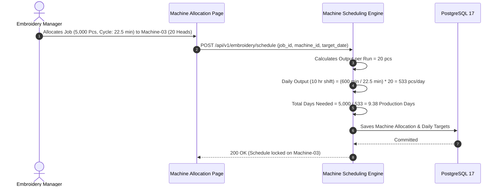
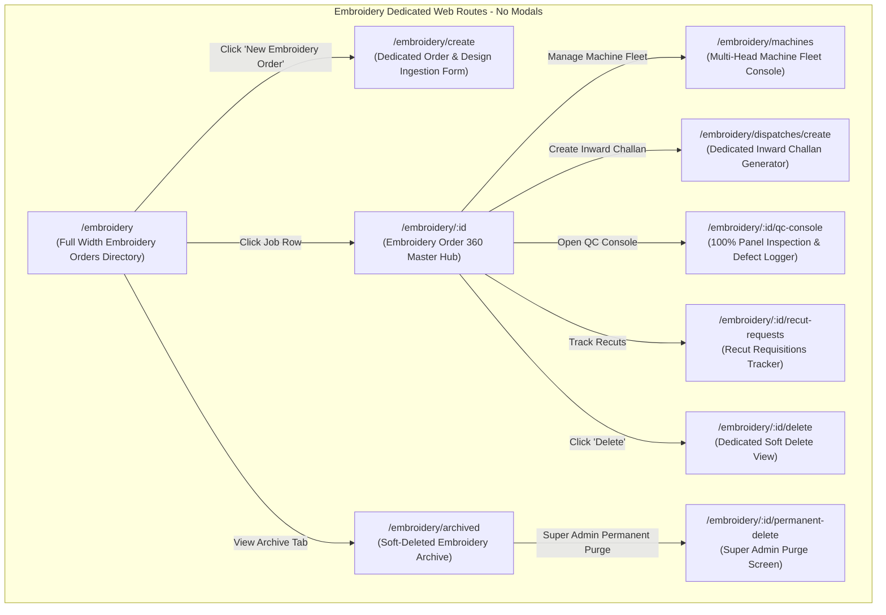
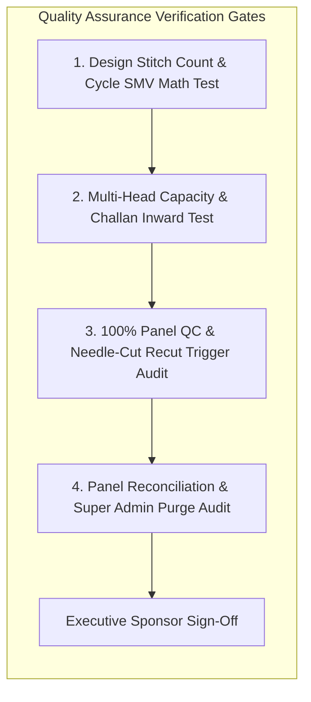

# Software Requirements Specification (SRS)
## Module 07: Computerized Embroidery Management Engine
### প্রজেক্ট: TraceFlow RMG — Precision Fabric-to-Freight Garment Intelligence
**ডকুমেন্ট রেফারেন্স:** `TFRMG-SRS-MOD07-V2.0`  
**ডকুমেন্ট ভার্সন:** 2.0 (Global Tier-1 Enterprise Production Edition — Dedicated Embellishment Engine)  
**স্ট্যান্ডার্ড কমপ্লায়েন্স:** ISO/IEC/IEEE 29148:2018, Tajima/Barudan Industrial Embroidery Standards, Oeko-Tex Thread & Backing Paper Compliance  
**স্ট্যাটাস:** Approved & Production-Ready  
**টার্গেট আর্কিটেকচার:** Laravel 13 (Multi-Head Machine Allocation & Reconciliation Engine) + React 19 / Vite (Floor Operation SPA) + PostgreSQL 17 + Redis 7  

---

## ১. ডকুমেন্ট গভর্নেন্স ও সংস্করণ নিয়ন্ত্রণ (Document Governance & Control)

### ১.১ সংস্করণ ইতিহাস (Revision History)
| ভার্সন | তারিখ | পর্যালোচনাকারী | পরিবর্তনের বিবরণ ও পরিধি |
|---|---|---|---|
| `v1.0` | 2026-09-02 | Lead Business Analyst | ভ্যালু অ্যাডেড সার্ভিসের প্রাথমিক ড্রাফট। |
| `v2.0` | 2026-09-02 | Principal Enterprise Architect | **স্বতন্ত্র এমব্রয়ডারি মডিউল হিসেবে রূপান্তর (Dedicated Embroidery Engine):** সিএডি ডিজাইন ফাইল ইনজেশন (DST/EMB), স্টিচ কাউন্ট ও এসএমভি ম্যাথ, মাল্টি-হেড মেশিন ক্যাপাসিটি শিডিউলিং, কাট প্যানেল ডিসপ্যাচ ও রিসিভিং চালান, ব্যাক পেপার/অ্যাপ্লিক ট্র্যাকিং, ১০০% প্যানেল কিউসি (নিডেল-কাট ডিফেক্ট ডিটেকশন), অটোমেটিক রি-কাট রিকুইজিশন, টু-টিয়ার ডিলিশন গভর্নেন্স (Super Admin Hard Delete Guard), কমপ্লিট PostgreSQL 17 DDL এবং RTM সংযোজন। |

### ১.২ অনুমোদনকারী ব্যক্তিবর্গ (Sign-Off & Approvals)
- **Executive Sponsor / Project Owner:** Executive Sponsor, RMG Systems
- **Lead Solution Architect:** AI Solution Architect
- **Head of Embroidery Division:** Computerized Multi-Head Machine Operations
- **Head of Quality Assurance (QA):** In-Process Embellishment Quality Division
- **General Manager (Factory Operations):** Manufacturing Plant Operations

---

## ২. নির্বাহী সারসংক্ষেপ ও কৌশলগত উদ্দেশ্য (Executive Summary & Strategic Scope)

### ২.১ কৌশলগত প্রেক্ষাপট (Strategic Context)
গার্মেন্টস শিল্পে বিশেষ করে ওভেন শার্ট, ডেনিম জিন্স, পোলো টি-শার্ট এবং বাচ্চাদের পোশাকে কম্পিউটারাইজড এমব্রয়ডারি একটি অপরিহার্য প্রিমিয়াম প্রক্রিয়া। কাপড় কাটার পর (Module 05) নির্দিষ্ট পার্টস (যেমন: Chest Logo, Back Yoke, Collar, বা Back Pocket) সেলাই লাইনে যাওয়ার পূর্বে এমব্রয়ডারি সেকশনে পাঠানো হয়।

এমব্রয়ডারি অপারেশনের প্রধান প্রযুক্তিগত জটিলতাসমূহ:
1. **স্টিচ কাউন্ট বনাম মেশিন ক্যাপাসিটি (Stitch Count & Machine RPM):** একটি ডিজাইনে ১৫,০০০ থেকে ২৫,০০০ স্টিচ থাকলে ১২-হেড বা ২০-হেড মেশিনে দৈনিক কত পিস প্রোডাকশন হবে তা সুনির্দিষ্টভাবে হিসাব না করলে সুইং লাইনে কাপড় সরবরাহ আটকে যায়।
2. **নিডেল কাট ও ফেব্রিক ড্যামেজ (Needle Cut / Fabric Holes):** সুঁচের ভোঁতা মাথা বা অতিরিক্ত ঘন স্টিচের কারণে কাপড়ে সূক্ষ্ম ছিদ্র তৈরি হয়। এটি শনাক্ত করে সাথে সাথে একই ফেব্রিক লটের রোলের শেড থেকে রি-কাট (Recut) নিশ্চিত না করলে সুইং লাইনে সম্পূর্ণ বান্ডল নষ্ট হয়।
3. **প্যানেল লস ও মিসিং পিস (Panel Loss & Thread Shading):** হাজার হাজার কাটা পার্টসের মধ্যে থেকে ১টি পার্টস হারিয়ে গেলে ৫০ পিসের বান্ডল অচল হয়ে পড়ে।

**Module 07: Computerized Embroidery Management** সিস্টেমের দর্শন হলো:
> **"Precision Stitch Integrity, Zero Needle-Cut Rejection, 100% Panel Reconciliation."**

```mermaid
graph TB
    subgraph Embroidery Lifecycle Engine (Module 07)
        direction TB
        CUT_PANELS[Cut Panels from Module 05 Bundles] --> DISPATCH[Embroidery Inward Challan & QR Scan]
        DISPATCH --> DST_FILE[DST/EMB Design File & Stitch Count Ingestion]
        DST_FILE --> SMV_CALC[Machine Cycle Time & SMV Calculation]
        SMV_CALC --> MACH_ALLOC[Multi-Head Machine Allocation & Frame Setup]
        MACH_ALLOC --> EMB_RUN[Computerized Embroidery Execution]
        EMB_RUN --> TRIMMING[Thread Trimming & Backing Paper Tearing]
        TRIMMING --> QC_INSPECT{100% Embroidery QC Panel Inspection}
        
        QC_INSPECT -->|Pass Panels| RECON[Piece Reconciliation & Return Challan]
        QC_INSPECT -->|Needle-Cut / Torn| RECUT[Auto Recut Requisition to Module 05]
        
        RECON --> SEW_FEED[Re-assembled Bundles to Module 09 Sewing]
    end
```

---

## ৩. অলঙ্ঘনীয় এন্টারপ্রাইজ আর্কিটেকচারাল নিয়মাবলি (Non-Negotiable Architecture Directives)

প্রজেক্টের গ্লোবাল রুলস এবং এন্টারপ্রাইজ কোয়ালিটি নিশ্চিত করতে নিচের নিয়মগুলো ১০০% অলঙ্ঘনীয়:

### ৩.১ নো মোডালস নীতিমালা (STRICT No Modals / No Popups Rule)
- **জিরো মোডাল পলিসি:** পুরো এমব্রয়ডারি মডিউলে কোনো ফর্ম, কনফার্মেশন, মেশিন শিডিউল প্যানেল, ডিজাইন ফাইল আপলোড, ডিফেক্ট লগিং, বা সাব-স্ক্রিনের জন্য `Modal`, `Dialog`, `Popup`, `Lightbox`, বা `Drawer-over-backdrop` কঠোরভাবে নিষিদ্ধ।
- **ডেডিকেটেড রুট আর্কিটেকচার:** এমব্রয়ডারি জব অর্ডার তৈরি, মেশিন ক্যাপাসিটি শিডিউলিং, চালান রিসিভিং ভেরিফিকেশন, ১০০% কিউসি ইন্সপেকশন কনসোল, রি-কাট রিকুইজিশন, এবং ডিলিট কনফার্মেশন—প্রতিটি ইন্টারঅ্যাকশন একটি সুনির্দিষ্ট ব্রাউজার ইউআরএল এবং ডেডিকেটেড ফুল-স্ক্রিন ভিউতে (Full-Screen Dedicated View) লোড হবে।
- **নেভিগেশন স্ট্যাক:** প্রতিটি পেজে স্ট্যান্ডার্ড ব্যাক বাটন এবং স্ট্রাকচার্ড ব্রেডক্রাম্ব (`Dashboard > Embroidery > Job-02 > 100% QC Console`) থাকতে হবে যাতে ব্রাউজারের নেটিভ Forward/Back বাটন স্বাভাবিকভাবে কাজ করে এবং ডিপ-লিংক শেয়ারিং সম্ভব হয়।

### ৩.২ পিউর সার্ভার-সাইড ভ্যালিডেশন স্ট্যান্ডার্ড (Pure Server-Side Validation)
- **জিরো ক্লায়েন্ট-সাইড HTML5 ভ্যালিডেশন:** ফ্রন্টএন্ডের কোনো `<form>` বা `<input>` ফিল্ডে ব্রাউজারের ডিফল্ট HTML5 ভ্যালিডেশন অ্যাট্রিবিউট (`required`, `minlength`, `maxlength`, `pattern`, ইত্যাদি) দেওয়া যাবে না। ব্রাউজারের বিল্ট-ইন টুলটিপ পপআপ সম্পূর্ণ নিষিদ্ধ।
- **বাধ্যতামূলক `noValidate`:** সমস্ত ফ্রন্টএন্ড ফর্মে `<form noValidate>` স্পষ্টভাবে যুক্ত থাকতে হবে।
- **একীভূত এরর কন্ট্রাক্ট:** সমস্ত প্যানেল কাউন্ট ও স্টিচ ভ্যালিডেশন ব্যাকএন্ড Laravel `FormRequest` ক্লাসের মাধ্যমে পিউর সার্ভার সাইডে ঘটবে। ইনপুট ভুল হলে বা চালান মিসম্যাচ হলে সার্ভার থেকে `422 Unprocessable Content` স্ট্যান্ডার্ড RFC 7807 কমপ্লায়েন্ট JSON এরর পাঠানো হবে।
- **ইনলাইন এরর রেন্ডারিং:** ফ্রন্টএন্ড স্বয়ংক্রিয়ভাবে রেসপন্সের ফিল্ড নেম ম্যাপ করে সংশ্লিষ্ট ইনপুট বক্সের ঠিক নিচে ক্রিস্প লাল রঙে এরর বার্তা রেন্ডার করবে।

### ৩.৩ ফ্ল্যাট এবং ক্রিস্প ডিজাইন স্ট্যান্ডার্ড (Flat Solid UI Standard)
- **নো গ্রেডিয়েন্ট পলিসি:** কোনো বাটন, কার্ড, হেডার বা সাইডবারে কোনো ধরণের গ্রেডিয়েন্ট কালার ব্যবহার করা যাবে না।
- **সলিড ডিজাইন টোকেনস:** সকল অ্যাকশন বাটন ক্রিস্প ও ফ্ল্যাট সলিড রঙে গঠিত হবে (যেমন: Primary `#2563EB`, Danger `#DC2626`, Success `#16A34A`, Neutral `#475569`, Warning `#D97706`)।
- **১০০% ইংরেজি ইউআই:** ইউজার ইন্টারফেসের সমস্ত লেবেল, ফিল্ড নেম, কলাম হেডার, অ্যাকশন বাটন এবং সিস্টেম নোটিফিকেশন ১০০% প্রফেশনাল আন্তর্জাতিক ইংরেজি ভাষায় (English) হবে।

### ৩.৪ দ্বি-স্তরবিশিষ্ট ডিলিশন গভর্নেন্স (Two-Tier Deletion Architecture)
- **সফট ডিলিট (Soft Delete):** এমব্রয়ডারি ম্যানেজার শুধুমাত্র সেই এমব্রয়ডারি অর্ডার বা চালান সফট ডিলিট করতে পারবেন যা এখনও মেশিনে রান করা শুরু হয়নি বা সেলাই লাইনে ফেরত যায়নি (`deleted_at = NOW()`)।
- **পার্মানেন্ট হার্ড ডিলিট (STRICT Super Admin Only):** ডাটাবেস থেকে স্থায়ীভাবে রো মুছে ফেলার ক্ষমতা **কেবলমাত্র `Super Admin` এর থাকবে**।
- **প্রোডাকশন রেফারেনশিয়াল প্রোটেকশন গার্ড (Referential Check):** যদি কোনো এমব্রয়ডারি হওয়া প্যানেল অলরেডি সুইং ফ্লোরে (Module 09) সেলাই হয়ে থাকে, তবে সিস্টেম পার্মানেন্ট ডিলিট **সম্পূর্ণ ব্লক** করবে এবং `409 Conflict` রিটার্ন করবে।

---

## ৪. ইউজার পারসোনা ও এক্সেস হায়ারার্কি (User Personas & Scoping)

| পারসোনা (Persona) | ইন্টারফেস ও ডিভাইস | প্রমাণীকরণ মাধ্যম (Auth Method) | প্রিভিলেজ বাউন্ডারি (Privilege Scope) |
|---|---|---|---|
| **Embroidery Manager / In-Charge** | Web Browser (Desktop) | Emp ID / Username + Password | এমব্রয়ডারি অর্ডার তৈরি, মেশিন লোডিং শিডিউল, সুতা ও এসএমভি সাইনঅফ, সফট ডিলিট। |
| **Punching & CAD Designer** | Web Browser (Desktop) | Emp ID / Username + Password | DST/EMB ফাইল আপলোড, স্টিচ কাউন্ট এক্সট্রাকশন, কালার স্টপস ও ফ্রেম রেশিও। |
| **Machine Operator / Floor Lead** | Floor Tablet / Barcode Kiosk | Hardware Paired Station Token | কাটিং প্যানেল রিসিভিং বারকোড স্ক্যান, মেশিন রান স্ট্যাটাস ও হুপ সেটআপ। |
| **Embroidery Quality Inspector (QC)**| Floor Tablet / Touch Screen | Emp ID / Username + Password | ১০০% প্যানেল ভিজ্যুয়াল ইন্সপেকশন, নিডেল-কাট ডিফেক্ট লগিং, রি-কাট রিকুইজিশন। |
| **Super Admin** | Web Browser (Desktop) | Username + Password + TOTP 2FA | গ্লোবাল বাইপাস, লকড চালান ফোর্স আনলক, পার্মানেন্ট পার্জ। |

---

## ৫. বিস্তারিত ফাংশনাল রিকোয়ারমেন্টস (Detailed Functional Specifications)

### ৫.১ সাব-মডিউল: ডিজাইন ফাইল ইনজেশন, স্টিচ কাউন্ট ও এসএমভি ক্যালকুলেটর (Design & SMV Engine)

#### ৫.১.১ স্পেসিফিকেশন ও গাণিতিক ফর্মুলা
- **REQ-EMB-CAD-001 (Design Metadata Ingestion):**
  - সিস্টেম সরাসরি তাজিমার র' ডিজাইন ফাইল (`.DST`, `.EMB`) এবং বায়ার আর্টওয়ার্ক ফাইল আপলোড সাপোর্ট করবে।
  - সিস্টেম স্বয়ংক্রিয়ভাবে এক্সট্র্যাক্ট করবে:
    - **Total Stitch Count:** (যেমন: ১৪,৫০০ স্টিচ)
    - **Color Changes / Stops:** (যেমন: ৫টি ভিন্ন রঙের সুতা)
    - **Design Dimension:** উচ্চতা × প্রস্থ (যেমন: 75mm × 50mm)
- **REQ-EMB-CAD-002 (Cycle Time & Machine SMV Formula):**
  - মেশিনের স্ট্যান্ডার্ড আরপিএম (RPM e.g. 750 থেকে 850 RPM) এবং কালার চেঞ্জ এলাউন্সের ভিত্তিতে প্রতি ব্যাচের সাইকেল টাইম স্বয়ংক্রিয়ভাবে হিসাব করা হবে:
    $$\text{Stitching Time (Minutes)} = \frac{\text{Total Stitch Count}}{\text{Machine Running RPM}}$$
    $$\text{Total Run Cycle Time} = \text{Stitching Time} + (\text{Color Changes} \times \text{Stop Allowance (0.25 min)}) + \text{Hooping/Frame Change Time}$$
  - *বাস্তব উদাহরণ:*
    - Stitches = 15,000, RPM = 750, Color Stops = 4, Frame Change = 1.5 min
    - Stitching Time = $15,000 / 750 = 20.0 \text{ minutes}$
    - Stop Allowance = $4 \times 0.25 = 1.0 \text{ minute}$
    - $\text{Total Cycle Time per Run} = 20.0 + 1.0 + 1.5 = 22.5 \text{ minutes}$।

---

### ৫.২ সাব-মডিউল: মাল্টি-হেড মেশিন ক্যাপাসিটি শিডিউলিং (Machine Allocation Engine)



#### ৫.২.১ স্পেসিফিকেশন ও বিজনেস লজিক
- **REQ-EMB-MAC-001 (Multi-Head Machine Fleet Configuration):**
  - ফ্যাক্টরির প্রতিটি এমব্রয়ডারি মেশিনের মাস্টার ডাটা: মেশিন কোড (`EMB-01`, `EMB-02`), হেড সংখ্যা (Heads Count: e.g. 12, 18, 20, 24 heads), এবং ফ্রেম টাইপ (Tubular, Flat Border, Cap Frame)।
- **REQ-EMB-MAC-002 (Accurate Machine Capacity Calculation):**
  - প্রতিটি মেশিনের আউটপুট ক্যাপাসিটি হিসাব:
    $$\text{Daily Machine Output (Pcs)} = \left(\frac{\text{Shift Working Minutes}}{\text{Cycle Time per Run}}\right) \times \text{Number of Machine Heads}$$
  - এই ক্যাপাসিটির ভিত্তিতে সিস্টেম স্বয়ংক্রিয়ভাবে জব সমাপ্তির তারিখ নির্ধারণ করবে এবং Module 04 (Production Planning) এর সাথে সিঙ্ক করবে।

---

### ৫.৩ সাব-মডিউল: কাট প্যানেল ডিসপ্যাচ ও ইনওয়ার্ড ট্র্যাকিং (Inward Panel Tracking)

#### ৫.৩.১ স্পেসিফিকেশন ও বিজনেস লজিক
- **REQ-EMB-DSP-001 (Cut Panel Inward Challan):**
  - কাটিং ফ্লোর (Module 05) থেকে যখন এমব্রয়ডারির জন্য নির্ধারিত পার্টস (যেমন: Front Pocket, Back Yoke) পাঠানো হয়, তখন মাস্টার বান্ডল কিউআর স্ক্যান করে সরকারি কমপ্লায়েন্ট চালান তৈরি হবে (`CHN-EMB-2026-XXXX`)।
- **REQ-EMB-DSP-002 (Inward Tablet Receiving & Barcode Audit):**
  - এমব্রয়ডারি ফ্লোরে পৌঁছানোর পর অপারেটর ট্যাবলেট দিয়ে প্রতিটি বান্ডল স্ক্যান করে রিসিভ নিশ্চিত করবে।
  - কোনো বান্ডলে প্যানেল কম থাকলে সিস্টেমে তাৎক্ষণিকভাবে **Transit Shortage Flag** তৈরি হবে।

---

### ৫.৪ সাব-মডিউল: থ্রেড শেড ম্যাচিং, ব্যাক পেপার ও অ্যাপ্লিক ম্যানেজমেন্ট (Consumable Governance)

#### ৫.৪.১ স্পেসিফিকেশন ও উপাদান ট্র্যাকিং
- **REQ-EMB-THR-001 (Thread Shade Matching & Verification):**
  - বায়ার অনুমোদিত সুতার ব্র্যান্ড (Madeira, Coats, Gutermann) এবং সুতার শেড কোড (e.g. `Madeira Polyneon 1801`) ডাটাবেসে ম্যাপ করা থাকবে।
  - বাল্ক এমব্রয়ডারি শুরুর পূর্বে সুতার শেড কনফার্মেশন চেকলিস্ট সাইন-অফ হতে হবে।
- **REQ-EMB-APP-002 (Backing Paper & Applique Laser Cut Tracking):**
  - কাপড়ের জিএসএম ও স্থায়িত্বের ওপর ভিত্তি করে ব্যাক পেপারের টাইপ (Tear-away Non-woven, Cut-away, বা Water-soluble film) এবং ওজন (e.g. 45 GSM / 60 GSM) লগ করা হবে।
  - অ্যাপ্লিক কাজের ক্ষেত্রে লেজার-কাট ফেব্রিক পিসের লট এবং ফিউজিং টেম্পারেচার ট্র্যাক করা হবে।

---

### ৫.৫ সাব-মডিউল: ১০০% প্যানেল কিউসি ও নিডেল-কাট ডিফেক্ট ডিটেকশন (100% Panel QC Console)

এমব্রয়ডারি সম্পন্ন হওয়ার পর সুতা কাটা (Trimming) এবং ব্যাক পেপার পরিষ্কার শেষে প্রতিটি একক প্যানেল ১০০% ভিজ্যুয়াল কোয়ালিটি অডিট করা বাধ্যতামূলক।

#### ৫.৫.১ স্পেসিফিকেশন ও ডিফেক্ট ক্লাসিফিকেশন
- **REQ-EMB-QC-001 (100% Individual Panel Inspection):**
  - প্রতিটি বান্ডলের সিঙ্গেল পিস কিউআর স্টিকার (Module 05) ধরে ইন্সপেক্টর প্রতিটি এমব্রয়ডারি করা প্যানেল অডিট করবেন।
- **REQ-EMB-QC-002 (Defect Categorization & Needle-Cut Severity):**
  - সিস্টেম নিচের আন্তর্জাতিক এমব্রয়ডারি ডিফেক্টস লগ করার সুবিধা দেবে:
    - *Needle Cut / Fabric Punctured* (সুঁচের আঘাতে কাপড়ে ছিদ্র হওয়া — **Critical Defect, Instant Reject**)
    - *Thread Break / Loose Loops* (আলগা সুতা বা লুপ — Reworkable)
    - *Puckering / Fabric Distortion* (কাপড় কুঁচকে যাওয়া)
    - *Missed Stitches / Incomplete Embroidery*
    - *Color Sequence Mismatch* (ভুল রঙের সুতা ব্যবহার)
    - *Out of Position / Tilt Registration*
- **REQ-EMB-QC-003 (Automatic Recut Requisition to Cutting Floor):**
  - যদি কোনো প্যানেল নিডেল-কাট বা কাপড়ে ছিদ্র হওয়ার কারণে রিজেক্ট (`Reject_Recut`) হয়, তবে সিস্টেম স্বয়ংক্রিয়ভাবে একটি **Recut Requisition (`emb_recut_requests`)** তৈরি করবে।
  - এই রিকুইজিশনটি সরাসরি Module 05 (Cutting Floor) এর ড্যাশবোর্ডে পুশ অ্যালার্ট দেবে যাতে মূল কাটিং লটের হুবহু একই কাপড়ের রোলের শেড গ্রুপ (Shade Group A/B) থেকে রিজেক্ট হওয়া পিসটি নতুন করে কেটে এনে বান্ডলে যুক্ত করা যায়।

---

### ৫.৬ সাব-মডিউল: পিস রিকনসিলিয়েশন ও সেলাই ফ্লোরে রিটার্ন (Return to Sewing)

#### ৫.৬.১ স্পেসিফিকেশন ও ম্যাথমেটিক্যাল ব্যালেন্স
- **REQ-EMB-REC-001 (The Golden Panel Reconciliation Equation):**
  - প্রতিটি এমব্রয়ডারি চালানের বিপরীতে সিস্টেমকে নিচের সমীকরণটি শতভাগ মেলাতে হবে:
    $$\text{Dispatched Qty} = \text{Passed Qty} + \text{Rejected (Needle-Cut) Qty} + \text{Transit Missing Qty}$$
  - যতক্ষণ পর্যন্ত প্রতিটি একক প্যানেলের হিসাব না মিলবে, ততক্ষণ পর্যন্ত সিস্টেম চালান ক্লোজ করতে দেবে না।
- **REQ-EMB-REC-002 (Bundle Re-Assembly & Return Gate Pass):**
  - কোয়ালিটি পাস হওয়া প্যানেলগুলো এবং রি-কাট হওয়া নতুন প্যানেলগুলো পুনরায় তাদের মূল কাটিং বান্ডলে একত্রিত করা হবে।
  - এরপর সিস্টেমে একটি **Return Challan to Sewing (`CHN-RET-EMB-2026-XXXX`)** জেনারেট করে বান্ডলগুলো Module 09 (Sewing Floor) এ লাইন-ইন করার জন্য ছাড়পত্র দেওয়া হবে।

---

## ৬. প্রোডাকশন-গ্রেড ডাটাবেস আর্কিটেকচার ও DDL (Database Engineering)

নিচে PostgreSQL 17 এর জন্য সম্পূর্ণ প্রোডাকশন-রেডি DDL স্ক্রিপ্ট দেওয়া হলো। এতে এমব্রয়ডারি অর্ডার, মেশিন মাস্টার, ডিসপ্যাচ চালান, ১০০% কিউসি অডিট এবং রি-কাট রিকুইজিশনের টেবিলসমূহ অন্তর্ভুক্ত রয়েছে।

### ৬.১ PostgreSQL 17 Production Schema (Complete DDL)

```sql
-- Enable Cryptographic Extension for UUID v4
CREATE EXTENSION IF NOT EXISTS "pgcrypto";

-- ----------------------------------------------------------------------
-- 1. Table: emb_machines (Multi-Head Machine Fleet Master)
-- ----------------------------------------------------------------------
CREATE TABLE emb_machines (
    id UUID PRIMARY KEY DEFAULT gen_random_uuid(),
    machine_code VARCHAR(40) NOT NULL,            -- e.g. EMB-01, EMB-02
    brand VARCHAR(60) NOT NULL,                   -- Tajima, Barudan, Brother
    model_no VARCHAR(80),
    heads_count SMALLINT NOT NULL CHECK (heads_count > 0),
    max_rpm INTEGER NOT NULL DEFAULT 850,
    frame_type VARCHAR(40) NOT NULL DEFAULT 'Flat_Border', -- Flat_Border, Tubular, Cap
    is_active BOOLEAN NOT NULL DEFAULT TRUE,
    created_at TIMESTAMPTZ NOT NULL DEFAULT CURRENT_TIMESTAMP,
    updated_at TIMESTAMPTZ NOT NULL DEFAULT CURRENT_TIMESTAMP,
    deleted_at TIMESTAMPTZ
);

CREATE UNIQUE INDEX uq_emb_machine_code ON emb_machines (UPPER(machine_code)) WHERE deleted_at IS NULL;

-- ----------------------------------------------------------------------
-- 2. Table: emb_orders (Master Embroidery Job Header)
-- ----------------------------------------------------------------------
CREATE TABLE emb_orders (
    id UUID PRIMARY KEY DEFAULT gen_random_uuid(),
    emb_job_no VARCHAR(60) NOT NULL,              -- e.g. EMB-HNM-9901-01
    po_id UUID NOT NULL REFERENCES purchase_orders(id) ON DELETE RESTRICT,
    design_name VARCHAR(100) NOT NULL,
    panel_placement VARCHAR(60) NOT NULL,         -- Chest_Logo, Back_Yoke, Collar, Pocket
    total_stitch_count INTEGER NOT NULL CHECK (total_stitch_count > 0),
    color_stops_count SMALLINT NOT NULL CHECK (color_stops_count > 0),
    dst_file_s3_key VARCHAR(500),
    calculated_smv NUMERIC(6, 2) NOT NULL CHECK (calculated_smv > 0),
    allocated_machine_id UUID REFERENCES emb_machines(id) ON DELETE RESTRICT,
    total_panels_required INTEGER NOT NULL CHECK (total_panels_required > 0),
    total_panels_passed INTEGER NOT NULL DEFAULT 0,
    total_panels_rejected INTEGER NOT NULL DEFAULT 0,
    swatch_approval_status VARCHAR(30) NOT NULL DEFAULT 'Pending', -- Pending, Approved, Rejected
    status VARCHAR(30) NOT NULL DEFAULT 'Draft',  -- Draft, Scheduled, Running, Completed, Cancelled
    created_by UUID REFERENCES users(id) ON DELETE RESTRICT,
    created_at TIMESTAMPTZ NOT NULL DEFAULT CURRENT_TIMESTAMP,
    updated_at TIMESTAMPTZ NOT NULL DEFAULT CURRENT_TIMESTAMP,
    deleted_at TIMESTAMPTZ
);

CREATE UNIQUE INDEX uq_emb_job_no_active ON emb_orders (UPPER(emb_job_no)) WHERE deleted_at IS NULL;
CREATE INDEX idx_emb_orders_po_id ON emb_orders (po_id);
CREATE INDEX idx_emb_orders_machine_id ON emb_orders (allocated_machine_id);
CREATE INDEX idx_emb_orders_status ON emb_orders (status);
CREATE INDEX idx_emb_orders_deleted_at ON emb_orders (deleted_at);

-- ----------------------------------------------------------------------
-- 3. Table: emb_dispatches (Cutting to Embroidery Inward Challans)
-- ----------------------------------------------------------------------
CREATE TABLE emb_dispatches (
    id UUID PRIMARY KEY DEFAULT gen_random_uuid(),
    challan_no VARCHAR(60) NOT NULL,              -- e.g. CHN-EMB-2026-0038
    emb_order_id UUID NOT NULL REFERENCES emb_orders(id) ON DELETE RESTRICT,
    source_section VARCHAR(40) NOT NULL DEFAULT 'Cutting',
    destination_section VARCHAR(40) NOT NULL DEFAULT 'Embroidery_Floor',
    total_bundles_sent INTEGER NOT NULL CHECK (total_bundles_sent > 0),
    total_panels_sent INTEGER NOT NULL CHECK (total_panels_sent > 0),
    total_panels_received INTEGER NOT NULL DEFAULT 0,
    dispatched_by UUID REFERENCES users(id) ON DELETE RESTRICT,
    received_by UUID REFERENCES users(id) ON DELETE SET NULL,
    dispatched_at TIMESTAMPTZ NOT NULL DEFAULT CURRENT_TIMESTAMP,
    received_at TIMESTAMPTZ,
    status VARCHAR(30) NOT NULL DEFAULT 'In_Transit', -- In_Transit, Received, Closed
    deleted_at TIMESTAMPTZ
);

CREATE UNIQUE INDEX uq_emb_challan_no ON emb_dispatches (UPPER(challan_no));
CREATE INDEX idx_emb_dispatches_order ON emb_dispatches (emb_order_id);

-- ----------------------------------------------------------------------
-- 4. Table: emb_dispatch_items (Individual Bundle Mapping)
-- ----------------------------------------------------------------------
CREATE TABLE emb_dispatch_items (
    id UUID PRIMARY KEY DEFAULT gen_random_uuid(),
    dispatch_id UUID NOT NULL REFERENCES emb_dispatches(id) ON DELETE CASCADE,
    bundle_id UUID NOT NULL REFERENCES bundles(id) ON DELETE RESTRICT,
    panel_qty INTEGER NOT NULL CHECK (panel_qty > 0),
    is_received BOOLEAN NOT NULL DEFAULT FALSE,
    created_at TIMESTAMPTZ NOT NULL DEFAULT CURRENT_TIMESTAMP
);

CREATE UNIQUE INDEX uq_emb_dispatch_bundle ON emb_dispatch_items (dispatch_id, bundle_id);
CREATE INDEX idx_emb_dispatch_items_bundle_id ON emb_dispatch_items (bundle_id);

-- ----------------------------------------------------------------------
-- 5. Table: emb_qc_inspections (100% Panel QC Defect Records)
-- ----------------------------------------------------------------------
CREATE TABLE emb_qc_inspections (
    id UUID PRIMARY KEY DEFAULT gen_random_uuid(),
    emb_order_id UUID NOT NULL REFERENCES emb_orders(id) ON DELETE CASCADE,
    bundle_id UUID NOT NULL REFERENCES bundles(id) ON DELETE RESTRICT,
    single_piece_qr_id UUID REFERENCES single_piece_qrs(id) ON DELETE SET NULL,
    inspection_status VARCHAR(30) NOT NULL,       -- Pass, Defect_Rework, Reject_Recut
    defect_type VARCHAR(60),                      -- Needle_Cut, Thread_Break, Loose_Loops, Puckering, Misalignment
    inspector_id UUID REFERENCES users(id) ON DELETE RESTRICT,
    created_at TIMESTAMPTZ NOT NULL DEFAULT CURRENT_TIMESTAMP
);

CREATE INDEX idx_emb_qc_order_id ON emb_qc_inspections (emb_order_id);
CREATE INDEX idx_emb_qc_bundle_id ON emb_qc_inspections (bundle_id);
CREATE INDEX idx_emb_qc_status ON emb_qc_inspections (inspection_status);

-- ----------------------------------------------------------------------
-- 6. Table: emb_recut_requests (Auto Recut Orders to Cutting)
-- ----------------------------------------------------------------------
CREATE TABLE emb_recut_requests (
    id UUID PRIMARY KEY DEFAULT gen_random_uuid(),
    recut_request_no VARCHAR(60) NOT NULL,        -- e.g. RCT-EMB-2026-0019
    emb_order_id UUID NOT NULL REFERENCES emb_orders(id) ON DELETE RESTRICT,
    bundle_id UUID NOT NULL REFERENCES bundles(id) ON DELETE RESTRICT,
    panel_placement VARCHAR(60) NOT NULL,
    size_id UUID NOT NULL REFERENCES sizes(id) ON DELETE RESTRICT,
    color_id UUID NOT NULL REFERENCES colors(id) ON DELETE RESTRICT,
    required_pieces SMALLINT NOT NULL CHECK (required_pieces > 0),
    defect_reason VARCHAR(100) NOT NULL,          -- Needle Cut, Fabric Punctured
    status VARCHAR(30) NOT NULL DEFAULT 'Pending_Cut', -- Pending_Cut, Cut_Done, Replaced
    fulfilled_by UUID REFERENCES users(id) ON DELETE SET NULL,
    created_at TIMESTAMPTZ NOT NULL DEFAULT CURRENT_TIMESTAMP,
    updated_at TIMESTAMPTZ NOT NULL DEFAULT CURRENT_TIMESTAMP
);

CREATE UNIQUE INDEX uq_emb_recut_no ON emb_recut_requests (UPPER(recut_request_no));
CREATE INDEX idx_emb_recut_order_id ON emb_recut_requests (emb_order_id);
CREATE INDEX idx_emb_recut_status ON emb_recut_requests (status);
```

---

## ৭. সম্পূর্ণ এপিআই কন্ট্রাক্ট স্পেসিফিকেশন (Exhaustive API Contracts)

### ৭.১ সাধারণ আর্কিটেকচার ও স্ট্যান্ডার্ডস
- **অথেনটিকেশন:** `Authorization: Bearer <sanctum_token>`
- **কমন হেডার্স:** `Accept: application/json`, `Content-Type: application/json`
- **স্ট্যান্ডার্ড ফিল্টারিং:**
  `GET /api/v1/embroidery/orders?page=1&per_page=20&filter[po_id]={uuid}&filter[status]=Running`

---

### ৭.২ এমব্রয়ডারি অর্ডার ও মেশিন অ্যালোকেশন এন্ডপয়েন্টস

#### ৭.২.১ এমব্রয়ডারি অর্ডার ক্রিয়েশন (Create Embroidery Order)
- **মেথড ও ইউআরএল:** `POST /api/v1/embroidery/orders`
- **রিকোয়েস্ট বডি:**
  ```json
  {
    "po_id": "e81d7f12-9b22-4a90-8811-37b92a4f0099",
    "design_name": "Heritage Chest Crest",
    "panel_placement": "Chest_Logo",
    "total_stitch_count": 14500,
    "color_stops_count": 5,
    "allocated_machine_id": "a100a982-192a-4f90-8800-291740011283",
    "total_panels_required": 5000
  }
  ```
- **সাকসেস রেসপন্স (`201 Created`):**
  ```json
  {
    "success": true,
    "status_code": 201,
    "message": "Embroidery order created. Cycle SMV auto-calculated to 22.5 minutes.",
    "data": {
      "emb_order_id": "c100a982-192a-4f90-8800-291740011283",
      "emb_job_no": "EMB-HNM-9901-01",
      "calculated_smv": 22.5,
      "swatch_approval_status": "Pending",
      "status": "Draft"
    }
  }
  ```

---

#### ৭.২.২ কাটিং থেকে এমব্রয়ডারি ডিসপ্যাচ চালান তৈরি (Dispatch Panels)
- **মেথড ও ইউআরএল:** `POST /api/v1/embroidery/dispatches`
- **রিকোয়েস্ট বডি:**
  ```json
  {
    "emb_order_id": "c100a982-192a-4f90-8800-291740011283",
    "bundle_ids": [
      "0e81d7f1-9b22-4a90-8811-37b92a4f0099",
      "1e81d7f1-9b22-4a90-8811-37b92a4f0099"
    ]
  }
  ```
- **সাকসেস রেসপন্স (`201 Created`):**
  ```json
  {
    "success": true,
    "status_code": 201,
    "message": "Dispatch challan generated for 2 bundles (100 panels).",
    "data": {
      "dispatch_id": "e900a982-192a-4f90-8800-291740011283",
      "challan_no": "CHN-EMB-2026-0038",
      "total_bundles_sent": 2,
      "total_panels_sent": 100,
      "status": "In_Transit"
    }
  }
  ```

---

### ৭.৩ ১০০% এমব্রয়ডারি কিউসি ও নিডেল-কাট রি-কাট এন্ডপয়েন্ট

#### ৭.৩.১ প্যানেল কিউসি ডিফেক্ট লগিং (Log QC Inspection & Trigger Recut)
- **মেথড ও ইউআরএল:** `POST /api/v1/embroidery/qc/inspect`
- **রিকোয়েস্ট বডি:**
  ```json
  {
    "emb_order_id": "c100a982-192a-4f90-8800-291740011283",
    "bundle_id": "0e81d7f1-9b22-4a90-8811-37b92a4f0099",
    "single_piece_qr_id": "a98df23e-6b12-4211-9a7c-87d46c0e5a99",
    "inspection_status": "Reject_Recut",
    "defect_type": "Needle_Cut",
    "reason_description": "Blunt needle caused fabric perforation and hole around outer crest border."
  }
  ```
- **সাকসেস রেসপন্স (`200 OK` — Automatic Recut Triggered):**
  ```json
  {
    "success": true,
    "status_code": 200,
    "message": "Defect logged as Reject_Recut (Needle Cut). Urgent recut requisition dispatched to Cutting Floor (Module 05).",
    "data": {
      "recut_request_no": "RCT-EMB-2026-0019",
      "bundle_id": "0e81d7f1-9b22-4a90-8811-37b92a4f0099",
      "panel_placement": "Chest_Logo",
      "required_pieces": 1,
      "status": "Pending_Cut"
    }
  }
  ```

---

### ৭.৪ এমব্রয়ডারি ডিলিশন এন্ডপয়েন্টস (Two-Tier Deletion Architecture)

#### ৭.৪.১ এমব্রয়ডারি অর্ডার সফট ডিলিট (Soft Delete Embroidery Order)
- **মেথড ও ইউআরএল:** `DELETE /api/v1/embroidery/orders/{id}`
- **পারমিশন:** `embroidery.orders.delete`
- **শর্ত:** যদি প্যানেলসমূহ এখনও সেলাই লাইনে প্রবেশ না করে থাকে।
- **সাকসেস রেসপন্স (`200 OK`):**
  ```json
  {
    "success": true,
    "status_code": 200,
    "message": "Embroidery order soft-deleted successfully and moved to archive."
  }
  ```

#### ৭.৪.২ এমব্রয়ডারি অর্ডার পার্মানেন্ট ডিলিট (STRICT Super Admin Only Purge)
- **মেথড ও ইউআরএল:** `DELETE /api/v1/embroidery/orders/{id}/force-delete`
- **অথরাইজেশন:** **STRICTLY `Super Admin` ROLE ONLY**
- **রিকোয়েস্ট বডি:**
  ```json
  {
    "super_admin_password": "MySuperAdminSecretPassword#2026"
  }
  ```
- **সেলাই শুরু হয়ে থাকলে ব্লকিং রেসপন্স (`409 Conflict`):**
  ```json
  {
    "success": false,
    "status_code": 409,
    "error_code": "CANNOT_PURGE_SEWN_EMB",
    "message": "Cannot permanently purge this embroidery order because 4,920 panels are already assembled in Sewing Floor (Module 09). Soft-delete is enforced."
  }
  ```

---

## ৮. ইউজার ইন্টারফেস ও স্ক্রিন-বাই-স্ক্রিন স্পেসিফিকেশন (STRICT NO MODALS)

এমব্রয়ডারির প্রতিটি স্ক্রিন সম্পূর্ণ ডেডিকেটেড রুটে ওপেন হবে। কোনো মোডাল বা পপআপ ডায়ালগ উইথ ব্যাকড্রপ থাকবে না।



### ৮.১ স্ক্রিন স্পেসিফিকেশন টেবিল

| রুট (Route Path) | স্ক্রিনের নাম | মূল উপাদান ও কনফিগারেশন | নো-মোডাল ডিজাইন নিশ্চিতকরণ |
|---|---|---|---|
| `/embroidery` | Embroidery Fleet Console | - ফুল-উইডথ ডাটা গ্রিড<br/>- কলাম: **Job No, Buyer PO, Style, Design, Stitches, Machine, Target Pcs, Status, Actions**<br/>- সলিড গ্রিন "New Embroidery Order" বোতাম (`bg-emerald-600`) | পেজিনেশন ও অ্যাকশন সবকিছু ফুল পেজে পরিচালিত হবে। |
| `/embroidery/create` | Dedicated Embroidery Order Form | - `<form noValidate>` আর্কিটেকচার<br/>- বায়ার PO সিলেক্ট, ডিজাইন নাম, প্লেসমেন্ট ড্রপডাউন<br/>- DST/EMB ফাইল আপলোড ড্রপজোন<br/>- স্টিচ কাউন্ট ও সাইকেল টাইম লাইভ ক্যালকুলেটর<br/>- সলিড ব্লু "Save Embroidery Job & Proceed" বোতাম | সম্পূর্ণ আলাদা পেজ। ব্রেডক্রাম্ব নেভিগেশন সহ। |
| `/embroidery/:id` | Embroidery Job 360 Master Hub | - এমব্রয়ডারি অর্ডারের সার্বিক কমার্শিয়াল ও মেশিন লোডিং প্রগ্রেস কার্ডস<br/>- মেশিন রান স্পিড ও আউটপুট মিটার<br/>- সাব-ট্যাবস: Inward Challans, Machine Assignment, 100% QC Console, Recut Requests | ফুল-স্ক্রিন এন্টারপ্রাইজ ড্যাশবোর্ড ভিউ। |
| `/embroidery/machines` | Multi-Head Machine Fleet Console | - ফ্যাক্টরির সমস্ত এমব্রয়ডারি মেশিনের লাইভ স্ট্যাটাস গ্রিড<br/>- হেড সংখ্যা, আরপিএম, অ্যাক্টিভ জব ও লোডিং এফিসিয়েন্সি<br/>- সলিড ব্লু "Configure Machine" বোতাম | সম্পূর্ণ ডেডিকেটেড মেশিন কনসোল। |
| `/embroidery/dispatches/create` | Inward Dispatch Challan Form | - কাটিং বান্ডল বারকোড স্ক্যান ড্রপজোন<br/>- প্যানেল কাউন্ট অটো-সামিং ও চালান জেনারেশন<br/>- সলিড ব্লু "Generate Dispatch Challan" বোতাম | সম্পূর্ণ আলাদা ডেডিকেটেড চালান পেজ। |
| `/embroidery/:id/qc-console` | 100% Panel QC & Defect Logger | - ফুল-স্ক্রিন টাচ-অপ্টিমাইজড কিউসি ইন্টারফেস<br/>- ডিফেক্ট বোতামসমূহ (Needle Cut, Thread Break, Loose Loops, Puckering)<br/>- তাৎক্ষণিক "Pass" এবং "Reject & Trigger Recut" অ্যাকশন বোতাম | ডেডিকেটেড ফুল-স্ক্রিন ফ্লোর কনসোল। |
| `/embroidery/:id/recut-requests` | Recut Requisitions Tracker | - কাটিং ফ্লোরে পাঠানো রি-কাট রিকুইজিশন টেবিল<br/>- কাটিং স্ট্যাটাস (Pending Cut, Cut Done, Replaced) ট্র্যাকার | ডেডিকেটেড ট্র্যাকিং পেজ। |
| `/embroidery/:id/delete` | Embroidery Soft-Delete Confirmation | - অ্যাম্বার সতর্কবার্তা ব্যানার<br/>- আন-প্রসেসড ডাটা সফট ডিলিটের নিয়মাবলি<br/>- সলিড অ্যাম্বার "Confirm Soft Delete" বোতাম | ডেডিকেটেড ফুল-স্ক্রিন কনফার্মেশন। নো পপআপ। |
| `/embroidery/:id/permanent-delete` | Embroidery Permanent Purge Console | - **Super Admin অনলি স্ক্রিন** (অন্যদের জন্য 403 Forbidden)<br/>- গাঢ় লাল অ্যালার্ট ব্যানার<br/>- সুপার অ্যাডমিন পাসওয়ার্ড ইনপুট ফিল্ড<br/>- সেলাই ফ্লোর স্ক্যান চেকার স্ট্যাটাস ব্যাজ<br/>- সলিড ডার্ক-রেড "Purge Embroidery Job Permanently" বোতাম | ফুল-স্ক্রিন হাইপার-সিকিউরড পার্জ ভিউ। |
| `/embroidery/archived` | Soft-Deleted Embroidery Archive | - সফট ডিলিট হওয়া এমব্রয়ডারি অর্ডারের তালিকা<br/>- "Restore Job" বোতাম (`bg-amber-600`)<br/>- Super Admin এর জন্য "Purge Permanently" বোতাম | সম্পূর্ণ আলাদা আর্কাইভ পেজ। |

---

## ৯. নন-ফাংশনাল রিকোয়ারমেন্টস (Enterprise NFRs & SLAs)

### ৯.১ পারফরম্যান্স ও কনকারেন্সি বাজেট (Performance Budgets)
- **ডিজাইন মেটাডাটা এক্সট্রাকশন লেটেন্সি:** ২০,০০০ স্টিচ বিশিষ্ট DST ফাইল পার্সিং সর্বোচ্চ **১০০ মিলিসেকেন্ড (100ms)**।
- **চালান বারকোড স্ক্যানিং লেটেন্সি:** ৫০টি বান্ডল একসাথে স্ক্যান করে চালান জেনারেট হতে সর্বোচ্চ **৮০ মিলিসেকেন্ড (80ms)**।
- **নিডেল-কাট রি-কাট রিকুইজিশন ডিসপ্যাচ:** সর্বোচ্চ **৫০ মিলিসেকেন্ড (50ms)**।

### ৯.২ ডাটা ইন্টিগ্রিটি ও ট্রানজ্যাকশন আইসোলেশন (ACID Guarantee)
- চালান জেনারেশন এবং তার অধীনস্থ `emb_dispatch_items` এর সকল রো একক ডাটাবেস ট্রানজ্যাকশনে (`DB::transaction`) সেভ হবে। কোনো একটি বান্ডলে ত্রুটি থাকলে পুরো চালান রোলব্যাক হবে।

---

## ১০. ফেইলিওর মোড ও রেসপন্স অ্যানালাইসিস (FMEA Matrix)

| ফেইলিওর সিনারিও (Failure Mode) | সম্ভাব্য প্রভাব (Impact) | তীব্রতা (Severity) | সিস্টেমের স্বয়ংক্রিয় প্রতিরক্ষা মেকানিজম (Mitigation Mechanism) |
|---|---|---|---|
| ভোঁতা নিডেলের কারণে কাপড়ে ছিদ্র হয়ে যাওয়া গোপন রাখা | সেলাইয়ের পর ফিনিশিং বা ওয়াশিংয়ে কাপড় ফেটে যাওয়া | Critical | ১০০% কিউসি কনসোলে `Needle_Cut` সিলেক্ট করার সাথে সাথে প্যানেল বাতিল হবে এবং কাটিং ফ্লোরে স্বয়ংক্রিয় রি-কাট টিকিট চলে যাবে। |
| ভুল রঙের সুতা দিয়ে সম্পূর্ণ লট এমব্রয়ডারি করা | বায়ার অডিটে সম্পূর্ণ লট রিজেক্ট হওয়া | Critical | বাল্ক এমব্রয়ডারি শুরুর পূর্বে সিস্টেমে থ্রেড শেড কোড (Madeira/Coats) সাইন-অফ গেটকিপিং সক্রিয় থাকবে। |
| কাটিং থেকে পাঠানো প্যানেলের সাথে ফেরত আসা প্যানেল সংখ্যার অমিল | বান্ডলে পিস শর্ট হয়ে সেলাই লাইনে লাইন স্টারভেশন | High | গোল্ডেন রিকনসিলিয়েশন ইকুয়েশন কার্যকর হবে ($\text{Sent} = \text{Passed} + \text{Rejected} + \text{Missing}$)। অমিল থাকলে চালান ক্লোজ হবে না। |
| সেলাই শুরু হওয়া এমব্রয়ডারি অর্ডারের রো ডাটাবেস থেকে ডিলিট করার চেষ্টা | সুইং ট্যাবলেটে কিউআর মিসিং ক্র্যাশ | Critical | ফরেন কি রেস্ট্রিক্ট গার্ড কার্যকর হবে। সিস্টেমে `409 Conflict` এসে পার্মানেন্ট ডিলিট অপারেশন সম্পূর্ণ ব্লক করবে। |

---

## ১১. রিকোয়ারমেন্টস ট্রেসেবিলিটি ম্যাট্রিক্স (Requirements Traceability Matrix - RTM)

| রিকোয়ারমেন্ট আইডি | ডাটাবেস টেবিল | ব্যাকএন্ড এপিআই এন্ডপয়েন্ট | ফ্রন্টএন্ড ডেডিকেটেড রুট | QA টেস্ট কেস আইডি |
|---|---|---|---|---|
| `REQ-EMB-CAD-001` (Design Ingestion) | `emb_orders` | `POST /api/v1/embroidery/orders` | `/embroidery/create` | `TC-EMB-001` |
| `REQ-EMB-MAC-002` (Machine Capacity) | `emb_machines`, `emb_orders` | `POST /api/v1/embroidery/schedule` | `/embroidery/:id` | `TC-EMB-002` |
| `REQ-EMB-DSP-001` (Dispatch Challan) | `emb_dispatches` | `POST /api/v1/embroidery/dispatches` | `/embroidery/dispatches/create`| `TC-EMB-003` |
| `REQ-EMB-QC-003` (Auto Recut Trigger) | `emb_recut_requests` | `POST /api/v1/embroidery/qc/inspect` | `/embroidery/:id/qc-console` | `TC-EMB-004` |
| `REQ-EMB-REC-001` (Reconciliation Eq) | `emb_dispatches` | `POST /api/v1/embroidery/dispatches/{id}/reconcile`| `/embroidery/:id` | `TC-EMB-005` |
| `REQ-DEL-002` (Super Admin Hard Purge)| `emb_orders` | `DELETE /api/v1/embroidery/orders/{id}/force-delete`| `/embroidery/:id/permanent-delete` | `TC-EMB-006` |

---

## ১২. কিউএ গ্রহণযোগ্যতার মানদণ্ড (Acceptance Criteria & Verification Plan)



### ১২.১ কোর টেস্ট কেসসমূহ (Core Test Execution Steps)

1. **`TC-EMB-001` (Design Stitch Count & Cycle SMV Math Accuracy):**
   - **ধাপ:** Stitch Count = 15,000, Machine RPM = 750, Color Stops = 4 ইনপুট দেওয়া।
   - **প্রত্যাশিত ফলাফল:** সিস্টেম স্বয়ংক্রিয়ভাবে $\text{Stitching Time} = 20.0 \text{ min}$ এবং $\text{Total Cycle Time} = 22.5 \text{ min}$ গণনা করবে।
2. **`TC-EMB-002` (Multi-Head Machine Allocation & Capacity Schedule Test):**
   - **ধাপ:** ২০-হেড মেশিনে (Machine-03) ২২.৫ মিনিটের সাইকেল টাইমে ১০ ঘণ্টার শিফটে প্ল্যান রান করা।
   - **প্রত্যাশিত ফলাফল:** সিস্টেম দৈনিক আউটপুট ৫৩৩ পিস হিসাব করবে এবং ৫,০০০ পিসের জন্য ৯.৩৮ প্রোডাকশন ডে বরাদ্দ করবে।
3. **`TC-EMB-004` (Needle-Cut Defect & Automatic Recut Requisition Test):**
   - **ধাপ ১:** কিউসি কনসোলে ১টি ডিফেক্টিভ প্যানেল নির্বাচন করে "Reject & Recut" বাটন চাপ দেওয়া (Defect: Needle_Cut)।
   - **প্রত্যাশিত ফলাফল:** ডাটাবেসে `emb_recut_requests` এ ১টি নতুন রো তৈরি হবে এবং সাথে সাথে Module 05 কাটিং ফ্লোরের ড্যাশবোর্ডে "Urgent Recut Requisition: Needle Cut, Front Chest" অ্যালার্ট পাঠাবে।
4. **`TC-EMB-005` (Golden Panel Reconciliation Equation Verification):**
   - **ধাপ:** প্রেরিত ৫০০ প্যানেলের মধ্যে ৪৯০টি পাস, ৮টি নিডেল-কাট রিজেক্ট এবং ২টি মিসিং অবস্থায় চালান ক্লোজ করার চেষ্টা করা ($490 + 8 + 2 = 500$)।
   - **প্রত্যাশিত ফলাফল:** সমীকরণ মেলায় চালানটি সফলভাবে ক্লোজ হবে এবং রিটার্ন চালান তৈরি হবে।
5. **`TC-EMB-006` (Super Admin Only Permanent Purge with Production Guard):**
   - **ধাপ ১:** নন-সুপার অ্যাডমিন দ্বারা `force-delete` চালানো -> `403 Forbidden`।
   - **ধাপ ২:** সেলাই লাইনে অলরেডি প্রবেশ করা প্যানেলের এমব্রয়ডারি অর্ডারে সুপার অ্যাডমিন কর্তৃক `force-delete` চালানো -> `409 Conflict` সহ ব্লক হবে।
   - **ধাপ ৩:** আন-প্রসেসড ড্রাফট জবের উপর সঠিক পাসওয়ার্ড দিয়ে `force-delete` চালানো -> ডাটাবেস থেকে রো সম্পূর্ণ মুছে যাবে।
6. **`TC-UI-001` (Zero Modals Compliance Audit):**
   - **ধাপ:** এমব্রয়ডারি অর্ডার ক্রিয়েট, মেশিন কনসোল, চালান তৈরি, কিউসি কনসোল, রি-কাট ট্র্যাকার ও ডিলিট ফ্লো পরীক্ষা করা।
   - **প্রত্যাশিত ফলাফল:** পুরো মডিউলে কোথাও কোনো `Modal` বা `Popup` থাকবে না। প্রতিটি ফিচার ডেডিকেটেড ফুল-স্ক্রিন পেজে কাজ করবে।

---

*(ডকুমেন্ট সমাপ্ত — Module 07: Computerized Embroidery Management Engine)*
