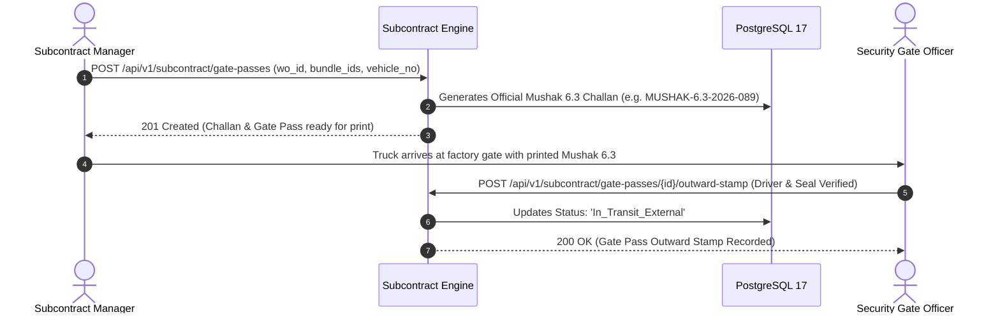
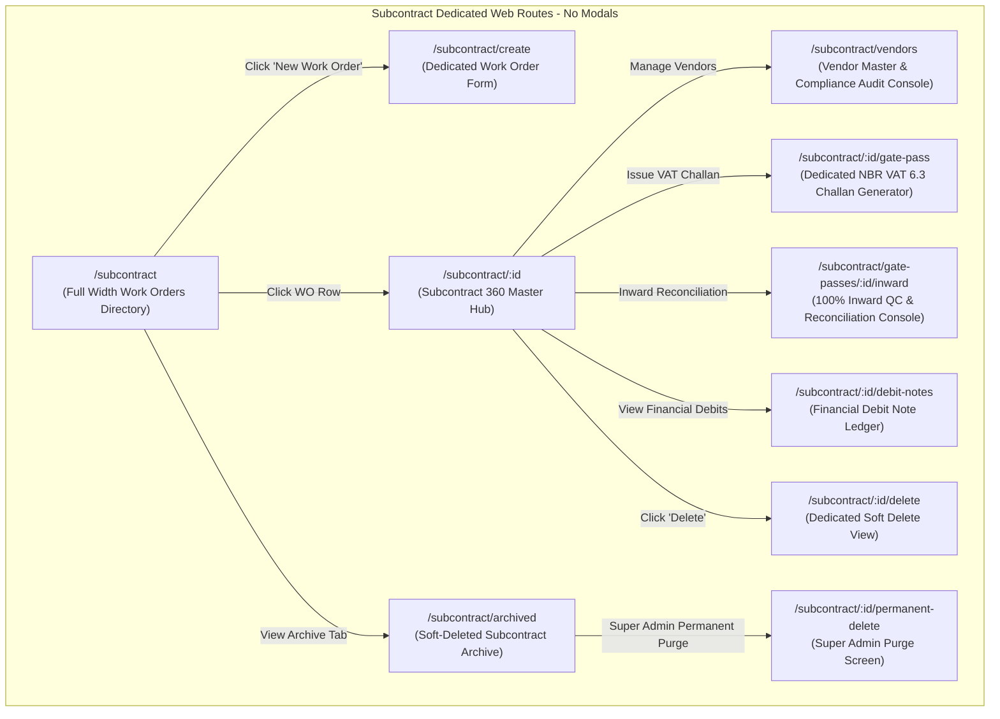
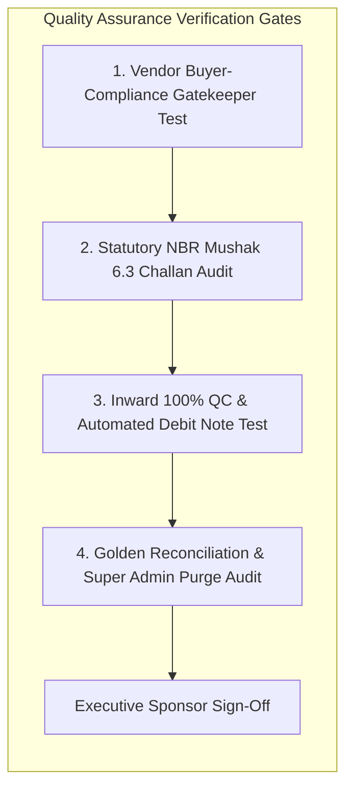

# Software Requirements Specification (SRS)
## Module 08: Subcontracting & Job-Work Governance Engine
### প্রজেক্ট: TraceFlow RMG — Precision Fabric-to-Freight Garment Intelligence
**ডকুমেন্ট রেফারেন্স:** `TFRMG-SRS-MOD08-V2.0`  
**ডকুমেন্ট ভার্সন:** 2.0 (Global Tier-1 Enterprise Production Edition — Statutory Vendor Governance)  
**স্ট্যান্ডার্ড কমপ্লায়েন্স:** ISO/IEC/IEEE 29148:2018, National Board of Revenue (NBR) VAT Challan 6.3 Compliance, Buyer Subcontract Social & Technical Audit Governance  
**স্ট্যাটাস:** Approved & Production-Ready  
**টার্গেট আর্কিটেকচার:** Laravel 13 (Reconciliation & Financial Debit Engine) + React 19 / Vite (Dedicated Gate & Floor SPA) + PostgreSQL 17 + Redis 7  

---

## ১. ডকুমেন্ট গভর্নেন্স ও সংস্করণ নিয়ন্ত্রণ (Document Governance & Control)

### ১.১ সংস্করণ ইতিহাস (Revision History)
| ভার্সন | তারিখ | পর্যালোচনাকারী | পরিবর্তনের বিবরণ ও পরিধি |
|---|---|---|---|
| `v1.0` | 2026-09-02 | Lead Business Analyst | ভ্যালু অ্যাডেড সার্ভিসের প্রাথমিক ড্রাফট। |
| `v2.0` | 2026-09-02 | Principal Enterprise Architect | **স্বতন্ত্র সাবকন্ট্রাক্টিং মডিউল হিসেবে রূপান্তর (Dedicated Subcontracting Engine):** অনুমোদিত ভেন্ডর কমপ্লায়েন্স অডিট, সাবকন্ট্রাক্ট ওয়ার্ক অর্ডার (WO), সরকারি ভ্যাট চালান ৬.৩ (Mushak 6.3) ও সিকিউরড গেট পাস, আউটওয়ার্ড বারকোড স্যাক ট্র্যাকিং, ইনওয়ার্ড ১০০% কোয়ালিটি রিসিভিং, গোল্ডেন পিস রিকনসিলিয়েশন, স্বয়ংক্রিয় ফাইন্যান্সিয়াল ডেবিট নোট জেনারেশন, টু-টিয়ার ডিলিশন গভর্নেন্স (Super Admin Hard Delete Guard), কমপ্লিট PostgreSQL 17 DDL এবং RTM সংযোজন। |

### ১.২ অনুমোদনকারী ব্যক্তিবর্গ (Sign-Off & Approvals)
- **Executive Sponsor / Project Owner:** Executive Sponsor, RMG Systems
- **Lead Solution Architect:** AI Solution Architect
- **Head of Commercial & Procurement:** Subcontracting & Vendor Contracting Division
- **Head of Factory Compliance & Audit:** Buyer Social & Technical Security Compliance
- **Chief Financial Officer (CFO):** Commercial Export & Accounts Division

---

## ২. নির্বাহী সারসংক্ষেপ ও কৌশলগত উদ্দেশ্য (Executive Summary & Strategic Scope)

### ২.১ কৌশলগত প্রেক্ষাপট (Strategic Context)
গার্মেন্টস শিল্পে পিক সিজনে ফ্যাক্টরির নিজস্ব উৎপাদন ক্ষমতার চেয়ে বায়ারের অর্ডারের চাপ বেড়ে গেলে কিংবা বিশেষায়িত কোনো কাজ (যেমন: বিশেষ প্লিটিং, স্মকিং, কুশন কুইল্টিং, লেজার কাট, অথবা অতিরিক্ত সুইং ক্যাপাসিটি) থাকলে তা বাইরের অনুমোদিত তৃতীয় পক্ষ ফ্যাক্টরিতে (Subcontractor / Job-Worker) পাঠাতে হয়।

সাবকন্ট্রাক্টিং প্রক্রিয়ার প্রধান ব্যবসায়িক ও আইনি ঝুঁকিসমূহ:
1. **Unapproved Factory / Unauthorized Subcontracting (অননুমোদিত ফ্যাক্টরি ঝুঁকি):** বায়ারের পূর্বানুমতি ও কমপ্লায়েন্স অডিট ছাড়া কোনো আন-অথোরাইজড কারখানায় কাজ পাঠালে বায়ার সম্পূর্ণ অর্ডার বাতিল এবং ফ্যাক্টরি ব্ল্যাকলিস্ট করতে পারে।
2. **Statutory Tax & Customs Seizure (আইনি কর ও চালান ঝুঁকি):** জাতীয় রাজস্ব বোর্ডের (NBR) ভ্যাট আইন অনুযায়ী কারখানা থেকে যেকোনো থান কাপড় বা কাটা পার্টস বের করার জন্য **মূসক চালান ৬.৩ (VAT Mushak-6.3)** এবং রিটার্নেবল গেট পাস থাকা বাধ্যতামূলক; অন্যথায় কাস্টমস বা ভ্যাট গোয়েন্দা ট্রাক জব্দ করতে পারে।
3. **Transit Shortage & Financial Dispute (পিস মিসিং ও বিল বিবাদ):** ফ্যাক্টরি থেকে ১০,০০০ পিস পাঠিয়ে ফেরত আসার সময় ৯,৮৫০ পিস পাওয়া গেলে অবশিষ্ট ১৫০ পিসের মূল্য কে পরিশোধ করবে? স্বয়ংক্রিয় ডেবিট নোট না থাকলে ভেন্ডরের সাথে মারাত্মক আর্থিক বিবাদ তৈরি হয়।

**Module 08: Subcontracting & Job-Work Governance** সিস্টেমের দর্শন হলো:
> **"100% Statutory Compliance, Zero Unaccounted Transit Loss, Automated Financial Debit Settlement."**

```mermaid
graph TB
    subgraph Subcontracting Lifecycle Engine (Module 08)
        direction TB
        WO[Subcontract Work Order - Negotiated CMT & Rate] --> COMPLY{Vendor Buyer Compliance Verification}
        COMPLY -->|Audited & Approved| GP_OUT[Statutory VAT Challan 6.3 & Returnable Gate Pass]
        
        GP_OUT --> TRANSIT_PACK[Transit Sacks/Cartons Packed & Barcode Tagged]
        TRANSIT_PACK --> GATE_EXIT[Security Gate Outward Verification & Vehicle Stamp]
        
        GATE_EXIT --> VENDOR_RUN[Subcontractor Production Floor]
        VENDOR_RUN --> GATE_IN[Security Gate Inward Ingestion]
        
        GATE_IN --> QC_REC[Inward Receiving & 100% Quality Inspection]
        QC_REC --> RECON{Golden Subcontract Reconciliation Engine}
        
        RECON -->|Exact Match| PASS_FEED[Handover to Module 09 Sewing / Mod 12 Finishing]
        RECON -->|Damaged/Lost > Allowance| DEBIT[Automated Financial Debit Note Generation]
        DEBIT --> BILL_SETTLE[Final Commercial Invoice Settlement]
    end
```

---

## ৩. অলঙ্ঘনীয় এন্টারপ্রাইজ আর্কিটেকচারাল নিয়মাবলি (Non-Negotiable Architecture Directives)

প্রজেক্টের গ্লোবাল রুলস এবং এন্টারপ্রাইজ কোয়ালিটি নিশ্চিত করতে নিচের নিয়মগুলো ১০০% অলঙ্ঘনীয়:

### ৩.১ নো মোডালস নীতিমালা (STRICT No Modals / No Popups Rule)
- **জিরো মোডাল পলিসি:** পুরো সাবকন্ট্রাক্ট মডিউলে কোনো ফর্ম, কনফার্মেশন, গেট পাস ক্রিয়েশন, ভ্যাট চালান প্রিভিউ, ইনওয়ার্ড রিসিভিং, বা সাব-স্ক্রিনের জন্য `Modal`, `Dialog`, `Popup`, `Lightbox`, বা `Drawer-over-backdrop` কঠোরভাবে নিষিদ্ধ।
- **ডেডিকেটেড রুট আর্কিটেকচার:** ভেন্ডর অনবোর্ডিং, সাবকন্ট্রাক্ট ওয়ার্ক অর্ডার তৈরি, মূসক ৬.৩ চালান ভিউ, গেট পাস কনসোল, ইনওয়ার্ড কোয়ালিটি রিসিভিং, ডেবিট নোট স্টেটমেন্ট, এবং ডিলিট কনফার্মেশন—প্রতিটি ইন্টারঅ্যাকশন একটি সুনির্দিষ্ট ব্রাউজার ইউআরএল এবং ডেডিকেটেড ফুল-স্ক্রিন ভিউতে (Full-Screen Dedicated View) লোড হবে।
- **নেভিগেশন স্ট্যাক:** প্রতিটি পেজে স্ট্যান্ডার্ড ব্যাক বাটন এবং স্ট্রাকচার্ড ব্রেডক্রাম্ব (`Dashboard > Subcontract > WO-04 > Inward Receiving Console`) থাকতে হবে যাতে ব্রাউজারের নেটিভ Forward/Back বাটন স্বাভাবিকভাবে কাজ করে এবং ডিপ-লিংক শেয়ারিং সম্ভব হয়।

### ৩.২ পিউর সার্ভার-সাইড ভ্যালিডেশন স্ট্যান্ডার্ড (Pure Server-Side Validation)
- **জিরো ক্লায়েন্ট-সাইড HTML5 ভ্যালিডেশন:** ফ্রন্টএন্ডের কোনো `<form>` বা `<input>` ফিল্ডে ব্রাউজারের ডিফল্ট HTML5 ভ্যালিডেশন অ্যাট্রিবিউট (`required`, `minlength`, `maxlength`, `pattern`, ইত্যাদি) দেওয়া যাবে না। ব্রাউজারের বিল্ট-ইন টুলটিপ পপআপ সম্পূর্ণ নিষিদ্ধ।
- **বাধ্যতামূলক `noValidate`:** সমস্ত ফ্রন্টএন্ড ফর্মে `<form noValidate>` স্পষ্টভাবে যুক্ত থাকতে হবে।
- **একীভূত এরর কন্ট্রাক্ট:** সমস্ত ভেন্ডর কমপ্লায়েন্স চেক এবং প্যানেল রিকনসিলিয়েশন ব্যাকএন্ড Laravel `FormRequest` ক্লাসের মাধ্যমে পিউর সার্ভার সাইডে ঘটবে। ইনপুট ভুল হলে সার্ভার থেকে `422 Unprocessable Content` স্ট্যান্ডার্ড RFC 7807 কমপ্লায়েন্ট JSON এরর পাঠানো হবে।
- **ইনলাইন এরর রেন্ডারিং:** ফ্রন্টএন্ড স্বয়ংক্রিয়ভাবে রেসপন্সের ফিল্ড নেম ম্যাপ করে সংশ্লিষ্ট ইনপুট বক্সের ঠিক নিচে ক্রিস্প লাল রঙে এরর বার্তা রেন্ডার করবে।

### ৩.৩ ফ্ল্যাট এবং ক্রিস্প ডিজাইন স্ট্যান্ডার্ড (Flat Solid UI Standard)
- **নো গ্রেডিয়েন্ট পলিসি:** কোনো বাটন, কার্ড, হেডার বা সাইডবারে কোনো ধরণের গ্রেডিয়েন্ট কালার ব্যবহার করা যাবে না।
- **সলিড ডিজাইন টোকেনস:** সকল অ্যাকশন বাটন ক্রিস্প ও ফ্ল্যাট সলিড রঙে গঠিত হবে (যেমন: Primary `#2563EB`, Danger `#DC2626`, Success `#16A34A`, Neutral `#475569`, Warning `#D97706`)।
- **১০০% ইংরেজি ইউআই:** ইউজার ইন্টারফেসের সমস্ত লেবেল, ফিল্ড নেম, কলাম হেডার, অ্যাকশন বাটন এবং সিস্টেম নোটিফিকেশন ১০০% প্রফেশনাল আন্তর্জাতিক ইংরেজি ভাষায় (English) হবে।

### ৩.৪ দ্বি-স্তরবিশিষ্ট ডিলিশন গভর্নেন্স (Two-Tier Deletion Architecture)
- **সফট ডিলিট (Soft Delete):** সাবকন্ট্রাক্ট ম্যানেজার শুধুমাত্র সেই ওয়ার্ক অর্ডার বা চালান সফট ডিলিট করতে পারবেন যার বিপরীতে কোনো কাপড় বা পার্টস ফ্যাক্টরি গেট পার হয়নি (`deleted_at = NOW()`)।
- **পার্মানেন্ট হার্ড ডিলিট (STRICT Super Admin Only):** ডাটাবেস থেকে স্থায়ীভাবে রো মুছে ফেলার ক্ষমতা **কেবলমাত্র `Super Admin` এর থাকবে**।
- **প্রোডাকশন ও লিগ্যাল প্রোটেকশন গার্ড (Referential Check):** যদি কোনো চালানের মাল ফ্যাক্টরি গেট পার হয়ে থাকে (`is_dispatched = true`), তবে সিস্টেম পার্মানেন্ট ডিলিট **সম্পূর্ণ ব্লক** করবে এবং `409 Conflict` রিটার্ন করবে যাতে সরকারি ট্যাক্স অডিটে কোনো তথ্য গায়েব না হয়।

---

## ৪. ইউজার পারসোনা ও এক্সেস হায়ারার্কি (User Personas & Scoping)

| পারসোনা (Persona) | ইন্টারফেস ও ডিভাইস | প্রমাণীকরণ মাধ্যম (Auth Method) | প্রিভিলেজ বাউন্ডারি (Privilege Scope) |
|---|---|---|---|
| **Subcontracting Manager** | Web Browser (Desktop) | Emp ID / Username + Password | ওয়ার্ক অর্ডার তৈরি, রেট নেগোসিয়েশন, ভেন্ডর অ্যালোকেশন, সফট ডিলিট। |
| **Compliance Officer** | Web Browser (Desktop) | Emp ID / Username + Password | সাবকন্ট্রাক্টর সোশ্যাল ও টেকনিক্যাল অডিট সার্টিফিকেট অনুমোদন/লক। |
| **Security Gate In-Charge** | Security Gate Tablet | Hardware Paired Station Token | আউটওয়ার্ড ও ইনওয়ার্ড ট্রাক ভেরিফিকেশন, লক-সিল চেক ও গেট পাস স্ট্যাম্প। |
| **Inward Quality Inspector (QC)**| Floor Tablet / Touch Screen | Emp ID / Username + Password | ফেরত আসা পণ্যের ১০০% কোয়ালিটি অডিট, ড্যামেজ ও ট্রানজিট লস এন্ট্রি। |
| **Accounts / Commercial Manager**| Web Browser (Desktop) | Emp ID / Username + Password | অটোমেটিক ডেবিট নোট অনুমোদন ও সাবকন্ট্রাক্টর বিল অ্যাডজাস্টমেন্ট। |
| **Super Admin** | Web Browser (Desktop) | Username + Password + TOTP 2FA | গ্লোবাল বাইপাস, লিগ্যাল চালান ফোর্স আনলক, পার্মানেন্ট পার্জ। |

---

## ৫. বিস্তারিত ফাংশনাল রিকোয়ারমেন্টস (Detailed Functional Specifications)

### ৫.১ সাব-মডিউল: সাবকন্ট্রাক্টর মাস্টার ও কমপ্লায়েন্স অডিট গেট (Vendor Compliance Gate)

#### ৫.১.১ স্পেসিফিকেশন ও কমপ্লায়েন্স রুলস
- **REQ-SUB-VND-001 (Vendor Profile & Statutory Tax Credentials):**
  - ভেন্ডরের নাম, কারখানার ঠিকানা, ট্রেড লাইসেন্স, এবং জাতীয় রাজস্ব বোর্ডের ভ্যাট রেজিস্ট্রেশন নম্বর (BIN - 9/11 Digits)।
  - ভেন্ডরের প্রসেস টাইপ: `Full_CMT` (কাট টু প্যাক), `Sewing_Only`, `Printing_Outsource`, `Embroidery_Outsource`, `Special_Pleating`, `Quilting`।
- **REQ-SUB-VND-002 (Buyer Compliance Approval Gatekeeper):**
  - আন্তর্জাতিক বায়ারদের (H&M, Zara, Walmart, Target) কঠোর নিয়ম থাকে যে তাদের অনুমোদিত কমপ্লায়েন্ট ফ্যাক্টরি ছাড়া কাজ পাঠানো যাবে না।
  - প্রতিটি বায়ারের জন্য সংশ্লিষ্ট ভেন্ডরের অডিট স্ট্যাটাস (`Buyer_Approved`, `Pending_Audit`, `Blacklisted`) সিস্টেমে সক্রিয় থাকতে হবে।
  - ভেন্ডর অডিটে ফেল করলে বা অনুমোদন না থাকলে সিস্টেম ওই বায়ারের কোনো ওয়ার্ক অর্ডার তৈরি সম্পূর্ণ ব্লক করবে।

---

### ৫.২ সাব-মডিউল: সাবকন্ট্রাক্টিং ওয়ার্ক অর্ডার (Subcontract Work Order - WO)

#### ৫.২.১ স্পেসিফিকেশন ও আর্থিক শর্তাবলি
- **REQ-SUB-ORD-001 (Work Order Specification):**
  - বায়ার PO (Module 03), স্টাইল, কালার ও সাইজ ব্রেকডাউনের সাথে সাবকন্ট্রাক্ট ওয়ার্ক অর্ডার লিঙ্কড থাকবে (`WO-SUB-2026-XXXX`)।
  - প্রসেস রেট (e.g. $0.45 per piece / $5.40 per dozen)।
  - টার্গেট ডেলিভারি ডেট এবং অনুমোদিত সর্বোচ্চ ট্রানজিট লস পার্সেন্টেজ (Allowed Transit Loss %: e.g. 0.50%)।

---

### ৫.৩ সাব-মডিউল: সরকারি মূসক চালান ৬.৩ ও সিকিউরড গেট পাস (VAT Challan 6.3 & Gate Pass)



#### ৫.৩.১ স্পেসিফিকেশন ও আইনি ফ্রেমওয়ার্ক
- **REQ-SUB-VAT-001 (Automated NBR Mushak-6.3 Generation):**
  - সিস্টেম সরাসরি বাংলাদেশ সরকারের জাতীয় রাজস্ব বোর্ড (NBR) কমপ্লায়েন্ট **মূসক চালান ৬.৩** জেনারেট করবে।
  - চালানে থাকবে: ইস্যুকারী কারখানার নাম ও BIN, প্রাপক সাবকন্ট্রাক্টরের নাম ও BIN, মালামালের বিবরণ (কাটা প্যানেল বা সেলাই পোশাক), পরিমাণ (পিস/গজ), আনুমানিক মূল্য, এবং যানবাহনের নম্বর।
- **REQ-SUB-VAT-002 (Security Gate Exit Verification):**
  - সিকিউরিটি গেটে ট্যাবলেট দিয়ে গেট পাসের বারকোড স্ক্যান করা হবে।
  - গাড়ির ড্রাইভারের নাম, মোবাইল নম্বর, এবং কন্টেইনার সিকিউরিটি সিল নম্বর (`container_seal_no`) ইনপুট দিলে গেট পাসটি স্বয়ংক্রিয়ভাবে `In_Transit_External` স্ট্যাটাসে লক হবে।

---

### ৫.৪ সাব-মডিউল: ইনওয়ার্ড রিসিভিং ও ১০০% কোয়ালিটি ইন্সপেকশন (Inward QC)

সাবকন্ট্রাক্টর থেকে কাজ সম্পন্ন হয়ে মালামাল কারখানায় ফেরত আসার পর ইনওয়ার্ড গেট পাস ও কোয়ালিটি যাচাই।

#### ৫.৪.১ স্পেসিফিকেশন ও ইন্সপেকশন রুলস
- **REQ-SUB-REC-001 (Inward Gate Ingestion):**
  - ট্রাক কারখানায় পৌঁছালে সিকিউরিটি গেটে গেট পাসের রিটার্ন সেকশন স্ট্যাম্প হবে এবং মালামাল ফ্লোরে আনলোড করা হবে।
- **REQ-SUB-REC-002 (100% Inward Panel / Garment Quality Audit):**
  - ফ্লোর ইন্সপেক্টর প্রতিটি বান্ডল খুলে পিস গণনা এবং কাজের কোয়ালিটি অডিট করবেন:
    - *Passed Pieces:* নিখুঁত কাজ সম্পন্ন হওয়া পিস।
    - *Defective Pieces (Vendor Fault):* সাবকন্ট্রাক্টরের ত্রুটির কারণে নষ্ট হওয়া পিস (e.g. সেলাই মিস, দাগ, তেল লাগা)।
    - *Transit Lost / Missing Pieces:* প্রেরিত পরিমাণের চেয়ে কম পাওয়া পিস।

---

### ৫.৫ সাব-মডিউল: গোল্ডেন রিকনসিলিয়েশন ও ফাইন্যান্সিয়াল ডেবিট নোট ইঞ্জিন (Reconciliation & Debit Note)

```mermaid
graph TD
    InwardQC[Inward QC Counts Recorded] --> Formula{Calculate Reconciliation Equation}
    Formula --> Equation["Sent Pieces == Passed + Defective + Missing"]
    
    Equation --> ShortageCheck{Is (Defective + Missing) > Allowed Allowance?}
    ShortageCheck -->|No - Within 0.5% Tolerance| ClearBill[Approve Vendor Bill with Full Payment]
    ShortageCheck -->|Yes - Excess Shortage Detected| AutoDebit[Generate Automated Financial Debit Note]
    
    AutoDebit --> DebitCalc["Debit Amount = Excess Lost Pcs * (Fabric Cost + Panel Value)"]
    DebitCalc --> DeductBill[Deduct Amount from Vendor Commercial Payable]
```

#### ৫.৫.১ স্পেসিফিকেশন ও আর্থিক সমীকরণ
- **REQ-SUB-REC-003 (The Golden Subcontract Reconciliation Equation):**
  - প্রতিটি সাবকন্ট্রাক্ট চালানের বিপরীতে কঠোর সমীকরণ:
    $$\text{Outward Sent Pieces} = \text{Inward Passed Pieces} + \text{Inward Defective Pieces} + \text{Transit Missing Pieces}$$
- **REQ-SUB-FIN-001 (Automated Financial Debit Note Generation):**
  - যদি নষ্ট হওয়া ও হারিয়ে যাওয়া পিসের সমষ্টি অনুমোদিত টলারেন্সের চেয়ে বেশি হয় ($\text{Lost Pcs} > \text{Allowed Tolerance}$), তবে সিস্টেম তাৎক্ষণিকভাবে একটি **Financial Debit Note (`subcontract_debit_notes`)** তৈরি করবে।
  - ডেবিট টাকার পরিমাণ ফর্মুলা:
    $$\text{Debit Amount} = \text{Excess Lost Pieces} \times (\text{Fabric Sourcing Cost/Piece} + \text{Prior Value Addition Cost})$$
  - সাবকন্ট্রাক্টরের প্রসেসিং বিল থেকে স্বয়ংক্রিয়ভাবে এই টাকা কেটে রাখা হবে (Automatic Ledger Deduction)।

---

## ৬. প্রোডাকশন-গ্রেড ডাটাবেস আর্কিটেকচার ও DDL (Database Engineering)

নিচে PostgreSQL 17 এর জন্য সম্পূর্ণ প্রোডাকশন-রেডি DDL স্ক্রিপ্ট দেওয়া হলো। এতে ভেন্ডর মাস্টার, ওয়ার্ক অর্ডার, মূসক ৬.৩ গেট পাস, ইনওয়ার্ড রিসিভিং এবং ডেবিট নোটের টেবিলসমূহ অন্তর্ভুক্ত রয়েছে।

### ৬.১ PostgreSQL 17 Production Schema (Complete DDL)

```sql
-- Enable Cryptographic Extension for UUID v4
CREATE EXTENSION IF NOT EXISTS "pgcrypto";

-- ----------------------------------------------------------------------
-- 1. Table: subcontract_vendors (Vendor Master & Compliance)
-- ----------------------------------------------------------------------
CREATE TABLE subcontract_vendors (
    id UUID PRIMARY KEY DEFAULT gen_random_uuid(),
    vendor_code VARCHAR(40) NOT NULL,            -- e.g. VND-SUB-01
    name VARCHAR(150) NOT NULL,
    factory_address TEXT NOT NULL,
    vat_bin_number VARCHAR(30) NOT NULL,         -- Government Tax Identification
    trade_license_no VARCHAR(60) NOT NULL,
    contact_person VARCHAR(100) NOT NULL,
    contact_phone VARCHAR(40) NOT NULL,
    is_buyer_approved BOOLEAN NOT NULL DEFAULT FALSE,
    audit_rating VARCHAR(20) NOT NULL DEFAULT 'B', -- A, B, C, Blacklisted
    is_active BOOLEAN NOT NULL DEFAULT TRUE,
    created_at TIMESTAMPTZ NOT NULL DEFAULT CURRENT_TIMESTAMP,
    updated_at TIMESTAMPTZ NOT NULL DEFAULT CURRENT_TIMESTAMP,
    deleted_at TIMESTAMPTZ
);

CREATE UNIQUE INDEX uq_subcontract_vendor_code ON subcontract_vendors (UPPER(vendor_code)) WHERE deleted_at IS NULL;
CREATE UNIQUE INDEX uq_subcontract_vendor_bin ON subcontract_vendors (vat_bin_number) WHERE deleted_at IS NULL;
CREATE INDEX idx_subcontract_vendors_active ON subcontract_vendors (is_active);

-- ----------------------------------------------------------------------
-- 2. Table: subcontract_work_orders (Commercial Subcontract Orders)
-- ----------------------------------------------------------------------
CREATE TABLE subcontract_work_orders (
    id UUID PRIMARY KEY DEFAULT gen_random_uuid(),
    wo_number VARCHAR(60) NOT NULL,               -- e.g. WO-SUB-2026-0042
    vendor_id UUID NOT NULL REFERENCES subcontract_vendors(id) ON DELETE RESTRICT,
    po_id UUID NOT NULL REFERENCES purchase_orders(id) ON DELETE RESTRICT,
    process_type VARCHAR(50) NOT NULL,            -- Full_CMT, Sewing_Only, Printing, Embroidery, Pleating
    total_pieces_allocated INTEGER NOT NULL CHECK (total_pieces_allocated > 0),
    unit_process_rate NUMERIC(8, 2) NOT NULL CHECK (unit_process_rate > 0),
    currency VARCHAR(10) NOT NULL DEFAULT 'USD',
    allowed_loss_percent NUMERIC(4, 2) NOT NULL DEFAULT 0.50,
    delivery_deadline DATE NOT NULL,
    status VARCHAR(30) NOT NULL DEFAULT 'Draft',  -- Draft, Approved, Dispatched, In_Progress, Reconciled, Closed
    approved_by UUID REFERENCES users(id) ON DELETE RESTRICT,
    created_by UUID REFERENCES users(id) ON DELETE RESTRICT,
    created_at TIMESTAMPTZ NOT NULL DEFAULT CURRENT_TIMESTAMP,
    updated_at TIMESTAMPTZ NOT NULL DEFAULT CURRENT_TIMESTAMP,
    deleted_at TIMESTAMPTZ
);

CREATE UNIQUE INDEX uq_subcontract_wo_number ON subcontract_work_orders (UPPER(wo_number)) WHERE deleted_at IS NULL;
CREATE INDEX idx_subcontract_wo_po_id ON subcontract_work_orders (po_id);
CREATE INDEX idx_subcontract_wo_vendor_id ON subcontract_work_orders (vendor_id);
CREATE INDEX idx_subcontract_wo_status ON subcontract_work_orders (status);

-- ----------------------------------------------------------------------
-- 3. Table: subcontract_gate_passes (Statutory NBR Mushak 6.3 Challans)
-- ----------------------------------------------------------------------
CREATE TABLE subcontract_gate_passes (
    id UUID PRIMARY KEY DEFAULT gen_random_uuid(),
    gate_pass_no VARCHAR(60) NOT NULL,            -- e.g. GP-SUB-2026-0089
    mushak_6_3_no VARCHAR(60) NOT NULL,          -- Government VAT Mushak 6.3 Challan No
    wo_id UUID NOT NULL REFERENCES subcontract_work_orders(id) ON DELETE RESTRICT,
    vehicle_number VARCHAR(50) NOT NULL,
    driver_name VARCHAR(100) NOT NULL,
    driver_phone VARCHAR(40) NOT NULL,
    container_seal_no VARCHAR(60),
    total_bundles_sent INTEGER NOT NULL CHECK (total_bundles_sent > 0),
    total_pieces_sent INTEGER NOT NULL CHECK (total_pieces_sent > 0),
    outward_security_emp_id UUID REFERENCES users(id) ON DELETE RESTRICT,
    outward_at TIMESTAMPTZ,
    inward_security_emp_id UUID REFERENCES users(id) ON DELETE SET NULL,
    inward_at TIMESTAMPTZ,
    status VARCHAR(30) NOT NULL DEFAULT 'Draft',  -- Draft, Issued, In_Transit_External, Inward_Received, Closed
    created_at TIMESTAMPTZ NOT NULL DEFAULT CURRENT_TIMESTAMP,
    updated_at TIMESTAMPTZ NOT NULL DEFAULT CURRENT_TIMESTAMP,
    deleted_at TIMESTAMPTZ
);

CREATE UNIQUE INDEX uq_subcontract_gp_no ON subcontract_gate_passes (UPPER(gate_pass_no));
CREATE UNIQUE INDEX uq_subcontract_mushak_no ON subcontract_gate_passes (UPPER(mushak_6_3_no));
CREATE INDEX idx_subcontract_gp_wo_id ON subcontract_gate_passes (wo_id);

-- ----------------------------------------------------------------------
-- 4. Table: subcontract_gate_pass_items (Bundle Mapping in Sacks)
-- ----------------------------------------------------------------------
CREATE TABLE subcontract_gate_pass_items (
    id UUID PRIMARY KEY DEFAULT gen_random_uuid(),
    gate_pass_id UUID NOT NULL REFERENCES subcontract_gate_passes(id) ON DELETE CASCADE,
    bundle_id UUID NOT NULL REFERENCES bundles(id) ON DELETE RESTRICT,
    pieces_count INTEGER NOT NULL CHECK (pieces_count > 0),
    sack_barcode VARCHAR(60) NOT NULL,
    created_at TIMESTAMPTZ NOT NULL DEFAULT CURRENT_TIMESTAMP
);

CREATE UNIQUE INDEX uq_gp_bundle ON subcontract_gate_pass_items (gate_pass_id, bundle_id);
CREATE INDEX idx_gp_items_bundle_id ON subcontract_gate_pass_items (bundle_id);

-- ----------------------------------------------------------------------
-- 5. Table: subcontract_inward_receptions (100% Inward QC & Audit)
-- ----------------------------------------------------------------------
CREATE TABLE subcontract_inward_receptions (
    id UUID PRIMARY KEY DEFAULT gen_random_uuid(),
    gate_pass_id UUID NOT NULL REFERENCES subcontract_gate_passes(id) ON DELETE RESTRICT,
    total_pieces_received INTEGER NOT NULL CHECK (total_pieces_received >= 0),
    passed_pieces INTEGER NOT NULL CHECK (passed_pieces >= 0),
    defective_pieces INTEGER NOT NULL CHECK (defective_pieces >= 0),
    missing_pieces INTEGER NOT NULL CHECK (missing_pieces >= 0),
    qc_inspector_id UUID REFERENCES users(id) ON DELETE RESTRICT,
    is_reconciled BOOLEAN NOT NULL DEFAULT FALSE,
    inspection_remarks TEXT,
    created_at TIMESTAMPTZ NOT NULL DEFAULT CURRENT_TIMESTAMP
);

CREATE UNIQUE INDEX uq_inward_reception_gp ON subcontract_inward_receptions (gate_pass_id);

-- ----------------------------------------------------------------------
-- 6. Table: subcontract_debit_notes (Financial Deductions)
-- ----------------------------------------------------------------------
CREATE TABLE subcontract_debit_notes (
    id UUID PRIMARY KEY DEFAULT gen_random_uuid(),
    debit_note_no VARCHAR(60) NOT NULL,           -- e.g. DBT-SUB-2026-0012
    wo_id UUID NOT NULL REFERENCES subcontract_work_orders(id) ON DELETE RESTRICT,
    vendor_id UUID NOT NULL REFERENCES subcontract_vendors(id) ON DELETE RESTRICT,
    excess_lost_pieces INTEGER NOT NULL CHECK (excess_lost_pieces > 0),
    rate_per_piece NUMERIC(8, 2) NOT NULL CHECK (rate_per_piece > 0),
    total_debit_amount NUMERIC(12, 2) NOT NULL CHECK (total_debit_amount > 0),
    reason_description TEXT NOT NULL,
    status VARCHAR(30) NOT NULL DEFAULT 'Issued', -- Issued, Settled, Waived
    approved_by UUID REFERENCES users(id) ON DELETE RESTRICT,
    created_at TIMESTAMPTZ NOT NULL DEFAULT CURRENT_TIMESTAMP
);

CREATE UNIQUE INDEX uq_subcontract_debit_no ON subcontract_debit_notes (UPPER(debit_note_no));
CREATE INDEX idx_subcontract_debit_wo ON subcontract_debit_notes (wo_id);
```

---

## ৭. সম্পূর্ণ এপিআই কন্ট্রাক্ট স্পেসিফিকেশন (Exhaustive API Contracts)

### ৭.১ সাধারণ আর্কিটেকচার ও স্ট্যান্ডার্ডস
- **অথেনটিকেশন:** `Authorization: Bearer <sanctum_token>`
- **কমন হেডার্স:** `Accept: application/json`, `Content-Type: application/json`
- **স্ট্যান্ডার্ড ফিল্টারিং:**
  `GET /api/v1/subcontract/orders?page=1&per_page=20&filter[vendor_id]={uuid}&status=In_Progress`

---

### ৭.২ ওয়ার্ক অর্ডার ও মূসক ৬.৩ গেট পাস এন্ডপয়েন্টস

#### ৭.২.১ সাবকন্ট্রাক্ট ওয়ার্ক অর্ডার তৈরি (Create Work Order)
- **মেথড ও ইউআরএল:** `POST /api/v1/subcontract/orders`
- **রিকোয়েস্ট বডি:**
  ```json
  {
    "po_id": "e81d7f12-9b22-4a90-8811-37b92a4f0099",
    "vendor_id": "v100a982-192a-4f90-8800-291740011283",
    "process_type": "Sewing_Only",
    "total_pieces_allocated": 10000,
    "unit_process_rate": 0.45,
    "currency": "USD",
    "allowed_loss_percent": 0.50,
    "delivery_deadline": "2026-10-15"
  }
  ```
- **সাকসেস রেসপন্স (`201 Created`):**
  ```json
  {
    "success": true,
    "status_code": 201,
    "message": "Subcontract work order created successfully. Vendor buyer-compliance verified.",
    "data": {
      "wo_id": "w900a982-192a-4f90-8800-291740011283",
      "wo_number": "WO-SUB-2026-0042",
      "status": "Approved"
    }
  }
  ```

---

#### ৭.২.২ মূসক ৬.৩ চালান ও গেট পাস জেনারেশন (Issue VAT Challan 6.3)
- **মেথড ও ইউআরএল:** `POST /api/v1/subcontract/gate-passes`
- **রিকোয়েস্ট বডি:**
  ```json
  {
    "wo_id": "w900a982-192a-4f90-8800-291740011283",
    "vehicle_number": "DHAKA-METRO-TA-11-2098",
    "driver_name": "Abdul Malek",
    "driver_phone": "+8801711998877",
    "container_seal_no": "SEAL-998811",
    "bundle_ids": [
      "0e81d7f1-9b22-4a90-8811-37b92a4f0099",
      "1e81d7f1-9b22-4a90-8811-37b92a4f0099"
    ]
  }
  ```
- **সাকসেস রেসপন্স (`201 Created`):**
  ```json
  {
    "success": true,
    "status_code": 201,
    "message": "Statutory NBR VAT Mushak 6.3 Challan and Returnable Gate Pass issued.",
    "data": {
      "gate_pass_id": "g100a982-192a-4f90-8800-291740011283",
      "gate_pass_no": "GP-SUB-2026-0089",
      "mushak_6_3_no": "MUSHAK-6.3-2026-089",
      "total_pieces_sent": 100,
      "status": "Issued"
    }
  }
  ```

---

### ৭.৩ ইনওয়ার্ড রিসিভিং ও ফাইন্যান্সিয়াল ডেবিট নোট এন্ডপয়েন্টস

#### ৭.৩.১ ইনওয়ার্ড পিস কাউন্ট ও কোয়ালিটি রিকনসিলিয়েশন
- **মেথড ও ইউআরএল:** `POST /api/v1/subcontract/gate-passes/{id}/inward-receive`
- **রিকোয়েস্ট বডি:**
  ```json
  {
    "passed_pieces": 980,
    "defective_pieces": 15,
    "missing_pieces": 5,
    "inspection_remarks": "15 panels have oil stain defects and 5 panels missing during transit."
  }
  ```
- **সাকসেস রেসপন্স (`200 OK` — Excess Loss Triggers Debit Note):**
  ```json
  {
    "success": true,
    "status_code": 200,
    "message": "Inward reconciliation completed. Excess loss of 15 pieces exceeds 0.5% tolerance. Automated Debit Note generated.",
    "data": {
      "reconciled": true,
      "total_pieces_sent": 1000,
      "total_accounted": 1000,
      "debit_note_generated": true,
      "debit_note": {
        "debit_note_no": "DBT-SUB-2026-0012",
        "excess_lost_pieces": 15,
        "rate_per_piece": 4.50,
        "total_debit_amount": 67.50
      }
    }
  }
  ```

---

### ৭.৪ সাবকন্ট্রাক্ট ডিলিশন এন্ডপয়েন্টস (Two-Tier Deletion Architecture)

#### ৭.৪.১ ওয়ার্ক অর্ডার সফট ডিলিট (Soft Delete Work Order)
- **মেথড ও ইউআরএল:** `DELETE /api/v1/subcontract/orders/{id}`
- **পারমিশন:** `subcontract.orders.delete`
- **শর্ত:** যদি গেট পাস থেকে কোনো মালামাল কারখানার বাইরে না গিয়ে থাকে (`is_dispatched = false`)।
- **সাকসেস রেসপন্স (`200 OK`):**
  ```json
  {
    "success": true,
    "status_code": 200,
    "message": "Subcontract work order soft-deleted successfully and archived."
  }
  ```

#### ৭.৪.২ সাবকন্ট্রাক্ট ডাটা পার্মানেন্ট ডিলিট (STRICT Super Admin Only Purge)
- **মেথড ও ইউআরএল:** `DELETE /api/v1/subcontract/orders/{id}/force-delete`
- **অথরাইজেশন:** **STRICTLY `Super Admin` ROLE ONLY**
- **রিকোয়েস্ট বডি:**
  ```json
  {
    "super_admin_password": "MySuperAdminSecretPassword#2026"
  }
  ```
- **মাল গেট পার হয়ে থাকলে লিগ্যাল ব্লকিং রেসপন্স (`409 Conflict`):**
  ```json
  {
    "success": false,
    "status_code": 409,
    "error_code": "CANNOT_PURGE_DISPATCHED_SUB_ORDER",
    "message": "Cannot permanently purge this subcontract order because statutory NBR VAT Challan 6.3 has been dispatched and stamped at the security gate. Audit trail is legally locked."
  }
  ```

---

## ৮. ইউজার ইন্টারফেস ও স্ক্রিন-বাই-স্ক্রিন স্পেসিফিকেশন (STRICT NO MODALS)

সাবকন্ট্রাক্টিংয়ের প্রতিটি স্ক্রিন সম্পূর্ণ ডেডিকেটেড রুটে ওপেন হবে। কোনো মোডাল বা পপআপ ডায়ালগ উইথ ব্যাকড্রপ থাকবে না।



### ৮.১ স্ক্রিন স্পেসিফিকেশন টেবিল

| রুট (Route Path) | স্ক্রিনের নাম | মূল উপাদান ও কনফিগারেশন | নো-মোডাল ডিজাইন নিশ্চিতকরণ |
|---|---|---|---|
| `/subcontract` | Subcontract Fleet Console | - ফুল-উইডথ ডাটা গ্রিড<br/>- কলাম: **WO No, Buyer PO, Vendor, Process Type, Allocated Pcs, Rate, Deadline, Status, Actions**<br/>- সলিড গ্রিন "New Subcontract Order" বোতাম (`bg-emerald-600`) | পেজিনেশন ও অ্যাকশন সবকিছু ফুল পেজে পরিচালিত হবে। |
| `/subcontract/create` | Dedicated Work Order Form | - `<form noValidate>` আর্কিটেকচার<br/>- বায়ার PO সিলেক্ট, কমপ্লায়েন্ট ভেন্ডর ড্রপডাউন, প্রসেস রেট, অনুমোদিত লস %<br/>- বায়ার কমপ্লায়েন্স স্ট্যাটাস ব্যাজ<br/>- সলিড ব্লু "Save Work Order & Proceed" বোতাম | সম্পূর্ণ আলাদা পেজ। ব্রেডক্রাম্ব নেভিগেশন সহ। |
| `/subcontract/:id` | Subcontract Job 360 Master Hub | - ওয়ার্ক অর্ডারের সার্বিক বিবরণ ও চালান প্রগ্রেস কার্ডস<br/>- ভেন্ডর ডেলিভারি ও কোয়ালিটি রিকনসিলিয়েশন মিটার<br/>- সাব-ট্যাবস: Issued Gate Passes, Inward Receptions, Debit Notes | ফুল-স্ক্রিন এন্টারপ্রাইজ ড্যাশবোর্ড ভিউ। |
| `/subcontract/vendors` | Vendor Compliance Console | - সাবকন্ট্রাক্ট ভেন্ডর তালিকা ও অডিট স্ট্যাটাস<br/>- বায়ার ভিত্তিক অনুমোদন চেকার (`Buyer_Approved` / `Blacklisted`)<br/>- সলিড ব্লু "Add New Vendor" বোতাম | সম্পূর্ণ ডেডিকেটেড ভেন্ডর কনসোল। |
| `/subcontract/:id/gate-pass` | Statutory NBR VAT 6.3 Generator | - মূসক ৬.৩ ফরম্যাটের সম্পূর্ণ ফুল-স্ক্রিন প্রিন্ট প্রিভিউ<br/>- ট্রাক ও ড্রাইভার ইনফরমেশন ইনপুট<br/>- কন্টেইনার সিকিউরিটি সিল ইনপুট<br/>- সলিড ব্লু "Issue Official VAT Challan & Gate Pass" বোতাম | ডেডিকেটেড ফুল-স্ক্রিন আইনি চালান পেজ। |
| `/subcontract/gate-passes/:id/inward` | Inward QC & Reconciliation | - ফুল-স্ক্রিন ইনওয়ার্ড রিসিভিং ইন্টারফেস<br/>- পাস, ডিফেক্টিভ ও ট্রানজিট মিসিং পিস কাউন্টার<br/>- রিয়েল-টাইম রিকনসিলিয়েশন সমীকরণ স্ট্যাটাস মিটার<br/>- সলিড ব্লু "Reconcile & Generate Debit Note" বোতাম | ডেডিকেটেড ফুল-স্ক্রিন রিকনসিলিয়েশন পেজ। |
| `/subcontract/:id/debit-notes` | Financial Debit Note Ledger | - ভেন্ডরের ওপর আরোপিত ডেবিট নোটের তালিকা<br/>- হিসাববিভাগ ফাইনাল কমার্শিয়াল বিলিং ডিডাকশন স্ট্যাটাস | ডেডিকেটেড অডিট পেজ। |
| `/subcontract/:id/delete` | Subcontract Soft-Delete View | - অ্যাম্বার সতর্কবার্তা ব্যানার<br/>- আন-ডিসপ্যাচড অর্ডারের সফট ডিলিট নিয়মাবলি<br/>- সলিড অ্যাম্বার "Confirm Soft Delete" বোতাম | ডেডিকেটেড ফুল-স্ক্রিন কনফার্মেশন। নো পপআপ। |
| `/subcontract/:id/permanent-delete` | Subcontract Permanent Purge | - **Super Admin অনলি স্ক্রিন** (অন্যদের জন্য 403 Forbidden)<br/>- গাঢ় লাল অ্যালার্ট ব্যানার<br/>- সুপার অ্যাডমিন পাসওয়ার্ড ইনপুট ফিল্ড<br/>- গেট পার হওয়া মালামালের লিগ্যাল লকআউট ব্যাজ<br/>- সলিড ডার্ক-রেড "Purge Order Permanently" বোতাম | ফুল-স্ক্রিন হাইপার-সিকিউরড পার্জ ভিউ। |
| `/subcontract/archived` | Soft-Deleted Subcontract Archive | - সফট ডিলিট হওয়া অর্ডারের তালিকা<br/>- "Restore Order" বোতাম (`bg-amber-600`)<br/>- Super Admin এর জন্য "Purge Permanently" বোতাম | সম্পূর্ণ আলাদা আর্কাইভ পেজ। |

---

## ৯. নন-ফাংশনাল রিকোয়ারমেন্টস (Enterprise NFRs & SLAs)

### ৯.১ পারফরম্যান্স ও কনকারেন্সি বাজেট (Performance Budgets)
- **মূসক ৬.৩ চালান জেনারেশন লেটেন্সি:** সর্বোচ্চ **৫০ মিলিসেকেন্ড (50ms)**।
- **গেট পাস বারকোড স্ক্যানিং ও সিকিউরিটি ভেরিফিকেশন:** সর্বোচ্চ **৩০ মিলিসেকেন্ড (30ms)**।
- **স্বয়ংক্রিয় ডেবিট নোট ও পিস রিকনসিলিয়েশন ম্যাথ:** সর্বোচ্চ **২০ মিলিসেকেন্ড (20ms)**।

### ৯.২ ডাটা ইন্টিগ্রিটি ও ট্রানজ্যাকশন আইসোলেশন (ACID Guarantee)
- গেট পাস তৈরি এবং শত শত বান্ডল আইটেম ম্যাপিং একটি একক ডাটাবেস ট্রানজ্যাকশনে (`DB::transaction`) সেভ হবে।

---

## ১০. ফেইলিওর মোড ও রেসপন্স অ্যানালাইসিস (FMEA Matrix)

| ফেইলিওর সিনারিও (Failure Mode) | সম্ভাব্য প্রভাব (Impact) | তীব্রতা (Severity) | সিস্টেমের স্বয়ংক্রিয় প্রতিরক্ষা মেকানিজম (Mitigation Mechanism) |
|---|---|---|---|
| বায়ার অনুমোদিত নয় এমন কারখানায় কাপড় পাঠিয়ে দেওয়া | বায়ার কর্তৃক পুরো কনসাইনমেন্ট বাতিল ও ফ্যাক্টরি ব্ল্যাকলিস্ট হওয়া | Critical | ভেন্ডর কমপ্লায়েন্স গেটকিপার সক্রিয় থাকবে। বায়ার এপ্রুভাল ছাড়া ওয়ার্ক অর্ডার বা গেট পাস তৈরি সম্পূর্ণ ব্লক থাকবে। |
| ভ্যাট চালান ৬.৩ ছাড়া মাল ফ্যাক্টরি গেট থেকে বের করা | কাস্টমস বা ভ্যাট গোয়েন্দা কর্তৃক গাড়ি জব্দ ও বিশাল জরিমানা | Critical | গেট পাস স্ট্যাম্পিং ভ্যালিডেটর কার্যকর থাকবে। মূসক ৬.৩ নম্বর ছাড়া সিকিউরিটি গেট আউটওয়ার্ড এন্ট্রি ব্লক রাখবে। |
| ট্রানজিটে পিস হারিয়ে যাওয়ার পরও ভেন্ডরকে পুরো বিল দেওয়া | ফ্যাক্টরির প্রত্যক্ষ আর্থিক লোকসান | High | গোল্ডেন রিকনসিলিয়েশন সমীকরণ ও স্বয়ংক্রিয় ডেবিট নোট ইঞ্জিন কার্যকর হবে। অতিরিক্ত লসের টাকা সরাসরি ভেন্ডর বিল থেকে কর্তন হবে। |
| গেট পার হওয়া সাবকন্ট্রাক্ট অর্ডারের রো ডাটাবেস থেকে ডিলিট করার চেষ্টা | জাতীয় ভ্যাট অডিটে চালান গায়েব হওয়ার অভিযোগ | Critical | ফরেন কি রেস্ট্রিক্ট গার্ড কার্যকর হবে। সিস্টেমে `409 Conflict` এসে পার্মানেন্ট ডিলিট অপারেশন স্থায়ীভাবে ব্লক করবে। |

---

## ১১. রিকোয়ারমেন্টস ট্রেসেবিলিটি ম্যাট্রিক্স (Requirements Traceability Matrix - RTM)

| রিকোয়ারমেন্ট আইডি | ডাটাবেস টেবিল | ব্যাকএন্ড এপিআই এন্ডপয়েন্ট | ফ্রন্টএন্ড ডেডিকেটেড রুট | QA টেস্ট কেস আইডি |
|---|---|---|---|---|
| `REQ-SUB-VND-002` (Compliance Gate) | `subcontract_vendors` | `POST /api/v1/subcontract/orders` | `/subcontract/create` | `TC-SUB-001` |
| `REQ-SUB-VAT-001` (Mushak 6.3 Challan) | `subcontract_gate_passes` | `POST /api/v1/subcontract/gate-passes` | `/subcontract/:id/gate-pass` | `TC-SUB-002` |
| `REQ-SUB-REC-002` (Inward 100% QC) | `subcontract_inward_receptions` | `POST /api/v1/subcontract/gate-passes/{id}/inward-receive` | `/subcontract/gate-passes/:id/inward` | `TC-SUB-003` |
| `REQ-SUB-FIN-001` (Auto Debit Note) | `subcontract_debit_notes` | `POST /api/v1/subcontract/gate-passes/{id}/inward-receive` | `/subcontract/:id/debit-notes` | `TC-SUB-004` |
| `REQ-SUB-REC-003` (Reconciliation Eq) | `subcontract_inward_receptions` | `POST /api/v1/subcontract/gate-passes/{id}/inward-receive` | `/subcontract/gate-passes/:id/inward` | `TC-SUB-005` |
| `REQ-DEL-002` (Super Admin Hard Purge)| `subcontract_work_orders` | `DELETE /api/v1/subcontract/orders/{id}/force-delete` | `/subcontract/:id/permanent-delete` | `TC-SUB-006` |

---

## ১২. কিউএ গ্রহণযোগ্যতার মানদণ্ড (Acceptance Criteria & Verification Plan)



### ১২.১ কোর টেস্ট কেসসমূহ (Core Test Execution Steps)

1. **`TC-SUB-001` (Buyer Compliance Approval Gatekeeper Enforcement):**
   - **ধাপ ১:** বায়ার হিসেবে "H&M" নির্বাচন করা।
   - **ধাপ ২:** এমন একটি ভেন্ডর নির্বাচন করা যা H&M দ্বারা অনুমোদিত নয় (`is_buyer_approved = false`)।
   - **প্রত্যাশিত ফলাফল:** সিস্টেম ওয়ার্ক অর্ডার সেভ ব্লক করে বলবে "Vendor is not approved by buyer H&M for subcontracting."
2. **`TC-SUB-002` (Statutory NBR Mushak 6.3 Challan Generation Test):**
   - **ধাপ:** ১,০০০ পিস কাটিং প্যানেলের জন্য গেট পাস জেনারেট করা।
   - **প্রত্যাশিত ফলাফল:** জাতীয় রাজস্ব বোর্ড কমপ্লায়েন্ট মূসক ৬.৩ চালান নম্বর ও কিউআর কোড সফলভাবে জেনারেট হবে।
3. **`TC-SUB-004` (Automated Financial Debit Note Calculation Test):**
   - **ধাপ ১:** ১,০০০ পিস পাঠানো হয়েছে (অনুমোদিত লস ০.৫০% = ৫ পিস)।
   - **ধাপ ২:** ইনওয়ার্ড রিসিভিংয়ে পাওয়া গেল: ৯৭৫টি পাস, ১০টি ডিফেক্টিভ, এবং ১৫টি মিসিং (মোট লস ২৫ পিস, যা অতিরিক্ত ২০ পিস লস নির্দেশ করে)।
   - **প্রত্যাশিত ফলাফল:** সিস্টেম স্বয়ংক্রিয়ভাবে ২০ পিসের মূল্যে $৯০.০০ ডলারের একটি **Financial Debit Note** জেনারেট করবে এবং ভেন্ডর বিল থেকে কর্তনের জন্য পাঠাবে।
4. **`TC-SUB-005` (Golden Subcontract Reconciliation Equation Verification):**
   - **ধাপ:** প্রেরিত ১,০০০ পিসের মধ্যে ৯৮৫টি পাস, ১০টি ডিফেক্ট এবং ৫টি মিসিং অবস্থায় হিসাব মেলানো ($985 + 10 + 5 = 1,000$)।
   - **প্রত্যাশিত ফলাফল:** সমীকরণ মেলায় চালানটি সফলভাবে রিকনসাইল্ড ও ক্লোজ হবে।
5. **`TC-SUB-006` (Super Admin Only Permanent Purge with Legal Gate Guard):**
   - **ধাপ ১:** নন-সুপার অ্যাডমিন দ্বারা `force-delete` চালানো -> `403 Forbidden`।
   - **ধাপ ২:** সিকিউরিটি গেট পার হওয়া চালানের ওয়ার্ক অর্ডারে সুপার অ্যাডমিন কর্তৃক `force-delete` চালানো -> `409 Conflict` সহ ব্লক হবে (আইনি অডিট লক)।
   - **ধাপ ৩:** আন-ডিসপ্যাচড ড্রাফট ওয়ার্ক অর্ডারের উপর সঠিক পাসওয়ার্ড দিয়ে `force-delete` চালানো -> ডাটাবেস থেকে রো সম্পূর্ণ মুছে যাবে।
6. **`TC-UI-001` (Zero Modals Compliance Audit):**
   - **ধাপ:** ওয়ার্ক অর্ডার ক্রিয়েট, মূসক ৬.৩ চালান ভিউ, ইনওয়ার্ড কিউসি কনসোল, ডেবিট নোট ও ডিলিট ফ্লো পরীক্ষা করা।
   - **প্রত্যাশিত ফলাফল:** পুরো মডিউলে কোথাও কোনো `Modal` বা `Popup` থাকবে না। প্রতিটি ফিচার ডেডিকেটেড ফুল-স্ক্রিন পেজে কাজ করবে।

---

*(ডকুমেন্ট সমাপ্ত — Module 08: Subcontracting & Job-Work Governance Engine)*
