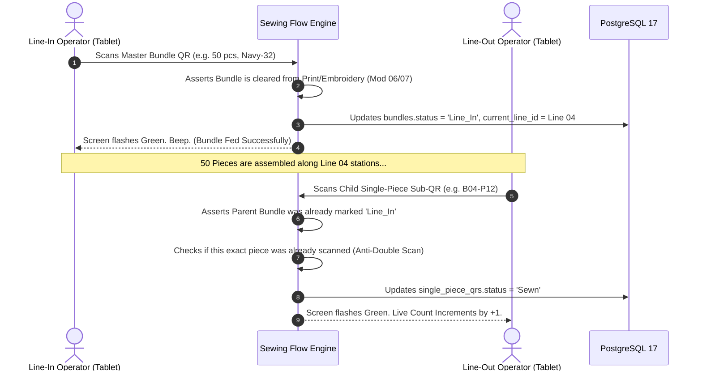
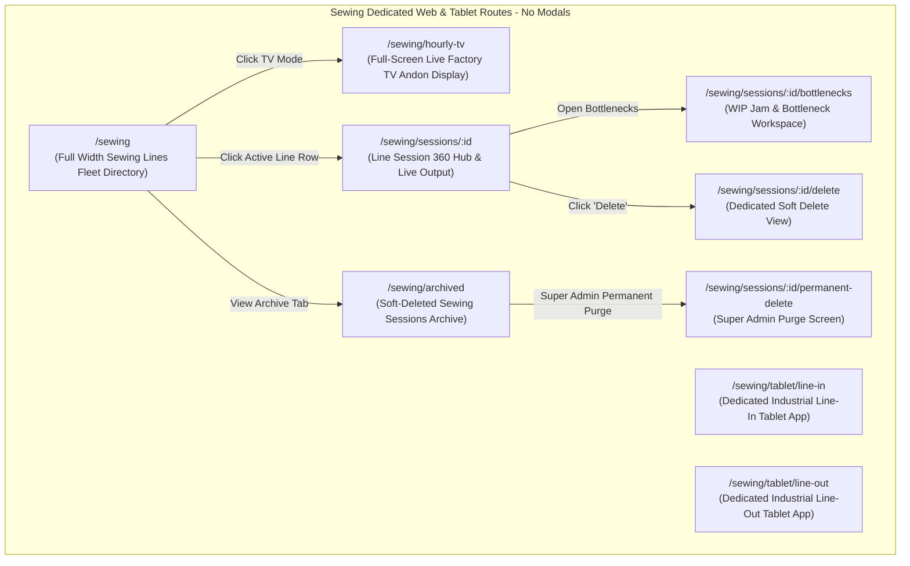
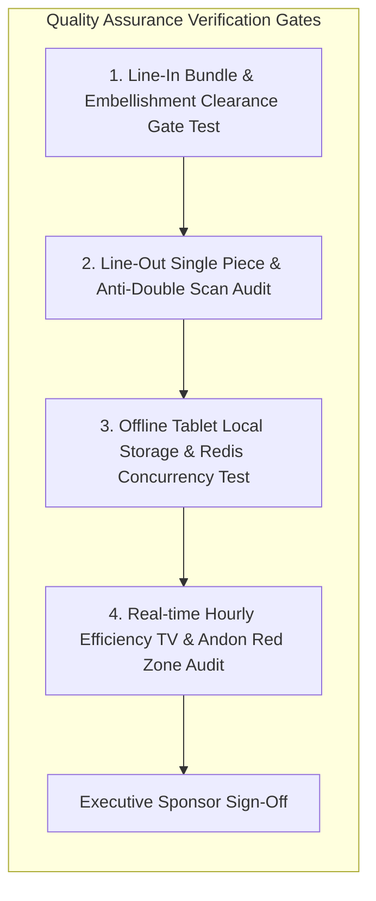

# Software Requirements Specification (SRS)
## Module 09: Sewing Floor Tracking & Station Assembly Engine
### প্রজেক্ট: TraceFlow RMG — Precision Fabric-to-Freight Garment Intelligence
**ডকুমেন্ট রেফারেন্স:** `TFRMG-SRS-MOD09-V2.0`  
**ডকুমেন্ট ভার্সন:** 2.0 (Global Tier-1 Enterprise Production Edition — High-Speed Offline Floor Mesh)  
**স্ট্যান্ডার্ড কমপ্লায়েন্স:** ISO/IEC/IEEE 29148:2018, Real-Time Manufacturing Execution System (MES) Standards, GS1 Digital Floor Traceability  
**স্ট্যাটাস:** Approved & Production-Ready  
**টার্গেট আর্কিটেকচার:** Laravel 13 (Redis Queue Concurrency Engine) + Android Tablet PWA/Native (Offline-First SQLite Mesh) + PostgreSQL 17 + Redis 7  

---

## ১. ডকুমেন্ট গভর্নেন্স ও সংস্করণ নিয়ন্ত্রণ (Document Governance & Control)

### ১.১ সংস্করণ ইতিহাস (Revision History)
| ভার্সন | তারিখ | পর্যালোচনাকারী | পরিবর্তনের বিবরণ ও পরিধি |
|---|---|---|---|
| `v1.0` | 2026-09-02 | Lead Business Analyst | সুইং লাইন স্ক্যানিং ও আওয়ারলি টার্গেট প্রাথমিক ড্রাফট। |
| `v2.0` | 2026-09-02 | Principal Enterprise Architect | **100% এন্টারপ্রাইজ রূপান্তর:** ডুয়াল-টিয়ার কিউআর হ্যান্ডশেক (Line-In এ Master Bundle QR এবং Line-Out এ Child Single-Piece QR), অফলাইন-ফার্স্ট ট্যাবলেট আর্কিটেকচার (Local SQLite Sync + Redis Queue Deadlock Protection), রিয়েল-টাইম আওয়ারলি প্রোডাকশন টিভি ড্যাশবোর্ড ও অ্যান্ডন (Andon) রেড জোন অ্যালার্ট, ইন-লাইন ডব্লিউআইপি (WIP) বটলনেক ডিটেক্টর, টু-টিয়ার ডিলিশন গভর্নেন্স (Super Admin Hard Delete Guard), কমপ্লিট PostgreSQL 17 DDL এবং RTM সংযোজন। |

### ১.২ অনুমোদনকারী ব্যক্তিবর্গ (Sign-Off & Approvals)
- **Executive Sponsor / Project Owner:** Executive Sponsor, RMG Systems
- **Lead Solution Architect:** AI Solution Architect
- **Head of Production & Sewing Operations:** Factory Floor Line Management Division
- **Head of Industrial Engineering (IE):** Floor Efficiency & Real-Time Capacity
- **General Manager (Factory Operations):** Manufacturing Plant Operations

---

## ২. নির্বাহী সারসংক্ষেপ ও কৌশলগত উদ্দেশ্য (Executive Summary & Strategic Scope)

### ২.১ কৌশলগত প্রেক্ষাপট (Strategic Context)
গার্মেন্টস কারখানায় সুইং ফ্লোর (Sewing Floor) হলো সমগ্র ম্যানুফ্যাকচারিংয়ের হৃৎপিণ্ড (The Epicenter of Garment Assembly)। এখানেই শত শত দক্ষ অপারেটর ও অত্যাধুনিক সুইং মেশিনের সমন্বয়ে কাটা কাপড়ের টুকরোগুলো (প্যানেল) ক্রমান্বয়ে সেলাই হয়ে একটি পূর্ণাঙ্গ পোশাকে রূপ নেয়।

একটি সাধারণ কারখানায় দিনে হাজার হাজার বান্ডল সেলাই লাইনে প্রবেশ করে। যদি রিয়েল-টাইম ট্র্যাকিং না থাকে:
1. **The Black-Hole Problem:** কোন লাইনে কোন স্টাইলের কয়টি বান্ডল ঢুকছে এবং কত পিস ফিনিশড হচ্ছে তা জানা যায় না; ফলে লাইন স্টারভেশন বা মাত্রাতিরিক্ত ডব্লিউআইপি (WIP Pile-Up) তৈরি হয়।
2. **Network Failures on Factory Floor:** ফ্লোরের দুর্বল ওয়াইফাইয়ের কারণে যদি ট্যাবলেট হ্যাং করে, তবে শত শত অপারেটরের স্ক্যান আটকে যায় এবং কাজ বন্ধ থাকে।
3. **Loss of Single-Piece Identity:** বান্ডল ভেঙে যখন অপারেটররা পার্টস জোড়া লাগায়, তখন একক পোশাকের স্বতন্ত্র আইডেন্টিটি হারিয়ে যায়।

**Module 09: Sewing Floor Tracking & Station Assembly** সিস্টেমের দর্শন হলো:
> **"Sub-Second Offline Floor Scanning, Seamless Single-Piece Assembly, Zero Production Blindspots."**

```mermaid
graph TB
    subgraph Sewing Line Execution (Module 09)
        direction TB
        BNDL_IN[Cutting/Embellished Bundle Arrives] --> LINE_IN[Line-In Station: Scan Master Bundle QR]
        LINE_IN --> FEED_CHECK{Embellishment Clearance Verified?}
        FEED_CHECK -->|Cleared| LINE_WIP[Active In-Line WIP Buffer]
        
        subgraph Station Assembly Mesh
            LINE_WIP --> STN1[Station 1: Front & Back Assembly]
            STN1 --> STN2[Station 2: Sleeve & Collar Joining]
            STN2 --> STN3[Station 3: Bottom Hemming & Final Stitch]
        end
        
        STN3 --> LINE_OUT[Line-Out Table: Scan Child Single-Piece Sub-QR]
        LINE_OUT --> QUEUE[Redis Asynchronous Queue Engine]
        QUEUE --> HOURLY_TV[Live Factory TV Andon Dashboard]
        LINE_OUT --> MOD10[Module 10: In-Line & End-Line Quality Inspection]
    end
```

---

## ৩. অলঙ্ঘনীয় এন্টারপ্রাইজ আর্কিটেকচারাল নিয়মাবলি (Non-Negotiable Architecture Directives)

প্রজেক্টের গ্লোবাল রুলস এবং এন্টারপ্রাইজ কোয়ালিটি নিশ্চিত করতে নিচের নিয়মগুলো ১০০% অলঙ্ঘনীয়:

### ৩.১ নো মোডালস নীতিমালা (STRICT No Modals / No Popups Rule)
- **জিরো মোডাল পলিসি:** পুরো সুইং ট্র্যাকিং মডিউলে কোনো ফর্ম, কনফার্মেশন, লাইন শিফট রিপোর্ট, ম্যানুয়াল স্ক্যান অ্যাডজাস্টমেন্ট, বটলনেক অ্যালার্ট, বা সাব-স্ক্রিনের জন্য `Modal`, `Dialog`, `Popup`, `Lightbox`, বা `Drawer-over-backdrop` কঠোরভাবে নিষিদ্ধ।
- **ডেডিকেটেড রুট আর্কিটেকচার:** সুইং লাইন ডিরেক্টরি, ফুল-স্ক্রিন ট্যাবলেট স্ক্যান ভিউ, আওয়ারলি প্রোডাকশন মনিটর, লাইভ অ্যান্ডন ডিসপ্লে, লাইন বটলনেক এনালাইজার, এবং ডিলিট কনফার্মেশন—প্রতিটি ইন্টারঅ্যাকশন একটি সুনির্দিষ্ট ব্রাউজার ইউআরএল এবং ডেডিকেটেড ফুল-স্ক্রিন ভিউতে (Full-Screen Dedicated View) লোড হবে।
- **নেভিগেশন স্ট্যাক:** প্রতিটি পেজে স্ট্যান্ডার্ড ব্যাক বাটন এবং স্ট্রাকচার্ড ব্রেডক্রাম্ব (`Dashboard > Sewing > Line-04 > Live Hourly Production`) থাকতে হবে যাতে ব্রাউজারের নেটিভ Forward/Back বাটন স্বাভাবিকভাবে কাজ করে এবং ডিপ-লিংক শেয়ারিং সম্ভব হয়।

### ৩.২ পিউর সার্ভার-সাইড ভ্যালিডেশন স্ট্যান্ডার্ড (Pure Server-Side Validation)
- **জিরো ক্লায়েন্ট-সাইড HTML5 ভ্যালিডেশন:** ফ্রন্টএন্ডের কোনো `<form>` বা `<input>` ফিল্ডে ব্রাউজারের ডিফল্ট HTML5 ভ্যালিডেশন অ্যাট্রিবিউট (`required`, `minlength`, `maxlength`, `pattern`, ইত্যাদি) দেওয়া যাবে না। ব্রাউজারের বিল্ট-ইন টুলটিপ পপআপ সম্পূর্ণ নিষিদ্ধ।
- **বাধ্যতামূলক `noValidate`:** সমস্ত ফ্রন্টএন্ড ফর্মে `<form noValidate>` স্পষ্টভাবে যুক্ত থাকতে হবে।
- **একীভূত এরর কন্ট্রাক্ট:** সমস্ত স্ক্যান স্টেট ও ডুপ্লিকেট ভ্যালিডেশন ব্যাকএন্ড Laravel `FormRequest` ক্লাসের মাধ্যমে পিউর সার্ভার সাইডে ঘটবে। ইনপুট ভুল হলে সার্ভার থেকে `422 Unprocessable Content` স্ট্যান্ডার্ড RFC 7807 কমপ্লায়েন্ট JSON এরর পাঠানো হবে।
- **ইনলাইন এরর রেন্ডারিং:** ফ্রন্টএন্ড স্বয়ংক্রিয়ভাবে রেসপন্সের ফিল্ড নেম ম্যাপ করে সংশ্লিষ্ট ইনপুট বক্সের ঠিক নিচে ক্রিস্প লাল রঙে এরর বার্তা রেন্ডার করবে।

### ৩.৩ ফ্ল্যাট এবং ক্রিস্প ডিজাইন স্ট্যান্ডার্ড (Flat Solid UI Standard)
- **নো গ্রেডিয়েন্ট পলিসি:** কোনো বাটন, কার্ড, হেডার বা সাইডবারে কোনো ধরণের গ্রেডিয়েন্ট কালার ব্যবহার করা যাবে না।
- **সলিড ডিজাইন টোকেনস:** সকল অ্যাকশন বাটন ক্রিস্প ও ফ্ল্যাট সলিড রঙে গঠিত হবে (যেমন: Primary `#2563EB`, Danger `#DC2626`, Success `#16A34A`, Neutral `#475569`, Warning `#D97706`)।
- **১০০% ইংরেজি ইউআই:** ইউজার ইন্টারফেসের সমস্ত লেবেল, ফিল্ড নেম, কলাম হেডার, অ্যাকশন বাটন এবং সিস্টেম নোটিফিকেশন ১০০% প্রফেশনাল আন্তর্জাতিক ইংরেজি ভাষায় (English) হবে।

### ৩.৪ দ্বি-স্তরবিশিষ্ট ডিলিশন গভর্নেন্স (Two-Tier Deletion Architecture)
- **সফট ডিলিট (Soft Delete):** সুইং সুপারভাইজার শুধুমাত্র ডামি বা ভুলবশত এন্ট্রি করা টেস্ট স্ক্যান সেশন সফট ডিলিট করতে পারবেন (`deleted_at = NOW()`), যা ট্র্যাশ আর্কাইভে জমা হবে।
- **পার্মানেন্ট হার্ড ডিলিট (STRICT Super Admin Only):** ডাটাবেস থেকে স্থায়ীভাবে রো মুছে ফেলার ক্ষমতা **কেবলমাত্র `Super Admin` এর থাকবে**।
- **প্রোডাকশন রেফারেনশিয়াল প্রোটেকশন গার্ড (Referential Check):** যদি কোনো সেলাই করা পোশাক অলরেডি কোয়ালিটি পাস (Module 10) বা ওয়াশিং ফ্লোরে (Module 11) প্রবেশ করে থাকে, তবে সিস্টেম পার্মানেন্ট ডিলিট **সম্পূর্ণ ব্লক** করবে এবং `409 Conflict` রিটার্ন করবে।

---

## ৪. ইউজার পারসোনা ও এক্সেস হায়ারার্কি (User Personas & Scoping)

| পারসোনা (Persona) | ইন্টারফেস ও ডিভাইস | প্রমাণীকরণ মাধ্যম (Auth Method) | প্রিভিলেজ বাউন্ডারি (Privilege Scope) |
|---|---|---|---|
| **Line Input Operator** | Industrial Android Tablet | Hardware Paired Line-In Station Token | সুইং লাইনের শুরুতে মাস্টার বান্ডল কিউআর স্ক্যান (Line-In Feeding)। |
| **Line Output Operator** | Industrial Android Tablet | Hardware Paired Line-Out Station Token | সুইং লাইনের শেষে একক পোশাকের চাইল্ড কিউআর স্ক্যান (Line-Out Single Piece)। |
| **Sewing Floor Supervisor / Chief**| Mobile / Floor Tablet | Emp ID / Username + Password | লাইভ আওয়ারলি টার্গেট বনাম একচুয়াল মনিটরিং, বটলনেক রিকনফিগারেশন। |
| **Production Manager (PPC)** | Web Browser (Desktop) | Emp ID / Username + Password | সমস্ত সুইং লাইনের সামগ্রিক এফিসিয়েন্সি, ওভারটাইম শিডিউল, সফট ডিলিট। |
| **Super Admin** | Web Browser (Desktop) | Username + Password + TOTP 2FA | গ্লোবাল বাইপাস, অফলাইন সিঙ্ক ট্রাবলশুট, পার্মানেন্ট পার্জ। |

---

## ৫. বিস্তারিত ফাংশনাল রিকোয়ারমেন্টস (Detailed Functional Specifications)

### ৫.১ সাব-মডিউল: ডুয়াল-টিয়ার কিউআর হ্যান্ডশেক (Line-In & Line-Out Handshake)

TraceFlow RMG প্ল্যাটফর্মে এটিই সুইং লাইনের নিখুঁত ট্রেসিবিলিটি নিশ্চিত করে।



#### ৫.১.১ স্পেসিফিকেশন ও বিজনেস লজিক
- **REQ-SEW-IN-001 (Line-In Master Bundle Ingestion):**
  - লাইনের ইনপুট পয়েন্টে অপারেটর মাস্টার বান্ডল কিউআর স্ক্যান করবেন।
  - **ভ্যালিডেশন গার্ড:** যদি ওই স্টাইলে প্রিন্টিং (Module 06) বা এমব্রয়ডারি (Module 07) থাকে, তবে সিস্টেম যাচাই করবে যে প্যানেলসমূহ ক্লিয়ারেন্স পেয়ে বান্ডলে ফেরত এসেছে কি না (`is_embellishment_cleared = true`)। ছাড়পত্র না থাকলে স্ক্যান রিজেক্ট হবে।
- **REQ-SEW-OUT-002 (Line-Out Child Single-Piece QR Ingestion):**
  - লাইনের আউটপুট টেবিলে এসে যখন পূর্ণাঙ্গ পোশাকটি প্রস্তুত হয়, তখন অপারেটর পোশাকের ভেতরের লেবেলে থাকা **Child Single-Piece Sub-QR** স্ক্যান করবেন।
  - **স্ট্যান্ডার্ড স্টেট চেক:** চাইল্ড কিউআর কেবল তখনই `Sewn` হিসেবে গৃহীত হবে যদি তার মূল প্যারেন্ট বান্ডলটি উক্ত লাইনে `Line_In` হিসেবে রেজিস্টার্ড থাকে।
- **REQ-SEW-OUT-003 (Anti-Double Scan Guard):**
  - একই একক পোশাকের কিউআর কোড ভুলবশত দুইবার স্ক্যান করলে সিস্টেম তাৎক্ষণিকভাবে তীব্র লাল ফ্ল্যাশ এবং ডাবল-বিপ সাউন্ড অ্যালার্ট দিয়ে রিজেক্ট করবে: *"Duplicate Scan: Garment piece already registered as Line-Out at 11:24 AM."*

---

### ৫.২ সাব-মডিউল: হাই-কনকারেন্সি অফলাইন-ফার্স্ট ট্যাবলেট আর্কিটেকচার (Offline Mesh Architecture)

গার্মেন্টস ফ্যাক্টরির ফ্লোরে ওয়াইফাই যেকোনো সময় বিচ্ছিন্ন হতে পারে। প্রোডাকশন লাইন কখনো ইন্টারনেটের জন্য থেমে থাকতে পারে না।

#### ৫.২.১ স্পেসিফিকেশন ও সিঙ্ক ফ্রেমওয়ার্ক
- **REQ-SEW-OFF-001 (Local SQLite Edge Storage):**
  - অ্যান্ড্রয়েড ট্যাবলেটে স্ক্যান ডাটা প্রথমে লোকাল SQLite ডাটাবেসে সেভ হবে (`sync_status = false`)।
  - ট্যাবলেট কোনো ইন্টারনেট কানেকশন ছাড়াই প্রতি সেকেন্ডে ৫টি করে একটানা স্ক্যান গ্রহণ করতে সক্ষম থাকবে।
- **REQ-SEW-OFF-002 (Background Mesh Push & Redis Queue Worker):**
  - ট্যাবলেটের ব্যাকগ্রাউন্ড সার্ভিস প্রতি ৫ সেকেন্ড পর পর নেটওয়ার্ক পিং করবে। ইন্টারনেট পাওয়া মাত্রই জমে থাকা আন-সিঙ্কড স্ক্যান ব্যাচ আকারে এপিআইতে পুশ করবে (`POST /api/v1/sewing/sync`)।
  - **ডেডলক প্রিভেনশন:** ব্যাকএন্ড সার্ভার সরাসরি ডাটাবেসে রাইট না করে রিকোয়েস্টটি **Redis Queue**-তে পুশ করে ট্যাবলেটকে সাথে সাথে `202 Accepted` রিটার্ন করবে। এর ফলে ১০০টি লাইন একসাথে সিঙ্ক করলেও ডাটাবেসে কোনো ডেডলক বা 504 Timeout হবে না।
- **REQ-SEW-OFF-003 (Immutable Physical Device Timestamp):**
  - প্রতিটি স্ক্যান ইভেন্টের জন্য সার্ভার টাইমস্ট্যাম্পের বদলে ট্যাবলেটের স্থানীয় ফিজিক্যাল স্ক্যান টাইম (`scanned_at`) ডাটাবেসে সেভ হবে, যাতে ইন্টারনেট ৩ ঘণ্টা পর আসলেও আওয়ারলি প্রোডাকশনের সঠিক ঘণ্টার হিসাব শতভাগ নিখুঁত থাকে।

---

### ৫.৩ সাব-মডিউল: লাইভ আওয়ারলি প্রোডাকশন ড্যাশবোর্ড ও অ্যান্ডন ডিসপ্লে (Live Hourly TV & Andon)

ফ্যাক্টরি ফ্লোরে ঝুলন্ত বড় টিভির জন্য রিয়েল-টাইম প্রোডাকশন ও এফিসিয়েন্সি মনিটর।

#### ৫.৩.১ স্পেসিফিকেশন ও গাণিতিক ফর্মুলা
- **REQ-SEW-DSH-001 (Live Hourly Output Aggregation):**
  - প্রতি ঘণ্টার স্লটে (Hour 1: 8AM-9AM, Hour 2: 9AM-10AM... Hour 10) কয়টি একক পোশাক লাইন-আউট হলো তা স্বয়ংক্রিয়ভাবে ডিসপ্লে হবে।
- **REQ-SEW-DSH-002 (Real-Time Line Efficiency Formula):**
  - সিস্টেমে লাইভ এফিসিয়েন্সি প্রতি ঘণ্টায় নিচের আন্তর্জাতিক ফর্মুলায় অটো-ক্যালকুলেট হবে:
    $$\text{Hourly Efficiency \%} = \left(\frac{\text{Actual Produced Single Pieces} \times \text{Garment SMV}}{\text{Allocated Manpower} \times \text{60 Minutes}}\right) \times 100$$
- **REQ-SEW-DSH-003 (Andon Red Zone Visual Alert):**
  - **Green Zone:** প্রকৃত উৎপাদন আওয়ারলি টার্গেটের $\ge 100\%$ হলে।
  - **Amber Zone:** প্রকৃত উৎপাদন টার্গেটের ৯০% থেকে ৯৯% এর মধ্যে থাকলে।
  - **Red Zone (Alarm):** প্রকৃত উৎপাদন টার্গেটের চেয়ে ১০% এর বেশি কম হলে (Actual < 90% Target)। পুরো লাইনের ডিসপ্লে রো লাল রঙে ব্লিঙ্ক করবে এবং সুপারভাইজারের ট্যাবলেটে পুশ নোটিফিকেশন যাবে।

---

### ৫.৪ সাব-মডিউল: ইন-লাইন ডব্লিউআইপি ও বটলনেক ডিটেক্টর (In-Line WIP & Bottleneck Engine)

সুইং লাইনের ভেতরে অতিরিক্ত কাপড় জমে যাওয়া বা কাজ আটকে যাওয়া স্বয়ংক্রিয়ভাবে শনাক্ত করার ইঞ্জিন।

#### ৫.৪.১ স্পেসিফিকেশন ও অ্যালার্ট রুলস
- **REQ-SEW-WIP-001 (Real-Time In-Line WIP Equation):**
  - প্রতিটি লাইনের বর্তমান ওয়ার্ক-ইন-প্রগ্রেস (WIP) প্রতি মিনিটে আপডেট হবে:
    $$\text{Current Line WIP (Pieces)} = \sum \text{Line-In Bundle Pieces} - \sum \text{Line-Out Single Pieces}$$
- **REQ-SEW-WIP-002 (Bottleneck Jam & Starvation Detection):**
  - যদি কোনো লাইনে লাইন-ইন সচল থাকে কিন্তু লাইন-আউটে টানা ২০ মিনিট কোনো সিঙ্গেল পিস স্ক্যান না আসে, অথবা লাইনের WIP দৈনিক টার্গেটের ১.৫ গুণ অতিক্রম করে, তবে সিস্টেম স্বয়ংক্রিয়ভাবে **"Line Bottleneck Alert"** ফ্ল্যাগ করবে।

---

## ৬. প্রোডাকশন-গ্রেড ডাটাবেস আর্কিটেকচার ও DDL (Database Engineering)

নিচে PostgreSQL 17 এর জন্য সম্পূর্ণ প্রোডাকশন-রেডি DDL স্ক্রিপ্ট দেওয়া হলো। এতে লাখ লাখ স্ক্যান ইভেন্টের জন্য ইনডেক্সিং, সেশন ট্র্যাকিং, এবং আওয়ারলি এগ্রিগেশনের টেবিলসমূহ অন্তর্ভুক্ত রয়েছে।

### ৬.১ PostgreSQL 17 Production Schema (Complete DDL)

```sql
-- Enable Cryptographic Extension for UUID v4
CREATE EXTENSION IF NOT EXISTS "pgcrypto";

-- ----------------------------------------------------------------------
-- 1. Table: sewing_line_sessions (Active Daily Line Sessions)
-- ----------------------------------------------------------------------
CREATE TABLE sewing_line_sessions (
    id UUID PRIMARY KEY DEFAULT gen_random_uuid(),
    session_date DATE NOT NULL,
    line_id UUID NOT NULL REFERENCES production_lines(id) ON DELETE RESTRICT,
    plan_id UUID NOT NULL REFERENCES production_plans(id) ON DELETE RESTRICT,
    po_id UUID NOT NULL REFERENCES purchase_orders(id) ON DELETE RESTRICT,
    active_manpower SMALLINT NOT NULL CHECK (active_manpower > 0),
    target_hourly_output INTEGER NOT NULL CHECK (target_hourly_output > 0),
    total_line_in_pieces INTEGER NOT NULL DEFAULT 0,
    total_line_out_pieces INTEGER NOT NULL DEFAULT 0,
    current_wip_pieces INTEGER NOT NULL DEFAULT 0,
    overall_efficiency_percent NUMERIC(5, 2) NOT NULL DEFAULT 0.00,
    session_status VARCHAR(30) NOT NULL DEFAULT 'Active', -- Active, Paused, Closed
    line_chief_emp_id UUID REFERENCES users(id) ON DELETE SET NULL,
    created_at TIMESTAMPTZ NOT NULL DEFAULT CURRENT_TIMESTAMP,
    updated_at TIMESTAMPTZ NOT NULL DEFAULT CURRENT_TIMESTAMP,
    deleted_at TIMESTAMPTZ
);

CREATE UNIQUE INDEX uq_sewing_session_date_line ON sewing_line_sessions (session_date, line_id) WHERE deleted_at IS NULL;
CREATE INDEX idx_sewing_sessions_plan ON sewing_line_sessions (plan_id);
CREATE INDEX idx_sewing_sessions_status ON sewing_line_sessions (session_status);

-- ----------------------------------------------------------------------
-- 2. Table: sewing_scan_logs (High-Speed Event Ledger)
-- ----------------------------------------------------------------------
CREATE TABLE sewing_scan_logs (
    id UUID PRIMARY KEY DEFAULT gen_random_uuid(),
    session_id UUID NOT NULL REFERENCES sewing_line_sessions(id) ON DELETE CASCADE,
    line_id UUID NOT NULL REFERENCES production_lines(id) ON DELETE RESTRICT,
    qr_type VARCHAR(30) NOT NULL,                 -- Bundle, Single_Piece
    scanned_uuid UUID NOT NULL,                   -- Pointer to bundles.id OR single_piece_qrs.id
    scan_station VARCHAR(30) NOT NULL,            -- Line_In, Line_Out
    hour_block SMALLINT NOT NULL CHECK (hour_block >= 1 AND hour_block <= 24),
    device_id VARCHAR(80) NOT NULL,
    scanned_at TIMESTAMPTZ NOT NULL,              -- Device local physical scan timestamp
    synced_at TIMESTAMPTZ NOT NULL DEFAULT CURRENT_TIMESTAMP,
    created_at TIMESTAMPTZ NOT NULL DEFAULT CURRENT_TIMESTAMP
);

CREATE INDEX idx_sewing_scans_session ON sewing_scan_logs (session_id);
CREATE INDEX idx_sewing_scans_uuid ON sewing_scan_logs (scanned_uuid);
CREATE INDEX idx_sewing_scans_station ON sewing_scan_logs (scan_station);
CREATE INDEX idx_sewing_scans_scanned_at ON sewing_scan_logs (scanned_at);

-- ----------------------------------------------------------------------
-- 3. Table: hourly_line_outputs (Pre-Aggregated Hourly Stats)
-- ----------------------------------------------------------------------
CREATE TABLE hourly_line_outputs (
    id UUID PRIMARY KEY DEFAULT gen_random_uuid(),
    session_id UUID NOT NULL REFERENCES sewing_line_sessions(id) ON DELETE CASCADE,
    line_id UUID NOT NULL REFERENCES production_lines(id) ON DELETE RESTRICT,
    production_date DATE NOT NULL,
    hour_block SMALLINT NOT NULL CHECK (hour_block >= 1 AND hour_block <= 24),
    target_pieces INTEGER NOT NULL CHECK (target_pieces > 0),
    actual_pieces INTEGER NOT NULL DEFAULT 0,
    variance_pieces INTEGER GENERATED ALWAYS AS (actual_pieces - target_pieces) STORED,
    hourly_efficiency_percent NUMERIC(5, 2) NOT NULL DEFAULT 0.00,
    andon_status VARCHAR(20) NOT NULL DEFAULT 'Green', -- Green, Amber, Red
    created_at TIMESTAMPTZ NOT NULL DEFAULT CURRENT_TIMESTAMP,
    updated_at TIMESTAMPTZ NOT NULL DEFAULT CURRENT_TIMESTAMP
);

CREATE UNIQUE INDEX uq_hourly_line_output ON hourly_line_outputs (line_id, production_date, hour_block);
CREATE INDEX idx_hourly_output_session ON hourly_line_outputs (session_id);
CREATE INDEX idx_hourly_output_andon ON hourly_line_outputs (andon_status);

-- ----------------------------------------------------------------------
-- 4. Table: line_bottleneck_events (Automated Bottleneck Logs)
-- ----------------------------------------------------------------------
CREATE TABLE line_bottleneck_events (
    id UUID PRIMARY KEY DEFAULT gen_random_uuid(),
    session_id UUID NOT NULL REFERENCES sewing_line_sessions(id) ON DELETE CASCADE,
    line_id UUID NOT NULL REFERENCES production_lines(id) ON DELETE RESTRICT,
    event_type VARCHAR(40) NOT NULL,              -- Excessive_WIP, Line_Starvation, Output_Halt
    current_wip_count INTEGER NOT NULL,
    idle_duration_minutes SMALLINT NOT NULL,
    resolved_at TIMESTAMPTZ,
    resolution_remarks TEXT,
    created_at TIMESTAMPTZ NOT NULL DEFAULT CURRENT_TIMESTAMP
);

CREATE INDEX idx_bottlenecks_session ON line_bottleneck_events (session_id);
```

---

## ৭. সম্পূর্ণ এপিআই কন্ট্রাক্ট স্পেসিফিকেশন (Exhaustive API Contracts)

### ৭.১ সাধারণ আর্কিটেকচার ও স্ট্যান্ডার্ডস
- **অথেনটিকেশন:** `Authorization: Bearer <tablet_device_token>`
- **কমন হেডার্স:** `Accept: application/json`, `Content-Type: application/json`
- **স্ট্যান্ডার্ড ফিল্টারিং:**
  `GET /api/v1/sewing/hourly?date=2026-09-02&line_id={uuid}`

---

### ৭.২ হাই-কনকারেন্সি অফলাইন স্ক্যান সিঙ্ক এন্ডপয়েন্ট

#### ৭.২.১ বাল্ক অফলাইন স্ক্যান ইনজেশন (Asynchronous Redis Queue API)
- **মেথড ও ইউআরএল:** `POST /api/v1/sewing/sync`
- **রিকোয়েস্ট বডি:**
  ```json
  {
    "device_id": "TAB-LINE-04-OUT",
    "scans": [
      {
        "qr_type": "Bundle",
        "scanned_uuid": "0e81d7f1-9b22-4a90-8811-37b92a4f0099",
        "scan_station": "Line_In",
        "hour_block": 9,
        "scanned_at": "2026-09-02T09:05:22Z"
      },
      {
        "qr_type": "Single_Piece",
        "scanned_uuid": "a98df23e-6b12-4211-9a7c-87d46c0e5a99",
        "scan_station": "Line_Out",
        "hour_block": 10,
        "scanned_at": "2026-09-02T10:14:05Z"
      }
    ]
  }
  ```
- **সাকসেস রেসপন্স (`202 Accepted` — Sub-50ms Response via Redis Queue):**
  ```json
  {
    "success": true,
    "status_code": 202,
    "message": "Scans received and enqueued into Redis background worker.",
    "data": {
      "received_count": 2,
      "device_id": "TAB-LINE-04-OUT",
      "queue_batch_id": "job-batch-88991"
    }
  }
  ```

---

### ৭.৩ লাইভ আওয়ারলি মনিটর ও অ্যান্ডন এন্ডপয়েন্ট

#### ৭.৩.১ আওয়ারলি প্রোডাকশন ও অ্যান্ডন স্ট্যাটাস ভিউ
- **মেথড ও ইউআরএল:** `GET /api/v1/sewing/sessions/{id}/hourly-stats`
- **সাকসেস রেসপন্স (`200 OK`):**
  ```json
  {
    "success": true,
    "data": {
      "line_name": "Line-04",
      "style_no": "DNM-SLIM-01",
      "manpower": 60,
      "target_hourly": 117,
      "total_line_in": 1200,
      "total_line_out": 950,
      "current_wip": 250,
      "hourly_breakdown": [
        { "hour_block": 1, "target": 117, "actual": 120, "variance": 3, "efficiency": 66.6, "andon": "Green" },
        { "hour_block": 2, "target": 117, "actual": 115, "variance": -2, "efficiency": 63.8, "andon": "Green" },
        { "hour_block": 3, "target": 117, "actual": 92, "variance": -25, "efficiency": 51.1, "andon": "Red" }
      ]
    }
  }
  ```

---

### ৭.৪ সুইং সেশন ডিলিশন এন্ডপয়েন্টস (Two-Tier Deletion Architecture)

#### ৭.৪.১ সুইং সেশন সফট ডিলিট (Soft Delete Session)
- **মেথড ও ইউআরএল:** `DELETE /api/v1/sewing/sessions/{id}`
- **পারমিশন:** `sewing.sessions.delete`
- **শর্ত:** শুধুমাত্র যদি কোনো সিঙ্গেল পিস কোয়ালিটি টেবিলে (Module 10) ইনস্পেকশন না হয়ে থাকে।
- **সাকসেস রেসপন্স (`200 OK`):**
  ```json
  {
    "success": true,
    "status_code": 200,
    "message": "Sewing session soft-deleted and moved to archive."
  }
  ```

#### ৭.৪.২ সুইং ডাটা পার্মানেন্ট ডিলিট (STRICT Super Admin Only Purge)
- **মেথড ও ইউআরএল:** `DELETE /api/v1/sewing/sessions/{id}/force-delete`
- **অথরাইজেশন:** **STRICTLY `Super Admin` ROLE ONLY**
- **রিকোয়েস্ট বডি:**
  ```json
  {
    "super_admin_password": "MySuperAdminSecretPassword#2026"
  }
  ```
- **পোশাক কোয়ালিটি বা ওয়াশিংয়ে চলে গেলে ব্লকিং রেসপন্স (`409 Conflict`):**
  ```json
  {
    "success": false,
    "status_code": 409,
    "error_code": "CANNOT_PURGE_QC_PASSED_SESSION",
    "message": "Cannot permanently purge this sewing session because 950 garments are already inspected in Quality (Module 10) and dispatched to Washing (Module 11). Factory audit trail is locked."
  }
  ```

---

## ৮. ইউজার ইন্টারফেস ও স্ক্রিন-বাই-স্ক্রিন স্পেসিফিকেশন (STRICT NO MODALS)

সুইং ফ্লোরের প্রতিটি স্ক্রিন সম্পূর্ণ ডেডিকেটেড রুটে ওপেন হবে। কোনো মোডাল বা পপআপ ডায়ালগ উইথ ব্যাকড্রপ থাকবে না।



### ৮.১ স্ক্রিন স্পেসিফিকেশন টেবিল

| রুট (Route Path) | স্ক্রিনের নাম | মূল উপাদান ও কনফিগারেশন | নো-মোডাল ডিজাইন নিশ্চিতকরণ |
|---|---|---|---|
| `/sewing` | Sewing Fleet Console | - ফুল-উইডথ ডাটা গ্রিড<br/>- কলাম: **Line No, PO Job No, Style, Manpower, Target/Hr, Actual, Efficiency %, Andon, Actions**<br/>- সলিড ব্লু "Open Factory TV Display" বোতাম | পেজিনেশন ও অ্যাকশন সবকিছু ফুল পেজে পরিচালিত হবে। |
| `/sewing/hourly-tv` | Live Factory TV Andon Display | - ফুল-স্ক্রিন হাই-কন্ট্রাস্ট ডার্ক মোড অ্যান্ডন বোর্ড<br/>- বড় আকারের লাইভ মেট্রিক্স: Lines × Hours 1 to 10<br/>- কালার কোডেড স্ট্যাটাস: Green (>=100%), Amber (90-99%), Flashing Red (<90%)<br/>- ৫ সেকেন্ড পর পর অটো-রিফ্রেশ (WebSockets / SSE) | সম্পূর্ণ আলাদা ফুল-স্ক্রিন টিভি ডিসপ্লে ভিউ। |
| `/sewing/sessions/:id` | Line Session 360 Master Hub | - লাইনের সক্রিয় সেশন ও ক্যাপাসিটি কার্ডস<br/>- রিয়েল-টাইম In-Line WIP মিটার (Line-In vs Line-Out)<br/>- সাব-ট্যাবস: Hourly Stats, Scan Logs, Bottlenecks | ফুল-স্ক্রিন এন্টারপ্রাইজ ড্যাশবোর্ড ভিউ। |
| `/sewing/tablet/line-in` | Industrial Line-In Tablet App | - গাঢ় ডার্ক মোড, ফুল-টাচ ইন্টারফেস (মিনিমাম 48dp বোতাম)<br/>- মাস্টার বান্ডল কিউআর স্ক্যান ক্যামেরা ও বারকোড লেজার গান ইনপুট<br/>- স্ক্যান সাকসেসে ফুল-স্ক্রিন গ্রিন ফ্ল্যাশ ও হ্যাপি বিপ | ডেডিকেটেড ট্যাবলেট স্ক্রিন (নো পপআপ)। |
| `/sewing/tablet/line-out` | Industrial Line-Out Tablet App | - একক পোশাকের চাইল্ড কিউআর স্টিকার স্ক্যানিং ইন্টারফেস<br/>- লাইভ কাউন্টার মিটার (আজকের শিফটে মোট সম্পন্ন পোশাক)<br/>- ডাবল স্ক্যানে তীব্র রেড ফ্ল্যাশ ও এলার্ম সাউন্ড | ডেডিকেটেড ট্যাবলেট স্ক্রিন (নো পপআপ)। |
| `/sewing/sessions/:id/bottlenecks`| WIP Jam & Bottleneck Workspace| - লাইনের ভেতরে জমে থাকা ডব্লিউআইপি স্টেশনের তালিকা<br/>- বোতলনেক রেসোলিউশন ও অতিরিক্ত হেল্পার অ্যাসাইনমেন্ট ফর্ম | ডেডিকেটেড ওয়ার্কস্পেস পেজ। |
| `/sewing/sessions/:id/delete` | Sewing Soft-Delete Confirmation | - অ্যাম্বার সতর্কবার্তা ব্যানার<br/>- সেশন সফট ডিলিটের নিয়মাবলি<br/>- সলিড অ্যাম্বার "Confirm Soft Delete" বোতাম | ডেডিকেটেড ফুল-স্ক্রিন কনফার্মেশন। নো পপআপ। |
| `/sewing/sessions/:id/permanent-delete`| Sewing Permanent Purge Console| - **Super Admin অনলি স্ক্রিন** (অন্যদের জন্য 403 Forbidden)<br/>- গাঢ় লাল অ্যালার্ট ব্যানার<br/>- সুপার অ্যাডমিন পাসওয়ার্ড ইনপুট ফিল্ড<br/>- কোয়ালিটি স্ক্যান হিস্টোরি চেকার স্ট্যাটাস ব্যাজ<br/>- সলিড ডার্ক-রেড "Purge Session Permanently" বোতাম | ফুল-স্ক্রিন হাইপার-সিকিউরড পার্জ ভিউ। |
| `/sewing/archived` | Soft-Deleted Sewing Sessions Archive| - সফট ডিলিট হওয়া সেশনসমূহের তালিকা<br/>- "Restore Session" বোতাম (`bg-amber-600`)<br/>- Super Admin এর জন্য "Purge Permanently" বোতাম | সম্পূর্ণ আলাদা আর্কাইভ পেজ। |

---

## ৯. নন-ফাংশনাল রিকোয়ারমেন্টস (Enterprise NFRs & SLAs)

### ৯.১ পারফরম্যান্স ও কনকারেন্সি বাজেট (Performance Budgets)
- **ট্যাবলেট স্ক্যান রেসপন্স লেটেন্সি:** লোকাল SQLite স্ক্যান স্টোরেজ সর্বোচ্চ **২০ মিলিসেকেন্ড (20ms)** (তাত্ক্ষণিক সাউন্ড ও গ্রিন ফ্ল্যাশ)।
- **Redis Queue ইনজেশন লেটেন্সি:** ১০০টি ট্যাবলেট একসাথে ২০০টি করে স্ক্যান পোস্ট করলেও এপিআই রেসপন্স সর্বোচ্চ **৫০ মিলিসেকেন্ড (50ms)**।
- **ফ্যাক্টরি টিভি অ্যান্ডন ড্যাশবোর্ড রেন্ডারিং:** ৪০টি লাইনের ১০ ঘণ্টার লাইভ ডাটা লোড হতে সর্বোচ্চ **১০০ মিলিসেকেন্ড (100ms)**।

### ৯.২ অফলাইন রেজিলিয়েন্স ও ডাটাবেস প্রটেকশন (Offline Mesh Guarantee)
- ট্যাবলেট একটানা ১২ ঘণ্টা অফলাইনে থাকলেও ১০,০০০ স্ক্যান মেমরিতে ধরে রাখতে পারবে। ইন্টারনেট ফিরে এলে ব্যাকগ্রাউন্ড কিউ কোনো ডাটা হারানো ছাড়াই ডাটাবেসে সিঙ্ক করবে।

---

## ১০. ফেইলিওর মোড ও রেসপন্স অ্যানালাইসিস (FMEA Matrix)

| ফেইলিওর সিনারিও (Failure Mode) | সম্ভাব্য প্রভাব (Impact) | তীব্রতা (Severity) | সিস্টেমের স্বয়ংক্রিয় প্রতিরক্ষা মেকানিজম (Mitigation Mechanism) |
|---|---|---|---|
| ফ্লোরের ওয়াইফাই সম্পূর্ণ ডাউন হয়ে যাওয়া | স্ক্যানার বন্ধ হয়ে ফ্লোরে প্রোডাকশন ট্র্যাকিং থমকে যাওয়া | Critical | অফলাইন-ফার্স্ট আর্কিটেকচার সক্রিয় থাকবে। ট্যাবলেট লোকাল SQLite-এ স্ক্যান নেবে এবং নেটওয়ার্ক পেলে ব্যাকগ্রাউন্ডে পুশ করবে। |
| ১০০টি সুইং লাইন একসাথে আওয়ারলি স্ক্যান ডাটাবেসে পুশ করা | ডাটাবেস ডেডলক ও সার্ভার ক্র্যাশ | Critical | Redis Queue Worker ফ্রেমওয়ার্ক কার্যকর হবে। এপিআই তাৎক্ষণিক `202 Accepted` দিয়ে ব্যাকগ্রাউন্ডে ডাটাবেসে রো কমিট করবে। |
| একই একক পোশাকের কিউআর কোড ভুলবশত একাধিকবার স্ক্যান করা | আওয়ারলি আউটপুট ও এফিসিয়েন্সিতে মিথ্যা বৃদ্ধি | High | অ্যান্টি-ডাবল স্ক্যান গার্ড সক্রিয় থাকবে। ডাটাবেস ও ট্যাবলেট সাথে সাথে ডুপ্লিকেট স্ক্যান রিজেক্ট করে এরর অ্যালার্ম দেবে। |
| কোয়ালিটি বা ওয়াশিংয়ে চলে যাওয়া সেলাই সেশনের রো ডিলিট করার চেষ্টা | পোশাকের সম্পূর্ণ ট্রেসিবিলিটি হিস্টোরি অনাথ হয়ে যাওয়া | Critical | ফরেন কি রেস্ট্রিক্ট গার্ড কার্যকর হবে। সিস্টেমে `409 Conflict` এসে পার্মানেন্ট ডিলিট অপারেশন সম্পূর্ণ ব্লক করবে। |

---

## ১১. রিকোয়ারমেন্টস ট্রেসেবিলিটি ম্যাট্রিক্স (Requirements Traceability Matrix - RTM)

| রিকোয়ারমেন্ট আইডি | ডাটাবেস টেবিল | ব্যাকএন্ড এপিআই এন্ডপয়েন্ট | ফ্রন্টএন্ড ডেডিকেটেড রুট | QA টেস্ট কেস আইডি |
|---|---|---|---|---|
| `REQ-SEW-IN-001` (Line-In Bundle Scan) | `bundles`, `sewing_scan_logs` | `POST /api/v1/sewing/sync` | `/sewing/tablet/line-in` | `TC-SEW-001` |
| `REQ-SEW-OUT-002` (Line-Out Single Piece) | `single_piece_qrs`, `sewing_scan_logs`| `POST /api/v1/sewing/sync` | `/sewing/tablet/line-out` | `TC-SEW-002` |
| `REQ-SEW-OFF-002` (Redis Queue Sync) | `sewing_scan_logs` | `POST /api/v1/sewing/sync` | `/sewing/tablet/line-out` | `TC-SEW-003` |
| `REQ-SEW-DSH-002` (Efficiency Math) | `hourly_line_outputs` | `GET /api/v1/sewing/sessions/{id}/hourly-stats` | `/sewing/hourly-tv` | `TC-SEW-004` |
| `REQ-SEW-DSH-003` (Andon Red Zone) | `hourly_line_outputs` | `GET /api/v1/sewing/sessions/{id}/hourly-stats` | `/sewing/hourly-tv` | `TC-SEW-005` |
| `REQ-DEL-002` (Super Admin Hard Purge)| `sewing_line_sessions` | `DELETE /api/v1/sewing/sessions/{id}/force-delete` | `/sewing/sessions/:id/permanent-delete`| `TC-SEW-006` |

---

## ১২. কিউএ গ্রহণযোগ্যতার মানদণ্ড (Acceptance Criteria & Verification Plan)



### ১২.১ কোর টেস্ট কেসসমূহ (Core Test Execution Steps)

1. **`TC-SEW-001` (Line-In Embellishment Clearance Gatekeeper Test):**
   - **ধাপ ১:** একটি বান্ডল যার ফ্রন্ট প্যানেল প্রিন্টিংয়ে পাঠানো হয়েছে কিন্তু এখনও ফেরত আসেনি (`is_embellishment_cleared = false`)।
   - **ধাপ ২:** সুইং লাইন-ইন ট্যাবলেটে ওই বান্ডলটি স্ক্যান করা।
   - **প্রত্যাশিত ফলাফল:** সিস্টেম স্ক্যান রিজেক্ট করবে এবং স্ক্রিনে লাল সতর্কবার্তা দেবে: "Line-In Blocked: Front panels are still in Printing Floor (Module 06)."
2. **`TC-SEW-002` (Line-Out Anti-Double Scan Enforcement):**
   - **ধাপ ১:** একটি বৈধ সিঙ্গেল পিস কিউআর স্ক্যান করা। -> সফলভাবে সেভ হবে (+১ পিস বৃদ্ধি পাবে)।
   - **ধাপ ২:** ৩ সেকেন্ড পর হুবহু একই সিঙ্গেল পিস কিউআর পুনরায় স্ক্যান করা।
   - **প্রত্যাশিত ফলাফল:** স্ক্রিন তীব্র লাল ফ্ল্যাশ করবে, অ্যালার্ম বিপ বাজবে, এবং এরর দেবে: "Duplicate Scan: Garment piece already registered as Line-Out."
3. **`TC-SEW-003` (Offline-First Tablet Sync Resiliency Test):**
   - **ধাপ ১:** ট্যাবলেটের ওয়াইফাই সম্পূর্ণ অফ করা।
   - **ধাপ ২:** অফলাইনে টানা ১০টি বৈধ সিঙ্গেল পিস স্ক্যান করা।
   - **প্রত্যাশিত ফলাফল:** ট্যাবলেট কোনো ল্যাগ ছাড়াই লোকাল SQLite-এ ১০টি স্ক্যান গ্রহণ করবে এবং স্ক্রিনে "10 Scans Pending Sync" দেখাবে।
   - **ধাপ ৩:** ট্যাবলেটের ওয়াইফাই অন করা।
   - **প্রত্যাশিত ফলাফল:** ৫ সেকেন্ডের মধ্যে ব্যাকগ্রাউন্ডে ডাটা পুশ হবে, সার্ভারে `sewing_scan_logs` এ মূল ফিজিক্যাল স্ক্যান টাইমস্ট্যাম্প সহ ১০টি রো যুক্ত হবে এবং পেন্ডিং কাউন্ট ০ হয়ে যাবে।
4. **`TC-SEW-004` (Live Hourly Production & Efficiency Calculation Test):**
   - **ধাপ:** Manpower = 60, SMV = 20.0 মিনিট। ১ ঘণ্টায় মোট ১১৭টি সিঙ্গেল পিস স্ক্যান করা।
   - **প্রত্যাশিত ফলাফল:** সিস্টেমে $\text{Efficiency} = \left(\frac{117 \times 20}{60 \times 60}\right) \times 100 = 65.0\%$ নির্ভুলভাবে হিসাব হবে এবং অ্যান্ডন স্ট্যাটাস `Green` থাকবে।
5. **`TC-SEW-005` (Andon Red Zone Visual Alert Verification):**
   - **ধাপ:** টার্গেট ১০০ পিস/ঘণ্টা। কোনো নির্দিষ্ট ঘণ্টায় মাত্র ৮৫ পিস স্ক্যান করা (১৫% ঘাটতি)।
   - **প্রত্যাশিত ফলাফল:** টিভি ড্যাশবোর্ডে ওই ঘণ্টার সেলটি স্বয়ংক্রিয়ভাবে উজ্জ্বল লাল রঙে (`Red`) ফ্ল্যাশ করবে এবং সুপারভাইজারের কাছে সতর্কবার্তা যাবে।
6. **`TC-SEW-006` (Super Admin Only Permanent Purge with Downstream Guard):**
   - **ধাপ ১:** নন-সুপার অ্যাডমিন দ্বারা `force-delete` চালানো -> `403 Forbidden`।
   - **ধাপ ২:** যে সেশনের পোশাক অলরেডি কোয়ালিটি বা ওয়াশিংয়ে চলে গেছে, সেটির উপর সুপার অ্যাডমিন কর্তৃক `force-delete` চালানো -> `409 Conflict` সহ ব্লক হবে।
   - **ধাপ ৩:** আন-কমিটেড ডামি টেস্ট সেশনের উপর সঠিক পাসওয়ার্ড দিয়ে `force-delete` চালানো -> ডাটাবেস থেকে রো সম্পূর্ণ মুছে যাবে।
7. **`TC-UI-001` (Zero Modals Compliance Audit):**
   - **ধাপ:** সুইং ডিরেক্টরি, টিভি অ্যান্ডন ডিসপ্লে, ট্যাবলেট স্ক্যান ভিউ, বটলনেক এনালাইজার ও ডিলিট ফ্লো পরীক্ষা করা।
   - **প্রত্যাশিত ফলাফল:** পুরো মডিউলে কোথাও কোনো `Modal` বা `Popup` থাকবে না। প্রতিটি ফিচার ডেডিকেটেড ফুল-স্ক্রিন পেজে কাজ করবে।

---

*(ডকুমেন্ট সমাপ্ত — Module 09: Sewing Floor Tracking & Station Assembly Engine)*
