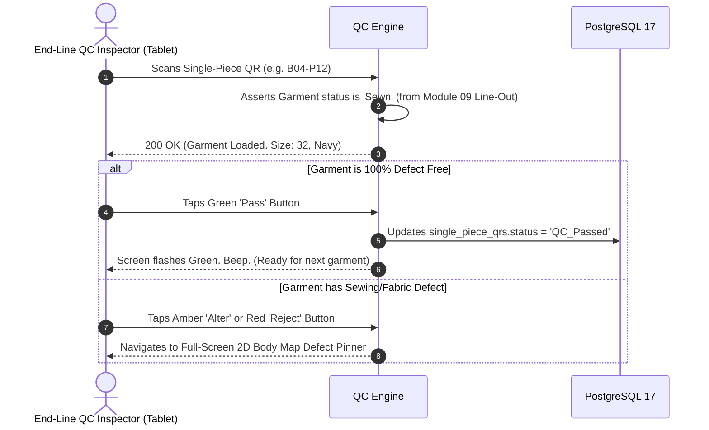
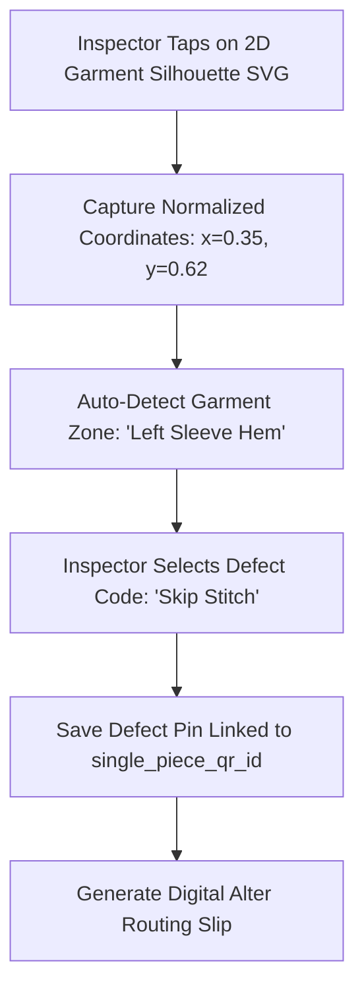
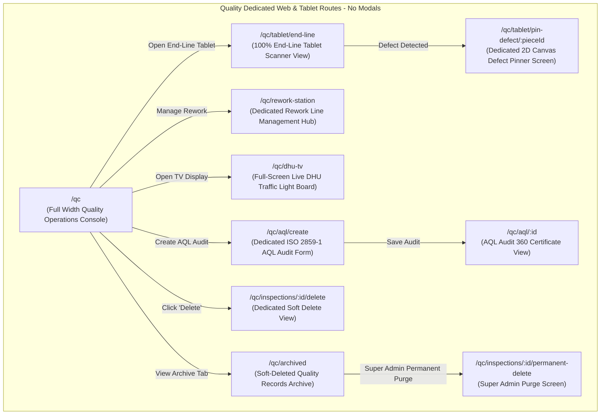
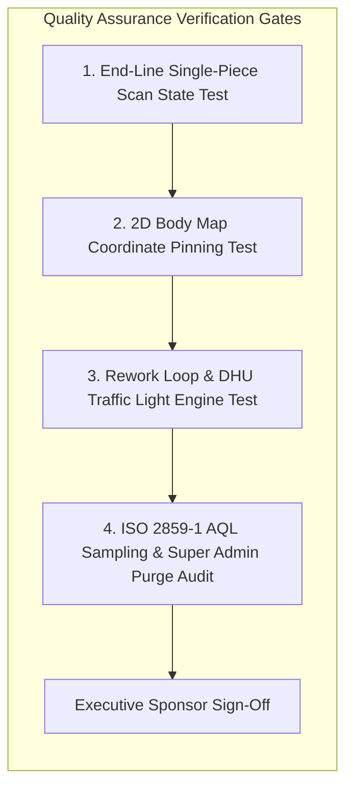

# Software Requirements Specification (SRS)
## Module 10: Quality Control (QC), AQL Audits & Defect Mapping Engine
### প্রজেক্ট: TraceFlow RMG — Precision Fabric-to-Freight Garment Intelligence
**ডকুমেন্ট রেফারেন্স:** `TFRMG-SRS-MOD10-V2.0`  
**ডকুমেন্ট ভার্সন:** 2.0 (Global Tier-1 Enterprise Production Edition — Zero-Defect Quality Mesh)  
**স্ট্যান্ডার্ড কমপ্লায়েন্স:** ISO/IEC/IEEE 29148:2018, ISO 2859-1 / ANSI/ASQ Z1.4 Sampling Standards, AATCC Garment Quality Standards  
**স্ট্যাটাস:** Approved & Production-Ready  
**টার্গেট আর্কিটেকচার:** Laravel 13 (DHU & Statistical AQL Engine) + React 19 / Vite (Interactive 2D Canvas Defect Pinner) + PostgreSQL 17 + Redis 7  

---

## ১. ডকুমেন্ট গভর্নেন্স ও সংস্করণ নিয়ন্ত্রণ (Document Governance & Control)

### ১.১ সংস্করণ ইতিহাস (Revision History)
| ভার্সন | তারিখ | পর্যালোচনাকারী | পরিবর্তনের বিবরণ ও পরিধি |
|---|---|---|---|
| `v1.0` | 2026-09-02 | Lead Business Analyst | কিউসি ইন্সপেকশন ও ডিফেক্ট কোডের প্রাথমিক ড্রাফট। |
| `v2.0` | 2026-09-02 | Principal Enterprise Architect | **100% এন্টারপ্রাইজ রূপান্তর:** ১০০% সিঙ্গেল-পিস এন্ড-লাইন কিউসি, টু-ডি ভিজ্যুয়াল অ্যানাটমিকাল বডি ম্যাপ ডিফেক্ট পিনিং (Garment Silhouette Coordinate Pinning), ক্লোজড-লুপ রিওয়ার্ক/অল্টার রাউটিং, আন্তর্জাতিক ISO 2859-1 / ANSI/ASQ Z1.4 AQL অডিট ইঞ্জিন, রিয়েল-টাইম DHU (Defects Per Hundred Units) ও ট্রাফিক লাইট সিস্টেম (Green/Amber/Red), টু-টিয়ার ডিলিশন গভর্নেন্স (Super Admin Hard Delete Guard), কমপ্লিট PostgreSQL 17 DDL এবং RTM সংযোজন। |

### ১.২ অনুমোদনকারী ব্যক্তিবর্গ (Sign-Off & Approvals)
- **Executive Sponsor / Project Owner:** Executive Sponsor, RMG Systems
- **Lead Solution Architect:** AI Solution Architect
- **Head of Quality Assurance (QA):** Global Brand Compliance & Quality Audit Division
- **Head of Production & Technical Services:** Sewing & Finishing Quality Operations
- **General Manager (Factory Operations):** Manufacturing Plant Operations

---

## ২. নির্বাহী সারসংক্ষেপ ও কৌশলগত উদ্দেশ্য (Executive Summary & Strategic Scope)

### ২.১ কৌশলগত প্রেক্ষাপট (Strategic Context)
পোশাক রপ্তানি শিল্পে কোয়ালিটি কন্ট্রোল (QC) হলো কারখানার সুনাম এবং আর্থিক টিকে থাকার মূল ভিত্তি। আন্তর্জাতিক বায়াররা (যেমন: H&M, Zara, PVH, Levi's) ডিফেক্ট বা ত্রুটিযুক্ত কাপড়ের ক্ষেত্রে বিন্দুমাত্র ছাড় দেয় না। 

সাধারণ কারখানায় কাগজের শিটে টিক দিয়ে কোয়ালিটি চেক করা হয়, যার ফলে মারাত্মক সমস্যা হয়:
1. **The Ghost Defect Problem:** সেলাই লাইনের পর কোনো পোশাকে ত্রুটি পাওয়া গেলে কোন অপারেটর বা কোন মেশিনের ভুলে এই ত্রুটি ঘটল তা সুনির্দিষ্টভাবে চিহ্নিত করা যায় না।
2. **Untracked Rework Leaks:** অল্টারে পাঠানো পোশাক ঠিক না করেই পুনরায় প্যাকিং বা ওয়াশিং ফ্লোরে চলে যায়, যা ফাইনাল বায়ার অডিটে ধরা পড়ে এবং সম্পূর্ণ শিপমেন্ট আটকে যায়।
3. **Delayed DHU Analytics:** দিনের কাজ শেষ হওয়ার পর হিসাব করা হয় যে ডিফেক্ট রেট কত ছিল; ফলে রিয়েল-টাইমে লাইনে কোনো প্রতিকারমূলক ব্যবস্থা নেওয়া সম্ভব হয় না।

**Module 10: Quality Control & Defect Mapping** সিস্টেমের দর্শন হলো:
> **"Visual Garment Pinning, 100% Single-Piece Accountability, Zero Defect Leakage to Freight."**

```mermaid
graph TB
    subgraph Quality Assurance Ecosystem (Module 10)
        direction TB
        SEWN_PC[Sewn Garment exits Module 09 Line-Out] --> END_LINE[100% End-Line QC Table: Scan Single-Piece QR]
        
        END_LINE --> QC_EVAL{Inspector Quality Evaluation}
        QC_EVAL -->|100% Perfect| PASS_STORE[Marked 'Passed' -> Released to Washing/Finishing]
        
        QC_EVAL -->|Alterable Defect| PIN_MAP[Interactive 2D Body Map: Tap to Pin Defect Coordinates]
        PIN_MAP --> REWORK_LOOP[Route to Rework Line Station with Digital Defect Slip]
        REWORK_LOOP --> RE_INSPECT[Re-Inspection: Pass or Re-Alter]
        
        QC_EVAL -->|Critical Unfixable| PERM_REJ[Marked 'Permanent Reject' - QR Terminated]
        
        END_LINE --> DHU_MATH[Calculate Live Defects Per Hundred Units - DHU %]
        DHU_MATH --> TRAFFIC_TV[Real-Time Floor Traffic Light Display: Green/Amber/Red]
        
        PASS_STORE --> AQL_AUDIT{Buyer ISO 2859-1 Random Sampling AQL Audit}
        AQL_AUDIT -->|AQL Passed| PACK_PASS[Approved for Final Packing]
        AQL_AUDIT -->|AQL Failed| 100_PERCENT_RECHECK[100% Batch Re-Screening Mandate]
    end
```

---

## ৩. অলঙ্ঘনীয় এন্টারপ্রাইজ আর্কিটেকচারাল নিয়মাবলি (Non-Negotiable Architecture Directives)

প্রজেক্টের গ্লোবাল রুলস এবং এন্টারপ্রাইজ কোয়ালিটি নিশ্চিত করতে নিচের নিয়মগুলো ১০০% অলঙ্ঘনীয়:

### ৩.১ নো মোডালস নীতিমালা (STRICT No Modals / No Popups Rule)
- **জিরো মোডাল পলিসি:** পুরো কিউসি মডিউলে কোনো ফর্ম, কনফার্মেশন, বডি ম্যাপ ডিফেক্ট পিনার, AQL কনফিগারেশন, রিওয়ার্ক ডিরেক্টরি, বা সাব-স্ক্রিনের জন্য `Modal`, `Dialog`, `Popup`, `Lightbox`, বা `Drawer-over-backdrop` কঠোরভাবে নিষিদ্ধ।
- **ডেডিকেটেড রুট আর্কিটেকচার:** এন্ড-লাইন কিউসি কনসোল, টু-ডি ভিজ্যুয়াল বডি ম্যাপ পিনিং ভিউ, আওয়ারলি DHU মনিটর, AQL স্যাম্পলিং অডিট রিপোর্ট, রিওয়ার্ক ম্যানেজমেন্ট, এবং ডিলিট কনফার্মেশন—প্রতিটি ইন্টারঅ্যাকশন একটি সুনির্দিষ্ট ব্রাউজার ইউআরএল এবং ডেডিকেটেড ফুল-স্ক্রিন ভিউতে (Full-Screen Dedicated View) লোড হবে।
- **নেভিগেশন স্ট্যাক:** প্রতিটি পেজে স্ট্যান্ডার্ড ব্যাক বাটন এবং স্ট্রাকচার্ড ব্রেডক্রাম্ব (`Dashboard > Quality > Line-04 > 100% End-Line Console`) থাকতে হবে যাতে ব্রাউজারের নেটিভ Forward/Back বাটন স্বাভাবিকভাবে কাজ করে এবং ডিপ-লিংক শেয়ারিং সম্ভব হয়।

### ৩.২ পিউর সার্ভার-সাইড ভ্যালিডেশন স্ট্যান্ডার্ড (Pure Server-Side Validation)
- **জিরো ক্লায়েন্ট-সাইড HTML5 ভ্যালিডেশন:** ফ্রন্টএন্ডের কোনো `<form>` বা `<input>` ফিল্ডে ব্রাউজারের ডিফল্ট HTML5 ভ্যালিডেশন অ্যাট্রিবিউট (`required`, `minlength`, `maxlength`, `pattern`, ইত্যাদি) দেওয়া যাবে না। ব্রাউজারের বিল্ট-ইন টুলটিপ পপআপ সম্পূর্ণ নিষিদ্ধ।
- **বাধ্যতামূলক `noValidate`:** সমস্ত ফ্রন্টএন্ড ফর্মে `<form noValidate>` স্পষ্টভাবে যুক্ত থাকতে হবে।
- **একীভূত এরর কন্ট্রাক্ট:** সমস্ত কিউসি স্টেট, ডুপ্লিকেট পাস এবং AQL স্যাম্পল সাইজ ভ্যালিডেশন ব্যাকএন্ড Laravel `FormRequest` ক্লাসের মাধ্যমে পিউর সার্ভার সাইডে ঘটবে। ইনপুট ভুল হলে সার্ভার থেকে `422 Unprocessable Content` স্ট্যান্ডার্ড RFC 7807 কমপ্লায়েন্ট JSON এরর পাঠানো হবে।
- **ইনলাইন এরর রেন্ডারিং:** ফ্রন্টএন্ড স্বয়ংক্রিয়ভাবে রেসপন্সের ফিল্ড নেম ম্যাপ করে সংশ্লিষ্ট ইনপুট বক্সের ঠিক নিচে ক্রিস্প লাল রঙে এরর বার্তা রেন্ডার করবে।

### ৩.৩ ফ্ল্যাট এবং ক্রিস্প ডিজাইন স্ট্যান্ডার্ড (Flat Solid UI Standard)
- **নো গ্রেডিয়েন্ট পলিসি:** কোনো বাটন, কার্ড, হেডার বা সাইডবারে কোনো ধরণের গ্রেডিয়েন্ট কালার ব্যবহার করা যাবে না।
- **সলিড ডিজাইন টোকেনস:** সকল অ্যাকশন বাটন ক্রিস্প ও ফ্ল্যাট সলিড রঙে গঠিত হবে (যেমন: Primary `#2563EB`, Danger `#DC2626`, Success `#16A34A`, Neutral `#475569`, Warning `#D97706`)।
- **১০০% ইংরেজি ইউআই:** ইউজার ইন্টারফেসের সমস্ত লেবেল, ফিল্ড নেম, কলাম হেডার, অ্যাকশন বাটন এবং সিস্টেম নোটিফিকেশন ১০০% প্রফেশনাল আন্তর্জাতিক ইংরেজি ভাষায় (English) হবে।

### ৩.৪ দ্বি-স্তরবিশিষ্ট ডিলিশন গভর্নেন্স (Two-Tier Deletion Architecture)
- **সফট ডিলিট (Soft Delete):** কোয়ালিটি ম্যানেজার শুধুমাত্র ভুলবশত এন্ট্রি করা টেস্ট অডিট সেশন সফট ডিলিট করতে পারবেন (`deleted_at = NOW()`), যা ট্র্যাশ আর্কাইভে জমা হবে।
- **পার্মানেন্ট হার্ড ডিলিট (STRICT Super Admin Only):** ডাটাবেস থেকে স্থায়ীভাবে রো মুছে ফেলার ক্ষমতা **কেবলমাত্র `Super Admin` এর থাকবে**।
- **প্রোডাকশন রেফারেনশিয়াল প্রোটেকশন গার্ড (Referential Check):** যদি কোনো কোয়ালিটি পাস হওয়া পোশাক অলরেডি ওয়াশিং (Module 11) বা কার্টনে প্যাক (Module 13) হয়ে থাকে, তবে সিস্টেম পার্মানেন্ট ডিলিট **সম্পূর্ণ ব্লক** করবে এবং `409 Conflict` রিটার্ন করবে।

---

## ৪. ইউজার পারসোনা ও এক্সেস হায়ারার্কি (User Personas & Scoping)

| পারসোনা (Persona) | ইন্টারফেস ও ডিভাইস | প্রমাণীকরণ মাধ্যম (Auth Method) | প্রিভিলেজ বাউন্ডারি (Privilege Scope) |
|---|---|---|---|
| **End-Line QC Inspector** | Industrial Tablet (Touch Screen) | Emp ID / Username + Password | একক পোশাকের কিউআর স্ক্যান, পাস/অল্টার/রিজেক্ট ঘোষণা, বডি ম্যাপ ডিফেক্ট পিন। |
| **Roaming / In-Line QC Officer**| Floor Tablet | Emp ID / Username + Password | সুইং মেশিনের ইন-লাইন ৭-০ চেক, সুইং স্টেশন অডিট, লাইভ সতর্কতা। |
| **Rework Operator / Master** | Floor Tablet / Barcode Station | Station Paired Device Token | অল্টার হওয়া পোশাক রিসিভ, মেরামত সম্পাদন, পুনরায় কিউসি টেবিলে পাঠানো। |
| **Quality Assurance (QA) Manager**| Web Browser (Desktop) | Emp ID / Username + Password | DHU ট্রাফিক লাইট মনিটরিং, AQL স্যাম্পলিং অডিট সাইন-অফ, সফট ডিলিট। |
| **Super Admin** | Web Browser (Desktop) | Username + Password + TOTP 2FA | গ্লোবাল বাইপাস, লকড কিউসি অডিট ট্রাবলশুট, পার্মানেন্ট পার্জ। |

---

## ৫. বিস্তারিত ফাংশনাল রিকোয়ারমেন্টস (Detailed Functional Specifications)

### ৫.১ সাব-মডিউল: ১০০% এন্ড-লাইন সিঙ্গেল-পিস কিউসি কনসোল (End-Line QC Console)



#### ৫.১.১ স্পেসিফিকেশন ও বিজনেস লজিক
- **REQ-QC-END-001 (Single-Piece Scan State Guard):**
  - কিউসি টেবিলে কেবল সেই একক পোশাকটি স্ক্যান করা যাবে যার পূর্ববর্তী স্ট্যাটাস `Sewn` (Module 09 সুইং লাইনের আউটপুট স্ক্যান সম্পন্ন হয়েছে)।
  - আন-সেলাই বা মিসিং পিস স্ক্যান করার চেষ্টা করলে সিস্টেম `422 Unprocessable Content` এরর দিয়ে ব্লক করবে।
- **REQ-QC-END-002 (Four-Way Quality Classification):**
  - **Pass:** পোশাকটি নিখুঁত। স্ট্যাটাস আপডেট হবে `QC_Passed` এবং ওয়াশিং (Module 11) বা ফিনিশিং (Module 12) সেকশনে যাওয়ার ছাড়পত্র পাবে।
  - **Alter_Rework:** মেরামতের উপযোগী ত্রুটি (e.g. Broken Stitch, Loose Tension, Puckering)। স্ট্যাটাস হবে `In_Rework`।
  - **Spot_Cleaning:** তেল বা ময়লার দাগ যা ক্লিনিং টেবিলে ওয়াশ করে তোলা সম্ভব। স্ট্যাটাস হবে `In_Spot_Cleaning`।
  - **Permanent_Reject:** কাপড় কেটে যাওয়া বা স্থায়ী অপূরণীয় ক্ষতি। স্ট্যাটাস হবে `Killed_Reject`। এই পোশাকটি কখনোই আর কোনো ফ্লোরে রিসিভ করা যাবে না।
- **REQ-QC-END-003 (Anti-Duplicate Pass Lockout):**
  - ইতোমধ্যে পাস হওয়া কোনো পোশাকের কিউআর পুনরায় পাস স্ক্যান করার চেষ্টা করলে সিস্টেম সাউন্ড সহ সতর্ক করবে: *"Duplicate Pass: Garment piece was already inspected and passed at 10:45 AM."*

---

### ৫.২ সাব-মডিউল: অ্যানাটমিকাল বডি ম্যাপ ডিফেক্ট পিনিং (Visual 2D Canvas Pinning)

TraceFlow RMG প্ল্যাটফর্মে এটি একটি যুগান্তকারী ভিজ্যুয়াল ফিচার—যেখানে পরিদর্শকরা পোশাকের ডিজিটাল প্রতিচ্ছবির ওপর ত্রুটির অবস্থান চিহ্নিত করেন।



#### ৫.২.১ স্পেসিফিকেশন ও কোঅর্ডিনেট ম্যাপিং
- **REQ-QC-PIN-001 (Interactive 2D Garment Silhouette Canvas):**
  - স্ক্রিনে বায়ারের স্টাইল অনুযায়ী পোশাকের ফ্রন্ট ও ব্যাক টু-ডি ভিউ (Front Body & Back Body Vector SVG) ডিসপ্লে হবে।
  - পরিদর্শক ত্রুটিযুক্ত অংশে আঙুল বা স্টাইলাস দিয়ে স্পর্শ করলে সিস্টেম স্বয়ংক্রিয়ভাবে নর্মালাইজড কোঅর্ডিনেট $(x, y)$ ক্যাপচার করবে (যেখানে $0.0 \le x, y \le 1.0$)।
- **REQ-QC-PIN-002 (Defect Code Association):**
  - স্পর্শ করার পর স্ক্রিনের নিচে ফ্ল্যাট ডিফেক্ট গ্রিড থেকে ত্রুটির ধরন নির্বাচন করতে হবে (Module 02 মাস্টার ডাটা থেকে লোড হওয়া: *Broken Stitch, Skip Stitch, Uneven Hem, Oil Spot, Pleat Mismatch, Needle Cut*)।
  - সিস্টেম স্বয়ংক্রিয়ভাবে জোন ডিটেক্ট করবে (যেমন: `Front_Left_Chest`, `Right_Sleeve_Cuff`, `Collar_Band`)।

---

### ৫.৩ সাব-মডিউল: ক্লোজড-লুপ রিওয়ার্ক ও অল্টার ট্র্যাকিং (Closed-Loop Rework Engine)

#### ৫.৩.১ স্পেসিফিকেশন ও লুপ কন্ট্রোল
- **REQ-QC-REW-001 (Digital Alter Routing Slip):**
  - পোশাকটি যখন `Alter_Rework` হিসেবে মার্ক হয়, তখন রিওয়ার্ক সেকশনের ট্যাবলেটে তাৎক্ষণিকভাবে ডিজিটাল অল্টার স্লিপ চলে যাবে। অল্টার অপারেটর কিউআর স্ক্যান করলে স্ক্রিনে কাপড়ের বডি ম্যাপ এবং ত্রুটির পিন পয়েন্ট দেখতে পাবে।
- **REQ-QC-REW-002 (Re-Inspection Validation Gate):**
  - ত্রুটি মেরামত শেষে পোশাকটি পুনরায় এন্ড-লাইন কিউসি টেবিলে পাঠানো হবে।
  - সিস্টেম মনে রাখবে যে এটি অল্টার ফেরত কাপড় (`rework_iteration_count >= 1`)। পরিদর্শক পুনরায় চেক করে "Pass" করতে পারবেন।
  - যদি একটি পোশাক টানা ২ বারের বেশি রিওয়ার্কে ফেল করে (`rework_iteration_count > 2`), তবে সিস্টেম স্বয়ংক্রিয়ভাবে কিউএ ম্যানেজারের কাছে এসকেলেশন অ্যালার্ট পাঠাবে।

---

### ৫.৪ সাব-মডিউল: রিয়েল-টাইম DHU ম্যাথ ও ট্রাফিক লাইট সিস্টেম (Live DHU & Traffic Light)

Defects Per Hundred Units (DHU) হলো পোশাক শিল্পের আন্তর্জাতিক কোয়ালিটি মাপকাঠি।

#### ৫.৪.১ স্পেসিফিকেশন ও গাণিতিক ফর্মুলা
- **REQ-QC-DHU-001 (Real-Time DHU Mathematical Formula):**
  - সিস্টেম প্রতি মিনিটে প্রতিটি সুইং লাইনের জন্য রিয়েল-টাইম DHU হিসাব করবে:
    $$\text{DHU \%} = \left(\frac{\text{Total Defect Pins Logged}}{\text{Total Single Pieces Inspected}}\right) \times 100$$
- **REQ-QC-DHU-002 (Traffic Light Thresholds & Andon Alarms):**
  - **Green Light (Normal / Healthy):** $\text{DHU} < 3.0\%$ (লাইন চমৎকার মানের কাজ করছে)।
  - **Amber / Yellow Light (Warning):** $3.0\% \le \text{DHU} \le 5.0\%$ (কোয়ালিটি তদারকি বাড়ানো প্রয়োজন)।
  - **Red Light (Critical Quality Emergency):** $\text{DHU} > 5.0\%$ (বিপজ্জনক ত্রুটির হার)।
  - লাইভ ফ্লোর মনিটরে লাইনের স্ট্যাটাস লাল রঙে ব্লিঙ্ক করবে এবং সংশ্লিষ্ট সুইং লাইন চিফ ও কিউএ ম্যানেজারের কাছে জরুরি অ্যালার্ট পৌঁছাবে।

---

### ৫.৫ সাব-মডিউল: আন্তর্জাতিক ISO 2859-1 / ANSI/ASQ Z1.4 AQL অডিট ইঞ্জিন (AQL Audit Engine)

বায়ারের ফাইনাল ইন্সপেকশনের পূর্বে বায়ার মার্চেন্ডাইজার ও কিউএ অডিটর কর্তৃক স্ট্যাটিস্টিক্যাল স্যাম্পলিং অডিট।

#### ৫.৫.১ স্পেসিফিকেশন ও স্ট্যান্ডার্ড স্যাম্পলিং
- **REQ-QC-AQL-001 (Automated Sample Size & Ac/Re Determination):**
  - সিস্টেম আন্তর্জাতিক **ISO 2859-1 (Normal Inspection Level II, Single Sampling)** চার্ট অনুযায়ী কাজ করবে।
  - লট সাইজ ইনপুট দেওয়ার সাথে সাথে সিস্টেম স্বয়ংক্রিয়ভাবে স্যাম্পল সাইজ এবং এক্সেপ্টেন্স নম্বর (Ac) ও রিজেকশন নম্বর (Re) নির্ধারণ করবে:
    - *লট সাইজ: ১,২০০ পিস, AQL 1.5:* কোড লেটার `J` -> Sample Size = ৮০ পিস (Ac = ৩, Re = ৪)।
    - *লট সাইজ: ৫,০০০ পিস, AQL 2.5:* কোড লেটার `L` -> Sample Size = ২০০ পিস (Ac = ১০, Re = ১১)।
- **REQ-QC-AQL-002 (Strict AQL Pass/Fail Verdict):**
  - অডিটর র‍্যান্ডমলি নির্ধারিত সংখ্যক পিস স্ক্যান ও চেক করবেন।
  - মোট ত্রুটির সংখ্যা যদি $\le \text{Ac}$ হয়, তবে লট **AQL Passed** হিসেবে অনুমোদিত হবে।
  - মোট ত্রুটি যদি $\ge \text{Re}$ হয়, তবে সম্পূর্ণ লট **AQL Failed** হবে এবং সিস্টেমে বাধ্যতামূলকভাবে **100% Batch Re-Screening Mandate** জারি হবে।

---

## ৬. প্রোডাকশন-গ্রেড ডাটাবেস আর্কিটেকচার ও DDL (Database Engineering)

নিচে PostgreSQL 17 এর জন্য সম্পূর্ণ প্রোডাকশন-রেডি DDL স্ক্রিপ্ট দেওয়া হলো। এতে কিউসি ইন্সপেকশন, বডি ম্যাপ ডিফেক্ট লগ, রিওয়ার্ক ট্র্যাকিং এবং AQL অডিটের টেবিলসমূহ অন্তর্ভুক্ত রয়েছে।

### ৬.১ PostgreSQL 17 Production Schema (Complete DDL)

```sql
-- Enable Cryptographic Extension for UUID v4
CREATE EXTENSION IF NOT EXISTS "pgcrypto";

-- ----------------------------------------------------------------------
-- 1. Table: qc_inspections (100% End-Line Garment Evaluation)
-- ----------------------------------------------------------------------
CREATE TABLE qc_inspections (
    id UUID PRIMARY KEY DEFAULT gen_random_uuid(),
    single_piece_qr_id UUID NOT NULL REFERENCES single_piece_qrs(id) ON DELETE RESTRICT,
    line_id UUID NOT NULL REFERENCES production_lines(id) ON DELETE RESTRICT,
    po_id UUID NOT NULL REFERENCES purchase_orders(id) ON DELETE RESTRICT,
    inspection_stage VARCHAR(30) NOT NULL DEFAULT 'End_Line', -- In_Line, End_Line, Wash_Receive, Final_Audit
    overall_status VARCHAR(30) NOT NULL,          -- Pass, Alter_Rework, Spot_Cleaning, Permanent_Reject
    defects_count SMALLINT NOT NULL DEFAULT 0,
    rework_iteration_count SMALLINT NOT NULL DEFAULT 0,
    inspector_id UUID NOT NULL REFERENCES users(id) ON DELETE RESTRICT,
    inspected_at TIMESTAMPTZ NOT NULL DEFAULT CURRENT_TIMESTAMP,
    created_at TIMESTAMPTZ NOT NULL DEFAULT CURRENT_TIMESTAMP,
    deleted_at TIMESTAMPTZ
);

CREATE INDEX idx_qc_inspections_piece ON qc_inspections (single_piece_qr_id);
CREATE INDEX idx_qc_inspections_line ON qc_inspections (line_id);
CREATE INDEX idx_qc_inspections_status ON qc_inspections (overall_status);
CREATE INDEX idx_qc_inspections_time ON qc_inspections (inspected_at);

-- ----------------------------------------------------------------------
-- 2. Table: qc_defect_logs (Pinned Anatomical Coordinates & Reasons)
-- ----------------------------------------------------------------------
CREATE TABLE qc_defect_logs (
    id UUID PRIMARY KEY DEFAULT gen_random_uuid(),
    inspection_id UUID NOT NULL REFERENCES qc_inspections(id) ON DELETE CASCADE,
    single_piece_qr_id UUID NOT NULL REFERENCES single_piece_qrs(id) ON DELETE RESTRICT,
    defect_code_id UUID NOT NULL REFERENCES defect_codes(id) ON DELETE RESTRICT,
    garment_view VARCHAR(20) NOT NULL,            -- Front_View, Back_View
    garment_zone VARCHAR(60) NOT NULL,            -- Left_Sleeve, Collar, Center_Chest, Bottom_Hem
    coord_x NUMERIC(5, 4) NOT NULL CHECK (coord_x >= 0.0000 AND coord_x <= 1.0000),
    coord_y NUMERIC(5, 4) NOT NULL CHECK (coord_y >= 0.0000 AND coord_y <= 1.0000),
    severity VARCHAR(20) NOT NULL DEFAULT 'Major', -- Critical, Major, Minor
    remarks TEXT,
    created_at TIMESTAMPTZ NOT NULL DEFAULT CURRENT_TIMESTAMP
);

CREATE INDEX idx_qc_defects_inspection ON qc_defect_logs (inspection_id);
CREATE INDEX idx_qc_defects_piece ON qc_defect_logs (single_piece_qr_id);
CREATE INDEX idx_qc_defects_code ON qc_defect_logs (defect_code_id);

-- ----------------------------------------------------------------------
-- 3. Table: qc_rework_logs (Rework Station Execution Audit)
-- ----------------------------------------------------------------------
CREATE TABLE qc_rework_logs (
    id UUID PRIMARY KEY DEFAULT gen_random_uuid(),
    inspection_id UUID NOT NULL REFERENCES qc_inspections(id) ON DELETE CASCADE,
    single_piece_qr_id UUID NOT NULL REFERENCES single_piece_qrs(id) ON DELETE RESTRICT,
    rework_station VARCHAR(40) NOT NULL,          -- Sewing_Alter, Spot_Cleaning
    rework_operator_id UUID REFERENCES users(id) ON DELETE SET NULL,
    received_at TIMESTAMPTZ NOT NULL DEFAULT CURRENT_TIMESTAMP,
    completed_at TIMESTAMPTZ,
    rework_status VARCHAR(30) NOT NULL DEFAULT 'In_Progress', -- In_Progress, Fixed, Unfixable_Reject
    action_taken TEXT,
    created_at TIMESTAMPTZ NOT NULL DEFAULT CURRENT_TIMESTAMP
);

CREATE INDEX idx_qc_rework_inspection ON qc_rework_logs (inspection_id);
CREATE INDEX idx_qc_rework_status ON qc_rework_logs (rework_status);

-- ----------------------------------------------------------------------
-- 4. Table: qc_aql_audits (ISO 2859-1 Statistical Audit Ledger)
-- ----------------------------------------------------------------------
CREATE TABLE qc_aql_audits (
    id UUID PRIMARY KEY DEFAULT gen_random_uuid(),
    audit_report_no VARCHAR(60) NOT NULL,         -- e.g. AQL-HNM-2026-0045
    po_id UUID NOT NULL REFERENCES purchase_orders(id) ON DELETE RESTRICT,
    stage VARCHAR(30) NOT NULL,                   -- Pre_Final, Final
    lot_size INTEGER NOT NULL CHECK (lot_size > 0),
    aql_level NUMERIC(3, 2) NOT NULL DEFAULT 1.50, -- 1.0, 1.5, 2.5, 4.0
    code_letter VARCHAR(5) NOT NULL,              -- J, K, L, M
    sample_size INTEGER NOT NULL CHECK (sample_size > 0),
    accept_limit SMALLINT NOT NULL CHECK (accept_limit >= 0),
    reject_limit SMALLINT NOT NULL CHECK (reject_limit > accept_limit),
    critical_defects_found SMALLINT NOT NULL DEFAULT 0,
    major_defects_found SMALLINT NOT NULL DEFAULT 0,
    minor_defects_found SMALLINT NOT NULL DEFAULT 0,
    total_defective_garments SMALLINT NOT NULL DEFAULT 0,
    verdict VARCHAR(20) NOT NULL,                 -- Passed, Failed
    auditor_id UUID NOT NULL REFERENCES users(id) ON DELETE RESTRICT,
    audited_at TIMESTAMPTZ NOT NULL DEFAULT CURRENT_TIMESTAMP,
    created_at TIMESTAMPTZ NOT NULL DEFAULT CURRENT_TIMESTAMP,
    deleted_at TIMESTAMPTZ
);

CREATE UNIQUE INDEX uq_qc_aql_report_no ON qc_aql_audits (UPPER(audit_report_no)) WHERE deleted_at IS NULL;
CREATE INDEX idx_qc_aql_po_id ON qc_aql_audits (po_id);
CREATE INDEX idx_qc_aql_verdict ON qc_aql_audits (verdict);
```

---

## ৭. সম্পূর্ণ এপিআই কন্ট্রাক্ট স্পেসিফিকেশন (Exhaustive API Contracts)

### ৭.১ সাধারণ আর্কিটেকচার ও স্ট্যান্ডার্ডস
- **অথেনটিকেশন:** `Authorization: Bearer <sanctum_token>`
- **কমন হেডার্স:** `Accept: application/json`, `Content-Type: application/json`
- **স্ট্যান্ডার্ড ফিল্টারিং:**
  `GET /api/v1/qc/inspections?line_id={uuid}&date=2026-09-02&status=Alter_Rework`

---

### ৭.২ ১০০% এন্ড-লাইন কিউসি এন্ডপয়েন্টস

#### ৭.২.১ একক পোশাক কিউসি রেজাল্ট সাবমিশন (Pass or Alter with Coordinates)
- **মেথড ও ইউআরএল:** `POST /api/v1/qc/inspections`
- **রিকোয়েস্ট বডি (Case: Alter with Visual Defect Coordinates):**
  ```json
  {
    "single_piece_qr_id": "a98df23e-6b12-4211-9a7c-87d46c0e5a99",
    "line_id": "b100a982-192a-4f90-8800-291740011283",
    "overall_status": "Alter_Rework",
    "defects": [
      {
        "defect_code_id": "d100a982-192a-4f90-8800-291740011283",
        "garment_view": "Front_View",
        "garment_zone": "Left_Sleeve_Hem",
        "coord_x": 0.2450,
        "coord_y": 0.6820,
        "severity": "Major",
        "remarks": "Broken thread and skipped stitches over sleeve hem joint."
      }
    ]
  }
  ```
- **সাকসেস রেসপন্স (`201 Created`):**
  ```json
  {
    "success": true,
    "status_code": 201,
    "message": "Garment marked as Alter_Rework. Defect coordinates pinned and routed to Rework Station.",
    "data": {
      "inspection_id": "i900a982-192a-4f90-8800-291740011283",
      "overall_status": "Alter_Rework",
      "defects_logged": 1,
      "rework_ticket_ready": true
    }
  }
  ```

---

### ৭.৩ রিয়েল-টাইম DHU ও ট্রাফিক লাইট স্ট্যাটাস এন্ডপয়েন্ট

#### ৭.৩.১ লাইনের লাইভ DHU ও স্ট্যাটাস ভিউ
- **মেথড ও ইউআরএল:** `GET /api/v1/qc/dhu-live?line_id={uuid}`
- **সাকসেস রেসপন্স (`200 OK`):**
  ```json
  {
    "success": true,
    "data": {
      "line_name": "Line-04",
      "total_inspected_pieces": 850,
      "total_defects_found": 21,
      "dhu_percent": 2.47,
      "traffic_light": "Green",
      "status_message": "Quality is healthy. Defect rate below 3.0% threshold."
    }
  }
  ```

---

### ৭.৪ AQL অডিট এন্ডপয়েন্ট

#### ৭.৪.১ আইএসও ২৮৫৯-১ স্যাম্পলিং অডিট সাবমিশন
- **মেথড ও ইউআরএল:** `POST /api/v1/qc/aql-audits`
- **রিকোয়েস্ট বডি:**
  ```json
  {
    "po_id": "e81d7f12-9b22-4a90-8811-37b92a4f0099",
    "stage": "Final",
    "lot_size": 3200,
    "aql_level": 1.5,
    "critical_defects_found": 0,
    "major_defects_found": 2,
    "minor_defects_found": 3
  }
  ```
- **সাকসেস রেসপন্স (`201 Created` — Passed Case):**
  ```json
  {
    "success": true,
    "status_code": 201,
    "message": "AQL Audit completed. Lot Passed. Certificate issued.",
    "data": {
      "audit_report_no": "AQL-HNM-2026-0045",
      "code_letter": "L",
      "sample_size": 200,
      "accept_limit": 7,
      "reject_limit": 8,
      "total_defective_garments": 5,
      "verdict": "Passed"
    }
  }
  ```

---

### ৭.৫ কিউসি ডিলিশন এন্ডপয়েন্টস (Two-Tier Deletion Architecture)

#### ৭.৫.১ কিউসি সেশন সফট ডিলিট (Soft Delete QC Record)
- **মেথড ও ইউআরএল:** `DELETE /api/v1/qc/inspections/{id}`
- **পারমিশন:** `qc.inspections.delete`
- **শর্ত:** শুধুমাত্র যদি পোশাকটি পরবর্তী ওয়াশিং বা ফিনিশিং ফ্লোরে প্রবেশ না করে থাকে।
- **সাকসেস রেসপন্স (`200 OK`):**
  ```json
  {
    "success": true,
    "status_code": 200,
    "message": "QC inspection record soft-deleted successfully and archived."
  }
  ```

#### ৭.৫.২ কিউসি ডাটা পার্মানেন্ট ডিলিট (STRICT Super Admin Only Purge)
- **মেথড ও ইউআরএল:** `DELETE /api/v1/qc/inspections/{id}/force-delete`
- **অথরাইজেশন:** **STRICTLY `Super Admin` ROLE ONLY**
- **রিকোয়েস্ট বডি:**
  ```json
  {
    "super_admin_password": "MySuperAdminSecretPassword#2026"
  }
  ```
- **পোশাক ওয়াশিং বা প্যাকিংয়ে প্রবেশ করে থাকলে ব্লকিং রেসপন্স (`409 Conflict`):**
  ```json
  {
    "success": false,
    "status_code": 409,
    "error_code": "CANNOT_PURGE_DOWNSTREAM_QC_RECORD",
    "message": "Cannot permanently purge this quality inspection because the garment has already been processed in Washing (Module 11) and packed into Carton (Module 13). Quality audit trail is strictly locked."
  }
  ```

---

## ৮. ইউজার ইন্টারফেস ও স্ক্রিন-বাই-স্ক্রিন স্পেসিফিকেশন (STRICT NO MODALS)

কিউসি ও ডিফেক্ট ম্যাপিংয়ের প্রতিটি স্ক্রিন সম্পূর্ণ ডেডিকেটেড রুটে ওপেন হবে। কোনো মোডাল বা পপআপ ডায়ালগ উইথ ব্যাকড্রপ থাকবে না।



### ৮.১ স্ক্রিন স্পেসিফিকেশন টেবিল

| রুট (Route Path) | স্ক্রিনের নাম | মূল উপাদান ও কনফিগারেশন | নো-মোডাল ডিজাইন নিশ্চিতকরণ |
|---|---|---|---|
| `/qc` | Quality Control Fleet Hub | - ফুল-উইডথ ডাটা গ্রিড<br/>- কলাম: **Line No, PO No, Style, Checked Pcs, Pass %, Alter %, DHU %, Traffic Light, Actions**<br/>- সলিড ব্লু "Open Live DHU TV Display" বোতাম | পেজিনেশন ও অ্যাকশন সবকিছু ফুল পেজে পরিচালিত হবে। |
| `/qc/tablet/end-line` | 100% End-Line Tablet Scanner | - গাঢ় ডার্ক মোড, ফুল-স্ক্রিন টাচ ইন্টারফেস<br/>- একক পোশাকের কিউআর স্ক্যান ড্রপজোন<br/>- বড় আকারের ফ্ল্যাট বাটনসমূহ: Pass (সবুজ), Alter (হলুদ), Spot (অ্যাম্বার), Reject (লাল)<br/>- ডুপ্লিকেট পাস অ্যালার্ম সাউন্ড | সম্পূর্ণ ডেডিকেটেড ট্যাবলেট স্ক্রিন। |
| `/qc/tablet/pin-defect/:pieceId`| 2D Body Map Defect Pinner | - পোশাকের ফ্রন্ট ও ব্যাক টু-ডি সিলুয়েট ক্যানভাস<br/>- টাচ পিন মার্কার (লাল ডট সহ কোঅর্ডিনেট)<br/>- ফ্ল্যাট ডিফেক্ট কোড গ্রিড বাটনসমূহ<br/>- সলিড ব্লু "Save Defect Pin & Route to Rework" বোতাম | সম্পূর্ণ আলাদা ফুল-স্ক্রিন ক্যানভাস পেজ। |
| `/qc/rework-station` | Rework Station Hub | - মেরামতের জন্য অপেক্ষারত অল্টার কাপড়ের তালিকা<br/>- বডি ম্যাপ প্রিভিউ সহ ত্রুটির স্থান প্রদর্শন<br/>- মেরামত শেষে "Send back to QC" বোতাম | সম্পূর্ণ ডেডিকেটেড রিওয়ার্ক পেজ। |
| `/qc/dhu-tv` | Live DHU Traffic Light Board | - ফুল-স্ক্রিন টিভি ডিসপ্লে ভিউ<br/>- প্রতিটি সুইং লাইনের লাইভ DHU ও ট্রাফিক লাইট কালার (সবুজ, হলুদ, লাল)<br/>- শীর্ষ ৫টি ত্রুটির প্যারেটো বার চার্ট | সম্পূর্ণ আলাদা ফুল-স্ক্রিন টিভি পেজ। |
| `/qc/aql/create` | Dedicated AQL Audit Form | - `<form noValidate>` আর্কিটেকচার<br/>- বায়ার PO সিলেক্ট, স্টেজ (Pre-Final/Final), লট সাইজ, AQL লেভেল ড্রপডাউন<br/>- অটো-ক্যালকুলেটেড কোড লেটার, স্যাম্পল সাইজ ও Ac/Re লিমিট প্রিভিউ<br/>- সলিড ব্লু "Save AQL Audit & Issue Verdict" বোতাম | সম্পূর্ণ আলাদা অডিট পেজ। |
| `/qc/aql/:id` | AQL Audit 360 Certificate | - বায়ার কমপ্লায়েন্ট ডিজিটাল AQL সার্টিফিকেট<br/>- পাস/ফেল স্ট্যাম্প ও অডিটর স্বাক্ষর প্রিভিউ | ফুল-স্ক্রিন সার্টিফিকেট ভিউ। |
| `/qc/inspections/:id/delete` | QC Soft-Delete Confirmation | - অ্যাম্বার সতর্কবার্তা ব্যানার<br/>- কিউসি ডাটা সফট ডিলিটের নিয়মাবলি<br/>- সলিড অ্যাম্বার "Confirm Soft Delete" বোতাম | ডেডিকেটেড ফুল-স্ক্রিন কনফার্মেশন। নো পপআপ। |
| `/qc/inspections/:id/permanent-delete`| QC Permanent Purge Console | - **Super Admin অনলি স্ক্রিন** (অন্যদের জন্য 403 Forbidden)<br/>- গাঢ় লাল অ্যালার্ট ব্যানার<br/>- সুপার অ্যাডমিন পাসওয়ার্ড ইনপুট ফিল্ড<br/>- ওয়াশিং/প্যাকিং ডাউনস্ট্রিম লকআউট ব্যাজ<br/>- সলিড ডার্ক-রেড "Purge QC Record Permanently" বোতাম | ফুল-স্ক্রিন হাইপার-সিকিউরড পার্জ ভিউ। |
| `/qc/archived` | Soft-Deleted QC Records Archive | - সফট ডিলিট হওয়া রেকর্ডের তালিকা<br/>- "Restore Record" বোতাম (`bg-amber-600`)<br/>- Super Admin এর জন্য "Purge Permanently" বোতাম | সম্পূর্ণ আলাদা আর্কাইভ পেজ। |

---

## ৯. নন-ফাংশনাল রিকোয়ারমেন্টস (Enterprise NFRs & SLAs)

### ৯.১ পারফরম্যান্স ও কনকারেন্সি বাজেট (Performance Budgets)
- **এন্ড-লাইন সিঙ্গেল পিস স্ক্যান লেটেন্সি:** সর্বোচ্চ **৩০ মিলিসেকেন্ড (30ms)**।
- **২ডি বডি ম্যাপ ক্যানভাস পিন রেন্ডারিং:** সর্বোচ্চ **১৫ মিলিসেকেন্ড (15ms)**।
- **লাইভ DHU ট্রাফিক লাইট ক্যালকুলেশন:** সর্বোচ্চ **২০ মিলিসেকেন্ড (20ms)**।

### ৯.২ ডাটা ইন্টিগ্রিটি ও অডিট ট্রেইল (Immutable Quality Ledger)
- প্রতিটি ডিফেক্ট পিন এবং রিওয়ার্ক হিস্টোরি পোশাকের ডিজিটাল পাসপোর্টের সাথে স্থায়ীভাবে আবদ্ধ থাকবে।

---

## ১০. ফেইলিওর মোড ও রেসপন্স অ্যানালাইসিস (FMEA Matrix)

| ফেইলিওর সিনারিও (Failure Mode) | সম্ভাব্য প্রভাব (Impact) | তীব্রতা (Severity) | সিস্টেমের স্বয়ংক্রিয় প্রতিরক্ষা মেকানিজম (Mitigation Mechanism) |
|---|---|---|---|
| অল্টার হওয়া কাপড় মেরামত না করেই কার্টনে প্যাক করে ফেলা | বায়ার অডিটে ত্রুটিযুক্ত কাপড় ধরা পড়া ও শিপমেন্ট বাতিল | Critical | কিউসি স্টেট গার্ড কার্যকর থাকবে। `QC_Passed` স্ট্যাটাস ছাড়া কার্টনে প্যাক করা সিস্টেম শতভাগ ব্লক রাখবে। |
| লাইনে ডিফেক্ট বেড়ে গেলেও ম্যানেজমেন্টের নজরে না আসা | শত শত ত্রুটিযুক্ত কাপড় তৈরি হয়ে বিশাল রিওয়ার্ক খরচ | High | রিয়েল-টাইম DHU ট্রাফিক লাইট ইঞ্জিন সক্রিয় থাকবে। DHU ৫% পার হলেই সাথে সাথে লাল বাতি জ্বলে উঠবে এবং অ্যালার্ট পাঠাবে। |
| একই একক পোশাকে বারবার ডুপ্লিকেট পাস স্ক্যান করা | আওয়ারলি কোয়ালিটি পরিসংখ্যানে বিভ্রান্তি তৈরি | Medium | অ্যান্টি-ডুপ্লিকেট পাস লকআউট সক্রিয় থাকবে। সিস্টেম অডিও সতর্কবার্তা সহ ডুপ্লিকেট স্ক্যান রিজেক্ট করবে। |
| ওয়াশিং বা কার্টনে চলে যাওয়া পোশাকের কিউসি হিস্টোরি ডিলিটের চেষ্টা | কোয়ালিটি কমপ্লায়েন্স অডিটে ফাঁক তৈরি | Critical | ফরেন কি রেস্ট্রিক্ট গার্ড কার্যকর হবে। সিস্টেমে `409 Conflict` এসে পার্মানেন্ট ডিলিট অপারেশন স্থায়ীভাবে ব্লক করবে। |

---

## ১১. রিকোয়ারমেন্টস ট্রেসেবিলিটি ম্যাট্রিক্স (Requirements Traceability Matrix - RTM)

| রিকোয়ারমেন্ট আইডি | ডাটাবেস টেবিল | ব্যাকএন্ড এপিআই এন্ডপয়েন্ট | ফ্রন্টএন্ড ডেডিকেটেড রুট | QA টেস্ট কেস আইডি |
|---|---|---|---|---|
| `REQ-QC-END-001` (Single-Piece Scan Guard) | `single_piece_qrs`, `qc_inspections`| `POST /api/v1/qc/inspections` | `/qc/tablet/end-line` | `TC-QC-001` |
| `REQ-QC-PIN-001` (2D Body Map Coordinates)| `qc_defect_logs` | `POST /api/v1/qc/inspections` | `/qc/tablet/pin-defect/:id`| `TC-QC-002` |
| `REQ-QC-REW-002` (Rework Loop Gate) | `qc_rework_logs` | `POST /api/v1/qc/inspections` | `/qc/rework-station` | `TC-QC-003` |
| `REQ-QC-DHU-001` (DHU Math & Traffic TV) | `qc_defect_logs` | `GET /api/v1/qc/dhu-live` | `/qc/dhu-tv` | `TC-QC-004` |
| `REQ-QC-AQL-001` (ISO 2859-1 Sampling) | `qc_aql_audits` | `POST /api/v1/qc/aql-audits` | `/qc/aql/create` | `TC-QC-005` |
| `REQ-DEL-002` (Super Admin Hard Purge) | `qc_inspections` | `DELETE /api/v1/qc/inspections/{id}/force-delete` | `/qc/inspections/:id/permanent-delete` | `TC-QC-006` |

---

## ১২. কিউএ গ্রহণযোগ্যতার মানদণ্ড (Acceptance Criteria & Verification Plan)



### ১২.১ কোর টেস্ট কেসসমূহ (Core Test Execution Steps)

1. **`TC-QC-001` (Single-Piece End-Line Scan State Enforcement Test):**
   - **ধাপ ১:** একটি একক পোশাক যার স্ট্যাটাস এখনও `Sewn` হয়নি (লাইন-আউটের পূর্বে)।
   - **ধাপ ২:** এন্ড-লাইন কিউসি টেবিলে কিউআর স্ক্যান করা।
   - **প্রত্যাশিত ফলাফল:** সিস্টেম স্ক্যান রিজেক্ট করবে এবং `422 Unprocessable Content` এরর দেবে: "Garment must complete Sewing Line-Out before Quality Inspection."
2. **`TC-QC-002` (2D Body Map Normalized Coordinates Pinning Test):**
   - **ধাপ:** পোশাকের ফ্রন্ট ভিউতে স্লিভের শেষ মাথায় টাচ করা।
   - **প্রত্যাশিত ফলাফল:** ক্যানভাস $x=0.2450, y=0.6820$ কোঅর্ডিনেট রেকর্ড করবে এবং ড্রপডাউন ছাড়াই স্বয়ংক্রিয়ভাবে জোন `Left_Sleeve_Hem` শনাক্ত করবে।
3. **`TC-QC-003` (Rework Loop & Multi-Iteration Escalation Test):**
   - **ধাপ ১:** একটি পোশাককে `Alter_Rework` মার্ক করে মেরামত শেষে পুনরায় কিউসিতে আনা।
   - **প্রত্যাশিত ফলাফল:** সিস্টেম রিওয়ার্ক হিস্টোরি মনে রাখবে এবং সফল মেরামতে "Pass" গ্রহণ করবে।
   - **ধাপ ২:** একই পোশাক ৩য় বার অল্টারে পাঠানোর চেষ্টা করা।
   - **প্রত্যাশিত ফলাফল:** সিস্টেম কিউএ ম্যানেজারের ড্যাশবোর্ডে "Chronic Defect Escalation Alert" পাঠাবে।
4. **`TC-QC-004` (Live DHU Math & Traffic Light Transition Test):**
   - **ধাপ ১:** ১০০টি পোশাক চেক করা হলো এবং ৪টি ডিফেক্ট রেকর্ড করা হলো ($\text{DHU} = 4.0\%$) -> ট্রাফিক লাইট `Amber` দেখাবে।
   - **ধাপ ২:** পরবর্তী ২০টি পোশাকে আরও ৩টি ডিফেক্ট যুক্ত করা হলো (মোট ৭টি ডিফেক্ট, $\text{DHU} = 5.83\%$)।
   - **প্রত্যাশিত ফলাফল:** ট্রাফিক লাইট তাৎক্ষণিকভাবে `Red` এ রূপান্তরিত হবে এবং ফ্লোর টিভিতে ফ্ল্যাশিং অ্যালার্ট চালু হবে।
5. **`TC-QC-005` (ISO 2859-1 Statistical AQL Sampling Audit Test):**
   - **ধাপ:** Lot Size = 3,200, AQL = 1.5 ইনপুট দেওয়া।
   - **প্রত্যাশিত ফলাফল:** সিস্টেম কোড লেটার `L`, Sample Size = 200, Accept Limit (Ac) = 7, Reject Limit (Re) = 8 স্বয়ংক্রিয়ভাবে সেট করবে। ৬টি ডিফেক্ট পেলে লট `Passed` ঘোষণা করবে।
6. **`TC-QC-006` (Super Admin Only Permanent Purge with Downstream Guard):**
   - **ধাপ ১:** নন-সুপার অ্যাডমিন দ্বারা `force-delete` চালানো -> `403 Forbidden`।
   - **ধাপ ২:** যে পোশাক অলরেডি ওয়াশিং বা কার্টনে প্যাক হয়ে গেছে, সেটির কিউসি রেকর্ডের উপর সুপার অ্যাডমিন কর্তৃক `force-delete` চালানো -> `409 Conflict` সহ ব্লক হবে।
   - **ধাপ ৩:** আন-কমিটেড টেস্ট রেকর্ডের উপর সঠিক পাসওয়ার্ড দিয়ে `force-delete` চালানো -> ডাটাবেস থেকে রো সম্পূর্ণ মুছে যাবে।
7. **`TC-UI-001` (Zero Modals Compliance Audit):**
   - **ধাপ:** কিউসি কনসোল, বডি ম্যাপ ক্যানভাস, রিওয়ার্ক ডিরেক্টরি, AQL অডিট ফর্ম ও ডিলিট ফ্লো পরীক্ষা করা।
   - **প্রত্যাশিত ফলাফল:** পুরো মডিউলে কোথাও কোনো `Modal` বা `Popup` থাকবে না। প্রতিটি ফিচার ডেডিকেটেড ফুল-স্ক্রিন পেজে কাজ করবে।

---

*(ডকুমেন্ট সমাপ্ত — Module 10: Quality Control (QC), AQL Audits & Defect Mapping Engine)*
