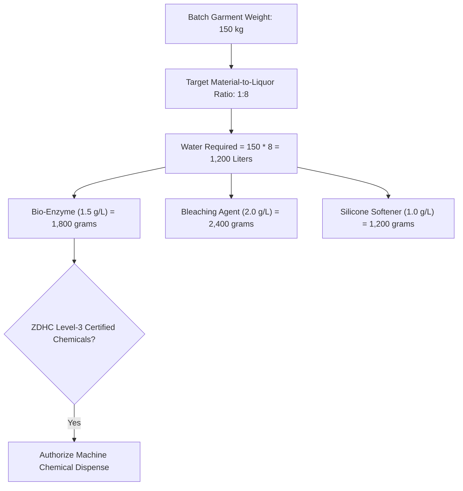
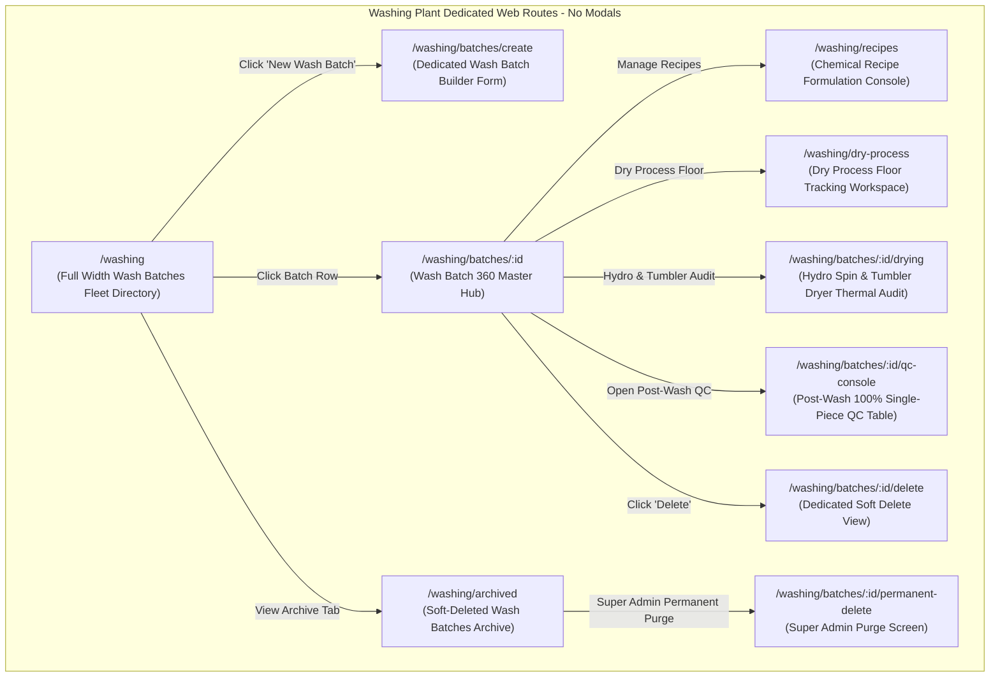
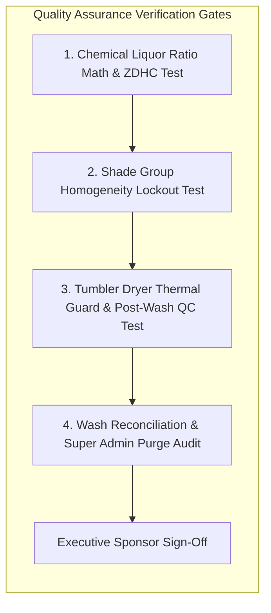

# Software Requirements Specification (SRS)
## Module 11: Industrial Garment Washing Plant Engine
### প্রজেক্ট: TraceFlow RMG — Precision Fabric-to-Freight Garment Intelligence
**ডকুমেন্ট রেফারেন্স:** `TFRMG-SRS-MOD11-V2.0`  
**ডকুমেন্ট ভার্সন:** 2.0 (Global Tier-1 Enterprise Production Edition — Wet & Dry Chemical Processing)  
**স্ট্যান্ডার্ড কমপ্লায়েন্স:** ISO/IEC/IEEE 29148:2018, ZDHC (Zero Discharge of Hazardous Chemicals) Level 3, AATCC Dimensional Changes in Home Laundering Standards  
**স্ট্যাটাস:** Approved & Production-Ready  
**টার্গেট আর্কিটেকচার:** Laravel 13 (Batch Hydro-Thermal Engine) + React 19 / Vite (Dedicated Wash Floor SPA) + PostgreSQL 17 + Redis 7  

---

## ১. ডকুমেন্ট গভর্নেন্স ও সংস্করণ নিয়ন্ত্রণ (Document Governance & Control)

### ১.১ সংস্করণ ইতিহাস (Revision History)
| ভার্সন | তারিখ | পর্যালোচনাকারী | পরিবর্তনের বিবরণ ও পরিধি |
|---|---|---|---|
| `v1.0` | 2026-09-02 | Lead Business Analyst | ওয়াশিং ব্যাচ ও রিসিভিং প্রাথমিক ড্রাফট। |
| `v2.0` | 2026-09-02 | Principal Enterprise Architect | **স্বতন্ত্র ওয়াশিং প্ল্যান্ট মডিউল হিসেবে রূপান্তর (Dedicated Washing Plant Engine):** ওয়েট প্রসেস (Enzyme, Stone, Bleach, Acid Wash) ও ড্রাই প্রসেস (Whiskers, Hand Sanding, PP Spray), কেমিক্যাল রেসিপি ও লিকার রেশিও (M:L), হাইড্রো-এক্সট্রাক্টর ও ইন্ডাস্ট্রিয়াল টাম্বলার ড্রায়ার শ্রিংকেজ কন্ট্রোল, পোস্ট-ওয়াশ ১০০% সিঙ্গেল-পিস কিউসি, ওয়াশ ব্যাচ রিকনসিলিয়েশন সমীকরণ, টু-টিয়ার ডিলিশন গভর্নেন্স (Super Admin Hard Delete Guard), কমপ্লিট PostgreSQL 17 DDL এবং RTM সংযোজন। |

### ১.২ অনুমোদনকারী ব্যক্তিবর্গ (Sign-Off & Approvals)
- **Executive Sponsor / Project Owner:** Executive Sponsor, RMG Systems
- **Lead Solution Architect:** AI Solution Architect
- **Head of Washing Plant & Chemical Engineering:** Industrial Wet & Dry Processing Division
- **Head of Environmental & ZDHC Compliance:** Effluent Treatment Plant (ETP) & Chemical Safety
- **General Manager (Factory Operations):** Manufacturing Plant Operations

---

## ২. নির্বাহী সারসংক্ষেপ ও কৌশলগত উদ্দেশ্য (Executive Summary & Strategic Scope)

### ২.১ কৌশলগত প্রেক্ষাপট (Strategic Context)
গার্মেন্টস শিল্পে বিশেষ করে ওভেন ডেনিম জিন্স, টুইল চিনো প্যান্ট এবং প্রিমিয়াম সুতি টি-শার্টের ক্ষেত্রে ইন্ডাস্ট্রিয়াল ওয়াশিং কোনো সাধারণ লন্ড্রি নয়; এটি একটি অত্যাধুনিক **কেমিক্যাল, থার্মাল ও মেকানিক্যাল ইঞ্জিনিয়ারিং প্রক্রিয়া**। সেলাই লাইনের কিউসি পাস হওয়ার পর (Module 10) পোশাকগুলো ওয়াশিং প্ল্যান্টে প্রবেশ করে।

ওয়াশিং প্ল্যান্টে ট্রেসিবিলিটি না থাকলে নিম্নলিখিত মারাত্মক বিপর্যয় ঘটে:
1. **The Bleeding & Shade Disaster:** একই মেশিনে ভিন্ন কাপড়ের লট বা ভিন্ন ফেব্রিক রোলের শেড গ্রুপ (Shade Group A/B) একসাথে ওয়াশ করলে পুরো লটের রং অসমান (Patchy Wash) হয়ে কোটি টাকার স্টক রিজেক্ট হয়।
2. **Thermal Shrinkage & Out-of-Spec Measurements:** ড্রায়ারের তাপমাত্রা (যেমন: ৮০°C) এবং অতিরিক্ত সময় কাপড় ঘোরালে কাপড় অতিরিক্ত সংকুচিত (Over-Shrinkage) হয়ে যায়; যার ফলে বায়ারের মেজারমেন্ট স্পেক আউট হয়ে সম্পূর্ণ শিপমেন্ট বাতিল হয়।
3. **Chemical Fiber Damage (Acid / PP Holes):** অতিরিক্ত ব্লিচিং বা পটাশিয়াম পারম্যাঙ্গানেট (PP Spray) স্পঞ্জের কারণে কাপড়ের সুতা দুর্বল হয়ে ড্রায়ার বা হাইড্রো-মেশিনে কাপড় ফেটে টুকরো টুকরো হয়ে যায়।

**Module 11: Industrial Garment Washing Plant Engine** এর দর্শন হলো:
> **"Scientific Chemical Recipe, Zero Thermal Over-Shrinkage, 100% Single-Piece Piece Reconciliation."**

```mermaid
graph TB
    subgraph Washing Plant Lifecycle Engine (Module 11)
        direction TB
        QC_PASS[Single-Piece QR exits Module 10 QC Pass] --> BATCH_FORM[Wash Batch Formulation & Machine Allocation]
        
        subgraph Dry Processing Section
            BATCH_FORM --> DRY_PROC[Whiskers, Hand Sanding, Chevron, Grinding]
            DRY_PROC --> PP_SPRAY[Potassium Permanganate - PP Spray & Neutralize]
        end
        
        subgraph Wet Chemical Processing Section
            PP_SPRAY --> WET_RECIPE[Chemical Recipe Dosing & Liquor Ratio 1:8]
            WET_RECIPE --> BELLY_WASH[Industrial Belly Washers: Bio-Enzyme / Stone / Bleach]
            BELLY_WASH --> HYDRO[Centrifugal Hydro-Extractor Moisture Spin]
            HYDRO --> DRYER[Industrial Steam Tumbler Dryers: Temp & Shrinkage Guard]
        end
        
        DRYER --> POST_QC{Post-Wash 100% Single-Piece Inspection}
        POST_QC -->|Wash Perfect| PASS_STORE[Marked 'Wash_Passed' -> Module 12 Finishing]
        POST_QC -->|Shade Patchy| RE_WASH[Marked 'Wash_Re-Wash' -> Re-Tinting Batch]
        POST_QC -->|Torn / Damaged| WASH_REJ[Marked 'Wash_Reject' -> Permanent Inventory Deduction]
        
        POST_QC --> RECON[Wash Batch Reconciliation Equation Gate]
    end
```

---

## ৩. অলঙ্ঘনীয় এন্টারপ্রাইজ আর্কিটেকচারাল নিয়মাবলি (Non-Negotiable Architecture Directives)

প্রজেক্টের গ্লোবাল রুলস এবং এন্টারপ্রাইজ কোয়ালিটি নিশ্চিত করতে নিচের নিয়মগুলো ১০০% অলঙ্ঘনীয়:

### ৩.১ নো মোডালস নীতিমালা (STRICT No Modals / No Popups Rule)
- **জিরো মোডাল পলিসি:** পুরো ওয়াশিং প্ল্যান্ট মডিউলে কোনো ফর্ম, কনফার্মেশন, কেমিক্যাল রেসিপি এডিটর, ড্রায়ার প্যারামিটার কনফিগারেশন, পোস্ট-ওয়াশ কিউসি, বা সাব-স্ক্রিনের জন্য `Modal`, `Dialog`, `Popup`, `Lightbox`, বা `Drawer-over-backdrop` কঠোরভাবে নিষিদ্ধ।
- **ডেডিকেটেড রুট আর্কিটেকচার:** ওয়াশিং মেশিন ফ্লিট ডিরেক্টরি, কেমিক্যাল রেসিপি ফর্মুলেশন পেজ, ওয়াশ ব্যাচ লোডিং কনসোল, হাইড্রো/ড্রায়ার রান ট্র্যাকার, পোস্ট-ওয়াশ কিউসি কনসোল, এবং ডিলিট কনফার্মেশন—প্রতিটি ইন্টারঅ্যাকশন একটি সুনির্দিষ্ট ব্রাউজার ইউআরএল এবং ডেডিকেটেড ফুল-স্ক্রিন ভিউতে (Full-Screen Dedicated View) লোড হবে।
- **নেভিগেশন স্ট্যাক:** প্রতিটি পেজে স্ট্যান্ডার্ড ব্যাক বাটন এবং স্ট্রাকচার্ড ব্রেডক্রাম্ব (`Dashboard > Washing > Batch-04 > Hydro & Tumbler Drying Console`) থাকতে হবে যাতে ব্রাউজারের নেটিভ Forward/Back বাটন স্বাভাবিকভাবে কাজ করে এবং ডিপ-লিংক শেয়ারিং সম্ভব হয়।

### ৩.২ পিউর সার্ভার-সাইড ভ্যালিডেশন স্ট্যান্ডার্ড (Pure Server-Side Validation)
- **জিরো ক্লায়েন্ট-সাইড HTML5 ভ্যালিডেশন:** ফ্রন্টএন্ডের কোনো `<form>` বা `<input>` ফিল্ডে ব্রাউজারের ডিফল্ট HTML5 ভ্যালিডেশন অ্যাট্রিবিউট (`required`, `minlength`, `maxlength`, `pattern`, ইত্যাদি) দেওয়া যাবে না। ব্রাউজারের বিল্ট-ইন টুলটিপ পপআপ সম্পূর্ণ নিষিদ্ধ।
- **বাধ্যতামূলক `noValidate`:** সমস্ত ফ্রন্টএন্ড ফর্মে `<form noValidate>` স্পষ্টভাবে যুক্ত থাকতে হবে।
- **একীভূত এরর কন্ট্রাক্ট:** সমস্ত ব্যাচ ক্যাপাসিটি, তাপমাত্রা এবং সিঙ্গেল পিস ভ্যালিডেশন ব্যাকএন্ড Laravel `FormRequest` ক্লাসের মাধ্যমে পিউর সার্ভার সাইডে ঘটবে। ইনপুট ভুল হলে সার্ভার থেকে `422 Unprocessable Content` স্ট্যান্ডার্ড RFC 7807 কমপ্লায়েন্ট JSON এরর পাঠানো হবে।
- **ইনলাইন এরর রেন্ডারিং:** ফ্রন্টএন্ড স্বয়ংক্রিয়ভাবে রেসপন্সের ফিল্ড নেম ম্যাপ করে সংশ্লিষ্ট ইনপুট বক্সের ঠিক নিচে ক্রিস্প লাল রঙে এরর বার্তা রেন্ডার করবে।

### ৩.৩ ফ্ল্যাট এবং ক্রিস্প ডিজাইন স্ট্যান্ডার্ড (Flat Solid UI Standard)
- **নো গ্রেডিয়েন্ট পলিসি:** কোনো বাটন, কার্ড, হেডার বা সাইডবারে কোনো ধরণের গ্রেডিয়েন্ট কালার ব্যবহার করা যাবে না।
- **সলিড ডিজাইন টোকেনস:** সকল অ্যাকশন বাটন ক্রিস্প ও ফ্ল্যাট সলিড রঙে গঠিত হবে (যেমন: Primary `#2563EB`, Danger `#DC2626`, Success `#16A34A`, Neutral `#475569`, Warning `#D97706`)।
- **১০০% ইংরেজি ইউআই:** ইউজার ইন্টারফেসের সমস্ত লেবেল, ফিল্ড নেম, কলাম হেডার, অ্যাকশন বাটন এবং সিস্টেম নোটিফিকেশন ১০০% প্রফেশনাল আন্তর্জাতিক ইংরেজি ভাষায় (English) হবে।

### ৩.৪ দ্বি-স্তরবিশিষ্ট ডিলিশন গভর্নেন্স (Two-Tier Deletion Architecture)
- **সফট ডিলিট (Soft Delete):** ওয়াশিং ম্যানেজার শুধুমাত্র সেই ব্যাচ সফট ডিলিট করতে পারবেন যা এখনও মেশিনে লোড করে পানি/কেমিক্যাল ছাড়া হয়নি (`deleted_at = NOW()`)।
- **পার্মানেন্ট হার্ড ডিলিট (STRICT Super Admin Only):** ডাটাবেস থেকে স্থায়ীভাবে রো মুছে ফেলার ক্ষমতা **কেবলমাত্র `Super Admin` এর থাকবে**।
- **প্রোডাকশন রেফারেনশিয়াল প্রোটেকশন গার্ড (Referential Check):** যদি কোনো ওয়াশ হওয়া পোশাক অলরেডি ফিনিশিং ফ্লোরে (Module 12) আয়রনিং বা কার্টনে প্যাক (Module 13) হয়ে থাকে, তবে সিস্টেম পার্মানেন্ট ডিলিট **সম্পূর্ণ ব্লক** করবে এবং `409 Conflict` রিটার্ন করবে।

---

## ৪. ইউজার পারসোনা ও এক্সেস হায়ারার্কি (User Personas & Scoping)

| পারসোনা (Persona) | ইন্টারফেস ও ডিভাইস | প্রমাণীকরণ মাধ্যম (Auth Method) | প্রিভিলেজ বাউন্ডারি (Privilege Scope) |
|---|---|---|---|
| **Washing Master / Plant Manager** | Web Browser (Desktop) | Emp ID / Username + Password | ওয়াশ ব্যাচ তৈরি, কেমিক্যাল রেসিপি অনুমোদন, মেশিন শিডিউলিং, সফট ডিলিট। |
| **Dry Process Floor Lead** | Floor Tablet / Touch Screen | Emp ID / Username + Password | হুইস্কার, হ্যান্ড স্যান্ডিং, পিপি স্প্রে ব্যাচ ট্র্যাকিং ও কিউরিং ওভেন। |
| **Washing Machine Operator** | Industrial Kiosk / Tablet | Machine Paired Station Token | কাপড় লোডিং, ওয়াটার ইনটেক, কেমিক্যাল ডোজিং, সাইকেল কমপ্লিশন স্ট্যাম্প। |
| **Hydro & Dryer Operator** | Industrial Kiosk / Tablet | Station Paired Device Token | হাইড্রো সেন্ট্রিফিউগাল স্পিন ও টাম্বলার ড্রায়ার তাপমাত্রা/টাইম মনিটরিং। |
| **Post-Wash Quality Inspector (QC)**| Floor Tablet / Touch Screen | Emp ID / Username + Password | ওয়াশ পরবর্তী ১০০% পোশাক ইন্সপেকশন, রি-ওয়াশ ও রিজেক্ট ফ্ল্যাগিং। |
| **Super Admin** | Web Browser (Desktop) | Username + Password + TOTP 2FA | গ্লোবাল বাইপাস, লকড ওয়াশ ব্যাচ ট্রাবলশুট, পার্মানেন্ট পার্জ। |

---

## ৫. বিস্তারিত ফাংশনাল রিকোয়ারমেন্টস (Detailed Functional Specifications)

### ৫.১ সাব-মডিউল: ড্রাই প্রসেস ট্র্যাকিং (Dry Process Engine)

ডেনিম ও টুইল কাপড়ের উপর সেলাই পরবর্তী ভিজ্যুয়াল এফেক্ট তৈরীকরণ।

#### ৫.১.১ স্পেসিফিকেশন ও ট্র্যাকিং
- **REQ-WSH-DRY-001 (Dry Process Operations Specification):**
  - সিস্টেম নিচের ড্রাই প্রসেসসমূহ ট্র্যাক করবে:
    - *Whiskers (Moustache 3D Pattern)*
    - *Hand Sanding / Scraping (Thigh & Knee Abrasion)*
    - *Chevron / Tack / Tagging*
    - *Grinding / Destroy (Pocket & Hem Fraying)*
    - *Potassium Permanganate (PP) Spray & Neutralization*
  - ড্রাই প্রসেস সম্পন্ন হওয়ার পর কাপড় ওভেনে কিউরিং (Curing Oven: e.g. ১৫০°C এ ১০ মিনিট) করার সাইকেল টাইম সিস্টেমে লগ হবে।

---

### ৫.২ সাব-মডিউল: কেমিক্যাল রেসিপি ও লিকার রেশিও ইঞ্জিন (Chemical Recipe & Liquor Ratio)



#### ৫.২.১ স্পেসিফিকেশন ও গাণিতিক ফর্মুলা
- **REQ-WSH-RCP-001 (Liquor Ratio & Water Consumption Math):**
  - কাপড়ের ওজনের ওপর ভিত্তি করে স্বয়ংক্রিয় ওয়াটার ভলিউম হিসাব:
    $$\text{Water Required (Liters)} = \text{Batch Garment Weight (kg)} \times \text{Liquor Ratio (M:L, e.g. 8 or 10)}$$
- **REQ-WSH-RCP-002 (ZDHC Level-3 Chemical Dosing):**
  - প্রতিটি ওয়াশ সাইকেলের জন্য সুনির্দিষ্ট কেমিক্যাল অনুপাত:
    - Desizing Agent (e.g. $1.0 \text{ g/L}$)
    - Bio-Enzyme / Cellulase ($1.5 \text{ g/L}$)
    - Neutralizer / Anti-backstaining ($1.0 \text{ g/L}$)
    - Silicone Micro-Emulsion Softener ($1.2 \text{ g/L}$)
  - পরিবেশবান্ধব ZDHC এবং Oeko-Tex ব্যাচ নম্বর বাধ্যতামূলক।

---

### ৫.৩ সাব-মডিউল: ওয়াশ ব্যাচ ফর্মুলেশন ও মেশিন লোডিং (Batch Formulation & Loading)

#### ৫.৩.১ স্পেসিফিকেশন ও শেড গ্রুপিং গার্ড
- **REQ-WSH-BAT-001 (QC-Pass Single-Piece Gating):**
  - ওয়াশ ব্যাচে শুধুমাত্র সেই একক পোশাকগুলো অন্তর্ভুক্ত করা যাবে যার স্ট্যাটাস `QC_Passed` (Module 10 এন্ড-লাইন কিউসি ছাড়পত্র প্রাপ্ত)।
  - কোনো আন-ইন্সপেক্টেড বা অল্টার পোশাক ওয়াশ ব্যাচে যুক্ত করার চেষ্টা করলে সিস্টেম `422 Unprocessable Content` দিয়ে ব্লক করবে।
- **REQ-WSH-BAT-002 (Strict Shade Group Homogeneity Guard):**
  - কাপড় কাটার সময় নির্ধারিত ফেব্রিক শেড গ্রুপ (Shade Group A, Shade Group B) সিস্টেমে ম্যাপ করা থাকে।
  - **মারাত্মক ক্রস-কন্টামিনেশন গার্ড:** সিস্টেম কখনো শেড গ্রুপ A এবং শেড গ্রুপ B এর পোশাক একই মেশিনের ব্যাচে মিক্স করতে দেবে না। মিক্স করার চেষ্টা করলে সার্ভার এরর ছুড়ে দেবে: *"Shade Group Mismatch: Cannot mix Shade Group A and B in Wash Batch WSH-004."*

---

### ৫.৪ সাব-মডিউল: হাইড্রো-এক্সট্রাক্টর ও টাম্বলার ড্রায়ার শ্রিংকেজ কন্ট্রোল (Hydro & Dryer Guard)

#### ৫.৪.১ স্পেসিফিকেশন ও থার্মাল অডিট
- **REQ-WSH-DRY-002 (Centrifugal Hydro Extraction Monitoring):**
  - ওয়াশ সম্পন্ন হওয়ার পর হাইড্রো-এক্সট্রাক্টরে কাপড়ের আর্দ্রতা নিষ্কাশন (Extraction RPM: e.g. ১,২০০ RPM, সময়: ৫ মিনিট) লগ করতে হবে।
- **REQ-WSH-DRY-003 (Industrial Tumbler Dryer Thermal & Shrinkage Guard):**
  - টাম্বলার ড্রায়ারের বাষ্প/গ্যাস তাপমাত্রা (e.g. ৭০°C থেকে ৮০°C) এবং কুল-ডাউন সাইকেল সময় (Cool-down: ৫ মিনিট) কঠোরভাবে নিয়ন্ত্রণ করতে হবে।
  - তাপমাত্রা নির্ধারিত মাত্রার ওপরে উঠলে কাপড়ের শ্রিংকেজ বা সংকোচন বায়ারের অনুমোদিত টলারেন্স ($\pm 1.5\%$) অতিক্রম করে সাইজ স্পেক আউট হয়ে যাওয়ার ঝুঁকিতে সিস্টেম ড্রায়ার অ্যালার্ম জারি করবে।

---

### ৫.৫ সাব-মডিউল: পোস্ট-ওয়াশ ১০০% কিউসি ও ব্যাচ রিকনসিলিয়েশন (Post-Wash QC & Reconciliation)

ওয়াশ ও শুকানো শেষে পোশাক ঠান্ডা হওয়ার পর প্রতিটি পোশাকের মান যাচাই।

#### ৫.৫.১ স্পেসিফিকেশন ও ডিফেক্ট ক্লাসিফিকেশন
- **REQ-WSH-QC-001 (Post-Wash Single-Piece QR Audit):**
  - প্রতিটি একক পোশাকের চাইল্ড কিউআর স্টিকার স্ক্যান করে ওয়াশ কোয়ালিটি যাচাই করা হবে।
- **REQ-WSH-QC-002 (Wash Defect Categorization):**
  - *Color Bleeding / Back-Staining* (রং লেগে সাদা পকেট বা সুতা নীল হওয়া)
  - *Patchy Wash / Uneven Abrasion* (অসমান ওয়াশ এফেক্ট)
  - *Hydro/Dryer Torn / Machine Hole* (মেশিনের প্যাডেলে জড়িয়ে কাপড় ছিঁড়ে যাওয়া — **Permanent Reject**)
  - *Bad Hand-Feel / Over-Stiff*
- **REQ-WSH-REC-001 (The Golden Wash Reconciliation Equation):**
  - প্রতিটি ওয়াশ ব্যাচের শতভাগ পিস ব্যালেন্স মেলানো বাধ্যতামূলক:
    $$\text{Batched Pieces} = \text{Wash Passed} + \text{Wash Re-Wash} + \text{Wash Permanent Reject} + \text{Missing Pieces}$$
  - সম্পূর্ণ হিসাব না মেলা পর্যন্ত ব্যাচ ক্লোজ হবে না এবং ফিনিশিং ফ্লোরে যাওয়ার গেট পাস ইস্যু হবে না।

---

## ৬. প্রোডাকশন-গ্রেড ডাটাবেস আর্কিটেকচার ও DDL (Database Engineering)

নিচে PostgreSQL 17 এর জন্য সম্পূর্ণ প্রোডাকশন-রেডি DDL স্ক্রিপ্ট দেওয়া হলো। এতে ওয়াশিং মেশিন মাস্টার, কেমিক্যাল রেসিপি, ওয়াশ ব্যাচ, ড্রায়ার সাইকেল এবং পোস্ট-ওয়াশ কিউসি ইন্সপেকশনের টেবিলসমূহ অন্তর্ভুক্ত রয়েছে।

### ৬.১ PostgreSQL 17 Production Schema (Complete DDL)

```sql
-- Enable Cryptographic Extension for UUID v4
CREATE EXTENSION IF NOT EXISTS "pgcrypto";

-- ----------------------------------------------------------------------
-- 1. Table: wash_machines (Washing, Hydro & Dryer Fleet Master)
-- ----------------------------------------------------------------------
CREATE TABLE wash_machines (
    id UUID PRIMARY KEY DEFAULT gen_random_uuid(),
    machine_code VARCHAR(40) NOT NULL,            -- e.g. WSH-01, HYD-02, DRY-03
    machine_type VARCHAR(40) NOT NULL,            -- Belly_Washer, Front_Loader, Hydro_Extractor, Tumbler_Dryer
    brand VARCHAR(80) NOT NULL,                   -- Tonello, Tolkar, Tupesa
    loading_capacity_kg NUMERIC(6, 2) NOT NULL CHECK (loading_capacity_kg > 0),
    max_temperature_celsius NUMERIC(5, 2) DEFAULT 100.00,
    is_active BOOLEAN NOT NULL DEFAULT TRUE,
    created_at TIMESTAMPTZ NOT NULL DEFAULT CURRENT_TIMESTAMP,
    updated_at TIMESTAMPTZ NOT NULL DEFAULT CURRENT_TIMESTAMP,
    deleted_at TIMESTAMPTZ
);

CREATE UNIQUE INDEX uq_wash_machine_code ON wash_machines (UPPER(machine_code)) WHERE deleted_at IS NULL;
CREATE INDEX idx_wash_machines_type ON wash_machines (machine_type);

-- ----------------------------------------------------------------------
-- 2. Table: wash_recipes (Chemical Dosing Formulation Master)
-- ----------------------------------------------------------------------
CREATE TABLE wash_recipes (
    id UUID PRIMARY KEY DEFAULT gen_random_uuid(),
    recipe_code VARCHAR(60) NOT NULL,             -- e.g. RCP-DNM-ENZ-01
    wash_type VARCHAR(50) NOT NULL,               -- Bio_Enzyme, Stone, Bleach, Acid, Silicon_Softener
    liquor_ratio SMALLINT NOT NULL DEFAULT 8 CHECK (liquor_ratio > 0), -- e.g. 1:8 or 1:10
    desizing_ratio_gpl NUMERIC(5, 2) NOT NULL DEFAULT 1.00,
    enzyme_ratio_gpl NUMERIC(5, 2) NOT NULL DEFAULT 1.50,
    softener_ratio_gpl NUMERIC(5, 2) NOT NULL DEFAULT 1.20,
    target_ph NUMERIC(3, 1) NOT NULL DEFAULT 5.5,
    target_water_temp_celsius NUMERIC(5, 2) NOT NULL DEFAULT 55.00,
    curing_temp_celsius NUMERIC(5, 2) DEFAULT 150.00,
    zdhc_level_certified BOOLEAN NOT NULL DEFAULT TRUE,
    created_by UUID REFERENCES users(id) ON DELETE RESTRICT,
    created_at TIMESTAMPTZ NOT NULL DEFAULT CURRENT_TIMESTAMP,
    updated_at TIMESTAMPTZ NOT NULL DEFAULT CURRENT_TIMESTAMP,
    deleted_at TIMESTAMPTZ
);

CREATE UNIQUE INDEX uq_wash_recipe_code ON wash_recipes (UPPER(recipe_code)) WHERE deleted_at IS NULL;

-- ----------------------------------------------------------------------
-- 3. Table: wash_batches (Industrial Wash Batch Header)
-- ----------------------------------------------------------------------
CREATE TABLE wash_batches (
    id UUID PRIMARY KEY DEFAULT gen_random_uuid(),
    batch_no VARCHAR(60) NOT NULL,                -- e.g. WSH-BATCH-2026-0042
    po_id UUID NOT NULL REFERENCES purchase_orders(id) ON DELETE RESTRICT,
    recipe_id UUID NOT NULL REFERENCES wash_recipes(id) ON DELETE RESTRICT,
    wash_machine_id UUID NOT NULL REFERENCES wash_machines(id) ON DELETE RESTRICT,
    shade_group VARCHAR(10) NOT NULL,             -- A, B, C (Strict Homogeneity)
    total_pieces_loaded INTEGER NOT NULL CHECK (total_pieces_loaded > 0),
    total_weight_kg NUMERIC(8, 2) NOT NULL CHECK (total_weight_kg > 0),
    total_pieces_passed INTEGER NOT NULL DEFAULT 0,
    total_pieces_rewash INTEGER NOT NULL DEFAULT 0,
    total_pieces_rejected INTEGER NOT NULL DEFAULT 0,
    cycle_start_time TIMESTAMPTZ,
    cycle_end_time TIMESTAMPTZ,
    batch_status VARCHAR(30) NOT NULL DEFAULT 'Draft', -- Draft, Loaded, In_Washing, Hydro_Spin, Drying, Post_QC, Closed
    created_by UUID REFERENCES users(id) ON DELETE RESTRICT,
    created_at TIMESTAMPTZ NOT NULL DEFAULT CURRENT_TIMESTAMP,
    updated_at TIMESTAMPTZ NOT NULL DEFAULT CURRENT_TIMESTAMP,
    deleted_at TIMESTAMPTZ
);

CREATE UNIQUE INDEX uq_wash_batch_no ON wash_batches (UPPER(batch_no)) WHERE deleted_at IS NULL;
CREATE INDEX idx_wash_batches_po_id ON wash_batches (po_id);
CREATE INDEX idx_wash_batches_status ON wash_batches (batch_status);

-- ----------------------------------------------------------------------
-- 4. Table: wash_batch_items (Individual Single-Piece Mapping)
-- ----------------------------------------------------------------------
CREATE TABLE wash_batch_items (
    id UUID PRIMARY KEY DEFAULT gen_random_uuid(),
    batch_id UUID NOT NULL REFERENCES wash_batches(id) ON DELETE CASCADE,
    single_piece_qr_id UUID NOT NULL REFERENCES single_piece_qrs(id) ON DELETE RESTRICT,
    created_at TIMESTAMPTZ NOT NULL DEFAULT CURRENT_TIMESTAMP
);

CREATE UNIQUE INDEX uq_batch_piece ON wash_batch_items (batch_id, single_piece_qr_id);
CREATE INDEX idx_batch_items_piece_id ON wash_batch_items (single_piece_qr_id);

-- ----------------------------------------------------------------------
-- 5. Table: wash_drying_cycles (Tumbler Dryer Thermal Audit Logs)
-- ----------------------------------------------------------------------
CREATE TABLE wash_drying_cycles (
    id UUID PRIMARY KEY DEFAULT gen_random_uuid(),
    batch_id UUID NOT NULL REFERENCES wash_batches(id) ON DELETE CASCADE,
    dryer_machine_id UUID NOT NULL REFERENCES wash_machines(id) ON DELETE RESTRICT,
    set_temperature_celsius NUMERIC(5, 2) NOT NULL CHECK (set_temperature_celsius > 0),
    actual_max_temp_celsius NUMERIC(5, 2) NOT NULL,
    drying_duration_minutes SMALLINT NOT NULL CHECK (drying_duration_minutes > 0),
    cooldown_minutes SMALLINT NOT NULL DEFAULT 5,
    is_overheated BOOLEAN NOT NULL DEFAULT FALSE,
    operator_id UUID REFERENCES users(id) ON DELETE RESTRICT,
    created_at TIMESTAMPTZ NOT NULL DEFAULT CURRENT_TIMESTAMP
);

CREATE INDEX idx_wash_drying_batch ON wash_drying_cycles (batch_id);

-- ----------------------------------------------------------------------
-- 6. Table: wash_qc_inspections (Post-Wash 100% Piece Audit)
-- ----------------------------------------------------------------------
CREATE TABLE wash_qc_inspections (
    id UUID PRIMARY KEY DEFAULT gen_random_uuid(),
    batch_id UUID NOT NULL REFERENCES wash_batches(id) ON DELETE CASCADE,
    single_piece_qr_id UUID NOT NULL REFERENCES single_piece_qrs(id) ON DELETE RESTRICT,
    verdict VARCHAR(30) NOT NULL,                 -- Wash_Passed, Wash_Re-Wash, Wash_Reject
    defect_type VARCHAR(60),                      -- Color_Bleeding, Patchy_Wash, Machine_Tear, Back_Staining
    qc_inspector_id UUID REFERENCES users(id) ON DELETE RESTRICT,
    remarks TEXT,
    created_at TIMESTAMPTZ NOT NULL DEFAULT CURRENT_TIMESTAMP
);

CREATE INDEX idx_wash_qc_batch_id ON wash_qc_inspections (batch_id);
CREATE INDEX idx_wash_qc_piece_id ON wash_qc_inspections (single_piece_qr_id);
CREATE INDEX idx_wash_qc_verdict ON wash_qc_inspections (verdict);
```

---

## ৭. সম্পূর্ণ এপিআই কন্ট্রাক্ট স্পেসিফিকেশন (Exhaustive API Contracts)

### ৭.১ সাধারণ আর্কিটেকচার ও স্ট্যান্ডার্ডস
- **অথেনটিকেশন:** `Authorization: Bearer <sanctum_token>`
- **কমন হেডার্স:** `Accept: application/json`, `Content-Type: application/json`
- **স্ট্যান্ডার্ড ফিল্টারিং:**
  `GET /api/v1/washing/batches?page=1&per_page=20&status=In_Washing`

---

### ৭.২ ওয়াশ ব্যাচ ক্রিয়েশন ও লোডিং এন্ডপয়েন্টস

#### ৭.২.১ ওয়াশ ব্যাচ তৈরি ও শেড ভ্যালিডেশন
- **মেথড ও ইউআরএল:** `POST /api/v1/washing/batches`
- **রিকোয়েস্ট বডি:**
  ```json
  {
    "po_id": "e81d7f12-9b22-4a90-8811-37b92a4f0099",
    "recipe_id": "r100a982-192a-4f90-8800-291740011283",
    "wash_machine_id": "m100a982-192a-4f90-8800-291740011283",
    "shade_group": "A",
    "single_piece_qr_ids": [
      "a98df23e-6b12-4211-9a7c-87d46c0e5a99",
      "b98df23e-6b12-4211-9a7c-87d46c0e5a99"
    ],
    "total_weight_kg": 150.0
  }
  ```
- **সাকসেস রেসপন্স (`201 Created`):**
  ```json
  {
    "success": true,
    "status_code": 201,
    "message": "Wash batch created. Water required: 1,200 Liters (1:8 ratio). All pieces verified as QC_Passed.",
    "data": {
      "batch_id": "w800a982-192a-4f90-8800-291740011283",
      "batch_no": "WSH-BATCH-2026-0042",
      "total_pieces_loaded": 2,
      "calculated_water_liters": 1200.0,
      "status": "Loaded"
    }
  }
  ```

---

### ৭.৩ পোস্ট-ওয়াশ কিউসি ও ব্যাচ রিকনসিলিয়েশন এন্ডপয়েন্ট

#### ৭.৩.১ পোস্ট-ওয়াশ সিঙ্গেল পিস রেজাল্ট সাবমিশন
- **মেথড ও ইউআরএল:** `POST /api/v1/washing/qc/inspect`
- **রিকোয়েস্ট বডি (Case: Machine Tear - Permanent Reject):**
  ```json
  {
    "batch_id": "w800a982-192a-4f90-8800-291740011283",
    "single_piece_qr_id": "a98df23e-6b12-4211-9a7c-87d46c0e5a99",
    "verdict": "Wash_Reject",
    "defect_type": "Machine_Tear",
    "remarks": "Garment trapped in hydro-extractor drum basket and torn along waistband."
  }
  ```
- **সাকসেস রেসপন্স (`200 OK`):**
  ```json
  {
    "success": true,
    "status_code": 200,
    "message": "Piece logged as Wash_Reject. Permanently removed from finished inventory pipeline.",
    "data": {
      "piece_status": "Wash_Reject",
      "batch_id": "w800a982-192a-4f90-8800-291740011283",
      "remaining_batch_pieces": 1
    }
  }
  ```

---

### ৭.৪ ওয়াশিং ডিলিশন এন্ডপয়েন্টস (Two-Tier Deletion Architecture)

#### ৭.৪.১ ওয়াশ ব্যাচ সফট ডিলিট (Soft Delete Wash Batch)
- **মেথড ও ইউআরএল:** `DELETE /api/v1/washing/batches/{id}`
- **পারমিশন:** `washing.batches.delete`
- **শর্ত:** শুধুমাত্র যদি ওয়াশ সাইকেল শুরু না হয়ে থাকে (`batch_status = 'Draft'` or `'Loaded'`)।
- **সাকসেস রেসপন্স (`200 OK`):**
  ```json
  {
    "success": true,
    "status_code": 200,
    "message": "Wash batch soft-deleted successfully and moved to archive."
  }
  ```

#### ৭.৪.২ ওয়াশ ডাটা পার্মানেন্ট ডিলিট (STRICT Super Admin Only Purge)
- **মেথড ও ইউআরএল:** `DELETE /api/v1/washing/batches/{id}/force-delete`
- **অথরাইজেশন:** **STRICTLY `Super Admin` ROLE ONLY**
- **রিকোয়েস্ট বডি:**
  ```json
  {
    "super_admin_password": "MySuperAdminSecretPassword#2026"
  }
  ```
- **পোশাক ফিনিশিং বা প্যাকিংয়ে চলে গেলে ব্লকিং রেসপন্স (`409 Conflict`):**
  ```json
  {
    "success": false,
    "status_code": 409,
    "error_code": "CANNOT_PURGE_FINISHED_WASH_BATCH",
    "message": "Cannot permanently purge this wash batch because garments have already passed to Finishing (Module 12) and packed into export cartons (Module 13). Production audit trail is locked."
  }
  ```

---

## ৮. ইউজার ইন্টারফেস ও স্ক্রিন-বাই-স্ক্রিন স্পেসিফিকেশন (STRICT NO MODALS)

ওয়াশিং প্ল্যান্টের প্রতিটি স্ক্রিন সম্পূর্ণ ডেডিকেটেড রুটে ওপেন হবে। কোনো মোডাল বা পপআপ ডায়ালগ উইথ ব্যাকড্রপ থাকবে না।



### ৮.১ স্ক্রিন স্পেসিফিকেশন টেবিল

| রুট (Route Path) | স্ক্রিনের নাম | মূল উপাদান ও কনফিগারেশন | নো-মোডাল ডিজাইন নিশ্চিতকরণ |
|---|---|---|---|
| `/washing` | Wash Batches Fleet Console | - ফুল-উইডথ ডাটা গ্রিড<br/>- কলাম: **Batch No, PO No, Style, Recipe, Machine, Shade Group, Loaded Pcs, Passed, Status, Actions**<br/>- সলিড গ্রিন "New Wash Batch" বোতাম (`bg-emerald-600`) | পেজিনেশন ও অ্যাকশন সবকিছু ফুল পেজে পরিচালিত হবে। |
| `/washing/batches/create` | Dedicated Wash Batch Form | - `<form noValidate>` আর্কিটেকচার<br/>- বায়ার PO সিলেক্ট, কেমিক্যাল রেসিপি ড্রপডাউন, মেশিন সিলেক্ট<br/>- শেড গ্রুপ ফিল্টার ও কিউসি-পাস সিঙ্গেল পিস বারকোড ড্রপজোন<br/>- স্বয়ংক্রিয় ওয়াটার ও কেমিক্যাল রেশিও প্রিভিউ<br/>- সলিড ব্লু "Save Batch & Proceed to Load" বোতাম | সম্পূর্ণ আলাদা পেজ। ব্রেডক্রাম্ব নেভিগেশন সহ। |
| `/washing/batches/:id` | Wash Batch 360 Master Hub | - ওয়াশ ব্যাচের সার্বিক বিবরণ ও রিয়েল-টাইম প্রগ্রেস কার্ডস<br/>- ওয়াটার লিটার ও কেমিক্যাল কনসাম্পশন সারাংশ<br/>- সাব-ট্যাবস: Loading Items, Hydro & Dryer Logs, Post-Wash QC, Reconciliation | ফুল-স্ক্রিন এন্টারপ্রাইজ ড্যাশবোর্ড ভিউ। |
| `/washing/recipes` | Chemical Recipe Console | - এনজাইম, স্টোন, ব্লিচ, এসিড ও সফটনার রেসিপি ডিরেক্টরি<br/>- লিকার রেশিও ও ZDHC কমপ্লায়েন্স স্ট্যাটাস ব্যাজ<br/>- সলিড ব্লু "Create New Recipe" বোতাম | সম্পূর্ণ ডেডিকেটেড রেসিপি ওয়ার্কস্পেস। |
| `/washing/dry-process` | Dry Process Floor Workspace | - হুইস্কার, হ্যান্ড স্যান্ডিং ও পিপি স্প্রে লাইভ ফ্লোর শিডিউলার<br/>- ওভেন কিউরিং টাইম ও তাপমাত্রা মনিটর | ডেডিকেটেড ড্রাই প্রসেস কনসোল। |
| `/washing/batches/:id/drying`| Hydro & Tumbler Dryer Console| - হাইড্রো আরপিএম এবং টাম্বলার ড্রায়ার তাপমাত্রা কন্ট্রোল<br/>- থার্মাল ওভারহিট এলার্ম ব্যানার<br/>- সলিড ব্লু "Log Drying Parameters" বোতাম | ডেডিকেটেড থার্মাল অডিট পেজ। |
| `/washing/batches/:id/qc-console`| Post-Wash 100% QC Table | - ফুল-স্ক্রিন টাচ-অপ্টিমাইজড কিউসি ইন্টারফেস<br/>- একক পোশাকের কিউআর স্ক্যান ইনপুট<br/>- ফ্ল্যাট অ্যাকশন বাটনসমূহ: Wash Pass (সবুজ), Re-Wash (হলুদ), Reject (লাল) | ডেডিকেটেড ফুল-স্ক্রিন ফ্লোর কনসোল। |
| `/washing/batches/:id/delete` | Wash Soft-Delete Confirmation| - অ্যাম্বার সতর্কবার্তা ব্যানার<br/>- আন-ওয়াশড ব্যাচের সফট ডিলিট নিয়মাবলি<br/>- সলিড অ্যাম্বার "Confirm Soft Delete" বোতাম | ডেডিকেটেড ফুল-স্ক্রিন কনফার্মেশন। নো পপআপ। |
| `/washing/batches/:id/permanent-delete`| Wash Permanent Purge Console | - **Super Admin অনলি স্ক্রিন** (অন্যদের জন্য 403 Forbidden)<br/>- গাঢ় লাল অ্যালার্ট ব্যানার<br/>- সুপার অ্যাডমিন পাসওয়ার্ড ইনপুট ফিল্ড<br/>- ফিনিশিং/প্যাকিং ডাউনস্ট্রিম লকআউট ব্যাজ<br/>- সলিড ডার্ক-রেড "Purge Wash Batch Permanently" বোতাম | ফুল-স্ক্রিন হাইপার-সিকিউরড পার্জ ভিউ। |
| `/washing/archived` | Soft-Deleted Batches Archive | - সফট ডিলিট হওয়া ওয়াশ ব্যাচের তালিকা<br/>- "Restore Batch" বোতাম (`bg-amber-600`)<br/>- Super Admin এর জন্য "Purge Permanently" বোতাম | সম্পূর্ণ আলাদা আর্কাইভ পেজ। |

---

## ৯. নন-ফাংশনাল রিকোয়ারমেন্টস (Enterprise NFRs & SLAs)

### ৯.১ পারফরম্যান্স ও কনকারেন্সি বাজেট (Performance Budgets)
- **লিকার রেশিও ও কেমিক্যাল ক্যালকুলেশন লেটেন্সি:** সর্বোচ্চ **১০ মিলিসেকেন্ড (10ms)**।
- **পোস্ট-ওয়াশ কিউসি সিঙ্গেল পিস স্ক্যান লেটেন্সি:** সর্বোচ্চ **৩০ মিলিসেকেন্ড (30ms)**।
- **ওয়াশ রিকনসিলিয়েশন সমীকরণ অডিট:** সর্বোচ্চ **১৫ মিলিসেকেন্ড (15ms)**।

### ৯.২ ডাটা ইন্টিগ্রিটি ও এনভায়রনমেন্টাল অডিট (ZDHC Traceability)
- প্রতিটি ওয়াশ ব্যাচে ব্যবহৃত কেমিক্যালের ZDHC ও Oeko-Tex ব্যাচ নম্বর ডাটাবেসে স্থায়ীভাবে সংরক্ষিত থাকবে।

---

## ১০. ফেইলিওর মোড ও রেসপন্স অ্যানালাইসিস (FMEA Matrix)

| ফেইলিওর সিনারিও (Failure Mode) | সম্ভাব্য প্রভাব (Impact) | তীব্রতা (Severity) | সিস্টেমের স্বয়ংক্রিয় প্রতিরক্ষা মেকানিজম (Mitigation Mechanism) |
|---|---|---|---|
| ভিন্ন শেড গ্রুপের কাপড় একই মেশিনে ওয়াশ করা | শেড আন-ইভেন হয়ে সম্পূর্ণ লটের ফেব্রিক নষ্ট হওয়া | Critical | শেড হোমোজেনিটি গার্ড সক্রিয় থাকবে। ভিন্ন শেড গ্রুপের কাপড় একই ব্যাচে নির্বাচন করার চেষ্টা করলে সিস্টেম সেভ ব্লক করবে। |
| ড্রায়ারে অতিরিক্ত তাপে কাপড় মাত্রাতিরিক্ত সংকুচিত হওয়া | পোশাকের সাইজ মেজারমেন্ট স্পেক আউট হয়ে বায়ার রিজেকশন | Critical | টাম্বলার ড্রায়ার থার্মাল গার্ড কার্যকর থাকবে। নির্ধারিত তাপমাত্রার ওপরে ড্রায়ার উঠলে সিস্টেম ওভারহিট এলার্ম দেবে। |
| ওয়াশিং ফ্লোরে কাপড় নষ্ট হলেও তা গোপন করে ফিনিশিংয়ে পাঠানো | বায়ারের ফাইনাল অডিটে ড্যামেজ কাপড় ধরা পড়া | Critical | পোস্ট-ওয়াশ কিউসি গেট কার্যকর থাকবে। `Wash_Passed` স্ট্যাটাস ছাড়া কোনো কাপড় ফিনিশিংয়ে রিসিভ করা সম্পূর্ণ ব্লক থাকবে। |
| ফিনিশিং বা প্যাকিংয়ে চলে যাওয়া ওয়াশ ব্যাচের ডাটা ডিলিটের চেষ্টা | ম্যানুফ্যাকচারিং অডিট ট্রেইলে ফাঁক সৃষ্টি | Critical | ফরেন কি রেস্ট্রিক্ট গার্ড কার্যকর হবে। সিস্টেমে `409 Conflict` এসে পার্মানেন্ট ডিলিট অপারেশন স্থায়ীভাবে ব্লক করবে। |

---

## ১১. রিকোয়ারমেন্টস ট্রেসেবিলিটি ম্যাট্রিক্স (Requirements Traceability Matrix - RTM)

| রিকোয়ারমেন্ট আইডি | ডাটাবেস টেবিল | ব্যাকএন্ড এপিআই এন্ডপয়েন্ট | ফ্রন্টএন্ড ডেডিকেটেড রুট | QA টেস্ট কেস আইডি |
|---|---|---|---|---|
| `REQ-WSH-RCP-001` (Liquor Ratio Math) | `wash_recipes` | `POST /api/v1/washing/recipes` | `/washing/recipes` | `TC-WSH-001` |
| `REQ-WSH-BAT-002` (Shade Homogeneity) | `wash_batches` | `POST /api/v1/washing/batches` | `/washing/batches/create` | `TC-WSH-002` |
| `REQ-WSH-DRY-003` (Dryer Thermal Guard)| `wash_drying_cycles` | `POST /api/v1/washing/batches/{id}/drying`| `/washing/batches/:id/drying`| `TC-WSH-003` |
| `REQ-WSH-QC-001` (Post-Wash 100% QC) | `wash_qc_inspections` | `POST /api/v1/washing/qc/inspect` | `/washing/batches/:id/qc-console` | `TC-WSH-004` |
| `REQ-WSH-REC-001` (Reconciliation Eq) | `wash_batches` | `POST /api/v1/washing/batches/{id}/reconcile` | `/washing/batches/:id` | `TC-WSH-005` |
| `REQ-DEL-002` (Super Admin Hard Purge) | `wash_batches` | `DELETE /api/v1/washing/batches/{id}/force-delete` | `/washing/batches/:id/permanent-delete` | `TC-WSH-006` |

---

## ১২. কিউএ গ্রহণযোগ্যতার মানদণ্ড (Acceptance Criteria & Verification Plan)



### ১২.১ কোর টেস্ট কেসসমূহ (Core Test Execution Steps)

1. **`TC-WSH-001` (Chemical Liquor Ratio Math Accuracy Test):**
   - **ধাপ:** কাপড়ের ওজন = ১৫০ কেজি, লিকার রেশিও ১:৮ ইনপুট দেওয়া।
   - **প্রত্যাশিত ফলাফল:** সিস্টেম স্বয়ংক্রিয়ভাবে $\text{Water Required} = 150 \times 8 = 1,200 \text{ Liters}$ নির্ভুলভাবে গণনা করবে।
2. **`TC-WSH-002` (Shade Group Homogeneity Lockout Test):**
   - **ধাপ ১:** শেড গ্রুপ 'A' এর ২০টি পোশাক সিলেক্ট করা।
   - **ধাপ ২:** একই ব্যাচে ভুলবশত শেড গ্রুপ 'B' এর ১টি পোশাক অন্তর্ভুক্ত করার চেষ্টা করা।
   - **প্রত্যাশিত ফলাফল:** সিস্টেম ব্যাচ সেভ ব্লক করবে এবং এরর দেবে: "Shade Group Mismatch: Cannot mix Shade Group A and B in same wash machine."
3. **`TC-WSH-003` (Tumbler Dryer Thermal Guard & Overheat Alarm Test):**
   - **ধাপ:** ড্রায়ারের সর্বোচ্চ নিরাপদ তাপমাত্রা ৮০°C। টেস্টে ৮৫°C তাপমাত্রা ইনপুট দেওয়া।
   - **প্রত্যাশিত ফলাফল:** সিস্টেমে `is_overheated = true` ফ্ল্যাগ সক্রিয় হবে এবং ওভারহিট অ্যালার্ম জারি করবে।
4. **`TC-WSH-004` (Post-Wash 100% Single-Piece QC & Reject Removal Test):**
   - **ধাপ ১:** ১টি পোশাকে মেশিন টিয়ার ডিফেক্ট পেয়ে `Wash_Reject` মার্ক করা।
   - **প্রত্যাশিত ফলাফল:** পোশাকটি ফিনিশিং ও প্যাকিংয়ের গুড ইনভেন্টরি থেকে স্থায়ীভাবে বাদ পড়বে।
5. **`TC-WSH-005` (Wash Reconciliation Equation Verification):**
   - **ধাপ:** লোড হওয়া ৫০০ পিসের মধ্যে ৪৮০টি পাস, ১৫টি রি-ওয়াশ এবং ৫টি রিজেক্ট অবস্থায় ব্যাচ রিকনসাইল করা ($480 + 15 + 5 = 500$)।
   - **প্রত্যাশিত ফলাফল:** সমীকরণ মেলায় ব্যাচটি সফলভাবে ক্লোজ হবে এবং ফিনিশিং ফ্লোরে হস্তান্তরের ছাড়পত্র পাবে।
6. **`TC-WSH-006` (Super Admin Only Permanent Purge with Downstream Guard):**
   - **ধাপ ১:** নন-সুপার অ্যাডমিন দ্বারা `force-delete` চালানো -> `403 Forbidden`।
   - **ধাপ ২:** যে ব্যাচের কাপড় অলরেডি ফিনিশিং বা প্যাকিংয়ে চলে গেছে, সেটির উপর সুপার অ্যাডমিন কর্তৃক `force-delete` চালানো -> `409 Conflict` সহ ব্লক হবে।
   - **ধাপ ৩:** আন-প্রসেসড ড্রাফট ব্যাচের উপর সঠিক পাসওয়ার্ড দিয়ে `force-delete` চালানো -> ডাটাবেস থেকে রো সম্পূর্ণ মুছে যাবে।
7. **`TC-UI-001` (Zero Modals Compliance Audit):**
   - **ধাপ:** ওয়াশ ব্যাচ ক্রিয়েট, রেসিপি কনসোল, ড্রাই প্রসেস ওয়ার্কস্পেস, পোস্ট-ওয়াশ কিউসি ও ডিলিট ফ্লো পরীক্ষা করা।
   - **প্রত্যাশিত ফলাফল:** পুরো মডিউলে কোথাও কোনো `Modal` বা `Popup` থাকবে না। প্রতিটি ফিচার ডেডিকেটেড ফুল-স্ক্রিন পেজে কাজ করবে।

---

*(ডকুমেন্ট সমাপ্ত — Module 11: Industrial Garment Washing Plant Engine)*
