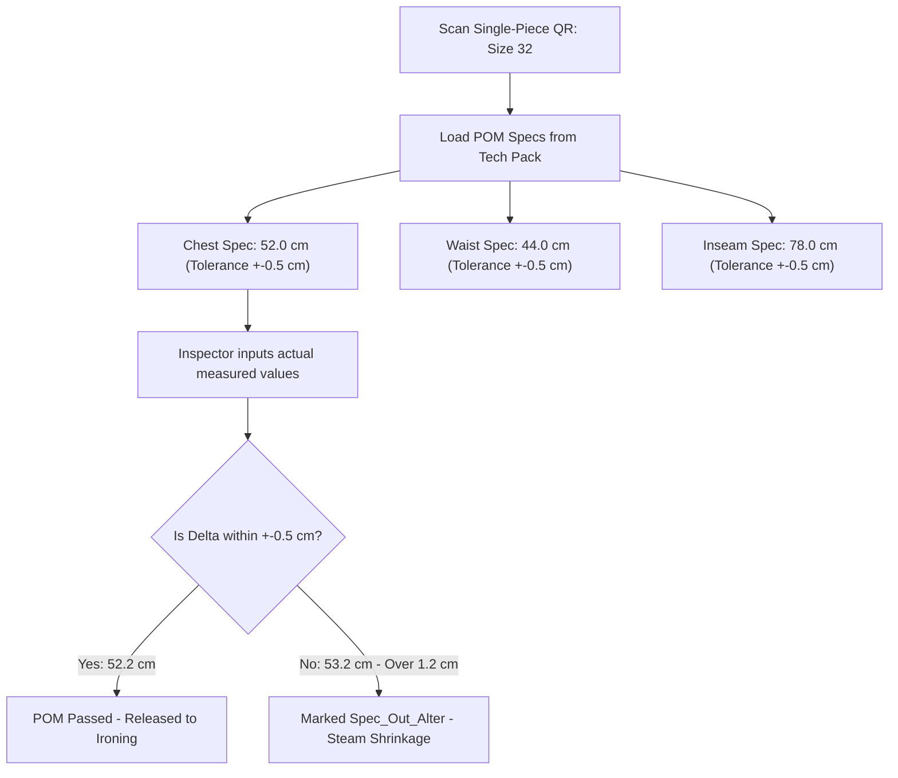
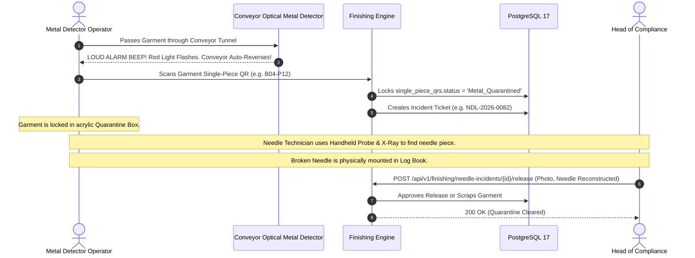
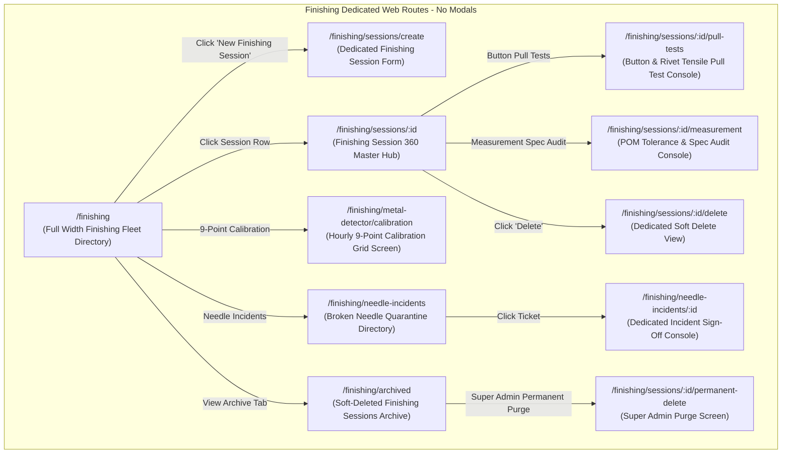
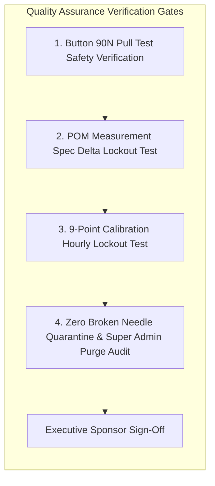

# Software Requirements Specification (SRS)
## Module 12: Garment Finishing Engine
### প্রজেক্ট: TraceFlow RMG — Precision Fabric-to-Freight Garment Intelligence
**ডকুমেন্ট রেফারেন্স:** `TFRMG-SRS-MOD12-V2.0`  
**ডকুমেন্ট ভার্সন:** 2.0 (Global Tier-1 Enterprise Production Edition — Consumer Safety & Aesthetic Refinement)  
**স্ট্যান্ডার্ড কমপ্লায়েন্স:** ISO/IEC/IEEE 29148:2018, CPSIA / EN 71 Children's Apparel Safety, Confection Metal Detection 9-Point Calibration Standards  
**স্ট্যাটাস:** Approved & Production-Ready  
**টার্গেট আর্কিটেকচার:** Laravel 13 (Calibration & Measurement Audit Engine) + React 19 / Vite (Dedicated Finishing Floor SPA) + PostgreSQL 17 + Redis 7  

---

## ১. ডকুমেন্ট গভর্নেন্স ও সংস্করণ নিয়ন্ত্রণ (Document Governance & Control)

### ১.১ সংস্করণ ইতিহাস (Revision History)
| ভার্সন | তারিখ | পর্যালোচনাকারী | পরিবর্তনের বিবরণ ও পরিধি |
|---|---|---|---|
| `v1.0` | 2026-09-02 | Lead Business Analyst | ফিনিশিং ও ওয়াশিং সমন্বিত প্রাথমিক ড্রাফট। |
| `v2.0` | 2026-09-02 | Principal Enterprise Architect | **স্বতন্ত্র ফিনিশিং মডিউল হিসেবে রূপান্তর (Dedicated Finishing Engine):** থ্রেড সাকশন ও ট্রিমিং, বাটন/রিভেট পুল টেস্ট (৯০ নিউটন সেফটি স্ট্যান্ডার্ড), স্টিম প্রেসিং ও টানেল আয়রনিং, ডিজিটাল মেজারমেন্ট স্পেক অডিট (POM Tolerance Check), কনভেয়ার মেটাল ও ব্রোকেন নিডেল ডিটেকশন ৯-পয়েন্ট ক্যালিব্রেশন ও কোয়ারেন্টাইন লকআউট গেট, টু-টিয়ার ডিলিশন গভর্নেন্স (Super Admin Hard Delete Guard), কমপ্লিট PostgreSQL 17 DDL এবং RTM সংযোজন। |

### ১.২ অনুমোদনকারী ব্যক্তিবর্গ (Sign-Off & Approvals)
- **Executive Sponsor / Project Owner:** Executive Sponsor, RMG Systems
- **Lead Solution Architect:** AI Solution Architect
- **Head of Finishing & Value Refinement:** Garment Finishing & Pressing Division
- **Head of Consumer Product Safety:** Metal Detection & Child Safety Compliance
- **General Manager (Factory Operations):** Manufacturing Plant Operations

---

## ২. নির্বাহী সারসংক্ষেপ ও কৌশলগত উদ্দেশ্য (Executive Summary & Strategic Scope)

### ২.১ কৌশলগত প্রেক্ষাপট (Strategic Context)
গার্মেন্টস শিল্পে সেলাই ও ওয়াশিং সম্পন্ন হওয়ার পর ফিনিশিং ফ্লোর (Finishing Floor) হলো পোশাকের চূড়ান্ত রূপ ও সৌন্দর্য নির্ধারণের স্থান। এখানেই অতিরিক্ত সুতা কেটে পরিষ্কার করা হয়, বোতাম লাগানো ও বাটন পুল টেস্ট করা হয়, স্টিম আয়রনের মাধ্যমে নিখুঁত শেপ দেওয়া হয়, বায়ারের সাইজ মেজারমেন্ট চার্ট মিলানো হয়, এবং অত্যন্ত সংবেদনশীল **মেটাল ও ব্রোকেন নিডেল ডিটেকশন টেস্ট** করা হয়।

ফিনিশিং ফ্লোরে কঠোর ট্রেসিবিলিটি কন্ট্রোল না থাকলে কারখানায় যেসব বিপর্যয় ঘটে:
1. **Broken Needle Lawsuit (ভাঙা সুঁচের মামলা):** তৈরি পোশাকে ভাঙা সুঁচের টুকরো থেকে গেলে তা বিদেশে ক্রেতার শরীরে বিঁধে কোটি টাকার আন্তর্জাতিক মামলা ও ব্র্যান্ড কর্তৃক ফ্যাক্টরি সারাজীবনের জন্য ব্ল্যাকলিস্ট হতে পারে।
2. **Button Choking Hazard (বাচ্চাদের শ্বাসরোধ ঝুঁকি):** শিশুদের কাপড়ের বোতাম বা স্ন্যাপ বাটন ৯-১০ কেজি (90N) টান সহ্য করতে না পারলে শিশু বোতাম গিলে শ্বাসরোধে মৃত্যুর মারাত্মক ঝুঁকিতে পড়ে (CPSIA Violation)।
3. **Out-of-Tolerance Measurement Returns:** বায়ারের সাইজ চার্টের চেয়ে ১ সেমি ছোট বা বড় হলে পুরো লটের কাপড় বায়ার রিসিভ না করে ফেরত পাঠায়।

**Module 12: Garment Finishing Engine** এর দর্শন হলো:
> **"Zero Broken Needle Tolerance, Child-Safe Tensile Integrity, Millimeter Measurement Precision."**

```mermaid
graph TB
    subgraph Finishing Lifecycle Engine (Module 12)
        direction TB
        GARMENT_IN[Garment arrives from Sewing Mod 09 or Wash Mod 11] --> TRIMMING[Thread Trimming & De-linting Vacuum Station]
        TRIMMING --> BUTTON_PULL[Button & Rivet Tensile Pull Test - 90N / 20 lbs]
        BUTTON_PULL --> STEAM_PRESS[Tunnel Ironing & Vacuum Steam Form Finishers]
        
        STEAM_PRESS --> MEASURE_AUDIT{Point of Measurement - POM Tolerance Audit}
        MEASURE_AUDIT -->|Within Spec +-0.5cm| METAL_CONVEYOR[9-Point Calibrated Conveyor Metal Detector]
        MEASURE_AUDIT -->|Out of Spec| STEAM_ALTER[Steam Re-shaping or Reject]
        
        METAL_CONVEYOR --> METAL_GATE{Metal Sensor Triggered?}
        METAL_GATE -->|Triggered Alarm!| QUARANTINE[Conveyor Auto-Reverse -> Locked Acrylic Quarantine Box]
        QUARANTINE --> INCIDENT_LOG[Broken Needle Incident Log & X-Ray Search Mandate]
        
        METAL_GATE -->|Clean - No Metal| PASS_PACK[Marked 'Finishing_Passed' -> Module 13 Final Packing]
    end
```

---

## ৩. অলঙ্ঘনীয় এন্টারপ্রাইজ আর্কিটেকচারাল নিয়মাবলি (Non-Negotiable Architecture Directives)

প্রজেক্টের গ্লোবাল রুলস এবং এন্টারপ্রাইজ কোয়ালিটি নিশ্চিত করতে নিচের নিয়মগুলো ১০০% অলঙ্ঘনীয়:

### ৩.১ নো মোডালস নীতিমালা (STRICT No Modals / No Popups Rule)
- **জিরো মোডাল পলিসি:** পুরো ফিনিশিং মডিউলে কোনো ফর্ম, কনফার্মেশন, মেজারমেন্ট এডিটর, মেটাল ডিটেকশন লগ, ব্রোকেন নিডেল ইনসিডেন্ট ফর্ম, বা সাব-স্ক্রিনের জন্য `Modal`, `Dialog`, `Popup`, `Lightbox`, বা `Drawer-over-backdrop` কঠোরভাবে নিষিদ্ধ।
- **ডেডিকেটেড রুট আর্কিটেকচার:** ফিনিশিং সেশন ডিরেক্টরি, বাটন পুল টেস্ট ওয়ার্কস্পেস, মেজারমেন্ট স্পেক অডিট পেজ, ৯-পয়েন্ট মেটাল ডিটেক্টর ক্যালিব্রেশন শিট, ব্রোকেন নিডেল ইনসিডেন্ট রেজিস্টার, এবং ডিলিট কনফার্মেশন—প্রতিটি ইন্টারঅ্যাকশন একটি সুনির্দিষ্ট ব্রাউজার ইউআরএল এবং ডেডিকেটেড ফুল-স্ক্রিন ভিউতে (Full-Screen Dedicated View) লোড হবে।
- **নেভিগেশন স্ট্যাক:** প্রতিটি পেজে স্ট্যান্ডার্ড ব্যাক বাটন এবং স্ট্রাকচার্ড ব্রেডক্রাম্ব (`Dashboard > Finishing > Session-08 > Broken Needle Incident Console`) থাকতে হবে যাতে ব্রাউজারের নেটিভ Forward/Back বাটন স্বাভাবিকভাবে কাজ করে এবং ডিপ-লিংক শেয়ারিং সম্ভব হয়।

### ৩.২ পিউর সার্ভার-সাইড ভ্যালিডেশন স্ট্যান্ডার্ড (Pure Server-Side Validation)
- **জিরো ক্লায়েন্ট-সাইড HTML5 ভ্যালিডেশন:** ফ্রন্টএন্ডের কোনো `<form>` বা `<input>` ফিল্ডে ব্রাউজারের ডিফল্ট HTML5 ভ্যালিডেশন অ্যাট্রিবিউট (`required`, `minlength`, `maxlength`, `pattern`, ইত্যাদি) দেওয়া যাবে না। ব্রাউজারের বিল্ট-ইন টুলটিপ পপআপ সম্পূর্ণ নিষিদ্ধ।
- **বাধ্যতামূলক `noValidate`:** সমস্ত ফ্রন্টএন্ড ফর্মে `<form noValidate>` স্পষ্টভাবে যুক্ত থাকতে হবে।
- **একীভূত এরর কন্ট্রাক্ট:** সমস্ত টলারেন্স চেক, বাটন নিউটন ফোর্স এবং মেটাল টেস্ট ভ্যালিডেশন ব্যাকএন্ড Laravel `FormRequest` ক্লাসের মাধ্যমে পিউর সার্ভার সাইডে ঘটবে। ইনপুট ভুল হলে সার্ভার থেকে `422 Unprocessable Content` স্ট্যান্ডার্ড RFC 7807 কমপ্লায়েন্ট JSON এরর পাঠানো হবে।
- **ইনলাইন এরর রেন্ডারিং:** ফ্রন্টএন্ড স্বয়ংক্রিয়ভাবে রেসপন্সের ফিল্ড নেম ম্যাপ করে সংশ্লিষ্ট ইনপুট বক্সের ঠিক নিচে ক্রিস্প লাল রঙে এরর বার্তা রেন্ডার করবে।

### ৩.৩ ফ্ল্যাট এবং ক্রিস্প ডিজাইন স্ট্যান্ডার্ড (Flat Solid UI Standard)
- **নো গ্রেডিয়েন্ট পলিসি:** কোনো বাটন, কার্ড, হেডার বা সাইডবারে কোনো ধরণের গ্রেডিয়েন্ট কালার ব্যবহার করা যাবে না।
- **সলিড ডিজাইন টোকেনস:** সকল অ্যাকশন বাটন ক্রিস্প ও ফ্ল্যাট সলিড রঙে গঠিত হবে (যেমন: Primary `#2563EB`, Danger `#DC2626`, Success `#16A34A`, Neutral `#475569`, Warning `#D97706`)।
- **১০০% ইংরেজি ইউআই:** ইউজার ইন্টারফেসের সমস্ত লেবেল, ফিল্ড নেম, কলাম হেডার, অ্যাকশন বাটন এবং সিস্টেম নোটিফিকেশন ১০০% প্রফেশনাল আন্তর্জাতিক ইংরেজি ভাষায় (English) হবে।

### ৩.৪ দ্বি-স্তরবিশিষ্ট ডিলিশন গভর্নেন্স (Two-Tier Deletion Architecture)
- **সফট ডিলিট (Soft Delete):** ফিনিশিং ম্যানেজার শুধুমাত্র সেই টেস্ট বা ড্রাফট সেশন সফট ডিলিট করতে পারবেন যার কোনো পোশাক মেটাল ডিটেকশন পার হয়ে কার্টনে যায়নি (`deleted_at = NOW()`)।
- **পার্মানেন্ট হার্ড ডিলিট (STRICT Super Admin Only):** ডাটাবেস থেকে স্থায়ীভাবে রো মুছে ফেলার ক্ষমতা **কেবলমাত্র `Super Admin` এর থাকবে**।
- **প্রোডাকশন ও সেফটি রেফারেনশিয়াল প্রোটেকশন গার্ড (Referential Check):** যদি কোনো ফিনিশিং হওয়া পোশাক অলরেডি কার্টনে প্যাক (Module 13) বা কমার্শিয়াল শিপমেন্টে (Module 15) প্রবেশ করে থাকে, তবে সিস্টেম পার্মানেন্ট ডিলিট **সম্পূর্ণ ব্লক** করবে এবং `409 Conflict` রিটার্ন করবে।

---

## ৪. ইউজার পারসোনা ও এক্সেস হায়ারার্কি (User Personas & Scoping)

| পারসোনা (Persona) | ইন্টারফেস ও ডিভাইস | প্রমাণীকরণ মাধ্যম (Auth Method) | প্রিভিলেজ বাউন্ডারি (Privilege Scope) |
|---|---|---|---|
| **Finishing Manager / In-Charge** | Web Browser (Desktop) | Emp ID / Username + Password | ফিনিশিং সেশন শিডিউল, মেজারমেন্ট অডিট অনুমোদন, সফট ডিলিট। |
| **Pull Test Operator** | Floor Tablet / Digital Gauge | Emp ID / Username + Password | বাটন ও রিভেট টেনসাইল পুল টেস্ট (৯০ নিউটন) ডাটা লগিং। |
| **Measurement Inspector** | Floor Tablet / Touch Screen | Emp ID / Username + Password | সাইজ স্পেক টেপ মেজারমেন্ট ইনপুট, টলারেন্স ডেল্টা ভ্যালিডেশন। |
| **Metal Detector Operator** | Industrial Kiosk / Tablet | Hardware Paired Machine Token | ৯-পয়েন্ট টেস্ট ক্যালিব্রেশন, কনভেয়ার স্ক্যান, ব্রোকেন নিডেল রিপোর্ট। |
| **Safety & Compliance Head** | Web Browser (Desktop) | Emp ID / Username + Password | ব্রোকেন নিডেল কোয়ারেন্টাইন রিলিজ অনুমোদন, বায়ার সেফটি অডিট। |
| **Super Admin** | Web Browser (Desktop) | Username + Password + TOTP 2FA | গ্লোবাল বাইপাস, সেফটি লকআউট ট্রাবলশুট, পার্মানেন্ট পার্জ। |

---

## ৫. বিস্তারিত ফাংশনাল রিকোয়ারমেন্টস (Detailed Functional Specifications)

### ৫.১ সাব-মডিউল: বাটন ও রিভেট পুল টেস্ট সেফটি অডিট (Button Pull Test Engine)

শিশুদের পোশাক এবং আন্তর্জাতিক পোশাক নিরাপত্তার জন্য বোতামের দৃঢ়তা পরীক্ষা।

#### ৫.১.১ স্পেসিফিকেশন ও সেফটি রুলস
- **REQ-FIN-PUL-001 (90 Newton / 20 lbs Tensile Force Mandate):**
  - আন্তর্জাতিক ASTM D4846 / CPSIA কমপ্লায়েন্স অনুযায়ী প্রতিটি কালার ও সাইজ থেকে নির্ধারিত সংখ্যক স্যাম্পল পোশাকে ডিজিটাল পুল গেজ দিয়ে টেস্ট করতে হবে।
  - টেস্টের শর্ত: বোতামের ওপর **৯০ নিউটন (বা ২০.২ পাউন্ড) টানটান বল একটানা ১০ সেকেন্ড** প্রয়োগ করতে হবে।
  - যদি বোতাম ছুটে যায় বা কাপড় ছিঁড়ে যায়, তবে ফলাফল হবে `Failed` এবং তাৎক্ষণিকভাবে বাটনিং মেশিনের সেটিং পরিবর্তনের জন্য টেকনিশিয়ানকে অ্যালার্ট দেওয়া হবে।

---

### ৫.২ সাব-মডিউল: ডিজিটাল পিওএম মেজারমেন্ট অডিট (Point of Measurement Audit)

পোশাকের প্রতিটি অংশের মাপ বায়ারের টেক প্যাক সাইজ চার্টের সাথে মিলানো।



#### ৫.২.১ স্পেসিফিকেশন ও টলারেন্স ডেল্টা
- **REQ-FIN-POM-001 (Tech Pack Linked Tolerance Gate):**
  - সিস্টেম সরাসরি Module 02/03 থেকে বায়ারের সাইজ অনুযায়ী পয়েন্ট অব মেজারমেন্ট (POM: Chest, Waist, Inseam, Body Length) লোড করবে।
  - অনুমোদিত টলারেন্স (Tolerance: e.g. $\pm 0.5 \text{ cm}$)।
- **REQ-FIN-POM-002 (Real-Time Delta Calculation & Lockout):**
  - পরিদর্শক যখন ফিতা দিয়ে মেপে প্রকৃত মান ইনপুট দেবেন, সিস্টেম স্বয়ংক্রিয়ভাবে $\Delta = \text{Actual} - \text{Spec}$ বের করবে।
  - টলারেন্সের বাইরে গেলে সিস্টেম কাপড়টিকে `Spec_Out_Alter` হিসেবে চিহ্নিত করবে এবং স্টিম প্রেসিং দ্বারা সাইজ অ্যাডজাস্টমেন্টের জন্য পাঠাবে।

---

### ৫.৩ সাব-মডিউল: কনভেয়ার মেটাল ডিটেক্টর ৯-পয়েন্ট ক্যালিব্রেশন (9-Point Calibration Engine)

মেটাল ডিটেক্টর মেশিনটি সঠিকভাবে ১.০ মিমি বা ১.২ মিমি লোহার টুকরো ধরতে পারছে কি না তা নিয়মিত যাচাই।

#### ৫.৩.১ স্পেসিফিকেশন ও ক্যালিব্রেশন রুলস
- **REQ-FIN-CAL-001 (Mandatory Hourly 9-Point Calibration Grid):**
  - মেটাল ডিটেক্টর কনভেয়ার বেল্টের অ্যাপারচারকে ৩×৩ গ্রিডে ভাগ করে ৯টি বিন্দুতে টেস্ট করতে হবে:
    - *Top Lane:* Left, Center, Right
    - *Middle Lane:* Left, Center, Right
    - *Bottom Lane:* Left, Center, Right
  - প্রতি ১ ঘণ্টা পর পর ৯টি পয়েন্টেই ১.০ মিমি ফেরাস (Ferrous) টেস্ট কার্ড দিয়ে অ্যালার্ম ট্রিগার নিশ্চিত করতে হবে।
- **REQ-FIN-CAL-002 (Automated Hourly Scan Lockout):**
  - যদি গত ৬০ মিনিটের মধ্যে কোনো সফল ৯-পয়েন্ট ক্যালিব্রেশন শিট সিস্টেমে সাবমিট না থাকে, তবে সিস্টেম স্বয়ংক্রিয়ভাবে মেটাল ডিটেকশন স্ক্যানিং **লক** করে দেবে। ক্যালিব্রেশন ছাড়া পোশাক স্ক্যান করা যাবে না।

---

### ৫.৪ সাব-মডিউল: ব্রোকেন নিডেল ইনসিডেন্ট ও কোয়ারেন্টাইন লকআউট গেট (Zero Broken Needle Law)

TraceFlow RMG প্ল্যাটফর্মে এটি একটি সর্বোচ্চ অগ্রাধিকারপ্রাপ্ত সেফটি কমপ্লায়েন্স ইঞ্জিন।



#### ৫.৪.১ স্পেসিফিকেশন ও সেফটি প্রোটোকল
- **REQ-FIN-MD-001 (Zero Broken Needle Packing Lockout Gate):**
  - কোনো পোশাক কখনোই প্যাকিং সেকশনে (Module 13) কার্টনে ঢোকানো যাবে না যদি না উক্ত পোশাকের চাইল্ড কিউআরের বিপরীতে সফল **`Metal_Detected_Pass`** স্ট্যাটাস এবং টাইমস্ট্যাম্প ডাটাবেসে নিবন্ধিত থাকে।
- **REQ-FIN-MD-002 (Auto-Reverse & Quarantine Box Isolation):**
  - কনভেয়ার বেল্টে মেটাল সংকেত পাওয়া মাত্রই বেল্ট স্বয়ংক্রিয়ভাবে পেছনে ফিরে আসবে (Auto-Reverse)।
  - অপারেটর কাপড়টি স্ক্যান করলে পোশাকটি তাৎক্ষণিকভাবে `Metal_Quarantined` স্ট্যাটাসে লক হবে এবং একটি লকড এক্রিলিক কোয়ারেন্টাইন বক্সে জমা করা হবে।
- **REQ-FIN-MD-003 (Needle Reconstruction & Sign-Off Workflow):**
  - ভাঙা সুঁচের টুকরো খুঁজে বের করে ভাঙা সম্পূর্ণ সুঁচটি ফিজিক্যাল নিডেল লগবুকে আঠা দিয়ে জোড়া লাগিয়ে মাউন্ট করতে হবে।
  - হ্যান্ডহেল্ড মেটাল প্রোব ও এক্স-রে মেশিনের রিপোর্ট এবং মাউন্ট করা সুঁচের ছবি সিস্টেমে আপলোড করে **হেড অব কোয়ালিটি ও কমপ্লায়েন্স ম্যানেজারের যৌথ অনুমোদন ছাড়া** কোয়ারেন্টাইন লক খোলা যাবে না।

---

## ৬. প্রোডাকশন-গ্রেড ডাটাবেস আর্কিটেকচার ও DDL (Database Engineering)

নিচে PostgreSQL 17 এর জন্য সম্পূর্ণ প্রোডাকশন-রেডি DDL স্ক্রিপ্ট দেওয়া হলো। এতে ফিনিশিং সেশন, বাটন পুল টেস্ট, মেজারমেন্ট অডিট, মেটাল ডিটেক্টর ক্যালিব্রেশন এবং ব্রোকেন নিডেল ইনসিডেন্টের টেবিলসমূহ অন্তর্ভুক্ত রয়েছে।

### ৬.১ PostgreSQL 17 Production Schema (Complete DDL)

```sql
-- Enable Cryptographic Extension for UUID v4
CREATE EXTENSION IF NOT EXISTS "pgcrypto";

-- ----------------------------------------------------------------------
-- 1. Table: finishing_sessions (Daily Finishing Line Operations)
-- ----------------------------------------------------------------------
CREATE TABLE finishing_sessions (
    id UUID PRIMARY KEY DEFAULT gen_random_uuid(),
    session_no VARCHAR(60) NOT NULL,              -- e.g. FIN-2026-0089
    po_id UUID NOT NULL REFERENCES purchase_orders(id) ON DELETE RESTRICT,
    finishing_floor VARCHAR(40) NOT NULL,         -- Floor_3_Finishing, Unit_2_Finishing
    total_received_pieces INTEGER NOT NULL DEFAULT 0,
    total_passed_pieces INTEGER NOT NULL DEFAULT 0,
    total_altered_pieces INTEGER NOT NULL DEFAULT 0,
    total_rejected_pieces INTEGER NOT NULL DEFAULT 0,
    status VARCHAR(30) NOT NULL DEFAULT 'Active', -- Active, Completed, Closed
    supervisor_id UUID REFERENCES users(id) ON DELETE SET NULL,
    created_at TIMESTAMPTZ NOT NULL DEFAULT CURRENT_TIMESTAMP,
    updated_at TIMESTAMPTZ NOT NULL DEFAULT CURRENT_TIMESTAMP,
    deleted_at TIMESTAMPTZ
);

CREATE UNIQUE INDEX uq_finishing_session_no ON finishing_sessions (UPPER(session_no)) WHERE deleted_at IS NULL;
CREATE INDEX idx_finishing_sessions_po_id ON finishing_sessions (po_id);
CREATE INDEX idx_finishing_sessions_status ON finishing_sessions (status);

-- ----------------------------------------------------------------------
-- 2. Table: button_pull_tests (ASTM D4846 / CPSIA 90N Tensile Safety)
-- ----------------------------------------------------------------------
CREATE TABLE button_pull_tests (
    id UUID PRIMARY KEY DEFAULT gen_random_uuid(),
    session_id UUID NOT NULL REFERENCES finishing_sessions(id) ON DELETE CASCADE,
    single_piece_qr_id UUID NOT NULL REFERENCES single_piece_qrs(id) ON DELETE RESTRICT,
    button_location VARCHAR(60) NOT NULL,         -- Center_Front_Top, Left_Cuff, Pocket_Flap
    applied_force_newtons NUMERIC(5, 2) NOT NULL CHECK (applied_force_newtons > 0),
    holding_time_seconds SMALLINT NOT NULL DEFAULT 10,
    test_result VARCHAR(20) NOT NULL,             -- Passed, Failed
    failure_mode VARCHAR(60),                     -- Button_Detached, Fabric_Torn, Shank_Broken
    operator_id UUID NOT NULL REFERENCES users(id) ON DELETE RESTRICT,
    tested_at TIMESTAMPTZ NOT NULL DEFAULT CURRENT_TIMESTAMP
);

CREATE INDEX idx_button_pull_session ON button_pull_tests (session_id);
CREATE INDEX idx_button_pull_piece ON button_pull_tests (single_piece_qr_id);

-- ----------------------------------------------------------------------
-- 3. Table: finishing_measurement_audits (POM Tolerance Checking)
-- ----------------------------------------------------------------------
CREATE TABLE finishing_measurement_audits (
    id UUID PRIMARY KEY DEFAULT gen_random_uuid(),
    session_id UUID NOT NULL REFERENCES finishing_sessions(id) ON DELETE CASCADE,
    single_piece_qr_id UUID NOT NULL REFERENCES single_piece_qrs(id) ON DELETE RESTRICT,
    size_id UUID NOT NULL REFERENCES sizes(id) ON DELETE RESTRICT,
    point_of_measurement VARCHAR(80) NOT NULL,    -- Chest_Width, Waist_Width, Body_Length, Inseam
    techpack_spec_cm NUMERIC(5, 2) NOT NULL CHECK (techpack_spec_cm > 0),
    actual_measured_cm NUMERIC(5, 2) NOT NULL CHECK (actual_measured_cm > 0),
    tolerance_allowed_cm NUMERIC(4, 2) NOT NULL DEFAULT 0.50,
    deviation_cm NUMERIC(5, 2) GENERATED ALWAYS AS (actual_measured_cm - techpack_spec_cm) STORED,
    verdict VARCHAR(20) NOT NULL,                 -- Spec_Pass, Spec_Out_Alter, Spec_Out_Reject
    auditor_id UUID NOT NULL REFERENCES users(id) ON DELETE RESTRICT,
    audited_at TIMESTAMPTZ NOT NULL DEFAULT CURRENT_TIMESTAMP
);

CREATE INDEX idx_measurement_session ON finishing_measurement_audits (session_id);
CREATE INDEX idx_measurement_piece ON finishing_measurement_audits (single_piece_qr_id);

-- ----------------------------------------------------------------------
-- 4. Table: metal_detector_calibrations (Hourly 9-Point Grid Calibration)
-- ----------------------------------------------------------------------
CREATE TABLE metal_detector_calibrations (
    id UUID PRIMARY KEY DEFAULT gen_random_uuid(),
    machine_code VARCHAR(40) NOT NULL,            -- MD-CONVEYOR-01
    calibration_hour SMALLINT NOT NULL CHECK (calibration_hour >= 1 AND calibration_hour <= 24),
    test_sphere_diameter_mm NUMERIC(3, 1) NOT NULL DEFAULT 1.0, -- 1.0mm or 1.2mm Ferrous
    top_left_passed BOOLEAN NOT NULL,
    top_center_passed BOOLEAN NOT NULL,
    top_right_passed BOOLEAN NOT NULL,
    mid_left_passed BOOLEAN NOT NULL,
    mid_center_passed BOOLEAN NOT NULL,
    mid_right_passed BOOLEAN NOT NULL,
    bot_left_passed BOOLEAN NOT NULL,
    bot_center_passed BOOLEAN NOT NULL,
    bot_right_passed BOOLEAN NOT NULL,
    overall_calibration_passed BOOLEAN NOT NULL,
    calibrated_by UUID NOT NULL REFERENCES users(id) ON DELETE RESTRICT,
    calibrated_at TIMESTAMPTZ NOT NULL DEFAULT CURRENT_TIMESTAMP
);

CREATE INDEX idx_metal_calib_time ON metal_detector_calibrations (calibrated_at);

-- ----------------------------------------------------------------------
-- 5. Table: needle_incident_logs (Broken Needle Quarantine & Sign-Off)
-- ----------------------------------------------------------------------
CREATE TABLE needle_incident_logs (
    id UUID PRIMARY KEY DEFAULT gen_random_uuid(),
    incident_ticket_no VARCHAR(60) NOT NULL,      -- e.g. NDL-2026-0082
    single_piece_qr_id UUID NOT NULL REFERENCES single_piece_qrs(id) ON DELETE RESTRICT,
    machine_code VARCHAR(40) NOT NULL,
    quarantine_status VARCHAR(30) NOT NULL DEFAULT 'Quarantined', -- Quarantined, Fragment_Found, Scrapped, Cleared
    xray_inspection_done BOOLEAN NOT NULL DEFAULT FALSE,
    fragment_mounted_photo_s3_key VARCHAR(500),
    needle_type VARCHAR(60),                      -- DBx1 Size 11, DPx5 Size 14
    sewing_machine_operator_emp_id UUID REFERENCES users(id) ON DELETE SET NULL,
    resolved_by_compliance_head UUID REFERENCES users(id) ON DELETE SET NULL,
    resolution_timestamp TIMESTAMPTZ,
    remarks TEXT,
    created_at TIMESTAMPTZ NOT NULL DEFAULT CURRENT_TIMESTAMP,
    updated_at TIMESTAMPTZ NOT NULL DEFAULT CURRENT_TIMESTAMP
);

CREATE UNIQUE INDEX uq_needle_incident_no ON needle_incident_logs (UPPER(incident_ticket_no));
CREATE INDEX idx_needle_incident_piece ON needle_incident_logs (single_piece_qr_id);
CREATE INDEX idx_needle_incident_status ON needle_incident_logs (quarantine_status);
```

---

## ৭. সম্পূর্ণ এপিআই কন্ট্রাক্ট স্পেসিফিকেশন (Exhaustive API Contracts)

### ৭.১ সাধারণ আর্কিটেকচার ও স্ট্যান্ডার্ডস
- **অথেনটিকেশন:** `Authorization: Bearer <sanctum_token>`
- **কমন হেডার্স:** `Accept: application/json`, `Content-Type: application/json`
- **স্ট্যান্ডার্ড ফিল্টারিং:**
  `GET /api/v1/finishing/sessions?page=1&per_page=20&status=Active`

---

### ৭.২ বাটন পুল টেস্ট ও মেজারমেন্ট এন্ডপয়েন্টস

#### ৭.২.১ বাটন পুল টেস্ট রেজাল্ট সাবমিশন (ASTM 90N Safety Test)
- **মেথড ও ইউআরএল:** `POST /api/v1/finishing/pull-tests`
- **রিকোয়েস্ট বডি:**
  ```json
  {
    "session_id": "s100a982-192a-4f90-8800-291740011283",
    "single_piece_qr_id": "a98df23e-6b12-4211-9a7c-87d46c0e5a99",
    "button_location": "Center_Front_Top",
    "applied_force_newtons": 94.50,
    "holding_time_seconds": 10,
    "test_result": "Passed"
  }
  ```
- **সাকসেস রেসপন্স (`201 Created`):**
  ```json
  {
    "success": true,
    "status_code": 201,
    "message": "Button tensile safety test passed (94.5N held for 10s). CPSIA compliant.",
    "data": {
      "pull_test_id": "p800a982-192a-4f90-8800-291740011283",
      "test_result": "Passed"
    }
  }
  ```

---

#### ৭.২.২ পিওএম মেজারমেন্ট অডিট সাবমিশন (POM Tolerance Check)
- **মেথড ও ইউআরএল:** `POST /api/v1/finishing/measurement-audits`
- **রিকোয়েস্ট বডি:**
  ```json
  {
    "session_id": "s100a982-192a-4f90-8800-291740011283",
    "single_piece_qr_id": "a98df23e-6b12-4211-9a7c-87d46c0e5a99",
    "size_id": "z100a982-192a-4f90-8800-291740011283",
    "point_of_measurement": "Chest_Width",
    "techpack_spec_cm": 52.00,
    "actual_measured_cm": 52.20,
    "tolerance_allowed_cm": 0.50
  }
  ```
- **সাকসেস রেসপন্স (`201 Created`):**
  ```json
  {
    "success": true,
    "status_code": 201,
    "message": "Measurement deviation (+0.20 cm) is within allowed tolerance (+-0.50 cm). Spec_Pass.",
    "data": {
      "deviation_cm": 0.20,
      "verdict": "Spec_Pass"
    }
  }
  ```

---

### ৭.৩ মেটাল ডিটেক্টর ও ব্রোকেন নিডেল ইনসিডেন্ট এন্ডপয়েন্ট

#### ৭.৩.১ ব্রোকেন নিডেল ডিটেকশন ও কোয়ারেন্টাইন লকআউট
- **মেথড ও ইউআরএল:** `POST /api/v1/finishing/needle-incidents`
- **রিকোয়েস্ট বডি:**
  ```json
  {
    "single_piece_qr_id": "a98df23e-6b12-4211-9a7c-87d46c0e5a99",
    "machine_code": "MD-CONVEYOR-01",
    "needle_type": "DBx1 Size 11",
    "remarks": "Conveyor alarmed and auto-reversed. Suspected broken tip in right pocket flap."
  }
  ```
- **সাকসেস রেসপন্স (`201 Created` — Garment Locked):**
  ```json
  {
    "success": true,
    "status_code": 201,
    "message": "CRITICAL: Garment locked into Metal_Quarantined. Conveyor stopped. Compliance Head approval required.",
    "data": {
      "incident_ticket_no": "NDL-2026-0082",
      "quarantine_status": "Quarantined",
      "packing_blocked": true
    }
  }
  ```

---

### ৭.৪ ফিনিশিং ডিলিশন এন্ডপয়েন্টস (Two-Tier Deletion Architecture)

#### ৭.৪.১ ফিনিশিং সেশন সফট ডিলিট (Soft Delete Session)
- **মেথড ও ইউআরএল:** `DELETE /api/v1/finishing/sessions/{id}`
- **পারমিশন:** `finishing.sessions.delete`
- **শর্ত:** শুধুমাত্র যদি কোনো পোশাক মেটাল ডিটেকশন পাস করে কার্টনে প্যাক না হয়ে থাকে।
- **সাকসেস রেসপন্স (`200 OK`):**
  ```json
  {
    "success": true,
    "status_code": 200,
    "message": "Finishing session soft-deleted successfully and archived."
  }
  ```

#### ৭.৪.২ ফিনিশিং ডাটা পার্মানেন্ট ডিলিট (STRICT Super Admin Only Purge)
- **মেথড ও ইউআরএল:** `DELETE /api/v1/finishing/sessions/{id}/force-delete`
- **অথরাইজেশন:** **STRICTLY `Super Admin` ROLE ONLY**
- **রিকোয়েস্ট বডি:**
  ```json
  {
    "super_admin_password": "MySuperAdminSecretPassword#2026"
  }
  ```
- **পোশাক কার্টনে প্যাক হয়ে থাকলে ব্লকিং রেসপন্স (`409 Conflict`):**
  ```json
  {
    "success": false,
    "status_code": 409,
    "error_code": "CANNOT_PURGE_PACKED_GARMENT_SESSION",
    "message": "Cannot permanently purge this finishing session because garments have already passed metal detection and been scanned into Export Cartons (Module 13). Safety audit trail is locked."
  }
  ```

---

## ৮. ইউজার ইন্টারফেস ও স্ক্রিন-বাই-স্ক্রিন স্পেসিফিকেশন (STRICT NO MODALS)

ফিনিশিং ফ্লোরের প্রতিটি স্ক্রিন সম্পূর্ণ ডেডিকেটেড রুটে ওপেন হবে। কোনো মোডাল বা পপআপ ডায়ালগ উইথ ব্যাকড্রপ থাকবে না।



### ৮.১ স্ক্রিন স্পেসিফিকেশন টেবিল

| রুট (Route Path) | স্ক্রিনের নাম | মূল উপাদান ও কনফিগারেশন | নো-মোডাল ডিজাইন নিশ্চিতকরণ |
|---|---|---|---|
| `/finishing` | Finishing Operations Console | - ফুল-উইডথ ডাটা গ্রিড<br/>- কলাম: **Session No, PO No, Style, Floor, Received Pcs, Passed, Altered, Status, Actions**<br/>- সলিড ব্লু "Hourly 9-Point Calibration" বোতাম | পেজিনেশন ও অ্যাকশন সবকিছু ফুল পেজে পরিচালিত হবে। |
| `/finishing/sessions/create` | Dedicated Finishing Form | - `<form noValidate>` আর্কিটেকচার<br/>- বায়ার PO সিলেক্ট, ফ্লোর ড্রপডাউন, সুপারভাইজার<br/>- সলিড ব্লু "Start Finishing Session" বোতাম | সম্পূর্ণ আলাদা পেজ। ব্রেডক্রাম্ব নেভিগেশন সহ। |
| `/finishing/sessions/:id` | Finishing Session 360 Master Hub | - ফিনিশিং সেশনের সার্বিক বিবরণ ও প্রগ্রেস কার্ডস<br/>- বাটন পুল পাস ও মেজারমেন্ট পাস মিটার<br/>- সাব-ট্যাবস: Pull Tests, Measurement Audits, Metal Logs | ফুল-স্ক্রিন এন্টারপ্রাইজ ড্যাশবোর্ড ভিউ। |
| `/finishing/sessions/:id/pull-tests`| Button Pull Test Workspace | - ডিজিটাল গেজ ইনপুট ফর্ম (Force Newtons, Holding Seconds)<br/>- পাস/ফেল স্ট্যাটাস ইন্ডিকেটর (৯০ নিউটন লিমিট)<br/>- সলিড ব্লু "Record Pull Test" বোতাম | সম্পূর্ণ ডেডিকেটেড ওয়ার্কস্পেস পেজ। |
| `/finishing/sessions/:id/measurement`| POM Spec Audit Console | - বায়ার টেক প্যাক অনুযায়ী পয়েন্ট অব মেজারমেন্ট (POM) গ্রিড<br/>- একচুয়াল মেজারমেন্ট ইনপুট ও রিয়েল-টাইম ডেল্টা ক্যালকুলেটর<br/>- সলিড ব্লু "Submit POM Audit" বোতাম | সম্পূর্ণ ডেডিকেটেড মেজারমেন্ট অডিট পেজ। |
| `/finishing/metal-detector/calibration`| 9-Point Calibration Grid Screen| - ৩×৩ টাচ ইন্টারফেস (Top, Mid, Bot × Left, Center, Right)<br/>- ৯টি পয়েন্টের লাইভ টেস্ট চেকবক্স<br/>- সলিড গ্রিন "Submit 9-Point Calibration" বোতাম | সম্পূর্ণ আলাদা ফুল-স্ক্রিন ক্যালিব্রেশন পেজ। |
| `/finishing/needle-incidents` | Broken Needle Quarantine Hub | - কোয়ারেন্টাইন হওয়া পোশাকের তালিকা<br/>- স্ট্যাটাস ব্যাজ (Quarantined, Fragment Found, Cleared) | ডেডিকেটেড রেজিস্টার পেজ। |
| `/finishing/needle-incidents/:id`| Needle Incident Sign-Off View | - এক্স-রে রিপোর্ট ও ভাঙা সুঁচের মাউন্ট করা ছবির আপলোড ড্রপজোন<br/>- কোয়ালিটি হেড ও কমপ্লায়েন্স অফিসারের যৌথ সাইন-অফ বাটন | ফুল-স্ক্রিন সাইন-অফ কনসোল। |
| `/finishing/sessions/:id/delete` | Finishing Soft-Delete View | - অ্যাম্বার সতর্কবার্তা ব্যানার<br/>- সেশন সফট ডিলিটের নিয়মাবলি<br/>- সলিড অ্যাম্বার "Confirm Soft Delete" বোতাম | ডেডিকেটেড ফুল-স্ক্রিন কনফার্মেশন। নো পপআপ। |
| `/finishing/sessions/:id/permanent-delete`| Finishing Permanent Purge | - **Super Admin অনলি স্ক্রিন** (অন্যদের জন্য 403 Forbidden)<br/>- গাঢ় লাল অ্যালার্ট ব্যানার<br/>- সুপার অ্যাডমিন পাসওয়ার্ড ইনপুট ফিল্ড<br/>- কার্টন প্যাকিং ডাউনস্ট্রিম লকআউট ব্যাজ<br/>- সলিড ডার্ক-রেড "Purge Session Permanently" বোতাম | ফুল-স্ক্রিন হাইপার-সিকিউরড পার্জ ভিউ। |
| `/finishing/archived` | Soft-Deleted Sessions Archive | - সফট ডিলিট হওয়া সেশনসমূহের তালিকা<br/>- "Restore Session" বোতাম (`bg-amber-600`)<br/>- Super Admin এর জন্য "Purge Permanently" বোতাম | সম্পূর্ণ আলাদা আর্কাইভ পেজ। |

---

## ৯. নন-ফাংশনাল রিকোয়ারমেন্টস (Enterprise NFRs & SLAs)

### ৯.১ পারফরম্যান্স ও কনকারেন্সি বাজেট (Performance Budgets)
- **মেটাল ডিটেকশন কিউআর স্ক্যান লেটেন্সি:** সর্বোচ্চ **২০ মিলিসেকেন্ড (20ms)**।
- **পিওএম মেজারমেন্ট ডেল্টা অটো-ক্যালকুলেশন:** সর্বোচ্চ **১০ মিলিসেকেন্ড (10ms)**।
- **ব্রোকেন নিডেল কোয়ারেন্টাইন লকআউট ডিসপ্যাচ:** সর্বোচ্চ **১৫ মিলিসেকেন্ড (15ms)**।

### ৯.২ কনজিউমার সেফটি ও অডিট ট্রেইল (Zero Needle Escape Guarantee)
- মেটাল ডিটেকশন পাস না করে কোনো একক পোশাক কার্টনে স্ক্যান হওয়া সিস্টেম লেভেলে অসম্ভব (Hard DB Constraint)।

---

## ১০. ফেইলিওর মোড ও রেসপন্স অ্যানালাইসিস (FMEA Matrix)

| ফেইলিওর সিনারিও (Failure Mode) | সম্ভাব্য প্রভাব (Impact) | তীব্রতা (Severity) | সিস্টেমের স্বয়ংক্রিয় প্রতিরক্ষা মেকানিজম (Mitigation Mechanism) |
|---|---|---|---|
| মেটাল ডিটেক্টর বেল্ট নষ্ট থাকা সত্ত্বেও পোশাক পার করা | কাপড়ে ভাঙা সুঁচ থেকে গিয়ে বায়ার দেশে শিশুর শরীরে বিঁধে যাওয়া | Catastrophic | আওয়ারলি ৯-পয়েন্ট ক্যালিব্রেশন লকআউট সক্রিয় থাকবে। প্রতি ৬০ মিনিটে ক্যালিব্রেশন না থাকলে স্ক্যানিং স্বয়ংক্রিয়ভাবে লক হয়ে যাবে। |
| বাচ্চাদের কাপড়ের বোতাম টান দিলে সহজে খুলে যাওয়া | শিশু বোতাম গিলে শ্বাসরোধে মৃত্যুর মারাত্মক ঝুঁকি (CPSIA) | Critical | বাটন পুল টেস্ট গেট কার্যকর থাকবে। ৯০ নিউটন টান পরীক্ষায় ফেল করলে অবিলম্বে বাটনিং লাইন বন্ধের অ্যালার্ট যাবে। |
| মেজারমেন্ট স্পেক আউট কাপড় প্যাকিংয়ে চলে যাওয়া | বায়ারের গুদামে মাপ গরমিল হয়ে সম্পূর্ণ শিপমেন্ট বাতিল | Critical | ডিজিটাল POM অডিট গেট সক্রিয় থাকবে। স্পেক ডেল্টা টলারেন্স ($\pm 0.5\text{cm}$) পার হলে পোশাক স্টিম অল্টারে রি-রুট হবে। |
| কার্টনে প্যাক হওয়া ফিনিশিং সেশন ডিলিটের চেষ্টা | ভোক্তা নিরাপত্তা ও ট্রেসিবিলিটি অডিট লঙ্ঘন | Critical | ফরেন কি রেস্ট্রিক্ট গার্ড কার্যকর হবে। সিস্টেমে `409 Conflict` এসে পার্মানেন্ট ডিলিট অপারেশন স্থায়ীভাবে ব্লক করবে। |

---

## ১১. রিকোয়ারমেন্টস ট্রেসেবিলিটি ম্যাট্রিক্স (Requirements Traceability Matrix - RTM)

| রিকোয়ারমেন্ট আইডি | ডাটাবেস টেবিল | ব্যাকএন্ড এপিআই এন্ডপয়েন্ট | ফ্রন্টএন্ড ডেডিকেটেড রুট | QA টেস্ট কেস আইডি |
|---|---|---|---|---|
| `REQ-FIN-PUL-001` (90N Pull Test) | `button_pull_tests` | `POST /api/v1/finishing/pull-tests` | `/finishing/sessions/:id/pull-tests` | `TC-FIN-001` |
| `REQ-FIN-POM-001` (POM Tolerance Gate) | `finishing_measurement_audits` | `POST /api/v1/finishing/measurement-audits` | `/finishing/sessions/:id/measurement` | `TC-FIN-002` |
| `REQ-FIN-CAL-002` (Calibration Lockout)| `metal_detector_calibrations` | `POST /api/v1/finishing/calibrations` | `/finishing/metal-detector/calibration`| `TC-FIN-003` |
| `REQ-FIN-MD-001` (Zero Needle Packing) | `single_piece_qrs` | `POST /api/v1/packing/scan` (Module 13 Gate)| `/packing/scan` | `TC-FIN-004` |
| `REQ-FIN-MD-002` (Quarantine Protocol) | `needle_incident_logs` | `POST /api/v1/finishing/needle-incidents` | `/finishing/needle-incidents` | `TC-FIN-005` |
| `REQ-DEL-002` (Super Admin Hard Purge) | `finishing_sessions` | `DELETE /api/v1/finishing/sessions/{id}/force-delete` | `/finishing/sessions/:id/permanent-delete`| `TC-FIN-006` |

---

## ১২. কিউএ গ্রহণযোগ্যতার মানদণ্ড (Acceptance Criteria & Verification Plan)



### ১২.১ কোর টেস্ট কেসসমূহ (Core Test Execution Steps)

1. **`TC-FIN-001` (Button Pull Force 90 Newton Safety Verification):**
   - **ধাপ ১:** বাটন পুল গেজে ৮২ নিউটন টান দেওয়া হলো এবং বোতাম ছুটে গেল।
   - **প্রত্যাশিত ফলাফল:** সিস্টেম `test_result = 'Failed'` রেকর্ড করবে এবং স্ক্রিনে লাল সতর্কবার্তা দেবে: "Pull Test Failed: 82N is below mandatory 90N threshold."
   - **ধাপ ২:** অপর একটি বোতামে ৯৫ নিউটন টান দিয়ে ১০ সেকেন্ড ধরে রাখা হলো।
   - **প্রত্যাশিত ফলাফল:** সিস্টেম `test_result = 'Passed'` রেকর্ড করবে।
2. **`TC-FIN-002` (POM Measurement Spec Delta Lockout Test):**
   - **ধাপ:** Chest Spec = 52.0 cm, Tolerance = $\pm 0.5 \text{ cm}$। টেস্টে Actual Measured = 53.2 cm ইনপুট দেওয়া ($\Delta = +1.2 \text{ cm}$)।
   - **প্রত্যাশিত ফলাফল:** সিস্টেম পোশাকটিকে `Spec_Out_Alter` হিসেবে চিহ্নিত করবে এবং স্টিম শ্রিংকেজ টেবিলের জন্য ছাড়পত্র দেবে।
3. **`TC-FIN-003` (9-Point Calibration Hourly Lockout Enforcement):**
   - **ধাপ ১:** শেষ ক্যালিব্রেশনের পর ৬৫ মিনিট অতিবাহিত হওয়া।
   - **ধাপ ২:** মেটাল ডিটেক্টরে নতুন পোশাক স্ক্যান করার চেষ্টা করা।
   - **প্রত্যাশিত ফলাফল:** সিস্টেম স্ক্যান ব্লক করবে এবং বলবে: "Hourly 9-Point Calibration Expired. Please perform and submit 9-point calibration grid before scanning garments."
4. **`TC-FIN-004` (Zero Broken Needle Packing Prevention Lockout):**
   - **ধাপ:** মেটাল ডিটেকশন পাস না করা একটি পোশাক সরাসরি Module 13 (Packing) এ কার্টনে স্ক্যান করার চেষ্টা করা।
   - **প্রত্যাশিত ফলাফল:** প্যাকিং স্ক্যানার সাথে সাথে ব্লক করে লাল স্ক্রিন দেখাবে: "CRITICAL: Garment has NOT passed calibrated Metal Detection. Packing Forbidden."
5. **`TC-FIN-005` (Broken Needle Quarantine & Release Workflow):**
   - **ধাপ ১:** মেটাল অ্যালার্ম হওয়া পোশাককে `Metal_Quarantined` লক করা।
   - **ধাপ ২:** ভাঙা সুঁচের টুকরো খুঁজে পেয়ে মাউন্ট করা ছবি আপলোড করে কমপ্লায়েন্স হেড কর্তৃক রিলিজ অনুমোদন দেওয়া।
   - **প্রত্যাশিত ফলাফল:** সিস্টেমে কোয়ারেন্টাইন লক আনলক হবে এবং পোশাক পুনরায় মেটাল ডিটেক্টরে টেস্টের অনুমতি পাবে।
6. **`TC-FIN-006` (Super Admin Only Permanent Purge with Downstream Guard):**
   - **ধাপ ১:** নন-সুপার অ্যাডমিন দ্বারা `force-delete` চালানো -> `403 Forbidden`।
   - **ধাপ ২:** যে পোশাক অলরেডি কার্টনে প্যাক হয়ে গেছে, সেটির ফিনিশিং রেকর্ডের উপর সুপার অ্যাডমিন কর্তৃক `force-delete` চালানো -> `409 Conflict` সহ ব্লক হবে (নিরাপত্তা অডিট ট্রেইল সংরক্ষণ)।
   - **ধাপ ৩:** আন-কমিটেড টেস্ট সেশনের উপর সঠিক পাসওয়ার্ড দিয়ে `force-delete` চালানো -> ডাটাবেস থেকে রো সম্পূর্ণ মুছে যাবে।
7. **`TC-UI-001` (Zero Modals Compliance Audit):**
   - **ধাপ:** ফিনিশিং ডিরেক্টরি, বাটন পুল কনসোল, মেজারমেন্ট অডিট পেজ, ৯-পয়েন্ট ক্যালিব্রেশন ও নিডেল ইনসিডেন্ট পেজ পরীক্ষা করা।
   - **প্রত্যাশিত ফলাফল:** পুরো মডিউলে কোথাও কোনো `Modal` বা `Popup` থাকবে না। প্রতিটি ফিচার ডেডিকেটেড ফুল-স্ক্রিন পেজে কাজ করবে।

---

*(ডকুমেন্ট সমাপ্ত — Module 12: Garment Finishing Engine)*
