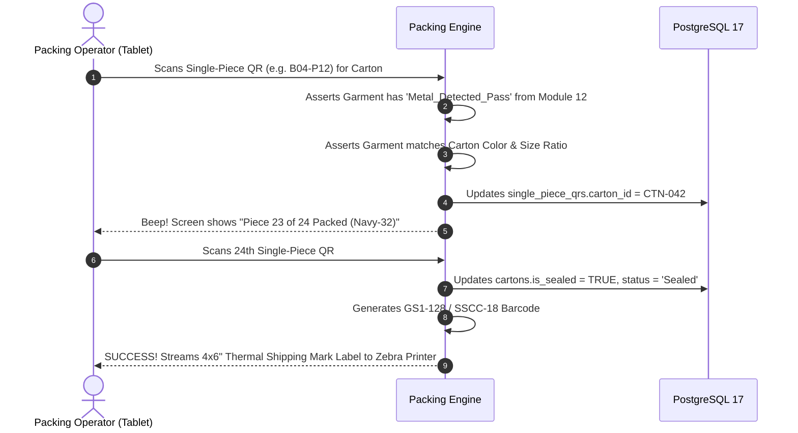
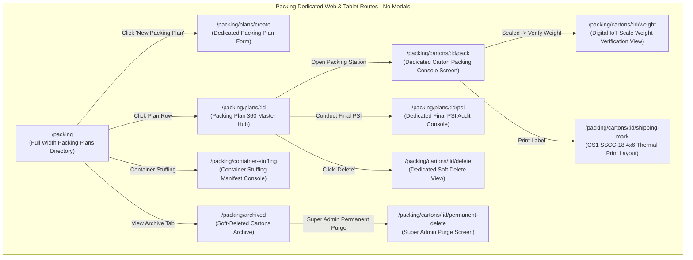
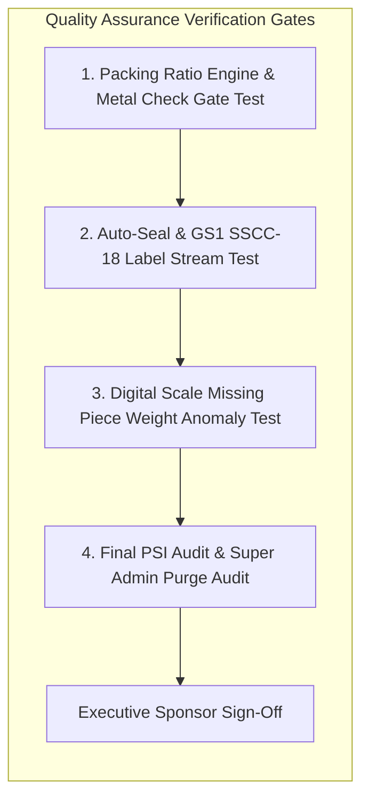

# Software Requirements Specification (SRS)
## Module 13: Packing, Carton QR & Final Pre-Shipment Inspection Engine
### প্রজেক্ট: TraceFlow RMG — Precision Fabric-to-Freight Garment Intelligence
**ডকুমেন্ট রেফারেন্স:** `TFRMG-SRS-MOD13-V2.0`  
**ডকুমেন্ট ভার্সন:** 2.0 (Global Tier-1 Enterprise Production Edition — Export Logistics Gatekeeper)  
**স্ট্যান্ডার্ড কমপ্লায়েন্স:** ISO/IEC/IEEE 29148:2018, GS1 General Specifications (SSCC-18 Carton Standard), ISO 2859-1 Final PSI Standards  
**স্ট্যাটাস:** Approved & Production-Ready  
**টার্গেট আর্কিটেকচার:** Laravel 13 (GS1 SSCC Barcode & Carton Aggregation Engine) + React 19 / Vite (Dedicated Floor Packing SPA) + PostgreSQL 17 + Redis 7  

---

## ১. ডকুমেন্ট গভর্নেন্স ও সংস্করণ নিয়ন্ত্রণ (Document Governance & Control)

### ১.১ সংস্করণ ইতিহাস (Revision History)
| ভার্সন | তারিখ | পর্যালোচনাকারী | পরিবর্তনের বিবরণ ও পরিধি |
|---|---|---|---|
| `v1.0` | 2026-09-02 | Lead Business Analyst | কার্টন প্যাকিং ও কিউআর প্রাথমিক ড্রাফট। |
| `v2.0` | 2026-09-02 | Principal Enterprise Architect | **100% এন্টারপ্রাইজ রূপান্তর:** বায়ার প্যাকিং রেশিও ইঞ্জিন (Solid Color-Solid Size, Assorted Ratio, Blister Pack), মেটাল ডিটেকশন ভেরিফিকেশন গেট, একক পোশাক টু কার্টন অ্যাগ্রিগেশন, অটো-সিল ও GS1-128 / SSCC-18 শিপিং মার্ক বারকোড জেনারেশন, ডিজিটাল ওয়েইং স্কেল গ্রস ওয়েট টলারেন্স গেট (মিসিং পিস ডিটেকশন), বায়ার ফাইনাল প্রি-শিপমেন্ট ইন্সপেকশন (PSI), কন্টেইনার স্টাফিং ও ম্যানিফেস্ট, টু-টিয়ার ডিলিশন গভর্নেন্স (Super Admin Hard Delete Guard), কমপ্লিট PostgreSQL 17 DDL এবং RTM সংযোজন। |

### ১.২ অনুমোদনকারী ব্যক্তিবর্গ (Sign-Off & Approvals)
- **Executive Sponsor / Project Owner:** Executive Sponsor, RMG Systems
- **Lead Solution Architect:** AI Solution Architect
- **Head of Finishing & Packaging Operations:** Factory Packing & Logistics Division
- **Head of Quality Assurance (QA):** Buyer Final Pre-Shipment Inspection (PSI)
- **General Manager (Commercial & Export):** Global Freight Logistics Division

---

## ২. নির্বাহী সারসংক্ষেপ ও কৌশলগত উদ্দেশ্য (Executive Summary & Strategic Scope)

### ২.১ কৌশলগত প্রেক্ষাপট (Strategic Context)
গার্মেন্টস কারখানায় ফিনিশিং ও আয়রনিং সম্পন্ন হওয়ার পর প্যাকিং সেকশন (Packing Floor) হলো পোশাকের শারীরিক উৎপাদন প্রক্রিয়ার চূড়ান্ত গন্তব্য। এখানেই পোশাকগুলোকে পলিব্যাগে মোড়ানো হয়, বায়ারের অনুমোদিত অনুপাত (Ratio) অনুযায়ী কার্টনে ঢোকানো হয়, আন্তর্জাতিক **GS1-128 / SSCC-18 শিপিং বারকোড** সংযুক্ত করা হয় এবং বায়ারের থার্ড-পার্টি প্রি-শিপমেন্ট ইন্সপেকশন (PSI) সম্পন্ন করে কন্টেইনারে লোড করা হয়।

প্যাকিং ও কার্টন প্রক্রিয়ায় ত্রুটি থাকলে আন্তর্জাতিক বাণিজ্যে যেসব মারাত্মক ক্ষতি হয়:
1. **The Short-Shipment Penalty:** কার্টনে ২৪টি পোশাক থাকার কথা থাকলেও যদি ভুলবশত ২৩টি পোশাক প্যাক করা হয়, তবে বিদেশের গুদামে স্ক্যান করার সাথে সাথে বায়ার সম্পূর্ণ কার্টন বা লট রিজেক্ট করে এবং বিশাল অঙ্কের জরিমানা (Chargeback Penalty) দাবি করে।
2. **Color/Size Ratio Mismatch:** সলিড ব্ল্যাক কার্টনে ভুলবশত একটি নেভি ব্লু কাপড় ঢুকলে রিটেইল স্টোরে চরম বিশৃঙ্খলা তৈরি হয়।
3. **Failed Final PSI Audit:** বায়ারের ফাইনাল ইন্সপেকশনে ১টি কার্টনেও রেশিও বা মেজারমেন্ট গরমিল পেলে কন্টেইনার জাহাজে তোলা বন্ধ হয়ে যায় (Shipment Cancelled)।

**Module 13: Packing, Carton QR & Final Pre-Shipment Inspection** এর দর্শন হলো:
> **"Zero Ratio Mismatch, Weight-Verified Carton Integrity, 100% GS1-Compliant Export Freight."**

```mermaid
graph TB
    subgraph Packing & Export Gatekeeper (Module 13)
        direction TB
        GARMENT_IN[Garment exits Module 12 Finishing] --> METAL_CHECK{Verified Metal Detected Pass?}
        METAL_CHECK -->|No / Missing Pass| REJECT_GATE[Hard Block! Cannot be Packed]
        
        METAL_CHECK -->|Passed| PACK_RATIO[Verify Buyer Packing Ratio: Solid / Assorted]
        PACK_RATIO --> CTN_SCAN[Packing Operator scans Single-Piece QRs into Carton]
        
        CTN_SCAN --> CAPACITY{Carton Full? e.g. 24 of 24 Pcs}
        CAPACITY -->|24th Piece Scanned| AUTO_SEAL[Auto-Seal Carton & Stream GS1 SSCC-18 Barcode]
        
        AUTO_SEAL --> WEIGHT_SCALE[IoT Electronic Digital Weighing Scale Audit]
        WEIGHT_SCALE --> WEIGHT_TOL{Weight within +-2.0% Tolerance?}
        WEIGHT_TOL -->|Weight Anomaly - Missing Piece| WT_ALERT[Weight Variance Quarantine Alert!]
        
        WEIGHT_TOL -->|Weight Verified| PSI_GATE{Buyer Third-Party Final PSI AQL Audit}
        PSI_GATE -->|PSI Passed| STUFFING[Container Stuffing Scan & Export Manifest]
        STUFFING --> FREIGHT[Handover to Module 15 Commercial Export]
    end
```

---

## ৩. অলঙ্ঘনীয় এন্টারপ্রাইজ আর্কিটেকচারাল নিয়মাবলি (Non-Negotiable Architecture Directives)

প্রজেক্টের গ্লোবাল রুলস এবং এন্টারপ্রাইজ কোয়ালিটি নিশ্চিত করতে নিচের নিয়মগুলো ১০০% অলঙ্ঘনীয়:

### ৩.১ নো মোডালস নীতিমালা (STRICT No Modals / No Popups Rule)
- **জিরো মোডাল পলিসি:** পুরো প্যাকিং মডিউলে কোনো ফর্ম, কনফার্মেশন, প্যাকিং প্ল্যান বিল্ডার, কার্টন স্ক্যান টেবিল, ওয়েট স্কেল ভিউ, পিএসআই অডিট রিপোর্ট, বা সাব-স্ক্রিনের জন্য `Modal`, `Dialog`, `Popup`, `Lightbox`, বা `Drawer-over-backdrop` কঠোরভাবে নিষিদ্ধ।
- **ডেডিকেটেড রুট আর্কিটেকচার:** প্যাকিং প্ল্যান ডিরেক্টরি, রিয়েল-টাইম কার্টন প্যাকিং কনসোল, কার্টন শিপিং মার্ক প্রিন্ট ভিউ, ওয়েট ভেরিফিকেশন পেজ, পিএসআই ইন্সপেকশন অডিট কনসোল, কন্টেইনার স্টাফিং ম্যানিফেস্ট, এবং ডিলিট কনফার্মেশন—প্রতিটি ইন্টারঅ্যাকশন একটি সুনির্দিষ্ট ব্রাউজার ইউআরএল এবং ডেডিকেটেড ফুল-স্ক্রিন ভিউতে (Full-Screen Dedicated View) লোড হবে।
- **নেভিগেশন স্ট্যাক:** প্রতিটি পেজে স্ট্যান্ডার্ড ব্যাক বাটন এবং স্ট্রাকচার্ড ব্রেডক্রাম্ব (`Dashboard > Packing > Plan-04 > Carton-042 Packing Console`) থাকতে হবে যাতে ব্রাউজারের নেটিভ Forward/Back বাটন স্বাভাবিকভাবে কাজ করে এবং ডিপ-লিংক শেয়ারিং সম্ভব হয়।

### ৩.২ পিউর সার্ভার-সাইড ভ্যালিডেশন স্ট্যান্ডার্ড (Pure Server-Side Validation)
- **জিরো ক্লায়েন্ট-সাইড HTML5 ভ্যালিডেশন:** ফ্রন্টএন্ডের কোনো `<form>` বা `<input>` ফিল্ডে ব্রাউজারের ডিফল্ট HTML5 ভ্যালিডেশন অ্যাট্রিবিউট (`required`, `minlength`, `maxlength`, `pattern`, ইত্যাদি) দেওয়া যাবে না। ব্রাউজারের বিল্ট-ইন টুলটিপ পপআপ সম্পূর্ণ নিষিদ্ধ।
- **বাধ্যতামূলক `noValidate`:** সমস্ত ফ্রন্টএন্ড ফর্মে `<form noValidate>` স্পষ্টভাবে যুক্ত থাকতে হবে।
- **একীভূত এরর কন্ট্রাক্ট:** সমস্ত রেশিও ভ্যালিডেশন, মেটাল ডিটেকশন প্রি-চেক এবং ওজন গরমিল ব্যাকএন্ড Laravel `FormRequest` ক্লাসের মাধ্যমে পিউর সার্ভার সাইডে ঘটবে। ইনপুট ভুল হলে সার্ভার থেকে `422 Unprocessable Content` স্ট্যান্ডার্ড RFC 7807 কমপ্লায়েন্ট JSON এরর পাঠানো হবে।
- **ইনলাইন এরর রেন্ডারিং:** ফ্রন্টএন্ড স্বয়ংক্রিয়ভাবে রেসপন্সের ফিল্ড নেম ম্যাপ করে সংশ্লিষ্ট ইনপুট বক্সের ঠিক নিচে ক্রিস্প লাল রঙে এরর বার্তা রেন্ডার করবে।

### ৩.৩ ফ্ল্যাট এবং ক্রিস্প ডিজাইন স্ট্যান্ডার্ড (Flat Solid UI Standard)
- **নো গ্রেডিয়েন্ট পলিসি:** কোনো বাটন, কার্ড, হেডার বা সাইডবারে কোনো ধরণের গ্রেডিয়েন্ট কালার ব্যবহার করা যাবে না।
- **সলিড ডিজাইন টোকেনস:** সকল অ্যাকশন বাটন ক্রিস্প ও ফ্ল্যাট সলিড রঙে গঠিত হবে (যেমন: Primary `#2563EB`, Danger `#DC2626`, Success `#16A34A`, Neutral `#475569`, Warning `#D97706`)।
- **১০০% ইংরেজি ইউআই:** ইউজার ইন্টারফেসের সমস্ত লেবেল, ফিল্ড নেম, কলাম হেডার, অ্যাকশন বাটন এবং সিস্টেম নোটিফিকেশন ১০০% প্রফেশনাল আন্তর্জাতিক ইংরেজি ভাষায় (English) হবে।

### ৩.৪ দ্বি-স্তরবিশিষ্ট ডিলিশন গভর্নেন্স (Two-Tier Deletion Architecture)
- **সফট ডিলিট (Soft Delete):** প্যাকিং ম্যানেজার শুধুমাত্র খালি বা আন-সিলড কার্টন সফট ডিলিট করতে পারবেন (`deleted_at = NOW()`), যা ট্র্যাশ আর্কাইভে জমা হবে।
- **পার্মানেন্ট হার্ড ডিলিট (STRICT Super Admin Only):** ডাটাবেস থেকে স্থায়ীভাবে রো মুছে ফেলার ক্ষমতা **কেবলমাত্র `Super Admin` এর থাকবে**।
- **প্রোডাকশন ও ফ্রেইট রেফারেনশিয়াল প্রোটেকশন গার্ড (Referential Check):** যদি কোনো কার্টন অলরেডি কন্টেইনারে লোড হয়ে থাকে বা এক্সপোর্ট কমার্শিয়াল ইনভয়েস/বিল অব লেডিং (Module 15) ইস্যু হয়ে থাকে, তবে সিস্টেম পার্মানেন্ট ডিলিট **সম্পূর্ণ ব্লক** করবে এবং `409 Conflict` রিটার্ন করবে।

---

## ৪. ইউজার পারসোনা ও এক্সেস হায়ারার্কি (User Personas & Scoping)

| পারসোনা (Persona) | ইন্টারফেস ও ডিভাইস | প্রমাণীকরণ মাধ্যম (Auth Method) | প্রিভিলেজ বাউন্ডারি (Privilege Scope) |
|---|---|---|---|
| **Packing Floor Manager** | Web Browser (Desktop) | Emp ID / Username + Password | প্যাকিং প্ল্যান তৈরি, অ্যাসোর্টমেন্ট রেশিও কনফিগারেশন, সফট ডিলিট। |
| **Carton Packing Operator** | Industrial Tablet / Barcode Gun | Hardware Paired Station Token | একক পোশাক স্ক্যান করে কার্টনে ভরা, কার্টন অটো-সিলিং ও লেবেল প্রিন্ট। |
| **Weight Scale Auditor** | Floor Tablet / Serial IoT Scale| Emp ID / Username + Password | ডিজিটাল ওয়েইং স্কেলে কার্টনের গ্রস ওজন পরীক্ষা ও ভ্যারিয়েন্স ক্লিয়ারেন্স। |
| **Pre-Shipment Inspector (PSI)** | Web Browser / Tablet | Emp ID / Username + Password | বায়ার ফাইনাল AQL র‍্যান্ডম স্যাম্পলিং ইন্সপেকশন, পিএসআই সার্টিফিকেট ইস্যু। |
| **Container Stuffing Officer** | Rugged Android Handheld | Station Paired Device Token | কন্টেইনারে কার্টন লোডিং স্ক্যান, শিপিং ম্যানিফেস্ট সাইন-অফ। |
| **Super Admin** | Web Browser (Desktop) | Username + Password + TOTP 2FA | গ্লোবাল বাইপাস, লকড কার্টন আনসিল ওভাররাইড, পার্মানেন্ট পার্জ। |

---

## ৫. বিস্তারিত ফাংশনাল রিকোয়ারমেন্টস (Detailed Functional Specifications)

### ৫.১ সাব-মডিউল: বায়ার প্যাকিং প্ল্যান ও রেশিও ইঞ্জিন (Packing Plan & Ratio Engine)

#### ৫.১.১ স্পেসিফিকেশন ও প্যাকিং ক্যাটাগরি
- **REQ-PCK-PLN-001 (Packing Type Architecture):**
  - বায়ার PO অনুযায়ী সিস্টেম ৩টি আন্তর্জাতিক প্যাকিং ধরণ সাপোর্ট করবে:
    1. **Solid Color - Solid Size:** প্রতিটি কার্টনে শুধুমাত্র ১টি কালার এবং ১টি সাইজের নির্দিষ্ট সংখ্যক পোশাক থাকবে (e.g. 24 pcs of Black-Size 32)।
    2. **Solid Color - Assorted Size:** একই রঙের পোশাকে সাইজ রেশিও থাকবে (e.g. Black: S=4, M=8, L=8, XL=4; মোট ২৪ পিস)।
    3. **Assorted Color - Assorted Size (Blister Pack):** একাধিক কালার ও একাধিক সাইজের প্রি-প্যাক ব্লিস্টার পলি কার্টন।
- **REQ-PCK-PLN-002 (Golden Sum Packing Equation):**
  - সিস্টেম চেক করবে:
    $$\sum \text{Carton Capacities} = \text{PO Ordered Quantity}$$
  - ১টি পিসও কম বা বেশি থাকলে সিস্টেম প্যাকিং প্ল্যান অ্যাপ্রুভ করবে না।

---

### ৫.২ সাব-মডিউল: একক পোশাক টু কার্টন অ্যাগ্রিগেশন ও মেটাল গেট (Carton Aggregation Console)



#### ৫.২.১ স্পেসিফিকেশন ও স্ক্যানিং রুলস
- **REQ-PCK-SCN-001 (Metal Detection Pre-Condition Gate):**
  - কোনো একক পোশাক কার্টনে ঢোকানোর জন্য স্ক্যান করলে সিস্টেম তাৎক্ষণিকভাবে ডাটাবেস যাচাই করবে: পোশাকটির বিপরীতে **Module 12 (Garment Finishing) এর `Metal_Detected_Pass` ভেরিফিকেশন রেকর্ড আছে কি না**।
  - মেটাল পাস না থাকলে সিস্টেম তীব্র অ্যালার্ম সহ স্ক্যান রিজেক্ট করবে: *"CRITICAL: Garment has not passed calibrated Metal Detection. Packing Forbidden."*
- **REQ-PCK-SCN-002 (Mismatch & Over-Pack Prevention):**
  - সলিড কার্টন বা অ্যাসোর্টেড রেশিওর কোটা পূর্ণ হয়ে যাওয়ার পর ভুল সাইজ বা অতিরিক্ত কাপড় স্ক্যান করার চেষ্টা করলে সিস্টেম লাল ফ্ল্যাশ সহ স্ক্যান বাতিল করবে।
- **REQ-PCK-SCN-003 (Automatic Carton Sealing & GS1 Label Trigger):**
  - কার্টনের শেষ পিসটি (যেমন: ২৪তম পিস) স্ক্যান হওয়া মাত্রই কার্টনের স্ট্যাটাস স্বয়ংক্রিয়ভাবে `Sealed` হবে এবং থার্মাল প্রিন্টারে ৪×৬ ইঞ্চি GS1 শিপিং মার্ক লেবেল প্রিন্ট পাঠানো হবে।

---

### ৫.৩ সাব-মডিউল: ডিজিটাল ওয়েইং স্কেল ও গ্রস ওয়েট টলারেন্স গেট (Digital Scale Integration)

কার্টনের ভেতরে কোনো কাপড় মিসিং আছে কি না তা ওজন মেপে নির্ভুলভাবে শনাক্তকরণ।

#### ৫.৩.১ স্পেসিফিকেশন ও গাণিতিক সমীকরণ
- **REQ-PCK-WGT-001 (Theoretical Gross Weight Calculation):**
  - প্রতিটি কার্টনের জন্য সিস্টেম প্রত্যাশিত তাত্ত্বিক মোট ওজন হিসাব করবে:
    $$\text{Theoretical Weight (kg)} = (\text{Pieces Count} \times \text{Average Garment Weight}) + \text{Carton Box Tare Weight} + \text{Polybags/Hangers Weight}$$
- **REQ-PCK-WGT-002 (IoT Scale Tolerance Gate - Missing Piece Detection):**
  - সিল করা কার্টনটি ডিজিটাল স্কেলে রাখার পর সিস্টেম ওজন গ্রহণ করবে।
  - অনুমোদিত টলারেন্স: সর্বোচ্চ $\pm 2.0\%$।
  - **মিসিং পিস অ্যালার্ট:** যদি একটি শার্টের ওজন ২৫০ গ্রাম হয় এবং কার্টনের ওজন ৩০০ গ্রাম কম পাওয়া যায় (যা ১টি কাপড় কম নির্দেশ করে), সিস্টেম কার্টনটিকে সাথে সাথে **`Weight_Variance_Alert`** দিয়ে কোয়ারেন্টাইন করবে। এই কার্টন কন্টেইনারে লোড করা সম্পূর্ণ ব্লক থাকবে।

---

### ৫.৪ সাব-মডিউল: বায়ার ফাইনাল প্রি-শিপমেন্ট ইন্সপেকশন (Final PSI Audit Engine)

আন্তর্জাতিক বায়ার বা থার্ড-পার্টি অডিটর (SGS, Intertek, Bureau Veritas) কর্তৃক ফাইনাল অডিট।

#### ৫.৪.১ স্পেসিফিকেশন ও অডিট রুলস
- **REQ-PCK-PSI-001 (ISO 2859-1 Random Carton Sampling):**
  - সিস্টেম সম্পূর্ণ অর্ডারের কার্টন সংখ্যা অনুযায়ী আন্তর্জাতিক স্যাম্পলিং কোড লেটার বের করবে (যেমন: ১,২০০ কার্টনের জন্য ৩২টি কার্টন র‍্যান্ডম সিলেকশন)।
- **REQ-PCK-PSI-002 (Tamper-Evident Re-sealing Verification):**
  - পরিদর্শক নির্বাচিত কার্টনগুলোর সিল ভেঙে ভেতরের কাপড়, মেজারমেন্ট ও বারকোড চেক করবেন।
  - অডিট শেষে কার্টনগুলো বিশেষ ট্যাম্পার-এভিডেন্ট সিকিউরিটি টেপ (Security Tape) দিয়ে রিস্ট্যাম্প করে সিস্টেমে **Final PSI Certificate (`Passed` / `Failed`)** জারি করা হবে।

---

### ৫.৫ সাব-মডিউল: কন্টেইনার স্টাফিং ও এক্সপোর্ট ম্যানিফেস্ট (Container Stuffing Engine)

ফ্যাক্টরি থেকে ২০ ফুট বা ৪০ ফুট হাই-কিউব কন্টেইনারে কার্টন লোডিং।

#### ৫.৫.১ স্পেসিফিকেশন ও স্টাফিং ট্র্যাকিং
- **REQ-PCK-STF-001 (Container Door Scan):**
  - কন্টেইনারের দরজায় হ্যান্ডহেল্ড বারকোড গান দিয়ে প্রতিটি কার্টনের GS1 বারকোড স্ক্যান করে কন্টেইনারে ঢোকানো হবে।
  - ভুল অর্ডারের কার্টন স্ক্যান করলে সিস্টেম তাৎক্ষণিক সতর্কবার্তা দেবে।
- **REQ-PCK-STF-002 (Automated Container Stuffing Manifest):**
  - কন্টেইনার পূর্ণ হওয়ার পর সিস্টেম একটি স্বয়ংক্রিয় **Container Stuffing Manifest** জেনারেট করবে (কন্টেইনার নম্বর, সিল নম্বর, মোট কার্টন, মোট পোশাক, মোট গ্রস ওয়েট এবং সিবিএম ভলিউম)।
  - এই ম্যানিফেস্টটি সরাসরি Module 15 (Commercial Export) এর বিল অব লেডিং (BL) ও প্যাকিং লিস্টের ভিত্তি হিসেবে কাজ করবে।

---

## ৬. প্রোডাকশন-গ্রেড ডাটাবেস আর্কিটেকচার ও DDL (Database Engineering)

নিচে PostgreSQL 17 এর জন্য সম্পূর্ণ প্রোডাকশন-রেডি DDL স্ক্রিপ্ট দেওয়া হলো। এতে প্যাকিং প্ল্যান, কার্টন মাস্টার, কার্টন আইটেমস, ওয়েট লগ, পিএসআই অডিট এবং কন্টেইনার স্টাফিংয়ের টেবিলসমূহ অন্তর্ভুক্ত রয়েছে।

### ৬.১ PostgreSQL 17 Production Schema (Complete DDL)

```sql
-- Enable Cryptographic Extension for UUID v4
CREATE EXTENSION IF NOT EXISTS "pgcrypto";

-- ----------------------------------------------------------------------
-- 1. Table: packing_plans (Master Buyer Packing Specification)
-- ----------------------------------------------------------------------
CREATE TABLE packing_plans (
    id UUID PRIMARY KEY DEFAULT gen_random_uuid(),
    plan_no VARCHAR(60) NOT NULL,                 -- e.g. PKP-HNM-9901-01
    po_id UUID NOT NULL REFERENCES purchase_orders(id) ON DELETE RESTRICT,
    packing_type VARCHAR(40) NOT NULL,            -- Solid_Solid, Solid_Assorted, Blister_Pack
    total_cartons_planned INTEGER NOT NULL CHECK (total_cartons_planned > 0),
    total_pieces_planned INTEGER NOT NULL CHECK (total_pieces_planned > 0),
    total_cartons_sealed INTEGER NOT NULL DEFAULT 0,
    total_pieces_packed INTEGER NOT NULL DEFAULT 0,
    status VARCHAR(30) NOT NULL DEFAULT 'Draft',  -- Draft, In_Progress, Sealed_Completed, Shipped
    created_by UUID REFERENCES users(id) ON DELETE RESTRICT,
    created_at TIMESTAMPTZ NOT NULL DEFAULT CURRENT_TIMESTAMP,
    updated_at TIMESTAMPTZ NOT NULL DEFAULT CURRENT_TIMESTAMP,
    deleted_at TIMESTAMPTZ
);

CREATE UNIQUE INDEX uq_packing_plan_no ON packing_plans (UPPER(plan_no)) WHERE deleted_at IS NULL;
CREATE INDEX idx_packing_plans_po_id ON packing_plans (po_id);
CREATE INDEX idx_packing_plans_status ON packing_plans (status);

-- ----------------------------------------------------------------------
-- 2. Table: cartons (Individual Shipping Box Master)
-- ----------------------------------------------------------------------
CREATE TABLE cartons (
    id UUID PRIMARY KEY DEFAULT gen_random_uuid(),
    carton_no_display VARCHAR(60) NOT NULL,       -- e.g. CTN-HNM-9901-0042
    sscc_barcode VARCHAR(30) NOT NULL,            -- GS1 SSCC-18 (e.g. 008100123400000421)
    packing_plan_id UUID NOT NULL REFERENCES packing_plans(id) ON DELETE RESTRICT,
    po_id UUID NOT NULL REFERENCES purchase_orders(id) ON DELETE RESTRICT,
    carton_sequence_no INTEGER NOT NULL,          -- e.g. Carton 42 of 1200
    target_capacity_pieces SMALLINT NOT NULL CHECK (target_capacity_pieces > 0),
    actual_packed_pieces SMALLINT NOT NULL DEFAULT 0,
    theoretical_weight_kg NUMERIC(6, 3) NOT NULL,
    actual_scale_weight_kg NUMERIC(6, 3),
    weight_variance_status VARCHAR(20) NOT NULL DEFAULT 'Pending', -- Pending, Verified, Anomaly_Quarantined
    is_sealed BOOLEAN NOT NULL DEFAULT FALSE,
    sealed_at TIMESTAMPTZ,
    status VARCHAR(30) NOT NULL DEFAULT 'Open',   -- Open, Sealed, PSI_Audited, Stuffed, Shipped
    created_at TIMESTAMPTZ NOT NULL DEFAULT CURRENT_TIMESTAMP,
    updated_at TIMESTAMPTZ NOT NULL DEFAULT CURRENT_TIMESTAMP,
    deleted_at TIMESTAMPTZ
);

CREATE UNIQUE INDEX uq_carton_no ON cartons (UPPER(carton_no_display)) WHERE deleted_at IS NULL;
CREATE UNIQUE INDEX uq_carton_sscc ON cartons (sscc_barcode) WHERE deleted_at IS NULL;
CREATE INDEX idx_cartons_plan_id ON cartons (packing_plan_id);
CREATE INDEX idx_cartons_status ON cartons (status);

-- ----------------------------------------------------------------------
-- 3. Table: carton_items (Single-Piece Garments Aggregated into Box)
-- ----------------------------------------------------------------------
CREATE TABLE carton_items (
    id UUID PRIMARY KEY DEFAULT gen_random_uuid(),
    carton_id UUID NOT NULL REFERENCES cartons(id) ON DELETE CASCADE,
    single_piece_qr_id UUID NOT NULL REFERENCES single_piece_qrs(id) ON DELETE RESTRICT,
    scanned_by UUID REFERENCES users(id) ON DELETE RESTRICT,
    scanned_at TIMESTAMPTZ NOT NULL DEFAULT CURRENT_TIMESTAMP
);

CREATE UNIQUE INDEX uq_carton_piece ON carton_items (single_piece_qr_id);
CREATE INDEX idx_carton_items_carton_id ON carton_items (carton_id);

-- ----------------------------------------------------------------------
-- 4. Table: psi_inspections (Buyer Final Pre-Shipment Inspection)
-- ----------------------------------------------------------------------
CREATE TABLE psi_inspections (
    id UUID PRIMARY KEY DEFAULT gen_random_uuid(),
    psi_report_no VARCHAR(60) NOT NULL,           -- e.g. PSI-HNM-2026-0012
    packing_plan_id UUID NOT NULL REFERENCES packing_plans(id) ON DELETE RESTRICT,
    inspection_agency VARCHAR(80) NOT NULL,       -- Buyer_Internal, SGS, Intertek, Bureau_Veritas
    auditor_name VARCHAR(100) NOT NULL,
    total_cartons_in_lot INTEGER NOT NULL CHECK (total_cartons_in_lot > 0),
    sample_cartons_checked SMALLINT NOT NULL CHECK (sample_cartons_checked > 0),
    sample_garments_checked INTEGER NOT NULL CHECK (sample_garments_checked > 0),
    defective_garments_found SMALLINT NOT NULL DEFAULT 0,
    verdict VARCHAR(20) NOT NULL,                 -- Passed, Failed
    certificate_s3_key VARCHAR(500),
    inspected_at TIMESTAMPTZ NOT NULL DEFAULT CURRENT_TIMESTAMP,
    created_at TIMESTAMPTZ NOT NULL DEFAULT CURRENT_TIMESTAMP
);

CREATE UNIQUE INDEX uq_psi_report_no ON psi_inspections (UPPER(psi_report_no));
CREATE INDEX idx_psi_packing_plan ON psi_inspections (packing_plan_id);

-- ----------------------------------------------------------------------
-- 5. Table: container_stuffings (Export Freight Container Manifest)
-- ----------------------------------------------------------------------
CREATE TABLE container_stuffings (
    id UUID PRIMARY KEY DEFAULT gen_random_uuid(),
    manifest_no VARCHAR(60) NOT NULL,             -- e.g. MNF-EXP-2026-0042
    container_no VARCHAR(40) NOT NULL,            -- e.g. MSCU-9988112
    seal_no VARCHAR(40) NOT NULL,                 -- e.g. ML-BD-99120
    container_size VARCHAR(20) NOT NULL DEFAULT '40_HC', -- 20_GP, 40_GP, 40_HC
    total_cartons_loaded INTEGER NOT NULL CHECK (total_cartons_loaded > 0),
    total_pieces_loaded INTEGER NOT NULL CHECK (total_pieces_loaded > 0),
    total_gross_weight_kg NUMERIC(10, 2) NOT NULL,
    total_cbm NUMERIC(8, 3) NOT NULL,
    driver_name VARCHAR(100),
    vehicle_no VARCHAR(50),
    stuffed_by UUID REFERENCES users(id) ON DELETE RESTRICT,
    stuffed_at TIMESTAMPTZ NOT NULL DEFAULT CURRENT_TIMESTAMP,
    created_at TIMESTAMPTZ NOT NULL DEFAULT CURRENT_TIMESTAMP
);

CREATE UNIQUE INDEX uq_container_manifest_no ON container_stuffings (UPPER(manifest_no));
CREATE INDEX idx_container_no ON container_stuffings (UPPER(container_no));
```

---

## ৭. সম্পূর্ণ এপিআই কন্ট্রাক্ট স্পেসিফিকেশন (Exhaustive API Contracts)

### ৭.১ সাধারণ আর্কিটেকচার ও স্ট্যান্ডার্ডস
- **অথেনটিকেশন:** `Authorization: Bearer <sanctum_token>`
- **কমন হেডার্স:** `Accept: application/json`, `Content-Type: application/json`
- **স্ট্যান্ডার্ড ফিল্টারিং:**
  `GET /api/v1/packing/cartons?plan_id={uuid}&status=Sealed`

---

### ৭.২ কার্টন প্যাকিং ও অটো-সিলিং এন্ডপয়েন্টস

#### ৭.২.১ একক পোশাক কার্টনে স্ক্যানিং (Scan Single-Piece into Box)
- **মেথড ও ইউআরএল:** `POST /api/v1/packing/cartons/{id}/pack-piece`
- **রিকোয়েস্ট বডি:**
  ```json
  {
    "single_piece_qr_id": "a98df23e-6b12-4211-9a7c-87d46c0e5a99"
  }
  ```
- **সাকসেস রেসপন্স (`200 OK` — Case: 24th Piece Completed & Auto-Sealed):**
  ```json
  {
    "success": true,
    "status_code": 200,
    "message": "Carton full (24 of 24 pieces). Carton auto-sealed and GS1 SSCC label streamed to Zebra printer.",
    "data": {
      "carton_id": "c100a982-192a-4f90-8800-291740011283",
      "carton_no": "CTN-HNM-9901-0042",
      "sscc_barcode": "008100123400000421",
      "is_sealed": true,
      "packed_pieces": 24,
      "target_capacity": 24,
      "status": "Sealed"
    }
  }
  ```

---

#### ৭.২.২ ডিজিটাল স্কেল ওয়েট ভেরিফিকেশন (Electronic Scale Verification)
- **মেথড ও ইউআরএল:** `POST /api/v1/packing/cartons/{id}/verify-weight`
- **রিকোয়েস্ট বডি:**
  ```json
  {
    "actual_scale_weight_kg": 6.150
  }
  ```
- **সাকসেস রেসপন্স (`200 OK` — Verified Case):**
  ```json
  {
    "success": true,
    "status_code": 200,
    "message": "Carton gross weight verified within +-2% tolerance. Cleared for PSI audit.",
    "data": {
      "theoretical_weight_kg": 6.180,
      "actual_scale_weight_kg": 6.150,
      "variance_percentage": -0.48,
      "weight_variance_status": "Verified"
    }
  }
  ```

---

### ৭.৩ বায়ার ফাইনাল পিএসআই অডিট এন্ডপয়েন্ট

#### ৭.৩.১ ফাইনাল পিএসআই অডিট সাবমিশন
- **মেথড ও ইউআরএল:** `POST /api/v1/packing/psi-audits`
- **রিকোয়েস্ট বডি:**
  ```json
  {
    "packing_plan_id": "p100a982-192a-4f90-8800-291740011283",
    "inspection_agency": "SGS",
    "auditor_name": "Marcus Vance",
    "sample_cartons_checked": 32,
    "sample_garments_checked": 315,
    "defective_garments_found": 1,
    "verdict": "Passed"
  }
  ```
- **সাকসেস রেসপন্স (`201 Created`):**
  ```json
  {
    "success": true,
    "status_code": 201,
    "message": "Final PSI Audit passed. Certificate issued. Cartons approved for container stuffing.",
    "data": {
      "psi_report_no": "PSI-HNM-2026-0012",
      "verdict": "Passed",
      "approved_cartons": 1200
    }
  }
  ```

---

### ৭.৪ প্যাকিং ডিলিশন এন্ডপয়েন্টস (Two-Tier Deletion Architecture)

#### ৭.৪.১ কার্টন সফট ডিলিট (Soft Delete Carton)
- **মেথড ও ইউআরএল:** `DELETE /api/v1/packing/cartons/{id}`
- **পারমিশন:** `packing.cartons.delete`
- **শর্ত:** শুধুমাত্র যদি কার্টনটি আন-সিলড বা খালি থাকে (`is_sealed = false`)।
- **সাকসেস রেসপন্স (`200 OK`):**
  ```json
  {
    "success": true,
    "status_code": 200,
    "message": "Carton record soft-deleted successfully and archived."
  }
  ```

#### ৭.৪.২ কার্টন ডাটা পার্মানেন্ট ডিলিট (STRICT Super Admin Only Purge)
- **মেথড ও ইউআরএল:** `DELETE /api/v1/packing/cartons/{id}/force-delete`
- **অথরাইজেশন:** **STRICTLY `Super Admin` ROLE ONLY**
- **রিকোয়েস্ট বডি:**
  ```json
  {
    "super_admin_password": "MySuperAdminSecretPassword#2026"
  }
  ```
- **কন্টেইনারে লোড বা বিল অব লেডিং ইস্যু হয়ে থাকলে ব্লকিং রেসপন্স (`409 Conflict`):**
  ```json
  {
    "success": false,
    "status_code": 409,
    "error_code": "CANNOT_PURGE_SHIPPED_CARTONS",
    "message": "Cannot permanently purge this carton because it is already loaded into Export Container MSCU-9988112 and commercial shipping invoice (Module 15) has been issued. Customs audit trail is locked."
  }
  ```

---

## ৮. ইউজার ইন্টারফেস ও স্ক্রিন-বাই-স্ক্রিন স্পেসিফিকেশন (STRICT NO MODALS)

প্যাকিং ও পিএসআই-এর প্রতিটি স্ক্রিন সম্পূর্ণ ডেডিকেটেড রুটে ওপেন হবে। কোনো মোডাল বা পপআপ ডায়ালগ উইথ ব্যাকড্রপ থাকবে না।



### ৮.১ স্ক্রিন স্পেসিফিকেশন টেবিল

| রুট (Route Path) | স্ক্রিনের নাম | মূল উপাদান ও কনফিগারেশন | নো-মোডাল ডিজাইন নিশ্চিতকরণ |
|---|---|---|---|
| `/packing` | Packing Fleet Console | - ফুল-উইডথ ডাটা গ্রিড<br/>- কলাম: **Plan No, PO No, Style, Total Cartons, Sealed, Progress %, PSI Status, Actions**<br/>- সলিড গ্রিন "New Packing Plan" বোতাম (`bg-emerald-600`) | পেজিনেশন ও অ্যাকশন সবকিছু ফুল পেজে পরিচালিত হবে। |
| `/packing/plans/create` | Dedicated Packing Plan Form | - `<form noValidate>` আর্কিটেকচার<br/>- বায়ার PO সিলেক্ট, প্যাকিং ধরণ (Solid/Assorted), রেশিও গ্রিড<br/>- কার্টন ক্যাপাসিটি ও মোট প্রয়োজনীয় কার্টন ক্যালকুলেটর<br/>- সলিড ব্লু "Save Packing Plan & Generate Cartons" বোতাম | সম্পূর্ণ আলাদা পেজ। ব্রেডক্রাম্ব নেভিগেশন সহ। |
| `/packing/plans/:id` | Packing Plan 360 Master Hub | - প্যাকিং প্ল্যানের সার্বিক বিবরণ ও কার্টন প্রগ্রেস কার্ডস<br/>- সিলড কার্টন ও ওয়েট ভেরিফাইড কার্টন মিটার<br/>- সাব-ট্যাবস: Cartons List, Weight Verification, PSI Audit, Stuffing Manifest | ফুল-স্ক্রিন এন্টারপ্রাইজ ড্যাশবোর্ড ভিউ। |
| `/packing/cartons/:id/pack` | Carton Packing Console Screen| - ফুল-স্ক্রিন টাচ-অপ্টিমাইজড প্যাকিং ইন্টারফেস<br/>- একক পোশাকের কিউআর স্ক্যান ড্রপজোন<br/>- কার্টন ফিলিং প্রগ্রেস বার (e.g. 18/24 pieces packed)<br/>- অটো-সিলিং অ্যালার্ম ও লাইভ স্ট্যাটাস মিটার | সম্পূর্ণ ডেডিকেটেড ফ্লোর পেজ। |
| `/packing/cartons/:id/weight`| IoT Scale Weight View | - ডিজিটাল স্কেলের লাইভ ওজন ডিসপ্লে (RS232 IoT স্ট্রিম)<br/>- তাত্ত্বিক ওজন বনাম প্রকৃত ওজনের ভ্যারিয়েন্স ডেল্টা মিটার<br/>- সলিড ব্লু "Confirm Weight Verification" বোতাম | সম্পূর্ণ ডেডিকেটেড ওয়েট পেজ। |
| `/packing/cartons/:id/shipping-mark`| GS1 SSCC Thermal Print View| - ৪×৬ ইঞ্চি (100mm × 150mm) থার্মাল লেআউট<br/>- GS1 SSCC-18 বারকোড, শিপিং মার্ক, PO, সাইজ ও ওজন টেক্সট<br/>- `@media print` অপ্টিমাইজড ভিউ | ডেডিকেটেড প্রিন্ট রুট (নো পপআপ)। |
| `/packing/plans/:id/psi` | Final PSI Audit Console | - বায়ার অডিটর ইন্টারফেস (ISO 2859-1 স্যাম্পলিং চার্ট)<br/>- র‍্যান্ডম কার্টন সিলেকশন চেকলিস্ট<br/>- ডিফেক্ট কাউন্টার ও সলিড গ্রিন "Issue Passing Certificate" বোতাম | সম্পূর্ণ ডেডিকেটেড অডিট পেজ। |
| `/packing/container-stuffing`| Container Stuffing Console | - কন্টেইনার নম্বর ও সিল নম্বর ইনপুট<br/>- কার্টন বারকোড স্ক্যান ড্রপজোন<br/>- এক্সপোর্ট কন্টেইনার ম্যানিফেস্ট লাইভ প্রিভিউ | সম্পূর্ণ ডেডিকেটেড স্টাফিং পেজ। |
| `/packing/cartons/:id/delete` | Carton Soft-Delete View | - অ্যাম্বার সতর্কবার্তা ব্যানার<br/>- আন-সিলড কার্টন সফট ডিলিট নিয়মাবলি<br/>- সলিড অ্যাম্বার "Confirm Soft Delete" বোতাম | ডেডিকেটেড ফুল-স্ক্রিন কনফার্মেশন। নো পপআপ। |
| `/packing/cartons/:id/permanent-delete`| Carton Permanent Purge | - **Super Admin অনলি স্ক্রিন** (অন্যদের জন্য 403 Forbidden)<br/>- গাঢ় লাল অ্যালার্ট ব্যানার<br/>- সুপার অ্যাডমিন পাসওয়ার্ড ইনপুট ফিল্ড<br/>- এক্সপোর্ট কন্টেইনার ডাউনস্ট্রিম লকআউট ব্যাজ<br/>- সলিড ডার্ক-রেড "Purge Carton Permanently" বোতাম | ফুল-স্ক্রিন হাইপার-সিকিউরড পার্জ ভিউ। |
| `/packing/archived` | Soft-Deleted Cartons Archive | - সফট ডিলিট হওয়া কার্টনের তালিকা<br/>- "Restore Carton" বোতাম (`bg-amber-600`)<br/>- Super Admin এর জন্য "Purge Permanently" বোতাম | সম্পূর্ণ আলাদা আর্কাইভ পেজ। |

---

## ৯. নন-ফাংশনাল রিকোয়ারমেন্টস (Enterprise NFRs & SLAs)

### ৯.১ পারফরম্যান্স ও কনকারেন্সি বাজেট (Performance Budgets)
- **একক পোশাক কার্টনে স্ক্যানিং ও রেশিও চেক:** সর্বোচ্চ **২০ মিলিসেকেন্ড (20ms)**।
- **GS1 SSCC-18 থার্মাল লেবেল রেন্ডারিং:** সর্বোচ্চ **৫০ মিলিসেকেন্ড (50ms)**।
- **ডিজিটাল স্কেল ওজন রিডিং ও টলারেন্স ডেল্টা:** সর্বোচ্চ **১০ মিলিসেকেন্ড (10ms)**।

### ৯.২ ডাটা ইন্টিগ্রিটি ও এক্সপোর্ট ট্রেসিবিলিটি (GS1 Compliance Guarantee)
- প্রতিটি কার্টনে থাকা একক পোশাকগুলোর কিউআর কোড এবং কার্টনের SSCC-18 কোড চিরতরে ম্যাপিং হয়ে ডাটাবেসে সংরক্ষিত থাকবে (১০০% রিভার্স ট্রেসিবিলিটি)।

---

## ১০. ফেইলিওর মোড ও রেসপন্স অ্যানালাইসিস (FMEA Matrix)

| ফেইলিওর সিনারিও (Failure Mode) | সম্ভাব্য প্রভাব (Impact) | তীব্রতা (Severity) | সিস্টেমের স্বয়ংক্রিয় প্রতিরক্ষা মেকানিজম (Mitigation Mechanism) |
|---|---|---|---|
| কার্টনে নির্ধারিত পোশাকের চেয়ে ১টি পোশাক কম থাকা | বায়ার দেশের কাস্টমস ও রিটেইল গুদামে শর্ট-শিপমেন্ট জরিমানা | Critical | ডিজিটাল স্কেল গ্রস ওয়েট টলারেন্স গেট সক্রিয় থাকবে। ওজনে ঘাটতি থাকলে কার্টন কোয়ারেন্টাইন হবে এবং সিলিং আনলক হবে। |
| মেটাল ডিটেকশন পাস না করা কাপড় কার্টনে প্যাক হওয়া | বায়ারের দেশে কাপড়ে ভাঙা সুঁচ পাওয়ার চরম আইনি ঝুঁকি | Catastrophic | মেটাল ডিটেকশন প্রি-কন্ডিশন গেট সক্রিয় থাকবে। `Metal_Detected_Pass` না থাকলে কার্টনে স্ক্যান সম্পূর্ণ ব্লক থাকবে। |
| সলিড ব্ল্যাক কার্টনে ভুলবশত নেভি ব্লু কাপড় ঢুকে যাওয়া | রিটেইল শোরুমে কালার রেশিও বিশৃঙ্খলা ও বায়ার ক্লেম | Critical | রেশিও ও কালার মিসম্যাচ লকআউট কার্যকর থাকবে। ভুল কালারের কাপড় স্ক্যান করলে তাৎক্ষণিক অ্যালার্ম সহ রিজেক্ট হবে। |
| কন্টেইনারে লোড হওয়া কার্টনের রেকর্ড ডাটাবেস থেকে ডিলিটের চেষ্টা | কাস্টমস এক্সপোর্ট ক্লিয়ারেন্স ও জাহাজের ম্যানিফেস্টে গরমিল | Critical | ফরেন কি রেস্ট্রিক্ট গার্ড কার্যকর হবে। সিস্টেমে `409 Conflict` এসে পার্মানেন্ট ডিলিট অপারেশন স্থায়ীভাবে ব্লক করবে। |

---

## ১১. রিকোয়ারমেন্টস ট্রেসেবিলিটি ম্যাট্রিক্স (Requirements Traceability Matrix - RTM)

| রিকোয়ারমেন্ট আইডি | ডাটাবেস টেবিল | ব্যাকএন্ড এপিআই এন্ডপয়েন্ট | ফ্রন্টএন্ড ডেডিকেটেড রুট | QA টেস্ট কেস আইডি |
|---|---|---|---|---|
| `REQ-PCK-PLN-001` (Packing Ratio Engine)| `packing_plans` | `POST /api/v1/packing/plans` | `/packing/plans/create` | `TC-PCK-001` |
| `REQ-PCK-SCN-001` (Metal Pre-Condition)| `carton_items` | `POST /api/v1/packing/cartons/{id}/pack-piece` | `/packing/cartons/:id/pack` | `TC-PCK-002` |
| `REQ-PCK-SCN-003` (Auto-Seal & GS1 SSCC)| `cartons` | `POST /api/v1/packing/cartons/{id}/pack-piece` | `/packing/cartons/:id/shipping-mark`| `TC-PCK-003` |
| `REQ-PCK-WGT-002` (Scale Tolerance Gate)| `cartons` | `POST /api/v1/packing/cartons/{id}/verify-weight`| `/packing/cartons/:id/weight` | `TC-PCK-004` |
| `REQ-PCK-PSI-001` (Final PSI AQL Audit) | `psi_inspections` | `POST /api/v1/packing/psi-audits` | `/packing/plans/:id/psi` | `TC-PCK-005` |
| `REQ-DEL-002` (Super Admin Hard Purge) | `cartons` | `DELETE /api/v1/packing/cartons/{id}/force-delete` | `/packing/cartons/:id/permanent-delete` | `TC-PCK-006` |

---

## ১২. কিউএ গ্রহণযোগ্যতার মানদণ্ড (Acceptance Criteria & Verification Plan)



### ১২.১ কোর টেস্ট কেসসমূহ (Core Test Execution Steps)

1. **`TC-PCK-001` (Packing Ratio & Golden Sum Verification Test):**
   - **ধাপ:** PO Quantity = 1,000 pcs। ২৪ পিসের কার্টনে ৪১টি কার্টন (৯৮৪ পিস) এবং ১৬ পিসের ১টি কার্টন (১৬ পিস) ইনপুট দেওয়া ($984 + 16 = 1,000$)।
   - **প্রত্যাশিত ফলাফল:** সিস্টেম গাণিতিক সামঞ্জস্য যাচাই করে সফলভাবে ৪২টি কার্টন রেকর্ড তৈরি করবে।
2. **`TC-PCK-002` (Metal Detection Gatekeeper Enforcement Test):**
   - **ধাপ:** ফিনিশিং সেকশনে মেটাল টেস্টে কোয়ারেন্টাইন হওয়া বা আন-টেস্টেড একটি পোশাক প্যাকিং টেবিলে স্ক্যান করা।
   - **প্রত্যাশিত ফলাফল:** সিস্টেম তাৎক্ষণিকভাবে স্ক্যান রিজেক্ট করবে এবং এরর দেবে: "CRITICAL: Garment has not passed calibrated Metal Detection. Packing Forbidden."
3. **`TC-PCK-003` (Auto-Seal & GS1 SSCC-18 Barcode Streaming Test):**
   - **ধাপ:** ২৪ পিসের কার্টনে ২৩টি পিস অলরেডি প্যাকড। ২৪তম পিসটি স্ক্যান করা।
   - **প্রত্যাশিত ফলাফল:** কার্টনের স্ট্যাটাস সাথে সাথে `Sealed` হবে, ইউনিক ১৮-ডিজিটের SSCC বারকোড জেনারেট হবে এবং প্রিন্টারে থার্মাল শিপিং লেবেল স্ট্রিম হবে।
4. **`TC-PCK-004` (Digital Scale Missing Piece Weight Anomaly Test):**
   - **ধাপ ১:** তাত্ত্বিক ওজন ৬.১৮০ কেজি। স্কেল থেকে প্রাপ্ত ওজন ৬.১৬০ কেজি ($\Delta = -0.32\%$, টলারেন্সের ভেতরে) -> `weight_variance_status = 'Verified'`।
   - **ধাপ ২:** স্কেল থেকে প্রাপ্ত ওজন ৫.৮৫০ কেজি (১টি টি-শার্টের ওজন কম, $\Delta = -5.34\%$, টলারেন্সের বাইরে)।
   - **প্রত্যাশিত ফলাফল:** সিস্টেম কার্টনটিকে `Anomaly_Quarantined` ফ্ল্যাগ করবে এবং কন্টেইনারে লোড করা সম্পূর্ণ ব্লক রাখবে।
5. **`TC-PCK-005` (Buyer Final PSI AQL Audit Pass/Fail Test):**
   - **ধাপ:** ১,২০০ কার্টনের লটে ৩২টি স্যাম্পল কার্টন চেক করা হলো এবং ১টি মাইনর ডিফেক্ট পাওয়া গেল (AQL 1.5 এক্সেপ্ট লিমিট = ৩)।
   - **প্রত্যাশিত ফলাফল:** সিস্টেম `Passed` সার্টিফিকেট ইস্যু করবে এবং সম্পূর্ণ লট কন্টেইনারে তোলার অনুমতি পাবে।
6. **`TC-PCK-006` (Super Admin Only Permanent Purge with Freight Guard):**
   - **ধাপ ১:** নন-সুপার অ্যাডমিন দ্বারা `force-delete` চালানো -> `403 Forbidden`।
   - **ধাপ ২:** কন্টেইনারে লোড হয়ে যাওয়া কার্টনের উপর সুপার অ্যাডমিন কর্তৃক `force-delete` চালানো -> `409 Conflict` সহ ব্লক হবে (কাস্টমস অডিট ট্রেইল সংরক্ষণ)।
   - **ধাপ ৩:** আন-সিলড টেস্ট কার্টনের উপর সঠিক পাসওয়ার্ড দিয়ে `force-delete` চালানো -> ডাটাবেস থেকে রো সম্পূর্ণ মুছে যাবে।
7. **`TC-UI-001` (Zero Modals Compliance Audit):**
   - **ধাপ:** প্যাকিং প্ল্যান ক্রিয়েট, কার্টন প্যাকিং কনসোল, ওয়েট ভেরিফিকেশন, থার্মাল প্রিন্ট ভিউ ও কন্টেইনার স্টাফিং পেজ পরীক্ষা করা।
   - **প্রত্যাশিত ফলাফল:** পুরো মডিউলে কোথাও কোনো `Modal` বা `Popup` থাকবে না। প্রতিটি ফিচার ডেডিকেটেড ফুল-স্ক্রিন পেজে কাজ করবে।

---

*(ডকুমেন্ট সমাপ্ত — Module 13: Packing, Carton QR & Final Pre-Shipment Inspection Engine)*
