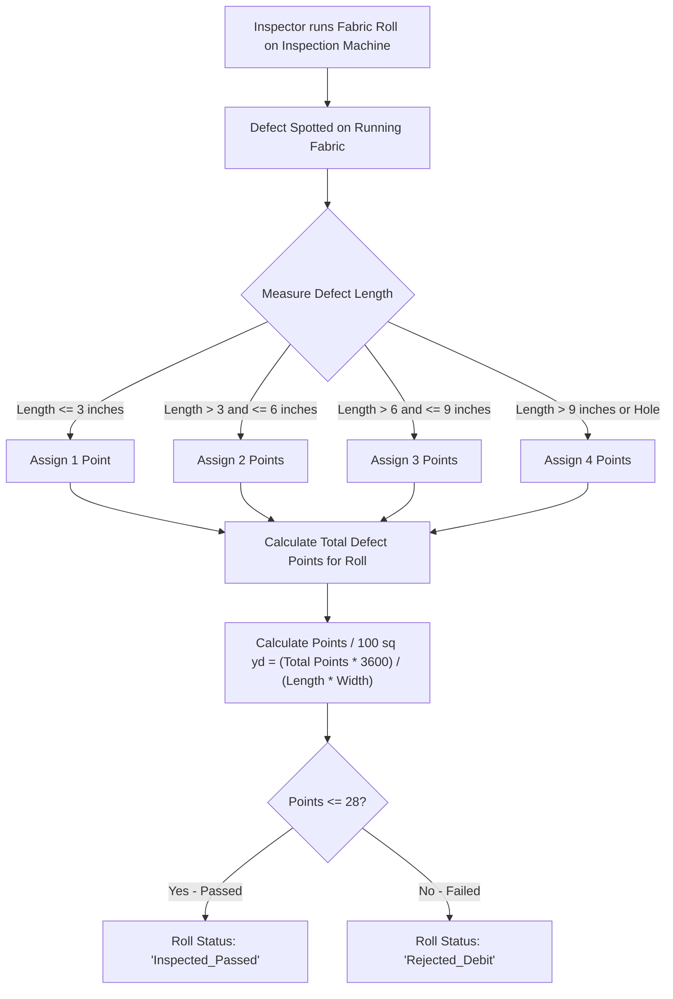
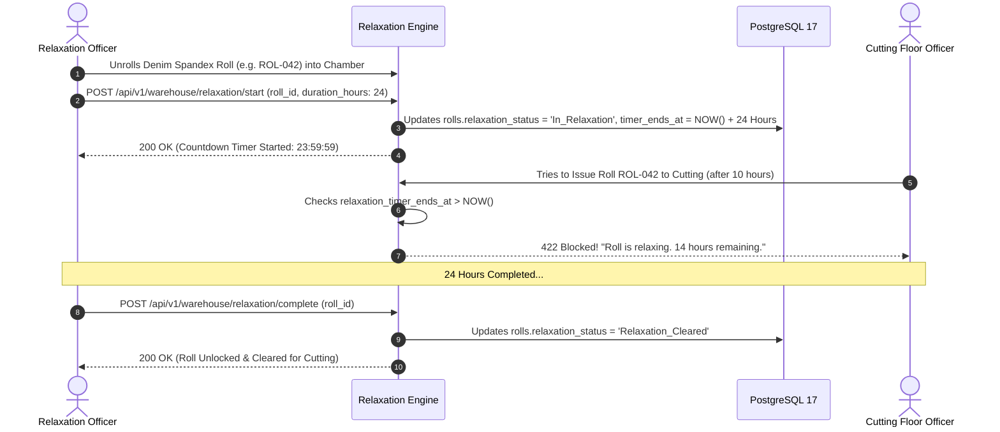
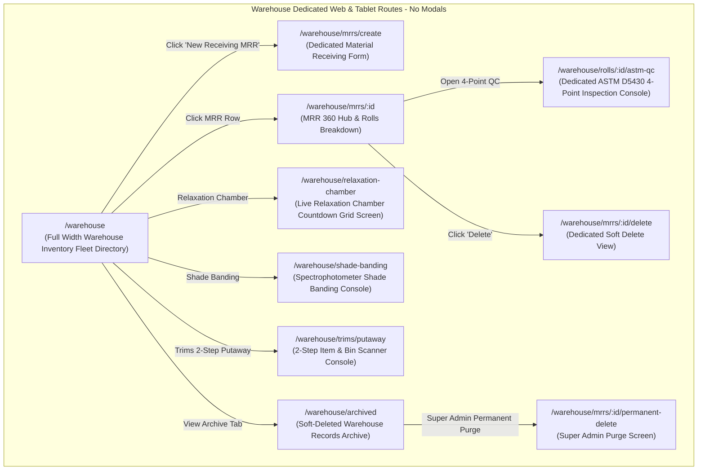
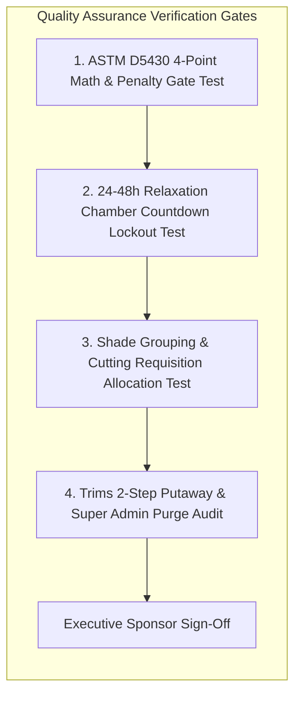

# Software Requirements Specification (SRS)
## Module 14: Fabric & Trims Warehouse Management, In-House QC & Relaxation Engine
### প্রজেক্ট: TraceFlow RMG — Precision Fabric-to-Freight Garment Intelligence
**ডকুমেন্ট রেফারেন্স:** `TFRMG-SRS-MOD14-V2.0`  
**ডকুমেন্ট ভার্সন:** 2.0 (Global Tier-1 Enterprise Production Edition — Raw Material Inception & Quality Foundation)  
**স্ট্যান্ডার্ড কমপ্লায়েন্স:** ISO/IEC/IEEE 29148:2018, ASTM D5430 (4-Point Fabric Inspection System), AATCC Color Fastness & Shrinkage Standards  
**স্ট্যাটাস:** Approved & Production-Ready  
**টার্গেট আর্কিটেকচার:** Laravel 13 (Double-Entry Inventory & ASTM 4-Point Engine) + React 19 / Vite (Dedicated Store & Inspection SPA) + PostgreSQL 17 + Redis 7  

---

## ১. ডকুমেন্ট গভর্নেন্স ও সংস্করণ নিয়ন্ত্রণ (Document Governance & Control)

### ১.১ সংস্করণ ইতিহাস (Revision History)
| ভার্সন | তারিখ | পর্যালোচনাকারী | পরিবর্তনের বিবরণ ও পরিধি |
|---|---|---|---|
| `v1.0` | 2026-09-02 | Lead Business Analyst | ইনভেন্টরি ও স্টোর ম্যানেজমেন্টের প্রাথমিক ড্রাফট। |
| `v2.0` | 2026-09-02 | Principal Enterprise Architect | **100% এন্টারপ্রাইজ রূপান্তর (Cutting Pre-Requisite Foundation):** ম্যাটেরিয়াল রিসিভিং রিপোর্ট (MRR/GRN), ইউনিক ফেব্রিক রোল বারকোডিং, আন্তর্জাতিক ASTM D5430 4-পয়েন্ট ফেব্রিক কোয়ালিটি ইন্সপেকশন ও ল্যাব টেস্ট (GSM, শ্রিংকেজ %), ২৪ থেকে ৪৮ ঘণ্টার ফেব্রিক রিল্যাক্সেশন চেম্বার কাউন্টডাউন টাইমার লকআউট গেট, স্পেকট্রোফোটোমিটার শেড গ্রুপিং (Group A/B/C), ট্রিমস ও ফিনিশড গুডস ২-স্টেপ বিন পুটঅ্যাওয়ে, টু-টিয়ার ডিলিশন গভর্নেন্স (Super Admin Hard Delete Guard), কমপ্লিট PostgreSQL 17 DDL এবং RTM সংযোজন। |

### ১.২ অনুমোদনকারী ব্যক্তিবর্গ (Sign-Off & Approvals)
- **Executive Sponsor / Project Owner:** Executive Sponsor, RMG Systems
- **Lead Solution Architect:** AI Solution Architect
- **Head of Fabric & Raw Material Supply Chain:** Warehouse Logistics & Sourcing Division
- **Head of Textile Quality & Lab Testing:** Physical & Chemical Fabric Lab Division
- **General Manager (Factory Operations):** Manufacturing Plant Operations

---

## ২. নির্বাহী সারসংক্ষেপ ও কৌশলগত উদ্দেশ্য (Executive Summary & Strategic Scope)

### ২.১ কৌশলগত প্রেক্ষাপট (Strategic Context)
গার্মেন্টস ম্যানুফ্যাকচারিং লাইফসাইকেলে **ফেব্রিক ও ট্রিমস গুদাম (Raw Material Warehouse)** হলো সম্পূর্ণ কারখানার ভিত্তিপ্রস্তর। পোশাক কাটার (Module 05: Cutting) পূর্বেই কাপড় মিল থেকে ইন-হাউজ হতে হয়, আন্তর্জাতিক কোয়ালিটি স্ট্যান্ডার্ডে অডিট হতে হয় এবং স্প্যান্ডেক্স/ইলাস্টেন কাপড়ের ইলাস্টিক টান মুক্ত করার জন্য সুনির্দিষ্ট সময় রিল্যাক্সেশন চেম্বারে বিশ্রাম দিতে হয়।

গুদাম ব্যবস্থাপনায় নিখুঁত ট্রেসিবিলিটি না থাকলে নিম্নলিখিত মারাত্মক বিপর্যয় ঘটে:
1. **The Relaxation Disaster (কাটার পর কাপড় ছোট হয়ে যাওয়া):** কাপড় রোল করার সময় যে টান তৈরি হয়, তা কাটার আগে ২৪-৪৮ ঘণ্টা রিল্যাক্স না করলে কাটার পর পার্টস স্বয়ংক্রিয়ভাবে ৫% থেকে ৮% সংকুচিত হয়ে যায়; ফলে পুরো অর্ডারের মেজারমেন্ট স্পেক আউট হয়ে সম্পূর্ণ কাটিং বাতিল হয়।
2. **Shade Variation in Garments:** একই অর্ডারে শেড ব্যান্ডিং না করে ভিন্ন ভিন্ন রোলের কাপড় একসাথে কাটলে পোশাকের এক হাত এক শেড এবং বডি অন্য শেড হয়ে বায়ার রিজেকশন ঘটে।
3. **Defective Fabric Wastage:** কাপড়ে সুতা ছেঁড়া, বাও (Bow), স্ক্রু বা তেলের দাগ আগে চিহ্নিত না করে কাটলে শত শত ডিফেক্টিভ পার্টস সেলাই লাইনে গিয়ে লাইন বন্ধ করে দেয়।

**Module 14: Fabric & Trims Warehouse Engine** এর দর্শন হলো:
> **"Zero Uninspected Fabric to Table, 100% Tension-Free Relaxation, Millimeter Inventory Accuracy."**

```mermaid
graph TB
    subgraph Raw Material Inception Engine (Module 14)
        direction TB
        TRUCK[Supplier Delivery Truck arrives at Factory Gate] --> MRR[Material Receiving Report - MRR & Roll Barcode Tagging]
        MRR --> ASTM_QC{ASTM D5430 4-Point Fabric Inspection Machine}
        
        ASTM_QC -->|Points > 28 / 100 sq yd| REJECT_SUPPLIER[Rejected - Return to Mill & Debit Note]
        ASTM_QC -->|Points <= 28 - Passed| LAB_TEST[Lab Tests: Actual GSM, Color Fastness, Shrinkage %]
        
        LAB_TEST --> SHADE_BAND[Shade Banding & Spectrophotometer Grouping: Lot A/B/C]
        SHADE_BAND --> RELAX_CHAMBER[24-48 Hour Relaxation Chamber: Digital Countdown Timer]
        
        RELAX_CHAMBER --> TIMER_GATE{Relaxation Timer Reached 00:00:00?}
        TIMER_GATE -->|Timer Running| LOCKED[Hard Locked! Cannot Issue to Cutting]
        TIMER_GATE -->|Timer Completed| CUT_ISSUE[Authorized Issue Requisition to Module 05 Cutting]
    end
```

---

## ৩. অলঙ্ঘনীয় এন্টারপ্রাইজ আর্কিটেকচারাল নিয়মাবলি (Non-Negotiable Architecture Directives)

প্রজেক্টের গ্লোবাল রুলস এবং এন্টারপ্রাইজ কোয়ালিটি নিশ্চিত করতে নিচের নিয়মগুলো ১০০% অলঙ্ঘনীয়:

### ৩.১ নো মোডালস নীতিমালা (STRICT No Modals / No Popups Rule)
- **জিরো মোডাল পলিসি:** পুরো গুদাম ও ফেব্রিক ইন্সপেকশন মডিউলে কোনো ফর্ম, কনফার্মেশন, MRR এডিটর, ৪-পয়েন্ট ডিফেক্ট লগ, রিল্যাক্সেশন টাইমার ভিউ, বিন পুটঅ্যাওয়ে, বা সাব-স্ক্রিনের জন্য `Modal`, `Dialog`, `Popup`, `Lightbox`, বা `Drawer-over-backdrop` কঠোরভাবে নিষিদ্ধ।
- **ডেডিকেটেড রুট আর্কিটেকচার:** ম্যাটেরিয়াল রিসিভিং ডিরেক্টরি, ASTM D5430 ৪-পয়েন্ট ইন্সপেকশন কনসোল, ল্যাব টেস্ট পেজ, রিল্যাক্সেশন চেম্বার লাইভ মনিটর, কাটিং রোল ইস্যু রিকুইজিশন, ট্রিমস বিন পুটঅ্যাওয়ে, এবং ডিলিট কনফার্মেশন—প্রতিটি ইন্টারঅ্যাকশন একটি সুনির্দিষ্ট ব্রাউজার ইউআরএল এবং ডেডিকেটেড ফুল-স্ক্রিন ভিউতে (Full-Screen Dedicated View) লোড হবে।
- **নেভিগেশন স্ট্যাক:** প্রতিটি পেজে স্ট্যান্ডার্ড ব্যাক বাটন এবং স্ট্রাকচার্ড ব্রেডক্রাম্ব (`Dashboard > Warehouse > MRR-042 > ASTM 4-Point Inspection Console`) থাকতে হবে যাতে ব্রাউজারের নেটিভ Forward/Back বাটন স্বাভাবিকভাবে কাজ করে এবং ডিপ-লিংক শেয়ারিং সম্ভব হয়।

### ৩.২ পিউর সার্ভার-সাইড ভ্যালিডেশন স্ট্যান্ডার্ড (Pure Server-Side Validation)
- **জিরো ক্লায়েন্ট-সাইড HTML5 ভ্যালিডেশন:** ফ্রন্টএন্ডের কোনো `<form>` বা `<input>` ফিল্ডে ব্রাউজারের ডিফল্ট HTML5 ভ্যালিডেশন অ্যাট্রিবিউট (`required`, `minlength`, `maxlength`, `pattern`, ইত্যাদি) দেওয়া যাবে না। ব্রাউজারের বিল্ট-ইন টুলটিপ পপআপ সম্পূর্ণ নিষিদ্ধ।
- **বাধ্যতামূলক `noValidate`:** সমস্ত ফ্রন্টএন্ড ফর্মে `<form noValidate>` স্পষ্টভাবে যুক্ত থাকতে হবে।
- **একীভূত এরর কন্ট্রাক্ট:** সমস্ত ৪-পয়েন্ট পেনাল্টি হিসাব, রিল্যাক্সেশন টাইম গার্ড এবং স্টক লেজার ভ্যালিডেশন ব্যাকএন্ড Laravel `FormRequest` ক্লাসের মাধ্যমে পিউর সার্ভার সাইডে ঘটবে। ইনপুট ভুল হলে সার্ভার থেকে `422 Unprocessable Content` স্ট্যান্ডার্ড RFC 7807 কমপ্লায়েন্ট JSON এরর পাঠানো হবে।
- **ইনলাইন এরর রেন্ডারিং:** ফ্রন্টএন্ড স্বয়ংক্রিয়ভাবে রেসপন্সের ফিল্ড নেম ম্যাপ করে সংশ্লিষ্ট ইনপুট বক্সের ঠিক নিচে ক্রিস্প লাল রঙে এরর বার্তা রেন্ডার করবে।

### ৩.৩ ফ্ল্যাট এবং ক্রিস্প ডিজাইন স্ট্যান্ডার্ড (Flat Solid UI Standard)
- **নো গ্রেডিয়েন্ট পলিসি:** কোনো বাটন, কার্ড, হেডার বা সাইডবারে কোনো ধরণের গ্রেডিয়েন্ট কালার ব্যবহার করা যাবে না।
- **সলিড ডিজাইন টোকেনস:** সকল অ্যাকশন বাটন ক্রিস্প ও ফ্ল্যাট সলিড রঙে গঠিত হবে (যেমন: Primary `#2563EB`, Danger `#DC2626`, Success `#16A34A`, Neutral `#475569`, Warning `#D97706`)।
- **১০০% ইংরেজি ইউআই:** ইউজার ইন্টারফেসের সমস্ত লেবেল, ফিল্ড নেম, কলাম হেডার, অ্যাকশন বাটন এবং সিস্টেম নোটিফিকেশন ১০০% প্রফেশনাল আন্তর্জাতিক ইংরেজি ভাষায় (English) হবে।

### ৩.৪ দ্বি-স্তরবিশিষ্ট ডিলিশন গভর্নেন্স (Two-Tier Deletion Architecture)
- **সফট ডিলিট (Soft Delete):** গুদাম ম্যানেজার শুধুমাত্র ড্রাফট বা ভুলবশত এন্ট্রি করা খালি MRR সফট ডিলিট করতে পারবেন (`deleted_at = NOW()`), যা ট্র্যাশ আর্কাইভে জমা হবে।
- **পার্মানেন্ট হার্ড ডিলিট (STRICT Super Admin Only):** ডাটাবেস থেকে স্থায়ীভাবে রো মুছে ফেলার ক্ষমতা **কেবলমাত্র `Super Admin` এর থাকবে**।
- **প্রোডাকশন ও ম্যানুফ্যাকচারিং প্রোটেকশন গার্ড (Referential Check):** যদি কোনো ফেব্রিক রোল অলরেডি কাটিং ফ্লোরে (Module 05) কেটে ফেলা হয়ে থাকে বা ট্রিমস সেলাই লাইনে ইস্যু হয়ে থাকে, তবে সিস্টেম পার্মানেন্ট ডিলিট **সম্পূর্ণ ব্লক** করবে এবং `409 Conflict` রিটার্ন করবে।

---

## ৪. ইউজার পারসোনা ও এক্সেস হায়ারার্কি (User Personas & Scoping)

| পারসোনা (Persona) | ইন্টারফেস ও ডিভাইস | প্রমাণীকরণ মাধ্যম (Auth Method) | প্রিভিলেজ বাউন্ডারি (Privilege Scope) |
|---|---|---|---|
| **Warehouse Manager / In-Charge**| Web Browser (Desktop) | Emp ID / Username + Password | MRR অনুমোদন, কাটিং রোল ইস্যু রিকুইজিশন সাইন-অফ, সফট ডিলিট। |
| **Fabric Inward Receiving Clerk** | Floor Tablet / Barcode Printer | Hardware Paired Station Token | কাপড় আনলোডিং, রোল ওজন/গজ পরিমাপ, ইউনিক রোল বারকোড প্রিন্ট। |
| **Fabric QC Inspector** | Fabric Inspection Machine Touch| Emp ID / Username + Password | ASTM D5430 ৪-পয়েন্ট ডিফেক্ট লগিং, রোল পাস/রিজেক্ট রায়। |
| **Textile Lab Technician** | Web Browser / Tablet | Emp ID / Username + Password | জিএসএম, শ্রিংকেজ % ও কালার ফাস্টনেস ল্যাব ডাটা ইনপুট। |
| **Relaxation Chamber Officer** | Floor Tablet / Touch Screen | Station Paired Device Token | কাপড় আন-রোলিং, রিল্যাক্সেশন টাইমার শুরু ও সমাপ্তি সাইন-অফ। |
| **Trims Storekeeper** | Industrial Handheld (Scanner) | Hardware Paired Device Token | ২-স্টেপ বিন পুটঅ্যাওয়ে (Scan Item -> Scan Bin), স্টক ট্র্যাকিং। |
| **Super Admin** | Web Browser (Desktop) | Username + Password + TOTP 2FA | গ্লোবাল বাইপাস, ইমার্জেন্সি রিল্যাক্সেশন ওভাররাইড, পার্মানেন্ট পার্জ। |

---

## ৫. বিস্তারিত ফাংশনাল রিকোয়ারমেন্টস (Detailed Functional Specifications)

### ৫.১ সাব-মডিউল: ম্যাটেরিয়াল রিসিভিং ও ইউনিক রোল বারকোডিং (MRR Engine)

#### ৫.১.১ স্পেসিফিকেশন ও ট্র্যাকিং
- **REQ-STR-MRR-001 (Material Receiving Report Creation):**
  - সাপ্লায়ার চালান বা কমার্শিয়াল প্যাকিং লিস্ট অনুযায়ী সিস্টেমে MRR (`MRR-2026-XXXX`) তৈরি হবে।
  - প্রতিটি লট ও চালানের বিপরীতে মোট রিসিভড রোল সংখ্যা, সরবরাহকৃত মোট গজ/মিটার এবং গ্রস ওজন লগ হবে।
- **REQ-STR-MRR-002 (Unique Fabric Roll Barcode Passport):**
  - প্রতিটি একক ফেব্রিক রোলের গায়ে একটি ওয়াটারপ্রুফ থার্মাল বারকোড টিকিট সাঁটানো হবে (`ROL-2026-XXXXXX`)।
  - রোলের ডিজিটাল মেটাডাটা: সাপ্লায়ার মিল রোল নম্বর, ফেব্রিক কনস্ট্রাকশন, কালার ও শেড লট, ইনভয়েস গজ, প্রকৃত মাপা গজ, উইডথ (Width in inches) এবং ওজন (kg)।

---

### ৫.২ সাব-মডিউল: আন্তর্জাতিক ASTM D5430 ৪-পয়েন্ট ফেব্রিক ইন্সপেকশন (4-Point Inspection)



#### ৫.২.১ স্পেসিফিকেশন ও গাণিতিক ফর্মুলা
- **REQ-STR-ASTM-001 (Standard 4-Point Penalty Rules):**
  - কাপড়ে পাওয়া ত্রুটির আকারের ভিত্তিতে আন্তর্জাতিক পেনাল্টি পয়েন্ট:
    - ত্রুটির দৈর্ঘ্য ৩ ইঞ্চি পর্যন্ত: **১ পয়েন্ট**
    - ত্রুটির দৈর্ঘ্য ৩ থেকে ৬ ইঞ্চি: **২ পয়েন্ট**
    - ত্রুটির দৈর্ঘ্য ৬ থেকে ৯ ইঞ্চি: **৩ পয়েন্ট**
    - ত্রুটির দৈর্ঘ্য ৯ ইঞ্চির বেশি: **৪ পয়েন্ট**
    - কাপড়ে ছিদ্র বা হোল (যেকোনো ছিদ্র): **৪ পয়েন্ট**
  - একই লিনিয়ার গজে সর্বোচ্চ পেনাল্টি পয়েন্ট কখনোই ৪ এর বেশি হবে না।
- **REQ-STR-ASTM-002 (Points per 100 Square Yards Mathematical Formula):**
  - প্রতিটি রোলের জন্য আন্তর্জাতিক সূত্র অনুযায়ী পেনাল্টি রেট গণনা:
    $$\text{Points per 100 Sq. Yards} = \frac{\text{Total Defect Points} \times 36 \times 100}{\text{Inspected Length (Yards)} \times \text{Fabric Width (Inches)}}$$
- **REQ-STR-ASTM-003 (Strict Pass/Reject Threshold Gate):**
  - বায়ারের স্ট্যান্ডার্ড অনুযায়ী (সাধারণত সর্বোচ্চ **২০ থেকে ২৮ পয়েন্ট** প্রতি ১০০ বর্গগজে):
    - Points $\le 28$: রোলটি **`Inspected_Passed`** হবে।
    - Points $> 28$: রোলটি **`Rejected_Debit`** হবে এবং সাপ্লায়ারকে ফেরত পাঠিয়ে স্বয়ংক্রিয় ডেবিট নোট জারি করা হবে।

---

### ৫.৩ সাব-মডিউল: ল্যাব টেস্ট ও শেড ব্যান্ডিং গ্রুপিং (Lab Tests & Shade Banding)

#### ৫.৩.১ স্পেসিফিকেশন ও ল্যাব ডাটাবেস
- **REQ-STR-LAB-001 (Physical & Chemical Lab Audits):**
  - প্রকৃত ফেব্রিক ওজন (Actual GSM vs Required GSM, e.g. 280 GSM $\pm 3\%$)।
  - ল্যাব শ্রিংকেজ পার্সেন্টেজ: দৈর্ঘ্য শ্রিংকেজ (Lengthwise %) এবং প্রস্থ শ্রিংকেজ (Widthwise %)।
  - কালার ফাস্টনেস (Color Fastness to Washing & Rubbing e.g. Grade 4.0)।
- **REQ-STR-SHD-002 (Spectrophotometer Shade Banding):**
  - ডিজিটাল স্পেকট্রোফোটোমিটার বা লাইট বক্সে (D65 daylight) প্রতিটি রোলের শেড মিলিয়ে শেড গ্রুপে বিন্যস্ত করা: **Shade Group A**, **Shade Group B**, **Shade Group C**।
  - কাটিং ফ্লোরে একই মার্কারের নিচে শুধুমাত্র একই শেড গ্রুপের রোল সরবরাহ করা হবে।

---

### ৫.৪ সাব-মডিউল: ২৪ থেকে ৪৮ ঘণ্টার ফেব্রিক রিল্যাক্সেশন চেম্বার (Relaxation Engine)

কাপড় বোনার পর এবং মিল থেকে রোল করার কারণে সৃষ্ট অভ্যন্তরীণ ইলাস্টিক টান দূরীকরণ।



#### ৫.৪.১ স্পেসিফিকেশন ও কাউন্টডাউন টাইমার লকআউট
- **REQ-STR-RLX-001 (Mandatory Relaxation Durations):**
  - সাধারণ ওভেন সুতি কাপড়: **২৪ ঘণ্টা**।
  - ডেনিম, টুইল এবং স্প্যান্ডেক্স/ইলাস্টেন মিশ্রিত কাপড়: **৪৮ ঘণ্টা**।
  - কাপড়কে রোল থেকে খুলে একর্ডিয়ন লুপে (Loose Accordion Waves) রিল্যাক্সেশন র‍্যাকে বিছিয়ে রাখা হবে।
- **REQ-STR-RLX-002 (System Hard Lockout Gate):**
  - সিস্টেমে রোলের বিপরীতে ডিজিটাল কাউন্টডাউন টাইমার চলবে।
  - যতক্ষণ পর্যন্ত টাইমার `00:00:00` এ না পৌঁছাবে এবং রিল্যাক্সেশন অফিসার সাইন-অফ না করবেন, ততক্ষণ পর্যন্ত সিস্টেম **Module 05 (Cutting Floor)** এর রিকুইজিশনে ওই রোলটি সিলেক্ট বা ইস্যু করা **১০০% কঠোরভাবে ব্লক রাখবে**।

---

### ৫.৫ সাব-মডিউল: ট্রিমস ও গুডস ২-স্টেপ বিন পুটঅ্যাওয়ে (Bin Management Engine)

বোতাম, চেইন, লেবেল, সুতার কোণ এবং ফিনিশড কার্টনের সঠিক গুদাম লোকেশন ট্র্যাকিং।

#### ৫.৫.১ স্পেসিফিকেশন ও টু-স্টেপ স্ক্যান
- **REQ-STR-BIN-001 (The 2-Step Barcode Scan Protocol):**
  - স্টোরকিপার প্রথমে আইটেম বা কার্টনের বারকোড স্ক্যান করবেন।
  - এরপর গুদামের সংশ্লিষ্ট তাকের **Rack/Bin Barcode (`WH-A-R02-B14`)** স্ক্যান করবেন।
  - সিস্টেম স্বয়ংক্রিয়ভাবে ডাটাবেসে আইটেমের ফিজিক্যাল লোকেশন আপডেট করবে।
- **REQ-STR-STK-002 (Zero Negative Stock Enforcement):**
  - গুদামে ১০০ কোণ সুতা থাকলে সেলাই লাইনে ১০৫ কোণ সুতা ইস্যুর কোনো এন্ট্রি সিস্টেম গ্রহণ করবে না (`CHECK (quantity_available >= 0)`)। কোনো অবস্থাতেই স্টক ঋণাত্মক হতে পারবে না।

---

## ৬. প্রোডাকশন-গ্রেড ডাটাবেস আর্কিটেকচার ও DDL (Database Engineering)

নিচে PostgreSQL 17 এর জন্য সম্পূর্ণ প্রোডাকশন-রেডি DDL স্ক্রিপ্ট দেওয়া হলো। এতে ওয়্যারহাউস লোকেশন, MRR, ফেব্রিক রোল, ৪-পয়েন্ট ইন্সপেকশন, রিল্যাক্সেশন লগ এবং ট্রিমস ইনভেন্টরির টেবিলসমূহ অন্তর্ভুক্ত রয়েছে।

### ৬.১ PostgreSQL 17 Production Schema (Complete DDL)

```sql
-- Enable Cryptographic Extension for UUID v4
CREATE EXTENSION IF NOT EXISTS "pgcrypto";

-- ----------------------------------------------------------------------
-- 1. Table: warehouse_locations (Racks, Shelves & Bins Master)
-- ----------------------------------------------------------------------
CREATE TABLE warehouse_locations (
    id UUID PRIMARY KEY DEFAULT gen_random_uuid(),
    location_code VARCHAR(40) NOT NULL,          -- e.g. WH-A-R02-B14
    zone VARCHAR(20) NOT NULL,                   -- Fabric_Zone, Trims_Zone, Finished_Goods_Zone
    aisle VARCHAR(20) NOT NULL,
    rack VARCHAR(20) NOT NULL,
    bin VARCHAR(20) NOT NULL,
    is_active BOOLEAN NOT NULL DEFAULT TRUE,
    created_at TIMESTAMPTZ NOT NULL DEFAULT CURRENT_TIMESTAMP
);

CREATE UNIQUE INDEX uq_wh_location_code ON warehouse_locations (UPPER(location_code));
CREATE INDEX idx_wh_locations_zone ON warehouse_locations (zone);

-- ----------------------------------------------------------------------
-- 2. Table: material_receipt_reports (MRR / Goods Receipt Header)
-- ----------------------------------------------------------------------
CREATE TABLE material_receipt_reports (
    id UUID PRIMARY KEY DEFAULT gen_random_uuid(),
    mrr_no VARCHAR(60) NOT NULL,                  -- e.g. MRR-2026-0089
    supplier_name VARCHAR(150) NOT NULL,
    challan_invoice_no VARCHAR(80) NOT NULL,
    po_id UUID REFERENCES purchase_orders(id) ON DELETE RESTRICT,
    material_type VARCHAR(40) NOT NULL,           -- Fabric, Trims, Accessories
    total_rolls_packages INTEGER NOT NULL CHECK (total_rolls_packages > 0),
    total_received_quantity NUMERIC(10, 2) NOT NULL CHECK (total_received_quantity > 0),
    uom VARCHAR(20) NOT NULL,                     -- Yards, Meters, Kgs, Gross, Pcs
    received_by UUID NOT NULL REFERENCES users(id) ON DELETE RESTRICT,
    status VARCHAR(30) NOT NULL DEFAULT 'Received', -- Received, Under_Inspection, Accepted, Rejected
    received_at TIMESTAMPTZ NOT NULL DEFAULT CURRENT_TIMESTAMP,
    created_at TIMESTAMPTZ NOT NULL DEFAULT CURRENT_TIMESTAMP,
    updated_at TIMESTAMPTZ NOT NULL DEFAULT CURRENT_TIMESTAMP,
    deleted_at TIMESTAMPTZ
);

CREATE UNIQUE INDEX uq_mrr_no ON material_receipt_reports (UPPER(mrr_no)) WHERE deleted_at IS NULL;
CREATE INDEX idx_mrr_po_id ON material_receipt_reports (po_id);
CREATE INDEX idx_mrr_status ON material_receipt_reports (status);

-- ----------------------------------------------------------------------
-- 3. Table: fabric_rolls (Individual Roll Digital Passport)
-- ----------------------------------------------------------------------
CREATE TABLE fabric_rolls (
    id UUID PRIMARY KEY DEFAULT gen_random_uuid(),
    roll_barcode VARCHAR(60) NOT NULL,            -- e.g. ROL-2026-00421
    mrr_id UUID NOT NULL REFERENCES material_receipt_reports(id) ON DELETE RESTRICT,
    mill_roll_no VARCHAR(80) NOT NULL,
    lot_batch_no VARCHAR(80) NOT NULL,
    color_id UUID NOT NULL REFERENCES colors(id) ON DELETE RESTRICT,
    invoice_yards NUMERIC(8, 2) NOT NULL CHECK (invoice_yards > 0),
    actual_measured_yards NUMERIC(8, 2) NOT NULL CHECK (actual_measured_yards > 0),
    gross_weight_kg NUMERIC(6, 2) NOT NULL CHECK (gross_weight_kg > 0),
    usable_width_inches NUMERIC(5, 2) NOT NULL CHECK (usable_width_inches > 0),
    actual_gsm NUMERIC(5, 1),
    shade_group VARCHAR(10),                      -- A, B, C
    inspection_status VARCHAR(30) NOT NULL DEFAULT 'Pending', -- Pending, Inspected_Passed, Rejected_Debit
    relaxation_status VARCHAR(30) NOT NULL DEFAULT 'Not_Started', -- Not_Started, In_Relaxation, Relaxation_Cleared
    current_location_id UUID REFERENCES warehouse_locations(id) ON DELETE SET NULL,
    is_issued_to_cutting BOOLEAN NOT NULL DEFAULT FALSE,
    created_at TIMESTAMPTZ NOT NULL DEFAULT CURRENT_TIMESTAMP,
    updated_at TIMESTAMPTZ NOT NULL DEFAULT CURRENT_TIMESTAMP,
    deleted_at TIMESTAMPTZ
);

CREATE UNIQUE INDEX uq_fabric_roll_barcode ON fabric_rolls (UPPER(roll_barcode)) WHERE deleted_at IS NULL;
CREATE INDEX idx_fabric_rolls_mrr ON fabric_rolls (mrr_id);
CREATE INDEX idx_fabric_rolls_color ON fabric_rolls (color_id);
CREATE INDEX idx_fabric_rolls_statuses ON fabric_rolls (inspection_status, relaxation_status);

-- ----------------------------------------------------------------------
-- 4. Table: fabric_inspection_logs (ASTM D5430 4-Point Audit Records)
-- ----------------------------------------------------------------------
CREATE TABLE fabric_inspection_logs (
    id UUID PRIMARY KEY DEFAULT gen_random_uuid(),
    fabric_roll_id UUID NOT NULL REFERENCES fabric_rolls(id) ON DELETE CASCADE,
    inspected_yards NUMERIC(8, 2) NOT NULL CHECK (inspected_yards > 0),
    penalty_points_1 SMALLINT NOT NULL DEFAULT 0,
    penalty_points_2 SMALLINT NOT NULL DEFAULT 0,
    penalty_points_3 SMALLINT NOT NULL DEFAULT 0,
    penalty_points_4 SMALLINT NOT NULL DEFAULT 0,
    total_penalty_points SMALLINT GENERATED ALWAYS AS (penalty_points_1 + penalty_points_2 + penalty_points_3 + penalty_points_4) STORED,
    points_per_100_sq_yards NUMERIC(6, 2) NOT NULL,
    verdict VARCHAR(20) NOT NULL,                 -- Passed, Rejected
    inspector_id UUID NOT NULL REFERENCES users(id) ON DELETE RESTRICT,
    remarks TEXT,
    inspected_at TIMESTAMPTZ NOT NULL DEFAULT CURRENT_TIMESTAMP
);

CREATE INDEX idx_fabric_qc_roll ON fabric_inspection_logs (fabric_roll_id);
CREATE INDEX idx_fabric_qc_verdict ON fabric_inspection_logs (verdict);

-- ----------------------------------------------------------------------
-- 5. Table: fabric_relaxation_logs (Chamber Countdown Timer Ledger)
-- ----------------------------------------------------------------------
CREATE TABLE fabric_relaxation_logs (
    id UUID PRIMARY KEY DEFAULT gen_random_uuid(),
    fabric_roll_id UUID NOT NULL REFERENCES fabric_rolls(id) ON DELETE CASCADE,
    chamber_rack_no VARCHAR(40) NOT NULL,
    required_duration_hours SMALLINT NOT NULL CHECK (required_duration_hours >= 12),
    timer_started_at TIMESTAMPTZ NOT NULL DEFAULT CURRENT_TIMESTAMP,
    timer_ends_at TIMESTAMPTZ NOT NULL,
    cleared_at TIMESTAMPTZ,
    cleared_by UUID REFERENCES users(id) ON DELETE SET NULL,
    is_cleared BOOLEAN NOT NULL DEFAULT FALSE,
    created_at TIMESTAMPTZ NOT NULL DEFAULT CURRENT_TIMESTAMP
);

CREATE INDEX idx_relaxation_roll ON fabric_relaxation_logs (fabric_roll_id);
CREATE INDEX idx_relaxation_status ON fabric_relaxation_logs (is_cleared);

-- ----------------------------------------------------------------------
-- 6. Table: trims_inventory_ledgers (Double-Entry Item Stock)
-- ----------------------------------------------------------------------
CREATE TABLE trims_inventory_ledgers (
    id UUID PRIMARY KEY DEFAULT gen_random_uuid(),
    item_code VARCHAR(60) NOT NULL,               -- e.g. TRM-BTN-01, TRM-ZIP-04
    item_name VARCHAR(120) NOT NULL,
    po_id UUID REFERENCES purchase_orders(id) ON DELETE RESTRICT,
    transaction_type VARCHAR(20) NOT NULL,        -- In_GRN, Out_Issue, Return_Adjust
    quantity NUMERIC(10, 2) NOT NULL CHECK (quantity > 0),
    balance_after NUMERIC(10, 2) NOT NULL CHECK (balance_after >= 0), -- Zero Negative Stock Constraint
    location_id UUID REFERENCES warehouse_locations(id) ON DELETE RESTRICT,
    transacted_by UUID NOT NULL REFERENCES users(id) ON DELETE RESTRICT,
    transacted_at TIMESTAMPTZ NOT NULL DEFAULT CURRENT_TIMESTAMP
);

CREATE INDEX idx_trims_item_code ON trims_inventory_ledgers (item_code);
CREATE INDEX idx_trims_po_id ON trims_inventory_ledgers (po_id);
```

---

## ৭. সম্পূর্ণ এপিআই কন্ট্রাক্ট স্পেসিফিকেশন (Exhaustive API Contracts)

### ৭.১ সাধারণ আর্কিটেকচার ও স্ট্যান্ডার্ডস
- **অথেনটিকেশন:** `Authorization: Bearer <sanctum_token>`
- **কমন হেডার্স:** `Accept: application/json`, `Content-Type: application/json`
- **স্ট্যান্ডার্ড ফিল্টারিং:**
  `GET /api/v1/warehouse/rolls?po_id={uuid}&relaxation_status=Relaxation_Cleared`

---

### ৭.২ ASTM ৪-পয়েন্ট ও রিল্যাক্সেশন এন্ডপয়েন্টস

#### ৭.২.১ ASTM D5430 ৪-পয়েন্ট ইন্সপেকশন রেজাল্ট সাবমিশন
- **মেথড ও ইউআরএল:** `POST /api/v1/warehouse/rolls/{id}/astm-qc`
- **রিকোয়েস্ট বডি:**
  ```json
  {
    "inspected_yards": 100.0,
    "penalty_points_1": 4,
    "penalty_points_2": 2,
    "penalty_points_3": 1,
    "penalty_points_4": 1,
    "actual_gsm": 285.0,
    "remarks": "Minor slub found at yard 45. Overall excellent fabric."
  }
  ```
- **সাকসেস রেসপন্স (`201 Created` — Passed Case):**
  ```json
  {
    "success": true,
    "status_code": 201,
    "message": "Roll passed ASTM D5430 inspection (14.40 points/100 sq yd <= 28 threshold).",
    "data": {
      "roll_id": "r100a982-192a-4f90-8800-291740011283",
      "total_penalty_points": 12,
      "points_per_100_sq_yards": 14.40,
      "verdict": "Passed",
      "inspection_status": "Inspected_Passed"
    }
  }
  ```

---

#### ৭.২.২ রিল্যাক্সেশন চেম্বার টাইমার শুরু করা (Start Relaxation Countdown)
- **মেথড ও ইউআরএল:** `POST /api/v1/warehouse/rolls/{id}/start-relaxation`
- **রিকোয়েস্ট বডি:**
  ```json
  {
    "chamber_rack_no": "CHAMBER-RACK-04",
    "required_duration_hours": 24
  }
  ```
- **সাকসেস রেসপন্স (`200 OK` — Timer Started & Locked for Cutting):**
  ```json
  {
    "success": true,
    "status_code": 200,
    "message": "Relaxation countdown timer started (24 hours). Roll locked from cutting issuance.",
    "data": {
      "roll_id": "r100a982-192a-4f90-8800-291740011283",
      "timer_started_at": "2026-09-02T18:00:00Z",
      "timer_ends_at": "2026-09-03T18:00:00Z",
      "relaxation_status": "In_Relaxation",
      "cutting_locked": true
    }
  }
  ```

---

### ৭.৩ ট্রিমস ২-স্টেপ বিন পুটঅ্যাওয়ে এন্ডপয়েন্ট

#### ৭.৩.১ আইটেম স্ক্যান ও বিন অ্যাসাইনমেন্ট (2-Step Scan)
- **মেথড ও ইউআরএল:** `POST /api/v1/warehouse/trims/putaway`
- **রিকোয়েস্ট বডি:**
  ```json
  {
    "item_code": "TRM-BTN-01",
    "location_code": "WH-A-R02-B14",
    "quantity": 5000
  }
  ```
- **সাকসেস রেসপন্স (`200 OK`):**
  ```json
  {
    "success": true,
    "status_code": 200,
    "message": "Trims putaway completed. Stock balance updated.",
    "data": {
      "item_code": "TRM-BTN-01",
      "stored_location": "WH-A-R02-B14",
      "balance_after": 15000
    }
  }
  ```

---

### ৭.৪ ওয়্যারহাউস ডিলিশন এন্ডপয়েন্টস (Two-Tier Deletion Architecture)

#### ৭.৪.১ MRR সফট ডিলিট (Soft Delete MRR)
- **মেথড ও ইউআরএল:** `DELETE /api/v1/warehouse/mrrs/{id}`
- **পারমিশন:** `warehouse.mrrs.delete`
- **শর্ত:** শুধুমাত্র যদি রোলসমূহ কাটিংয়ে না গিয়ে থাকে (`is_issued_to_cutting = false`)।
- **সাকসেস রেসপন্স (`200 OK`):**
  ```json
  {
    "success": true,
    "status_code": 200,
    "message": "MRR record soft-deleted successfully and archived."
  }
  ```

#### ৭.৪.২ রোল ও MRR ডাটা পার্মানেন্ট ডিলিট (STRICT Super Admin Only Purge)
- **মেথড ও ইউআরএল:** `DELETE /api/v1/warehouse/mrrs/{id}/force-delete`
- **অথরাইজেশন:** **STRICTLY `Super Admin` ROLE ONLY**
- **রিকোয়েস্ট বডি:**
  ```json
  {
    "super_admin_password": "MySuperAdminSecretPassword#2026"
  }
  ```
- **কাপড় কাটা হয়ে থাকলে ব্লকিং রেসপন্স (`409 Conflict`):**
  ```json
  {
    "success": false,
    "status_code": 409,
    "error_code": "CANNOT_PURGE_CUT_FABRIC_ROLLS",
    "message": "Cannot permanently purge this MRR because 42 rolls have already been issued and spread on Cutting Tables (Module 05). Inventory audit trail is locked."
  }
  ```

---

## ৮. ইউজার ইন্টারফেস ও স্ক্রিন-বাই-স্ক্রিন স্পেসিফিকেশন (STRICT NO MODALS)

গুদাম ও ফেব্রিক ইন্সপেকশনের প্রতিটি স্ক্রিন সম্পূর্ণ ডেডিকেটেড রুটে ওপেন হবে। কোনো মোডাল বা পপআপ ডায়ালগ উইথ ব্যাকড্রপ থাকবে না।



### ৮.১ স্ক্রিন স্পেসিফিকেশন টেবিল

| রুট (Route Path) | স্ক্রিনের নাম | মূল উপাদান ও কনফিগারেশন | নো-মোডাল ডিজাইন নিশ্চিতকরণ |
|---|---|---|---|
| `/warehouse` | Warehouse Fleet Console | - ফুল-উইডথ ডাটা গ্রিড<br/>- কলাম: **MRR No, Supplier, Material, Rolls, Yards, Inspection %, Relaxation %, Status, Actions**<br/>- সলিড গ্রিন "New Receiving MRR" বোতাম (`bg-emerald-600`) | পেজিনেশন ও অ্যাকশন সবকিছু ফুল পেজে পরিচালিত হবে। |
| `/warehouse/mrrs/create` | Dedicated MRR Form | - `<form noValidate>` আর্কিটেকচার<br/>- সাপ্লায়ার ড্রপডাউন, চালান ও ইনভয়েস নম্বর, মেটেরিয়াল টাইপ<br/>- রোল সংখ্যা ও মোট গজ ইনপুট<br/>- সলিড ব্লু "Save MRR & Generate Roll Barcodes" বোতাম | সম্পূর্ণ আলাদা পেজ। ব্রেডক্রাম্ব নেভিগেশন সহ। |
| `/warehouse/mrrs/:id` | MRR 360 Master Hub | - এমআরআর-এর সার্বিক বিবরণ ও রোল তালিকা কার্ডস<br/>- ইন্সপেকশন পাস রেট ও রিল্যাক্সেশন কমপ্লিশন মিটার<br/>- সাব-ট্যাবস: Rolls Inventory, ASTM 4-Pt Logs, Lab Tests | ফুল-স্ক্রিন এন্টারপ্রাইজ ড্যাশবোর্ড ভিউ। |
| `/warehouse/rolls/:id/astm-qc`| ASTM 4-Point QC Console | - ৪-পয়েন্ট পেনাল্টি বোতামসমূহ (1 pt, 2 pt, 3 pt, 4 pt, Hole)<br/>- ইন্সপেক্টেড গজ ইনপুট ও রিয়েল-টাইম পয়েন্টস পার ১০০ বর্গগজ ক্যালকুলেটর<br/>- সলিড ব্লু "Submit ASTM Inspection Verdict" বোতাম | সম্পূর্ণ ডেডিকেটেড ফ্লোর ইন্সপেকশন পেজ। |
| `/warehouse/relaxation-chamber`| Live Relaxation Chamber Grid| - চেম্বারের সমস্ত র‍্যাকের লাইভ ড্যাশবোর্ড<br/>- রোলের নাম, ফেব্রিক টাইপ এবং লাইভ ডিজিটাল কাউন্টডাউন টাইমার (HH:MM:SS)<br/>- টাইমার রানিং থাকলে লাল প্যাডলক আইকন (Locked for Cutting) | সম্পূর্ণ আলাদা ফুল-স্ক্রিন মনিটর পেজ। |
| `/warehouse/shade-banding` | Shade Banding Console | - স্পেকট্রোফোটোমিটার রিডিং ও শেড গ্রুপিং গ্রিড (Group A/B/C)<br/>- কাটিং মার্কার রেশিওতে রোল অ্যাসাইনমেন্ট ড্রপজোন | সম্পূর্ণ ডেডিকেটেড শেড পেজ। |
| `/warehouse/trims/putaway` | 2-Step Trims Putaway Console| - আইটেম বারকোড স্ক্যান ড্রপজোন<br/>- তাকের বিন বারকোড স্ক্যান ড্রপজোন<br/>- তাৎক্ষণিক লোকেশন ও স্টক ব্যালেন্স আপডেট ভিউ | সম্পূর্ণ ডেডিকেটেড স্টোর পেজ। |
| `/warehouse/mrrs/:id/delete` | MRR Soft-Delete View | - অ্যাম্বার সতর্কবার্তা ব্যানার<br/>- আন-কাট রোলের সফট ডিলিট নিয়মাবলি<br/>- সলিড অ্যাম্বার "Confirm Soft Delete" বোতাম | ডেডিকেটেড ফুল-স্ক্রিন কনফার্মেশন। নো পপআপ। |
| `/warehouse/mrrs/:id/permanent-delete`| MRR Permanent Purge Console | - **Super Admin অনলি স্ক্রিন** (অন্যদের জন্য 403 Forbidden)<br/>- গাঢ় লাল অ্যালার্ট ব্যানার<br/>- সুপার অ্যাডমিন পাসওয়ার্ড ইনপুট ফিল্ড<br/>- কাটিং ফ্লোর ডাউনস্ট্রিম লকআউট ব্যাজ<br/>- সলিড ডার্ক-রেড "Purge MRR Permanently" বোতাম | ফুল-স্ক্রিন হাইপার-সিকিউরড পার্জ ভিউ। |
| `/warehouse/archived` | Soft-Deleted MRR Archive | - সফট ডিলিট হওয়া এমআরআর-এর তালিকা<br/>- "Restore MRR" বোতাম (`bg-amber-600`)<br/>- Super Admin এর জন্য "Purge Permanently" বোতাম | সম্পূর্ণ আলাদা আর্কাইভ পেজ। |

---

## ৯. নন-ফাংশনাল রিকোয়ারমেন্টস (Enterprise NFRs & SLAs)

### ৯.১ পারফরম্যান্স ও কনকারেন্সি বাজেট (Performance Budgets)
- **ASTM ৪-পয়েন্ট ক্যালকুলেশন লেটেন্সি:** সর্বোচ্চ **১০ মিলিসেকেন্ড (10ms)**।
- **রিল্যাক্সেশন টাইমার চেক ও কাটিং গেটকিপিং:** সর্বোচ্চ **৫ মিলিসেকেন্ড (5ms)**।
- **২-স্টেপ বিন পুটঅ্যাওয়ে স্ক্যান লেটেন্সি:** সর্বোচ্চ **২০ মিলিসেকেন্ড (20ms)**।

### ৯.২ ডাটা ইন্টিগ্রিটি ও প্রি-রিকুইজিট গ্যারান্টি (Cutting Pre-Condition Guarantee)
- ASTM D5430 পাস এবং রিল্যাক্সেশন ক্লিয়ারেন্স ছাড়া কোনো ফেব্রিক রোল কাটিং ফ্লোরে ইস্যু হওয়া সিস্টেম লেভেলে অসম্ভব (Hard Foreign Key & Trigger Guard)।

---

## ১০. ফেইলিওর মোড ও রেসপন্স অ্যানালাইসিস (FMEA Matrix)

| ফেইলিওর সিনারিও (Failure Mode) | সম্ভাব্য প্রভাব (Impact) | তীব্রতা (Severity) | সিস্টেমের স্বয়ংক্রিয় প্রতিরক্ষা মেকানিজম (Mitigation Mechanism) |
|---|---|---|---|
| রিল্যাক্সেশন শেষ হওয়ার আগেই কাপড় কাটিং টেবিলে কেটে ফেলা | কাপড় সংকুচিত হয়ে সম্পূর্ণ লটের সাইজ নষ্ট হওয়া | Catastrophic | রিল্যাক্সেশন কাউন্টডাউন টাইমার লকআউট সক্রিয় থাকবে। টাইমার শেষ না হলে সিস্টেমে রোল রিলিজ শতভাগ ব্লক থাকবে। |
| ভিন্ন শেড লটের কাপড় একসাথে কাটিং টেবিলে মেলানো | তৈরি পোশাকে শেড ভ্যারিয়েশন হয়ে বায়ার রিজেকশন | Critical | স্পেকট্রোফোটোমিটার শেড গ্রুপিং গার্ড সক্রিয় থাকবে। ভিন্ন শেড গ্রুপের রোল একই কাটিং অর্ডারে অ্যাসাইন করা ব্লক থাকবে। |
| ত্রুটিযুক্ত ফেব্রিক (পয়েন্ট > ২৮) মিলকে ফেরত না দিয়ে কেটে ফেলা | কাপড়ে ত্রুটি নিয়ে সেলাই লাইনে শত শত রিজেক্ট পোশাক তৈরি | Critical | ASTM D5430 ৪-পয়েন্ট গেটকিপার সক্রিয় থাকবে। ২৮ পয়েন্টের বেশি হলে রোল সাথে সাথে রিজেক্ট হবে এবং সাপ্লায়ার ডেবিট নোট জারি হবে। |
| কাটিংয়ে কেটে ফেলা রোলের MRR রেকর্ড ডিলিটের চেষ্টা | কাঁচামালের ইনভেন্টরি ও আর্থিক হিসাব ধ্বংস হওয়া | Critical | ফরেন কি রেস্ট্রিক্ট গার্ড কার্যকর হবে। সিস্টেমে `409 Conflict` এসে পার্মানেন্ট ডিলিট অপারেশন স্থায়ীভাবে ব্লক করবে। |

---

## ১১. রিকোয়ারমেন্টস ট্রেসেবিলিটি ম্যাট্রিক্স (Requirements Traceability Matrix - RTM)

| রিকোয়ারমেন্ট আইডি | ডাটাবেস টেবিল | ব্যাকএন্ড এপিআই এন্ডপয়েন্ট | ফ্রন্টএন্ড ডেডিকেটেড রুট | QA টেস্ট কেস আইডি |
|---|---|---|---|---|
| `REQ-STR-MRR-002` (Roll Barcode Tagging)| `fabric_rolls` | `POST /api/v1/warehouse/mrrs` | `/warehouse/mrrs/create` | `TC-STR-001` |
| `REQ-STR-ASTM-002` (4-Point Math) | `fabric_inspection_logs` | `POST /api/v1/warehouse/rolls/{id}/astm-qc` | `/warehouse/rolls/:id/astm-qc` | `TC-STR-002` |
| `REQ-STR-RLX-002` (Relaxation Lockout)| `fabric_relaxation_logs` | `POST /api/v1/warehouse/rolls/{id}/start-relaxation`| `/warehouse/relaxation-chamber`| `TC-STR-003` |
| `REQ-STR-SHD-002` (Shade Grouping) | `fabric_rolls` | `POST /api/v1/warehouse/rolls/{id}/shade-group` | `/warehouse/shade-banding` | `TC-STR-004` |
| `REQ-STR-BIN-001` (2-Step Bin Putaway) | `trims_inventory_ledgers` | `POST /api/v1/warehouse/trims/putaway` | `/warehouse/trims/putaway` | `TC-STR-005` |
| `REQ-DEL-002` (Super Admin Hard Purge) | `material_receipt_reports` | `DELETE /api/v1/warehouse/mrrs/{id}/force-delete` | `/warehouse/mrrs/:id/permanent-delete` | `TC-STR-006` |

---

## ১২. কিউএ গ্রহণযোগ্যতার মানদণ্ড (Acceptance Criteria & Verification Plan)



### ১২.১ কোর টেস্ট কেসসমূহ (Core Test Execution Steps)

1. **`TC-STR-002` (ASTM D5430 4-Point Math & Penalty Points Verification):**
   - **ধাপ:** Inspected Length = 100 yds, Fabric Width = 58 inches। পেনাল্টি পয়েন্ট: 1pt=4, 2pt=2, 3pt=1, 4pt=1 (মোট পেনাল্টি = ১৫ পয়েন্ট)।
   - **প্রত্যাশিত ফলাফল:** সিস্টেম গাণিতিকভাবে গণনা করবে:
     $$\text{Points} = \frac{15 \times 36 \times 100}{100 \times 58} = 9.31 \text{ points/100 sq yd}$$
     যেহেতু $9.31 \le 28$, রোলটি সফলভাবে `Passed` হবে।
2. **`TC-STR-003` (Relaxation Chamber Countdown Timer Lockout Enforcement):**
   - **ধাপ ১:** একটি স্প্যান্ডেক্স ডেনিম রোলের রিল্যাক্সেশন টাইমার শুরু করা (৪৮ ঘণ্টার টাইমার)।
   - **ধাপ ২:** টাইমার চলার সময় (১২ ঘণ্টা অতিবাহিত অবস্থায়) Module 05 কাটিং ফ্লোরে ওই রোলটি ইস্যু করার চেষ্টা করা।
   - **প্রত্যাশিত ফলাফল:** কাটিং রিকুইজিশন সিস্টেম লাল সতর্কবার্তা দিয়ে ব্লক করবে: "Fabric Roll ROL-042 is still in Relaxation Chamber. 36 hours remaining before it can be cut."
   - **ধাপ ৩:** ৪৮ ঘণ্টা পূর্ণ হওয়ার পর রিল্যাক্সেশন অফিসার সাইন-অফ করা -> রোলটি তাৎক্ষণিকভাবে কাটিংয়ের জন্য আনলক হবে।
3. **`TC-STR-004` (Shade Grouping Homogeneity Test):**
   - **ধাপ:** কাটিং অর্ডারের জন্য শেড গ্রুপ 'A' এর মার্কার খোলা হয়েছে।
   - **প্রত্যাশিত ফলাফল:** সিস্টেম কেবল শেড গ্রুপ 'A' এর রিল্যাক্সড রোলগুলো সিলেক্ট করতে দেবে; শেড গ্রুপ 'B' এর রোল ড্রপডাউনে ডিজেবল থাকবে।
4. **`TC-STR-005` (Trims Zero Negative Stock Enforcement):**
   - **ধাপ:** বর্তমান বোতামের স্টক ১০০ পিস। সেলাই লাইনে ১০৫ পিস ইস্যু করার চেষ্টা করা।
   - **প্রত্যাশিত ফলাফল:** সিস্টেম `422 Unprocessable Content` এরর দিয়ে বলবে: "Insufficient Stock: Available balance is 100 pcs. Cannot issue 105 pcs."
5. **`TC-STR-006` (Super Admin Only Permanent Purge with Cutting Guard):**
   - **ধাপ ১:** নন-সুপার অ্যাডমিন দ্বারা `force-delete` চালানো -> `403 Forbidden`।
   - **ধাপ ২:** যে রোলের কাপড় অলরেডি কাটিং ফ্লোরে কাটা হয়ে গেছে, সেটির MRR-এর উপর সুপার অ্যাডমিন কর্তৃক `force-delete` চালানো -> `409 Conflict` সহ ব্লক হবে।
   - **ধাপ ৩:** আন-ইন্সপেক্টেড ড্রাফট এমআরআর-এর উপর সঠিক পাসওয়ার্ড দিয়ে `force-delete` চালানো -> ডাটাবেস থেকে রো সম্পূর্ণ মুছে যাবে।
6. **`TC-UI-001` (Zero Modals Compliance Audit):**
   - **ধাপ:** এমআরআর ক্রিয়েট, ৪-পয়েন্ট ইন্সপেকশন কনসোল, রিল্যাক্সেশন গ্রিড, শেড ব্যান্ডিং ও পুটঅ্যাওয়ে পেজ পরীক্ষা করা।
   - **প্রত্যাশিত ফলাফল:** পুরো মডিউলে কোথাও কোনো `Modal` বা `Popup` থাকবে না। প্রতিটি ফিচার ডেডিকেটেড ফুল-স্ক্রিন পেজে কাজ করবে।

---

*(ডকুমেন্ট সমাপ্ত — Module 14: Fabric & Trims Warehouse Management, In-House QC & Relaxation Engine)*
