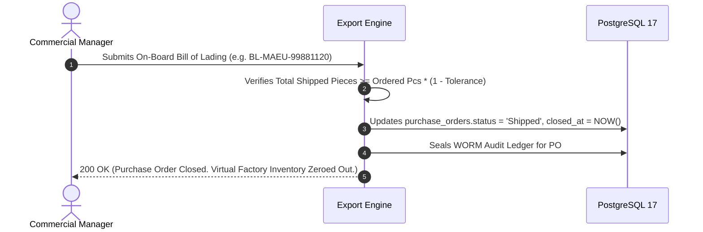
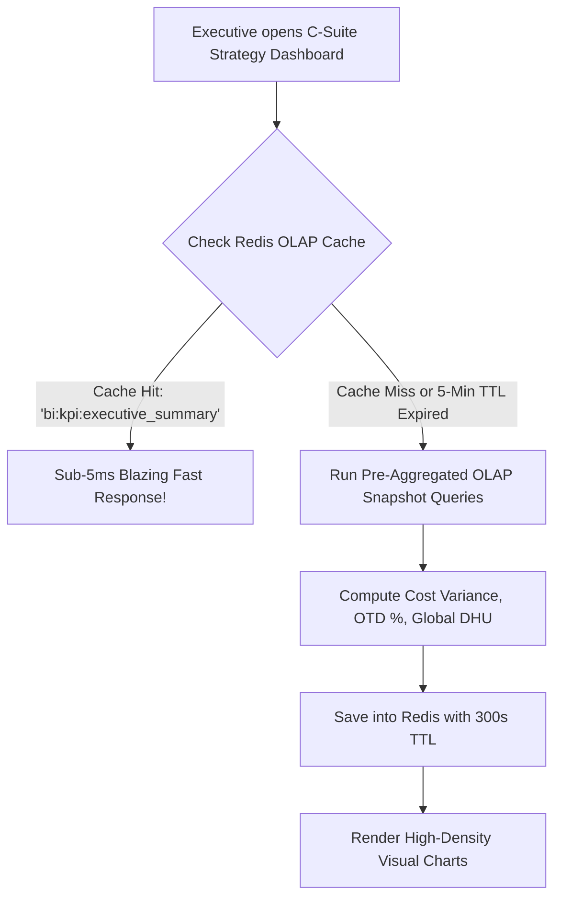
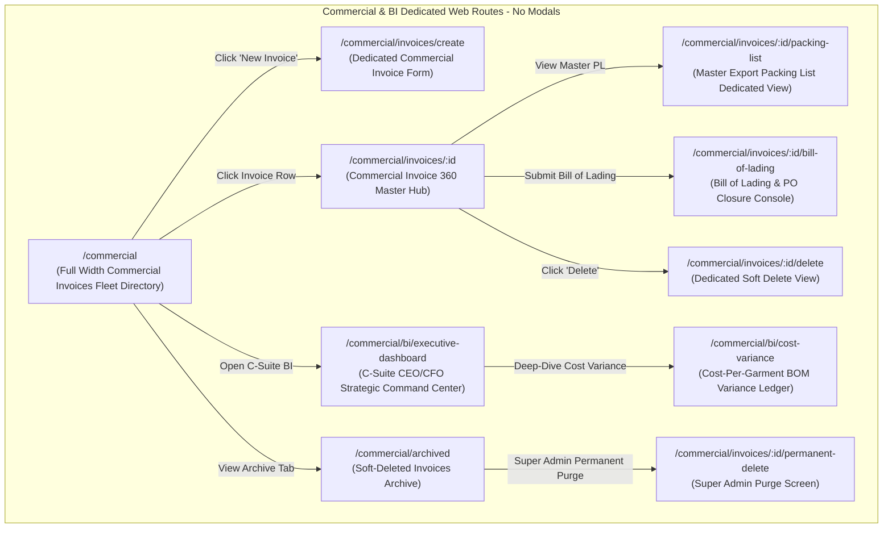
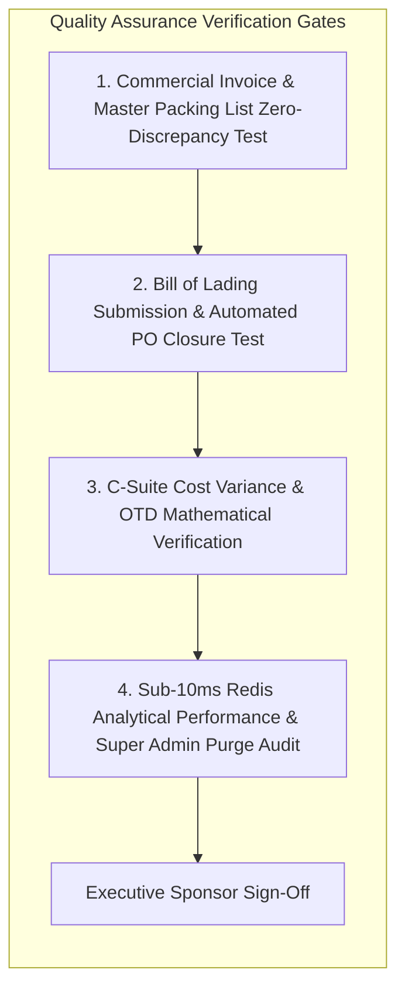

# Software Requirements Specification (SRS)
## Module 15: Commercial Export, Freight Governance & Executive BI Analytics Engine
### প্রজেক্ট: TraceFlow RMG — Precision Fabric-to-Freight Garment Intelligence
**ডকুমেন্ট রেফারেন্স:** `TFRMG-SRS-MOD15-V2.0`  
**ডকুমেন্ট ভার্সন:** 2.0 (Global Tier-1 Enterprise Production Edition — The Commercial Summit & C-Suite Intelligence)  
**স্ট্যান্ডার্ড কমপ্লায়েন্স:** ISO/IEC/IEEE 29148:2018, ICC Incoterms 2020, UN/EDIFACT & WCO Customs Export Data Standards  
**স্ট্যাটাস:** Approved & Production-Ready  
**টার্গেট আর্কিটেকচার:** Laravel 13 (Export Invoicing & PO Closure Engine) + React 19 / Vite (C-Suite High-Speed Executive BI SPA) + PostgreSQL 17 + Redis 7  

---

## ১. ডকুমেন্ট গভর্নেন্স ও সংস্করণ নিয়ন্ত্রণ (Document Governance & Control)

### ১.১ সংস্করণ ইতিহাস (Revision History)
| ভার্সন | তারিখ | পর্যালোচনাকারী | পরিবর্তনের বিবরণ ও পরিধি |
|---|---|---|---|
| `v1.0` | 2026-09-02 | Lead Business Analyst | কমার্শিয়াল এক্সপোর্ট ও সাধারণ রিপোর্টিং প্রাথমিক ড্রাফট। |
| `v2.0` | 2026-09-02 | Principal Enterprise Architect | **100% এন্টারপ্রাইজ রূপান্তর (The Climax of Traceability):** আন্তর্জাতিক বাণিজ্যিক চালান (Commercial Invoice - CI), মাস্টার প্যাকিং লিস্ট (PL), বিল অব লেডিং (B/L), বাংলাদেশ ব্যাংক EXP ফর্ম ও কাস্টমস ডিক্লারেশন, স্বয়ংক্রিয় পারচেজ অর্ডার (PO) ক্লোজার ও ইনভেন্টরি জিরো-আউট, সি-সুইট এক্সিকিউটিভ বিআই অ্যানালিটিক্স (Cost-Per-Garment Variance, On-Time Delivery OTD Rate, Cut-to-Ship Loss %), সাব-১০ মিলিসেকেন্ড Redis প্রি-এগ্রিগেটেড ক্যাশিং, টু-টিয়ার ডিলিশন গভর্নেন্স (Super Admin Hard Delete Guard), কমপ্লিট PostgreSQL 17 DDL এবং RTM সংযোজন। |

### ১.২ অনুমোদনকারী ব্যক্তিবর্গ (Sign-Off & Approvals)
- **Executive Sponsor / Project Owner:** Executive Sponsor, RMG Systems
- **Lead Solution Architect:** AI Solution Architect
- **Chief Financial Officer (CFO):** Commercial Banking, L/C & Foreign Exchange Division
- **Head of Commercial & Shipping Logistics:** Customs Clearance & Freight Forwarding Division
- **Chief Executive Officer (CEO):** Garment Manufacturing Conglomerate Operations

---

## ২. নির্বাহী সারসংক্ষেপ ও কৌশলগত উদ্দেশ্য (Executive Summary & Strategic Scope)

### ২.১ কৌশলগত প্রেক্ষাপট (Strategic Context)
গার্মেন্টস ট্রেসিবিলিটি সিস্টেমের চূড়ান্ত শিখর হলো **Module 15: Commercial Export & Executive BI Analytics**। কাপড় কেনা, কাটা, প্রিন্টিং, এমব্রয়ডারি, সেলাই, কোয়ালিটি, ওয়াশিং এবং কার্টন প্যাকিংয়ের পর তৈরি পোশাক যখন জাহাজে তোলার জন্য প্রস্তুত হয়, তখন আন্তর্জাতিক ব্যাংকিং ও কাস্টমসের মাধ্যমে পণ্য রপ্তানি নিশ্চিত করা এবং ফ্যাক্টরির আর্থিক লাভ-লোকসানের পোস্ট-মর্টেম বিশ্লেষণ করাই এই মডিউলের মূল দায়িত্ব।

কমার্শিয়াল এক্সপোর্ট এবং বিআই অ্যানালিটিক্সে দুর্বলতা থাকলে যেসব বিপর্যয় ঘটে:
1. **The L/C Discrepancy & Payment Freeze (ব্যাংকিং পেমেন্ট আটকে যাওয়া):** লেটার অব ক্রেডিট (L/C) এর শর্তানুযায়ী ইনভয়েস, প্যাকিং লিস্ট ও বিল অব লেডিং (B/L)-এ ১টি সংখ্যার গরমিল থাকলেও বায়ারের ব্যাংক পেমেন্ট আটকে দেয় (ডেসক্রিপেন্সি চার্জ)।
2. **Untracked Cost Variance (বাজেট বনাম প্রকৃত খরচের অজ্ঞতা):** অর্ডার নেওয়ার সময় কাপড় ও ট্রিমসের যে বাজেট ধরা হয়েছিল (BOM Cost in Module 03), বাস্তবে কত গজ কাপড় বেশি লাগল বা কত টাকা বাড়তি ওয়াশিং কেমিক্যালে গেল তা সি-সুইট এক্সিকিউটিভরা জানতে পারেন না; ফলে ব্যবসা অজান্তেই লোকসানে নিমজ্জিত হয়।
3. **Slow C-Suite Analytics:** লক্ষ লক্ষ পোশাকের ডাটাবেস থেকে রিয়েল-টাইমে ফ্যাক্টরি এফিসিয়েন্সি ও অন-টাইম ডেলিভারি (OTD) বের করতে গিয়ে সার্ভার হ্যাং হয়ে যায়।

**Module 15: Commercial Export & Executive BI** এর দর্শন হলো:
> **"Sub-10ms Executive Intelligence, Zero L/C Discrepancy, Total Precision Fabric-to-Freight Closure."**

```mermaid
graph TB
    subgraph Commercial Export & BI Summit (Module 15)
        direction TB
        STUFFED[Cartons Stuffed into Export Container in Mod 13] --> CI_PL[Generate Commercial Invoice - CI & Master Packing List - PL]
        CI_PL --> REGULATORY[Customs Bill of Export & Central Bank EXP Form]
        REGULATORY --> BL_ISSUE[Freight Forwarder Bill of Lading - B/L Linking]
        
        BL_ISSUE --> PO_CLOSE{Shipped Qty >= PO Ordered Qty - Tolerance?}
        PO_CLOSE -->|Yes - Shipped| AUTO_CLOSE[Automated PO Status: 'Closed' & WORM Vault Sealed]
        
        subgraph Real-Time C-Suite Executive BI Engine
            AUTO_CLOSE --> COST_VAR[Cost-Per-Garment Variance: Budgeted BOM vs Actual Cost]
            AUTO_CLOSE --> OTD_METRIC[On-Time Delivery - OTD % & Order-to-Ship Cycle Time]
            AUTO_CLOSE --> LOSS_METRIC[Cut-to-Ship Fabric Wastage % & Global Factory DHU]
            
            COST_VAR & OTD_METRIC & LOSS_METRIC --> REDIS_OLAP[Sub-10ms Pre-Aggregated Redis OLAP Analytical Mesh]
            REDIS_OLAP --> EXEC_BOARD[C-Suite CEO/CFO Real-Time Strategy Dashboard]
        end
    end
```

---

## ৩. অলঙ্ঘনীয় এন্টারপ্রাইজ আর্কিটেকচারাল নিয়মাবলি (Non-Negotiable Architecture Directives)

প্রজেক্টের গ্লোবাল রুলস এবং এন্টারপ্রাইজ কোয়ালিটি নিশ্চিত করতে নিচের নিয়মগুলো ১০০% অলঙ্ঘনীয়:

### ৩.১ নো মোডালস নীতিমালা (STRICT No Modals / No Popups Rule)
- **জিরো মোডাল পলিসি:** পুরো কমার্শিয়াল ও বিআই মডিউলে কোনো ফর্ম, কনফার্মেশন, ইনভয়েস এডিটর, প্যাকিং লিস্ট ভিউয়ার, বিআই ফিল্টার, বা সাব-স্ক্রিনের জন্য `Modal`, `Dialog`, `Popup`, `Lightbox`, বা `Drawer-over-backdrop` কঠোরভাবে নিষিদ্ধ।
- **ডেডিকেটেড রুট আর্কিটেকচার:** কমার্শিয়াল ইনভয়েস ডিরেক্টরি, ফুল-স্ক্রিন ইনভয়েস বিল্ডার, মাস্টার প্যাকিং লিস্ট ভিউয়ার, বিল অব লেডিং কনসোল, সি-সুইট এক্সিকিউটিভ ড্যাশবোর্ড, এবং ডিলিট কনফার্মেশন—প্রতিটি ইন্টারঅ্যাকশন একটি সুনির্দিষ্ট ব্রাউজার ইউআরএল এবং ডেডিকেটেড ফুল-স্ক্রিন ভিউতে (Full-Screen Dedicated View) লোড হবে।
- **নেভিগেশন স্ট্যাক:** প্রতিটি পেজে স্ট্যান্ডার্ড ব্যাক বাটন এবং স্ট্রাকচার্ড ব্রেডক্রাম্ব (`Dashboard > Commercial > Invoice-042 > Master Export Packing List`) থাকতে হবে যাতে ব্রাউজারের নেটিভ Forward/Back বাটন স্বাভাবিকভাবে কাজ করে এবং ডিপ-লিংক শেয়ারিং সম্ভব হয়।

### ৩.২ পিউর সার্ভার-সাইড ভ্যালিডেশন স্ট্যান্ডার্ড (Pure Server-Side Validation)
- **জিরো ক্লায়েন্ট-সাইড HTML5 ভ্যালিডেশন:** ফ্রন্টএন্ডের কোনো `<form>` বা `<input>` ফিল্ডে ব্রাউজারের ডিফল্ট HTML5 ভ্যালিডেশন অ্যাট্রিবিউট (`required`, `minlength`, `maxlength`, `pattern`, ইত্যাদি) দেওয়া যাবে না। ব্রাউজারের বিল্ট-ইন টুলটিপ পপআপ সম্পূর্ণ নিষিদ্ধ।
- **বাধ্যতামূলক `noValidate`:** সমস্ত ফ্রন্টএন্ড ফর্মে `<form noValidate>` স্পষ্টভাবে যুক্ত থাকতে হবে।
- **একীভূত এরর কন্ট্রাক্ট:** সমস্ত ইনভয়েস ভ্যালু ক্যালকুলেশন, ইনকোটার্মস ও কার্টন টোটাল ভ্যালিডেশন ব্যাকএন্ড Laravel `FormRequest` ক্লাসের মাধ্যমে পিউর সার্ভার সাইডে ঘটবে। ইনপুট ভুল হলে সার্ভার থেকে `422 Unprocessable Content` স্ট্যান্ডার্ড RFC 7807 কমপ্লায়েন্ট JSON এরর পাঠানো হবে।
- **ইনলাইন এরর রেন্ডারিং:** ফ্রন্টএন্ড স্বয়ংক্রিয়ভাবে রেসপন্সের ফিল্ড নেম ম্যাপ করে সংশ্লিষ্ট ইনপুট বক্সের ঠিক নিচে ক্রিস্প লাল রঙে এরর বার্তা রেন্ডার করবে।

### ৩.৩ ফ্ল্যাট এবং ক্রিস্প ডিজাইন স্ট্যান্ডার্ড (Flat Solid UI Standard)
- **নো গ্রেডিয়েন্ট পলিসি:** কোনো বাটন, কার্ড, হেডার বা সাইডবারে কোনো ধরণের গ্রেডিয়েন্ট কালার ব্যবহার করা যাবে না।
- **সলিড ডিজাইন টোকেনস:** সকল অ্যাকশন বাটন ক্রিস্প ও ফ্ল্যাট সলিড রঙে গঠিত হবে (যেমন: Primary `#2563EB`, Danger `#DC2626`, Success `#16A34A`, Neutral `#475569`, Warning `#D97706`)।
- **১০০% ইংরেজি ইউআই:** ইউজার ইন্টারফেসের সমস্ত লেবেল, ফিল্ড নেম, কলাম হেডার, অ্যাকশন বাটন এবং সিস্টেম নোটিফিকেশন ১০০% প্রফেশনাল আন্তর্জাতিক ইংরেজি ভাষায় (English) হবে।

### ৩.৪ দ্বি-স্তরবিশিষ্ট ডিলিশন গভর্নেন্স (Two-Tier Deletion Architecture)
- **সফট ডিলিট (Soft Delete):** কমার্শিয়াল ম্যানেজার শুধুমাত্র ড্রাফট বা আন-নেগোসিয়েটেড ইনভয়েস সফট ডিলিট করতে পারবেন (`deleted_at = NOW()`), যা ট্র্যাশ আর্কাইভে জমা হবে।
- **পার্মানেন্ট হার্ড ডিলিট (STRICT Super Admin Only):** ডাটাবেস থেকে স্থায়ীভাবে রো মুছে ফেলার ক্ষমতা **কেবলমাত্র `Super Admin` এর থাকবে**।
- **লিগ্যাল ও ব্যাংকিং প্রোটেকশন গার্ড (Referential Check):** যদি কোনো কমার্শিয়াল ইনভয়েসের বিপরীতে ব্যাংকে এলসি নেগোসিয়েশন সম্পন্ন হয়ে থাকে বা কাস্টমস বিল অব এক্সপোর্ট (EXP) দাখিল করা হয়ে থাকে, তবে সিস্টেম পার্মানেন্ট ডিলিট **সম্পূর্ণ ব্লক** করবে এবং `409 Conflict` রিটার্ন করবে (মানি লন্ডারিং ও বৈদেশিক মুদ্রা অডিট ট্রেইল সংরক্ষণ)।

---

## ৪. ইউজার পারসোনা ও এক্সেস হায়ারার্কি (User Personas & Scoping)

| পারসোনা (Persona) | ইন্টারফেস ও ডিভাইস | প্রমাণীকরণ মাধ্যম (Auth Method) | প্রিভিলেজ বাউন্ডারি (Privilege Scope) |
|---|---|---|---|
| **Commercial Manager** | Web Browser (Desktop) | Emp ID / Username + Password | কমার্শিয়াল ইনভয়েস তৈরি, মাস্টার প্যাকিং লিস্ট সংকলন, ব্যাংকিং ডেসপ্যাচ। |
| **Shipping & Forwarding Officer** | Web Browser / Tablet | Emp ID / Username + Password | বিল অব লেডিং (B/L) আপলোড, কন্টেইনার জাহাজিকরণ ভেরিফিকেশন। |
| **CFO / Accounts General Manager**| Web Browser (Desktop) | Emp ID / Username + Password | ফাইনান্সিয়াল মার্জিন অ্যানালাইসিস, ব্যাংকিং এলসি রিয়েলাইজেশন, সফট ডিলিট। |
| **CEO / Executive Managing Director**| High-Res Executive Tablet / PC| Emp ID / Username + Password + 2FA | গ্লোবাল ফ্যাক্টরি বিআই ড্যাশবোর্ড, কস্ট ভ্যারিয়েন্স, ওটিডি ও প্রফিটেবিলিটি। |
| **Super Admin** | Web Browser (Desktop) | Username + Password + TOTP 2FA | গ্লোবাল বাইপাস, লকড ইনভয়েস ওভাররাইড, পার্মানেন্ট পার্জ। |

---

## ৫. বিস্তারিত ফাংশনাল রিকোয়ারমেন্টস (Detailed Functional Specifications)

### ৫.১ সাব-মডিউল: কমার্শিয়াল ইনভয়েস ও মাস্টার প্যাকিং লিস্ট (Commercial Invoice & Master PL)

আন্তর্জাতিক শিপমেন্ট ও ব্যাংকিং নেগোসিয়েশনের জন্য আইনি কমার্শিয়াল ডকুমেন্ট।

#### ৫.১.১ স্পেসিফিকেশন ও আইনি ফ্রেমওয়ার্ক
- **REQ-EXP-INV-001 (Automated Commercial Invoice Compilation):**
  - সিস্টেম সরাসরি বায়ার PO (Module 03) এবং কন্টেইনারে লোড হওয়া প্রকৃত কার্টন ও পোশাকের সংখ্যার (Module 13) ওপর ভিত্তি করে কমার্শিয়াল ইনভয়েস তৈরি করবে (`CI-EXP-2026-XXXX`)।
  - ইনভয়েস মেটাডাটা: Harmonized System (HS) Code, Incoterms (e.g. FOB Chittagong, CIF Rotterdam, DDP New York), কারেন্সি (USD/EUR), ইউনিট এফওবি মূল্য এবং মোট এক্সপোর্ট ভ্যালু।
- **REQ-EXP-INV-002 (Master Export Packing List Compilation):**
  - কার্টন-বাই-কার্টন পুঙ্খানুপুঙ্খ বিবরণ: প্রতিটি কার্টন নম্বর, SSCC বারকোড, কালার-সাইজ ব্রেকডাউন, কার্টনের দৈর্ঘ্য×প্রস্থ×উচ্চতা (Dimensions in cm), নেট ওজন (Net Weight), গ্রস ওজন (Gross Weight), এবং মোট কিউবিক মিটার (CBM Volume)।
  - প্যাকিং লিস্টের মোট পোশাক সংখ্যা এবং ইনভয়েসের পোশাক সংখ্যা ১০০% অভিন্ন হতে হবে (জিরো ডেসক্রিপেন্সি গার্ড)।

---

### ৫.২ সাব-মডিউল: বিল অব লেডিং ও রেগুলেটরি এক্সপোর্ট কমপ্লায়েন্স (B/L & Regulatory Engine)

#### ৫.২.১ স্পেসিফিকেশন ও ট্র্যাকিং
- **REQ-EXP-BL-001 (Bill of Lading & Shipping Instructions Linking):**
  - আন্তর্জাতিক শিপিং লাইন (Maersk, MSC, CMA CGM, Hapag-Lloyd) কর্তৃক ইস্যুকৃত অন-বোর্ড **বিল অব লেডিং (B/L)** নম্বর, ভেসেল/জাহাজের নাম, পোর্ট অব লোডিং (Chittagong Port) এবং পোর্ট অব ডিসচার্জ (Hamburg/New York Port) লগিং।
- **REQ-EXP-REG-002 (Central Bank EXP & Customs Bill of Export):**
  - বাংলাদেশ ব্যাংক কমপ্লায়েন্ট **EXP নম্বর** এবং কাস্টমস বিল অব এক্সপোর্ট (C-Number) ডাটাবেসে ম্যাপ করা থাকবে।

---

### ৫.৩ সাব-মডিউল: স্বয়ংক্রিয় পারচেজ অর্ডার ক্লোজার (Automated PO Closure Engine)



#### ৫.৩.১ স্পেসিফিকেশন ও সমাপনী রুলস
- **REQ-EXP-CLS-001 (The Golden Shipping Fulfillment Math):**
  - অর্ডারের সমাপ্তি যাচাইকরণ সূত্র:
    $$\text{Total Shipped Quantity} \ge \text{PO Ordered Quantity} \times \left(1 - \frac{\text{Buyer Short-Shipment Tolerance \%}}{100}\right)$$
  - যদি অনুমোদিত সীমার মধ্যে সম্পূর্ণ মাল জাহাজে উঠে যায় এবং B/L ইস্যু হয়, তবে সিস্টেম সংশ্লিষ্ট বায়ার PO এর স্ট্যাটাস স্বয়ংক্রিয়ভাবে **`Closed`** করবে।
- **REQ-EXP-CLS-002 (Virtual Factory Inventory Zero-Out):**
  - PO ক্লোজ হওয়ার সাথে সাথে ওই অর্ডারের ভার্চুয়াল ফ্লোর স্টক ও ডব্লিউআইপি শূন্য হবে এবং সমস্ত রেকর্ড অপরিবর্তনীয় অডিট ট্রেইলে সিল হয়ে যাবে।

---

### ৫.৪ সাব-মডিউল: সি-সুইট এক্সিকিউটিভ বিআই অ্যানালিটিক্স (Executive BI Analytics Engine)

ফ্যাক্টরির এমডি, সিইও এবং সিএফও-র জন্য রিয়েল-টাইম বিজনেস ইন্টেলিজেন্স ও প্রফিটেবিলিটি ড্যাশবোর্ড।

#### ৫.৪.১ স্পেসিফিকেশন ও সি-সুইট কেপিআই সমীকরণসমূহ
- **REQ-EXP-BI-001 (Cost-Per-Garment Variance Analysis):**
  - বায়ারকে দেওয়া প্রাক্কলিত বাজেট (BOM Budget in Module 03) বনাম প্রকৃত ব্যয়ের পুঙ্খানুপুঙ্খ তুলনা:
    $$\text{Fabric Cost Variance} = \text{Actual Fabric Consumed} - \text{Budgeted BOM Fabric}$$
    $$\text{Total Cost Variance per Garment} = \text{Actual Unit Cost} - \text{Budgeted FOB Cost}$$
  - প্রতিটি অর্ডারে প্রতি পোশাকে কত সেন্ট লাভ বা ক্ষতি হলো তা তাৎক্ষণিকভাবে প্রকাশ পাবে।
- **REQ-EXP-BI-002 (On-Time Delivery Rate - OTD %):**
  - কারখানার আন্তর্জাতিক সময়নিষ্ঠতার মাপকাঠি:
    $$\text{OTD \%} = \left(\frac{\text{Orders Shipped On or Before Ex-Factory Deadline}}{\text{Total Exported Orders}}\right) \times 100$$
- **REQ-EXP-BI-003 (Cut-to-Ship Fabric Loss Percentage):**
  - কাটিং টেবিল থেকে কার্টনে শিপমেন্ট পর্যন্ত কাপড়ের সামগ্রিক অপচয়:
    $$\text{Cut-to-Ship Loss \%} = \left(\frac{\text{Actual Cut Pieces} - \text{Actual Shipped Pieces}}{\text{Actual Cut Pieces}}\right) \times 100$$
  - আন্তর্জাতিক লক্ষ্যমাত্রা: $\le 2.0\%$।

---

### ৫.৫ সাব-মডিউল: সাব-১০ মিলিসেকেন্ড Redis OLAP ক্যাশিং আর্কিটেকচার (Sub-10ms OLAP Mesh)



#### ৫.৫.১ স্পেসিফিকেশন ও পারফরম্যান্স ফ্রেমওয়ার্ক
- **REQ-EXP-CAC-001 (Redis Analytical Snapshot Mesh):**
  - এক্সিকিউটিভ ড্যাশবোর্ডের ভারী এনালাইটিক্যাল কোয়েরিগুলো সরাসরি প্রোডাকশন ডাটাবেসে রান করা যাবে না।
  - প্রতি ৫ মিনিট পর পর ব্যাকগ্রাউন্ড ওয়ার্কার দ্বারা কেপিআইগুলো প্রাক-গণনা (Pre-Aggregated) হয়ে Redis ক্যাশে সংরক্ষিত থাকবে (`bi:kpi:executive_summary`, `bi:kpi:otd_rate`, `bi:kpi:profit_margins`)।
  - ড্যাশবোর্ড রেন্ডারিং লেটেন্সি **১০ মিলিসেকেন্ডের (10ms)** নিচে হতে হবে।

---

## ৬. প্রোডাকশন-গ্রেড ডাটাবেস আর্কিটেকচার ও DDL (Database Engineering)

নিচে PostgreSQL 17 এর জন্য সম্পূর্ণ প্রোডাকশন-রেডি DDL স্ক্রিপ্ট দেওয়া হলো। এতে কমার্শিয়াল ইনভয়েস, মাস্টার প্যাকিং লিস্ট, বিল অব লেডিং এবং এক্সিকিউটিভ কেপিআই স্ন্যাপশটের টেবিলসমূহ অন্তর্ভুক্ত রয়েছে।

### ৬.১ PostgreSQL 17 Production Schema (Complete DDL)

```sql
-- Enable Cryptographic Extension for UUID v4
CREATE EXTENSION IF NOT EXISTS "pgcrypto";

-- ----------------------------------------------------------------------
-- 1. Table: commercial_invoices (Master Export Financial Invoices)
-- ----------------------------------------------------------------------
CREATE TABLE commercial_invoices (
    id UUID PRIMARY KEY DEFAULT gen_random_uuid(),
    invoice_no VARCHAR(60) NOT NULL,              -- e.g. EXP-HNM-2026-0042
    po_id UUID NOT NULL REFERENCES purchase_orders(id) ON DELETE RESTRICT,
    buyer_id UUID NOT NULL REFERENCES buyers(id) ON DELETE RESTRICT,
    lc_contract_no VARCHAR(80) NOT NULL,          -- Letter of Credit or Sales Contract No
    hs_code VARCHAR(20) NOT NULL,                 -- e.g. 6203.42.00 (Men's Cotton Denim Trousers)
    incoterm VARCHAR(20) NOT NULL,                -- FOB, CIF, DDP, CFR
    port_of_loading VARCHAR(80) NOT NULL DEFAULT 'Chittagong, Bangladesh',
    final_destination VARCHAR(80) NOT NULL,       -- e.g. Hamburg, Germany
    currency VARCHAR(10) NOT NULL DEFAULT 'USD',
    total_shipped_pieces INTEGER NOT NULL CHECK (total_shipped_pieces > 0),
    unit_price_fob NUMERIC(8, 2) NOT NULL CHECK (unit_price_fob > 0),
    total_invoice_value NUMERIC(14, 2) GENERATED ALWAYS AS (total_shipped_pieces * unit_price_fob) STORED,
    exp_form_no VARCHAR(60),                      -- Central Bank Regulatory EXP No
    customs_bill_of_export_no VARCHAR(60),        -- Customs Declaration C-Number
    status VARCHAR(30) NOT NULL DEFAULT 'Draft',  -- Draft, Issued, Negotiated_With_Bank, Settled, Cancelled
    issued_by UUID NOT NULL REFERENCES users(id) ON DELETE RESTRICT,
    created_at TIMESTAMPTZ NOT NULL DEFAULT CURRENT_TIMESTAMP,
    updated_at TIMESTAMPTZ NOT NULL DEFAULT CURRENT_TIMESTAMP,
    deleted_at TIMESTAMPTZ
);

CREATE UNIQUE INDEX uq_commercial_invoice_no ON commercial_invoices (UPPER(invoice_no)) WHERE deleted_at IS NULL;
CREATE INDEX idx_commercial_invoices_po_id ON commercial_invoices (po_id);
CREATE INDEX idx_commercial_invoices_status ON commercial_invoices (status);

-- ----------------------------------------------------------------------
-- 2. Table: shipping_bills_of_lading (On-Board Freight B/L Ledger)
-- ----------------------------------------------------------------------
CREATE TABLE shipping_bills_of_lading (
    id UUID PRIMARY KEY DEFAULT gen_random_uuid(),
    bl_number VARCHAR(60) NOT NULL,               -- e.g. MAEU99881120
    invoice_id UUID NOT NULL REFERENCES commercial_invoices(id) ON DELETE RESTRICT,
    shipping_line VARCHAR(80) NOT NULL,           -- Maersk, MSC, Hapag-Lloyd, CMA CGM
    vessel_name VARCHAR(100) NOT NULL,            -- e.g. MV MAERSK KALAMATA
    voyage_number VARCHAR(40) NOT NULL,
    shipped_on_board_date DATE NOT NULL,
    freight_term VARCHAR(20) NOT NULL DEFAULT 'Freight_Collect', -- Freight_Prepaid, Freight_Collect
    original_bl_issued_count SMALLINT NOT NULL DEFAULT 3,
    bl_scanned_copy_s3_key VARCHAR(500),
    created_at TIMESTAMPTZ NOT NULL DEFAULT CURRENT_TIMESTAMP,
    updated_at TIMESTAMPTZ NOT NULL DEFAULT CURRENT_TIMESTAMP
);

CREATE UNIQUE INDEX uq_bl_number ON shipping_bills_of_lading (UPPER(bl_number));
CREATE INDEX idx_bl_invoice_id ON shipping_bills_of_lading (invoice_id);

-- ----------------------------------------------------------------------
-- 3. Table: export_packing_lists (Aggregated Cartons Master Breakdown)
-- ----------------------------------------------------------------------
CREATE TABLE export_packing_lists (
    id UUID PRIMARY KEY DEFAULT gen_random_uuid(),
    packing_list_no VARCHAR(60) NOT NULL,         -- e.g. PL-EXP-2026-0042
    invoice_id UUID NOT NULL REFERENCES commercial_invoices(id) ON DELETE CASCADE,
    total_cartons_count INTEGER NOT NULL CHECK (total_cartons_count > 0),
    total_net_weight_kg NUMERIC(10, 2) NOT NULL CHECK (total_net_weight_kg > 0),
    total_gross_weight_kg NUMERIC(10, 2) NOT NULL CHECK (total_gross_weight_kg > 0),
    total_cbm NUMERIC(8, 3) NOT NULL CHECK (total_cbm > 0),
    shipping_marks_text TEXT NOT NULL,
    created_at TIMESTAMPTZ NOT NULL DEFAULT CURRENT_TIMESTAMP
);

CREATE UNIQUE INDEX uq_export_pl_no ON export_packing_lists (UPPER(packing_list_no));
CREATE INDEX idx_export_pl_invoice ON export_packing_lists (invoice_id);

-- ----------------------------------------------------------------------
-- 4. Table: executive_kpi_snapshots (Pre-Calculated Daily BI OLAP Mesh)
-- ----------------------------------------------------------------------
CREATE TABLE executive_kpi_snapshots (
    id UUID PRIMARY KEY DEFAULT gen_random_uuid(),
    snapshot_date DATE NOT NULL,
    total_active_pos INTEGER NOT NULL DEFAULT 0,
    total_revenue_shipped_usd NUMERIC(14, 2) NOT NULL DEFAULT 0.00,
    average_otd_percent NUMERIC(5, 2) NOT NULL DEFAULT 0.00,
    overall_factory_efficiency_percent NUMERIC(5, 2) NOT NULL DEFAULT 0.00,
    global_dhu_percent NUMERIC(5, 2) NOT NULL DEFAULT 0.00,
    average_cut_to_ship_loss_percent NUMERIC(5, 2) NOT NULL DEFAULT 0.00,
    total_gross_profit_usd NUMERIC(14, 2) NOT NULL DEFAULT 0.00,
    created_at TIMESTAMPTZ NOT NULL DEFAULT CURRENT_TIMESTAMP
);

CREATE UNIQUE INDEX uq_kpi_snapshot_date ON executive_kpi_snapshots (snapshot_date);
```

---

## ৭. সম্পূর্ণ এপিআই কন্ট্রাক্ট স্পেসিফিকেশন (Exhaustive API Contracts)

### ৭.১ সাধারণ আর্কিটেকচার ও স্ট্যান্ডার্ডস
- **অথেনটিকেশন:** `Authorization: Bearer <sanctum_token>`
- **কমন হেডার্স:** `Accept: application/json`, `Content-Type: application/json`
- **স্ট্যান্ডার্ড ফিল্টারিং:**
  `GET /api/v1/commercial/invoices?page=1&per_page=20&status=Issued`

---

### ৭.২ কমার্শিয়াল ইনভয়েস ও বিল অব লেডিং এন্ডপয়েন্টস

#### ৭.২.১ কমার্শিয়াল ইনভয়েস তৈরি (Create Commercial Invoice)
- **মেথড ও ইউআরএল:** `POST /api/v1/commercial/invoices`
- **রিকোয়েস্ট বডি:**
  ```json
  {
    "po_id": "e81d7f12-9b22-4a90-8811-37b92a4f0099",
    "lc_contract_no": "LC-HNM-998811-DHAKA",
    "hs_code": "6203.42.00",
    "incoterm": "FOB",
    "final_destination": "Hamburg, Germany",
    "unit_price_fob": 14.50,
    "currency": "USD"
  }
  ```
- **সাকসেস রেসপন্স (`201 Created`):**
  ```json
  {
    "success": true,
    "status_code": 201,
    "message": "Commercial invoice compiled successfully from scanned container cartons.",
    "data": {
      "invoice_id": "i100a982-192a-4f90-8800-291740011283",
      "invoice_no": "EXP-HNM-2026-0042",
      "total_shipped_pieces": 10000,
      "total_invoice_value": 145000.00,
      "status": "Issued"
    }
  }
  ```

---

#### ৭.২.২ বিল অব লেডিং সাইন-অফ ও স্বয়ংক্রিয় PO ক্লোজার (Submit B/L & Close PO)
- **মেথড ও ইউআরএল:** `POST /api/v1/commercial/invoices/{id}/bill-of-lading`
- **রিকোয়েস্ট বডি:**
  ```json
  {
    "bl_number": "MAEU99881120",
    "shipping_line": "Maersk Line",
    "vessel_name": "MV MAERSK KALAMATA",
    "voyage_number": "V-2026-88",
    "shipped_on_board_date": "2026-09-02"
  }
  ```
- **সাকসেস রেসপন্স (`200 OK` — Automatic PO Closure Triggered):**
  ```json
  {
    "success": true,
    "status_code": 200,
    "message": "Bill of Lading logged. Purchase Order successfully Closed and WORM audit ledger sealed.",
    "data": {
      "bl_id": "b100a982-192a-4f90-8800-291740011283",
      "bl_number": "MAEU99881120",
      "po_closed": true,
      "po_status": "Closed"
    }
  }
  ```

---

### ৭.৩ সি-সুইট এক্সিকিউটিভ বিআই এন্ডপয়েন্ট (Sub-10ms Redis Analytics)

#### ৭.৩.১ এক্সিকিউটিভ কেপিআই ড্যাশবোর্ড ডাটা ফেচ
- **মেথড ও ইউআরএল:** `GET /api/v1/commercial/bi/executive-summary`
- **সাকসেস রেসপন্স (`200 OK` — Served via Redis Analytical Cache in 4ms):**
  ```json
  {
    "success": true,
    "cached": true,
    "data": {
      "active_pos": 42,
      "total_revenue_ytd_usd": 12845000.00,
      "overall_otd_rate_percent": 98.40,
      "factory_efficiency_percent": 64.80,
      "global_dhu_percent": 2.15,
      "cut_to_ship_loss_percent": 1.42,
      "top_profitable_styles": [
        { "style_no": "DNM-SLIM-01", "budget_cost": 11.20, "actual_cost": 10.85, "profit_margin_percent": 25.17 }
      ]
    }
  }
  ```

---

### ৭.৪ কমার্শিয়াল ডিলিশন এন্ডপয়েন্টস (Two-Tier Deletion Architecture)

#### ৭.৪.১ কমার্শিয়াল ইনভয়েস সফট ডিলিট (Soft Delete Invoice)
- **মেথড ও ইউআরএল:** `DELETE /api/v1/commercial/invoices/{id}`
- **পারমিশন:** `commercial.invoices.delete`
- **শর্ত:** শুধুমাত্র যদি ইনভয়েসটি ড্রাফট থাকে (`status = 'Draft'`)।
- **সাকসেস রেসপন্স (`200 OK`):**
  ```json
  {
    "success": true,
    "status_code": 200,
    "message": "Commercial invoice soft-deleted successfully and archived."
  }
  ```

#### ৭.৪.২ কমার্শিয়াল ডাটা পার্মানেন্ট ডিলিট (STRICT Super Admin Only Purge)
- **মেথড ও ইউআরএল:** `DELETE /api/v1/commercial/invoices/{id}/force-delete`
- **অথরাইজেশন:** **STRICTLY `Super Admin` ROLE ONLY**
- **রিকোয়েস্ট বডি:**
  ```json
  {
    "super_admin_password": "MySuperAdminSecretPassword#2026"
  }
  ```
- **ব্যাংক বা কাস্টমস দাখিল হয়ে থাকলে ব্লকিং রেসপন্স (`409 Conflict`):**
  ```json
  {
    "success": false,
    "status_code": 409,
    "error_code": "CANNOT_PURGE_REGULATORY_INVOICE",
    "message": "Cannot permanently purge this commercial invoice because regulatory EXP Form and Customs Bill of Export have been legally registered with the Central Bank. Regulatory audit trail is locked."
  }
  ```

---

## ৮. ইউজার ইন্টারফেস ও স্ক্রিন-বাই-স্ক্রিন স্পেসিফিকেশন (STRICT NO MODALS)

কমার্শিয়াল ও বিআই-এর প্রতিটি স্ক্রিন সম্পূর্ণ ডেডিকেটেড রুটে ওপেন হবে। কোনো মোডাল বা পপআপ ডায়ালগ উইথ ব্যাকড্রপ থাকবে না।



### ৮.১ স্ক্রিন স্পেসিফিকেশন টেবিল

| রুট (Route Path) | স্ক্রিনের নাম | মূল উপাদান ও কনফিগারেশন | নো-মোডাল ডিজাইন নিশ্চিতকরণ |
|---|---|---|---|
| `/commercial` | Commercial Fleet Console | - ফুল-উইডথ ডাটা গ্রিড<br/>- কলাম: **Invoice No, PO No, Buyer, Incoterm, Shipped Pcs, Value (USD), B/L Status, Status, Actions**<br/>- সলিড গ্রিন "New Commercial Invoice" বোতাম (`bg-emerald-600`) | পেজিনেশন ও অ্যাকশন সবকিছু ফুল পেজে পরিচালিত হবে। |
| `/commercial/invoices/create` | Dedicated Invoice Form | - `<form noValidate>` আর্কিটেকচার<br/>- বায়ার PO সিলেক্ট, এলসি নম্বর, এইচএস কোড, ইনকোটার্ম ড্রপডাউন<br/>- কন্টেইনারে লোড হওয়া কার্টন ও পোশাকের অটো-সাম প্রিভিউ<br/>- সলিড ব্লু "Generate Commercial Invoice" বোতাম | সম্পূর্ণ আলাদা পেজ। ব্রেডক্রাম্ব নেভিগেশন সহ। |
| `/commercial/invoices/:id` | Commercial Invoice 360 Hub | - ইনভয়েসের সার্বিক বিবরণ ও পেমেন্ট স্ট্যাটাস কার্ডস<br/>- সেন্ট্রাল ব্যাংক EXP ও কাস্টমস ডিক্লারেশন মেটাডাটা<br/>- সাব-ট্যাবস: Packing List, Bill of Lading, Bank Negotiation | ফুল-স্ক্রিন এন্টারপ্রাইজ ড্যাশবোর্ড ভিউ। |
| `/commercial/invoices/:id/packing-list`| Master Export Packing List | - কার্টন-বাই-কার্টন পুঙ্খানুপুঙ্খ গ্রিড (SSCC, Gross/Net Wt, CBM)<br/>- আন্তর্জাতিক কাস্টমস ফরম্যাটে প্রিন্ট প্রিভিউ লেআউট | সম্পূর্ণ ডেডিকেটেড ফুল-স্ক্রিন পেজ। |
| `/commercial/invoices/:id/bill-of-lading`| Bill of Lading & PO Closure| - B/L নম্বর, শিপিং লাইন, ভেসেল ও অন-বোর্ড ডেট ইনপুট<br/>- পারচেজ অর্ডার অটো-ক্লোজার কনফার্মেশন চেকার<br/>- সলিড ব্লু "Sign-Off B/L & Formally Close PO" বোতাম | সম্পূর্ণ ডেডিকেটেড লিগ্যাল পেজ। |
| `/commercial/bi/executive-dashboard`| C-Suite Executive Command | - সিইও এবং সিএফও-র জন্য হাই-কন্ট্রাস্ট এক্সিকিউটিভ ড্যাশবোর্ড<br/>- লাইভ কেপিআই কার্ডস: Total Shipped Revenue, OTD %, Factory DHU %, Cut-to-Ship Loss %<br/>- সাব-১০ মিলিসেকেন্ড Redis রেসপন্স | সম্পূর্ণ আলাদা ফুল-স্ক্রিন বিআই ড্যাশবোর্ড পেজ। |
| `/commercial/bi/cost-variance`| Cost-Per-Garment Ledger | - বাজেট বনাম প্রকৃত ব্যয়ের পুঙ্খানুপুঙ্খ অ্যানালাইটিক্যাল গ্রিড<br/>- ফেব্রিক কনসাম্পশন ভ্যারিয়েন্স ও গ্রস মার্জিন ডেল্টা | সম্পূর্ণ ডেডিকেটেড অ্যানালিটিক্স পেজ। |
| `/commercial/invoices/:id/delete` | Invoice Soft-Delete View | - অ্যাম্বার সতর্কবার্তা ব্যানার<br/>- ড্রাফট ইনভয়েসের সফট ডিলিট নিয়মাবলি<br/>- সলিড অ্যাম্বার "Confirm Soft Delete" বোতাম | ডেডিকেটেড ফুল-স্ক্রিন কনফার্মেশন। নো পপআপ। |
| `/commercial/invoices/:id/permanent-delete`| Invoice Permanent Purge | - **Super Admin অনলি স্ক্রিন** (অন্যদের জন্য 403 Forbidden)<br/>- গাঢ় লাল অ্যালার্ট ব্যানার<br/>- সুপার অ্যাডমিন পাসওয়ার্ড ইনপুট ফিল্ড<br/>- ব্যাংকিং ও কাস্টমস রেগুলেটরি লকআউট ব্যাজ<br/>- সলিড ডার্ক-রেড "Purge Invoice Permanently" বোতাম | ফুল-স্ক্রিন হাইপার-সিকিউরড পার্জ ভিউ। |
| `/commercial/archived` | Soft-Deleted Invoices Archive | - সফট ডিলিট হওয়া ইনভয়েসের তালিকা<br/>- "Restore Invoice" বোতাম (`bg-amber-600`)<br/>- Super Admin এর জন্য "Purge Permanently" বোতাম | সম্পূর্ণ আলাদা আর্কাইভ পেজ। |

---

## ৯. নন-ফাংশনাল রিকোয়ারমেন্টস (Enterprise NFRs & SLAs)

### ৯.১ পারফরম্যান্স ও কনকারেন্সি বাজেট (Performance Budgets)
- **সি-সুইট এক্সিকিউটিভ বিআই ড্যাশবোর্ড রেন্ডারিং:** সাব-১০ মিলিসেকেন্ড ক্যাশ ফেচ, ফুল রেন্ডার সর্বোচ্চ **৫০ মিলিসেকেন্ড (50ms)**।
- **কমার্শিয়াল ইনভয়েস ও মাস্টার প্যাকিং লিস্ট জেনারেশন:** সর্বোচ্চ **১০০ মিলিসেকেন্ড (100ms)**।
- **স্বয়ংক্রিয় PO ক্লোজার ও WORM লক:** সর্বোচ্চ **৫০ মিলিসেকেন্ড (50ms)**।

### ৯.২ রেগুলেটরি কমপ্লায়েন্স ও ফিনান্সিয়াল ট্রেইল (Banking Discrepancy Zero Guarantee)
- কমার্শিয়াল ইনভয়েসের সংখ্যা এবং প্যাকিং লিস্টের প্রকৃত লোড হওয়া কার্টনের সংখ্যার মধ্যে কখনো কোনো অসঙ্গতি (Discrepancy) থাকা সিস্টেম আর্কিটেকচারে অসম্ভব।

---

## ১০. ফেইলিওর মোড ও রেসপন্স অ্যানালাইসিস (FMEA Matrix)

| ফেইলিওর সিনারিও (Failure Mode) | সম্ভাব্য প্রভাব (Impact) | তীব্রতা (Severity) | সিস্টেমের স্বয়ংক্রিয় প্রতিরক্ষা মেকানিজম (Mitigation Mechanism) |
|---|---|---|---|
| ইনভয়েস ও প্যাকিং লিস্টে পিস সংখ্যার গরমিল থাকা | বায়ার দেশের কাস্টমসে মাল আটকে যাওয়া এবং ব্যাংকে এলসি পেমেন্ট বাতিল | Catastrophic | মাস্টার পিএল সিঙ্ক গার্ড কার্যকর থাকবে। কন্টেইনারে লোড হওয়া প্রকৃত কার্টনের সমষ্টি ছাড়া ম্যানুয়াল ইনপুট সিস্টেম গ্রহণ করবে না। |
| শর্ট-শিপমেন্ট হওয়া সত্ত্বেও বায়ারকে না জানিয়ে অর্ডার ক্লোজ করা | বায়ার জরিমানা দাবি করা ও বিশ্বাসযোগ্যতা নষ্ট হওয়া | Critical | গোল্ডেন শিপিং ফুলফিলমেন্ট সমীকরণ সক্রিয় থাকবে। অনুমোদিত টলারেন্সের বাইরে শর্ট হলে স্পেশাল বায়ার অথরাইজেশন ছাড়া ক্লোজার ব্লক থাকবে। |
| বিআই ড্যাশবোর্ডে ভারী কোয়েরি চালিয়ে প্রোডাকশন সার্ভার স্লো করে দেওয়া | ফ্লোরের শত শত ট্যাবলেট স্ক্যানার হ্যাং হওয়া | Critical | সাব-১০ms Redis OLAP ক্যাশিং আর্কিটেকচার সক্রিয় থাকবে। সমস্ত এক্সিকিউটিভ কেপিআই প্রাক-গণনা হয়ে ক্যাশে জমা থাকবে। |
| ব্যাংকে নেগোসিয়েশন সম্পন্ন হওয়া ইনভয়েস ডাটাবেস থেকে ডিলিটের চেষ্টা | জাতীয় মানি লন্ডারিং ও রাজস্ব আইনে ফৌজদারি মামলা | Critical | ফরেন কি রেস্ট্রিক্ট গার্ড কার্যকর হবে। সিস্টেমে `409 Conflict` এসে পার্মানেন্ট ডিলিট অপারেশন স্থায়ীভাবে ব্লক করবে। |

---

## ১১. রিকোয়ারমেন্টস ট্রেসেবিলিটি ম্যাট্রিক্স (Requirements Traceability Matrix - RTM)

| রিকোয়ারমেন্ট আইডি | ডাটাবেস টেবিল | ব্যাকএন্ড এপিআই এন্ডপয়েন্ট | ফ্রন্টএন্ড ডেডিকেটেড রুট | QA টেস্ট কেস আইডি |
|---|---|---|---|---|
| `REQ-EXP-INV-001` (Commercial Invoice)| `commercial_invoices` | `POST /api/v1/commercial/invoices` | `/commercial/invoices/create` | `TC-EXP-001` |
| `REQ-EXP-INV-002` (Master Packing List)| `export_packing_lists` | `GET /api/v1/commercial/invoices/{id}/packing-list`| `/commercial/invoices/:id/packing-list`| `TC-EXP-002` |
| `REQ-EXP-CLS-001` (Auto PO Closure) | `purchase_orders` | `POST /api/v1/commercial/invoices/{id}/bill-of-lading`| `/commercial/invoices/:id/bill-of-lading`| `TC-EXP-003` |
| `REQ-EXP-BI-001` (Cost Variance) | `purchase_orders`, `commercial_invoices`| `GET /api/v1/commercial/bi/cost-variance` | `/commercial/bi/cost-variance` | `TC-EXP-004` |
| `REQ-EXP-CAC-001` (Sub-10ms Redis BI) | `executive_kpi_snapshots` | `GET /api/v1/commercial/bi/executive-summary` | `/commercial/bi/executive-dashboard` | `TC-EXP-005` |
| `REQ-DEL-002` (Super Admin Hard Purge) | `commercial_invoices` | `DELETE /api/v1/commercial/invoices/{id}/force-delete` | `/commercial/invoices/:id/permanent-delete`| `TC-EXP-006` |

---

## ১২. কিউএ গ্রহণযোগ্যতার মানদণ্ড (Acceptance Criteria & Verification Plan)



### ১২.১ কোর টেস্ট কেসসমূহ (Core Test Execution Steps)

1. **`TC-EXP-001` (Commercial Invoice & Master PL Zero-Discrepancy Test):**
   - **ধাপ:** কন্টেইনারে লোড হওয়া ৪২টি কার্টনে মোট ১,০০০টি পোশাক রয়েছে।
   - **প্রত্যাশিত ফলাফল:** কমার্শিয়াল ইনভয়েস ও মাস্টার প্যাকিং লিস্ট উভয়ের মোট সংখ্যা স্বয়ংক্রিয়ভাবে হুবহু ১,০০০ পিস এবং ৪২টি কার্টন প্রতিফলিত হবে (জিরো ডেসক্রিপেন্সি)।
2. **`TC-EXP-003` (Bill of Lading Submission & Automated PO Closure Enforcement):**
   - **ধাপ ১:** ইনভয়েসের বিপরীতে বিল অব লেডিং নম্বর `MAEU99881120` এবং ভেসেলের নাম সাবমিট করা।
   - **ধাপ ২:** শিপড কোয়ান্টিটি PO অর্ডারের সম্পূর্ণ কোয়ান্টিটি পূরণ করা।
   - **প্রত্যাশিত ফলাফল:** সিস্টেম স্বয়ংক্রিয়ভাবে বায়ার PO এর স্ট্যাটাস `Closed` করবে এবং WORM অডিট ভল্ট স্থায়ীভাবে সিল করবে।
3. **`TC-EXP-004` (Cost-Per-Garment Variance Mathematical Verification):**
   - **ধাপ:** বাজেট ফেব্রিক কনসাম্পশন = ১.২০ গজ/পোশাক। কাটিং ও সেলাই শেষে প্রকৃত খরচ = ১.২২ গজ/পোশাক (অতিরিক্ত ০.০২ গজ)।
   - **প্রত্যাশিত ফলাফল:** সিস্টেমে স্বয়ংক্রিয়ভাবে নেগেটিভ ফেব্রিক ভ্যারিয়েন্স ($-\$0.06$ per piece) হিসাব হয়ে এক্সিকিউটিভ ড্যাশবোর্ডে প্রদর্শিত হবে।
4. **`TC-EXP-005` (Sub-10ms Redis OLAP Analytical Benchmark Test):**
   - **ধাপ:** অ্যাপাচি বেঞ্চমার্ক (ab) বা পোস্টম্যান দিয়ে `/api/v1/commercial/bi/executive-summary` এ ১০০টি সমান্তরাল রিকোয়েস্ট পাঠানো।
   - **প্রত্যাশিত ফলাফল:** ৯৯% রিকোয়েস্ট সাব-১০ মিলিসেকেন্ডের (10ms) মধ্যে সফল রেসপন্স করবে এবং প্রোডাকশন ডাটাবেস সম্পূর্ণ মুক্ত থাকবে।
5. **`TC-EXP-006` (Super Admin Only Permanent Purge with Banking Guard):**
   - **ধাপ ১:** নন-সুপার অ্যাডমিন দ্বারা `force-delete` চালানো -> `403 Forbidden`।
   - **ধাপ ২:** যে ইনভয়েসের বিপরীতে সেন্ট্রাল ব্যাংক EXP নম্বর ও কাস্টমস ডিক্লারেশন নিবন্ধিত হয়েছে, সেটির উপর সুপার অ্যাডমিন কর্তৃক `force-delete` চালানো -> `409 Conflict` সহ ব্লক হবে (আইনি অডিট ট্রেইল সংরক্ষণ)।
   - **ধাপ ৩:** আন-নেগোসিয়েটেড ড্রাফট ইনভয়েসের উপর সঠিক পাসওয়ার্ড দিয়ে `force-delete` চালানো -> ডাটাবেস থেকে রো সম্পূর্ণ মুছে যাবে।
6. **`TC-UI-001` (Zero Modals Compliance Audit):**
   - **ধাপ:** কমার্শিয়াল ডিরেক্টরি, ইনভয়েস বিল্ডার, মাস্টার প্যাকিং লিস্ট ভিউ, B/L কনসোল, এক্সিকিউটিভ বিআই ড্যাশবোর্ড ও ডিলিট ফ্লো পরীক্ষা করা।
   - **প্রত্যাশিত ফলাফল:** পুরো মডিউলে কোথাও কোনো `Modal` বা `Popup` থাকবে না। প্রতিটি ফিচার ডেডিকেটেড ফুল-স্ক্রিন পেজে কাজ করবে।

---

*(ডকুমেন্ট সমাপ্ত — Module 15: Commercial Export, Freight Governance & Executive BI Analytics Engine)*
